# PG — Présentation Générale

_Pages 1–42 du PDF source._

> **Note de version (V06.09).** Le PDF source utilise le suivi de modifications (légende p.36 : « Texte barré jaune = texte supprimé »). Passages **barrés** rendus ici en `~~texte~~`. Suppressions marquées dans cette section : le paragraphe SP03/C2S sur le « dépassement autorisé (DA) » hors parcours de soins (p.32). Détection reproductible via `detect_strikethrough.py`.

<!-- p.1 -->
PG  -  Présentation Générale

<!-- ex-figure p.1 (couverture) supprimée -->

<!-- p.2 -->
PG - Présentation Générale
ou reproduction (intégrale ou partielle) du présent ouvrage, quel que soit le support utilisé, doit
être soumise à l’accord préalable écrit de son auteur.
quel que soit le procédé utilisé.
L 335-2 et suivants du code de la propriété intellectuelle, susceptible d’entraîner des sanctions
pour l’auteur du délit.
CONTACTS
Pour toute question technique ou fonctionnelle, contactez le Centre de services :
•
e-mail : centre-de-service@sesam-vitale.fr

<!-- p.3 -->
PG - Présentation Générale
1
1.1
1.2
1.3
1.4
1.5
1.6
1.7
2
2.1
2.2
2.3
2.4
2.4.1
2.4.2
2.4.3
2.4.4
2.4.5
2.4.5.1
2.4.5.2
2.4.5.3
2.5
2.6
2.7
3
3.1
3.2
3.3
4
4.1
4.1.1
4.1.2
4.2
4.2.1
4.2.2
4.3
4.3.1
4.3.2

<!-- p.4 -->
PG - Présentation Générale
5
5.1
5.2
5.3
5.3.1
5.3.2
5.3.3
5.4
5.5
6
ANNEXE 1
ANNEXE 2
TABLE DES ILLUSTRATIONS

<!-- p.5 -->
PG - Présentation Générale

## 1 INTRODUCTION

### 1.1 Objet du document

Ce document a pour objet de spécifier les règles de facturation liées au processus
« Facturer individuellement en ES - ACE ».
Il remplace le « Cahier des charges des règles de facturation des actes et consultation
externes (ACE) » (version 0 du 6 mai 2010).
L’objectif est d’avoir un socle documentaire de référence partagé avec les différents acteurs,
évolutif et exhaustif.
Ce document fait partie d’un dossier de SFG (cf. §1.4) et constitue la « Présentation
Générale » de ce dossier.

### 1.2 Principes de rédaction des SFG

Les SFG s’articulent autour des principes suivants :
 Les SFG s’appuient sur un processus fonctionnel qui est découpé en :
○ sous-processus, puis en
○ fonctions, puis en
○ sous-fonctions, puis en
○ opérations, puis en
○ règles de gestion (RG).
 Le processus, sous-processus, et règles de gestion sont définis pour le cas nominal.
 Des situations particulières (C2S, AME, etc.) permettent d’identifier la modification de
tout ou partie du processus, sous-processus, ou des règles de gestion.
 La règle de gestion est l’élément le plus fin.
Ci-dessous, une illustration du découpage du processus fonctionnel :
Figure 1 : Illustration des principes de découpage du processus fonctionnel
 Les règles de gestion s’appuient sur des Entités Fonctionnelles (EF) dont on décrit les
attributs (données). Les Entités Fonctionnelles et leurs données sont regroupées dans
le document « DICO ».
Processus
1
Sous-processus
2
Fonction
3
Sous-fonction
4
Entités fonctionnelles
(objets)
Règles de gestion
Situations
particulières

<!-- p.6 -->
PG - Présentation Générale
○ Les données sont nécessaires pour l’expression des règles.
○ Certaines règles nécessitant des « listes de valeurs », ces dernières sont
externalisées dans le document spécifique « TABLES ».
○ Les Règles de Gestion et les Données sont référencées.
Ci-dessous, une illustration de la rédaction d’une règle de gestion :
Figure 2 : Illustration des principes de rédaction d’une règle de gestion

### 1.3 Statut du document

De référence.
Référencement de la règle
de gestion (avec le nom de
la fonction utilisatrice)
Référencement de la donnée (avec le nom
de la fonction créatrice)
Référence à la  liste de valeur utilisée (table)
Spécification de la règle pour le cas particulier ou
la situation particulière impactée

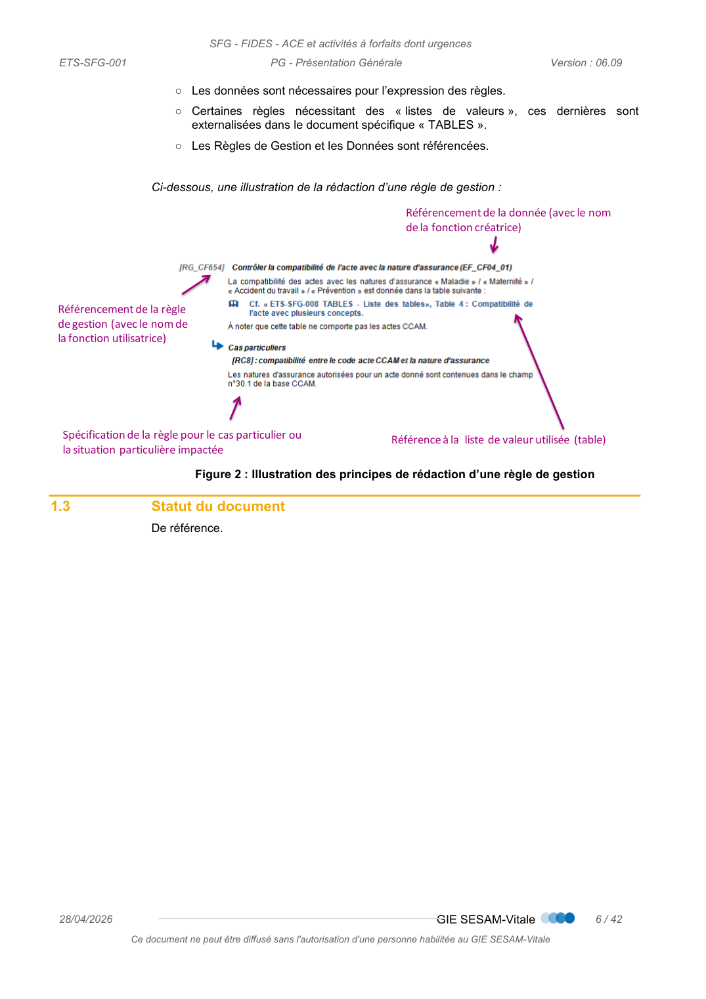
*Figure (p.6) : Figure 2 : Illustration des principes de rédaction d’une règle de gestion*

<!-- p.7 -->
PG - Présentation Générale

### 1.4 Positionnement du document dans le dossier de SFG

Ce document se positionne comme suit dans l’architecture documentaire de ces
Spécifications Fonctionnelles Générales (SFG) :
Figure 3 : Schéma de l'architecture documentaire

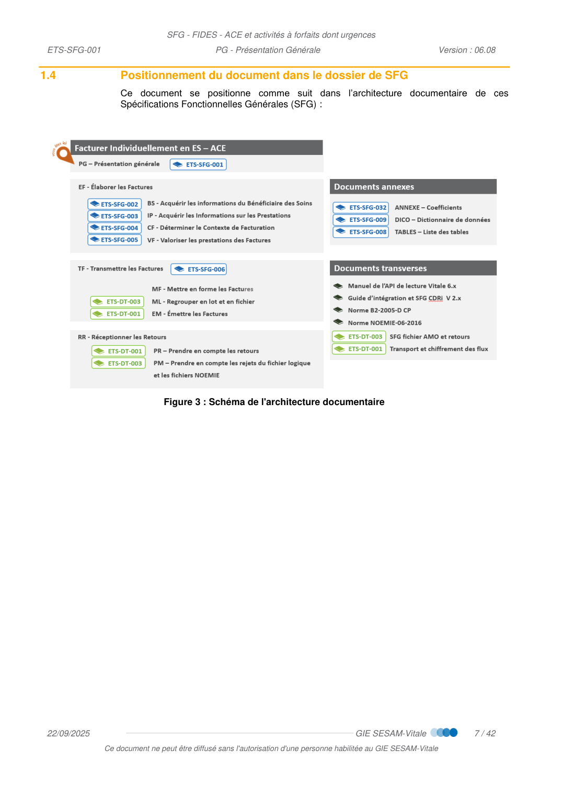
*Figure (p.7) : Figure 3 : Schéma de l'architecture documentaire*

<!-- p.8 -->
PG - Présentation Générale

### 1.5 Documents de référence

Sous-Processus
Appellation
Type et titre
Référence
PG – Présentation
Générale
PG
EF – Élaborer les
Factures
BS
BS - Acquérir les informations du Bénéficiaire
des Soins
IP
IP - Acquérir les Informations des Prestations
CF
CF - Déterminer le Contexte de Facturation
VF
VF - Valoriser les prestations des Factures
Manuel fonctionnel
API de lecture V6.0x – Manuel fonctionnel
apilec-mf-001
SFG CDRi
Acquérir les droits du service CDRi en ES
GI CDRi
Guide d’intégration du service CDRI
SEL-MP-030
WS_CDRi
TF – Transmettre les
Factures
MF
MF - Mettre en forme les Factures
ML
ML - Regrouper les factures en lot et
regrouper les lots en fichier
EM
EM - Émettre les Messages
Transport des flux de
facturation par
messagerie SMTP et
chiffrement de transport
TransportsFlux_SpecsTechCommune
ETS-DT-001
Norme B2-2005-E
Cahier des Charges NORMES B2 CP
addenda_E_nor
me_b2
SFG Fichier AMO et
retours
Le fichier logique de facturation AMO et ses
retours
ETS-DT-003
Tous
TABLES
TABLES – Liste des tables
DICO
DICO – Dictionnaire des Données
COEFFICIENTS
ANNEXE – Coefficients

### 1.6 Abréviations et définitions

 [DICO] - Dictionnaire de données

### 1.7 Guide de lecture

cf. §Annexe 1 Guide de lecture

<!-- transcrit de p.8 (ex-figure) -->

#### 1.5 Documents de référence

| Sous-Processus | Appellation | Type et titre | Référence |
| --- | --- | --- | --- |
| PG – Présentation Générale | PG |  | ETS-SFG-001 |
| EF – Élaborer les Factures | BS | BS - Acquérir les informations du Bénéficiaire des Soins | ETS-SFG-002 |
| EF – Élaborer les Factures | IP | IP - Acquérir les Informations des Prestations | ETS-SFG-003 |
| EF – Élaborer les Factures | CF | CF - Déterminer le Contexte de Facturation | ETS-SFG-004 |
| EF – Élaborer les Factures | VF | VF - Valoriser les prestations des Factures | ETS-SFG-005 |
| EF – Élaborer les Factures | Manuel fonctionnel | API de lecture V6.0x – Manuel fonctionnel | apilec-mf-001 |
| EF – Élaborer les Factures | SFG CDRi | Acquérir les droits du service CDRi en ES | ETS-SFG-010 |
| EF – Élaborer les Factures | GI CDRi | Guide d’intégration du service CDRI | SEL-MP-030 WS_CDRi |
| TF – Transmettre les Factures | MF | MF - Mettre en forme les Factures | ETS-SFG-006 |
| TF – Transmettre les Factures | ML | ML - Regrouper les factures en lot et regrouper les lots en fichier | ETS-SFG-006 |
| TF – Transmettre les Factures | EM | EM - Émettre les Messages | ETS-SFG-006 |
| TF – Transmettre les Factures | Transport des flux de facturation par messagerie SMTP et chiffrement de transport | TransportsFlux_SpecsTechCommune | ETS-DT-001 |
| TF – Transmettre les Factures | Norme B2-2005-E | Cahier des Charges NORMES B2 CP | addenda_E_norme_b2 |
| TF – Transmettre les Factures | SFG Fichier AMO et retours | Le fichier logique de facturation AMO et ses retours | ETS-DT-003 |
| Tous | TABLES | TABLES – Liste des tables | ETS-SFG-008 |
| Tous | DICO | DICO – Dictionnaire des Données | ETS-SFG-009 |
| Tous | COEFFICIENTS | ANNEXE – Coefficients | ETS-SFG-032 |

<!-- p.9 -->
PG - Présentation Générale

## 2 DEFINITION GENERALE DU SYSTEME

### 2.1 Introduction

La Facturation Individuelle Des Établissements de Santé (FIDES) consiste à remplacer le
système de valorisation de l’activité MCO des établissements de santé par un dispositif de
facturation directe vers l’assurance maladie obligatoire défini initialement par la LFSS pour
2004.
Elle concerne les Actes et Consultations Externes (périmètre des présentes SFG) et les
Séjours.
La LFSS pour 2004, instaurant la tarification à l’activité, a également affirmé le principe de la
facturation directe à l’assurance maladie obligatoire mais a mis en place pour les
établissements ex-DG (établissements publics de santé et établissements de santé privés
d’intérêt collectif) un dispositif transitoire et dérogatoire de valorisation de l’activité par l’ATIH
faisant l’objet d’une notification par les agences régionales de santé (ARS) en vue d’un
paiement mensuel de l’activité par les caisses d’assurance maladie.
Initialement prévue au 1er mars 2008, la facturation directe a fait l’objet d’une expérimentation
au début des années 2010, les modalités calendaires de sa généralisation étant définies par
décret.
La facturation individuelle et directe des établissements de santé- FIDES a concerné dans un
premier temps les activités MCO dans leurs composantes d’actes et consultations externes
(ACE) et séjours puis a été entendue aux activités à forfaits en MCO (ATU, FFM, SE, APE,
forfaits et suppléments urgences).
Le principe de la facturation individuelle pour les ACE relevant du champ des soins médicaux
et de réadaptation a été établi par l’article 78 de la LFSS pour 2016 qui réforme les modalités
de financement des activités de SMR.

<!-- p.9 -->
PG - Présentation Générale

### 2.2 Évolutions réglementaires

Urgences LFSS 2020
et 2021
Le modèle de financement a été défini par la LFSS pour 2020 et 2021. Il repose sur 3
compartiments :
 une dotation populationnelle dont le calibrage tiendra compte des caractéristiques de la
population, des territoires et de l’offre de soins au sein de chaque région,
 une dotation complémentaire allouée aux établissements qui satisfont des critères liés
à l’amélioration de la qualité et de l’organisation des prises en charge de cette activité,
 des forfaits à l’activité qui tiennent compte de l’intensité de la prise en charge.
Il substitue également au ticket modérateur proportionnel aux tarifs des prestations et des
actes réalisés lors d’un passage aux urgences passage non programmé dans une structure
des urgences, une structure des urgences pédiatriques ou une antenne de médecine
d'urgence non suivi d'une hospitalisation par une participation forfaitaire de l’assuré dénommé
forfait patient urgences (FPU).
La réforme a été mise en œuvre en deux temps :
 1er janvier 2021 pour les dotations.
 1er janvier 2022 pour le FPU et les forfaits activité.
L’instauration d’un forfait patient urgences (FPU) a pour objectif :
 d’améliorer la lisibilité pour les patients du reste à charge sur les passages aux
urgences,
 de faciliter la facturation par les établissements et le recouvrement des créances.
Le FPU étant indépendant de la nature des actes dispensés ou d’un lien médical avec une
pathologie existante (ALD), il est ainsi facturable avant la sortie du patient, ce dernier peut
s’en acquitter sur place, ou repartir a minima avec sa facture.
Le FPU est facturé pour chaque passage aux urgences passage non programmé dans une
structure des urgences, une structure des urgences pédiatriques ou une antenne de médecine
d'urgence non suivi d'une hospitalisation. Dans certaines situations, le FPU est minoré
(invalides, ALD notamment) ou pris en charge intégralement par l’assurance maladie
(maternité, victimes d’un acte de terrorisme, détenus).
Cette réforme se traduit également par la création de forfaits socle fonction de l’âge du patient,
et de suppléments fonction de l’intensité des prises en charge et du recours au plateau
technique. Ils sont pris en charge à 100% par l’assurance maladie obligatoire sans facturation
en sus d’actes CCAM, NGAP ou NABM.

<!-- p.10 -->
PG - Présentation Générale

### 2.3 Périmètre du système et échanges des flux

Le périmètre du système décrit dans les présentes SFG est le suivant :
 Constitution du flux AMO envoyé de l’ES vers le frontal CPU et
 Réception des retours émis par le frontal CPU (message de service/ARL/RSP).
Les flux s’appuient sur le dispositif d’échanges « CPU ».
Rappel : le dispositif
d’échanges
Le dispositif de facturation entre les Établissements de Santé, le Trésor Public et l’Assurance
Maladie Obligatoire s’appuie sur des échanges de factures électroniques via une infrastructure
technique de messagerie sécurisée SMTP déployée dans le cadre d’un protocole national
inter-partenaires datant de juin 2006.
La facturation directe a été conçue initialement comme le prolongement de la T2A (tarification
à l’activité). Elle s’appuie sur un interlocuteur financier unique. Ainsi l’ensemble des factures
d’un établissement sont transmises à la caisse dite de paiement unique (CPU).
Chaque facture individuelle émise par un établissement reste adressée à la caisse
gestionnaire de l’assurance maladie obligatoire du bénéficiaire. Cette dernière est en charge
de la liquidation de la facture et indique à la CPU si elle doit payer ou rejeter la facture pour
son compte.

<!-- p.11 -->
PG - Présentation Générale
Schéma des échanges dans le cas d’un Établissement Privé à but Non Lucratif (PNL) :
Schéma des échanges dans le cas d’un Établissement Public de Santé (EPS) :
Lots de factures
Flux aller dans le cas d’un PNL
Message de service / ARL
Établissement
de Santé (ES)
Frontal CPU
Lots de factures (ARL+)
Lots de factures (ARL+)
Caisse de Paiement
Unique (CPU)
Frontal CG
Caisse Gestionnaire
(CG)
Flux retour dans le cas d’un PNL
Établissement
de Santé (ES)
Frontal CPU
Caisse de Paiement
Unique (CPU)
Frontal CG
Caisse Gestionnaire
(CG)
RSP agrégés
RSP agrégés
RSP
RSP
€
1
2
2
1
3
4
5
6
7
8
EPS
Lots de factures
Flux aller dans le cas d’un EPS
Message de service / ARL
Établissement
de Santé (ES)
Frontal CPU
Trésoriers Payeurs
Généraux (TPG)
Lots de factures (ARL+)
Lots de factures (ARL+)
Caisse de Paiement
Unique (CPU)
Frontal CG
Caisse Gestionnaire
(CG)
Flux retour dans le cas d’un EPS
Établissement
de Santé (ES)
Frontal CPU
Trésoriers Payeurs
Généraux (TPG)
Structure Nationale
Noémie (SNN)
Caisse de Paiement
Unique (CPU)
Frontal CG
Caisse Gestionnaire
(CG)
RSP agrégés
RSP
agrégés
RSP  agrégés
RSP
RSP
€
Informations financières
1
1
2
2
3
4
5
6
7
8
9
9

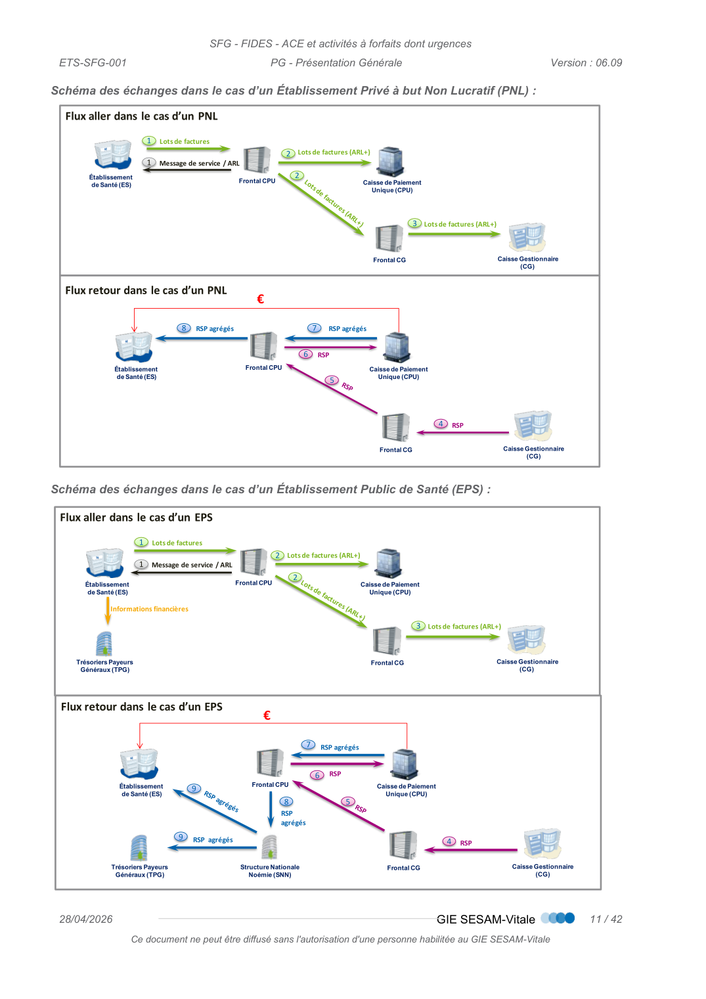
*Figure (p.11) : Schéma des échanges dans le cas d’un Établissement Privé à but Non Lucratif (PNL) :*

<!-- p.12 -->
PG - Présentation Générale

### 2.4 Périmètre d’application des SFG

Ces SFG sont applicables :
 aux flux allers et retours mentionnés précédemment,
 aux Bénéficiaires des Soins définis dans le § Bénéficiaires concerné.es,
 aux prestations définies dans le § Prestations concernées, selon le domaine d’activité
défini dans § Activités concernées
 aux Professionnels de Santé exécutants salariés,
 aux établissements de santé tel que précisé dans le paragraphe suivant et aux
Professionnels de Santé y exerçant selon ce qui est défini dans le § Prestations
concernées
 à la part AMO et éventuellement à la part AMC selon le bénéficiaire concerné (Cf. §
Bénéficiaires concerné.es), et prestations définies ci-après.
2.4.1
Établissements concernés
Les établissements concernés doivent être démarrés en FIDES – ACE.
 Les soins exécutés avant la date de la bascule en FIDES doivent faire l’objet d’un lot B2
différent
Les établissements concernés par FIDES sont les établissements mentionnés aux a) b) et c)
de l’article L.162-22 du Code de la Sécurité Sociale (CSS) exerçant des activités d’ACE MCO
ou ACE SMR et soumis à la réforme du financement à l’activité :
 les établissements publics de santé (EPS), à l’exclusion des hôpitaux locaux et des
établissements dispensant les soins aux détenus ;
 les établissements privés non lucratifs (PNL) ;
 les établissements de santé privés gérés par des organismes à but non lucratif qui en
font la demande auprès de l’ARS ;
 les centres de lutte contre le cancer (CLCC) ;
 les groupements de coopération sanitaire autorisés (GCS) relevant de l’échelle tarifaire
publique ;
 les GCS Établissements de Santé de droits publics,
 les hôpitaux de proximité.
 Pour plus d’informations sur les types d’établissements : Cf. Annexe 2
2.4.2
Activités concernées
Le périmètre d’activité couvert concerne :
 l’activité des champs MCO et SMR (médecine, chirurgie, obstétrique, odontologie, soins
médicaux et de réadaptation) pour :
○ les actes et consultations externes applicables en FIDES définis par l’article L. 162-26
du CSS, (cf. § 2.2.4)
 l’activité du champ MCO (médecine, chirurgie, obstétrique, odontologie) pour :
○ les urgences (passages non programmés dans une structure des urgences, une
structure des urgences pédiatriques ou une antenne de médecine d'urgence non
suivis d’hospitalisation),

<!-- p.13 -->
PG - Présentation Générale
○ l’activité à forfait.
2.4.3
Bénéficiaires concerné.es
Sont concernés :
 les assurés sociaux
 les bénéficiaires d’un contrat de complémentaire C2S (SP03)
 les ressortissants du régime Alsace-Moselle
 les bénéficiaires d’un contrat coordonné avec le régime RSS (SP08)
 les bénéficiaires de l’AME (SP06)
 les détenus (SP17)
2.4.4
Parts facturées
Ces SFG sont applicables :
 à la transmission de la part obligatoire, systématiquement en tiers payant selon l’article
L162-21-1 car l’assuré est dispensé de l’avance des frais
 à la transmission de la part complémentaire uniquement dans les cas suivants :
○ pour les bénéficiaires de la C2S, la part complémentaire est dans le périmètre :
– si la C2S est gérée par l’organisme obligatoire,
– ou, lorsque la C2S est gérée par un organisme différent de l’organisme obligatoire,
l’établissement choisit de bénéficier du Tiers Payant intégral coordonné et d’avoir
ainsi un payeur unique des parts obligatoires et C2S.
○ pour les bénéficiaires de l’AME, les montants sont intégralement positionnés en part
complémentaire. La facture est transmise au régime général.
2.4.5
Prestations concernées
Les prestations couvertes par ces SFG sont synthétisées dans le schéma suivant :
Figure 4 : vue synthétique des prestations couvertes
Prestations en contexte d’environnement hospitalier
Ces prestations sont parfois dénommées de manière restrictive par le terme « ACE » alors
qu’elles comprennent :

Les actes et consultations externes (ACE)

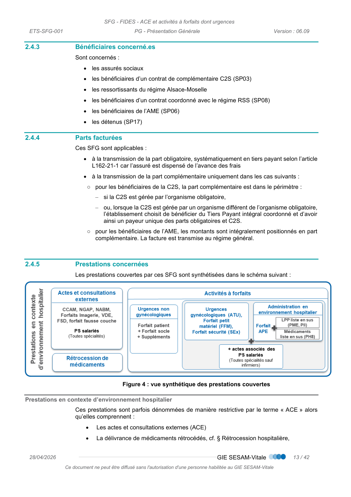
*Figure (p.13) : Figure 4 : vue synthétique des prestations couvertes*

<!-- p.14 -->
PG - Présentation Générale

La délivrance de médicaments rétrocédés, cf. § Rétrocession hospitalière,

Les activités facturées par des forfaits cf.§ Activités à forfait telle que :
o
L’administration en contexte d’environnement hospitalier de médicaments de
la liste en sus
o
L’administration en contexte d’environnement hospitalier de produits et
prestations de la LPP,
o
Les urgences non gynécologiques non suivi d’hospitalisation
o
Autres activités soumises à des forfaits
o
Les actes et consultations en sus de ces forfaits
2.4.5.1
Actes et Consultations Externes
L’ensemble des établissements de santé a la possibilité de dispenser aux patients des actes
et consultations externes (ACE). Ces ACE sont réalisés dans les services de soins externes.
La prise en charge de ces ACE par les organismes de sécurité sociale dépend toutefois de la
nature de l’établissement de santé d’une part et des actes et consultations réalisés d’autre
part.
L’article L. 162-26 du code de la sécurité sociale prévoit que les tarifs des ACE applicables
en ville et négociés dans le cadre des différentes conventions s’appliquent de droit aux
établissements de santé pour les médecins salariés.
En revanche, les majorations adossées à ces tarifs ne leur sont applicables que sous réserve
d’être explicitement mentionnées dans un arrêté, en application de l’article R. 162-51 du
code de la sécurité sociale. A ce jour, c’est l’arrêté du 28 juin 2019 susvisé qui s’applique.
 A noter que les actes de télémédecine, entrés dans le droit commun avec l’avenant 6 de la
convention médicale de 2016, relèvent de cette réglementation générale et sont ainsi réalisés
et facturés en établissement de santé dans les mêmes conditions que l’ensemble des ACE.
Ces ACE sont financés sur la base des nomenclatures et tarifs opposables (article L162-26
du CSS).
Chaque établissement peut facturer ces ACE au titre de tous ses PS salariés (toutes
spécialités confondues).
 La facturation de l’activité libérale des praticiens des établissements du a) de l’article L.162-
22 du CSS est hors périmètre de ces SFG : Cf §2.5 Hors périmètre
Les actes pris en charge par l’Assurance Maladie sont inscrits sur la liste des actes et
prestations prévue par la loi.
Cette liste comprend :
 les actes de la CCAM, pour les actes techniques réalisés par les médecins et certains
actes de les chirurgiens-dentistes,
 les actes de la NGAP, qui reste en vigueur pour les actes cliniques médicaux, certains
actes des réalisés par les médecins, les chirurgiens-dentaires, les actes des auxiliaires
médicaux,
 les examens biologiques : actes en B et examens de laboratoire référencés dans la table
nationale de biologie (NABM).

<!-- ex-figure p.15 supprimée : page de texte déjà transcrite ci-dessus -->

<!-- p.14 -->
PG - Présentation Générale
Forfaits imagerie
médicale (FT)
Forfait en complément d’actes d’imagerie (scanner ou IRM ou Tomographie) rémunérant les
coûts de fonctionnement de l’appareil installé.
Ce forfait est facturé par l’exploitant détenteur de l’autorisation (personne physique ou morale).
Forfaits sécurité
dermatologie
Forfait Sécurité Dermatologie (FSD) : Forfait facturé pour rémunérer le recours à un
environnement spécifique en sus de l’acte CCAM qui rétribue l’établissement où le praticien a
effectué l’acte.
Il n’est facturable que si un acte ouvrant droit au FSD listé dans le livre II de la liste des actes
et prestations adoptée par décision de l'UNCAM du 11 mars 2005 est réalisé.
Forfaits vidéo
capsule
Forfait Vidéo Capsule (VDE) : Forfait rémunérant l’établissement pour la fourniture d’un
consommable ingéré par le patient. À noter que l’acte intellectuel qui l’accompagne est facturé
en sus de ce forfait.
Il n’est facturable que si un acte ouvrant doit au VDE listé dans le livre II de la liste des actes
et prestations adoptée par décision de l'UNCAM du 11 mars 2005 est réalisé. À ce jour, seul
l’acte HGQD002 est concerné.
Forfaits fausse
couche
Les forfaits fausse-couche précoce sont facturables dans les contextes suivants :
 Consultation externe avec un médecin salarié (quelle que soit sa spécialité)
 Passage aux urgences (en sus d’un ATU exclusivement).
Les forfaits sont :
FFE qui comprend :
 la consultation
 le montant d’un forfait médicamenteux
FEF qui comprend :
 la consultation ;
 l’échographie non morphologique de la grossesse;
 le montant d’un forfait médicamenteux
Médicaments
Les médicaments facturables en contexte ACE sont soit délivrés soit administrés :
 délivrance de médicaments rétrocédés, cf. § Rétrocession hospitalière,
 administration en environnement hospitalier :
○ de médicaments de la liste en sus, cf.§ Activités à forfait - Forfait APE,
○ de toxine botulique, cf.§ Activités à forfait - Forfaits SE5, SE6.

<!-- p.15 -->
PG - Présentation Générale
LPP
Les produits de la LPP facturables avec le forfait APE sont identifiés sous le code prestation
PME et PII, cf.§ Activités à forfait - Forfait APE.
2.4.5.2
Rétrocession hospitalière
Deux types de médicaments entrent dans le périmètre :
Liste des prestations
Sous catégories
Médicaments rétrocédés
faisant l’objet d’une
codification en UCD
 Médicaments rétrocédés disposant d’une Autorisation de Mise sur le
Marché (AMM) ;
 Médicaments bénéficiant d’une Autorisation d’accès précoce (AAP)
 Médicaments bénéficiant d’une autorisation d’importation parallèle (article
R.5121-116 du CSP).
 Médicaments disposant d’une Autorisation d’accès compassionnel (AAC)
Médicaments rétrocédés
ne faisant pas l’objet
d’une codification UCD
 Médicaments disposant d’une Autorisation d’accès compassionnel (AAC)
 Préparations hospitalières ;
 Médicaments bénéficiant d’une autorisation d’importation (autre que
parallèle) ;
 Pharmacie hospitalière dérogatoire ;
 Les nutriments (code NUT) destinés à des patients spécifiques atteints de
maladie métaboliques héréditaires.
2.4.5.3
Activités à forfait
Il s’agit des forfaits mentionnés aux 2°, 4°, 5° et 6° de l’article R. 162-33-1 du code de la
sécurité sociale et dont les modalités sont définies par l’arrêté prestations.
Ces forfaits sont facturables dès lors que les actes associés y donnent droit.
 Rappel le terme urgence signifie « passage non programmé dans une structure des urgences,
une structure des urgences pédiatriques ou une antenne de médecine d'urgence »
Urgences non
gynécologiques
Depuis le 1er janvier 2022, pour les passages aux urgences non suivi d’une
hospitalisation,
et hors urgences gynécologiques (ATU gynécologiques), les
établissements factureront :
○ un forfait socle (FU0 à 4) en fonction de l’âge du patient pris en charge à 100% par
l’AMO,
○ d’éventuels suppléments au forfait socle (SUM, SU2, SU3, SIM, SIC, SUB, SB2,
SB3, SUN, SUF, SSN, SSF, SAS, PE1, PE2) : pris en charge à 100% par l’AMO.
○ Et le forfait patient urgences (FPU, FPV, FPM, FPL, FPX, CFU) : à la charge de
l’assuré, de sa complémentaire ou du régime,
o Le FPU est facturé pour chaque passage aux urgences non suivi d'une
hospitalisation. Dans certaines situations, le FPU est minoré (invalides, ALD
notamment) ou pris en charge intégralement par l’assurance maladie (maternité,
victimes d’un acte de terrorisme, détenus).

<!-- transcrit de p.15 (ex-figure) -->

**Rétrocession hospitalière — Deux types de médicaments entrent dans le périmètre :**

| Liste des prestations | Sous catégories |
| --- | --- |
| Médicaments rétrocédés faisant l’objet d’une codification en UCD | • Médicaments rétrocédés disposant d’une Autorisation de Mise sur le Marché (AMM) ; • Médicaments bénéficiant d’une Autorisation d’accès précoce (AAP) • Médicaments bénéficiant d’une autorisation d’importation parallèle (article R.5121-116 du CSP). • Médicaments disposant d’une Autorisation d’accès compassionnel (AAC) |
| Médicaments rétrocédés ne faisant pas l’objet d’une codification UCD | • Médicaments disposant d’une Autorisation d’accès compassionnel (AAC) • Préparations hospitalières ; • Médicaments bénéficiant d’une autorisation d’importation (autre que parallèle) ; • Pharmacie hospitalière dérogatoire ; • Les nutriments (code NUT) destinés à des patients spécifiques atteints de maladie métaboliques héréditaires. |

<!-- p.16 -->
PG - Présentation Générale
o Le FPU étant indépendant de la nature des actes dispensés ou d’un lien médical
avec une pathologie existante (ALD), il est ainsi facturable avant la sortie du
patient, ce dernier peut s’en acquitter sur place, ou repartir, a minima, avec sa
facture.
Autres forfaits
Urgence
 Forfait Accueil et Traitement des Urgences (ATU) : forfait facturé dans le cas de
l’urgence autorisée (autorisation d’activité délivrée par l‘ARS) pour des urgences
gynécologiques non suivies d’hospitalisation lorsqu’elles sont orientées directement
vers les services de gynécologie-obstétrique.
 Forfait petit matériel (FFM) : Ce forfait est facturé dès lors que certains soins non
programmés et non suivis d’hospitalisation, réalisés sans anesthésie et nécessitant la
consommation de matériel de petite chirurgie ou d’immobilisation, sont délivrés au
patient dans les établissements de santé qui ne sont pas autorisés à exercer l’activité
d’accueil et de traitement des urgences.
La facturation des ATU à 80% et des actes associés restera possible au-delà du 1er
janvier 2022 pour les seuls cas des urgences gynécologiques qui sont à ce stade hors
champ de la réforme de financement des urgences.
Forfait Sécurité SE1
à SE4
Forfaits rémunérant la réalisation de certains actes limitatifs, qui requièrent l’utilisation d’un
secteur opératoire ou l’observation du patient dans un environnement particulier.
Ce forfait est facturé pour chaque prise en charge non suivi d’une hospitalisation donnant lieu
à la réalisation de l’un des actes prévus dans les conditions définies par l’arrêté de
classification des prestations (Art.16, IV de l’arrêté modifié du 19 février 2015).
Forfait Sécurité SE5
et SE6
Ces forfaits rémunèrent l’administration de toxine botulique dont l’injection relève d’un acte
CCAM.
L’acte d'administration de toxine botulique (produit de la réserve hospitalière hors liste en sus)
donne lieu à facturation au forfait SE5 ou SE6 et à l’acte CCAM éligible à cette facturation.
Forfait Sécurité SE7
Ce forfait rémunère l’implantation en environnement hospitalier de dispositifs médicaux
cardiologiques inscrits sur la liste en sus LPP.
Ce forfait est compatible :
 avec la liste en sus LPP,
 avec les actes CCAM inscrits sur la liste 7 de l’annexe 11 de l’arrêté prestations 2022.
Ce forfait n’est pas compatible :
 avec les molécules onéreuses inscrites sur la liste en sus,
 ni avec le forfait APE.

<!-- p.17 -->
PG - Présentation Générale
Forfait
Administration de
produits et
prestation en
Environnement
hospitalier (APE)
Forfait facturé pour les prises en charge en environnement hospitalier dès lors qu'un ou
plusieurs produits et prestations de la LPP ou des médicaments de la liste en sus sont
administrés. C’est-à-dire les prestations suivantes :
 médicaments de la liste en sus (PH8)
 produits de la LPP (PME ou PII)
 Extrait de l’arrêté prestations : « Un forfait APE est facturé dès lors que l'un des produits et
prestations, mentionnés à l'article L. 165-1 du code de la sécurité sociale et inscrits sur la liste
mentionnée à l’article L. 162-22-7 du même code ou qu’une spécialité pharmaceutique inscrite
sur la liste mentionnée à l’article L. 162-22-7 du même code, est administré au patient.
 L’administration d’un médicament de la liste en sus justifie la facturation d’un GHS
(sans APE).
Toutefois, la facturation d’un forfait APE + PH8 reste possible pour ces médicaments.
Médicaments
Les médicaments facturables en contexte ACE sont soit délivrés soit administrés :
 délivrance de médicaments rétrocédés, cf. § Rétrocession hospitalière,
 administration en environnement hospitalier :
○ de médicaments de la liste en sus, cf.§ Activités à forfait - Forfait APE,
○ de toxine botulique, cf.§ Activités à forfait - Forfaits SE5, SE6.
LPP
Les produits de la LPP facturables avec le forfait APE sont identifiés sous le code prestation
PME et PII, cf.§ Activités à forfait - Forfait APE.
Actes associés aux
forfaits ATU, FFM,
SE, APE
Les actes associés aux forfaits ATU, FFM, SE, APE sont facturables :
 pour les actes associés au forfait ATU : uniquement dans le cadre des urgences
gynécologiques.
 pour les activités salariées, de tous les professionnels de santé sauf infirmiers
 La facturation de l’activité libérale des praticiens des établissements du a) de l’article L.162-
22 du CSS est hors périmètre de ces SFG : Cf §2.5 Hors périmètre
 Il est possible que l’établissement transmette un forfait sans les actes associés dans la facture
de l’établissement (à ce jour uniquement possible pour les SEx).

<!-- p.18 -->
PG - Présentation Générale

### 2.5 Hors périmètre

Les situations suivantes sont exclues du périmètre de ces SFG.
Libellé
Description
APIAS / SMG
La facturation des APIAS (Affection Présumée Imputable au Service) et des
SMG (Soins Médicaux Gratuits) ne sont pas dans le périmètre de la
télétransmission des factures.
Une facturation papier est envoyée au :
 service de la gestion des APIAS de la CNMSS (caisse de Toulon =  caisse
756),
 service de la gestion des SMG de la CNMSS (caisse de Toulon= caisse 835).
Bénéficiaire du
régime de la CFE
(Caisse des Français
à l’Étranger)
Les bénéficiaires de la CFE n’entrent pas dans le périmètre de la
télétransmission. Ils restent en facturation papier
Dépassements pour
les Victimes
d’attentats
La prise en charge des dépassements n’entre pas dans le périmètre de la
télétransmission. Elle reste en facturation papier.
Bénéficiaire sans
possibilité
d’identification des
droits
Dans le cadre des IVG, lorsque l’établissement n’est pas en capacité d’établir
les droits de la bénéficiaire de soins, l’établissement établit une facture papier
selon des modalité hors champs des présentes SFG.
Bénéficiaires des
soins urgents
Les bénéficiaires des soins urgents sont hors périmètre de ces SFG
Actes associés au
forfait MRC
Les actes associés au forfait MRC ne rentrent pas dans le périmètre de la
facturation individuelle des ACE.
Établissements ayant
des caractéristiques
particulières dans
leur activité ou dans
les  conditions de
réalisation des soins
 Les établissements dispensant des soins aux personnes incarcérées
(Établissement public de santé national de Fresnes) ;
 Les établissements des services de Santé de l'Armée ;
 Les établissements nationaux et locaux de l'Institution Nationale des Invalides ;
 Les unités de soins de longue durée ;
 Les établissements des COM ;
 Les établissements de santé de Mayotte dans l'attente de leur intégration dans
le régime commun de financement.
Activité libérale des
praticiens hospitaliers
Pour rappel, l’activité libérale des praticiens hospitaliers (TPH) ne rentre pas
dans le périmètre de la facturation individuelle des ACE ni des actes en sus des
forfaits.
La mise à disposition des différents référentiels (base CCAM, base UCD, Liste des actes
NGAP, etc.) est hors périmètre des présentes SFG.

<!-- transcrit de p.18 (ex-figure) -->

**§2.5 Hors périmètre — Les situations suivantes sont exclues du périmètre de ces SFG.**

| Libellé | Description |
| --- | --- |
| APIAS / SMG | La facturation des APIAS (Affection Présumée Imputable au Service) et des SMG (Soins Médicaux Gratuits) ne sont pas dans le périmètre de la télétransmission des factures. Une facturation papier est envoyée au : • service de la gestion des APIAS de la CNMSS (caisse de Toulon = caisse 756), • service de la gestion des SMG de la CNMSS (caisse de Toulon = caisse 835). |
| Bénéficiaire du régime de la CFE (Caisse des Français à l’Étranger) | Les bénéficiaires de la CFE n’entrent pas dans le périmètre de la télétransmission. Ils restent en facturation papier |
| Dépassements pour les Victimes d’attentats | La prise en charge des dépassements n’entre pas dans le périmètre de la télétransmission. Elle reste en facturation papier. |
| Bénéficiaire sans possibilité d’identification des droits | Dans le cadre des IVG, lorsque l’établissement n’est pas en capacité d’établir les droits de la bénéficiaire de soins, l’établissement établit une facture papier selon des modalité hors champs des présentes SFG. |
| Bénéficiaires des soins urgents | Les bénéficiaires des soins urgents sont hors périmètre de ces SFG |
| Actes associés au forfait MRC | Les actes associés au forfait MRC ne rentrent pas dans le périmètre de la facturation individuelle des ACE. |
| Établissements ayant des caractéristiques particulières dans leur activité ou dans les conditions de réalisation des soins | • Les établissements dispensant des soins aux personnes incarcérées (Établissement public de santé national de Fresnes) ; • Les établissements des services de Santé de l'Armée ; • Les établissements nationaux et locaux de l'Institution Nationale des Invalides ; • Les unités de soins de longue durée ; • Les établissements des COM ; • Les établissements de santé de Mayotte dans l'attente de leur intégration dans le régime commun de financement. |
| Activité libérale des praticiens hospitaliers | Pour rappel, l’activité libérale des praticiens hospitaliers (TPH) ne rentre pas dans le périmètre de la facturation individuelle des ACE ni des actes en sus des forfaits. |

<!-- p.20 -->
PG - Présentation Générale

### 2.6 Acteurs et objectifs d’utilisation du système

Ce paragraphe décrit :
 Les acteurs (humains et systèmes) interagissant avec le système.
 Les objectifs métiers qui justifient l’utilisation du système.
 Le croisement entre les acteurs et les objectifs métiers.
Acteurs humains
Nom
Définition du rôle
Bénéficiaire des
Soins (BS)
Personne pour laquelle un soin est prodigué par un Professionnel de Santé.
Le Bénéficiaire des Soins est soit un assuré social soit un non assuré social
(bénéficiaire de l’AME, patient relevant d'un système de sécurité sociale coordonné
avec le régime français) et peut bénéficier d’une situation particulière de type C2S
ou autre (cf. § 5).
Dans le cadre de ce système, il contribue à :
 Fournir les informations relatives à ses droits et ses données administratives.
Professionnel de
Santé (PS)
Rôle d’exécutant :
Personnel de santé en charge de l’activité de soins. Il exerce en tant que libéral ou
salarié de l’établissement.
Dans le cadre de ce système, il contribue à :
 Fournir les informations relatives à son identification et aux prestations servies
au Bénéficiaire des Soins.
Rôle de prescripteur
Le prescripteur est le Professionnel de Santé à l’origine de la délivrance d’une
prescription.
Il peut :
 Exercer en tant que salarié d’un établissement ;
 Ou exercer en tant que Professionnel de Santé libéral.
Dans le cadre de ce système, il contribue à :
 Fournir les informations relatives à son identification et la prescription.
Professionnel de
l’Établissement
(PE)
Personnel de l’établissement en charge de la partie administrative liée au
bénéficiaire des soins, l’élaboration de la facture ainsi que le traitement des retours.
Dans le cadre de ce système, il contribue à :
 L’acquisition des informations relatives au Bénéficiaire des Soins et aux
prestations servies ;
 L’élaboration de la facture,
 Le traitement des retours

<!-- transcrit de p.20 (ex-figure) -->

**Acteurs humains**

| Nom | Définition du rôle |
| --- | --- |
| Bénéficiaire des Soins (BS) | Personne pour laquelle un soin est prodigué par un Professionnel de Santé. Le Bénéficiaire des Soins est soit un assuré social soit un non assuré social (bénéficiaire de l’AME, patient relevant d'un système de sécurité sociale coordonné avec le régime français) et peut bénéficier d’une situation particulière de type C2S ou autre (cf. § 5). Dans le cadre de ce système, il contribue à : • Fournir les informations relatives à ses droits et ses données administratives. |
| Professionnel de Santé (PS) | **Rôle d’exécutant :** Personnel de santé en charge de l’activité de soins. Il exerce en tant que libéral ou salarié de l’établissement. Dans le cadre de ce système, il contribue à : • Fournir les informations relatives à son identification et aux prestations servies au Bénéficiaire des Soins. **Rôle de prescripteur :** Le prescripteur est le Professionnel de Santé à l’origine de la délivrance d’une prescription. Il peut : • Exercer en tant que salarié d’un établissement ; • Ou exercer en tant que Professionnel de Santé libéral. Dans le cadre de ce système, il contribue à : • Fournir les informations relatives à son identification et la prescription. |
| Professionnel de l’Établissement (PE) | Personnel de l’établissement en charge de la partie administrative liée au bénéficiaire des soins, l’élaboration de la facture ainsi que le traitement des retours. Dans le cadre de ce système, il contribue à : • L’acquisition des informations relatives au Bénéficiaire des Soins et aux prestations servies ; • L’élaboration de la facture, • Le traitement des retours |

<!-- p.21 -->
PG - Présentation Générale
Acteurs système
Nom
Définition du rôle
Frontal CIE (FCIE)
Son rôle est de centraliser tous les flux de facturation hospitaliers pour les
régimes d’assurance maladie obligatoire.
Dans le cadre de ce système, il contribue à :
 Réceptionner les factures ;
 Contrôler les messages et la structure générale des factures ;
 Router les factures vers les caisses gestionnaires ;
 Réceptionner les retours de paiement et de rejets des caisses gestionnaires ;
 Transmettre les retours agrégés de paiement et de rejet émis par les CPU à
l’attention du SNN (pour les EPS), directement à l’établissement (pour les
PNL).
Assurance Maladie
Obligatoire (AMO)
Son rôle est de fournir une réponse au service CDRi

<!-- p.22 -->
PG - Présentation Générale
Croisement Acteurs
/ Objectifs
Figure 5 : Diagramme de cas d’utilisation du système

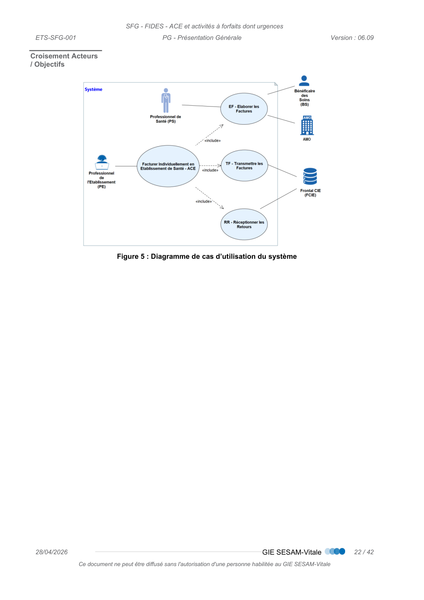
*Figure (p.22) : Figure 5 : Diagramme de cas d’utilisation du système*

<!-- p.23 -->
PG - Présentation Générale

### 2.7 Échanges entre les acteurs du système

Le schéma ci-dessous décrit les échanges entre les acteurs du système.
Figure 6 : Diagramme de séquence du système

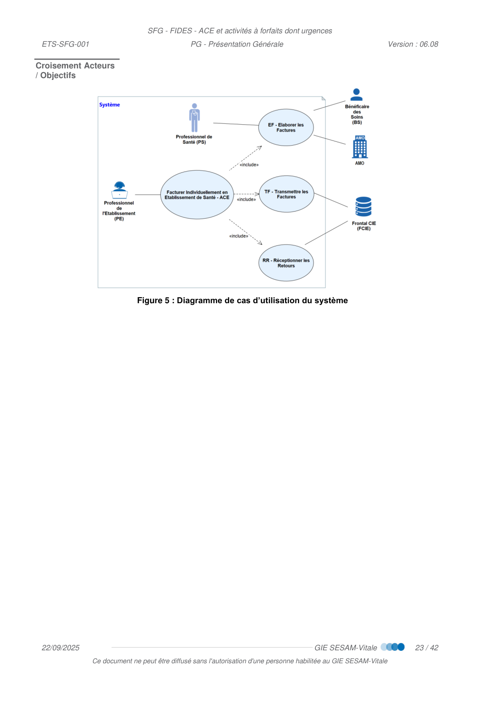
*Figure (p.23) : Figure 6 : Diagramme de séquence du système*

<!-- p.24 -->
PG - Présentation Générale

## 3 DESCRIPTION GENERALE DU PROCESSUS

 La modélisation des traitements et des données dans le processus décrit ci-après est
donnée à titre d’illustration et n’est pas imposée. Cette modélisation permet une
meilleure lisibilité et compréhension des règles et des données manipulées et de leur
dépendance.
De ce fait, certaines données sont des données « intermédiaires » et ne servent qu’à la
compréhension de l’enchainement des différentes règles.
Chaque éditeur est libre de sa propre modélisation et de ses traitements.

### 3.1 Cadrage fonctionnel

Vue générale
Description Ce processus a pour objectif de définir les règles d’élaboration et de transmission d’une
facture (B2) à destination de l’Assurance Maladie Obligatoire ainsi que la prise en compte
des retours en provenance du frontal pivot.
Il est composé des sous-processus suivants :
 EF - Élaborer les Factures
○ Sous-processus chargé de définir les règles d’acquisition et de valorisation des
informations relatives à l’élaboration des factures.
 TF - Transmettre les Factures
○ Sous-processus chargé de définir les règles de constitution des informations
relatives à la transmission des factures (B2).
 RR - Réceptionner les Retours
○ Sous-processus chargé de définir les règles d’interprétation des informations
relatives à la réception des retours (NOEMIE).
 À noter que ce processus est intégré au sein du Système d’Information Hospitalier (SIH) et
peut faire appel à des services en ligne mis à disposition par l’Assurance Maladie.

<!-- p.24 -->
PG - Présentation Générale
Situations
particulières
Les situations particulières suivantes sont identifiées :
Identifiant
Libellé de la situation particulière
SP03
Bénéficiaire de la Couverture Santé Solidaire
SP08
Bénéficiaire coordonné RSS
SP08.1
Bénéficiaire de passage coordonné RSS
SP08.2
Bénéficiaire permanent coordonné RSS
SP13
Établissement Public de Santé (EPS)
SP17
Détenus
SP06
Bénéficiaire de l’AME
La description des situations particulières est fournie au §5.
 Remarque :
Les situations particulières sont identifiées par un « code situation particulière ».
Ce code permet d’identifier les exceptions liées à la situation particulière en question dans les
différentes règles de gestion. Il s’agit d’un formalisme de référencement des règles et des cas
particuliers pour faciliter la lisibilité des documents (par ex. une recherche sur « SP03 » permet
d’avoir les spécificités de la C2S).

<!-- transcrit de p.24 (ex-figure) -->

**Situations particulières — les situations particulières suivantes sont identifiées :**

| Identifiant | Libellé de la situation particulière |
| --- | --- |
| SP03 | Bénéficiaire de la Couverture Santé Solidaire |
| SP08 | Bénéficiaire coordonné RSS |
| SP08.1 | Bénéficiaire de passage coordonné RSS |
| SP08.2 | Bénéficiaire permanent coordonné RSS |
| SP13 | Établissement Public de Santé (EPS) |
| SP17 | Détenus |
| SP06 | Bénéficiaire de l’AME |

<!-- p.26 -->
PG - Présentation Générale

### 3.2 Lien entre les objets métier du processus

Le schéma ci-dessous décrit les liens entre les différents objets métier du processus.
Les objets métier ainsi que leurs attributs sont définis dans le document « DICO – dictionnaire
de données ».
 [DICO] - Dictionnaire de données
Lien entre les objets
Figure 7 : Diagramme des objets métier du processus

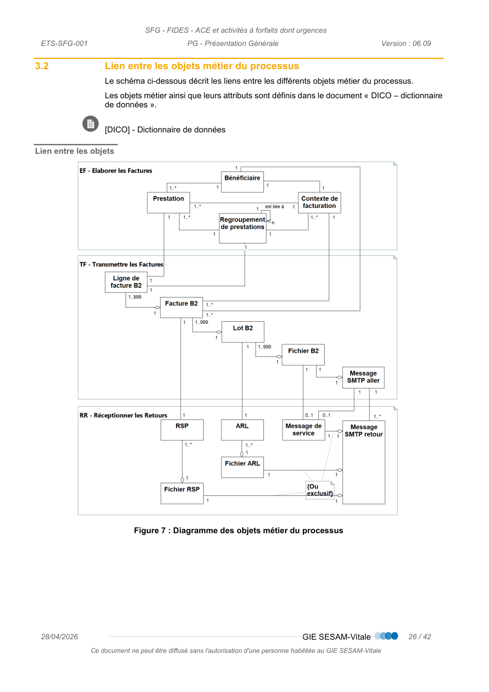
*Figure (p.26) : Figure 7 : Diagramme des objets métier du processus*

<!-- p.28 -->
PG - Présentation Générale

### 3.3 Enchaînement des sous-processus

Enchaînement des
sous-processus
Figure 8 : Diagramme d’enchaînement du processus

*Figure (p.27) : Figure 8 : Diagramme d’enchaînement du processus*

<!-- p.28 -->
PG - Présentation Générale

## 4 DESCRIPTION DETAILLEE DU PROCESSUS

### 4.1 Description générale du sous-processus « EF - Élaborer les Factures »

4.1.1
Cadrage fonctionnel
Vue générale
Description Ce sous-processus a pour objectif de définir les règles d’acquisition et de valorisation des
informations relatives à l’élaboration des factures.
Il est composé des fonctions suivantes :
 BS - Acquérir les informations du Bénéficiaire des Soins : fonction chargée de définir
les règles d’acquisition relatives aux informations du Bénéficiaire des Soins à partir de
la carte Vitale, du service CDRi ou d’un autre support de droits.
 IP - Acquérir les Informations sur les Prestations
 CF - Déterminer le Contexte de Facturation
 VF - Valoriser les prestations de la Facture
4.1.2
Enchaînement des fonctions
Le schéma ci-dessous décrit l’enchaînement des fonctions du sous-processus « EF - Élaborer
les Factures ».
Enchaînement des
fonctions
Figure 9 : Diagramme d’enchaînement du sous-processus « EF - Élaborer les Factures »

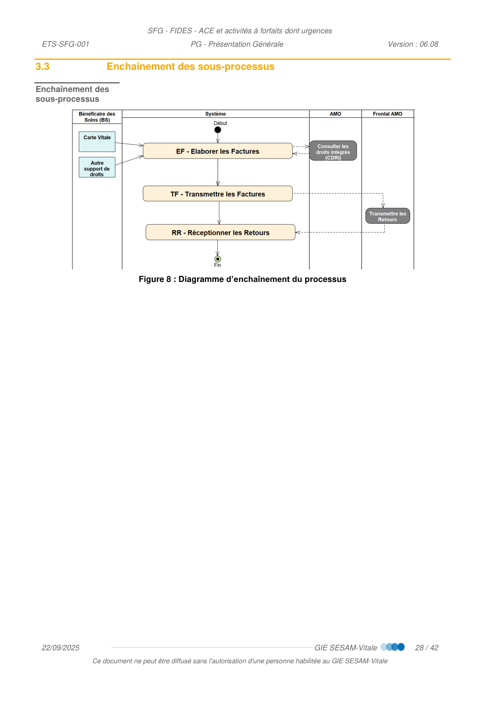
*Figure (p.28) : Figure 9 : Diagramme d’enchaînement du sous-processus « EF - Élaborer les Factures »*

<!-- p.29 -->
PG - Présentation Générale

### 4.2 Description générale du sous-processus « TF - Transmettre les Factures »

4.2.1
Cadrage fonctionnel
Ce sous-processus a pour objectif de définir les règles de mise en forme des informations
relatives à la transmission des factures (norme B2-2005 – addendum E CP).
Vue générale
Description Il est composé des fonctions suivantes :
 MF - Mettre en forme les Factures
 ML - Regrouper les factures en lots et regrouper les lots en fichier
 EM - Émettre les Messages SMTP
○ Les règles de constitution et de transmission du message SMTP sont précisées dans
le document « Transport des flux de facturation par messagerie SMTP et chiffrement
de transport »
4.2.2
Enchaînement des fonctions
Le schéma ci-dessous décrit l’enchaînement des fonctions du sous-processus « TF -
Transmettre les Factures ».
Enchaînement des
fonctions
Figure 10 : Diagramme d’enchaînement du sous-processus « TF - Transmettre les
Factures »

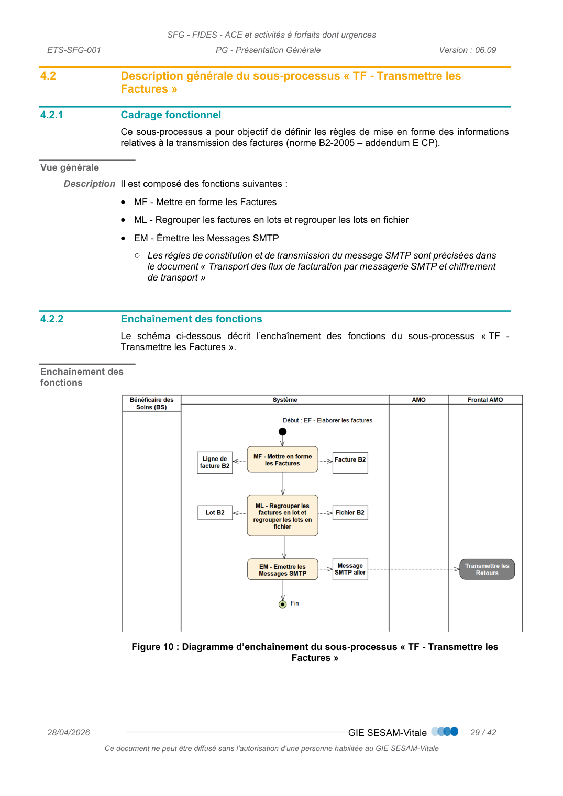
*Figure (p.29) : Figure 10 : Diagramme d’enchaînement du sous-processus « TF - Transmettre les*

<!-- p.30 -->
PG - Présentation Générale

### 4.3 Description générale du sous-processus « RR - Réceptionner les Retours »

4.3.1
Cadrage fonctionnel
Ce sous-processus a pour objectif de définir les règles d’interprétation des informations
relatives à la réception des retours
Vue générale
Description Il est composé des fonctions suivantes :
 AM – Accueillir les messages
 PM – Prendre en compte les messages
Données en
entrée
Retours de l’Assurance Maladie : Message de service, ARL, RSP
Données en
sortie
Message de service, ARL, RSP traités.
Description du
sous-processus
Pour l’accueil et l’interprétation des messages SMTP, se référer à :
 Cf. [Transport des flux de facturation par messagerie SMTP et chiffrement de
transport]
Pour la prise en compte des différents retours, se référer à :
 Cf. [SFG Fichier AMO et retours]
4.3.2
Enchaînement des fonctions
Le schéma ci-dessous décrit l’enchaînement des fonctions du sous-processus « RR -
Réceptionner les Retours ».

<!-- p.31 -->
PG - Présentation Générale
Enchaînement des
fonctions
Figure 11 : Diagramme d’enchaînement du sous-processus « RR – Réceptionner les Retours »

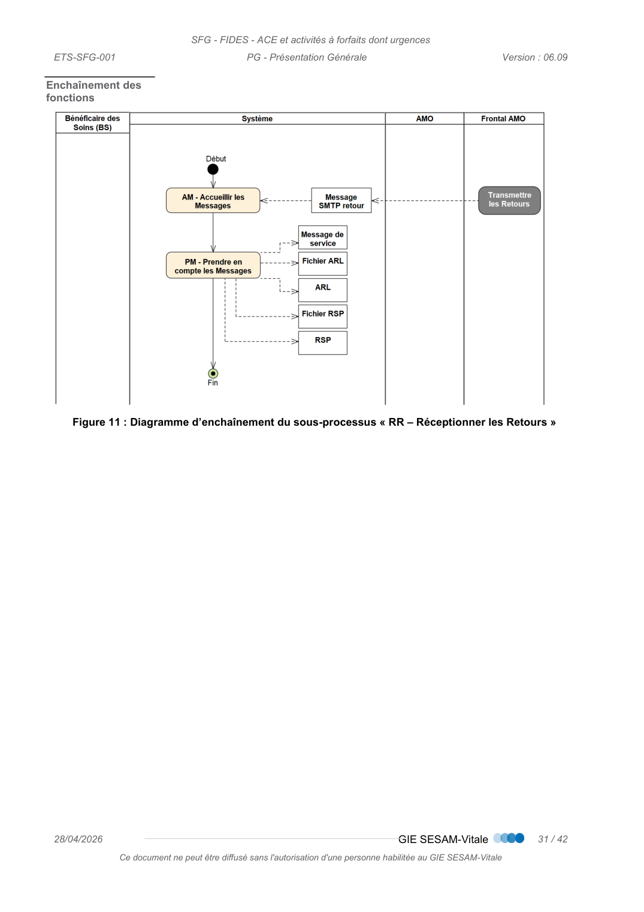
*Figure (p.31) : Figure 11 : Diagramme d’enchaînement du sous-processus « RR – Réceptionner les Retours »*

<!-- p.32 -->
PG - Présentation Générale

## 5 DESCRIPTION DES SITUATIONS PARTICULIERES

### 5.1 SP03 : Bénéficiaire de la Complémentaire Santé Solidaire (C2S)

Description
Conformément aux dispositions législatives (article L. 160-1 du CSS et suivants) la protection
universelle maladie (PUMa) permet à toute personne travaillant ou, lorsqu'elle n'exerce pas
d'activité professionnelle, résidant en France de manière stable et régulière, de bénéficier, en
cas de maladie ou de maternité, de la prise en charge de ses frais de santé dans les conditions
prévues par les textes.
Par ailleurs, les dispositions législatives de protection complémentaire en matière de santé
(article L. 861-1 du CSS et suivants) offrent aux personnes dont les revenus sont inférieurs à
un seuil déterminé par décret, une protection complémentaire sans contrepartie contributive,
pendant un an renouvelable : la complémentaire santé solidaire (C2S).
Cette C2S peut également être accordée aux personnes dont les ressources se situent entre
le plafond de la CMU-C et ce plafond majoré de 35%, en contrepartie d’une participation
financière qui varie en fonction de l’âge. Cette protection est également accordée pendant 1
an renouvelable.
La protection complémentaire en matière de santé peut être servie à l’assuré soit par sa caisse
d’Assurance Maladie Obligatoire, soit par un organisme complémentaire de son choix
référencé sur une liste gérée par le fonds de la complémentaire santé solidaire et disponible
auprès de sa caisse de rattachement.
Le Professionnel de Santé ne peut appliquer de dépassement tarifaire pour les actes
dispensés aux bénéficiaires de la complémentaire santé solidaire, sauf en cas d’exigence
particulière du patient, auquel cas le bénéficiaire de la C2S peut perdre le bénéfice de sa
couverture complémentaire
~~Pour les bénéficiaires de la complémentaire santé solidaire ne respectant pas le parcours~~
~~coordonné de soins, les médecins spécialistes peuvent pratiquer le dépassement autorisé~~
~~« DA ». Ce dépassement reste en totalité à la charge du bénéficiaire (il n’est pas pris en~~
~~charge par la complémentaire santé solidaire).~~
L’établissement doit :
 identifier que le bénéficiaire des soins est couvert par un contrat de complémentaire santé
solidaire (C2S),
 proposer d’appliquer le tiers payant sur la part AMO et la part AMC. Le bénéficiaire des
soins peut refuser cette dispense d’avance des frais.
 respecter les montants maximums de facturation (sans dépassement) sauf :
○ exigence particulière du patient,
~~○ pour les médecins spécialistes, quand le parcours coordonné de soins n’est pas~~
~~respecté,~~
L’éditeur doit s’assurer que la prise en compte du montant maximum et de la dispense
d’avance de frais correspondante sont possibles (sans blocage par le progiciel).
Identification
Cette situation particulière est caractérisée par l’existence d’un contrat de couverture C2S
pour le bénéficiaire des soins, issu du support de droit.

<!-- p.33 -->
PG - Présentation Générale

### 5.2 SP06 : Bénéficiaire de l’AME

Description
L'Aide Médicale de l'Etat (AME) est un dispositif permettant aux étrangers en situation
irrégulière de bénéficier d'un accès aux soins. Elle est attribuée sous conditions de résidence
et de ressources.
La prise en charge des prestations par l’AME s’effectue dans la limite des tarifs de
responsabilité avec dispense totale d’avance des frais sur présentation d’une attestation
d’admission à l’aide médicale de l’Etat.
Les personnes bénéficiaires de l’AME ne sont pas concernées par le dispositif médecin
traitant et le parcours de soins coordonné.
Identification
Cette situation particulière est caractérisée par l’existence d’un contrat de couverture AME
pour le bénéficiaire des soins. Ces personnes ne possèdent pas de Carte Vitale mais une
attestation de droits AME (Attestation d’admission à l’aide médicale de l’État) ou une carte
AME avec photo.

### 5.3 SP08 : BS coordonné RSS

Cette situation particulière recouvre la notion de patient relevant d'un système de sécurité
sociale coordonné avec le régime français pour les risques maladie, maternité, accidents
du travail et maladies professionnelles.
La prise en charge des séjours de ces patients s’effectue selon des règles spécifiques.
Désignation de cette
situation
La situation particulière SP08 va être identifiée dans notre corpus documentaire par le terme
« BS coordonné RSS » qui pourra être décliné selon le contexte par :
 SP08.01 « BS de passage coordonné RSS »
 SP08.02 « BS permanent coordonné RSS »
 Le terme RSS signifiant régime de sécurité sociale.
Historiquement dans notre documentation, le terme « migrants » était utilisé pour identifier
ces bénéficiaires. Ces mêmes bénéficiaires pouvaient également être désignés par le terme
« Ressortissant des Relations Internationales » dans des documentations de l’assurance
maladie.

<!-- p.34 -->
PG - Présentation Générale
5.3.1
SP08.1 : BS de passage coordonné RSS
Description
Il s’agit de ressortissants (étrangers ou pas) pris en charge par le Régime Général pendant
un séjour temporaire et uniquement dans le cas où il existe une convention bilatérale ou
ressortissants titulaires d’une CEAM entre la France et le pays d’origine.
Les BS de passage coordonné RSS ne sont pas concernés par le dispositif Médecin traitant
et le Parcours de soins coordonnés.
Une prise en charge est obligatoire pour s’assurer des droits.
Les BS de passage coordonné RSS ne sont pas détenteurs de Carte Vitale.
Identification
Ces personnes sont identifiées par un NIR ayant une structure spécifique : notamment le code
sexe du NIR est égal à 5 ou 6.
5.3.2
SP08.2 : BS permanent coordonné RSS
Description
Il s’agit de ressortissants (étrangers ou pas) pris en charge par le Régime Général pendant
un séjour de longue durée. Ces personnes sont détentrices d’une Carte Vitale.
Identification
Cette situation particulière est caractérisée par l’existence d’une information spécifique, issue
du support de droit (code gestion BGDH).
5.3.3
SP13 : Établissement Public de Santé (EPS)
Description
Les établissements publics de santé sont des personnes morales de droit public dotées de
l'autonomie administrative et financière. Leur objet principal n'est ni industriel, ni commercial.
Ils sont communaux, intercommunaux, départementaux, interdépartementaux ou nationaux,
cf. article L6141-1 du code de la santé publique.
Les EPS doivent inscrire dans le flux vers l’AMO, en lieu et place du n° de facture, le n° du
titre, nécessaire au Trésor pour le rapprochement.
Identification
Les établissements publics de santé concernés par FIDES sont les établissements
mentionnés au a de l’article L.162-22 du Code de la Sécurité Sociale (CSS) exerçant les
activités de MCO et soumis à la réforme du financement à l’activité.

### 5.4 SP10 : Elaboration de factures anonymes (BS anonyme)

Description
Plusieurs cas métiers peuvent entraîner la réalisation d’une facture anonyme c’est à dire que
le BS ne souhaite pas transmettre ses informations d’identité.
En fonction du contexte d’anonymisation, les données de la facture seront renseignées
comme suit,
 Le NIR de l’assuré, sera renseigné dans la facture à transmettre avec une valeur fictive
 La clé du NIR sera calculée en fonction du NIR fictif

<!-- p.35 -->
PG - Présentation Générale
 La date de naissance, si non renseignée avec la date de naissance exacte du
bénéficiaire des soins, sera renseignée, dans certains contextes d’anonymisation, par
une valeur fictive
 Les données de l’organisme gestionnaire ne seront pas utilisées pour déterminer
l’organisme gestionnaire de la facture
Ces factures sont prises en charge à 100% et en tiers payant.
Cas métier
concernés
Les cas métiers permettant la création d’une facture anonyme sont les suivants : :
 Facturation des dépistages des infections sexuellement transmissibles (IST) pour les
assurés mineurs désirant le secret

### 5.5 SP17 : Détenus – personnes écrouées

Description
A compter de leur mise sous écrou, les personnes écrouées sont rattachées au régime
général et bénéficient d’une dispense d’avance de frais sur l’ensemble des soins, dans la
limite des tarifs de responsabilité de l’assurance maladie.
Le régime général prend en charge la part obligatoire ainsi que la part restant à charge de
l’assuré (ticket modérateur et forfait journalier hospitalier) depuis le 1er janvier 2018
Les personnes visées par la mesure : les personnes détenues.
Sont désignées ainsi :
 les personnes incarcérées,
 les personnes en aménagement de peine dès lors qu’elles n’exercent pas d’activité
professionnelle susceptible de leur ouvrir des droits à ce titre.
 Les membres de la famille de la personne détenue ne bénéficient pas de la mesure, et donc
de la prise en charge par le régime général de la participation assuré.
Solution appliquée
Utilisation d’une exonération du ticket modérateur pour une facturation à 100% sur la part
obligatoire.
Afin de supprimer tout reste à charge à l’assuré :
 Exonération de la participation assuré de 24 €
 Prise en charge du forfait journalier par le Régime Général
Identification
Cette situation particulière est caractérisée par l’existence d’une situation particulière du
bénéficiaire de soins issue du support de droit.

<!-- p.36 -->
PG - Présentation Générale

## 6 SYNTHESE DES ENTITES FONCTIONNELLES

 [DICO] - Dictionnaire de données
ANNEXE 1 GUIDE DE LECTURE
Indications dans la
marge
 Les éléments importants et les remarques sont indiqués par une flèche dans la marge.
 Les questions importantes sont indiquées par un point d’interrogation dans la marge.
 Les alertes importantes sont indiquées par ce pictogramme dans la marge.
Codes couleur
Les codes couleur suivants sont utilisés dans ce document :
 Texte surligné jaune = texte ajouté par rapport à la version précédente
~~ Texte barré jaune = texte supprimé~~
Exigences
fonctionnelles
Par défaut, la totalité de ce corpus documentaire est constituée d’exigences fonctionnelles.
Quatre exceptions sont à noter :
 Dans les processus d’utilisation du système, il est possible de citer des étapes sans
utilisation du système (fonctionnalités typées « métier ») ;
 Les règles de gestion de type « métier », « consigne utilisateur » ou « convention » ne
font pas partie des exigences fonctionnelles (elles ne sont pas prises en charge par le
système) ;
 Les illustrations et les exemples ne font également pas partie des exigences
fonctionnelles. Ils sont précédés par la mention « Illustration » en marge. Il est
également possible d’utiliser une étiquette « Préambule » ;
 Les recommandations pour les développeurs et les éditeurs.

<!-- p.37 -->
PG - Présentation Générale
Principe de
navigation
Certains éléments sont référencés à l’aide d’un identifiant unique au sein de ce corpus
documentaire :
 RG_... pour les règles de gestion,
 EF_... pour les entités fonctionnelles,
 [XXYYY] pour les règles d’alimentation des données à partir de la norme B2 :
 XX correspond au « Type B2 »
 YYY correspond à la position de la donnée dans la norme B2
 Exemple [0240] : Correspond au « Type 2 », position 40.
Afin de faciliter l’exploitation de ces documents, des liens hypertextes sont utilisés pour
naviguer entre les différentes règles de gestion (RG_) et les règles d’alimentation des données
([XXYYY]).
Ces liens sont directement cliquables afin d’accéder à la ressource concernée et sont
reconnaissables de par leur style :
 RG_EF_...
 [XXYYY]
NB : pour une donnée unitaire, on ajoute l’indice de cette donnée à la référence de l’entité
fonctionnelle. Par exemple : EF_01_01 est un renvoi vers la première donnée unitaire de
l’entité EF_01.
Navigation entre les
pages
Afin de pouvoir revenir aux pages précédentes et suivantes suite à l’activation d’un lien
hypertexte, l’utilisation des boutons « Vue précédente » et « Vue suivante » de la barre
d’outils est requise :
Si ceux-ci ne sont pas présents dans votre barre d’outils (Acrobat Reader 9), il est nécessaire
de les ajouter en cliquant sur « Outils / Personnaliser les barres d’outils… » et de sélectionner
dans la « barre d’outils Navigation de pages » les deux boutons qui correspondent à « Vue
précédente » et « Vue suivante ».

<!-- ex-figure p.38 supprimée : page de texte (principe de navigation) déjà transcrite ci-dessus -->

<!-- p.38 -->
PG - Présentation Générale
Gestion des
arrondis
Dans le cas nominal, les montants doivent être :
 Indiqués en centimes et non signés (ni +, ni -, ni point, ni virgule)
 Arrondis au centime supérieur dès lors que la troisième décimale est supérieure ou
égale à 5 ;
 Arrondis au centime inférieur dès lors que la troisième décimale est inférieure ou égale
à 4.
Les cas particuliers seront quant à eux décrits dans les règles spécifiques.
L’héritage
La notion d’héritage intervient lorsque l’on souhaite modéliser un lien de parenté entre
différentes classes signifiant « est un cas particulier de ».
Dans l’exemple ci-dessous, l’entité « véhicule » permet de mutualiser les données communes
aux différents types de véhicules (voiture et avion). Les entités « voiture » et « avion »
contiennent des données spécifiques à chaque type.
L’agrégation
La notion d’agrégation intervient lorsque l’on souhaite modéliser un lien de constitution entre
différentes classes. Dans l’exemple ci-dessous, une classe « Voiture » est constituée de
quatre classes « Roue » et une classe « Roue » appartient à une seule et unique classe
« Voiture ». Bien que les roues soient un élément constitutif important d’une voiture, on estime
qu’elles peuvent être utilisées dans d'autres voitures.

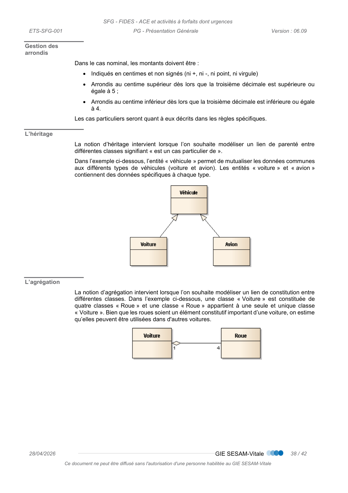
*Figure (p.38) : Schéma / diagramme page 38*

<!-- p.39 -->
PG - Présentation Générale
La composition
La notion de composition intervient lorsque l’on souhaite modéliser un lien de constitution fort
entre différentes classes. Dans l’exemple ci-dessous, une classe « Voiture » est constituée
d’une classe « Châssis » et une classe « Châssis » appartient à une seule et unique classe
« Voiture ». On estime que le châssis est un élément indissociable d'une voiture, c'est-à-dire
que si la voiture n’existe pas alors le châssis non plus.

<!-- p.40 -->
PG - Présentation Générale
ANNEXE 2 PRECISION SUR LES TYPES D’ETABLISSEMENTS DE SANTE
Etablissements de
santé
A partir des fichiers FINESS disponible sur https://www.data.gouv.fr/fr/, il est possible de lister
les établissements de santé dits également établissements sanitaire en utilisant le code
catégorie sanitaire.
Les codes catégories à retenir sont les suivants :
Code catégorie
Libellé catégorie sanitaire
101
Centre Hospitalier Régional (C.H.R.)
106
Centre hospitalier, ex Hôpital local
109
Etablissement de santé privé autorisé en SSR
114
Hôpital des armées
119
Maison de régime
122
Etablissement Soins Obstétriques Chirurgico-Gynécologiques
127
Hospitalisation à Domicile
128
Etablissement de Soins Chirurgicaux
129
Etablissement de Soins Médicaux
131
Centre de Lutte Contre Cancer
135
Établissement Réadaptation Fonctionnelle
138
Centre de Dialyse Périodique
139
Centre de Dialyse et d'entraînement à la Dialyse
141
Centre de dialyse
146
Structure d'Alternative à la dialyse en centre
156
Centre Médico-Psychologique (C.M.P.)
161
Maison de Santé pour Maladies Mentales
292
Centre Hospitalier Spécialisé lutte Maladies Mentales
355
Centre Hospitalier (C.H.)
365
Etablissement de Soins Pluridisciplinaire
366
Atelier Thérapeutique
412
Appartement Thérapeutique
415
Service Médico-Psychologique Régional (S.M.P.R.)
422
Traitements Spécialisés à Domicile
425
Centre d'Accueil Thérapeutique à temps partiel (C.A.T.T.P.)
430
Centre Postcure Malades Mentaux
433
Etablissement Sanitaire des Prisons
444
Centre Crise Accueil Permanent
695
Groupement de coopération sanitaire de moyens - Exploitant
696
Groupement de coopération sanitaire de moyens

<!-- transcrit de p.40 (ex-figure) -->

**Établissements de santé — codes catégories sanitaires FINESS à retenir :**

| Code catégorie | Libellé catégorie sanitaire |
| --- | --- |
| 101 | Centre Hospitalier Régional (C.H.R.) |
| 106 | Centre hospitalier, ex Hôpital local |
| 109 | Etablissement de santé privé autorisé en SSR |
| 114 | Hôpital des armées |
| 119 | Maison de régime |
| 122 | Etablissement Soins Obstétriques Chirurgico-Gynécologiques |
| 127 | Hospitalisation à Domicile |
| 128 | Etablissement de Soins Chirurgicaux |
| 129 | Etablissement de Soins Médicaux |
| 131 | Centre de Lutte Contre Cancer |
| 135 | Établissement Réadaptation Fonctionnelle |
| 138 | Centre de Dialyse Périodique |
| 139 | Centre de Dialyse et d'entraînement à la Dialyse |
| 141 | Centre de dialyse |
| 146 | Structure d'Alternative à la dialyse en centre |
| 156 | Centre Médico-Psychologique (C.M.P.) |
| 161 | Maison de Santé pour Maladies Mentales |
| 292 | Centre Hospitalier Spécialisé lutte Maladies Mentales |
| 355 | Centre Hospitalier (C.H.) |
| 365 | Etablissement de Soins Pluridisciplinaire |
| 366 | Atelier Thérapeutique |
| 412 | Appartement Thérapeutique |
| 415 | Service Médico-Psychologique Régional (S.M.P.R.) |
| 422 | Traitements Spécialisés à Domicile |
| 425 | Centre d'Accueil Thérapeutique à temps partiel (C.A.T.T.P.) |
| 430 | Centre Postcure Malades Mentaux |
| 433 | Etablissement Sanitaire des Prisons |
| 444 | Centre Crise Accueil Permanent |
| 695 | Groupement de coopération sanitaire de moyens - Exploitant |
| 696 | Groupement de coopération sanitaire de moyens |
| 697 | Groupement de coopération sanitaire - Etablissement de santé |
| 698 | Autre Etablissement Loi Hospitalière |
| 699 | Entité Ayant Autorisation |

<!-- p.41 -->
PG - Présentation Générale
697
Groupement de coopération sanitaire - Etablissement de santé
698
Autre Etablissement Loi Hospitalière
699
Entité Ayant Autorisation
 La Catégorie 124 – « Centre de santé », relève du champ des établissements de santé selon
le code de la santé publique. Elle est néanmoins exclue de la liste précédente car la facturation
des centres de santé suit le dispositif SESAM-Vitale des PS de « ville ».
 La Catégorie 126 – « Etablissement thermal », relève du champ des établissements de santé
selon le code de la santé publique. Elle est néanmoins exclue de la liste précédente car la
facturation des Etablissements thermaux suit un dispositif dédié (subsistance sauf C2S).
Type
d’établissement
selon L162-22 du
CSS
Au sens de l’article L162-22 du code de la sécurité sociale, les établissements de santé sont
catégorisés en 5 types.
Dans le cas des établissements privés, on peut également distinguer ceux à but lucratif (EBL)
et ceux à but non lucratif (EBNL).
Pour distinguer ces types d’établissements, il est possible d’utiliser les statuts juridiques de
l’établissement associé ainsi que le mode de fixation des tarifs propre à l’établissement
géographique.
Le tableau ci-dessous précise ces équivalences :
Secteur
type et Libellé du type d’établissement au sens du
L162-22 du CSS
EBL ou
EBNL
Statut Juridique
du FINESS
juridique
Mode de
fixation des
tarifs FINESS
géographique
Ex-DG en MCO – ex-DAF en
SMR
a
Les établissements publics de santé.
NA
≤ 39
Toutes valeurs
b
Les établissements de santé privés à but non
lucratif qui ont été admis à participer à l'exécution
du service public hospitalier à la date de publication
de la loi n° 2009-879 du 21 juillet 2009 portant
réforme de l'hôpital et relative aux patients, à la
santé et aux territoires.
EBNL
40, 41, 46, 47, 49,
60, 61, 62, 63, 64,
65, 89
01, 02, 04, 15
c
Les établissements de santé privés à but non
lucratif ayant opté pour la dotation globale de
financement en application de l'article 25 de
l'ordonnance n° 96-346 du 24 avril 1996 portant
réforme de l'hospitalisation publique et privée.
EBNL
Ex OQN
d
Les établissements de santé privés autres que ceux
mentionnés aux b et c ayant conclu un contrat
pluriannuel d'objectifs et de moyens avec l'agence
régionale de santé.
EBNL
47, 60, 61, 62, 63,
64, 65, 89
07
EBL
70, 71, 72, 73, 75,
77, 78, 85, 87, 95
07
e
Les établissements de santé privés autres que ceux
mentionnés aux b, c et d.
EBNL
47, 60, 61, 62, 63,
64, 65, 89
06
EBL
70, 71, 72, 73, 75,
77, 78, 85, 87, 95
06

<!-- transcrit de p.41 (ex-figure) -->

**Type d’établissement selon L162-22 du CSS** — au sens de l’article L162-22 du code de la sécurité sociale, les établissements de santé sont catégorisés en 5 types. Le tableau ci-dessous précise les équivalences :

| Secteur | Type | Libellé du type d’établissement au sens du L162-22 du CSS | EBL ou EBNL | Statut Juridique du FINESS juridique | Mode de fixation des tarifs FINESS géographique |
| --- | --- | --- | --- | --- | --- |
| Ex-DG en MCO – ex-DAF en SMR | a | Les établissements publics de santé. | NA | ≤ 39 | Toutes valeurs |
| Ex-DG en MCO – ex-DAF en SMR | b | Les établissements de santé privés à but non lucratif qui ont été admis à participer à l'exécution du service public hospitalier à la date de publication de la loi n° 2009-879 du 21 juillet 2009 portant réforme de l'hôpital et relative aux patients, à la santé et aux territoires. | EBNL | 40, 41, 46, 47, 49, 60, 61, 62, 63, 64, 65, 89 | 01, 02, 04, 15 |
| Ex-DG en MCO – ex-DAF en SMR | c | Les établissements de santé privés à but non lucratif ayant opté pour la dotation globale de financement en application de l'article 25 de l'ordonnance n° 96-346 du 24 avril 1996 portant réforme de l'hospitalisation publique et privée. | EBNL | 40, 41, 46, 47, 49, 60, 61, 62, 63, 64, 65, 89 | 01, 02, 04, 15 |
| Ex OQN | d | Les établissements de santé privés autres que ceux mentionnés aux b et c ayant conclu un contrat pluriannuel d'objectifs et de moyens avec l'agence régionale de santé. | EBNL | 47, 60, 61, 62, 63, 64, 65, 89 | 07 |
| Ex OQN | d | Les établissements de santé privés autres que ceux mentionnés aux b et c ayant conclu un contrat pluriannuel d'objectifs et de moyens avec l'agence régionale de santé. | EBL | 70, 71, 72, 73, 75, 77, 78, 85, 87, 95 | 07 |
| Ex OQN | e | Les établissements de santé privés autres que ceux mentionnés aux b, c et d. | EBNL | 47, 60, 61, 62, 63, 64, 65, 89 | 06 |
| Ex OQN | e | Les établissements de santé privés autres que ceux mentionnés aux b, c et d. | EBL | 70, 71, 72, 73, 75, 77, 78, 85, 87, 95 | 06 |
