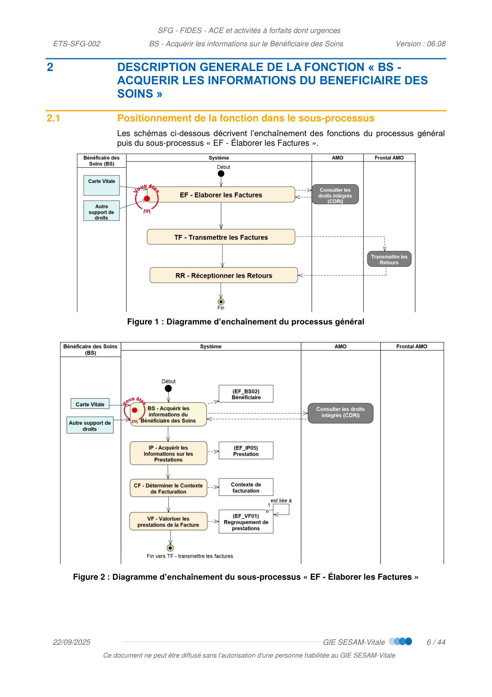
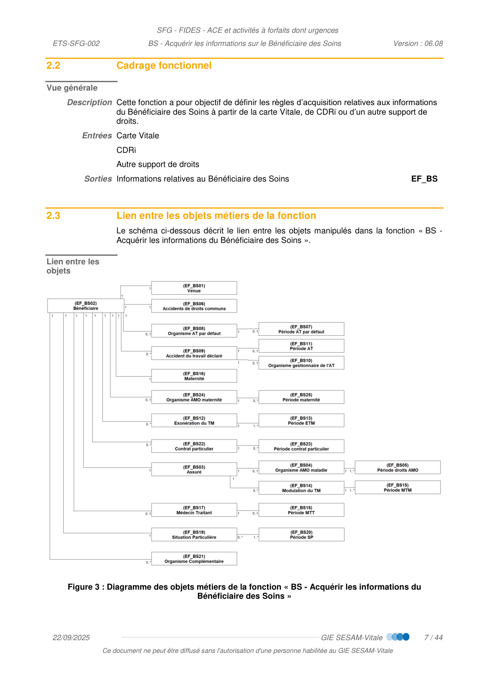
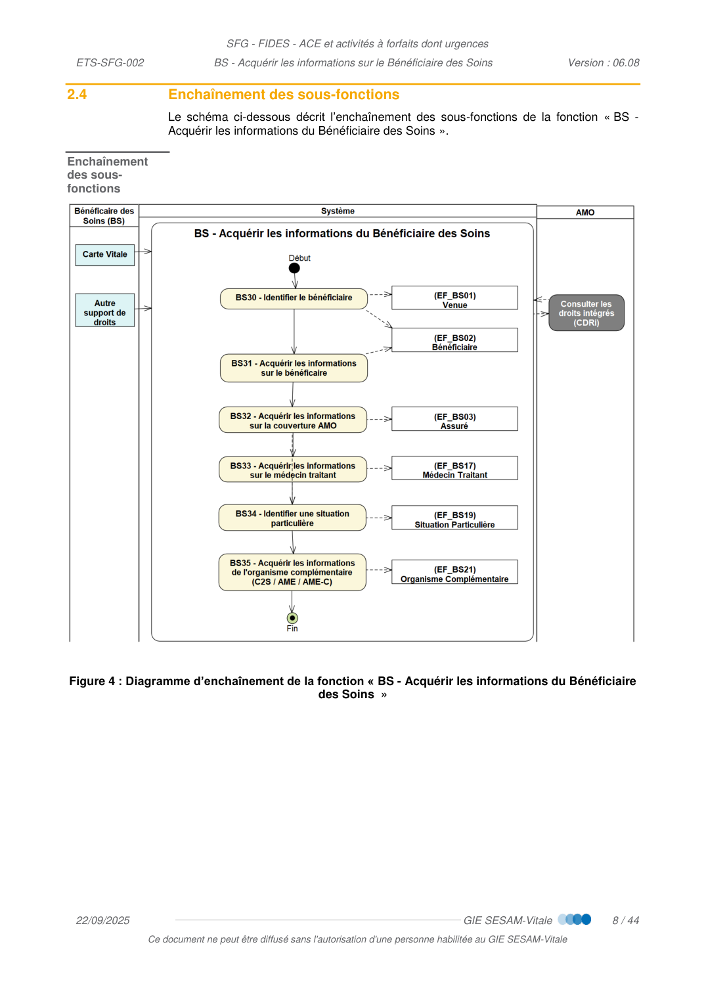
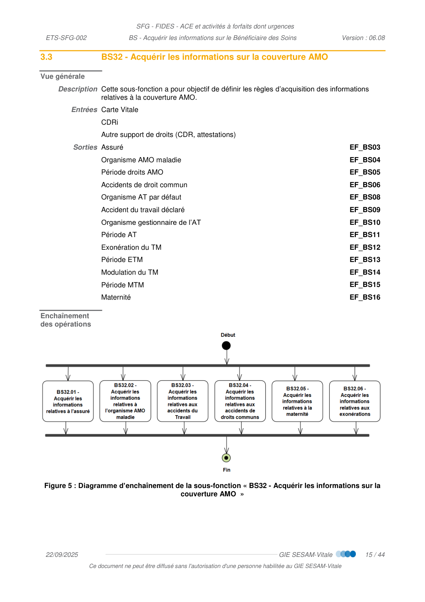

# BS — Acquérir les informations du Bénéficiaire des Soins

_Pages 43–86 du PDF source._

<!-- p.43 -->
BS  -  Acquérir les informations sur le
Bénéficiaire des Soins

<!-- p.44 -->
BS - Acquérir les informations sur le Bénéficiaire des Soins
arrangement, quel que soit le procédé utilisé.
des sanctions pour l’auteur du délit.
CONTACTS
Pour toute question technique ou fonctionnelle, contactez le Centre de services :
•
e-mail : centre-de-service@sesam-vitale.fr

<!-- p.45 -->
BS - Acquérir les informations sur le Bénéficiaire des Soins
1
1.1
1.2
1.3
1.4
1.5
1.6
2
DESCRIPTION GENERALE DE LA FONCTION « BS - ACQUERIR LES INFORMATIONS DU
2.1
2.2
2.3
2.4
3
DESCRIPTION DETAILLEE DE LA FONCTION « BS - ACQUERIR LES INFORMATIONS DU
3.1
3.2
3.3
3.3.1
3.3.2
3.3.3
3.3.4
3.3.5
3.3.6
3.4
3.5
3.6
4
5
TABLE DES ILLUSTRATIONS
FIGURE 3 : DIAGRAMME DES OBJETS METIERS DE LA FONCTION « BS - ACQUERIR LES INFORMATIONS DU
FIGURE 4 : DIAGRAMME D’ENCHAINEMENT DE LA FONCTION « BS - ACQUERIR LES INFORMATIONS DU BENEFICIAIRE

<!-- p.46 -->
BS - Acquérir les informations sur le Bénéficiaire des Soins
FIGURE 5 : DIAGRAMME D’ENCHAINEMENT DE LA SOUS-FONCTION « BS32 - ACQUERIR LES INFORMATIONS SUR LA

<!-- p.47 -->
BS - Acquérir les informations sur le Bénéficiaire des Soins

## 1 INTRODUCTION

### 1.1 Objet du document

Ce document a pour objet de spécifier la fonction « BS : Acquérir les informations du
Bénéficiaire des Soins » appartenant au sous-processus « EF : Élaborer les Factures ».

### 1.2 Statut du document

De référence

### 1.3 Positionnement du document dans le dossier de SFG

 Cf. [PG] – Présentation Générale

### 1.4 Documents de référence

 Cf. [PG] – Présentation Générale

### 1.5 Abréviations et définitions

 Cf. [DICO] - Dictionnaire de données

### 1.6 Guide de lecture

 Cf. [PG] – Présentation Générale

<!-- p.48 -->
BS - Acquérir les informations sur le Bénéficiaire des Soins

## 2 DESCRIPTION GENERALE DE LA FONCTION « BS - ACQUERIR LES INFORMATIONS DU BENEFICIAIRE DES SOINS »

### 2.1 Positionnement de la fonction dans le sous-processus

Les schémas ci-dessous décrivent l’enchaînement des fonctions du processus général
puis du sous-processus « EF - Élaborer les Factures ».
Figure 1 : Diagramme d’enchaînement du processus général
Figure 2 : Diagramme d’enchaînement du sous-processus « EF - Élaborer les Factures »

*Figure (p.48) : Figure 1 : Diagramme d’enchaînement du processus général*

<!-- p.49 -->
BS - Acquérir les informations sur le Bénéficiaire des Soins

### 2.2 Cadrage fonctionnel

Vue générale
Description Cette fonction a pour objectif de définir les règles d’acquisition relatives aux informations
du Bénéficiaire des Soins à partir de la carte Vitale, de CDRi ou d’un autre support de
droits.
Entrées Carte Vitale
CDRi
Autre support de droits
Sorties Informations relatives au Bénéficiaire des Soins
EF_BS

### 2.3 Lien entre les objets métiers de la fonction

Le schéma ci-dessous décrit le lien entre les objets manipulés dans la fonction « BS -
Acquérir les informations du Bénéficiaire des Soins ».
Lien entre les
objets
Figure 3 : Diagramme des objets métiers de la fonction « BS - Acquérir les informations du
Bénéficiaire des Soins »

*Figure (p.49) : Figure 3 : Diagramme des objets métiers de la fonction « BS - Acquérir les informations du*

<!-- p.50 -->
BS - Acquérir les informations sur le Bénéficiaire des Soins

### 2.4 Enchaînement des sous-fonctions

Le schéma ci-dessous décrit l’enchaînement des sous-fonctions de la fonction « BS -
Acquérir les informations du Bénéficiaire des Soins ».
Enchaînement
des sous-
fonctions
Figure 4 : Diagramme d’enchaînement de la fonction « BS - Acquérir les informations du Bénéficiaire
des Soins  »

*Figure (p.50) : Figure 4 : Diagramme d’enchaînement de la fonction « BS - Acquérir les informations du Bénéficiaire*

<!-- p.51 -->
BS - Acquérir les informations sur le Bénéficiaire des Soins

## 3 DESCRIPTION DETAILLEE DE LA FONCTION « BS - ACQUERIR LES INFORMATIONS DU BENEFICIAIRE DES SOINS »

Support de droits
Les supports de droits permettant l’acquisition des informations du bénéficiaire des soins
sont les suivants :
 Carte Vitale
 CDRi
 Autre support : CDR, attestations diverses (de droits AMO ou à l’AME, la C2S, le
feuillet AT, etc.)

### 3.1 BS30 - Identifier le bénéficiaire

Vue générale
Description Cette opération a pour objectif de définir les règles d’acquisition des données
nécessaires à l’identification d’un bénéficiaire et de sa venue.
 Remarque : Consigne pour la date de naissance (EF_BS02_01)
En cas de différence entre la date de naissance présente sur la carte Vitale (ou
autre support de droits AMO) et la date de naissance présente sur des documents
d’identité, c’est la date de naissance présente sur les supports AMO qui doit être
renseignée sur la facture transmise à l’Assurance Maladie.
Entrées Carte Vitale
 CDRi
 Autre support de droits (CDR, attestations)
Sorties Venue
EF_BS01
 Bénéficiaire
EF_BS02

<!-- p.52 -->
BS - Acquérir les informations sur le Bénéficiaire des Soins
Règles de
gestion
[RG_BS600] Acquérir les informations de la Venue (EF_BS01)
Le système de facturation doit permettre la saisie des informations suivantes :
Champ
Valeurs possibles dans ce contexte
EF_BS01_01
N° d’entrée
Issue du logiciel
EF_ BS01_02
Date d’entrée
Date de l’admission du BS dans l’établissement
géographique.
Issue du logiciel
EF_ BS01_03
Date de sortie
Date de sortie du BS de l’établissement géographique.
Issue du logiciel
EF_ BS01_04
Heure de sortie1
Issue du logiciel
 valorisée sur deux caractères
EF_ BS01_05
Contexte de la venue
 « Prestations en environnement hospitalier »
IDENTIFICATION DU BENEFICIAIRE A PARTIR DE LA CARTE VITALE
[RG_BS601] Identifier le Bénéficiaire (EF_BS02) à partir de la Carte Vitale
EF_BS02 :
Bénéficiaire
Données API Lecture Vitale 6.xx
Réf.
Nom
Source
Libellé
Précision
01
Date de
naissance

<ident><naissance><date>
Ou
<ident><naissance><dateEnCarte>
Date de
naissance
 Cf. « [CP02] Absence du
siècle de naissance »
« [CP03] Date de naissance
lunaire »
02
Rang de
naissance

<ident><rangDeNaissance>
Rang de
naissance
03
NIR
certifié +
clé

<ident><nirCertifie>
Matricule
bénéficiaire
+ Clé
 Cas particuliers
[CP01] : Carte avec plusieurs bénéficiaires
Dans le cas d’une carte comportant plusieurs bénéficiaires, le système de facturation doit
permettre la sélection du bénéficiaire des soins pour lequel la facture est élaborée.
[CP02] : Date de naissance lunaire
La date de naissance des bénéficiaires de soins nés à l’étranger peut parfois contenir des
spécificités relatives à la valorisation du mois ou du jour renseigné, ces dates sont dites
« Lunaires » :
1 L’heure de sortie doit être.

<!-- transcrit de p.52 (ex-figure) -->

**[RG_BS600] Acquérir les informations de la Venue (EF_BS01)**

Le système de facturation doit permettre la saisie des informations suivantes :

| Réf. | Champ | Valeurs possibles dans ce contexte |
| --- | --- | --- |
| EF_BS01_01 | N° d’entrée | Issue du logiciel |
| EF_BS01_02 | Date d’entrée | Date de l’admission du BS dans l’établissement géographique. Issue du logiciel |
| EF_BS01_03 | Date de sortie | Date de sortie du BS de l’établissement géographique. Issue du logiciel |
| EF_BS01_04 | Heure de sortie¹ | Issue du logiciel — valorisée sur deux caractères |
| EF_BS01_05 | Contexte de la venue | « Prestations en environnement hospitalier » |

**[RG_BS601] Identifier le Bénéficiaire (EF_BS02) à partir de la Carte Vitale**

| EF_BS02 : Bénéficiaire — Réf. | Nom | Source (Données API Lecture Vitale 6.xx) | Libellé | Précision |
| --- | --- | --- | --- | --- |
| 01 | Date de naissance | `<ident><naissance><date>` ou `<ident><naissance><dateEnCarte>` | Date de naissance | Cf. « [CP02] Absence du siècle de naissance », « [CP03] Date de naissance lunaire » |
| 02 | Rang de naissance | `<ident><rangDeNaissance>` | Rang de naissance | |
| 03 | NIR certifié + clé | `<ident><nirCertifie>` | Matricule bénéficiaire + Clé | |

<!-- p.53 -->
BS - Acquérir les informations sur le Bénéficiaire des Soins
En présence d’un mois lunaire la date de naissance est ramenée au 01/01 de l’année de
naissance.
Remarque : lors de la transmission de la facture à l’Assurance Maladie, c’est la date de
naissance lunaire (celle présente en Carte Vitale) qui doit être transmise.
[CP03] : Absence du siècle de naissance
Lorsque le siècle de naissance n’est pas renseigné, l’API de lecture de la carte Vitale
retourne
la
valeur
de
la
date
de
naissance
via
la
balise
« <ident><naissance><dateEnCarte> ». Le système de facturation doit alors permettre la
saisie manuelle du siècle de naissance. À noter que la mise à jour de la carte Vitale peut
éventuellement permettre la mise à jour du siècle de naissance.
IDENTIFICATION DU BENEFICIAIRE A PARTIR D’UN AUTRE SUPPORT
[RG_BS602] Identifier le Bénéficiaire (EF_BS02) à partir d’un autre support
En l’absence de la Carte Vitale, le système de facturation doit permettre l’identification du
bénéficiaire en récupérant les informations suivantes
Champ
EF_BS02_01
Date de naissance
EF_ BS02_02
Rang de naissance
EF_BS02_03
N° national
d’immatriculation
EF_ BS02_03
Clé du NIR
 Cas particuliers
[CP01] : Numéro provisoire du Régime Agricole
Le régime Agricole (code régime EF_BS04_01 = « 02 ») possède des numéros provisoires.
Ils se reconnaissent par les 6 premiers chiffres qui ont tous la valeur 5.
A l'affichage, ceux-ci peuvent être remplacés par "PROVIS".
 Situation particulière
[SP10] : le bénéficiaire des soins demande le secret (facture anonyme)
En l’absence de support Vitale, les données d’identification et de droits AMO peuvent ne
pas être renseignées.
Le tableau suivant recense les informations à renseigner :

<!-- transcrit de p.53 (ex-figure) -->

**[RG_BS602] Identifier le Bénéficiaire (EF_BS02) à partir d’un autre support**

En l’absence de la Carte Vitale, le système de facturation doit permettre l’identification du bénéficiaire en récupérant les informations suivantes :

| Réf. | Champ |
| --- | --- |
| EF_BS02_01 | Date de naissance |
| EF_BS02_02 | Rang de naissance |
| EF_BS02_03 | N° national d’immatriculation |
| EF_BS02_03 | Clé du NIR |

<!-- p.54 -->
BS - Acquérir les informations sur le Bénéficiaire des Soins
Champ
Valeur à renseigner
EF_BS02_01
Date de naissance
Renseignée avec la valeur réelle
 Certaines situation d’anonymisation de facture
autorise l’utilisation d‘une date de naissance fictive
lorsque le BS ne souhaite pas la communiquer,
sinon la date de naissance réelle est demandée.
EF_ BS02_02
Rang de naissance
« 1 »
EF_BS02_08
Code qualité du
bénéficiaire
« 1 » (assuré)
Autres données
peuvent être non renseignées
 Dans ce cas, seule une facture anonyme pourra être transmise.
[RG_BS603] Contrôler la clé du NIR
Ce contrôle a pour objet de vérifier que la clé du NIR correspond bien au NIR lorsque celui-
ci a été directement saisi dans le système de facturation.
La clé du NIR est calculée par une formule mathématique, qui ne peut s'appliquer que sur
des valeurs numériques. Il convient donc de remplacer les lettres présentes pour les
assurés nés en Corse tel que :
 La valeur 2A doit être remplacée par la valeur 19 ;
 La valeur 2B doit être remplacée par la valeur 18.
La formule à appliquer pour vérifier la clé du NIR est la suivante :
Clé NIR = 97 - ((Valeur numérique du NIR) modulo 97).

<!-- transcrit de p.54 (ex-figure) -->

Tableau des informations à renseigner pour une facture anonyme ([SP10]) :

| Réf. | Champ | Valeur à renseigner |
| --- | --- | --- |
| EF_BS02_01 | Date de naissance | Renseignée avec la valeur réelle. ⚠ Certaines situation d’anonymisation de facture autorise l’utilisation d‘une date de naissance fictive lorsque le BS ne souhaite pas la communiquer, sinon la date de naissance réelle est demandée. |
| EF_BS02_02 | Rang de naissance | « 1 » |
| EF_BS02_08 | Code qualité du bénéficiaire | « 1 » (assuré) |
| | Autres données | peuvent être non renseignées |

⚠ Dans ce cas, seule une facture anonyme pourra être transmise.

<!-- p.55 -->
BS - Acquérir les informations sur le Bénéficiaire des Soins

### 3.2 BS31 - Acquérir les informations sur le bénéficiaire

Vue générale
Description Cette sous-fonction a pour objectif de définir les règles d’acquisition des informations
relatives à l’identité du bénéficiaire
Entrées Carte Vitale
CDRi
Autre support de droits (CDR, attestations)
Sorties Bénéficiaire
EF_BS02
Règles de
gestion
ACQUISITION A PARTIR DE LA CARTE VITALE
[RG_BS610] Acquérir les informations du Bénéficiaire (EF_BS02) à partir de la Carte Vitale
EF_BS02 :
Bénéficiaire
Données API Lecture Vitale 6.xx
Réf.
Nom
Source
Libellé
Précision
04
Nom de famille
(ou nom de
naissance)

<ident><nomPatronymique>
Nom de
famille du
porteur de la
carte
Ces données ne sont pas
utilisées dans le processus
de facturation
05
Nom d’usage

<ident><nomUsuel>
Nom d’usage
06
Prénom

<ident><prenomUsuel>
Prénom
d’usage
07
Date de
certification du
NIR

<ident><dateCertification>
Date de
certification
du NIR
08
Code qualité
du bénéficiaire

<amo><qualBenef>
Qualité du
bénéficiaire
09
Adresse ligne
1

<ident><adresse>
Remarque : il s’agit de
l’adresse du porteur de la
Carte
Ces données ne sont pas
utilisées dans le processus
de facturation vers
l’Assurance Maladie
10
Adresse ligne
2
Adresse ligne
1
11
Adresse ligne
3
Adresse ligne
2
12
Adresse ligne
4
Adresse ligne
3
13
Adresse ligne
5
Adresse ligne
4
14
Adresse ligne
6
Adresse ligne
5

<!-- transcrit de p.55 (ex-figure) -->

**[RG_BS610] Acquérir les informations du Bénéficiaire (EF_BS02) à partir de la Carte Vitale**

| EF_BS02 : Bénéficiaire — Réf. | Nom | Source (Données API Lecture Vitale 6.xx) | Libellé | Précision |
| --- | --- | --- | --- | --- |
| 04 | Nom de famille (ou nom de naissance) | `<ident><nomPatronymique>` | Nom de famille du porteur de la carte | Ces données ne sont pas utilisées dans le processus de facturation |
| 05 | Nom d’usage | `<ident><nomUsuel>` | Nom d’usage | Ces données ne sont pas utilisées dans le processus de facturation |
| 06 | Prénom | `<ident><prenomUsuel>` | Prénom d’usage | Ces données ne sont pas utilisées dans le processus de facturation |
| 07 | Date de certification du NIR | `<ident><dateCertification>` | Date de certification du NIR | Ces données ne sont pas utilisées dans le processus de facturation |
| 08 | Code qualité du bénéficiaire | `<amo><qualBenef>` | Qualité du bénéficiaire | Ces données ne sont pas utilisées dans le processus de facturation |
| 09 | Adresse ligne 1 | `<ident><adresse>` (Remarque : il s’agit de l’adresse du porteur de la Carte) | | Ces données ne sont pas utilisées dans le processus de facturation vers l’Assurance Maladie |
| 10 | Adresse ligne 2 | | Adresse ligne 1 | |
| 11 | Adresse ligne 3 | | Adresse ligne 2 | |
| 12 | Adresse ligne 4 | | Adresse ligne 3 | |
| 13 | Adresse ligne 5 | | Adresse ligne 4 | |
| 14 | Adresse ligne 6 | | Adresse ligne 5 | |

<!-- p.56 -->
BS - Acquérir les informations sur le Bénéficiaire des Soins
ACQUISITION A PARTIR DE CDRi
[RG_BS611] Acquérir les informations du Bénéficiaire (EF_BS02) à partir de CDRi
EF_BS02 : Bénéficiaire
Données service CDRi
Réf.
Nom
Nom EF
Données
Précision
04
Nom de famille
(ou nom de
naissance)

CDRi03.01 :
Bénéficiaire
Nom de famille
Ces données ne sont pas utilisées
dans le processus de facturation
05
Nom d’usage
Nom d’usage
06
Prénom
Prénom
07
Date de
certification du
NIR
08
Code qualité du
bénéficiaire
Code qualité du
bénéficiaire
09
Adresse ligne 1
Adresse ligne 1
Ces données ne sont pas utilisées
dans le processus de facturation vers
l’Assurance Maladie
10
Adresse ligne 2
Adresse ligne 2
11
Adresse ligne 3
Adresse ligne 3
12
Adresse ligne 4
Adresse ligne 4
13
Adresse ligne 5
Adresse ligne 5
14
Adresse ligne 6
Adresse ligne 6
ACQUISITION A PARTIR D’UN AUTRE SUPPORT
[RG_BS612] Acquérir les informations du Bénéficiaire (EF_BS02) à partir d’un autre support de
droits
Le système de facturation doit permettre la saisie des informations suivantes :
 Code qualité du bénéficiaire
(EF_BS02_08).

<!-- transcrit de p.56 (ex-figure) -->

**[RG_BS611] Acquérir les informations du Bénéficiaire (EF_BS02) à partir de CDRi**

| EF_BS02 : Bénéficiaire — Réf. | Nom | Nom EF | Données (Données service CDRi) | Précision |
| --- | --- | --- | --- | --- |
| 04 | Nom de famille (ou nom de naissance) | CDRi03.01 : Bénéficiaire | Nom de famille | Ces données ne sont pas utilisées dans le processus de facturation |
| 05 | Nom d’usage | | Nom d’usage | Ces données ne sont pas utilisées dans le processus de facturation |
| 06 | Prénom | | Prénom | Ces données ne sont pas utilisées dans le processus de facturation |
| 07 | Date de certification du NIR | | | Ces données ne sont pas utilisées dans le processus de facturation |
| 08 | Code qualité du bénéficiaire | | Code qualité du bénéficiaire | Ces données ne sont pas utilisées dans le processus de facturation |
| 09 | Adresse ligne 1 | | Adresse ligne 1 | Ces données ne sont pas utilisées dans le processus de facturation vers l’Assurance Maladie |
| 10 | Adresse ligne 2 | | Adresse ligne 2 | |
| 11 | Adresse ligne 3 | | Adresse ligne 3 | |
| 12 | Adresse ligne 4 | | Adresse ligne 4 | |
| 13 | Adresse ligne 5 | | Adresse ligne 5 | |
| 14 | Adresse ligne 6 | | Adresse ligne 6 | |

<!-- p.57 -->
BS - Acquérir les informations sur le Bénéficiaire des Soins

### 3.3 BS32 - Acquérir les informations sur la couverture AMO

Vue générale
Description Cette sous-fonction a pour objectif de définir les règles d’acquisition des informations
relatives à la couverture AMO.
Entrées Carte Vitale
CDRi
Autre support de droits (CDR, attestations)
Sorties Assuré
EF_BS03
Organisme AMO maladie
EF_BS04
Période droits AMO
EF_BS05
Accidents de droit commun
EF_BS06
Organisme AT par défaut
EF_BS08
Accident du travail déclaré
EF_BS09
Organisme gestionnaire de l’AT
EF_BS10
Période AT
EF_BS11
Exonération du TM
EF_BS12
Période ETM
EF_BS13
Modulation du TM
EF_BS14
Période MTM
EF_BS15
Maternité
EF_BS16
Enchaînement
des opérations
Figure 5 : Diagramme d’enchaînement de la sous-fonction « BS32 - Acquérir les informations sur la
couverture AMO  »

*Figure (p.57) : Figure 5 : Diagramme d’enchaînement de la sous-fonction « BS32 - Acquérir les informations sur la*

<!-- p.58 -->
BS - Acquérir les informations sur le Bénéficiaire des Soins
3.3.1
BS32.01 - Acquérir les informations relatives à l’assuré
Vue générale
Description Cette opération a pour objectif de définir les règles d’acquisition des informations
relatives à l’assuré.
Entrées Carte Vitale
 CDRi
 Autre support de droits (CDR, attestations)
Sorties Assuré
EF_BS03
Règles de
gestion
ACQUISITION A PARTIR DE LA CARTE VITALE
[RG_BS620] Acquérir les informations de l’Assuré (EF_BS03) à partir de la Carte Vitale
EF_BS03 : Assuré
Données API Lecture Vitale 6.xx
Réf.
Nom
Source
Libellé
Précision
01
NIR de l’assuré + clé

<ident><nir>
Matricule assuré + Clé
02
Nature de la PJ AMO

Lorsque les données de droits AMO utilisées pour la facturation sont issues de la
Carte Vitale, la nature de la PJ prend la valeur « 4 »
03
Code gestion BGDH

<amo><codeGestion>
Code gestion BGDH
ACQUISITION A PARTIR DE CDRi
[RG_BS621] Acquérir les informations de l’Assuré (EF_BS03) à partir de CDRi
* En cas d’acquisition des informations du bénéficiaire des soins par le service CDRi et
utilisation des données sur la part obligatoire dans la facture, la nature de la pièce
justificative AMO dans la facture est égale à la valeur issue de la réponse du service CDRi
(CDRi03.04 Nature de la PJ AMO).
Cette règle s’applique dans les cas où les droits dans la facture sont ceux issus de CDRi :
 non modifiés,
 non modifiés et complétés d’un contexte de facturation (AT, soins exonérés par
nature,…)
De plus, l’interrogation de CDRi doit avoir été effectuée dans le délai d’expiration de la
réponse qui précède la facturation (cf. [SFG CDRi]).
EF_BS03 : Assuré
Données service CDRi
Réf.
Nom
Nom EF
Nom EF
Précision
01
NIR de l’assuré + clé

CDRi03.02 : Assuré
NIR de l’assuré + clé
02
Nature de la PJ AMO

CDRi03.04 : Organisme
gestionnaire maladie
Nature de la PJ AMO
Voir ci-dessous*
03
Code gestion BGDH

CDRi03.04 : Code BGDH
Code BGDH

<!-- transcrit de p.58 (ex-figure) -->

**[RG_BS620] Acquérir les informations de l’Assuré (EF_BS03) à partir de la Carte Vitale**

| EF_BS03 : Assuré — Réf. | Nom | Source (Données API Lecture Vitale 6.xx) | Libellé | Précision |
| --- | --- | --- | --- | --- |
| 01 | NIR de l’assuré + clé | `<ident><nir>` | Matricule assuré + Clé | |
| 02 | Nature de la PJ AMO | Lorsque les données de droits AMO utilisées pour la facturation sont issues de la Carte Vitale, la nature de la PJ prend la valeur « 4 » | | |
| 03 | Code gestion BGDH | `<amo><codeGestion>` | Code gestion BGDH | |

**[RG_BS621] Acquérir les informations de l’Assuré (EF_BS03) à partir de CDRi**

| EF_BS03 : Assuré — Réf. | Nom | Nom EF | Nom EF (Données service CDRi) | Précision |
| --- | --- | --- | --- | --- |
| 01 | NIR de l’assuré + clé | CDRi03.02 : Assuré | NIR de l’assuré + clé | |
| 02 | Nature de la PJ AMO | CDRi03.04 : Organisme gestionnaire maladie | Nature de la PJ AMO | Voir ci-dessous* |
| 03 | Code gestion BGDH | CDRi03.04 : Code BGDH | Code BGDH | |

<!-- p.59 -->
BS - Acquérir les informations sur le Bénéficiaire des Soins
 Cas particuliers
[CP01] : Modification d’une information AMO issue du service CDRi
Toute modification d’une information issue du service CDRi concernant les droits sur la
part obligatoire implique un changement sur le type de support AMO et donc de la nature
de pièce justificative AMO.
A l’exception des données suivantes dont la modification n’entraine pas de changement
de la nature de pièce justificative AMO :
 nom du médecin traitant,
 prénom du médecin traitant,
 numéro Assurance Maladie du médecin traitant,
 et toute donnée qui n’est pas utilisée dans la construction de la facturation.
ACQUISITION A PARTIR D’UN AUTRE SUPPORT
[RG_BS622] Acquérir les informations de l’Assuré (EF_BS03) à partir d’un autre support de droits
Le système de facturation doit permettre la saisie des informations suivantes :
 NIR de l’assuré
(EF_BS03_01) ;
 Clé du NIR de l’assuré
(EF_BS03_01) ;
○ Cf. [RG_BS603] pour contrôler la clé du NIR de l’assuré.
 Nature de la PJ AMO
(EF_BS03_02)
○ Lorsque les données de droits AMO utilisées pour la facturation ne sont pas issues
de la Carte Vitale ni de CDRi, la nature de la PJ prend les valeurs suivantes en
fonction du support utilisé :
Type de support
Nature de la PJ AMO
Aucune pièce justificative
0
Attestations (bulletins de salaires, de droits, prise en charge
AME, attestation de C2S, …)
1
Attestation d’ouverture des droits (CDR ou attestation de
droits)
2
Prise en charge (cliniques et cures thermales)
-> ne concerne que les Cliniques Privées
3
 Cas particulier
[CP1] : Les droits ont été renvoyés par CDRi
Dans le cas d’une prise en charge (cliniques et cures thermales) et uniquement dans ce
cas, la nature de la PJ renvoyée par CDRi doit être modifiée pour transmettre la valeur 5.
 Ce cas particulier ne s’applique que dans le contexte des cliniques privées et pour les
assurés du Régime Général.
 Situation particulière
[SP10] : le bénéficiaire des soins demande le secret (facture anonyme)
L’assuré étant forcément le BS, les consignes précisées en RG_BS610 [SP10]
s’appliquent.

<!-- transcrit de p.59 (ex-figure) -->

Valeurs de la nature de la PJ AMO (EF_BS03_02) en fonction du support utilisé :

| Type de support | Nature de la PJ AMO |
| --- | --- |
| Aucune pièce justificative | 0 |
| Attestations (bulletins de salaires, de droits, prise en charge AME, attestation de C2S, …) | 1 |
| Attestation d’ouverture des droits (CDR ou attestation de droits) | 2 |
| Prise en charge (cliniques et cures thermales) -> ne concerne que les Cliniques Privées | 3 |

<!-- p.60 -->
BS - Acquérir les informations sur le Bénéficiaire des Soins
3.3.2
BS32.02 - Acquérir les informations relatives à l’organisme AMO maladie
Vue générale
Description Cette opération a pour objectif de définir les règles d’acquisition des informations
relatives à l’organisme AMO maladie.
Entrées Carte Vitale
 CDRi
 Autre support de droits (CDR, attestations)
Sorties Organisme AMO maladie
EF_BS04
 Période droits AMO
EF_BS05
Règles de
gestion
ACQUISITION A PARTIR DE LA CARTE VITALE
[RG_BS630] Acquérir les informations de l’Organisme AMO maladie (EF_BS04) à partir de la
Carte Vitale
EF_BS04 : Organisme AMO
maladie
Données API Lecture Vitale 6.xx
Réf.
Nom
Source
Libellé
Précision
01
Code régime

<amo><codeRegime>
Code régime
02
Code caisse gestionnaire

<amo><caisse>
Code caisse
gestionnaire
03
Code centre de gestion

<amo><centreCarte>
Code centre de Gestion
[RG_BS631] Acquérir les informations de la Période de droits AMO (EF_BS05) à partir de la Carte
Vitale
EF_BS05 : Période de droits
AMO
Données API Lecture Vitale 6.xx
Réf.
Nom
Source
Libellé
Précision
01
Date début droits AMO

<amo>
<listePeriodesDroits>
Période(s) de
droits de base
Il peut y avoir jusqu’à
trois périodes de
droits pour chaque
bénéficiaire.
02
Date fin droits AMO

ACQUISITION A PARTIR DE CDRi
[RG_BS632] Acquérir les informations de l’Organisme AMO maladie (EF_BS04) à partir de CDRi
EF_BS04 : Organisme AMO
maladie
Données service CDRi
Réf.
Nom
Nom EF
Nom EF
01
Code régime

Code régime

<!-- transcrit de p.60 (ex-figure) -->

#### 3.3.2 BS32.02 - Acquérir les informations relatives à l'organisme AMO maladie

**Vue générale**

- **Description** : Cette opération a pour objectif de définir les règles d'acquisition des informations relatives à l'organisme AMO maladie.
- **Entrées** : Carte Vitale ; CDRi ; Autre support de droits (CDR, attestations)
- **Sorties** :
  - Organisme AMO maladie — **EF_BS04**
  - Période droits AMO — **EF_BS05**

**Règles de gestion**

*ACQUISITION A PARTIR DE LA CARTE VITALE*

[RG_BS630] Acquérir les informations de l'Organisme AMO maladie (EF_BS04) à partir de la Carte Vitale

| EF_BS04 : Organisme AMO maladie — Réf. | Nom | | Source (Données API Lecture Vitale 6.xx) | Libellé | Précision |
| --- | --- | --- | --- | --- | --- |
| 01 | Code régime | ← | `<amo><codeRegime>` | Code régime | |
| 02 | Code caisse gestionnaire | ← | `<amo><caisse>` | Code caisse gestionnaire | |
| 03 | Code centre de gestion | ← | `<amo><centreCarte>` | Code centre de Gestion | |

[RG_BS631] Acquérir les informations de la Période de droits AMO (EF_BS05) à partir de la Carte Vitale

| EF_BS05 : Période de droits AMO — Réf. | Nom | | Source (Données API Lecture Vitale 6.xx) | Libellé | Précision |
| --- | --- | --- | --- | --- | --- |
| 01 | Date début droits AMO | ← | `<amo><listePeriodesDroits>` | Période(s) de droits de base | Il peut y avoir jusqu'à trois périodes de droits pour chaque bénéficiaire. |
| 02 | Date fin droits AMO | ← | `<amo><listePeriodesDroits>` | Période(s) de droits de base | Il peut y avoir jusqu'à trois périodes de droits pour chaque bénéficiaire. |

*ACQUISITION A PARTIR DE CDRi*

[RG_BS632] Acquérir les informations de l'Organisme AMO maladie (EF_BS04) à partir de CDRi

| EF_BS04 : Organisme AMO maladie — Réf. | Nom | | Données service CDRi (Nom EF) | Données service CDRi (Nom EF) |
| --- | --- | --- | --- | --- |
| 01 | Code régime | ← | CDRi03.04 : Organisme gestionnaire maladie | Code régime |
| 02 | Code caisse gestionnaire | ← | CDRi03.04 : Organisme gestionnaire maladie | Code caisse gestionnaire |
| 03 | Code centre de gestion | ← | CDRi03.04 : Organisme gestionnaire maladie | Code centre de gestion |

<!-- p.61 -->
BS - Acquérir les informations sur le Bénéficiaire des Soins
[RG_BS633] Acquérir les informations de la Période de droits AMO (EF_BS05) à partir de CDRi
[RG_BS634] Acquérir le code contrat particulier SNCF (EF_BS22_01) à partir de CDRi
Le code contrat CDRi est utilisé dans certaines règles, notamment pour la détermination
du taux pour le régime spécial de la CPRPF.
Les valeurs spécifiques utilisées sont les suivantes :
02
Code caisse gestionnaire

CDRi03.04 : Organisme
gestionnaire maladie
Code caisse gestionnaire
03
Code centre de gestion

Code centre de gestion
EF_BS05 : Période de droits
AMO
Données service CDRi
Réf.
Nom
Nom EF
Nom EF
01
Date début droits AMO

CDRi03.04 : Période
droits AMO
Date début droits AMO
02
Date fin droits AMO

Date fin droits AMO
EF_BS22 : Contrat particulier
Données service CDRi
Réf.
Nom
Nom EF
Nom EF
01
code contrat particulier

CDRi03.05 : Contrat
particulier
code contrat particulier
Code
contrat
particulier
CPRPSNC
F
Type
contra
t
Libellé
Description
18
Caisses de rattachement
Régime SNCF
Caisse de
Prévoyance
Il s’agit des bénéficiaires du Régime spécial SNCF ayant droit à la
réglementation spécifique du régime.
19
Régime SNCF
Divers
Régimes de
Prévoyance
Il s’agit d’une catégorie de bénéficiaires du Régime spécial SNCF
pouvant prétendre aux prestations de base du régime spécial
(Régime SNCF Caisse de Prévoyance), ainsi qu’à des prestations
complémentaires (régime différentiel).
20
Régime SNCF
Subsistants
Il s’agit de bénéficiaires couverts par le régime CPRPF ne
pouvant prétendre aux prestations de base du régime spécial
SNCF.
Il s’agit notamment des personnes ayant cessé provisoirement ou
définitivement leurs fonctions à la SNCF.
21
Régime SNCF
CMAL
Il s’agit des anciens ressortissants de la Caisse Maladie d’Alsace
Lorraine (CMAL).
22
Caractéristiques
population
Régime SNCF
Actifs
Il s’agit des personnes exerçant une activité professionnelle au
sein de la SNCF.
23
Régime SNCF
Non Actifs
Il s’agit des personnes n’exerçant pas ou plus d’activité
professionnelle au sein de la SNCF. On y trouve notamment les
retraités et les ayants droit.
24
Régime SNCF
Hors Zone
Médicale
Il s’agit de bénéficiaire en activité du régime spécial SNCF
résidant dans une zone géographique non couverte par des
médecins agréés SNCF.

<!-- transcrit de p.61 (ex-figure) -->

[RG_BS633] Acquérir les informations de la Période de droits AMO (EF_BS05) à partir de CDRi

| EF_BS05 : Période de droits AMO — Réf. | Nom | | Données service CDRi (Nom EF) | Données service CDRi (Nom EF) |
| --- | --- | --- | --- | --- |
| 01 | Date début droits AMO | ← | CDRi03.04 : Période droits AMO | Date début droits AMO |
| 02 | Date fin droits AMO | ← | CDRi03.04 : Période droits AMO | Date fin droits AMO |

[RG_BS634] Acquérir le code contrat particulier SNCF (EF_BS22_01) à partir de CDRi

Le code contrat CDRi est utilisé dans certaines règles, notamment pour la détermination du taux pour le régime spécial de la CPRPF.

| EF_BS22 : Contrat particulier — Réf. | Nom | | Données service CDRi (Nom EF) | Données service CDRi (Nom EF) |
| --- | --- | --- | --- | --- |
| 01 | code contrat particulier | ← | CDRi03.05 : Contrat particulier | code contrat particulier |

Les valeurs spécifiques utilisées sont les suivantes :

| Code contrat particulier CPRPSNCF | Type contrat | Libellé | Description |
| --- | --- | --- | --- |
| 18 | Caisses de rattachement | Régime SNCF Caisse de Prévoyance | Il s'agit des bénéficiaires du Régime spécial SNCF ayant droit à la réglementation spécifique du régime. |
| 19 | Caisses de rattachement | Régime SNCF Divers Régimes de Prévoyance | Il s'agit d'une catégorie de bénéficiaires du Régime spécial SNCF pouvant prétendre aux prestations de base du régime spécial (Régime SNCF Caisse de Prévoyance), ainsi qu'à des prestations complémentaires (régime différentiel). |
| 20 | Caisses de rattachement | Régime SNCF Subsistants | Il s'agit de bénéficiaires couverts par le régime CPRPF ne pouvant prétendre aux prestations de base du régime spécial SNCF. Il s'agit notamment des personnes ayant cessé provisoirement ou définitivement leurs fonctions à la SNCF. |
| 21 | Caisses de rattachement | Régime SNCF CMAL | Il s'agit des anciens ressortissants de la Caisse Maladie d'Alsace Lorraine (CMAL). |
| 22 | Caractéristiques population | Régime SNCF Actifs | Il s'agit des personnes exerçant une activité professionnelle au sein de la SNCF. |
| 23 | Caractéristiques population | Régime SNCF Non Actifs | Il s'agit des personnes n'exerçant pas ou plus d'activité professionnelle au sein de la SNCF. On y trouve notamment les retraités et les ayants droit. |
| 24 | Caractéristiques population | Régime SNCF Hors Zone Médicale | Il s'agit de bénéficiaire en activité du régime spécial SNCF résidant dans une zone géographique non couverte par des médecins agréés SNCF. |

<!-- p.62 -->
BS - Acquérir les informations sur le Bénéficiaire des Soins
 Remarque : il y aura obligatoirement un (et un seul) contrat 18,19, 20 ou 21. Ces contrats
distinguent les caisses d'appartenance de l'assuré.
 Ce contrat (18 à 21), peut être complété de 0 à plusieurs contrats 22 à 25.
Par exemple :
 Un agent actif SNCF aura le contrat 18 (Régime CP) et 22 (agent en activité). Son
ayant droit (enfant ou conjoint) aura quant à lui les contrats 18 (Régime CP) et 23 (non
actif).
○ Pour info, CDRi remonte les informations du bénéficiaire donc de l’ayant droit
(enfant, conjoint) si c’est lui le bénéficiaire des soins ou de l’ouvrant droit (agent
actif) dans le cas contraire mais jamais les 2.
 Un subsistant aura le contrat 20. Les subsistants étant couverts par les règles de
régime Général, il n'est pas utile de distinguer la notion d'actif ou non actif => il n'y
aura pas d'autres contrats (22 à 25) dans le cas de subsistant.
[RG_BS635] Acquérir les informations de la Période contrat particulier (EF_BS23) à partir de CDRi
25
Régime SNCF
Pupille
Enfants de moins de 21 ans orphelins d’un agent SNCF décédé à
la suite d’un accident du travail ou d’une maladie professionnelle.
EF_BS05 : Période de droits
AMO
Données service CDRi
Réf.
Nom
Nom EF
Nom EF
01
Date début contrat
particulier

CDRi03.04 : Période
contrat particulier
Date début contrat
particulier
02
Date fin contrat particulier

Date fin contrat particulier

<!-- transcrit de p.62 (ex-figure) -->

| Code contrat particulier CPRPSNCF | Type contrat | Libellé | Description |
| --- | --- | --- | --- |
| 25 | Caractéristiques population | Régime SNCF Pupille | Enfants de moins de 21 ans orphelins d'un agent SNCF décédé à la suite d'un accident du travail ou d'une maladie professionnelle. |

**Remarque** : il y aura obligatoirement un (et un seul) contrat 18, 19, 20 ou 21. Ces contrats distinguent les caisses d'appartenance de l'assuré.

- Ce contrat (18 à 21), peut être complété de 0 à plusieurs contrats 22 à 25.

Par exemple :

- Un agent actif SNCF aura le contrat 18 (Régime CP) et 22 (agent en activité). Son ayant droit (enfant ou conjoint) aura quant à lui les contrats 18 (Régime CP) et 23 (non actif).
  - Pour info, CDRi remonte les informations du bénéficiaire donc de l'ayant droit (enfant, conjoint) si c'est lui le bénéficiaire des soins ou de l'ouvrant droit (agent actif) dans le cas contraire mais jamais les 2.
- Un subsistant aura le contrat 20. Les subsistants étant couverts par les règles de régime Général, il n'est pas utile de distinguer la notion d'actif ou non actif => il n'y aura pas d'autres contrats (22 à 25) dans le cas de subsistant.

[RG_BS635] Acquérir les informations de la Période contrat particulier (EF_BS23) à partir de CDRi

| EF_BS05 : Période de droits AMO — Réf. | Nom | | Données service CDRi (Nom EF) | Données service CDRi (Nom EF) |
| --- | --- | --- | --- | --- |
| 01 | Date début contrat particulier | ← | CDRi03.04 : Période contrat particulier | Date début contrat particulier |
| 02 | Date fin contrat particulier | ← | CDRi03.04 : Période contrat particulier | Date fin contrat particulier |

<!-- p.63 -->
BS - Acquérir les informations sur le Bénéficiaire des Soins
ACQUISITION A PARTIR D’UN AUTRE SUPPORT
[RG_BS636] Acquérir les informations de l’Organisme AMO maladie (EF_BS04) à partir d’un autre
support de droits
Le système de facturation doit permettre la saisie des informations suivantes :
 Code régime
(EF_BS04_01) ;
 Code caisse gestionnaire
(EF_BS04_02) ;
 Code centre de gestion
(EF_BS04_03).
 Situation particulière
[SP10] : le bénéficiaire des soins demande le secret (facture anonyme)
L’organisme AMO du BS peut être non renseigné car il ne sera pas nécessaire pour
l’élaboration de la facture
[RG_BS637] Acquérir les informations de la Période de droits AMO (EF_BS05) à partir d’un autre
support de droits
Le système de facturation doit permettre la saisie des informations suivantes :
 Date début droits AMO
(EF_BS05_01) ;
 Date fin droits AMO
(EF_BS05_02).
 Situation particulière
[SP10] : le bénéficiaire des soins demande le secret (facture anonyme)
Les informations sur la période de droits ne sont pas nécessaires pour l’élaboration de la
facture

<!-- p.64 -->
BS - Acquérir les informations sur le Bénéficiaire des Soins
3.3.3
BS32.03 - Acquérir les informations relatives aux accidents du Travail
Vue générale
Description Cette opération a pour objectif de définir les règles d’acquisition des informations
relatives aux accidents du travail.
Entrées Carte Vitale
CDRi
Autre support de droits (CDR, attestations)
Sorties Organisme AT par défaut
EF_BS08
Accident du travail déclaré
EF_BS09
Organisme gestionnaire de l’AT
EF_BS10
Période AT
EF_BS11
Règles de
gestion
ACQUISITION A PARTIR DE LA CARTE VITALE
[RG_BS640] Acquérir les informations de l’Organisme AT par défaut (EF_BS08) à partir de la
Carte Vitale
EF_BS08 : Organisme AT
par défaut
Données API Lecture Vitale 6.xx
Réf.
Nom
Source
Libellé
01
Code régime

<listeat><at1><orgGestion>
Organisme gestionnaire
du risque AT
02
Code caisse
gestionnaire

03
Code centre de gestion

[RG_BS641] Acquérir l’Identifiant accident du travail (EF_BS09_01) à partir de la Carte Vitale
La Carte Vitale peut recenser au maximum la déclaration de deux accidents du travail.
Chaque accident du travail déclaré doit faire l’objet de la création d’une entité Accident du
travail déclaré (EF_BS09).
EF_BS09 : Accident du travail
déclaré
Données API Lecture Vitale 6.xx
Réf.
Nom
Source
Libellé
01
Identifiant accident du
travail
<listeat><at2><identifiant
>
Et
<listeat><at3><identifiant
>
Identifiant du 1er AT
Et
Identifiant du 2ème AT

<!-- transcrit de p.64 (ex-figure) -->

#### 3.3.3 BS32.03 - Acquérir les informations relatives aux accidents du Travail

**Vue générale**

- **Description** : Cette opération a pour objectif de définir les règles d'acquisition des informations relatives aux accidents du travail.
- **Entrées** : Carte Vitale ; CDRi ; Autre support de droits (CDR, attestations)
- **Sorties** :
  - Organisme AT par défaut — **EF_BS08**
  - Accident du travail déclaré — **EF_BS09**
  - Organisme gestionnaire de l'AT — **EF_BS10**
  - Période AT — **EF_BS11**

**Règles de gestion**

*ACQUISITION A PARTIR DE LA CARTE VITALE*

[RG_BS640] Acquérir les informations de l'Organisme AT par défaut (EF_BS08) à partir de la Carte Vitale

| EF_BS08 : Organisme AT par défaut — Réf. | Nom | | Source (Données API Lecture Vitale 6.xx) | Libellé |
| --- | --- | --- | --- | --- |
| 01 | Code régime | ← | `<listeat><at1><orgGestion>` | Organisme gestionnaire du risque AT |
| 02 | Code caisse gestionnaire | ← | `<listeat><at1><orgGestion>` | Organisme gestionnaire du risque AT |
| 03 | Code centre de gestion | ← | `<listeat><at1><orgGestion>` | Organisme gestionnaire du risque AT |

[RG_BS641] Acquérir l'Identifiant accident du travail (EF_BS09_01) à partir de la Carte Vitale

La Carte Vitale peut recenser au maximum la déclaration de deux accidents du travail. Chaque accident du travail déclaré doit faire l'objet de la création d'une entité Accident du travail déclaré (EF_BS09).

| EF_BS09 : Accident du travail déclaré — Réf. | Nom | | Source (Données API Lecture Vitale 6.xx) | Libellé |
| --- | --- | --- | --- | --- |
| 01 | Identifiant accident du travail | ← | `<listeat><at2><identifiant>` Et `<listeat><at3><identifiant>` | Identifiant du 1er AT Et Identifiant du 2ème AT |

<!-- p.65 -->
BS - Acquérir les informations sur le Bénéficiaire des Soins
[RG_BS642] Acquérir les informations de l’Organisme gestionnaire de l’AT (EF_BS10) à partir de
la Carte Vitale
La Carte Vitale peut recenser au maximum la déclaration de deux accidents du travail.
Chaque accident du travail déclaré doit faire l’objet de la création d’une entité Organisme
gestionnaire de l’AT si celui-ci est renseigné en Carte Vitale (EF_BS10).
EF_BS10 : Organisme
gestionnaire de l’AT
Données API Lecture Vitale 6.xx
Réf.
Nom
Source
Libellé
01
Code régime

<listeat><at2><orgGestion>
Et
<listeat><at3><orgGestion>
Organisme gestionnaire
du 1er AT
Et
Organisme gestionnaire
du 2ème AT
02
Code caisse
gestionnaire

03
Code centre de gestion

ACQUISITION A PARTIR DE CDRi
[RG_BS643] Acquérir les informations de l’Organisme AT par défaut (EF_BS08) à partir de CDRi
EF_BS08 : Organisme AT par
défaut
Données service CDRi
Réf.
Nom
Nom EF
Libellé
01
Code régime

CDRi03.08 : Organisme
gestionnaire AT par
défaut
Code régime
02
Code caisse gestionnaire

Code caisse
gestionnaire
03
Code centre de gestion

Code centre
gestionnaire
[RG_BS644] Acquérir les informations de la période AT par défaut (EF_BS08) à partir de CDRi
[RG_BS645] Acquérir l’Identifiant accident du travail (EF_BS09_01) à partir de CDRi
Le service CDRi peut retourner plusieurs accidents de travail. Chaque accident du travail
déclaré doit faire l’objet de la création d’une entité Accident du travail déclaré (EF_BS09).
EF_BS09 : Accident du travail
déclaré
Données service CDRi
Réf.
Nom
Nom EF
Nom EF
01
Identifiant accident du
travail

CDRi03.09 : Accident du
travail déclaré
Identifiant accident du
travail
EF_BS07 : Période AT par
défaut
Données service CDRi
Réf.
Nom
Nom EF
Libellé
01
Date début AT par défaut

CDRi03.08 : Période AT
par défaut
Date début AT par défaut
02
Date fin AT par défaut

Date fin AT par défaut

<!-- transcrit de p.65 (ex-figure) -->

[RG_BS642] Acquérir les informations de l'Organisme gestionnaire de l'AT (EF_BS10) à partir de la Carte Vitale

La Carte Vitale peut recenser au maximum la déclaration de deux accidents du travail. Chaque accident du travail déclaré doit faire l'objet de la création d'une entité Organisme gestionnaire de l'AT si celui-ci est renseigné en Carte Vitale (EF_BS10).

| EF_BS10 : Organisme gestionnaire de l'AT — Réf. | Nom | | Source (Données API Lecture Vitale 6.xx) | Libellé |
| --- | --- | --- | --- | --- |
| 01 | Code régime | ← | `<listeat><at2><orgGestion>` Et `<listeat><at3><orgGestion>` | Organisme gestionnaire du 1er AT Et Organisme gestionnaire du 2ème AT |
| 02 | Code caisse gestionnaire | ← | `<listeat><at2><orgGestion>` Et `<listeat><at3><orgGestion>` | Organisme gestionnaire du 1er AT Et Organisme gestionnaire du 2ème AT |
| 03 | Code centre de gestion | ← | `<listeat><at2><orgGestion>` Et `<listeat><at3><orgGestion>` | Organisme gestionnaire du 1er AT Et Organisme gestionnaire du 2ème AT |

*ACQUISITION A PARTIR DE CDRi*

[RG_BS643] Acquérir les informations de l'Organisme AT par défaut (EF_BS08) à partir de CDRi

| EF_BS08 : Organisme AT par défaut — Réf. | Nom | | Données service CDRi (Nom EF) | Libellé |
| --- | --- | --- | --- | --- |
| 01 | Code régime | ← | CDRi03.08 : Organisme gestionnaire AT par défaut | Code régime |
| 02 | Code caisse gestionnaire | ← | CDRi03.08 : Organisme gestionnaire AT par défaut | Code caisse gestionnaire |
| 03 | Code centre de gestion | ← | CDRi03.08 : Organisme gestionnaire AT par défaut | Code centre gestionnaire |

[RG_BS644] Acquérir les informations de la période AT par défaut (EF_BS08) à partir de CDRi

| EF_BS07 : Période AT par défaut — Réf. | Nom | | Données service CDRi (Nom EF) | Libellé |
| --- | --- | --- | --- | --- |
| 01 | Date début AT par défaut | ← | CDRi03.08 : Période AT par défaut | Date début AT par défaut |
| 02 | Date fin AT par défaut | ← | CDRi03.08 : Période AT par défaut | Date fin AT par défaut |

[RG_BS645] Acquérir l'Identifiant accident du travail (EF_BS09_01) à partir de CDRi

Le service CDRi peut retourner plusieurs accidents de travail. Chaque accident du travail déclaré doit faire l'objet de la création d'une entité Accident du travail déclaré (EF_BS09).

| EF_BS09 : Accident du travail déclaré — Réf. | Nom | | Données service CDRi (Nom EF) | Données service CDRi (Nom EF) |
| --- | --- | --- | --- | --- |
| 01 | Identifiant accident du travail | ← | CDRi03.09 : Accident du travail déclaré | Identifiant accident du travail |

<!-- p.66 -->
BS - Acquérir les informations sur le Bénéficiaire des Soins
[RG_BS646] Acquérir les informations de l’Organisme gestionnaire de l’AT (EF_BS10) à partir de
CDRi
Le service CDRi peut retourner plusieurs accidents de travail. Chaque accident du travail
déclaré doit faire l’objet de la création d’une entité Organisme gestionnaire de l’AT si celui-
ci est renseigné au retour du service CDRi (EF_BS10).
[RG_BS647] Acquérir les informations de la Période AT (EF_BS11) à partir de CDRi
ACQUISITION A PARTIR D’UN AUTRE SUPPORT
[RG_BS648] Acquérir les informations de l’Accident du travail déclaré (EF_BS09) à partir d’un
autre support de droits (feuillet AT)
A noter que le feuillet AT est nécessaire pour le risque AT, lorsque les accidents de travail
ne sont pas inscrits en Carte Vitale ou retournés dans le service CDRi.
Le système de facturation doit permettre la saisie des informations suivantes pour chaque
entité Accident du travail déclaré (EF_BS07) :
 Identifiant accident du travail
(EF_BS09_01) ;
 Clé accident du travail
(EF_BS09_02).
 Cas particuliers
[CP01] : Contrôler la clé de l’AT
Ce contrôle a pour objet de vérifier que la clé de l’AT correspond bien à l’identifiant de l’AT
lorsque celui-ci a été directement saisi dans le système de facturation. La clé de l’AT est
calculée par la formule mathématique suivante :
 Sélectionner les 8 premiers chiffres de l’identifiant accident du travail ;
 Numéroter les chiffres de cette sélection de la droite vers la gauche ;
 Multiplier par 1 les chiffres de rang pair ;
 Multiplier par 2 les chiffres de rang impair ;
 Additionner l’ensemble de ces résultats, chiffre par chiffre ;
 Déterminer le complément à 10 du chiffre unitaire de cette somme : il constitue la clé ;
EF_BS10 : Organisme
gestionnaire de l’AT
Données service CDRi
Réf.
Nom
Nom EF
Nom EF
01
Code régime

CDRi03.09 : Organisme
gestionnaire de l'AT
déclaré
Code régime
02
Code caisse
gestionnaire

Code caisse
gestionnaire
03
Code centre de gestion

Code centre
gestionnaire
EF_BS11 : Période AT
Données service CDRi
Réf.
Nom
Nom EF
Nom EF
01
Date début AT
 CDRi03.09 : Période AT
déclaré
Date début AT
02
Date fin AT

Date fin AT

<!-- transcrit de p.66 (ex-figure) -->

[RG_BS646] Acquérir les informations de l'Organisme gestionnaire de l'AT (EF_BS10) à partir de CDRi

Le service CDRi peut retourner plusieurs accidents de travail. Chaque accident du travail déclaré doit faire l'objet de la création d'une entité Organisme gestionnaire de l'AT si celui-ci est renseigné au retour du service CDRi (EF_BS10).

| EF_BS10 : Organisme gestionnaire de l'AT — Réf. | Nom | | Données service CDRi (Nom EF) | Données service CDRi (Nom EF) |
| --- | --- | --- | --- | --- |
| 01 | Code régime | ← | CDRi03.09 : Organisme gestionnaire de l'AT déclaré | Code régime |
| 02 | Code caisse gestionnaire | ← | CDRi03.09 : Organisme gestionnaire de l'AT déclaré | Code caisse gestionnaire |
| 03 | Code centre de gestion | ← | CDRi03.09 : Organisme gestionnaire de l'AT déclaré | Code centre gestionnaire |

[RG_BS647] Acquérir les informations de la Période AT (EF_BS11) à partir de CDRi

| EF_BS11 : Période AT — Réf. | Nom | | Données service CDRi (Nom EF) | Données service CDRi (Nom EF) |
| --- | --- | --- | --- | --- |
| 01 | Date début AT | ← | CDRi03.09 : Période AT déclaré | Date début AT |
| 02 | Date fin AT | ← | CDRi03.09 : Période AT déclaré | Date fin AT |

*ACQUISITION A PARTIR D'UN AUTRE SUPPORT*

[RG_BS648] Acquérir les informations de l'Accident du travail déclaré (EF_BS09) à partir d'un autre support de droits (feuillet AT)

A noter que le feuillet AT est nécessaire pour le risque AT, lorsque les accidents de travail ne sont pas inscrits en Carte Vitale ou retournés dans le service CDRi.

Le système de facturation doit permettre la saisie des informations suivantes pour chaque entité Accident du travail déclaré (EF_BS07) :

- Identifiant accident du travail (**EF_BS09_01**) ;
- Clé accident du travail (**EF_BS09_02**).

**Cas particuliers**

[CP01] : Contrôler la clé de l'AT

Ce contrôle a pour objet de vérifier que la clé de l'AT correspond bien à l'identifiant de l'AT lorsque celui-ci a été directement saisi dans le système de facturation. La clé de l'AT est calculée par la formule mathématique suivante :

- Sélectionner les 8 premiers chiffres de l'identifiant accident du travail ;
- Numéroter les chiffres de cette sélection de la droite vers la gauche ;
- Multiplier par 1 les chiffres de rang pair ;
- Multiplier par 2 les chiffres de rang impair ;
- Additionner l'ensemble de ces résultats, chiffre par chiffre ;
- Déterminer le complément à 10 du chiffre unitaire de cette somme : il constitue la clé ;

<!-- p.67 -->
BS - Acquérir les informations sur le Bénéficiaire des Soins
La clé issue du calcul doit être égale à la clé de l’AT saisie.
[RG_BS649] Acquérir les informations de l’Organisme gestionnaire de l’AT (EF_BS10) à partir
d’un autre support de droits (feuillet AT)
Le système de facturation doit permettre la saisie des informations suivantes pour chaque
entité Accident du travail déclaré (EF_BS09) :
 Code régime
(EF_BS10_01) ;
 Code caisse gestionnaire
(EF_BS10_02) ;
 Code centre de gestion
(EF_BS10_03).
À noter que si l’organisme gestionnaire de l’AT n’est pas renseigné sur un Feuillet AT, il
peut être identifié à partir des supports suivants :
 Une attestation d’affiliation / appartenance à une caisse gestionnaire de l’AT ;
 Un courrier de la caisse ;
 La déclaration de la victime.
[RG_BS650] Acquérir les informations de la Période AT (EF_BS11)
Le système de facturation doit permettre la saisie des informations suivantes pour chaque
entité Accident du travail déclaré (EF_BS07) :
 Date début AT
(EF_BS11_01) ;
 Date fin AT, si présente dans le support de droits
(EF_BS11_02).
À noter que la date de l’accident est à minima présente sur le feuillet AT.

<!-- p.68 -->
BS - Acquérir les informations sur le Bénéficiaire des Soins
3.3.4
BS32.04 - Acquérir les informations relatives aux accidents de droit
commun
Vue générale
Description Cette opération a pour objectif de définir les règles d’acquisition des informations
relatives aux accidents de droit commun
Entrées Carte Vitale
CDRi
Autre support de droits (CDR, attestations)
Sorties Accidents de droit commun
EF_BS06
Règles de
gestion
[RG_BS662] Déterminer si la caisse gestionnaire accepte les factures électroniques pour les
accidents de droit commun à partir d’un autre support
Cette règle n’est valable que pour le régime agricole.
La liste des caisses gestionnaires n’acceptant pas les factures électroniques pour les
accidents de la vie privée est donnée dans la table suivante :
 Cf. [TABLES] Table 11.4 : Caisses gestionnaires du régime agricole n’autorisant pas
l’envoi de Facture électronique relative à un Accident de la Vie Privée
Si la caisse gestionnaire du bénéficiaire de soins (EF_BS04_02) est présente dans la table
11.4, alors la donnée « Factures électroniques acceptées par la caisse » (EF_BS06_02)
prend la valeur « N », sinon elle prend la valeur « O ».
3.3.5
BS32.05 - Acquérir les informations relatives à la maternité
Vue générale
Description Cette opération a pour objectif de définir les règles d’acquisition des informations
relatives à la maternité.
Entrées CDRi
 Autre support de droits (CDR, attestations)
Sorties Maternité
EF_BS16
 Organisme AMO maternité
EF_BS24
 Période maternité
EF_BS25
Règles de
gestion

<!-- p.69 -->
BS - Acquérir les informations sur le Bénéficiaire des Soins
ACQUISITION A PARTIR DE CDRi
[RG_BS670] Acquérir les informations de la Maternité (EF_BS16) à partir du service CDRi
EF_BS16 : Maternité
Données service CDRi
Réf.
Nom
Nom EF
Données
01
Date présumée de
début de grossesse

CDRi03.06 : Maternité
Date présumée de début
de grossesse
02
Date réelle
d'accouchement ou
date d'adoption

Date réelle
d'accouchement ou date
d'adoption
[RG_BS671] Acquérir les informations de l’Organisme AMO maternité (EF_BS24) à partir du
service CDRi
EF_BS24 : Organisme AMO
maternité
Données service CDRi
Réf.
Nom
Nom EF
Données
01
Code régime

CDRi03.06 : Organisme
gestionnaire maternité
Code régime
02
Code caisse
gestionnaire

Code caisse
gestionnaire
03
Code centre
gestionnaire
Code centre
gestionnaire
[RG_BS672] Acquérir les informations de la Période maternité (EF_BS24) à partir du service CDRi
EF_BS25 : Période maternité
Données service CDRi
Réf.
Nom
Nom EF
Données
01
Date début maternité

CDRi03.06 : Période
maternité
Date début maternité
02
Date fin maternité

Date fin maternité
ACQUISITION A PARTIR D’UN AUTRE SUPPORT
[RG_BS673] Acquérir les informations de la Maternité (EF_BS16)
Le système de facturation doit permettre la saisie de :
 la Date présumée de début de grossesse (EF_BS16_01) ou
 la Date réelle d'accouchement ou date d'adoption (EF_B16_02).

<!-- transcrit de p.69 (ex-figure) -->

*ACQUISITION A PARTIR DE CDRi*

[RG_BS670] Acquérir les informations de la Maternité (EF_BS16) à partir du service CDRi

| EF_BS16 : Maternité — Réf. | Nom | | Données service CDRi (Nom EF) | Données |
| --- | --- | --- | --- | --- |
| 01 | Date présumée de début de grossesse | ← | CDRi03.06 : Maternité | Date présumée de début de grossesse |
| 02 | Date réelle d'accouchement ou date d'adoption | ← | CDRi03.06 : Maternité | Date réelle d'accouchement ou date d'adoption |

[RG_BS671] Acquérir les informations de l'Organisme AMO maternité (EF_BS24) à partir du service CDRi

| EF_BS24 : Organisme AMO maternité — Réf. | Nom | | Données service CDRi (Nom EF) | Données |
| --- | --- | --- | --- | --- |
| 01 | Code régime | ← | CDRi03.06 : Organisme gestionnaire maternité | Code régime |
| 02 | Code caisse gestionnaire | ← | CDRi03.06 : Organisme gestionnaire maternité | Code caisse gestionnaire |
| 03 | Code centre gestionnaire | | CDRi03.06 : Organisme gestionnaire maternité | Code centre gestionnaire |

[RG_BS672] Acquérir les informations de la Période maternité (EF_BS24) à partir du service CDRi

| EF_BS25 : Période maternité — Réf. | Nom | | Données service CDRi (Nom EF) | Données |
| --- | --- | --- | --- | --- |
| 01 | Date début maternité | ← | CDRi03.06 : Période maternité | Date début maternité |
| 02 | Date fin maternité | ← | CDRi03.06 : Période maternité | Date fin maternité |

*ACQUISITION A PARTIR D'UN AUTRE SUPPORT*

[RG_BS673] Acquérir les informations de la Maternité (EF_BS16)

Le système de facturation doit permettre la saisie de :

- la Date présumée de début de grossesse (EF_BS16_01) ou
- la Date réelle d'accouchement ou date d'adoption (EF_B16_02).

<!-- p.70 -->
BS - Acquérir les informations sur le Bénéficiaire des Soins
3.3.6
BS32.06 - Acquérir les informations relatives aux exonérations
Vue générale
Description Cette opération a pour objectif de définir les règles d’acquisition des informations
relatives aux exonérations.
Entrées Carte Vitale
CDRi
Autre support de droits (CDR, attestations)
Sorties Exonération du TM
EF_BS12
Période ETM
EF_BS13
Majoration du TM
EF_BS14
Période MTM
EF_BS15
Maternité
EF_BS16
Règles de
gestion
ACQUISITION A PARTIR DE LA CARTE VITALE
[RG_BS680] Acquérir les informations de l’Exonération du TM (EF_BS12) à partir de la Carte
Vitale
La Carte Vitale peut recenser au maximum la déclaration de deux libellés d’exonération.
Le système de facturation doit permettre la saisie des informations suivantes pour chaque
exonération du TM.
 Cette information provient de l’interprétation du libellé affiché sur l’écran par la
personne en charge du dossier administratif.
Chaque Libellé exonération (EF_BS10_01) faisant référence à l’une des valeurs suivantes
doit faire l’objet de la création d’une entité Exonération du TM (EF_BS10) :
 Pension militaire ;
 Maternité ;
 ALD ;
 Invalidité.
[RG_BS681] Acquérir les informations de la Période ETM (EF_BS13) à partir de la Carte Vitale
Chaque entité Exonération du TM (EF_BS12) doit faire l’objet de la création d’une entité
Période ETM (EF_BS13).
EF_BS12 :
Exonération du TM
Données API Lecture Vitale 6.xx
Réf.
Nom
Source
Libellé
Précision
01
Libellé
exonération

<amo><libelleExo> Libellé
exonération
Donnée soumise à la présence
d’une CPX.

<!-- transcrit de p.70 (ex-figure) -->

#### 3.3.6 BS32.06 - Acquérir les informations relatives aux exonérations

**Vue générale**

- **Description** : Cette opération a pour objectif de définir les règles d'acquisition des informations relatives aux exonérations.
- **Entrées** : Carte Vitale ; CDRi ; Autre support de droits (CDR, attestations)
- **Sorties** :
  - Exonération du TM — **EF_BS12**
  - Période ETM — **EF_BS13**
  - Majoration du TM — **EF_BS14**
  - Période MTM — **EF_BS15**
  - Maternité — **EF_BS16**

**Règles de gestion**

*ACQUISITION A PARTIR DE LA CARTE VITALE*

[RG_BS680] Acquérir les informations de l'Exonération du TM (EF_BS12) à partir de la Carte Vitale

La Carte Vitale peut recenser au maximum la déclaration de deux libellés d'exonération.

| EF_BS12 : Exonération du TM — Réf. | Nom | | Source (Données API Lecture Vitale 6.xx) | Libellé | Précision |
| --- | --- | --- | --- | --- | --- |
| 01 | Libellé exonération | ← | `<amo><libelleExo>` | Libellé exonération | Donnée soumise à la présence d'une CPX. |

Le système de facturation doit permettre la saisie des informations suivantes pour chaque exonération du TM. Cette information provient de l'interprétation du libellé affiché sur l'écran par la personne en charge du dossier administratif.

Chaque Libellé exonération (EF_BS10_01) faisant référence à l'une des valeurs suivantes doit faire l'objet de la création d'une entité Exonération du TM (EF_BS10) :

- Pension militaire ;
- Maternité ;
- ALD ;
- Invalidité.

[RG_BS681] Acquérir les informations de la Période ETM (EF_BS13) à partir de la Carte Vitale

Chaque entité Exonération du TM (EF_BS12) doit faire l'objet de la création d'une entité Période ETM (EF_BS13).

<!-- p.71 -->
BS - Acquérir les informations sur le Bénéficiaire des Soins
EF_BS13 : Période
ETM
Données API Lecture Vitale 6.xx
Réf.
Nom
Source
Libellé
Précision
01
Date début ETM

<amo><libelleExo>
Libellé
exonération
Donnée soumise à la présence
d’une CPX.
02
Date fin ETM

[RG_BS682] Acquérir les informations de Modulation du TM (EF_BS14) à partir de la Carte Vitale
La Carte Vitale peut recenser au maximum la déclaration d’un seul libellé de modulation
d’exonération.
EF_BS14 : Modulation
du TM
Données API Lecture Vitale 6.xx
Réf.
Nom
Source
Libellé
Précision
01
Libellé
majoration

<amo><libelleExo>
Libellé
exonération
Donnée soumise à la présence
d’une CPX.
Le système de facturation doit permettre la saisie des informations suivantes pour chaque
exonération du TM.
 Cette information provient de l’interprétation du libellé affiché sur l’écran par la personne
en charge du dossier administratif.
Chaque Libellé majoration (EF_BS14_01) faisant référence à l’une des valeurs suivantes
doit faire l’objet de la création d’une entité Modulation du TM (EF_BS14) :
 Rente AT ;
 Régime Local frontalier (voir définition dans le document [DICO]) ;
 Allocation de Solidarité aux Personnes Agées (ASPA) ;
 Régime Local Alsace-Moselle (voir définition dans le document [DICO]).
[RG_BS683] Acquérir les informations de la Période MTM (EF_BS15) à partir de la Carte Vitale
Chaque entité Majoration du TM (EF_BS14) déclaré doit faire l’objet de la création d’une
entité Période MTM (EF_BS15).
EF_BS15 : Période
MTM
Données API Lecture Vitale 6.xx
Réf.
Nom
Source
Libellé
Précision
01
Date début MTM

<amo><libelleExo>
Libellé
exonération
Donnée soumise à la
présence d’une CPX.
02
Date fin MTM


<!-- transcrit de p.71 (ex-figure) -->

| EF_BS13 : Période ETM — Réf. | Nom | | Source (Données API Lecture Vitale 6.xx) | Libellé | Précision |
| --- | --- | --- | --- | --- | --- |
| 01 | Date début ETM | ← | `<amo><libelleExo>` | Libellé exonération | Donnée soumise à la présence d'une CPX. |
| 02 | Date fin ETM | ← | `<amo><libelleExo>` | Libellé exonération | Donnée soumise à la présence d'une CPX. |

[RG_BS682] Acquérir les informations de Modulation du TM (EF_BS14) à partir de la Carte Vitale

La Carte Vitale peut recenser au maximum la déclaration d'un seul libellé de modulation d'exonération.

| EF_BS14 : Modulation du TM — Réf. | Nom | | Source (Données API Lecture Vitale 6.xx) | Libellé | Précision |
| --- | --- | --- | --- | --- | --- |
| 01 | Libellé majoration | ← | `<amo><libelleExo>` | Libellé exonération | Donnée soumise à la présence d'une CPX. |

Le système de facturation doit permettre la saisie des informations suivantes pour chaque exonération du TM. Cette information provient de l'interprétation du libellé affiché sur l'écran par la personne en charge du dossier administratif.

Chaque Libellé majoration (EF_BS14_01) faisant référence à l'une des valeurs suivantes doit faire l'objet de la création d'une entité Modulation du TM (EF_BS14) :

- Rente AT ;
- Régime Local frontalier (voir définition dans le document [DICO]) ;
- Allocation de Solidarité aux Personnes Agées (ASPA) ;
- Régime Local Alsace-Moselle (voir définition dans le document [DICO]).

[RG_BS683] Acquérir les informations de la Période MTM (EF_BS15) à partir de la Carte Vitale

Chaque entité Majoration du TM (EF_BS14) déclaré doit faire l'objet de la création d'une entité Période MTM (EF_BS15).

| EF_BS15 : Période MTM — Réf. | Nom | | Source (Données API Lecture Vitale 6.xx) | Libellé | Précision |
| --- | --- | --- | --- | --- | --- |
| 01 | Date début MTM | ← | `<amo><libelleExo>` | Libellé exonération | Donnée soumise à la présence d'une CPX. |
| 02 | Date fin MTM | ← | `<amo><libelleExo>` | Libellé exonération | Donnée soumise à la présence d'une CPX. |

<!-- p.72 -->
BS - Acquérir les informations sur le Bénéficiaire des Soins
ACQUISITION A PARTIR DE CDRi
[RG_BS684] Acquérir les informations de l’Exonération du TM (EF_BS12) à partir du service CDRi
Le service CDRi peut retourner plusieurs exonérations :
EF_BS12 :
Exonération du TM
Données service CDRi
Réf.
Nom
Nom EF
Données
Précision
01
Libellé
exonération

CDRi03.05 : Exonération du TM
Code ETM
Voir ci-dessous
Chaque Code exonération ETM du service CDRi fait référence à l’une des valeurs
suivantes et doit faire l’objet de la création d’une entité Exonération du TM (EF_BS12) avec
le libellé suivant :
Libellé exonération (EF_BS12_01)
Correspondance avec le Code ETM de
CDRi (CDRi03.05)
Pension militaire
1
Maternité
6
ALD
8 ou 9 ou 13 ou 16
Invalidité
14
Soins particuliers exonérés
17 ou 18
[RG_BS685] Acquérir les informations de la Période ETM (EF_BS13) à partir du service CDRi
Chaque entité Exonération du TM (EF_BS12) doit faire l’objet de la création d’une entité
Période ETM (EF_BS13).
EF_BS13 : Période ETM
Données service CDRi
Réf.
Nom
Nom EF
Données
01
Date début ETM

CDRi03.05 : Période
ETM
Date début ETM
02
Date fin ETM

Date fin ETM
[RG_BS686] Acquérir les informations de Modulation du TM (EF_BS14) à partir du service CDRi
Le service CDRi peut retourner plusieurs modulations du TM :
Chaque Code exonération MTM du service CDRi fait référence à l’une des valeurs
suivantes et doit faire l’objet de la création d’une entité Modulation du TM (EF_BS14) avec
le libellé suivant :
EF_BS14 : Modulation du TM
Données service CDRi
Réf.
Nom
Nom EF
Données
01
Libellé majoration

CDRi03.07 : Modulation
du TM
Code MTM

<!-- transcrit de p.72 (ex-figure) -->

*ACQUISITION A PARTIR DE CDRi*

[RG_BS684] Acquérir les informations de l'Exonération du TM (EF_BS12) à partir du service CDRi

Le service CDRi peut retourner plusieurs exonérations :

| EF_BS12 : Exonération du TM — Réf. | Nom | | Données service CDRi (Nom EF) | Données | Précision |
| --- | --- | --- | --- | --- | --- |
| 01 | Libellé exonération | ← | CDRi03.05 : Exonération du TM | Code ETM | Voir ci-dessous |

Chaque Code exonération ETM du service CDRi fait référence à l'une des valeurs suivantes et doit faire l'objet de la création d'une entité Exonération du TM (EF_BS12) avec le libellé suivant :

| Libellé exonération (EF_BS12_01) | Correspondance avec le Code ETM de CDRi (CDRi03.05) |
| --- | --- |
| Pension militaire | 1 |
| Maternité | 6 |
| ALD | 8 ou 9 ou 13 ou 16 |
| Invalidité | 14 |
| Soins particuliers exonérés | 17 ou 18 |

[RG_BS685] Acquérir les informations de la Période ETM (EF_BS13) à partir du service CDRi

Chaque entité Exonération du TM (EF_BS12) doit faire l'objet de la création d'une entité Période ETM (EF_BS13).

| EF_BS13 : Période ETM — Réf. | Nom | | Données service CDRi (Nom EF) | Données |
| --- | --- | --- | --- | --- |
| 01 | Date début ETM | ← | CDRi03.05 : Période ETM | Date début ETM |
| 02 | Date fin ETM | ← | CDRi03.05 : Période ETM | Date fin ETM |

[RG_BS686] Acquérir les informations de Modulation du TM (EF_BS14) à partir du service CDRi

Le service CDRi peut retourner plusieurs modulations du TM :

| EF_BS14 : Modulation du TM — Réf. | Nom | | Données service CDRi (Nom EF) | Données |
| --- | --- | --- | --- | --- |
| 01 | Libellé majoration | ← | CDRi03.07 : Modulation du TM | Code MTM |

Chaque Code exonération MTM du service CDRi fait référence à l'une des valeurs suivantes et doit faire l'objet de la création d'une entité Modulation du TM (EF_BS14) avec le libellé suivant :

<!-- p.73 -->
BS - Acquérir les informations sur le Bénéficiaire des Soins
Libellé exonération (EF_BS14_01)
Correspondance avec le Code
exonération MTM de CDRi (CDRi03.07)
Rente AT
6
Régime Local frontalier
7
Allocation de Solidarité aux Personnes
Agées (ASPA)
8
Régime Local Alsace-Moselle
9
[RG_BS687] Acquérir les informations de la Période MTM (EF_BS15) à partir du service CDRi
Chaque entité Majoration du TM (EF_BS14) déclaré doit faire l’objet de la création d’une
entité Période MTM (EF_BS15).
EF_BS15 : Période MTM
Données service CDRi
Réf.
Nom
Nom EF
Données
01
Date début MTM

CDRi03.07 : Période
MTM
Date début MTM
02
Date fin MTM

Date fin MTM
ACQUISITION A PARTIR D’UN AUTRE SUPPORT
[RG_BS688] Acquérir les informations de l’Exonération du TM (EF_BS12) et de la Période ETM
(EF_BS13) à partir d’un autre support de droits
Le système de facturation doit permettre la saisie des informations suivantes pour chaque
exonération du TM :
 Libellé exonération
(EF_BS12_01) ;
 Période ETM
(EF_BS13).
[RG_BS689] Acquérir les informations de la Modulation du TM (EF_BS14) et de la Période MTM
(EF_BS15) à partir d’un autre support de droits
Le système de facturation doit permettre la saisie des informations suivantes pour chaque
modulation du TM :
 Libellé modulation
(EF_BS14_01) ;
 Période MTM
(EF_BS15).

<!-- transcrit de p.73 (ex-figure) -->

| Libellé exonération (EF_BS14_01) | Correspondance avec le Code exonération MTM de CDRi (CDRi03.07) |
| --- | --- |
| Rente AT | 6 |
| Régime Local frontalier | 7 |
| Allocation de Solidarité aux Personnes Agées (ASPA) | 8 |
| Régime Local Alsace-Moselle | 9 |

[RG_BS687] Acquérir les informations de la Période MTM (EF_BS15) à partir du service CDRi

Chaque entité Majoration du TM (EF_BS14) déclaré doit faire l'objet de la création d'une entité Période MTM (EF_BS15).

| EF_BS15 : Période MTM — Réf. | Nom | | Données service CDRi (Nom EF) | Données |
| --- | --- | --- | --- | --- |
| 01 | Date début MTM | ← | CDRi03.07 : Période MTM | Date début MTM |
| 02 | Date fin MTM | ← | CDRi03.07 : Période MTM | Date fin MTM |

*ACQUISITION A PARTIR D'UN AUTRE SUPPORT*

[RG_BS688] Acquérir les informations de l'Exonération du TM (EF_BS12) et de la Période ETM (EF_BS13) à partir d'un autre support de droits

Le système de facturation doit permettre la saisie des informations suivantes pour chaque exonération du TM :

- Libellé exonération (**EF_BS12_01**) ;
- Période ETM (**EF_BS13**).

[RG_BS689] Acquérir les informations de la Modulation du TM (EF_BS14) et de la Période MTM (EF_BS15) à partir d'un autre support de droits

Le système de facturation doit permettre la saisie des informations suivantes pour chaque modulation du TM :

- Libellé modulation (**EF_BS14_01**) ;
- Période MTM (**EF_BS15**).

<!-- p.74 -->
BS - Acquérir les informations sur le Bénéficiaire des Soins

### 3.4 BS33 - Acquérir les informations sur le médecin traitant

Vue générale
Description Cette sous-fonction a pour objectif de définir les règles d’acquisition des informations
relatives au médecin traitant. À noter que le Bénéficiaire des Soins ne peut bénéficier que
d’un seul médecin traitant à un instant donné.
Entrées Carte Vitale
 CDRi
 Autre support de droits (CDR, attestations)
Sorties Médecin Traitant
EF_BS17
 Période MTT
EF_BS18
Règles de
gestion
ACQUISITION A PARTIR DE LA CARTE VITALE
[RG_BS690] Acquérir le Code existence d’une déclaration de médecin traitant (EF_BS17_01) à
partir de la Carte Vitale
EF_BS17 : Médecin Traitant
Données API Lecture Vitale 6.xx
Réf.
Nom
Source
Libellé
01
Code existence d'une
déclaration de médecin
traitant

<amo><medecinTraitant>
Existence de la
déclaration du médecin
traitant
ACQUISITION A PARTIR DE CDRi
[RG_BS691] Acquérir les informations du Médecin traitant (EF_BS17) à partir du service CDRi
EF_BS17 : Médecin
Traitant
Données service CDRi
Réf.
Nom
Nom EF
Données
Précision
01
Code existence
d'une déclaration
de médecin
traitant
 CDRi03.03 :
Médecin
Traitant
Si présence de l’EF
« CDRi03.03 : Médecin
Traitant » alors Code existence
d’une déclaration de médecin
traitant = « O » (Oui)
02
Nom du médecin
traitant
Nom du médecin
traitant
03
Prénom du
médecin traitant
Prénom du médecin
traitant
04
N° Assurance
Maladie du
médecin traitant
N° Assurance Maladie
du médecin traitant

<!-- transcrit de p.74 (ex-figure) -->

### 3.4 BS33 - Acquérir les informations sur le médecin traitant

**Vue générale**

- **Description** : Cette sous-fonction a pour objectif de définir les règles d'acquisition des informations relatives au médecin traitant. À noter que le Bénéficiaire des Soins ne peut bénéficier que d'un seul médecin traitant à un instant donné.
- **Entrées** : Carte Vitale ; CDRi ; Autre support de droits (CDR, attestations)
- **Sorties** :
  - Médecin Traitant — **EF_BS17**
  - Période MTT — **EF_BS18**

**Règles de gestion**

*ACQUISITION A PARTIR DE LA CARTE VITALE*

[RG_BS690] Acquérir le Code existence d'une déclaration de médecin traitant (EF_BS17_01) à partir de la Carte Vitale

| EF_BS17 : Médecin Traitant — Réf. | Nom | | Source (Données API Lecture Vitale 6.xx) | Libellé |
| --- | --- | --- | --- | --- |
| 01 | Code existence d'une déclaration de médecin traitant | ← | `<amo><medecinTraitant>` | Existence de la déclaration du médecin traitant |

*ACQUISITION A PARTIR DE CDRi*

[RG_BS691] Acquérir les informations du Médecin traitant (EF_BS17) à partir du service CDRi

| EF_BS17 : Médecin Traitant — Réf. | Nom | | Données service CDRi (Nom EF) | Données | Précision |
| --- | --- | --- | --- | --- | --- |
| 01 | Code existence d'une déclaration de médecin traitant | ← | CDRi03.03 : Médecin Traitant | | Si présence de l'EF « CDRi03.03 : Médecin Traitant » alors Code existence d'une déclaration de médecin traitant = « O » (Oui) |
| 02 | Nom du médecin traitant | | CDRi03.03 : Médecin Traitant | Nom du médecin traitant | |
| 03 | Prénom du médecin traitant | | CDRi03.03 : Médecin Traitant | Prénom du médecin traitant | |
| 04 | N° Assurance Maladie du médecin traitant | | CDRi03.03 : Médecin Traitant | N° Assurance Maladie du médecin traitant | |

<!-- p.75 -->
BS - Acquérir les informations sur le Bénéficiaire des Soins
[RG_BS692] Acquérir les informations de la Période MTT (Médecin Traitant) (EF_BS18) à partir
du service CDRi
EF_BS18 : Période
MTT
Données service CDRi
Réf.
Nom
Nom EF
Données
Précision
01
Date début
MTT
 CDRi03.03 :
Période MTT
Date début MTT
La période MTT permet de déterminer si
un médecin traitant est déclaré à la date
de référence.
02
Date fin MTT
Date fin MTT
ACQUISITION A PARTIR D’UN AUTRE SUPPORT
[RG_BS693] Acquérir les informations du Médecin Traitant (EF_BS17) à partir d’un autre support
de droits
Le système de facturation doit permettre la saisie des informations suivantes :
 Code existence d'une déclaration de médecin traitant
(EF_BS17_01) ;
 Nom du médecin traitant
(EF_BS17_02) ;
 Prénom du médecin traitant
(EF_BS17_03) ;
 N° Assurance Maladie du médecin traitant
(EF_BS17_04) ;
 N° RPPS (si connu)
(EF_BS17_05).
[RG_BS694] Acquérir les informations de la Période MTT (Médecin Traitant) (EF_BS18)
Le système de facturation doit permettre la saisie des informations suivantes :
 Date début MTT
(EF_BS18_01) ;
 Date fin MTT
(EF_BS18_02).

<!-- transcrit de p.75 (ex-figure) -->

**[RG_BS692] Acquérir les informations de la Période MTT (Médecin Traitant) (EF_BS18) à partir du service CDRi**

EF_BS18 : Période MTT — Données service CDRi

| Réf. | Nom | | Nom EF | Données | Précision |
| --- | --- | --- | --- | --- | --- |
| 01 | Date début MTT | ← | CDRi03.03 : Période MTT | Date début MTT | La période MTT permet de déterminer si un médecin traitant est déclaré à la date de référence. |
| 02 | Date fin MTT | | | Date fin MTT | |

<!-- p.76 -->
BS - Acquérir les informations sur le Bénéficiaire des Soins

### 3.5 BS34 - Identifier les situations particulières

Vue générale
Description Cette sous-fonction a pour objectif de définir les règles permettant d’identifier les
situations particulières.
Entrées Carte Vitale
CDRi
Autre support de droits (CDR, attestations)
Sorties Situation particulière
EF_BS19
Période SP
EF_BS20
Règles de
gestion
IDENTIFICATION A PARTIR DE LA CARTE VITALE
[RG_BS700] [SP03] : Identifier un bénéficiaire de la Couverture Santé Solidaire à partir de la Carte
Vitale
L’identification d’un bénéficiaire de la complémentaire santé solidaire à partir de la carte
Vitale se fait par le biais de la balise  « <cmu><typeCMU> » dont la valeur doit être égale
à  « COMPLEMENTAIRE SANTE SOLIDAIRE gérée par votre caisse d'Assurance
Maladie » ou « COMPLEMENTAIRE SANTE SOLIDAIRE gérée par un organisme
complémentaire ».
Dans ce cas, les informations suivantes doivent être valorisées :
 Code situation particulière
(EF_BS19_01) ;
○ Donnée valorisée à « SP03 ».
[RG_BS703] [SP17] : Identifier un détenu à partir de la Carte Vitale
L’identification d’un détenu à partir de la Carte Vitale se fait par le biais de la balise
« <amo><libelleExo> » dont la valeur doit être égale à «TIERS PAYANT INTEGRAL SANS
DEPASSEMENT SUR LES HONORAIRES, PRISE EN CHARGE A 100% PAR LE
REGIME GENERAL ».
Dans ce cas, les informations suivantes doivent être valorisées :
 Code situation particulière
(EF_BS19_01) ;
○ Donnée valorisée à « SP17 ».
Données API Lecture Vitale 6.xx
Source
Libellé
Précision
<cmu><typeCMU>
Type de C2S
Données API Lecture Vitale 6.xx
Source
Libellé
Précision
<amo><libelleExo>
Libellé exonération

<!-- transcrit de p.76 (ex-figure) -->

Données API Lecture Vitale 6.xx (RG_BS700 / SP03)

| Source | Libellé | Précision |
| --- | --- | --- |
| `<cmu><typeCMU>` | Type de C2S | |

Données API Lecture Vitale 6.xx (RG_BS703 / SP17)

| Source | Libellé | Précision |
| --- | --- | --- |
| `<amo><libelleExo>` | Libellé exonération | |

<!-- p.77 -->
BS - Acquérir les informations sur le Bénéficiaire des Soins
 Remarque : un détenu possède un code BGDH = « 65 »
[RG_BS702] [SP08.2] : Identifier un bénéficiaire permanent coordonné RSS à partir de la Carte
Vitale
Un bénéficiaire permanent coordonné RSS est identifié à partir de la Carte Vitale par son
code régime (EF_BS04_01) égal à « 01 » et par un code gestion BGDH (EF_BS03_03)
égal à « 70 ».
Dans ce cas, les informations suivantes doivent être valorisées :
 Code situation particulière
(EF_BS19_01) ;
○ Donnée valorisée à « SP08.2 ».
[RG_BS704] Acquérir les informations de la période SP (EF_BS20) à partir de la Carte Vitale
EF_BS20 : Période
SP
Données API Lecture Vitale 6.xx
Réf.
Nom
Source
Libellé
Précision
01
Date début SP

<cmu><periode>
Période de droits C2S
Les droits doivent être
ouverts.
02
Date fin SP

IDENTIFICATION A PARTIR DE CDRI
[RG_BS705] Identifier un bénéficiaire d’une situation particulière à partir de CDRi
EF_BS19 :
Données service CDRi
Réf.
Nom
Nom EF
Données
Précision
01
Code situation
particulière
 CDRi03.10 :
situation
particulière
Code
situation
particulière
La correspondance entre le contrat
CDRi et le code situation particulière
est donnée dans le tableau ci-après.
Correspondance entre le contrat CDRi et le code situation particulière :
CDRi03.10 : Code situation
particulière
EF_BS19_01 : Code situation
particulière
« 1 » ou « 2 » ou « 3 »
SP03 : Bénéficiaire de la Complémentaire
Santé Solidaire
« 10 »
SP06 : Bénéficiaire de l’AME
 Cas particuliers
[SP08.1] : Identifier un BS de passage coordonné RSS à partir de CDRi
L’identification d’un BS de passage coordonné RSS se fait par le biais de son NIR
(EF_BS02_03) dont la valeur du premier chiffre doit être « 5 » ou « 6 ».
Dans ce cas, les informations suivantes doivent être valorisées :
 Code situation particulière
(EF_BS19_01) ;
○ Donnée valorisée à « SP08.1 »
[SP08.2] : Identifier un BS permanent coordonné RSS à partir de CDRi

<!-- transcrit de p.77 (ex-figure) -->

**[RG_BS704] Acquérir les informations de la période SP (EF_BS20) à partir de la Carte Vitale**

EF_BS20 : Période SP — Données API Lecture Vitale 6.xx

| Réf. | Nom | | Source | Libellé | Précision |
| --- | --- | --- | --- | --- | --- |
| 01 | Date début SP | ← | `<cmu><periode>` | Période de droits C2S | Les droits doivent être ouverts. |
| 02 | Date fin SP | ← | | | |

**[RG_BS705] Identifier un bénéficiaire d'une situation particulière à partir de CDRi**

EF_BS19 — Données service CDRi

| Réf. | Nom | | Nom EF | Données | Précision |
| --- | --- | --- | --- | --- | --- |
| 01 | Code situation particulière | ← | CDRi03.10 : situation particulière | Code situation particulière | La correspondance entre le contrat CDRi et le code situation particulière est donnée dans le tableau ci-après. |

Correspondance entre le contrat CDRi et le code situation particulière :

| CDRi03.10 : Code situation particulière | EF_BS19_01 : Code situation particulière |
| --- | --- |
| « 1 » ou « 2 » ou « 3 » | SP03 : Bénéficiaire de la Complémentaire Santé Solidaire |
| « 10 » | SP06 : Bénéficiaire de l'AME |

<!-- p.78 -->
BS - Acquérir les informations sur le Bénéficiaire des Soins
Un BS permanent coordonné RSS est identifié à partir de CDRi par son code régime
(EF_BS04_01) égal à « 01 » et par un code gestion BGDH (EF_BS03_03) égal à « 70 ».
Dans ce cas, les informations suivantes doivent être valorisées :
 Code situation particulière
(EF_BS19_01) ;
○ Donnée valorisée à « SP08.2 ».
[SP17] : Identifier un détenu à partir de CDRi
Un détenu est identifié, à partir de CDRi, par :
 son code régime (EF_BS04_01) égal à « 01 » et
 un CHA-ANN (cf. CDRi03.05 : Spécificité Régime, donnée CHA-ANN) égal à « 0 » et
 la présence d’une exonération valide (EF_BS12_01) « pension militaire »
Dans ce cas, les informations suivantes doivent être valorisées :
 Code situation particulière
(EF_BS19_01) ;
○ Donnée valorisée à « SP17 ».
 Remarque : un détenu possède un code BGDH = « 65 »
[RG_BS706] Acquérir les informations de la période SP (EF_BS20) à partir du service CDRi
EF_BS20 : Période
SP
Données service CDRi
Réf.
Nom
Nom EF
Données
Précision
01
Date début SP

CDRi03.10 : Période SP
Date début SP
Récupération de la période liée
à chaque situation particulière
02
Date fin SP

Date fin SP
 Cas particuliers
[SP17] : Détenu
Les informations de la période SP (EF_BS20) pour les détenus sont à prendre sur la
période liée à l’ETM « pension militaire » (EF_BS13).

<!-- transcrit de p.78 (ex-figure) -->

**[RG_BS706] Acquérir les informations de la période SP (EF_BS20) à partir du service CDRi**

EF_BS20 : Période SP — Données service CDRi

| Réf. | Nom | | Nom EF | Données | Précision |
| --- | --- | --- | --- | --- | --- |
| 01 | Date début SP | ← | CDRi03.10 : Période SP | Date début SP | Récupération de la période liée à chaque situation particulière |
| 02 | Date fin SP | ← | | Date fin SP | |

<!-- p.79 -->
BS - Acquérir les informations sur le Bénéficiaire des Soins
IDENTIFICATION A PARTIR D’UN AUTRE SUPPORT (CDR, Attestations)
[RG_BS707] [SP03] : Identifier un bénéficiaire de la Complémentaire Santé Solidaire à partir d’un
autre support de droits
Les informations présentes sur le support de droits autre que la carte Vitale ou le service
CDRi (CDR ou attestation C2S) doivent permettre la valorisation des informations
suivantes :
 Code situation particulière
(EF_BS19_01) ;
○ Donnée valorisée à « SP03 ».
 Période SP
(EF_BS20) ;
○ Donnée valorisée avec la période de droits C2S
[RG_BS709] [SP06] : Identifier un bénéficiaire de l’AME à partir d’un autre support de droits
Les informations présentes sur le support de droits autre le service CDRi (CDR ou
attestation AME) doivent permettre la valorisation des informations suivantes :
 Code situation particulière
(EF_BS19_01) ;
○ Donnée valorisée à « SP06 ».
 Période SP
(EF_BS20) ;
○ Donnée valorisée avec la période de droits AME
[RG_BS710] [SP08.1] : Identifier un BS de passage coordonné RSS à partir d’un autre support de
droits
L’identification d’un BS de passage coordonné RSS peut se faire par le biais de son NIR
(EF_BS02_03) dont la valeur du premier chiffre doit être « 5 » ou « 6 ».
Les BS de passage coordonnés RSS ne disposant pas de Carte Vitale, le système de
facturation doit permettre la valorisation des informations suivantes :
 Code situation particulière
(EF_BS19_01) ;
○ Donnée valorisée à « SP08.1 »
 Période SP
(EF_BS20) ;
○ Donnée valorisée avec la période de droits du BS de passage coordonné RSS, si
connue
[RG_BS711] [SP08.2]: Identifier un BS permanent coordonné RSS à partir du support de droit
Les informations présentes sur le support de droits autre que la carte Vitale ou le service
CDRi (attestation) doivent permettre la valorisation des informations suivantes :
 Code situation particulière
(EF_BS19_01) ;
○ Donnée valorisée à « SP08.2 »
 Période SP
(EF_BS20) ;
○ Donnée valorisée avec la période de droits, si connue
 Remarques concernant les BS coordonnés RSS:
 Certaines règles sont valables pour les BS permanents coordonnés RSS et les BS de
passage coordonnés RSS. Dans ce cas, la situation particulière utilisée est SP08
(signifie SP08.1 ou SP08.2)

<!-- p.80 -->
BS - Acquérir les informations sur le Bénéficiaire des Soins
 Lorsque le bénéficiaire des soins permanent coordonné RSS est également
bénéficiaire de la C2S, les 2 situations se « cumulent » ;
○ La part obligatoire est prise en charge par le régime prenant en charge la situation
de ce BS.
○ La part complémentaire est prise en charge au titre de la C2S
[RG_BS712] [SP17]: Identifier un détenu à partir du support de droit
Les informations présentes sur le support de droits autre la carte Vitale ou le service CDRi
(CDR, attestation) doivent permettre la valorisation des informations suivantes :
 Code situation particulière
(EF_BS19_01) ;
○ Donnée valorisée à « SP17 »
 Période SP
(EF_BS20) ;
○ Donnée valorisée avec la période de droits
Pour information, le service CDR, en présence d’un détenu affichera « TIERS PAYANT
INTEGRAL SANS DEPASSEMENT SUR LES HONORAIRES, PRISE EN CHARGE A
100% PAR LE REGIME GENERAL »

<!-- p.81 -->
BS - Acquérir les informations sur le Bénéficiaire des Soins

### 3.6 BS35 - Acquérir les informations de l'organisme complémentaire (C2S / AME)

Vue générale
Description Cette sous-fonction a pour objectif de définir les règles d’acquisition des informations de
l’organisme complémentaire, relatives aux situations de C2S et d’AME.
Entrées Carte Vitale
CDRi
Autre support de droits (CDR, attestations)
Sorties Organisme Complémentaire
EF_BS21
Règles de
gestion
[RG_BS720] Acquérir l’identifiant de l’organisme complémentaire (EF_BS21_01) pour le
bénéficiaire de la C2S, de l’AME
Cette règle n’est pas déclenchée en dehors des situations particulières ci-dessous (à ce
jour la part complémentaire, hors situations de précarité lorsque celle-ci est gérée par
l’organisme AMO, n’est pas traitée dans ce document de SFG).
 Cas particuliers
[SP03] : Bénéficiaire de la Complémentaire Santé Solidaire
 A partir de la Carte Vitale :
○ Identifiant Organisme Complémentaire
(EF_BS21_01) ;
– Donnée valorisée avec la valeur de la balise «<mutuelle><numIdent>» de l’API
de lecture.
 A partir d’un autre support (CDR, attestations) :
○ Identifiant Organisme Complémentaire
(EF_BS21_01) ;
– Donnée valorisée par la personne en charge du dossier administratif en fonction
de la prise en charge de la complémentaire :
Prise en charge complémentaire
Identifiant Organisme
Complémentaire
(EF_BS21_01)
C2S gérée par la caisse
99999997
C2S gérée par un organisme complémentaire dans
le cadre d’une GU
99999997
C2S gérée par un organisme complémentaire dans
le cadre d’une GS
88888888
 A partir de CDRi :
○ Identifiant Organisme Complémentaire
(EF_BS21_01) ;
– Donnée valorisée avec le « Code situation particulière » : donnée de l’entité
CDRi03.10 : Situation particulière
Code situation particulière
Identifiant Organisme Complémentaire
(EF_BS21_01)
1
99999997
2
99999997

<!-- transcrit de p.81 (ex-figure) -->

**[RG_BS720] Acquérir l'identifiant de l'organisme complémentaire (EF_BS21_01) pour le bénéficiaire de la C2S, de l'AME — [SP03]**

À partir d'un autre support (CDR, attestations) :

| Prise en charge complémentaire | Identifiant Organisme Complémentaire (EF_BS21_01) |
| --- | --- |
| C2S gérée par la caisse | 99999997 |
| C2S gérée par un organisme complémentaire dans le cadre d'une GU | 99999997 |
| C2S gérée par un organisme complémentaire dans le cadre d'une GS | 88888888 |

À partir de CDRi (donnée de l'entité CDRi03.10 : Situation particulière) :

| Code situation particulière | Identifiant Organisme Complémentaire (EF_BS21_01) |
| --- | --- |
| 1 | 99999997 |
| 2 | 99999997 |

<!-- p.82 -->
BS - Acquérir les informations sur le Bénéficiaire des Soins
3
88888888
[SP06] : Bénéficiaire de l’AME
 A partir de la Carte Vitale :
○ Sans objet, les bénéficiaires de l’AME ne possèdent pas de Carte Vitale.
 A partir d’un autre support (CDR, attestations) :
○ Identifiant Organisme Complémentaire
(EF_BS21_01) ;
– Donnée valorisée avec « 75500017 ».
 Remarque : l’« Identifiant Organisme Complémentaire » pour l’AME est toujours :
« 75500017 ».
[RG_BS721] Déterminer le mode de gestion (EF_BS21_02) et le mode de facturation
(EF_BS21_03) pour les bénéficiaires de la C2S
Pour la situation particulière C2S :
Lorsque l’on trouve
Alors le
mode de
gestion
vaut
Et dans ce cas
Le mode
de
facturation
vaut
A partir de la
carte Vitale
A partir de
CDRi
<typeCMU>
=
COMPLEMENTAIRE
SANTE SOLIDAIRE
gérée par un
organisme
complémentaire
CDRi03.10 :
Code situation
particulière
= « 03 »
Gestion
séparée
Un flux est envoyé à l’AMO pour la part
obligatoire et un flux est envoyé à l’organisme
complémentaire pour la part complémentaire.
La
constitution
du
flux
pour
la
part
complémentaire est hors périmètre de ce
document de SFG
Eclatement à
la source
Dans le cas où l’organisme gestionnaire de la
C2S
n’est
pas
l’organisme
d’AMO,
l’établissement a la possibilité de bénéficier du
tiers payant coordonné. Il élabore dans ce cas
un seul flux envoyé à l’AMO pour la part
obligatoire et la part complémentaire.
Dans ce cas, le mode de gestion est assimilable
à la gestion conjointe
Facturation
unique
<typeCMU>
=
COMPLEMENTAIRE
SANTE SOLIDAIRE
gérée par votre caisse
d’Assurance Maladie
CDRi03.10 :
Code situation
particulière
= « 01 » ou
« 02 »
Gestion
conjointe
Un seul flux est envoyé à l’AMO pour la part
obligatoire et la part complémentaire
Facturation
unique
 Les API de lecture carte vitale retournent jusqu’en 2020 des libellés de la balise <type
CMU> égaux à « COUVERTURE COMPLEMENTAIRE CMU gérée par un organisme
complémentaire » ou « COUVERTURE COMPLEMENTAIRE CMU gérée par votre caisse
d'Assurance Maladie». Ces libellés seront respectivement remplacés en 2020 dans l’API
de lecture carte vitale par les libellés égaux à « COMPLEMENTAIRE SANTE SOLIDAIRE
gérée par un organisme complémentaire », et « COMPLEMENTAIRE SANTE SOLIDAIRE
gérée par votre caisse d’Assurance Maladie ».

<!-- transcrit de p.82 (ex-figure) -->

**[RG_BS721] Déterminer le mode de gestion (EF_BS21_02) et le mode de facturation (EF_BS21_03) pour les bénéficiaires de la C2S**

Pour la situation particulière C2S :

| Lorsque l'on trouve — A partir de la carte Vitale | Lorsque l'on trouve — A partir de CDRi | Alors le mode de gestion vaut | Et dans ce cas | Le mode de facturation vaut |
| --- | --- | --- | --- | --- |
| `<typeCMU>` = COMPLEMENTAIRE SANTE SOLIDAIRE gérée par un organisme complémentaire | CDRi03.10 : Code situation particulière = « 03 » | Gestion séparée | Un flux est envoyé à l'AMO pour la part obligatoire et un flux est envoyé à l'organisme complémentaire pour la part complémentaire. *La constitution du flux pour la part complémentaire est hors périmètre de ce document de SFG* | Eclatement à la source |
| | | | Dans le cas où l'organisme gestionnaire de la C2S n'est pas l'organisme d'AMO, l'établissement a la possibilité de bénéficier du tiers payant coordonné. Il élabore dans ce cas un seul flux envoyé à l'AMO pour la part obligatoire et la part complémentaire. *Dans ce cas, le mode de gestion est assimilable à la gestion conjointe* | Facturation unique |
| `<typeCMU>` = COMPLEMENTAIRE SANTE SOLIDAIRE gérée par votre caisse d'Assurance Maladie | CDRi03.10 : Code situation particulière = « 01 » ou « 02 » | Gestion conjointe | Un seul flux est envoyé à l'AMO pour la part obligatoire et la part complémentaire | Facturation unique |

<!-- p.83 -->
BS - Acquérir les informations sur le Bénéficiaire des Soins
[RG_BS722] Déterminer le mode de gestion (EF_BS21_02) et le mode de facturation
(EF_BS21_03) pour les bénéficiaires de la C2S à partir d’un autre support de droits
(CDR, attestations)
Pour les bénéficiaires de la C2S, la lecture du support de droit (AMO et/ou AMC) doit
permettre d’identifier le mode de gestion.
 Remarque :
 Un C2S avec un Identifiant Organisme Complémentaire (EF_BS21_01) égal à
« 99999997 » est toujours en gestion conjointe, donc le mode de facturation
(EF_BS21_03) est égal à « Facturation unique »
 Un C2S avec un Identifiant Organisme Complémentaire (EF_BS21_01) égal à
« 88888888 » peut-être en gestion conjointe ou séparée. Le mode de facturation
(EF_BS21_03) est égal à « Facturation unique » ou « Eclatement à la source » selon
le choix de l’ES.

## 4 SYNTHESE DES ENTITES FONCTIONNELLES

Les entités fonctionnelles sont décrites dans le document suivant :
 [ DICO ] - Dictionnaire de données

<!-- p.84 -->
BS - Acquérir les informations sur le Bénéficiaire des Soins

## 5 ANNEXE 1 - SYNTHESE DES REGLES DE GESTION

1
1.1
1.2
1.3
1.4
1.5
1.6
2
DESCRIPTION GENERALE DE LA FONCTION « BS - ACQUERIR LES INFORMATIONS DU
2.1
2.2
2.3
2.4
3
DESCRIPTION DETAILLEE DE LA FONCTION « BS - ACQUERIR LES INFORMATIONS DU
3.1
3.2
3.3
[RG_BS630] Acquérir les informations de l’Organisme AMO maladie (EF_BS04) à partir de la Carte Vitale. 18
[RG_BS631] Acquérir les informations de la Période de droits AMO (EF_BS05) à partir de la Carte Vitale .. 18

<!-- p.85 -->
BS - Acquérir les informations sur le Bénéficiaire des Soins
[RG_BS636] Acquérir les informations de l’Organisme AMO maladie (EF_BS04) à partir d’un autre support
[RG_BS637] Acquérir les informations de la Période de droits AMO (EF_BS05) à partir d’un autre support de
[RG_BS640] Acquérir les informations de l’Organisme AT par défaut (EF_BS08) à partir de la Carte Vitale. 22
[RG_BS642] Acquérir les informations de l’Organisme gestionnaire de l’AT (EF_BS10) à partir de la Carte
[RG_BS648] Acquérir les informations de l’Accident du travail déclaré (EF_BS09) à partir d’un autre support
[RG_BS649] Acquérir les informations de l’Organisme gestionnaire de l’AT (EF_BS10) à partir d’un autre
[RG_BS662] Déterminer si la caisse gestionnaire accepte les factures électroniques pour les accidents de
[RG_BS671] Acquérir les informations de l’Organisme AMO maternité (EF_BS24) à partir du service CDRi 27
[RG_BS688] Acquérir les informations de l’Exonération du TM (EF_BS12) et de la Période ETM (EF_BS13) à
[RG_BS689] Acquérir les informations de la Modulation du TM (EF_BS14) et de la Période MTM (EF_BS15)
3.4
[RG_BS690] Acquérir le Code existence d’une déclaration de médecin traitant (EF_BS17_01) à partir de la

<!-- p.86 -->
BS - Acquérir les informations sur le Bénéficiaire des Soins
[RG_BS692] Acquérir les informations de la Période MTT (Médecin Traitant) (EF_BS18) à partir du service
[RG_BS693] Acquérir les informations du Médecin Traitant (EF_BS17) à partir d’un autre support de droits 33
3.5
[RG_BS700] [SP03] : Identifier un bénéficiaire de la Couverture Santé Solidaire à partir de la Carte Vitale .. 34
[RG_BS707] [SP03] : Identifier un bénéficiaire de la Complémentaire Santé Solidaire à partir d’un autre
[RG_BS710] [SP08.1] : Identifier un BS de passage coordonné RSS à partir d’un autre support de droits ... 37
3.6
[RG_BS720] Acquérir l’identifiant de l’organisme complémentaire (EF_BS21_01) pour le bénéficiaire de la
[RG_BS721] Déterminer le mode de gestion (EF_BS21_02) et le mode de facturation (EF_BS21_03) pour
[RG_BS722] Déterminer le mode de gestion (EF_BS21_02) et le mode de facturation (EF_BS21_03) pour
4
5
