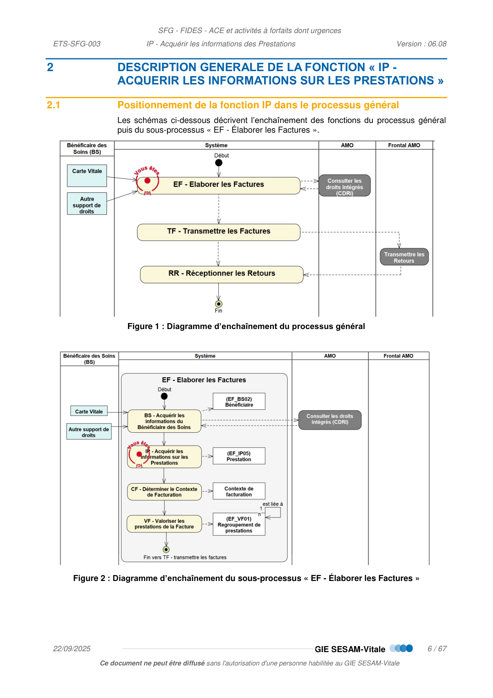
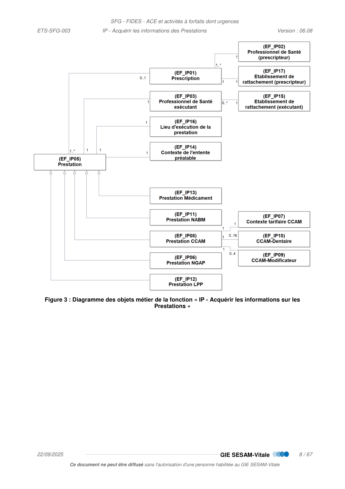
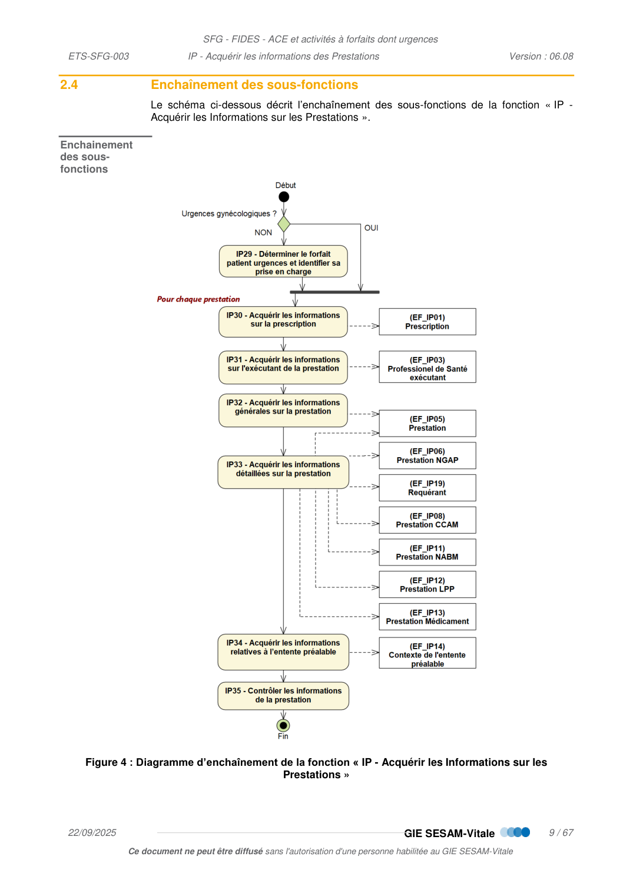
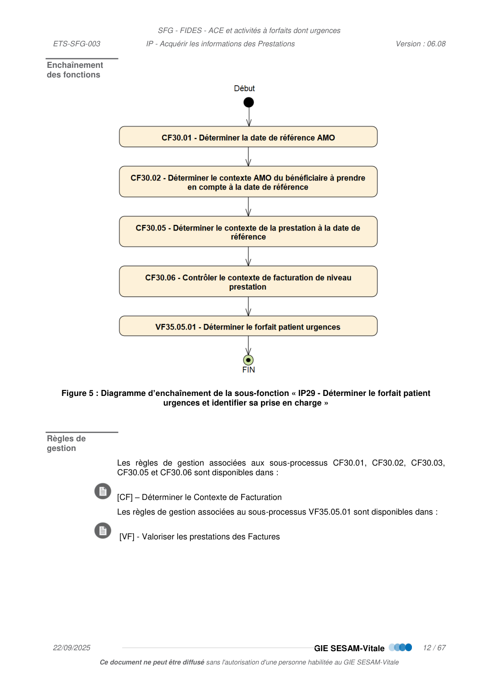
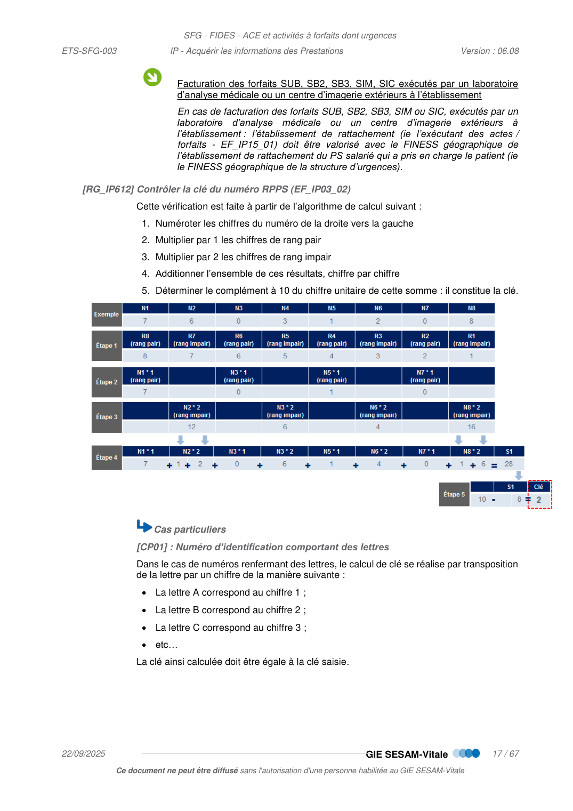
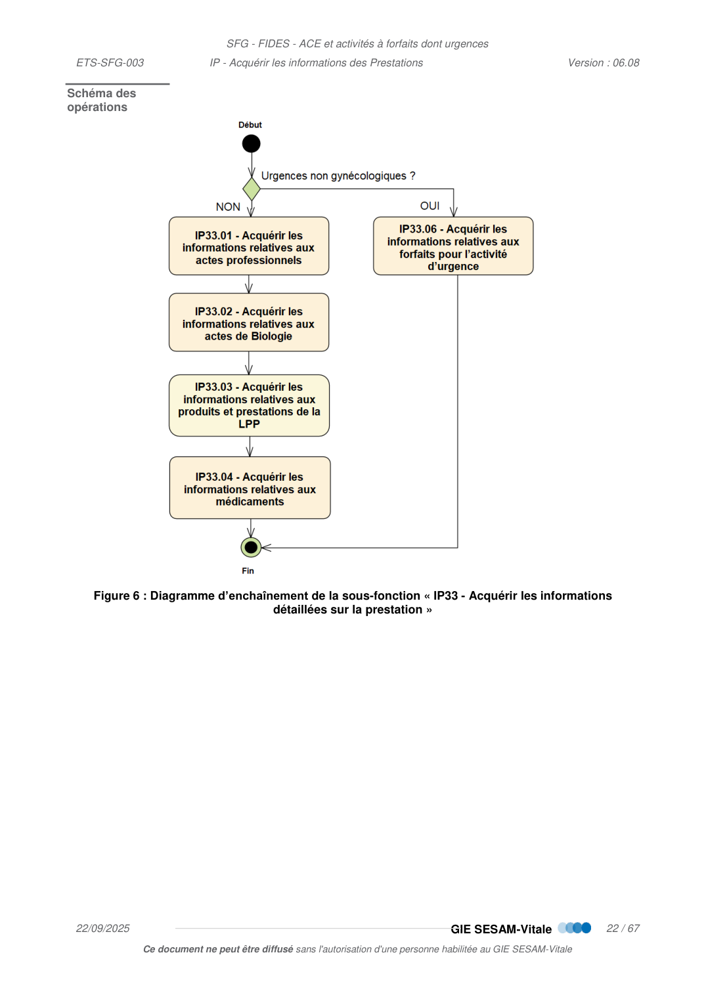
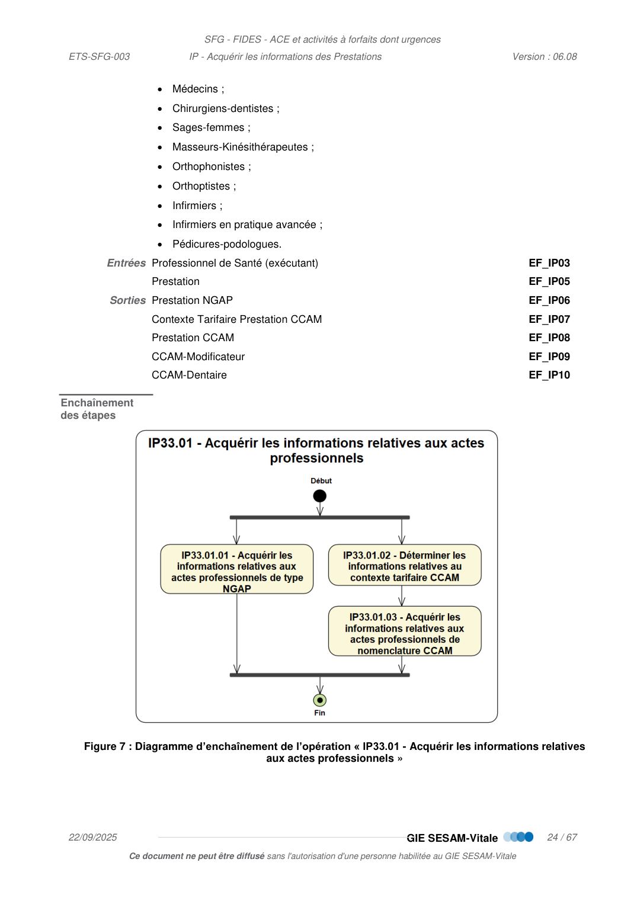
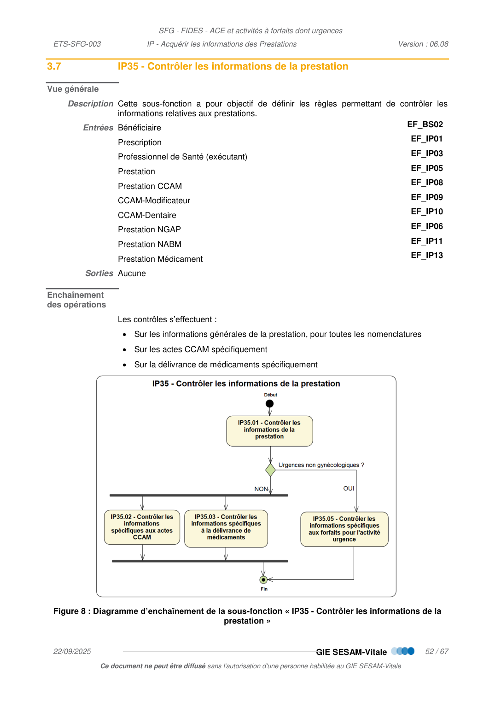

# IP — Acquérir les Informations des Prestations

_Pages 87–153 du PDF source._

<!-- p.87 -->
IP  -  Acquérir les informations des
Prestations

<!-- p.88 -->
IP - Acquérir les informations des Prestations
arrangement, quel que soit le procédé utilisé.
des sanctions pour l’auteur du délit.
CONTACTS
Pour toute question technique ou fonctionnelle, contactez le Centre de services :
•
e-mail : centre-de-service@sesam-vitale.fr

<!-- p.89 -->
IP - Acquérir les informations des Prestations
1
1.1
1.2
1.3
1.4
1.5
1.6
2
DESCRIPTION GENERALE DE LA FONCTION « IP - ACQUERIR LES INFORMATIONS SUR LES
2.1
2.2
2.3
2.4
3
DESCRIPTION DETAILLEE DE LA FONCTION « IP - ACQUERIR LES INFORMATIONS SUR LES
3.1
3.2
3.3
3.4
3.5
3.5.1
3.5.1.1
IP33.01.01 - Acquérir les informations relatives aux actes professionnels de nomenclature
3.5.1.2
3.5.1.3
IP33.01.03 - Acquérir les informations relatives aux actes professionnels de nomenclature
3.5.2
3.5.3
3.5.4
3.5.5
IP33.06 - Acquérir les informations relatives aux forfaits socles et suppléments pour
3.6
3.7
3.7.1
3.7.2
3.7.3
3.7.4
IP35.05 - Contrôler les informations spécifiques aux forfaits pour l’activité d’urgence ... 63
4

<!-- p.90 -->
IP - Acquérir les informations des Prestations
TABLE DES ILLUSTRATIONS
FIGURE 3 : DIAGRAMME DES OBJETS METIER DE LA FONCTION « IP - ACQUERIR LES INFORMATIONS SUR LES
FIGURE 4 : DIAGRAMME D’ENCHAINEMENT DE LA FONCTION « IP - ACQUERIR LES INFORMATIONS SUR LES
FIGURE 5 : DIAGRAMME D’ENCHAINEMENT DE LA SOUS-FONCTION « IP29 - DETERMINER LE FORFAIT PATIENT
FIGURE 6 : DIAGRAMME D’ENCHAINEMENT DE LA SOUS-FONCTION « IP33 - ACQUERIR LES INFORMATIONS DETAILLEES
FIGURE 7 : DIAGRAMME D’ENCHAINEMENT DE L’OPERATION « IP33.01 - ACQUERIR LES INFORMATIONS RELATIVES
FIGURE 8 : DIAGRAMME D’ENCHAINEMENT DE LA SOUS-FONCTION « IP35 - CONTROLER LES INFORMATIONS DE LA

<!-- p.91 -->
IP - Acquérir les informations des Prestations

## 1 INTRODUCTION

### 1.1 Objet du document

Ce document a pour objet de spécifier la fonction « IP : Acquérir les Informations sur
les Prestations » appartenant au sous-processus « EF : Élaborer les Factures ».

### 1.2 Statut du document

De référence.

### 1.3 Positionnement du document dans le dossier de SFG

 Cf. [PG] – Présentation Générale

### 1.4 Documents de référence

 Cf. [PG] – Présentation Générale

### 1.5 Abréviations et définitions

 Cf. [DICO] - Dictionnaire de données

### 1.6 Guide de lecture

 Cf. [PG] – Présentation Générale

<!-- p.92 -->
IP - Acquérir les informations des Prestations

## 2 DESCRIPTION GENERALE DE LA FONCTION « IP - ACQUERIR LES INFORMATIONS SUR LES PRESTATIONS »

### 2.1 Positionnement de la fonction IP dans le processus général

Les schémas ci-dessous décrivent l’enchaînement des fonctions du processus général
puis du sous-processus « EF - Élaborer les Factures ».
Figure 1 : Diagramme d’enchaînement du processus général
Figure 2 : Diagramme d’enchaînement du sous-processus « EF - Élaborer les Factures »

*Figure (p.92) : Figure 1 : Diagramme d’enchaînement du processus général*

<!-- p.93 -->
IP - Acquérir les informations des Prestations

### 2.2 Cadrage fonctionnel

Vue générale
Description
Cette fonction a pour objectif de définir les règles d’acquisition relatives aux informations des
prestations.
Entrées
Informations relatives aux Bénéficiaire des Soins
EF_BS
Sorties
Informations relatives aux Prestations
EF_IP

### 2.3 Lien entre les objets métier de la fonction

Le schéma ci-dessous décrit le lien entre les objets métier manipulés dans la fonction « IP
- Acquérir les Informations sur les Prestations ».
Lien entre les
objets
Dans le schéma ci-dessous, l’entité « prestation » mutualise les données communes aux
différents types de prestation (médicaments, CCAM, NGAP…)
Les entités « prestation médicaments », « prestation NGAP », « prestation CCAM » …
contiennent des données spécifiques à chaque type de prestation.
La relation entre ces entités est une relation de type héritage signifiant « est un cas
particulier de ». Exemple, la prestation médicament (EF_IP13) est un cas particulier de
prestation (EF_IP05).

<!-- p.94 -->
IP - Acquérir les informations des Prestations
Figure 3 : Diagramme des objets métier de la fonction « IP - Acquérir les informations sur les
Prestations »

*Figure (p.94) : Figure 3 : Diagramme des objets métier de la fonction « IP - Acquérir les informations sur les*

<!-- p.95 -->
IP - Acquérir les informations des Prestations

### 2.4 Enchaînement des sous-fonctions

Le schéma ci-dessous décrit l’enchaînement des sous-fonctions de la fonction « IP -
Acquérir les Informations sur les Prestations ».
Enchainement
des sous-
fonctions
Figure 4 : Diagramme d’enchaînement de la fonction « IP - Acquérir les Informations sur les
Prestations »

*Figure (p.95) : Figure 4 : Diagramme d’enchaînement de la fonction « IP - Acquérir les Informations sur les*

<!-- p.96 -->
IP - Acquérir les informations des Prestations

## 3 DESCRIPTION DETAILLEE DE LA FONCTION « IP - ACQUERIR LES INFORMATIONS SUR LES PRESTATIONS »

Préambule
La liste des codes prestations autorisées est donnée dans la table suivante :
 Cf. [TABLES] - Table 1 : Codes prestation.
Chaque prestation est associée à des critères énumérés ci-dessous.
Ces critères permettent de déterminer l’application de certaines règles de gestion dans la
suite des documents de SFG :

<!-- transcrit de p.96 (ex-figure) -->

| Critère | Description |
| --- | --- |
| Niveau | Permet de différencier les actes médicaux (niveau = support) des compléments de prestation (niveau = complément) |
| Catégorie | Permet de différencier le type d’acte (Professionnel, Médicaments, Biologie, etc…) ou le type de complément (forfait, majoration) |
| Sous-catégorie | Sous-catégorie de l’acte ou du complément |
| Nomenclature | Nomenclature utilisée pour coder la prestation (NGAP, CCAM, NABM, UCD, etc…) |

<!-- p.97 -->
IP - Acquérir les informations des Prestations

### 3.1 IP29 – Déterminer le forfait patient urgences et identifier sa prise en charge

Vue générale
Description Le forfait patient urgences est une participation forfaitaire à la charge de l’assuré lors d’un
passage dans un service d’urgences autorisé. Il est généré dans le cadre de soins non
programmés non suivis d’hospitalisation ou d’une prise en charge en UHCD, hors urgences
gynécologiques (ATU gynécologiques).
Le forfait patient urgences est exigible auprès du patient seulement si celui-ci bénéficie
d’une prise en charge complète au sein de la structure des urgences, c’est-à-dire à
l’exclusion des expérimentations de réorientation ou des cas patients partis sans attendre
le début de leur prise en charge.
La détermination du forfait patient urgence peut être faite à la sortie du patient, et les forfaits
socles et éventuels suppléments peuvent être déterminés plus tard. Les temporalités
peuvent être différentes. La détermination du forfait patient urgences est donc
indépendante de la détermination du forfait socle et de ses éventuels suppléments.
Le forfait patient urgence déterminé en IP29 est donc complété :
 d’un forfait socle déterminé dans IP33.06,
 et éventuellement de suppléments déterminés dans IP33.06 et/ou dans RG_CF636.
Entrées Bénéficiaire des soins
BS
Sorties Contexte de facturation
CF
 Valorisation des prestations
VF

<!-- p.98 -->
IP - Acquérir les informations des Prestations
Enchaînement
des fonctions
Figure 5 : Diagramme d’enchaînement de la sous-fonction « IP29 - Déterminer le forfait patient
urgences et identifier sa prise en charge »
Règles de
gestion
Les règles de gestion associées aux sous-processus CF30.01, CF30.02, CF30.03,
CF30.05 et CF30.06 sont disponibles dans :
 [CF] – Déterminer le Contexte de Facturation
Les règles de gestion associées au sous-processus VF35.05.01 sont disponibles dans :
  [VF] - Valoriser les prestations des Factures

*Figure (p.98) : Figure 5 : Diagramme d’enchaînement de la sous-fonction « IP29 - Déterminer le forfait patient*

<!-- p.99 -->
IP - Acquérir les informations des Prestations

### 3.2 IP30 - Acquérir les informations sur la prescription

Vue générale
Description Cette sous-fonction a pour objectif de définir les règles d’acquisition des informations
relatives à la prescription.
Entrées Aucune
Sorties Prescription
EF_IP01
 Professionnel de Santé (prescripteur)
EF_IP02
Règles de
gestion
[RG_IP600] Acquérir les informations relatives à la prescription (EF_IP01)
Lorsque les prestations facturées sont réalisées suite à une prescription, le système de
facturation doit permettre l'acquisition des informations d’identification de la prescription, à
savoir :
 Date de prescription
(EF_IP01_01) ;
 Code origine de la prescription
(EF_IP01_02) ;
Les valeurs possibles du code origine de la prescription sont les suivantes :

<!-- transcrit de p.99 (ex-figure) -->

| Contexte | Code origine de la prescription |
| --- | --- |
| Le prescripteur est le médecin traitant | T |
| La prescription a été établie dans le parcours de soins par un médecin correspondant (médecin qui reçoit le patient orienté par son médecin traitant). | O |
| La prescription a été établie par un autre médecin dans le respect du parcours de soins | P |
| La prescription a été établie hors parcours de soins | S |
 Top Prescription par médecin SNCF
(EF_IP01_03).
○ Valorisé à « Oui » si la prescription est établie par un médecin SNCF (sur imprimé
1032 ou avec mention de Médecin SNCF), sinon valorisé à « Non »
 Le « Top Prescription par médecin SNCF » ne concerne que le cas où le
bénéficiaire relève du régime SNCF, il est sans objet sinon.
 Cas particuliers
[CP01] : Date de prescription pour les soins dentaires
Cette règle est spécifique aux professionnels de santé exécutant des soins dentaires,
obligatoire pour les chirurgiens-dentistes (spécialité 19 et 36) et les spécialités de médecin
pouvant réaliser des soins dentaires à savoir les spécialités 18, 44, 45 et 69 et les médecins
généralistes (spécialités 01, 22, 23).
Lorsqu'un professionnel de santé soigne un patient sur plusieurs séances pour plusieurs
problèmes non liés, il indique la date d'exécution du soin le plus ancien sauf en cas de
prothèse dentaire ou de soins d'orthopédie dento-faciale, la date de prescription
(EF_IP01_01) correspond alors à la date de proposition.
En cas de soins consécutifs à un Examen Bucco-Dentaire (EBD), cette date doit être
obligatoirement renseignée avec la date à laquelle le bilan est réalisé.

<!-- p.100 -->
IP - Acquérir les informations des Prestations
[RG_IP601] Acquérir les informations relatives au Professionnel de Santé prescripteur (EF_IP02,
EF_IP17)
Lorsque les prestations facturées sont réalisées suite à une prescription, le système de
facturation doit permettre l'acquisition des informations d’identification du prescripteur, à
savoir :
Champ
Valeurs possibles dans ce contexte
EF_IP02_01
Code spécialité
La liste des spécialités des Professionnels de Santé
autorisés par l’Assurance Maladie Obligatoire (selon la
nomenclature de l’Assurance Maladie) est donnée dans
la table suivante :
 [TABLES] Table 100 : Code spécialité des
Professionnels de Santé
 Lorsque la prescription provient d’un autre
établissement, le code spécialité du prescripteur
n’est pas toujours renseigné, dans ce cas il doit
être demandé à l’établissement à l’origine de la
prescription.
EF_IP02_02
Condition d'exercice (PS
prescripteur)
 L : si libéral
 S : si salarié
 B : si bénévole
EF_IP02_03
N° Identification + clé (PS
prescripteur)
 Si condition d’exercice « Libéral » : le numéro utilisé
par l’Assurance Maladie.
 Sinon non renseigné.
Cf. CP01
EF_IP02_04
N° RPPS + clé (PS
prescripteur)
Si le prescripteur possède un N° de RPPS celui-ci doit
être renseigné.
Cf. CP01
 Le contrôle de la clé du N° de RPPS du PS
prescripteur est effectué avec la règle suivante :
« [RG_IP612] Contrôler la clé du numéro RPPS ».
EF_IP17_01
Établissement de
rattachement
(prescripteur)
 Si le prescripteur est salarié, correspond au n°
FINESS
géographique
de
l’établissement
de
rattachement du PS prescripteur.
 Si le prescripteur exerce en Libéral, correspond au n°
FINESS géographique de l’établissement dans lequel
le PS a prescrit.
 Cas particuliers
[CP01] : Numéro d'identification et n°RPPS du prescripteur pour un prescripteur
remplaçant
Dans le cas où la prescription a été établie par un Professionnel de Santé remplaçant, ces
données doivent être renseignées avec le N° d’identification et n° RPPS du PS titulaire.

<!-- transcrit de p.100 (ex-figure) -->

| Champ | Libellé | Valeurs possibles dans ce contexte |
| --- | --- | --- |
| EF_IP02_01 | Code spécialité | La liste des spécialités des Professionnels de Santé autorisés par l’Assurance Maladie Obligatoire (selon la nomenclature de l’Assurance Maladie) est donnée dans la table suivante : [TABLES] Table 100 : Code spécialité des Professionnels de Santé. Lorsque la prescription provient d’un autre établissement, le code spécialité du prescripteur n’est pas toujours renseigné, dans ce cas il doit être demandé à l’établissement à l’origine de la prescription. |
| EF_IP02_02 | Condition d'exercice (PS prescripteur) | L : si libéral S : si salarié B : si bénévole |
| EF_IP02_03 | N° Identification + clé (PS prescripteur) | Si condition d’exercice « Libéral » : le numéro utilisé par l’Assurance Maladie. Sinon non renseigné. Cf. CP01 |
| EF_IP02_04 | N° RPPS + clé (PS prescripteur) | Si le prescripteur possède un N° de RPPS celui-ci doit être renseigné. Cf. CP01 Le contrôle de la clé du N° de RPPS du PS prescripteur est effectué avec la règle suivante : « [RG_IP612] Contrôler la clé du numéro RPPS ». |
| EF_IP17_01 | Établissement de rattachement (prescripteur) | Si le prescripteur est salarié, correspond au n° FINESS géographique de l’établissement de rattachement du PS prescripteur. Si le prescripteur exerce en Libéral, correspond au n° FINESS géographique de l’établissement dans lequel le PS a prescrit. |

<!-- p.101 -->
IP - Acquérir les informations des Prestations
 [CP02] : Dépistage sérologique du virus de l’immunodéficience humaine (VIH) et
autres IST en laboratoire de biologie médicale, sans ordonnance.
Conditions :
 la RG_IP663 identifie un contexte métier d’anonymisation (EF_IP05_13) dont la valeur
est « IST »
 le BS ne présente pas d’ordonnance
Le système de facturation doit permettre l'acquisition des informations d’identification du
prescripteur tel que :
Champ
Valeurs possibles dans ce contexte
EF_IP02_01
Code spécialité
Non renseigné
EF_IP02_02
Condition d'exercice (PS
prescripteur)
Non renseigné
EF_IP02_03
N° Identification + clé (PS
prescripteur)
Numéro de prescripteur unique : « 29199110 7 »
EF_IP02_04
N° RPPS + clé (PS
prescripteur)
Non renseigné
EF_IP17_01
Établissement de
rattachement
(prescripteur)
Non renseigné

<!-- transcrit de p.101 (ex-figure) -->

| Champ | Libellé | Valeurs possibles dans ce contexte |
| --- | --- | --- |
| EF_IP02_01 | Code spécialité | Non renseigné |
| EF_IP02_02 | Condition d'exercice (PS prescripteur) | Non renseigné |
| EF_IP02_03 | N° Identification + clé (PS prescripteur) | Numéro de prescripteur unique : « 29199110 7 » |
| EF_IP02_04 | N° RPPS + clé (PS prescripteur) | Non renseigné |
| EF_IP17_01 | Établissement de rattachement (prescripteur) | Non renseigné |

<!-- p.102 -->
IP - Acquérir les informations des Prestations

### 3.3 IP31 - Acquérir les informations sur l’exécutant de la prestation

Vue générale
Description Cette sous-fonction a pour objectif de définir les règles d’acquisition des informations
relatives à l’exécutant.
Entrées Aucune
Sorties Professionnel de Santé (exécutant)
EF_IP03
 Établissement de rattachement (PS exécutant)
EF_IP15
Règles de
gestion
[RG_IP610] Acquérir les informations relatives au Professionnel de Santé exécutant (EF_IP03)
Le système de facturation doit permettre l'acquisition des informations d’identification de
l’exécutant, à savoir :
Champ
Valeurs possibles dans ce contexte
EF_IP03_01
Code spécialité
La liste des spécialités des Professionnels de Santé
autorisés par l’Assurance Maladie Obligatoire (selon la
nomenclature de l’Assurance Maladie) est donnée dans
la table suivante :
 [TABLES] Table 100 : Code spécialité des
Professionnels de Santé
Cf. Cas particuliers ci-dessous
EF_IP03_02
N°RPPS + clé
À ce jour, le renseignement du RPPS de l’exécutant est
facultatif.
EF_IP03_03
Secteur
Renseigné avec le secteur du PS exécutant
 Les PS en activité salariée sont assimilés « secteur
1 »
EF_IP03_04
Condition d'exercice de
l'exécutant
Renseigné à « salarié »
EF_IP03_05
N° Identification
Non renseigné
EF_IP03_06
Contrat tarifaire
Renseigné à « aucun »
 Cas particuliers
CP02 : médicaments rétrocédés
Les médicaments délivrés en rétrocession (sous-catégorie « Rétrocession ») doivent être
délivrés avec la spécialité exécutant « 50 ».
[RG_IP611] Acquérir les informations relatives à l’Établissement de rattachement du PS
exécutant (EF_IP15_01)
Pour les PS exécutant salariés (cf. « Condition d'exercice de l'exécutant » [EF_IP03_04]),
le système de facturation doit permettre l'acquisition de la donnée :
 Établissement de rattachement (PS exécutant)
(EF_IP15_01)
○ FINESS géographique de l’établissement de rattachement du PS Salarié

<!-- transcrit de p.102 (ex-figure) -->

| Champ | Libellé | Valeurs possibles dans ce contexte |
| --- | --- | --- |
| EF_IP03_01 | Code spécialité | La liste des spécialités des Professionnels de Santé autorisés par l’Assurance Maladie Obligatoire (selon la nomenclature de l’Assurance Maladie) est donnée dans la table suivante : [TABLES] Table 100 : Code spécialité des Professionnels de Santé. Cf. Cas particuliers ci-dessous |
| EF_IP03_02 | N°RPPS + clé | À ce jour, le renseignement du RPPS de l’exécutant est facultatif. |
| EF_IP03_03 | Secteur | Renseigné avec le secteur du PS exécutant. Les PS en activité salariée sont assimilés « secteur 1 » |
| EF_IP03_04 | Condition d'exercice de l'exécutant | Renseigné à « salarié » |
| EF_IP03_05 | N° Identification | Non renseigné |
| EF_IP03_06 | Contrat tarifaire | Renseigné à « aucun » |

<!-- p.103 -->
IP - Acquérir les informations des Prestations
Facturation des forfaits SUB, SB2, SB3, SIM, SIC exécutés par un laboratoire
d’analyse médicale ou un centre d’imagerie extérieurs à l’établissement
En cas de facturation des forfaits SUB, SB2, SB3, SIM ou SIC, exécutés par un
laboratoire d’analyse médicale ou un centre d’imagerie extérieurs à
l’établissement : l’établissement de rattachement (ie l’exécutant des actes /
forfaits - EF_IP15_01) doit être valorisé avec le FINESS géographique de
l’établissement de rattachement du PS salarié qui a pris en charge le patient (ie
le FINESS géographique de la structure d’urgences).
[RG_IP612] Contrôler la clé du numéro RPPS (EF_IP03_02)
Cette vérification est faite à partir de l’algorithme de calcul suivant :
1. Numéroter les chiffres du numéro de la droite vers la gauche
2. Multiplier par 1 les chiffres de rang pair
3. Multiplier par 2 les chiffres de rang impair
4. Additionner l’ensemble de ces résultats, chiffre par chiffre
5. Déterminer le complément à 10 du chiffre unitaire de cette somme : il constitue la clé.
 Cas particuliers
[CP01] : Numéro d’identification comportant des lettres
Dans le cas de numéros renfermant des lettres, le calcul de clé se réalise par transposition
de la lettre par un chiffre de la manière suivante :
 La lettre A correspond au chiffre 1 ;
 La lettre B correspond au chiffre 2 ;
 La lettre C correspond au chiffre 3 ;
 etc…
La clé ainsi calculée doit être égale à la clé saisie.

*Figure (p.103) : Schéma / diagramme page 103*

<!-- p.104 -->
IP - Acquérir les informations des Prestations

### 3.4 IP32 - Acquérir les informations générales de la prestation

Vue générale
Description Cette sous-fonction a pour objectif de définir les règles d’acquisition des informations
générales relatives aux prestations.
Entrées Bénéficiaire
EF_BS02
Sorties Prestation
EF_IP05
 Lieu d’exécution de la prestation
EF_IP16
Règles de
gestion
[RG_IP620] Acquérir le N° FINESS géographique du lieu d’exécution de la prestation
(EF_IP16_01)
En ACE, dès lors que la facture porte des actes réalisés dans un autre établissement
géographique que l’établissement de rattachement du PS exécutant (EF_IP15_01), ou si
celui-ci n’est pas connu, le système de facturation doit permettre l'acquisition du N°
FINESS géographique du lieu d’exécution de la prestation.
Par exemple, pour un établissement juridique avec plusieurs FINESS géographiques, un
PS salarié rattaché à un FINESS géographique peut intervenir sur un autre établissement.
[RG_IP621] Acquérir la date d’exécution de la prestation (EF_IP05_01)
La date d’exécution de la prestation est la date à laquelle a été réalisée la prestation, ou la
date à laquelle les médicaments ou autres produits ont été délivrés ou administrés.
Pour les forfaits Urgences (hors urgences gynécologiques), les dates d’exécution à
prendre en compte sont listées ci-dessous :
Forfait Urgences
(EF_IP05_04)
Date d’exécution (EF_IP05_01)
 Forfaits socle : FU1,
FU2, FU3, FU4
Date de début de prise en charge par le médecin urgentiste*
Avis de spécialiste :
SAS
Date de la consultation réalisée par le spécialiste
 Suppléments biologie :
SUB, SB1, SB2
Date du premier acte de biologie médicale réalisé
 Suppléments imagerie
Date du premier acte d’imagerie réalisé par le radiologue
* Le terme « médecin urgentiste » désigne le médecin responsable de la prise en charge
du patient aux urgences. Il peut s’agir d’un généraliste, d’un pédiatre etc. »
[RG_IP622] Déterminer l’ « âge du bénéficiaire des soins à la date d’exécution de la prestation »
(EF_IP05_02)
L’ « âge du bénéficiaire des soins à la date d’exécution de la prestation » (EF_IP05_02)
est calculé en utilisant :
 sa date de naissance (EF_BS02_01)
 et la date d’exécution (EF_IP05_01) de la prestation.
[RG_IP623] Déterminer le Motif médical d’exonération (EF_IP05_03)
Dans certains cas, les soins sont exonérés sur indication spécifique du Professionnel de
Santé exécutant.
Le Professionnel de Santé exécutant précise pour la prestation s’il s’agit :

<!-- transcrit de p.104 (ex-figure) -->

Pour les forfaits Urgences (hors urgences gynécologiques), les dates d’exécution à prendre en compte sont listées ci-dessous :

| Forfait Urgences (EF_IP05_04) | Date d’exécution (EF_IP05_01) |
| --- | --- |
| Forfaits socle : FU1, FU2, FU3, FU4 | Date de début de prise en charge par le médecin urgentiste* |
| Avis de spécialiste : SAS | Date de la consultation réalisée par le spécialiste |
| Suppléments biologie : SUB, SB1, SB2 | Date du premier acte de biologie médicale réalisé |
| Suppléments imagerie | Date du premier acte d’imagerie réalisé par le radiologue |

\* Le terme « médecin urgentiste » désigne le médecin responsable de la prise en charge du patient aux urgences. Il peut s’agir d’un généraliste, d’un pédiatre etc. »

<!-- p.105 -->
IP - Acquérir les informations des Prestations
Motif médical
d’exonération
Conditions
 Traitement exonérant
 Soins exonérés au titre d’un traitement exonérant
(traitement de la stérilité, actes exonérant, soins aux
prématurés, test de dépistage du virus HIV), actes NABM
pris en charge à 100%, soins consécutifs à des sévices
sexuels subis par des mineurs)
 Ou présence d’une ETM valide à la date de référence
(EF_CF11_01) égale à « Soins particuliers exonérés »
Soins conformes au
protocole ALD
Les soins sont liés à l’ALD et sont conformes au protocole ALD
Soins entrants dans le
cadre d’un dispositif
de prévention
Les soins correspondant à la prévention maladie concernent,
par exemple :
 Les examens bucco dentaires des enfants dans l’année qui
suit leur 6ème anniversaire et leur 12ème anniversaire. Cet
examen ne donne pas lieu à contribution financière de la
part des familles, selon l’Article L2132-2-1 du CSP (prise en
charge à 100%) ;
La prévention bucco-dentaire pour les femmes enceintes, mise
en œuvre par l’avenant 3 à la convention des chirurgiens-
dentistes.
Soins
pour
les
nouveau-nés
Soins exonérés car prescrits dans les 30 premiers jours de la
vie du nourrisson (ACE)
 Cas particuliers
[CP01] : Forfaits socle FUx, et des forfaits SIM, SIC, SAS, SUB, SB2, SB3
Le motif médical d’exonération ne doit pas être renseigné pour les forfaits socles de
l’activité Urgences : FUx, ni pour les forfaits SIM, SIC, SAS, SUB, SB2, SB3.
[RG_IP624] Déterminer le Domaine d'activité de la prestation (EF_IP05_09)
Le domaine d'activité de la prestation est déduit du service qui prend en charge le patient,
il prend les valeurs suivantes :
 M : Médecine
 C : Chirurgie
 O : Obstétrique
 N : Odontologie
 S : SMR
 Cas particuliers
 [SP08] : BS coordonné RSS
Le domaine d’activité n’est pas renseigné
 [SP06] : Bénéficiaire de l’AME
Le domaine d’activité n’est pas renseigné
 [CP01] : Rétrocession de médicaments
Le domaine d’activité n’est pas renseigné.
 [CP02] : Activité d’urgence non gynécologiques

<!-- transcrit de p.105 (ex-figure) -->

| Motif médical d’exonération | Conditions |
| --- | --- |
| Traitement exonérant | Soins exonérés au titre d’un traitement exonérant (traitement de la stérilité, actes exonérant, soins aux prématurés, test de dépistage du virus HIV, actes NABM pris en charge à 100%, soins consécutifs à des sévices sexuels subis par des mineurs). Ou présence d’une ETM valide à la date de référence (EF_CF11_01) égale à « Soins particuliers exonérés » |
| Soins conformes au protocole ALD | Les soins sont liés à l’ALD et sont conformes au protocole ALD |
| Soins entrants dans le cadre d’un dispositif de prévention | Les soins correspondant à la prévention maladie concernent, par exemple : les examens bucco dentaires des enfants dans l’année qui suit leur 6ème anniversaire et leur 12ème anniversaire. Cet examen ne donne pas lieu à contribution financière de la part des familles, selon l’Article L2132-2-1 du CSP (prise en charge à 100%) ; la prévention bucco-dentaire pour les femmes enceintes, mise en œuvre par l’avenant 3 à la convention des chirurgiens-dentistes. |
| Soins pour les nouveau-nés | Soins exonérés car prescrits dans les 30 premiers jours de la vie du nourrisson (ACE) |

<!-- p.106 -->
IP - Acquérir les informations des Prestations
En contexte d’urgence (hors urgences gynécologiques), les forfaits FUx, SIM, SIC, SAS,
SUB, SB2, SB3, FPX le domaine doit être renseigné à « M », sauf pour les AME et les BS
coordonné RSS, où il n’est pas renseigné (cf SP06, SP08 ci-dessus).
 Concernant les forfaits patients urgence FPU, FPM, FPV, FPL, des règles spécifiques
s’appliquent (cf. RG_MF610 donnée [03121])
[RG_IP625] Déterminer la nécessité d’un codage affiné (EF_IP05_10)
Les prestations qui nécessitent un codage affiné sont identifiées dans les tables suivantes
en fonction de leur nomenclature :
 [TABLES] Table 1 : Codes prestation.
Lorsque la prestation en question nécessite un codage affiné, le Top codage affiné
(EF_IP05_10) doit être valorisé à « Oui », dans le cas contraire à « Non ».

<!-- p.107 -->
IP - Acquérir les informations des Prestations

### 3.5 IP33 - Acquérir les informations détaillées sur la prestation

Vue générale
Description Cette sous-fonction a pour objectif de définir les règles d’acquisition des informations
relatives aux actes médicaux réalisés par le Professionnel de Santé.
Les actes médicaux sont caractérisés par leur « Niveau » égal à « Support » dans les
tables suivantes :
 [TABLES] Table 1 : Codes prestation
Entrées Professionnel de Santé (exécutant)
EF_IP03
Prestation
EF_IP05
Sorties Prestation
EF_IP05
Prestation NGAP
EF_IP06
Contexte Tarifaire Prestation CCAM
EF_IP07
Prestation CCAM
EF_IP08
CCAM-Modificateur
EF_IP09
CCAM-Dentaire
EF_IP10
Prestation NABM
EF_IP11
Prestation Médicament
EF_IP13
 Prestation LPP
EF_IP12

<!-- p.108 -->
IP - Acquérir les informations des Prestations
Schéma des
opérations
Figure 6 : Diagramme d’enchaînement de la sous-fonction « IP33 - Acquérir les informations
détaillées sur la prestation »

*Figure (p.108) : Schéma des*

<!-- p.109 -->
IP - Acquérir les informations des Prestations
3.5.1
IP33.01 - Acquérir les informations relatives aux actes professionnels
Vue générale
Cette opération a pour objectif de définir les règles d’acquisition des informations relatives
aux actes professionnels.
Les actes professionnels sont caractérisés par leur « Catégorie » égale à « Professionnel »
ou « Réservé PS » ou « Télémédecine » dans la table suivante :
 [TABLES] Table 1 : Codes prestation
Ces actes sont inscrits dans les nomenclatures NGAP et CCAM et sont réalisés par les
Professionnels de Santé selon les contextes suivants :

<!-- p.110 -->
IP - Acquérir les informations des Prestations
 Médecins ;
 Chirurgiens-dentistes ;
 Sages-femmes ;
 Masseurs-Kinésithérapeutes ;
 Orthophonistes ;
 Orthoptistes ;
 Infirmiers ;
 Infirmiers en pratique avancée ;
 Pédicures-podologues.
Entrées Professionnel de Santé (exécutant)
EF_IP03
Prestation
EF_IP05
Sorties Prestation NGAP
EF_IP06
Contexte Tarifaire Prestation CCAM
EF_IP07
Prestation CCAM
EF_IP08
CCAM-Modificateur
EF_IP09
CCAM-Dentaire
EF_IP10
Enchaînement
des étapes
Figure 7 : Diagramme d’enchaînement de l’opération « IP33.01 - Acquérir les informations relatives
aux actes professionnels »

*Figure (p.110) : Figure 7 : Diagramme d’enchaînement de l’opération « IP33.01 - Acquérir les informations relatives*

<!-- p.111 -->
IP - Acquérir les informations des Prestations
3.5.1.1
IP33.01.01 - Acquérir les informations relatives aux actes professionnels de
nomenclature NGAP
Vue générale
Description Cette étape a pour objectif de définir les règles d’acquisition des informations relatives
aux actes professionnels de nomenclature NGAP.
Dans la nomenclature NGAP, un acte est désigné par sa lettre-clé et un coefficient où la
lettre-clé (ou code prestation) désigne le type de l’acte (acte dentaire, infirmier, chirurgie,
…) et le coefficient désigne le niveau de technicité de l’acte.
La Nomenclature Générales des Actes Professionnels (NGAP) est disponible sur le site
ameli ainsi que les consignes de facturation destinés aux professionnels de santé :
 https://www.ameli.fr/medecin/exercice-liberal/facturation-
remuneration/consultations-actes/nomenclatures-codage/ngap
 Zoom sur la télémédecine
La facturation de la télémédecine repose majoritairement sur la NGAP.
De nouveaux concepts, spécifiques à cette pratique médicale, étant nécessaire (tel que
le requérant, l’identifiant vidéo, la télé expertise, les télésoins, etc) des documentations
dédiées sont disponibles :
 https://www.ameli.fr/paris/content/fiche-telemedecine-teleconsultation-122024
 https://sante.gouv.fr/soins-et-maladies/prises-en-charge-specialisees/telesante-
pour-l-acces-de-tous-a-des-soins-a-distance/article/la-telesante
 https://esante.gouv.fr/produits-services/telesante
Entrées Prestation
EF_IP05
Sorties Prestation NGAP
EF_IP06
 Prestation
EF_IP05

<!-- p.112 -->
IP - Acquérir les informations des Prestations
Règles de
gestion
[RG_IP630] Acquérir les informations relatives aux Prestations NGAP (EF_IP06)
Le système de facturation doit permettre l'acquisition des informations suivantes :
Champ
Valeurs possibles dans ce contexte
EF_IP05_04
Code Prestation
Choisi par le PS selon les consignes de la NGAP
EF_IP06_01
Coefficient de la prestation
NGAP
Choisi par le PS selon les consignes de la NGAP
 Les actes de télésurveillance (TVA et TVB) vont
être assimilés à la nomenclature NGAP mais ne
relèvent pas de celle-ci, se référer aux Articles L.
162-48 à L162-57, et articles R. 162-73 et R. 162-
84 du CSS.
EF_IP06_02
Quantité de la prestation
NGAP
Nombre d’actes identiques effectués lors d’une même
séance dans une même facture, pour le même
Professionnel de Santé
EF_IP06_03
Dénombrement de la
prestation NGAP
 Pour les auxiliaires-médicaux, le dénombrement
d’une ligne de prestation correspond au nombre de
séances de soins à une même date, dans une même
facture, pour le même Professionnel de Santé
 sinon non renseigné
[RG_IP631] Acquérir les informations complémentaires d’une prestation relatives aux actes
professionnels de type NGAP
Données de la
table des codes
prestation
 A partir du code prestation (EF_IP05_04), des informations complémentaires sont définies
dans la table d’une prestation de type NGAP sont présentes dans la table :
 [TABLES] Table 1 : Codes prestation
Les champs du tableau ci-dessous sont présents dans la table 1 (noms des colonnes), et
valent :
Champ
Valeurs possibles dans ce contexte
EF_IP05_04
Code Prestation
Codification de l’acte à facturer choisi par le PS
EF_IP05_05
Niveau
 « Support »
EF_IP05_06
Catégorie
 « Professionnel »
 « Réservé PS » pour les consultations complexes et
très complexes.
 « Télémédecine » pour les actes de télémédecine
EF_IP05_07
Sous-catégorie
  « Dentaire » ou « Dentaire/Prothétique » ou «
Dentaire/ODF » pour les actes NGAP relevant du
dentaire en fonction du code prestation (cf. table 1)

<!-- transcrit de p.112 (ex-figure) -->

**[RG_IP630] Acquérir les informations relatives aux Prestations NGAP (EF_IP06)**

Le système de facturation doit permettre l'acquisition des informations suivantes :

| Champ | | Valeurs possibles dans ce contexte |
| --- | --- | --- |
| EF_IP05_04 | Code Prestation | Choisi par le PS selon les consignes de la NGAP |
| EF_IP06_01 | Coefficient de la prestation NGAP | Choisi par le PS selon les consignes de la NGAP. Les actes de télésurveillance (TVA et TVB) vont être assimilés à la nomenclature NGAP mais ne relèvent pas de celle-ci, se référer aux Articles L. 162-48 à L162-57, et articles R. 162-73 et R. 162-84 du CSS. |
| EF_IP06_02 | Quantité de la prestation NGAP | Nombre d’actes identiques effectués lors d’une même séance dans une même facture, pour le même Professionnel de Santé |
| EF_IP06_03 | Dénombrement de la prestation NGAP | Pour les auxiliaires-médicaux, le dénombrement d’une ligne de prestation correspond au nombre de séances de soins à une même date, dans une même facture, pour le même Professionnel de Santé. sinon non renseigné |

**[RG_IP631] Acquérir les informations complémentaires d’une prestation relatives aux actes professionnels de type NGAP**

À partir du code prestation (EF_IP05_04), des informations complémentaires sont définies dans la table d’une prestation de type NGAP.

[TABLES] Table 1 : Codes prestation

Les champs du tableau ci-dessous sont présents dans la table 1 (noms des colonnes), et valent :

| Champ | | Valeurs possibles dans ce contexte |
| --- | --- | --- |
| EF_IP05_04 | Code Prestation | Codification de l’acte à facturer choisi par le PS |
| EF_IP05_05 | Niveau | « Support » |
| EF_IP05_06 | Catégorie | « Professionnel » ; « Réservé PS » pour les consultations complexes et très complexes ; « Télémédecine » pour les actes de télémédecine |
| EF_IP05_07 | Sous-catégorie | « Dentaire » ou « Dentaire/Prothétique » ou « Dentaire/ODF » pour les actes NGAP relevant du dentaire en fonction du code prestation (cf. table 1) |

<!-- p.113 -->
IP - Acquérir les informations des Prestations
 code prestation devant figurer dans la facture pour les
actes de catégorie « Réservé PS »,
  « Téléconsultation » ou « Télésoins » ou « Télé
expertise
»
ou
«
Télésurveillance
»
ou
«
Accompagnement » « Télémédecine » pour les actes
relevant de la télémédecine.
 « so »
EF_IP05_08
Nomenclature
 « NGAP »
Autres données
D’autres informations complémentaires sont renseignées telles que :
Champ concerné
Valeurs à renseigner
EF_IP05_12
Identifiant de la connexion
vidéo sécurisée
Uniquement pour les actes de sous-catégorie
« Télémédecine » :
Valorisé avec l’identifiant de la connexion vidéo
sécurisée utilisée pour la Téléconsultation si celui-ci est
connu.
[RG_IP632] Acquérir le Numéro de dent traitée en NGAP (EF_IP06_05)
Conditions :
 Dans le cas de prestations dentaires, sous-catégorie (EF_IP05_07) = « Dentaire » ou
« Dentaire/Prothétique » ou « Dentaire/ODF »
 Et nomenclature (EF_IP05_08) = « NGAP »
Le numéro de la dent traitée peut être renseignée. Ce numéro est codifié selon la norme
N.F. S91011.

<!-- transcrit de p.113 (ex-figure) -->

| Champ | | Valeurs |
| --- | --- | --- |
| EF_IP05_06 | Catégorie (suite) | code prestation devant figurer dans la facture pour les actes de catégorie « Réservé PS » ; « Téléconsultation » ou « Télésoins » ou « Télé expertise » ou « Télésurveillance » ou « Accompagnement » pour les actes relevant de la télémédecine ; « SO » |
| EF_IP05_08 | Nomenclature | « NGAP » |

**Autres données**

D’autres informations complémentaires sont renseignées telles que :

| Champ concerné | | Valeurs à renseigner |
| --- | --- | --- |
| EF_IP05_12 | Identifiant de la connexion vidéo sécurisée | Uniquement pour les actes de catégorie « Télémédecine » : Valorisé avec l’identifiant de la connexion vidéo sécurisée utilisée pour la Téléconsultation si celui-ci est connu. |

<!-- p.114 -->
IP - Acquérir les informations des Prestations
3.5.1.2
IP33.01.02 - Déterminer les informations relatives au contexte tarifaire
CCAM
Vue générale
Description Cette étape a pour objectif de définir les règles permettant de déterminer le contexte
tarifaire de la prestation CCAM.
À noter que le contexte tarifaire est utilisé pour consulter les données diversifiées
(dépendantes du contexte) de la base CCAM à savoir :
 Le Prix Unitaire d’un acte CCAM ;
 Les codes "association non prévue" et leur coefficient ;
 Les codes pour association prévue et leur coefficient ;
 Les modificateurs et leur montant.
Entrées Date d’exécution de la prestation
EF_IP05_01
Situation Particulière
EF_BS19
Période SP
EF_BS20
Professionnel de Santé (exécutant)
EF_IP03
Sorties Contexte tarifaire CCAM
EF_IP07
 Prestation
EF_IP05
Règles de
gestion
[RG_IP640] Déterminer les informations relatives au contexte tarifaire PS de la prestation
(EF_IP07_01)
À partir du 1er janvier 2015, la diversification des tarifs introduit la notion de grille tarifaire
pouvant varier en fonction du contexte tarifaire du Professionnel de Santé.
Le contexte tarifaire du PS est défini par la table « R_CONTEXT_PS » de la base CCAM
à partir des informations suivantes :
 Code spécialité
(EF_IP03_01)
 Secteur
(EF_IP03_03)
 Date d’exécution de la prestation
(EF_IP05_01)
 Contrat
(EF_IP03_06)
[RG_IP641] Déterminer les informations relatives au contexte tarifaire BS de la prestation
(EF_IP07_02)
À partir du 1er janvier 2015, la diversification des tarifs introduit la notion de grille tarifaire
pouvant varier en fonction du contexte tarifaire du Bénéficiaire des Soins.
Le contexte tarifaire du BS est défini par la table « R_CONTEXT_BN » de la base CCAM
à partir des informations suivantes :
 la Situation particulière du Bénéficiaire
(EF_BS19_01)
○ à la date d’exécution de la prestation (EF_IP05_01)
 la date d’exécution de la prestation
(EF_IP05_01)

<!-- p.115 -->
IP - Acquérir les informations des Prestations
3.5.1.3
IP33.01.03 - Acquérir les informations relatives aux actes professionnels de
nomenclature CCAM
Vue générale
Description Cette opération a pour objectif de définir les règles d’acquisition des informations
relatives aux actes professionnels de nomenclature CCAM. La Classification Commune
des Actes Médicaux (CCAM) est une nomenclature destinée à coder les gestes pratiqués
par les médecins, gestes techniques et les actes intellectuels cliniques.
Pour les actes techniques médicaux de la CCAM, chaque libellé décrit un acte global.
Cette nomenclature et les règles de facturation pour les professionnels de santé sont
disponibles dans :
  https://www.ameli.fr/accueil-de-la-ccam/regles-de-facturation/index.php
Entrées Contexte tarifaire prestation CCAM
EF_IP07
Prestation
EF_IP05
Sorties Prestation CCAM
EF_IP08
CCAM-Modificateur
EF_IP09
CCAM-Dentaire
EF_IP10
 Prestation
EF_IP05
Règles de
gestion

<!-- p.116 -->
IP - Acquérir les informations des Prestations
[RG_IP650] Acquérir les informations relatives aux Prestations CCAM (EF_IP08)
Le système de facturation doit permettre l'acquisition des informations suivantes :
Champ
Valeurs possibles dans ce contexte
EF_IP08_01
Code acte CCAM
Choisi par le PS selon les consignes de la CCAM
EF_IP08_02
Code activité CCAM
Choisi par le PS selon les consignes de la CCAM
EF_IP08_03
Code phase de traitement
CCAM
Choisi par le PS selon les consignes de la CCAM
EF_IP08_04
Code extension
documentaire CCAM
Choisi par le PS selon les consignes de la CCAM
EF_IP08_07
Date de la séance de la
phase
 Si
le
Code
phase
de
traitement
CCAM
(EF_IP08_03) » est zéro alors : la date d'exécution de
la phase de l'acte (EF_IP05_01) doit être valorisée à
la date de la dernière séance.
 Sinon : non renseigné
 L’assemblage du code acte CCAM (EF_IP08_01), du code activité CCAM (EF_IP08_02),
et du code phase de traitement CCAM (EF_IP08_03), constitue le triplet « acte / activité /
phase » caractérisant la prestation CCAM.
Des informations supplémentaires sont disponibles dans :
 [DICO], § Définitions
[RG_IP651] Acquérir le Code remboursement sous condition CCAM (EF_IP08_06)
Le système de facturation doit permettre l'acquisition du Code remboursement sous
condition CCAM dont la valeur peut être « O » ou « N ».
Il est significatif pour les prestations CCAM remboursables sous condition. Si le Code
remboursement sous condition est renseigné à la valeur « O » pour un tel acte il s'agit d'un
acte remboursable.
Un code prestation autorisant un remboursement sous condition est caractérisé par son
champ CCAM-22 de la base CCAM.

<!-- transcrit de p.116 (ex-figure) -->

**[RG_IP650] Acquérir les informations relatives aux Prestations CCAM (EF_IP08)**

Le système de facturation doit permettre l'acquisition des informations suivantes :

| Champ | | Valeurs possibles dans ce contexte |
| --- | --- | --- |
| EF_IP08_01 | Code acte CCAM | Choisi par le PS selon les consignes de la CCAM |
| EF_IP08_02 | Code activité CCAM | Choisi par le PS selon les consignes de la CCAM |
| EF_IP08_03 | Code phase de traitement CCAM | Choisi par le PS selon les consignes de la CCAM |
| EF_IP08_04 | Code extension documentaire CCAM | Choisi par le PS selon les consignes de la CCAM |
| EF_IP08_07 | Date de la séance de la phase | Si le Code phase de traitement CCAM (EF_IP08_03) » est zéro alors : la date d'exécution de la phase de l'acte (EF_IP05_01) doit être valorisée à la date de la dernière séance. Sinon : non renseigné |

L’assemblage du code acte CCAM (EF_IP08_01), du code activité CCAM (EF_IP08_02), et du code phase de traitement CCAM (EF_IP08_03), constitue le triplet « acte / activité / phase » caractérisant la prestation CCAM.

<!-- p.117 -->
IP - Acquérir les informations des Prestations
[RG_IP_CC2] Acquérir le Code modificateur CCAM AMO (EF_IP09_01)
Le Code modificateur CCAM AMO est une donnée facultative qui peut être renseignée.
La valeur de chaque modificateur saisi par le Professionnel de Santé et transmis dans la
facture doit être connue dans la base CCAM à la date d'exécution de l'acte (EF_IP05_01)
et pour le Contexte tarifaire CCAM (EF_IP07).
La valeur du modificateur appartient nécessairement à la table TB11 de la base CCAM qui
référence la liste des modificateurs existant dans le cadre de la CCAM.
 Remarque : Le code modificateur doit être aussi autorisé pour l’acte donné. Les
modificateurs autorisés pour un acte/activité sont donnés dans le champ n°6 de la base
CCAM.
[RG_IP652] Acquérir le Numéro de dent traité en CCAM (EF_IP10_01)
La numérotation des dents à utiliser se conforme à la norme ISO 3950-2009 et permet de
numéroter chaque dent ainsi que les sextants et les maxillaires.
Numérotation des dents :
•  1er caractère : indication du quadrant : 1 à 4 pour les dents définitives, 5 à 8 pour les
dents de lait
•  2ème caractère : localisation de la dent dans un même quadrant : de 1 à 8.
Numérotation sextants et maxillaires :
01
Maxillaire supérieur
05
Sextant supérieur gauche
02
Mandibule (maxillaire inférieur)
06
Sextant inférieur gauche
03
Sextant supérieur droit
07
Sextant antéro-inférieur
04
Sextant antéro-supérieur
08
Sextant inférieur droit
10
Quadrant supérieur droit
30
Quadrant inférieur gauche
20
Quadrant supérieur gauche
40
Quadrant inférieur droit
Ces précisions concernant la numérotation des dents sont données à titre indicatif.

<!-- transcrit de p.117 (ex-figure) -->

Numérotation sextants et maxillaires :

| Code | Libellé | Code | Libellé |
| --- | --- | --- | --- |
| 01 | Maxillaire supérieur | 05 | Sextant supérieur gauche |
| 02 | Mandibule (maxillaire inférieur) | 06 | Sextant inférieur gauche |
| 03 | Sextant supérieur droit | 07 | Sextant antéro-inférieur |
| 04 | Sextant antéro-supérieur | 08 | Sextant inférieur droit |
| 10 | Quadrant supérieur droit | 30 | Quadrant inférieur gauche |
| 20 | Quadrant supérieur gauche | 40 | Quadrant inférieur droit |

<!-- p.118 -->
IP - Acquérir les informations des Prestations
[RG_IP653] Acquérir les informations complémentaires d’une prestation relatives aux actes
professionnels de type CCAM
Déterminer le
code prestation
Pour les actes CCAM, la valeur présente est le code regroupement et non le code détaillé.
Champ
Valeurs possibles dans ce contexte
EF_IP05_04
Code prestation
Le code regroupement est renseigné à partir du code
acte CCAM (EF_IP08_01) saisi et de la base CCAM.
Il est présent dans le champ n°42 de la base CCAM.
Données de la
table des codes
prestation
Les informations complémentaires d’une prestation sont présentes dans la table :
 [TABLES] Table 1 : Codes prestation
Champ
Valeurs possibles dans ce contexte
EF_IP05_04
Code prestation
Pour les actes CCAM la valeur présente est le code
regroupement et non le code détaillé
Le code regroupement est renseigné à partir du code
acte CCAM (EF_IP08_01) saisi et de la base CCAM.
Il est présent dans le champ n°42 de la base CCAM.
EF_IP05_05
Niveau
 « Support »
EF_IP05_06
Catégorie
 « Professionnel »
EF_IP05_07
Sous-catégorie
Si l’acte relève du dentaire, dépend du code
prestation (cf. table 1):
 « Dentaire » ou
 « Dentaire/Prothétique » ou
 « Dentaire/ODF ».
Sinon « non renseigné »
EF_IP05_08
Nomenclature
 « CCAM »

<!-- transcrit de p.118 (ex-figure) -->

Pour les actes CCAM, la valeur présente est le code regroupement et non le code détaillé.

| Réf. | Champ | Valeurs possibles dans ce contexte |
| --- | --- | --- |
| EF_IP05_04 | Code prestation | Le code regroupement est renseigné à partir du code acte CCAM (EF_IP08_01) saisi et de la base CCAM. Il est présent dans le champ n°42 de la base CCAM. |

Données de la table des codes prestation — Table 1 : Codes prestation :

| Réf. | Champ | Valeurs possibles dans ce contexte |
| --- | --- | --- |
| EF_IP05_04 | Code prestation | Pour les actes CCAM la valeur présente est le code regroupement et non le code détaillé. Le code regroupement est renseigné à partir du code acte CCAM (EF_IP08_01) saisi et de la base CCAM. Il est présent dans le champ n°42 de la base CCAM. |
| EF_IP05_05 | Niveau | « Support » |
| EF_IP05_06 | Catégorie | « Professionnel » |
| EF_IP05_07 | Sous-catégorie | Si l'acte relève du dentaire, dépend du code prestation (cf. table 1) : « Dentaire » ou « Dentaire/Prothétique » ou « Dentaire/ODF ». Sinon « non renseigné » |
| EF_IP05_08 | Nomenclature | « CCAM » |

<!-- p.119 -->
IP - Acquérir les informations des Prestations
CODE ASSOCIATION
[RG_IP654] Acquérir le Code association CCAM (EF_IP08_05)
DÉFINITION (LAP/LIVRE III/ARTICLE I-11) :
En termes de définition, associer deux ou plusieurs actes CCAM signifie réaliser plusieurs
actes par le même praticien, dans un même temps, sur un même patient, pour un même
code activité.
La nomenclature CCAM, fondée sur le principe de « l’acte global », prévoit aussi la
possibilité d’associer des actes dans certaines conditions, c’est-à-dire dans la mesure où
il n’existe pas d’incompatibilité entre ces actes.
Ces associations peuvent être prévues (deux actes dont l’un est soit un geste
complémentaire, soit un supplément, soit un acte d’imagerie pour radiologie
interventionnelle) ou, au contraire, être non prévues c’est-à dire a priori ‘exceptionnelles’.
La nomenclature CCAM qualifie d’Association Non Prévue (ANP) une combinaison
inhabituelle d’actes dont le caractère aléatoire empêche toute « systématisation » (ex.
traumatisme multiple). Une ANP est donc l’association de plusieurs actes, dans le respect
de la LAP1, dans laquelle il existe au moins un couple d’actes pour lequel l’association n’est
pas prévue par la nomenclature. Il s’agit d’indiquer que c’est une ANP en renseignant le
champ « code association non prévue » sur chacun des actes.
Les codes association (ANP)
○ 1 - Acte principal le plus onéreux qui doit être facturé à 100%.
○ 2 - Acte associé facturé à 50% de sa valeur.
○ 3 - Acte associé facturé à 75% de sa valeur.
○ 4 - Permet de facturer à 100% de leur tarif les actes d’une même séance (ex. :
ACP, la plupart des actes bucco-dentaires).
○ 5 - Acte facturé à 100% de son tarif, pour des actes réalisés à des moments non
continus de la même journée, pour des raisons médicales justifiées 2.
RÈGLES D’ASSOCIATION (LAP/Livre III/Article III-3 B & Annexe 2) :
Principe
Le professionnel de santé code les actes réalisés et indique, pour chacun d'entre eux, le
code correspondant à la règle d'association et au taux devant être appliqué.
Règle générale
 L'association de deux actes au plus, y compris les gestes complémentaires, peut être
tarifée. L'acte dont le tarif, hors modificateurs, est le plus élevé, est tarifé à taux plein,
le second est tarifé à 50% de sa valeur.
 Les gestes complémentaires sont tarifés à taux plein.
 Les suppléments peuvent être codés et tarifés en sus et à taux plein.
1 Cf. règles d’incompatibilités de tarification d’actes (article I-12)
2 Justification de leur réalisation inscrite dans le dossier médical tenu à disposition du Service médical (cf
dérogation B) 2. h) à l’article III-3 du Livre III de la Liste des actes et prestations)

<!-- p.120 -->
IP - Acquérir les informations des Prestations
Règle
Code association
Taux
Acte de tarif le plus élevé
1
100%
2ème acte
2
50%
Supplément autorisé en plus des 2 actes
1
100%
Il existe des dérogations à cette règle générale. Les dérogations sont liées au nombre
d’actes associables et aux taux appliqués.
Exemples de dérogations à la règle générale
Les actes de chirurgie portant sur des membres différents, sur le tronc et un membre, sur
la tête et un membre : le deuxième acte est alors tarifé à 75 % de sa valeur.
Règle
Code association
Taux
Acte de tarif le plus élevé
1
100%
2ème acte
3
75%
Par ailleurs, certains actes d’imagerie, d’anatomie et de cytologie pathologiques ou
bucco-dentaires peuvent être associés, à taux plein, par le biais de codes ANP « 4 »,
exemple :
Règle
Code association
Taux
1er acte : acte avec guidage
scanographique
4
100%
2ème acte : guidage scanographique
(imagerie interventionnelle)
4
100%
Nota :  le code ANP « 4 » est dit non « panachable » (toutes les lignes de facturation
doivent comporter la même valeur de code ANP, en l’occurrence le code 4).
La spécificité des ACE relève du fait que le numéro de l’établissement apparaisse comme
numéro d’exécutant sur chaque acte réalisé.
Ainsi, la facturation de plusieurs actes CCAM dans le même temps (au sens de la
nomenclature CCAM), pour le même patient, mais par des médecins différents, est
considérée à tort comme une association d’actes, faute de pouvoir identifier chacun des
médecins.
De ce fait, hors cas d’association prévue, le module de tarification CCAM attend un code
ANP.
Pour les cas d’actes réalisés par des médecins différents, à la même date et pour un même
patient, la solution d’attente ou dégradée consiste à « forcer » une valeur de code ANP
afin d’éviter de générer un rejet, mais également de ne pas minorer, à tort, la base de
remboursement.
Cas d’exemple :
1 : Deux actes – Deux intervenants
Le code ANP « 1 », positionné sur chaque ligne d’acte, permet la tarification
correspondante.
QZFA036 : exérèse de lésion superficielle de la peau par excision d'une zone cutanée de
moins de 5 cm² ; 28,80€.
JLQE002 : colposcopie ; 49,82€.
 Médecin 1 : dermatologue
|Q||Z||F||A||0||3||6|  |1|
 |_||_||_||_|
|1|
|_|
|_||2||8,||8||0|

<!-- transcrit de p.120 (ex-figure) -->

Règle générale d'association d'actes :

| Règle | Code association | Taux |
| --- | --- | --- |
| Acte de tarif le plus élevé | 1 | 100% |
| 2ème acte | 2 | 50% |
| Supplément autorisé en plus des 2 actes | 1 | 100% |

Exemples de dérogations à la règle générale — actes de chirurgie portant sur des membres différents, sur le tronc et un membre, sur la tête et un membre : le deuxième acte est alors tarifé à 75 % de sa valeur :

| Règle | Code association | Taux |
| --- | --- | --- |
| Acte de tarif le plus élevé | 1 | 100% |
| 2ème acte | 3 | 75% |

Actes d'imagerie, d'anatomie et de cytologie pathologiques ou bucco-dentaires associés à taux plein via des codes ANP « 4 » :

| Règle | Code association | Taux |
| --- | --- | --- |
| 1er acte : acte avec guidage scanographique | 4 | 100% |
| 2ème acte : guidage scanographique (imagerie interventionnelle) | 4 | 100% |

_Nota_ : le code ANP « 4 » est dit non « panachable » (toutes les lignes de facturation doivent comporter la même valeur de code ANP, en l'occurrence le code 4).

<!-- p.121 -->
IP - Acquérir les informations des Prestations
code acte
activ
modificateurs Ass
Rbst
Honoraire facturé
 Médecin 2 : gynécologue
|J||L||Q||E||0||0||2|
|1|
 |_||_||_||_|
 |1|
 |_|
 |_||4||9,||8||2|
code acte
activ
modificateurs
 Ass
Rbst
Honoraire facturé
2 : Trois actes – Deux intervenants
Pour le médecin réalisant les deux actes, les règles d’association s’appliquent. L’acte
réalisé par le second médecin est sans abattement :
le code ANP « 1 » positionné sur son acte permet la tarification correspondante.
DZQM006 : échographie Doppler transthoracique du cœur et des vaisseaux
intrathoraciques ; 96,49€.
DKRP004 : épreuve d'effort sur tapis roulant ou bicyclette ergométrique, avec
électrocardiographie discontinue ; 76,80€.
NZLB001 : injection thérapeutique d'agent pharmacologique dans une articulation d’une
bourse séreuse du membre inférieur, par voie transcutanée sans guidage ; 30,82€.
 Médecin 1 : cardiologue
|D||Z||Q||M||0||0||6|   |1|
|_||_||_||_|
|1|
 |_|
|_||9||6,||4||9|
code acte
activ
modificateurs
 Ass
Rbst
Honoraire facturé
|D||K||R||P||0||0||4|   |1|
 |_||_||_||_|
 |2|
 |_|
|_||3||8,||4||0|
code acte
activ modificateurs
Ass
Rbst
 Honoraire facturé
 Médecin 2 : rhumatologue
|N||Z||L||B||0||0||1|
|1|
 |_||_||_||_|
|1|
|_|
|_||3||0,||8||2|
code acte
activ
modificateurs
Ass
Rbst
Honoraire factur

<!-- p.122 -->
IP - Acquérir les informations des Prestations
3 : Quatre actes dont trois de radiologie conventionnelle – Deux intervenants
Les actes sont réalisés par un radiologue et un rhumatologue. Pour les actes de radiologie,
l’acte de tarif le plus élevé est à 100%, le second et le troisième à 50% et l’acte réalisé par
le rhumatologue est à 100%.
LFQK002 : radiographie du segment lombal de la colonne vertébrale selon 1 à 3 incidences
; 40,60€.
NAQK015 : radiographie de la ceinture pelvienne selon 1 incidence ; 19,95€.
NBQK001 : radiographie de la cuisse ; 19,95€.
LHRP001 : séance de médecine manuelle de la colonne vertébrale ; 33,50€.
 Médecin 1 : radiologue
|L||F||Q||K||0||0||2|  |1|
 |Z||_||_||_|
|1|
 |_|
|_||4||0,||6||0|
code acte
activ
modificateurs  Ass
Rbst
Honoraire facturé
|N||A||Q||K||0||1||5|   |1|
|Z||_||_||_|
 |2|
|_|
 |_||0||9,||9||8|
code acte
activ
modificateurs
 Ass
Rbst
Honoraire facturé
|N||B||Q||K||0||0||1|   |1|
|Z||_||_||_|
 |2|
 |_|
|_||0||9,||9||8|
code acte
activ
modificateurs
Ass
Rbst
Honoraire facturé
 Médecin 2 : rhumatologue
|L||H||R||P||0||0||1|  | 1|
|_||_||_||_|
|1|
|X|
|_||3||3,||5||0|
code acte
activ
modificateurs
Ass
Rbst
Honoraire facturé
4 : Trois actes dont deux bucco-dentaire et un acte « autre » – Deux intervenants
Les actes bucco-dentaires associables à taux plein, quel que soit leur nombre, sont
associés avec un code ANP « 4 » (cf. dérogation g alinéa 7a).
Dès lors si des actes « autres » apparaissent sur la facture, et qu’ils doivent être tarifés à
100%, ils comportent également le code ANP « 4 » (autrement on respecte la règle
générale de fonctionnement, à savoir, lorsqu’un des actes réalisés, lors d’une séance, est
facturé à 50 %, son code ANP est « 2 », les actes facturés à 100 % lors de la même séance
reçoivent le code ANP « 1 ».
HBLD364 : Pose d'une prothèse amovible de transition à plaque base résine, comportant
1 à 3 dents ; 64,50€.
HBFD474 : Exérèse du contenu canalaire non vivant d'une molaire temporaire ; 110,00€.
HBQK040 : Radiographies intrabuccales rétroalvéolaires sur un secteur de 1 à 3 dents
contigües préinterventionnelle ou perinterventionnelle avec radiographie finale pour acte
thérapeutique endodontique ; 11,97€.
  Médecin 1 : chir-dent
|H||B||L||D||3||6||4|  |1|
|_||_||_||_|
|4|
|_|
 |_||6||4,||5||0|
code acte
activ
modificateurs
Ass
Rbst
Honoraire facturé
|H||B||F||D||4||7||4|  |1|
 |_||_||_||_|
|4|
|_|
|1||1||0,||0||0|
code acte
 activ
modificateurs
Ass
Rbst
Honoraire facturé
 Médecin 2 : radiologue
|H||B||Q||K||0||4||0|  |1|
|_||_||_||_|
|4|
 |_|
|_||1||1,||9||7|
code acte
activ
modificateurs
Ass
Rbst
Honoraire facturé

<!-- p.123 -->
IP - Acquérir les informations des Prestations
3.5.2
IP33.02 - Acquérir les informations relatives aux actes de Biologie
Vue générale
Description Cette sous-fonction a pour objectif de définir les règles d’acquisition des informations
relatives aux examens de biologie médicale (les actes de prélèvement sont traités dans la
partie actes professionnels).
Ces actes sont inscrits dans la nomenclature NABM qui établit, avec leur cotation, la liste
des actes de biologie remboursables par l’Assurance Maladie. Ces actes sont réalisés par
les directeurs et techniciens de laboratoire d’analyse de biologie médicale.
Cette nomenclature et les règles de facturation à destination des PS sont disponibles
dans :
 http://www.codage.ext.cnamts.fr/codif/nabm/telecharge/index_tele.php?p_site=AM
ELI
Ces actes sont identifiés avec la lettre clé « B », « PB » ou « TB ».
La cotation minimale d’un ou plusieurs actes de prélèvement de sang, effectué pour un
même bénéficiaire ne peut être inférieure à 20.
Entrées Prestation
EF_IP05
Sorties Prestation NABM
EF_IP11
 Prestation
EF_IP05
Règles de
gestion
[RG_IP660] Acquérir les informations relatives aux Prestations NABM (EF_IP11)
Le système de facturation doit permettre l'acquisition des informations suivantes :
Champ
Valeurs possibles dans ce contexte
EF_IP11_01
Code affiné NABM
Numéro de code choisi par le PS selon les consignes de
la NABM
EF_IP11_02
Coefficient de la prestation
NABM
Choisi par le PS selon les consignes de la NABM
[RG_IP661] Acquérir le N° d'ordre d'analyse dans la journée (EF_IP11_03)
Certaines analyses peuvent être répétées plusieurs fois au cours d’une même journée. Le
système de facturation doit permettre l'acquisition du N° d’ordre de l’analyse à laquelle la
prestation correspondante doit être rattachée.

<!-- transcrit de p.123 (ex-figure) -->

[RG_IP660] Acquérir les informations relatives aux Prestations NABM (EF_IP11) :

| Réf. | Champ | Valeurs possibles dans ce contexte |
| --- | --- | --- |
| EF_IP11_01 | Code affiné NABM | Numéro de code choisi par le PS selon les consignes de la NABM |
| EF_IP11_02 | Coefficient de la prestation NABM | Choisi par le PS selon les consignes de la NABM |

<!-- p.124 -->
IP - Acquérir les informations des Prestations
[RG_IP662] Acquérir les informations d’une prestation relatives aux actes de Biologie
Déterminer le
code prestation
La valeur présente est le code regroupement et non le code détaillé de l’acte.
Champ
Valeurs possibles dans ce contexte
EF_IP05_04
Code prestation
Conformément aux articles 2 et 7 de la NABM :
« B » sauf dans les cas suivants
 PB : prélèvements sanguins par les directeurs de
laboratoire, non médecins
 KB autres prélèvements par les directeurs de
laboratoire, non médecins
 TB : prélèvements sanguins faits par les techniciens
de laboratoire
Données de la
table des codes
prestation
Les informations complémentaires d’une prestation sont présentes dans la table :
 [TABLES] Table 1 : Codes prestation
Champ
Valeurs possibles dans ce contexte
EF_IP05_05
Niveau
 « Support »
EF_IP05_06
Catégorie
 « Biologie »
EF_IP05_07
Sous-catégorie
Non renseignée
EF_IP05_08
Nomenclature
 « NABM »

<!-- transcrit de p.124 (ex-figure) -->

Déterminer le code prestation — la valeur présente est le code regroupement et non le code détaillé de l'acte :

| Réf. | Champ | Valeurs possibles dans ce contexte |
| --- | --- | --- |
| EF_IP05_04 | Code prestation | Conformément aux articles 2 et 7 de la NABM : « B » sauf dans les cas suivants : PB : prélèvements sanguins par les directeurs de laboratoire, non médecins ; KB autres prélèvements par les directeurs de laboratoire, non médecins ; TB : prélèvements sanguins faits par les techniciens de laboratoire |

Données de la table des codes prestation — Table 1 : Codes prestation :

| Réf. | Champ | Valeurs possibles dans ce contexte |
| --- | --- | --- |
| EF_IP05_05 | Niveau | « Support » |
| EF_IP05_06 | Catégorie | « Biologie » |
| EF_IP05_07 | Sous-catégorie | Non renseignée |
| EF_IP05_08 | Nomenclature | « NABM » |

<!-- p.125 -->
IP - Acquérir les informations des Prestations
[RG_IP663] Identifier le cas métier de dépistage des IST (infections sexuellement transmissibles)
Si la RG_IP660 détecte un des codes ci-dessous alors le contexte métier d’anonymisation
(EF_IP05_13) prend la valeur « IST »
Libellé acte
Code affiné NABM
(EF_IP11_01)
Virus de
l’Immunodéficience
Humaine (VIH) :
Test Elisa
388
Forfait de sécurité pour échantillon sanguin
9105
Forfait de prise en charge pré-analytique du patient
9005
Infection A VIH1 et 2 : SD de confirmation 1 réaction
389
Infection A VIH1 et 2 : SD de confirmation 2
réactions
390
Infection A VIH1 et 2 : antigène P24 du VIH 1
392
Virus de
l’Immunodéficience
Humaine (VIH) :
nouveaux codes
actes dédiés au
programme mon test
IST en laboratoire
Infection à VIH 1 et 2 : SD de dépistage (VIH SANS
ORDO) : Test Elisa
0393
Infection à VIH1 et 2 : SD de confirmation 1
réaction  (VIH SANS ORDO)
0394
Infection à VIH1 et 2 : SD de confirmation 2
réactions ou plus (VIH SANS ORDO)
0395
Infection à VIH1 et 2 : antigène P24 du VIH 1 :
recherche et titrage (VIH SANS ORDO)
0396
Virus de l’Hépatite
B (VHB)
Hépatite B (VHB): dépistage et/ou diagnostic
4500
Hépatite B (VHB): dépistage et/ou diagnostic IGM
anti HBC
4501
Treponema
pallidum (syphilis)
Syphilis : SD de dépistage- Test Tréponémique (TT)
1256
Syphilis : SD Test Non Tréponémique (TNT) titrage
(VDRL,RPR,...)
1257
Neisseria
gonorrhoeae et
Chlamydia
trachomatis
Recherche de Chlamydia trachomatis et/ou de
Neisseria gonorrhoeae par amplification génique (1
site)
5301
Recherche de Chlamydia trachomatis et/ou de
Neisseria gonorrhoeae par amplification génique (2
sites)
5302
Recherche de Chlamydia trachomatis et/ou de
Neisseria gonorrhoeae par amplification génique (3
sites)
5303
 Dans le cas du dépistage des IST, le champ « contexte métier d’anonymisation » va être
utilisé pour éventuellement transmettre une facture anonyme mais va également être utilisé
pour déterminer le prescripteur fictif s’il n’y a pas d’ordonnance et pour déterminer le taux
de prise en charge pour les BS de moins de 26 ans

<!-- transcrit de p.125 (ex-figure) -->

[RG_IP663] Identifier le cas métier de dépistage des IST (infections sexuellement transmissibles). Si la RG_IP660 détecte un des codes ci-dessous alors le contexte métier d'anonymisation (EF_IP05_13) prend la valeur « IST » :

| Catégorie | Libellé acte | Code affiné NABM (EF_IP11_01) |
| --- | --- | --- |
| Virus de l'Immunodéficience Humaine (VIH) | Test Elisa | 388 |
| Virus de l'Immunodéficience Humaine (VIH) | Forfait de sécurité pour échantillon sanguin | 9105 |
| Virus de l'Immunodéficience Humaine (VIH) | Forfait de prise en charge pré-analytique du patient | 9005 |
| Virus de l'Immunodéficience Humaine (VIH) | Infection A VIH1 et 2 : SD de confirmation 1 réaction | 389 |
| Virus de l'Immunodéficience Humaine (VIH) | Infection A VIH1 et 2 : SD de confirmation 2 réactions | 390 |
| Virus de l'Immunodéficience Humaine (VIH) | Infection A VIH1 et 2 : antigène P24 du VIH 1 | 392 |
| Virus de l'Immunodéficience Humaine (VIH) : nouveaux codes actes dédiés au programme mon test IST en laboratoire | Infection à VIH 1 et 2 : SD de dépistage (VIH SANS ORDO) : Test Elisa | 0393 |
| Virus de l'Immunodéficience Humaine (VIH) : nouveaux codes actes dédiés au programme mon test IST en laboratoire | Infection à VIH1 et 2 : SD de confirmation 1 réaction (VIH SANS ORDO) | 0394 |
| Virus de l'Immunodéficience Humaine (VIH) : nouveaux codes actes dédiés au programme mon test IST en laboratoire | Infection à VIH1 et 2 : SD de confirmation 2 réactions ou plus (VIH SANS ORDO) | 0395 |
| Virus de l'Immunodéficience Humaine (VIH) : nouveaux codes actes dédiés au programme mon test IST en laboratoire | Infection à VIH1 et 2 : antigène P24 du VIH 1 : recherche et titrage (VIH SANS ORDO) | 0396 |
| Virus de l'Hépatite B (VHB) | Hépatite B (VHB): dépistage et/ou diagnostic | 4500 |
| Virus de l'Hépatite B (VHB) | Hépatite B (VHB): dépistage et/ou diagnostic IGM anti HBC | 4501 |
| Treponema pallidum (syphilis) | Syphilis : SD de dépistage- Test Tréponémique (TT) | 1256 |
| Treponema pallidum (syphilis) | Syphilis : SD Test Non Tréponémique (TNT) titrage (VDRL,RPR,...) | 1257 |
| Neisseria gonorrhoeae et Chlamydia trachomatis | Recherche de Chlamydia trachomatis et/ou de Neisseria gonorrhoeae par amplification génique (1 site) | 5301 |
| Neisseria gonorrhoeae et Chlamydia trachomatis | Recherche de Chlamydia trachomatis et/ou de Neisseria gonorrhoeae par amplification génique (2 sites) | 5302 |
| Neisseria gonorrhoeae et Chlamydia trachomatis | Recherche de Chlamydia trachomatis et/ou de Neisseria gonorrhoeae par amplification génique (3 sites) | 5303 |

<!-- p.126 -->
IP - Acquérir les informations des Prestations
3.5.3
IP33.03 - Acquérir les informations relatives aux produits et prestations de
la LPP
Vue générale
Description Cette opération a pour objectif de définir les règles d’acquisition des informations relatives
aux actes d’administration de produits et prestations inscrits dans la LPP (liste en sus).
La LPP est utilisée lorsqu’un acte nécessite la pose d'un dispositif LPP (implant interne :
PMI, implant électrique : PME).
La liste des produits et prestations ainsi que les règles de facturation destinés aux PS sont
disponibles sur :
 http://www.codage.ext.cnamts.fr/codif/tips//telecharge/index_tele.php?p_site=AME
LI
 https://www.ameli.fr/exercice-coordonne/exercice-professionnel/facturation-
remuneration/nomenclatures-codage/lpp
Les Produits et Prestations de la LPP sont caractérisés par leur « Catégorie » égale à
« Produits et Prestations de la LPP » dans la table suivante :
 [TABLES] Table 1 : Codes prestation.
Entrées Prestation
EF_IP05
Sorties Prestation LPP
EF_IP12
 Prestation
EF_IP05
Règles de
gestion
[RG_IP670] Acquérir les informations relatives aux produits et prestations de la LPP codés
(EF_IP12)
Les informations caractéristiques des prestations relatives aux Produits et Prestations de
la LPP sont identifiées dans la table suivante :
 [TABLES] Table 1 : Codes prestation.
Le système de facturation doit permettre l'acquisition des informations suivantes :

<!-- p.127 -->
IP - Acquérir les informations des Prestations
Champ
Valeurs possibles dans ce contexte
EF_IP12_01
Code référence LPP
Choisi par le PS selon les consignes de la LPP
EF_IP12_02
N°SIRET du fabricant ou
de l'importateur
« Fabricant » selon article L165-1-1-1 du CSS
EF_IP12_03
Tarif de référence ou prix
unitaire sur devis TTC
 Tarif de référence de l’article LPP
 Sinon en cas de délivrance d’articles sur devis : prix
unitaire sur devis
EF_IP12_04
Quantité de la prestation
LPP
Nombre d’articles identiques
EF_IP12_05
Montant total facturé TTC
de la prestation LPP
Prix Unitaire d’achat (EF_IP12_06) x quantité
(EF_IP12_04).
EF_IP12_06
Prix unitaire d’achat TTC
de la prestation LPP
Le prix unitaire correspond au prix de vente pratiqué par
l’établissement.
 En cas de délivrance d’articles sur devis, identique à
EF_IP12_03
 Sinon
et
si
différent
du
tarif
de
référence
(EF_IP12_03) : Prix d’achat unitaire TTC
EF_IP12_07
Montant unitaire de l'écart
indemnisable
Montant unitaire de la rétribution suite à ristourne
obtenue sur le tarif de référence (tarif de référence – prix
d’achat unitaire) x pourcentage fixé par arrêté
 Obligatoire
en
cas
de
facturation
par
l’établissement d’un écart LPP indemnisable.
EF_IP12_08
Montant total de l'écart
indemnisable
Montant unitaire de l’écart indemnisable (EF_IP12_07) x
quantité (EF_IP12_04).
 Ce montant n’intervient pas dans le montant total
facturé (EF_IP12_05).
 Obligatoire
en
cas
de
facturation
par
l’établissement d’un écart LPP indemnisable.
EF_IP12_09
Mode délivrance
« en sus forfait hors hospitalisation ».
 Code référence LPP
(EF_IP12_01) ;
 N°SIRET du fabricant ou de l'importateur
(EF_IP12_02) ;
○  « Fabricant » selon article L165-1-1-1 du CSS
 Tarif de référence ou prix unitaire sur devis TTC
(EF_IP12_03) ;
○ Tarif de référence de l’article LPP ou le prix unitaire sur devis en cas de délivrance
d’articles sur devis
 Quantité de la prestation LPP
(EF_IP12_04) ;
○ Nombre d’articles identiques
 Montant total facturé TTC de la prestation LPP
(EF_IP12_05) ;
○ Prix Unitaire d’achat (EF_IP12_06) x quantité (EF_IP12_04). Le prix unitaire
correspond au prix de vente pratiqué par l’établissement. En cas d’article sur devis,
le prix unitaire se trouve dans EF_IP12_03 (Tarif de référence ou prix unitaire sur
devis TTC)

<!-- transcrit de p.127 (ex-figure) -->

| Réf. | Champ | Valeurs possibles dans ce contexte |
| --- | --- | --- |
| EF_IP12_01 | Code référence LPP | Choisi par le PS selon les consignes de la LPP |
| EF_IP12_02 | N°SIRET du fabricant ou de l'importateur | « Fabricant » selon article L165-1-1-1 du CSS |
| EF_IP12_03 | Tarif de référence ou prix unitaire sur devis TTC | Tarif de référence de l'article LPP ; sinon en cas de délivrance d'articles sur devis : prix unitaire sur devis |
| EF_IP12_04 | Quantité de la prestation LPP | Nombre d'articles identiques |
| EF_IP12_05 | Montant total facturé TTC de la prestation LPP | Prix Unitaire d'achat (EF_IP12_06) x quantité (EF_IP12_04). |
| EF_IP12_06 | Prix unitaire d'achat TTC de la prestation LPP | Le prix unitaire correspond au prix de vente pratiqué par l'établissement. En cas de délivrance d'articles sur devis, identique à EF_IP12_03 ; sinon et si différent du tarif de référence (EF_IP12_03) : Prix d'achat unitaire TTC |
| EF_IP12_07 | Montant unitaire de l'écart indemnisable | Montant unitaire de la rétribution suite à ristourne obtenue sur le tarif de référence (tarif de référence − prix d'achat unitaire) x pourcentage fixé par arrêté. Obligatoire en cas de facturation par l'établissement d'un écart LPP indemnisable. |
| EF_IP12_08 | Montant total de l'écart indemnisable | Montant unitaire de l'écart indemnisable (EF_IP12_07) x quantité (EF_IP12_04). Ce montant n'intervient pas dans le montant total facturé (EF_IP12_05). Obligatoire en cas de facturation par l'établissement d'un écart LPP indemnisable. |
| EF_IP12_09 | Mode délivrance | « en sus forfait hors hospitalisation ». |

<!-- p.128 -->
IP - Acquérir les informations des Prestations
 Prix unitaire d’achat TTC de la prestation LPP
(EF_IP12_06) ;
○ Prix d’achat unitaire TTC (si différent du tarif de référence - EF_IP12_03)
 Montant unitaire de l'écart indemnisable
(EF_IP12_07) ;
○ Obligatoire en cas de facturation par l’établissement d’un écart LPP indemnisable.
Montant unitaire de la rétribution suite à ristourne obtenue sur le tarif de référence
(tarif de référence – prix d’achat unitaire) x pourcentage fixé par arrêté
 Montant total de l'écart indemnisable
(EF_IP12_08) ;
○ Obligatoire en cas de facturation par l’établissement d’un écart LPP indemnisable.
Le montant total de l’écart indemnisable est égal à : Montant unitaire de l’écart
indemnisable (EF_IP12_07) x quantité (EF_IP12_04). Ce montant n’intervient pas
dans le montant total facturé (EF_IP12_05).
 Remarque : l’écart indemnisable est facturé sous le code prestation ETI (cf.
VF30.02 - Générer les écarts indemnisables pour les médicaments et la LPP en
sus)
Remarque : l’écart indemnisable est facturé sous le code prestation ETI (cf. VF30.02
- Générer les écarts indemnisables pour les médicaments et la LPP en sus)
 [RG_IP671]Acquérir les informations complémentaires d’une prestation relatives aux prestations LPP
Déterminer le
code prestation
La valeur présente est le code regroupement et non le code détaillé de l’acte.
Champ
Valeurs possibles dans ce contexte
EF_IP05_04
Code prestation
Précisé par code référence LPP dans le champ « Nature
de prestation » de la LPP et limité au 2 valeurs
suivantes :
 « PII » pour les prothèses interne inerte
 « PME »  pour les prothèses mue par électricité
Données de la
table des codes
prestation
Certaines informations complémentaires d’une prestation sont présentes dans la table :
  [TABLES] Table 1 : Codes prestation.
Champ
Valeurs possibles dans ce contexte
EF_IP05_05
Niveau
 « Support »
EF_IP05_06
Catégorie
 « Produits et Prestations de la LPP »
EF_IP05_07
Sous-catégorie
Non renseignée
EF_IP05_08
Nomenclature
 « LPP »

<!-- transcrit de p.128 (ex-figure) -->

Remarque : l'écart indemnisable est facturé sous le code prestation ETI (cf. VF30.02 - Générer les écarts indemnisables pour les médicaments et la LPP en sus).

[RG_IP671] Acquérir les informations complémentaires d'une prestation relatives aux prestations LPP — Déterminer le code prestation. La valeur présente est le code regroupement et non le code détaillé de l'acte :

| Réf. | Champ | Valeurs possibles dans ce contexte |
| --- | --- | --- |
| EF_IP05_04 | Code prestation | Précisé par code référence LPP dans le champ « Nature de prestation » de la LPP et limité au 2 valeurs suivantes : « PII » pour les prothèses interne inerte ; « PME » pour les prothèses mue par électricité |

Données de la table des codes prestation — Table 1 : Codes prestation :

| Réf. | Champ | Valeurs possibles dans ce contexte |
| --- | --- | --- |
| EF_IP05_05 | Niveau | « Support » |
| EF_IP05_06 | Catégorie | « Produits et Prestations de la LPP » |
| EF_IP05_07 | Sous-catégorie | Non renseignée |
| EF_IP05_08 | Nomenclature | « LPP » |

<!-- p.129 -->
IP - Acquérir les informations des Prestations
3.5.4
IP33.04 - Acquérir les informations relatives aux médicaments
Vue générale
Cette opération a pour objectif de définir les règles d’acquisition des informations relatives
à l’utilisation de médicaments :
  Administration de médicaments en environnement hospitalier :
○ Médicaments de la réserve hospitalière
 L’administration d’un médicament de la réserve hospitalière implique la facturation
d’un GHS depuis le 1er mars 2021. Toutefois la facturation d’un forfait APE+PH8
reste possible pour les médicaments appartenant à la liste en sus.
○ Produits de la réserve hospitalière dont l’injection relève d’un acte CCAM (SE5, SE6)
 Délivrance de médicaments rétrocédés :
○ Codés UCD ou non codés UCD : certains médicaments ne sont pas « codés UCD »
(médicaments prescrits dans la cadre de la prise en charge de la douleur chronique
rebelle et des soins palliatifs, médicaments et nutriments prescrits au titre des
Maladies Métaboliques Héréditaires)
Médicaments
codés UCD
La liste des médicaments codés selon la nomenclature UCD, et appartenant ou non à la
liste en sus, est disponible dans le référentiel opposable mis à disposition par l’Assurance
Maladie, téléchargeable à cette adresse :
http://www.codage.ext.cnamts.fr/codif/bdm_it/index_tele_ucd.php?p_site=AMELI
Entrées Prestation
EF_IP05
Sorties Prestation Médicaments
EF_IP13
 Prestation
EF_IP05
Règles de
gestion

<!-- p.130 -->
IP - Acquérir les informations des Prestations
[RG_IP680a] Acquérir les informations relatives aux médicaments codés UCD (EF_IP13)
Condition : Top codage affiné (EF_IP05_10) est valorisé à « Oui »
Le système de facturation doit permettre l'acquisition des informations suivantes :
En cas de fractionnement (par ex. 1,33), pour faciliter l’alimentation dans la B2, la
description des informations relatives aux médicaments sera faite 2 fois :
 1 fois pour la partie entière
○ Dans ce cas la quantité sera un nombre entier (ex. 1) et le coefficient de
fractionnement sera égal à 1
 1 fois pour la partie fractionnée
○ Dans ce cas la quantité sera égale à 1 et le coefficient de fractionnement sera
strictement inférieur à 1 (ex. 0,33)
Référence
Libellé
Alimentation de la donnée si codés UCD
EF_IP13_01
Code UCD
Code UCD du médicament.
EF_IP13_02
Coefficient de
fractionnement
Fraction utilisée par rapport à l’unité de facturation, par défaut
égal à 1.
Il est inférieur ou égal à 1 et doit être différent de 0.
Exemple : pour la délivrance d’1/3 d’un conditionnement
donné, le coefficient de fractionnement est égal à 0,3333.
EF_IP13_03
Coût TTC lié à la
reconstitution
du médicament
(uniquement
pour la
rétrocession)
Obligatoires avec certains codes UCD3.
Coût TTC des composants et des consommables utilisés pour
la reconstitution ou pour l’administration du médicament ainsi
que le coût en personnel induit estimé sur la base de la
comptabilité analytique de l’établissement.
En cas de fractionnement, le coût lié à la reconstitution doit
être positionné de préférence sur ligne de quantité entière (si
elle existe).
EF_IP13_04
Montant de la
marge TTC
(uniquement
pour la
rétrocession)
Montant TTC de la marge de rétrocession4.
Elle est appliquée de façon forfaitaire une fois pour chaque
médicament de chaque regroupement (c’est à dire une ligne
de prescription), quelle qu’en soit la quantité
EF_IP13_05
Prix d’achat
négocié TTC
Liste en sus, médicaments rétrocédés :
Prix de vente labo HT + TVA
Pour les médicaments ayant un tarif de responsabilité au JO,
le montant à renseigner est le minimum entre le prix d’achat
négocié TTC et le tarif de responsabilité TTC.
AAP ou AAC :
prix d’achat par l’établissement TTC (prix libre)
EF_IP13_06
Quantité
Nombre d’UCD délivrées
3 2 catégories de médicaments rétrocédés peuvent faire l’objet de la facturation du coût de reconstitution :
-
Médicaments anticancéreux injectables figurant sur la liste Rétrocession ;
-
Médicaments dont l'arrêté sur la liste Rétrocession mentionne cette possibilité.
4 A compter du 01/01/2018, certains médicaments peuvent avoir une marge différente de 22 € (0€ dans certains cas ou tout autre valeur).
Cette marge est inscrite dans la base UCD

<!-- transcrit de p.130 (ex-figure) -->

[RG_IP680a] Acquérir les informations relatives aux médicaments codés UCD (EF_IP13) — Condition : Top codage affiné (EF_IP05_10) est valorisé à « Oui » :

| Référence | Libellé | Alimentation de la donnée si codés UCD |
| --- | --- | --- |
| EF_IP13_01 | Code UCD | Code UCD du médicament. |
| EF_IP13_02 | Coefficient de fractionnement | Fraction utilisée par rapport à l'unité de facturation, par défaut égal à 1. Il est inférieur ou égal à 1 et doit être différent de 0. Exemple : pour la délivrance d'1/3 d'un conditionnement donné, le coefficient de fractionnement est égal à 0,3333. |
| EF_IP13_03 | Coût TTC lié à la reconstitution du médicament (uniquement pour la rétrocession) | Obligatoires avec certains codes UCD. Coût TTC des composants et des consommables utilisés pour la reconstitution ou pour l'administration du médicament ainsi que le coût en personnel induit estimé sur la base de la comptabilité analytique de l'établissement. En cas de fractionnement, le coût lié à la reconstitution doit être positionné de préférence sur ligne de quantité entière (si elle existe). |
| EF_IP13_04 | Montant de la marge TTC (uniquement pour la rétrocession) | Montant TTC de la marge de rétrocession. Elle est appliquée de façon forfaitaire une fois pour chaque médicament de chaque regroupement (c'est à dire une ligne de prescription), quelle qu'en soit la quantité |
| EF_IP13_05 | Prix d'achat négocié TTC | Liste en sus, médicaments rétrocédés : Prix de vente labo HT + TVA. Pour les médicaments ayant un tarif de responsabilité au JO, le montant à renseigner est le minimum entre le prix d'achat négocié TTC et le tarif de responsabilité TTC. AAP ou AAC : prix d'achat par l'établissement TTC (prix libre) |
| EF_IP13_06 | Quantité | Nombre d'UCD délivrées |

Notes :
- 2 catégories de médicaments rétrocédés peuvent faire l'objet de la facturation du coût de reconstitution : médicaments anticancéreux injectables figurant sur la liste Rétrocession ; médicaments dont l'arrêté sur la liste Rétrocession mentionne cette possibilité.
- À compter du 01/01/2018, certains médicaments peuvent avoir une marge différente de 22 € (0€ dans certains cas ou tout autre valeur). Cette marge est inscrite dans la base UCD.

<!-- p.131 -->
IP - Acquérir les informations des Prestations
EF_IP13_07
Montant total
facturé TTC
Le montant total facturé TTC est égal à :
Arrondi [ Arrondi [ Prix d’achat négocié TTC X Coefficient de
majoration CTOM5 ; 2 ] x (Quantité X Coefficient de
fractionnement) ; 2 ] + Montant de la marge TTC + Coût TTC
lié à la reconstitution du médicament
EF_IP13_08
Montant unitaire
de l’écart
indemnisable
montant unitaire de la rétribution suite à ristourne obtenue sur
le tarif de responsabilité : Arrondi [ (Tarif de responsabilité
TTC – prix d’achat négocié TTC) x pourcentage fixé par
arrêté6 ; 2]
EF_IP13_09
Montant total de
l’écart
indemnisable
égal à : Arrondi [ Montant unitaire de l’écart indemnisable x
quantité x coefficient de fractionnement ; 2 ].
EF_IP13_10
Mode délivrance Le mode de délivrance est renseigné à « rétrocession » ou
« en sus forfait hors hospitalisation ».
EF_IP13_11
Tarif de
responsabilité
TTC
Prix de vente publié au JO (prix fabricant publié par le CEPS,
hors marge de rétrocession),
Non renseigné pour les médicaments en AAP/AAC
 Cas particulier
[CP01] : absence de Tarif de responsabilité TTC
En rétrocession, il convient d’appliquer le coefficient de majoration CTOM pour déterminer
le Montant total facturé TTC, y compris dans les cas où le médicament n’a pas de Tarif de
responsabilité en base UCD. Cette situation vise notamment les médicaments avec
autorisation d’accès précoce ou d’accès compassionnel (AAP ou AAC).
[RG_IP680b] Acquérir les informations relatives aux médicaments non codés UCD (EF_IP13)
Condition : Top codage affiné (EF_IP05_10) est valorisé à « Non »
 Les prestations médicaments non codés UCD sont uniquement délivrés dans le cas de la
rétrocession.
L’inverse n’est pas vrai, des médicaments rétrocédés peuvent être codés UCD, Cf.
RG_IP680a.
Le système de facturation doit permettre l'acquisition des informations suivantes :
Référence
Libellé
Alimentation de la donnée
EF_IP13_01
Code UCD
Non renseigné
EF_IP13_02
Coefficient de
fractionnement
Non renseigné
EF_IP13_03
Coût TTC lié à la
reconstitution du
médicament
Non renseigné
EF_IP13_04
Montant de la
marge TTC
(uniquement pour
la rétrocession)
Valorisé à 0 pour toutes les prestations.
Pour les prestations hors nutriments, la marge sera
facturée par la création du code prestation : « MAR »
(cf. VF30.03)
Pour les nutriments : La marge de 15% est intégrée
dans le prix unitaire
EF_IP13_05
Prix d’achat
négocié TTC
AMM et autorisation d’importation autre que parallèle :
Prix d’achat par l’établissement TTC (prix libre)
5 Le coefficient de majoration CTOM (16%) est fixé par le CEPS (cf. Arrêté du 2 mai 2005 pris en application de l’article L.753-4 du CSS)
6 L’application du taux prend effet au 1er juillet 2015 (cf. arrêté du 12 février 2015)

<!-- transcrit de p.131 (ex-figure) -->

| Réf. | Libellé | Alimentation de la donnée si codés UCD |
| --- | --- | --- |
| EF_IP13_07 | Montant total facturé TTC | Le montant total facturé TTC est égal à : Arrondi [ Arrondi [ Prix d'achat négocié TTC X Coefficient de majoration CTOM ; 2 ] x (Quantité X Coefficient de fractionnement) ; 2 ] + Montant de la marge TTC + Coût TTC lié à la reconstitution du médicament |
| EF_IP13_08 | Montant unitaire de l'écart indemnisable | montant unitaire de la rétribution suite à ristourne obtenue sur le tarif de responsabilité : Arrondi [ (Tarif de responsabilité TTC − prix d'achat négocié TTC) x pourcentage fixé par arrêté ; 2] |
| EF_IP13_09 | Montant total de l'écart indemnisable | égal à : Arrondi [ Montant unitaire de l'écart indemnisable x quantité x coefficient de fractionnement ; 2 ]. |
| EF_IP13_10 | Mode délivrance | Le mode de délivrance est renseigné à « rétrocession » ou « en sus forfait hors hospitalisation ». |
| EF_IP13_11 | Tarif de responsabilité TTC | Prix de vente publié au JO (prix fabricant publié par le CEPS, hors marge de rétrocession), Non renseigné pour les médicaments en AAP/AAC |

Cas particulier [CP01] : absence de Tarif de responsabilité TTC. En rétrocession, il convient d'appliquer le coefficient de majoration CTOM pour déterminer le Montant total facturé TTC, y compris dans les cas où le médicament n'a pas de Tarif de responsabilité en base UCD. Cette situation vise notamment les médicaments avec autorisation d'accès précoce ou d'accès compassionnel (AAP ou AAC).

[RG_IP680b] Acquérir les informations relatives aux médicaments non codés UCD (EF_IP13) — Condition : Top codage affiné (EF_IP05_10) est valorisé à « Non » :

| Référence | Libellé | Alimentation de la donnée |
| --- | --- | --- |
| EF_IP13_01 | Code UCD | Non renseigné |
| EF_IP13_02 | Coefficient de fractionnement | Non renseigné |
| EF_IP13_03 | Coût TTC lié à la reconstitution du médicament | Non renseigné |
| EF_IP13_04 | Montant de la marge TTC (uniquement pour la rétrocession) | Valorisé à 0 pour toutes les prestations. Pour les prestations hors nutriments, la marge sera facturée par la création du code prestation : « MAR » (cf. VF30.03). Pour les nutriments : La marge de 15% est intégrée dans le prix unitaire |
| EF_IP13_05 | Prix d'achat négocié TTC | AMM et autorisation d'importation autre que parallèle : Prix d'achat par l'établissement TTC (prix libre) |

Notes :
- Le coefficient de majoration CTOM (16%) est fixé par le CEPS (cf. Arrêté du 2 mai 2005 pris en application de l'article L.753-4 du CSS).
- L'application du taux prend effet au 1er juillet 2015 (cf. arrêté du 12 février 2015).

<!-- p.132 -->
IP - Acquérir les informations des Prestations
Préparations hospitalières et magistrales : Coût de
fabrication TTC
EF_IP13_06
Quantité
Nombre de médicaments dispensés pour une même
prescription
EF_IP13_07
Montant total
facturé TTC
Arrondi [ Prix d’achat négocié x Quantité ; 2 ] + Montant
de la marge TTC
EF_IP13_08
Montant unitaire
de l’écart
indemnisable
Non renseigné
EF_IP13_10
Mode délivrance
« rétrocession »
EF_IP13_11
Tarif de
responsabilité
TTC
Non renseigné
[RG_IP681] Acquérir les informations complémentaires d’une prestation Médicaments
Données de la
table des codes
prestation
Certaines informations complémentaires d’une prestation Médicaments sont présentes
dans la table :
 [TABLES] Table 1 : Codes prestation
Les champs du tableau ci-dessous sont présents dans la table 1 (noms des colonnes), et
valent :
Champ
Valeurs possibles dans ce contexte
EF_IP05_04
Code prestation
cf.RG_IP682 et RG_IP683
EF_IP05_05
Niveau
  « Support » en cas de délivrance dans le cadre de la
rétrocession
 « Complément » en cas de délivrance de médicament
en sus
EF_IP05_06
Catégorie
 « Médicaments»
EF_IP05_07
Sous-catégorie
 « Rétrocession
»
si
le
mode
de
délivrance
(EF_IP13_10) = « Rétrocession »
 « Liste en sus » si le mode de délivrance
(EF_IP13_10) = « en sus forfait hors hospitalisation »
EF_IP05_08
Nomenclature
  Valorisée
à
« UCD »
si
Top
codage
affiné
(EF_IP05_10) est valorisé à « Oui »
 Non valorisée, sinon
[RG_IP682] Déterminer le Code regroupement (EF_IP05_04) du médicament rétrocédé
La détermination du code regroupement de la prestation des médicaments rétrocédés
dépend de la valorisation de Top codage affiné (EF_IP05_10).

<!-- transcrit de p.132 (ex-figure) -->

| Réf. | Libellé | Alimentation de la donnée |
| --- | --- | --- |
| (suite) | (Coût TTC lié à la reconstitution) | Préparations hospitalières et magistrales : Coût de fabrication TTC |
| EF_IP13_06 | Quantité | Nombre de médicaments dispensés pour une même prescription |
| EF_IP13_07 | Montant total facturé TTC | Arrondi [ Prix d'achat négocié x Quantité ; 2 ] + Montant de la marge TTC |
| EF_IP13_08 | Montant unitaire de l'écart indemnisable | Non renseigné |
| EF_IP13_10 | Mode délivrance | « rétrocession » |
| EF_IP13_11 | Tarif de responsabilité TTC | Non renseigné |

[RG_IP681] Acquérir les informations complémentaires d'une prestation Médicaments — Données de la table des codes prestation — Table 1 : Codes prestation. Les champs du tableau ci-dessous sont présents dans la table 1 (noms des colonnes), et valent :

| Réf. | Champ | Valeurs possibles dans ce contexte |
| --- | --- | --- |
| EF_IP05_04 | Code prestation | cf. RG_IP682 et RG_IP683 |
| EF_IP05_05 | Niveau | « Support » en cas de délivrance dans le cadre de la rétrocession ; « Complément » en cas de délivrance de médicament en sus |
| EF_IP05_06 | Catégorie | « Médicaments » |
| EF_IP05_07 | Sous-catégorie | « Rétrocession » si le mode de délivrance (EF_IP13_10) = « Rétrocession » ; « Liste en sus » si le mode de délivrance (EF_IP13_10) = « en sus forfait hors hospitalisation » |
| EF_IP05_08 | Nomenclature | Valorisée à « UCD » si Top codage affiné (EF_IP05_10) est valorisé à « Oui » ; Non valorisée, sinon |

[RG_IP682] Déterminer le Code regroupement (EF_IP05_04) du médicament rétrocédé. La détermination du code regroupement de la prestation des médicaments rétrocédés dépend de la valorisation de Top codage affiné (EF_IP05_10).

<!-- p.133 -->
IP - Acquérir les informations des Prestations
Top codage
affiné « Oui »
Lorsque le Top codage affiné (EF_IP05_10) est valorisé à « Oui » alors le code
regroupement est déterminé en fonction des informations en base UCD.
Celui-ci doit avoir un taux renseigné (correspondant au mode de délivrance
« rétrocession »).
La correspondance entre le taux et le Code regroupement est donnée ci-après :
Si le taux trouvé en base UCD est :
Alors le Code regroupement vaut :
100 %
PHH
65 %
PHS
30 %
PHQ
 Les médicaments faisant l’objet d’une autorisation d’accès précoce (AAP) et pour lesquels
la rétrocession est possible sont facturables avec le code PHH systématiquement.
A partir du 1er octobre 2024, les factures envoyées qui contiennent des médicaments
faisant l’objet d’une autorisation d’accès compassionnel (AAC) sont facturables avec le
code PHH.
Top codage
affiné « Non »
Lorsque le Top codage affiné (EF_IP05_10) est valorisé à « Non » ou « Facultatif » alors
le Code prestation dépend du type de médicament :
Si le médicament correspond à :
Alors le Code regroupement vaut :
 Pharmacie hospitalière dérogatoire
PHD
 Médicament avec autorisation d'importation
PHI
 Préparation magistrale hospitalière
PHM
 Préparation hospitalière
PHP
 Pharmacie hospitalière MMH
PHT
 Nutriments
NUT
[RG_IP683] Déterminer
le
Code
regroupement
(EF_IP05_04)
de
l’administration
des
médicaments de la liste en sus (sous-catégorie (EF_IP05_07) = « Liste en sus »)
Le Code regroupement de la délivrance de produits de la liste en sus est : PH8.

<!-- transcrit de p.133 (ex-figure) -->

Top codage affiné « Oui » : lorsque le Top codage affiné (EF_IP05_10) est valorisé à « Oui » alors le code regroupement est déterminé en fonction des informations en base UCD. Celui-ci doit avoir un taux renseigné (correspondant au mode de délivrance « rétrocession »). La correspondance entre le taux et le Code regroupement est donnée ci-après :

| Si le taux trouvé en base UCD est : | Alors le Code regroupement vaut : |
| --- | --- |
| 100 % | PHH |
| 65 % | PHS |
| 30 % | PHQ |

Les médicaments faisant l'objet d'une autorisation d'accès précoce (AAP) et pour lesquels la rétrocession est possible sont facturables avec le code PHH systématiquement. À partir du 1er octobre 2024, les factures envoyées qui contiennent des médicaments faisant l'objet d'une autorisation d'accès compassionnel (AAC) sont facturables avec le code PHH.

Top codage affiné « Non » : lorsque le Top codage affiné (EF_IP05_10) est valorisé à « Non » ou « Facultatif » alors le Code prestation dépend du type de médicament :

| Si le médicament correspond à : | Alors le Code regroupement vaut : |
| --- | --- |
| Pharmacie hospitalière dérogatoire | PHD |
| Médicament avec autorisation d'importation | PHI |
| Préparation magistrale hospitalière | PHM |
| Préparation hospitalière | PHP |
| Pharmacie hospitalière MMH | PHT |
| Nutriments | NUT |

[RG_IP683] Déterminer le Code regroupement (EF_IP05_04) de l'administration des médicaments de la liste en sus (sous-catégorie (EF_IP05_07) = « Liste en sus »). Le Code regroupement de la délivrance de produits de la liste en sus est : PH8.

<!-- p.134 -->
IP - Acquérir les informations des Prestations
3.5.5
IP33.06 - Acquérir les informations relatives aux forfaits socles et
suppléments pour l’activité d’urgence hors urgences gynécologiques (hors
ATU gynécologiques)
Vue générale
Description Cette opération a pour objectif de définir les règles d’acquisition des informations
relatives aux forfaits socles, suppléments imagerie, suppléments biologie et avis de
spécialiste.
Ces prestations sont facturables dans le cadre de soins non programmés non suivis
d’hospitalisation ou non suivis d’un passage en UHCD, hors urgences gynécologiques.
Les forfaits socles peuvent être accompagnés
 de suppléments imagerie, biologie, et avis spécialiste déterminés dans ce processus
IP33.06,
 et éventuellement d’autres suppléments déterminés dans la RG_CF636.
Les forfaits socles sont toujours accompagnés d’un forfait patient urgences déterminé
dans IP29.
Entrées Prestation
EF_IP05
Sorties Prestation
EF_IP05
Règles de
gestion
[RG_IP685] Déterminer les forfaits à facturer dans le cadre des urgences non gynécologiques
Conditions :
 pour un passage aux urgences (établissements disposant d’une autorisation
d’urgence),
 non suivi d’hospitalisation ou d’une prise en charge en UHCD,
 hors urgences gynécologiques.
Les forfaits listés ci-dessous sont facturables, en fonction du contexte :
Contexte particulier
Type de
forfait
Code
Nomenclature
Prise en charge d’un patient par un médecin
urgentiste
Urgence
FU0,
FU1,
FU2,
FU3,
FU4
Activités à
forfait
Supplément imagerie : imagerie standard et/ou
échographie, réalisée par un radiologue
Urgence
SIM
Activités à
forfait
Supplément imagerie : imagerie en coupe réalisée
par un radiologue
Urgence
SIC
Activités à
forfait
Avis spécialiste à la demande de l’urgentiste : autant
de suppléments facturés que de spécialités de
médecins spécialistes sollicitées par le médecin
responsable de la prise en charge aux urgences
Urgence
SAS
Activités à
forfait
Supplément biologie, facturable en fonction de l’âge
du patient à la date d’exécution du supplément
Urgence
SUB
SB2
SB3
Activités à
forfait

<!-- transcrit de p.134 (ex-figure) -->

**[RG_IP685] — Forfaits facturables dans le cadre des urgences non gynécologiques**

| Contexte particulier | Type de forfait | Code | Nomenclature |
| --- | --- | --- | --- |
| Prise en charge d'un patient par un médecin urgentiste | Urgence | FU0, FU1, FU2, FU3, FU4 | Activités à forfait |
| Supplément imagerie : imagerie standard et/ou échographie, réalisée par un radiologue | Urgence | SIM | Activités à forfait |
| Supplément imagerie : imagerie en coupe réalisée par un radiologue | Urgence | SIC | Activités à forfait |
| Avis spécialiste à la demande de l'urgentiste : autant de suppléments facturés que de spécialités de médecins spécialistes sollicitées par le médecin responsable de la prise en charge aux urgences | Urgence | SAS | Activités à forfait |
| Supplément biologie, facturable en fonction de l'âge du patient à la date d'exécution du supplément | Urgence | SUB, SB2, SB3 | Activités à forfait |

<!-- p.135 -->
IP - Acquérir les informations des Prestations
 Cas particuliers
[CP01] : Actes d’imagerie standard et d’imagerie en coupe
Si des actes d’imagerie standard ou échographie ET des actes d’imagerie en coupe sont
réalisés, seul le forfait SIC (actes d’imagerie en coupe) peut être valorisé.
[CP02] : Acte d’échographie réalisé par l’urgentiste
Si l’échographie est réalisée par le médecin urgentiste, le forfait SIM ne peut pas être
valorisé. Ce financement est alors inclus dans les forfaits socle de base (FUx) et dans les
suppléments SUM, SU2, SU3.
[RG_IP686] Compléter les informations d’un forfait FUx, SIM, SIC, SAS de l’activité urgences
Les informations complémentaires d’une prestation sont présentes dans la table :
 [TABLES] Table 1 : Codes prestation
Champ
Valeurs possibles dans ce contexte
EF_IP05_04
Code prestation
Code prestation ou code regroupement
EF_IP05_05
Niveau
 « Support »
EF_IP05_06
Catégorie
 «  Forfait »
EF_IP05_07
Sous-catégorie
« Urgence »
EF_IP05_08
Nomenclature
« Activité à forfait »

<!-- transcrit de p.135 (ex-figure) -->

**[RG_IP686] — Table 1 : Codes prestation (forfait FUx, SIM, SIC, SAS de l'activité urgences)**

| Entité fonctionnelle | Champ | Valeurs possibles dans ce contexte |
| --- | --- | --- |
| EF_IP05_04 | Code prestation | Code prestation ou code regroupement |
| EF_IP05_05 | Niveau | « Support » |
| EF_IP05_06 | Catégorie | « Forfait » |
| EF_IP05_07 | Sous-catégorie | « Urgence » |
| EF_IP05_08 | Nomenclature | « Activité à forfait » |

<!-- p.136 -->
IP - Acquérir les informations des Prestations

### 3.6 IP34 - Acquérir les informations relatives à l’entente préalable

Vue générale
Description Cette opération a pour objectif de définir les règles d’acquisition des informations relatives
à l’entente préalable.
Entrées Prestation
EF_IP05
Professionnel de Santé (exécutant)
EF_IP03
Sorties Contexte de l'entente préalable
EF_IP14
Règles de
gestion
[RG_IP690] Déterminer le Top nécessité entente préalable (EF_IP14_01) pour une prestation
Certaines prestations sont soumises à entente préalable. La vérification de la nécessité
d’une entente préalable est liée à la nomenclature.
Par défaut, la prestation n’est pas soumise à entente préalable et le Top nécessité entente
préalable est valorisé à « FAUX ».
 Cas particuliers
[CP01] : Déterminer la nécessité d’une entente préalable pour une prestation NGAP
Les actes NGAP susceptibles d’être soumis à la formalité de l’entente préalable pour une
spécialité de Professionnel de Santé exécutant (EF_IP03_01) sont donnés dans la table
suivante (cf. dispositions générales NGAP) :
 [TABLES] - Table 6 : Codes prestation susceptibles d’être soumis à la formalité de l’entente
préalable
Le couple « Code prestation NGAP / Spécialité du PS effectuant les soins » ne se trouvant
pas dans la table n’est pas soumis à l’entente préalable.
[CP02] : RC7 - Déterminer la nécessité d’une entente préalable pour une prestation
CCAM
Le Top nécessité entente préalable d'un acte CCAM donné est contenu dans le champ
n°24 de la base CCAM.
[CP03] : Déterminer la nécessité d’une entente préalable pour une prestation de
Biologie
Le Top nécessité entente préalable d'un acte donné (code affiné Biologie) est contenu
dans la nomenclature NABM.
[CP04] : Déterminer la nécessité d’une entente préalable pour une prestation LPP
Le Top entente préalable
d'un acte donné (code affiné LPP) est contenu dans la
nomenclature LPP.
[RG_IP691] Déterminer les informations relatives au Contexte de l’entente préalable
(EF_IP14_02, EF_IP14_03)
 Si le top nécessité entente préalable (EF_IP14_01) associé à un acte est valorisé à
« VRAI » alors une entente préalable doit être émise auprès de la caisse. La valeur du
Code accord de l’entente préalable (EF_IP14_02) peut prendre les valeurs suivantes :
○ “ 0 ” - Pas de réponse de la caisse ;
La caisse dispose d’un délai de 15 jours pour se prononcer sur la demande
d’entente préalable, à défaut de réponse dans ce délai, son accord est réputé
acquis.

<!-- p.137 -->
IP - Acquérir les informations des Prestations
○ “ 4 ” - Avis favorable ;
○ “ 5 ” - Urgence.
La date d’envoi à la caisse de la demande d’entente préalable (EF_IP14_03) doit être
renseignée. Elle correspond à la date à laquelle l’entente préalable a été postée.
 Si le top nécessité entente préalable (EF_IP14_01) associé à un acte est positionné à
« FAUX » alors l’acte n’est pas soumis à entente préalable et la valeur du Code accord
de l’entente préalable (EF_IP14_02) doit être valorisé à « 9 ».

<!-- p.138 -->
IP - Acquérir les informations des Prestations

### 3.7 IP35 - Contrôler les informations de la prestation

Vue générale
Description Cette sous-fonction a pour objectif de définir les règles permettant de contrôler les
informations relatives aux prestations.
Entrées Bénéficiaire
EF_BS02
Prescription
EF_IP01
Professionnel de Santé (exécutant)
EF_IP03
Prestation
EF_IP05
 Prestation CCAM
EF_IP08
 CCAM-Modificateur
EF_IP09
 CCAM-Dentaire
EF_IP10
 Prestation NGAP
EF_IP06
 Prestation NABM
EF_IP11
 Prestation Médicament
EF_IP13
Sorties Aucune
Enchaînement
des opérations
Les contrôles s’effectuent :
 Sur les informations générales de la prestation, pour toutes les nomenclatures
 Sur les actes CCAM spécifiquement
 Sur la délivrance de médicaments spécifiquement
Figure 8 : Diagramme d’enchaînement de la sous-fonction « IP35 - Contrôler les informations de la
prestation »

*Figure (p.138) : Figure 8 : Diagramme d’enchaînement de la sous-fonction « IP35 - Contrôler les informations de la*

<!-- p.139 -->
IP - Acquérir les informations des Prestations
3.7.1
IP35.01 - Contrôler les informations de la prestation
Vue générale
Description Cette opération a pour objectif de définir les règles permettant de contrôler les informations
de la prestation
Entrées Bénéficiaire
EF_BS02
Prescription
EF_IP01
Professionnel de Santé (exécutant)
EF_IP03
Prestation
EF_IP05
Prestation NGAP
EF_IP06
Prestation NABM
EF_IP11
 Date de la bascule dans FIDES de l’établissement fixée par Arrêté
ministériel
Règles de
gestion
CONTROLES DE LA PRESTATION
[RG_IP700] Contrôler la compatibilité entre la prestation et le périmètre de FIDES ACE
La liste des codes prestation du périmètre « Actes et Consultations Externes » se trouve
dans les tables suivantes :
 [TABLES] - Table 1 : Codes prestation
[RG_IP701]  Contrôler la date d’exécution de la prestation (EF_IP05_01) par rapport à la date de
la bascule
La date d’exécution de la prestation doit être strictement postérieure à la date de bascule
dans FIDES de l’établissement fixée par Arrêté ministériel.
 Situations particulières :
[SP03] : Bénéficiaire de la Complémentaire Santé Solidaire (C2S)
Le contrôle n’est pas réalisé, les prestations facturées peuvent être antérieures à la date
de bascule en FIDES.
 [SP06] : Bénéficiaire de l’AME
Le contrôle n’est pas réalisé, les prestations facturées peuvent être antérieures à la date
de bascule en FIDES.
[RG_IP702] Contrôler le domaine d’activité (EF_IP05_09)
Seuls les domaines d’activité « M », « C », « O », « N » et « S » font partie du périmètre
de ces spécifications.
[RG_IP703] Contrôler le Coefficient de la prestation NGAP (EF_IP06_01) et le Coefficient de la
prestation NABM (EF_IP11_02)
Conditions : la nomenclature (EF_IP05_08) vaut NGAP ou NABM
L’obligation d’un coefficient pour certains actes est imposée par sa nomenclature.

<!-- p.140 -->
IP - Acquérir les informations des Prestations
Pour ces actes, il faut donc vérifier que le coefficient de la prestation (EF_IP06_01 pour
une prestation NGAP ou EF_IP11_02 pour une prestation NABM) appartient à l’intervalle
défini dans la colonne « Valeur minimale et maximale du coefficient » de la table en
respectant les symboles d’inclusion ou d’exclusion des bornes.
L’obligation d’un coefficient et ses valeurs minimales et maximales sont données dans la
table suivante
 Lorsque la colonne « nécessité d’un coefficient » est renseigné à « N », le coefficient par
défaut s’applique c’est à dire la valeur « 1 »
  [TABLES] - Table 4 : Compatibilité de l’acte avec plusieurs concepts
[RG_IP709] Contrôler
le
non-cumul
d’une
téléconsultation,
avec
une
prestation
d’électrocardiogramme
Il ne peut y avoir de cumul d’un acte de téléconsultation (EF_IP05_04 = « TC » ou « TCG »)
avec
un
acte
d’électrocardiogramme
(EF_IP05_04
=
« ADI »).
Les
actes
d’électrocardiogrammes sont codifiés en codes regroupement ADI et les actes CCAM
concernés sont : DEQA001, DEQP001, DEQP002, DEQP003, DEQP005, DEQP006.
[RG_IP704] Contrôler la facturation d’un acte de téléexpertise
Condition : la sous-catégorie de la prestation EF_IP05_07 vaut « téléexpertise »
Il n’est pas possible de facturer des actes de téléexpertise pour des professionnels de
santé qui appartiennent à la même entité géographique.
Le forfait requérant RQD et l’acte de téléexpertise TE2 doivent être facturés par des
professionnels de santé qui appartiennent à des entités géographiques différentes.
CONTROLES LIES AU BENEFICIAIRE DES SOINS
[RG_IP_CC16] Contrôler la compatibilité entre la Date de naissance (EF_BS02_01) et la Date
d’exécution de la prestation (EF_IP05_01)
La date de naissance du bénéficiaire des soins est nécessairement antérieure à la date
d’exécution de la prestation.
[RG_IP708] Contrôler la compatibilité de l’acte et l’âge du bénéficiaire
La restriction de la compatibilité de l’acte avec l’âge est identifiée dans la table 3.
 [TABLES] - Table 3 : Compatibilité de l’acte avec l’âge du bénéficiaire.
L’âge minimum indiqué dans la table s’entend à partir du jour anniversaire de l’âge indiqué
en table.
L’âge maximum indiqué dans la table s’entend jusqu’à la veille de la date anniversaire de
l’âge indiqué en table.

<!-- p.141 -->
IP - Acquérir les informations des Prestations
CONTROLES LIES A LA PRESCRIPTION
[RG_IP705] Contrôler la compatibilité entre la date d’exécution de la prestation (EF_IP05_01) et
la date de prescription (EF_IP01_01)
La date d’exécution doit nécessairement être supérieure ou égale à la date de prescription.
[RG_IP706] Contrôler l’existence d’une prescription pour la prise en charge par l’AMO d’une
prestation
Conditions :
 la nomenclature (EF_IP05_08) n’est pas « CCAM » ou « activités à forfait »
 le niveau de la prestation (EF_IP05_05) est : « support »
Les codes prestations soumis à prescription médicale sont renseignés à « O » dans la
colonne « nécessité d’une prescription » de la table suivante :
 [TABLES] - Table 4 : Compatibilité de l’acte avec plusieurs concepts
Pour ces prestations, les informations constitutives de la prescription (EF_IP01) doivent
être renseignées.
La prise en charge par l’Assurance Maladie Obligatoire de certaines prestations est
soumise à l’existence au préalable d’une prescription.
CONTROLES LIES AU PS EXECUTANT
[RG_IP707] Contrôler la compatibilité du code prestation (EF_IP05_04) avec la spécialité du
Professionnel de Santé exécutant (EF_IP03_01)
 Ce contrôle est nécessaire pour les prestations qui seront véhiculées dans le type 4 de la
norme B2.
Les Professionnels de Santé (par spécialité) ne peuvent exécuter que certaines prestations
dans une nomenclature (couple acte/nomenclature pour une spécialité).
Conditions :
 la nomenclature (EF_IP05_08) est  « NGAP » ou « NABM »
 ou la nomenclature (EF_IP05_08) est « activités à forfait » et la sous-catégorie
(EF_IP05_07) est « urgence »
 ou la sous-catégorie (EF_IP05_07) est « rétrocession »
1. Pour les actes des nomenclatures NGAP, LPP et NABM
La compatibilité des actes avec le Code spécialité du PS exécutant (EF_IP03_01) sont
données dans la table :
 [TABLES] - Table 2 : Table des compatibilités entre les codes prestation (NGAP, LPP,
NABM) et les spécialités de Professionnels de Santé
2. Pour les actes de la nomenclature CCAM
Les compatibilités des actes avec le Professionnel de Santé exécutant sont données par
la règle « RC5 : Contrôler la compatibilité du couple acte / activité avec la classe de
spécialité du professionnel de santé exécutant »
Un code de l'acte/activité ne peut être effectué que par certaines classes de
spécialités d'exécutants.

<!-- p.142 -->
IP - Acquérir les informations des Prestations
La liste des classes de spécialités autorisées pour un acte donné est contenue dans
le champ n°32 de la base CCAM. La table TB04 regroupe les spécialités
(EF_IP03_01) par classes de spécialités.
 Cas particuliers
[CP01] : Laboratoire d'anatomo-cyto-pathologie (spécialité 40)
Les laboratoires d'anatomo-cyto-pathologie ne sont pas autorisés à coder des actes en
CCAM. Ils doivent les coder en NABM.

<!-- p.143 -->
IP - Acquérir les informations des Prestations
3.7.2
IP35.02 - Contrôler les informations spécifiques aux actes CCAM
Vue générale
Description Cette opération a pour objectif de définir les règles permettant de contrôler les informations
relatives aux actes professionnels de type CCAM.
Les sous-familles de PS concernés par la CCAM sont :
 les Médecins,
 les Chirurgiens dentistes,
 et les Sages-Femmes (applicable à partir du 11 mars 2016)
 [TABLES] - Table 2-x : Table des compatibilités entre les codes prestation (NGAP,
LPP, NABM) et les spécialités de Professionnels de Santé
Entrées Professionnel de Santé (exécutant)
EF_IP03
Prestation
EF_IP05
Prestation CCAM
EF_IP08
CCAM-Modificateur
EF_IP09
CCAM-Dentaire
EF_IP10
Sorties Aucune
Règles de
gestion
CONTROLES LIES AU CODE ACTE
[RG_IP_RC1] Contrôler la Compatibilité entre le Code acte CCAM (EF_IP08_01) et le Code activité
CCAM (EF_IP08_02)
Cette règle a pour objet de vérifier que le code acte CCAM et le code activité sont
compatibles.
Le code activité saisi par le Professionnel de Santé doit exister dans la base CCAM pour
le code de l'acte.
La liste des activités autorisées pour un acte donné est contenue dans le champ CCAM-2
de la base CCAM.
[RG_IP_RC2] Contrôler la compatibilité entre le couple Code acte / activité CCAM (EF_IP08_01,
EF_IP08_02) et le Code phase de traitement CCAM (EF_IP08_03)
Cette règle a pour objet de vérifier que le couple acte / activité et le code phase de
traitement sont compatibles.
Le code phase de traitement transmis par le Professionnel de Santé doit exister dans la
base CCAM pour le code de l'acte/code activité.
Le nombre de phases de traitement autorisées pour un acte/activité donné est contenu
dans le champ CCAM-4a de la base CCAM.
[RG_IP_CC6] Contrôler la validité du code prestation (EF_IP05_04) par rapport au codage CCAM
Le codage CCAM rend obsolète certaines lettres clé NGAP à partir d'une date de clôture
propre à chaque lettre et pouvant varier en fonction de la spécialité du Professionnel de
Santé.

<!-- p.144 -->
IP - Acquérir les informations des Prestations
Actes non CCAM : pour toute lettre-clé saisie par un professionnel de santé de la famille
prescripteur, le système de facturation doit obligatoirement vérifier si elle n'est pas close à
la date d'exécution de la prestation. Pour cela, il doit appliquer systématiquement le
contrôle de validité des lettres-clé par rapport à la date d’exécution de la prestation
(EF_IP05_01) et au Code spécialité du Professionnel de Santé exécutant (EF_IP03_01).
Ce contrôle s’appuie sur la table TB17 de la base CCAM.
Si tel est le cas, la prestation NGAP ne peut être facturée, il convient de basculer en saisie
CCAM.
[RG_IP_CC8] Contrôler la validité du Code acte CCAM (EF_IP08_01)
Tout code de l'acte CCAM saisi dans la facture est nécessairement issu de la base CCAM
de référence et valide à la date d'exécution de la prestation :
La date d'exécution de la prestation doit être supérieure ou égale à la date de création du
code connue en base et inférieure ou égale à la date de fin de code si cette dernière est
renseignée dans la base CCAM.
 La date de création d'un code est contenue dans le champ CCAM-18 de la base
CCAM ;
 La date de fin d'un code est contenue dans le champ CCAM-19 de la base CCAM.
[RG_IP_RC5] Contrôler la compatibilité du couple acte / activité avec la classe de spécialité du
professionnel de santé exécutant Contrôler la validité du Code acte CCAM
(EF_IP08_01)
Un code de l'acte/activité ne peut être effectué que par certaines classes de spécialités
d'exécutants.
La liste des classes de spécialités autorisées pour un acte donné est contenue dans le
champ n°32 de la base CCAM. La table TB04 regroupe les spécialités (EF_IP03_01) par
classes de spécialités.
CONTROLES LIES AU CODE ASSOCIATION
[RG_IP_CC1] Contrôler le code association non prévue
Codes association non renseignés
Pour une association d'actes, s'il existe au moins un couple de codes acte/activité dont
l'association n'est pas prévue dans la base CCAM, alors il s'agit d'une association non
prévue. Il est donc nécessaire que le code "association non prévue" transmis soit renseigné
sur tous les codes de l'acte de cette association.
Pour un couple acte/activité donné, la liste des couples actes/activités avec lesquels
l'association est prévue constituent le champ n°13 de la base CCAM.
Pour un code acte donné, la liste des actes avec lesquels l'association est exclue constitue
le champ n°14 de la base CCAM.
Code association non renseignés pour une association prévue
Pour une association d'actes, si tous les couples d'actes ont une association prévue dans
la base CCAM, alors il s'agit d'une association prévue. Il est donc nécessaire que le code
"association non prévue" transmis soit non renseigné sur chacun des codes de l'acte de
cette association.
Pour un couple acte/activité donné, la liste des couples actes/activités avec lesquels
l'association est prévue constitue le champ n°13 de la base CCAM
Valeur du code association
La valeur du code association appartient nécessairement à la table TB02 de la base CCAM
qui référence la liste des valeurs significatives pour ce code.

<!-- p.145 -->
IP - Acquérir les informations des Prestations
CONTROLES LIES AUX MODIFICATEURS
[RG_IP_RC3] Contrôler la compatibilité entre le couple Code acte / activité (EF_IP08_01,
EF_IP08_02) et le(s) code(s) modificateur(s) (EF_IP09)
Les codes modificateurs transmis par le Professionnel de Santé doivent exister dans la
base CCAM pour le couple de codes acte/activité.
La liste des codes modificateurs autorisés pour un acte/activité donné sont contenues dans
le champ n°6 de la base CCAM.
[RG_IP_RC4] Contrôler la compatibilité entre le(s) code(s) modificateur(s) AMO (EF_IP09_01) et
l’Age du bénéficiaire des soins à la date d’exécution de la prestation (EF_IP05_02)
Tout code modificateur transmis par le Professionnel de Santé doit être compatible avec
l'âge du bénéficiaire à la date d'exécution de la prestation.
Pour tout code modificateur, la table TB06 contient les âges minimum et maximum pour
lesquels ils sont compatibles.
[RG_IP_RC11] Contrôler la compatibilité de la Date d'exécution de la prestation (EF_IP05_01) avec
le code modificateur « férié » CCAM AMO (EF_IP09_01)
Le modificateur férié peut être facturé, le dimanche ou un jour férié (national ou local).
Le contrôle de cette majoration est basé sur le calendrier de la caisse de rattachement du
PS (pour les jours fériés locaux).
La liste des jours fériés légaux nationaux ainsi que les jours fériés spécifiques à certaines
caisses est référencée dans la table TB08 de la base CCAM.
[RG_IP_RC12] Contrôler la compatibilité entre les codes modificateurs (EF_IP09)
Certains codes modificateurs ne sont pas compatibles entre eux et ne peuvent donc être
associés simultanément dans une même ligne d'acte CCAM.
La table TB09 contient la liste des codes compatibles entre eux.
Deux codes modificateurs sont compatibles à une date d'exécution donnée s'ils existent
dans cette table avec une date début et une date fin vérifiant :

Date de début <= date d'exécution
ET

Si date de fin renseignée, date d'exécution <= date de fin
Par exemple (extrait de la TB09) :
N°
MODIF_COD1
MODIF_COD2
DT_DEBUT
DT_FIN
1
P
R
2
P
T
Cas 1 : Les modificateurs P et R sont compatibles entre eux à partir du 25/03/2005 (date
d’exécution)
Cas 2 : Les modificateurs P et T sont compatibles entre eux entre le 25/03/2005 et le
31/08/2005 (date d’exécution)
 Cas particuliers
[CP01] : Modificateurs U, P, S, F
Les codes U, P, S et F ne peuvent être facturés qu'une seule fois par Professionnel de
Santé exécutant quel que soit le nombre d'actes qu'il réalise.

<!-- transcrit de p.145 (ex-figure) -->

**[RG_IP_RC12] — Exemple (extrait de la TB09)**

| N° | MODIF_COD1 | MODIF_COD2 | DT_DEBUT | DT_FIN |
| --- | --- | --- | --- | --- |
| 1 | P | R | 25/03/2005 | |
| 2 | P | T | 25/03/2005 | 31/08/2005 |

<!-- p.146 -->
IP - Acquérir les informations des Prestations
Dans le contexte des ACE, c’est le numéro de l’établissement qui apparaît comme numéro
d’exécutant sur chaque acte réalisé, la règle s’applique à l’ensemble de la facture (cf.
consigne dans RG_VF600).
 [CP02] : Contrôler la présence répétée d'un code modificateur (EF_IP09)
Certains codes modificateurs ne peuvent être utilisés qu'une seule fois pour un même
exécutant et à une même date d'exécution donnée.
Pour chaque modificateur, la table TB10 mentionne s'il peut être utilisé une seule fois ("top
présence multiple" valorisé à "N") ou plusieurs fois.
Dans le contexte des ACE, c’est le numéro de l’établissement qui apparaît comme numéro
d’exécutant sur chaque acte réalisé, la règle s’applique à l’ensemble de la facture (cf.
consigne dans RG_VF600).
CONTROLES LIES AUX ACTES DENTAIRES
[RG_IP_RC13] Contrôler la compatibilité des actes dentaires avec l’Age du bénéficiaire des soins à
la date d’exécution de la prestation (EF_IP05_02)
Pour tout code acte/activité d'une catégorie médicale de type actes dentaires (champ n°12
de la base CCAM), si l'âge minimum dans la base est différent de zéro alors l'âge du
bénéficiaire à la date d'exécution de la prestation doit être supérieur ou égal à cet âge
minimum.
Pour tout code acte/activité d'une catégorie médicale de type actes dentaires, si l'âge
maximum dans la base est différent de zéro alors l'âge du bénéficiaire à la date d'exécution
de la prestation doit être inférieur ou égal à cet âge maximum.
Pour un acte/activité donné, l'âge minimum autorisé est contenu dans le champ n°45 de la
base CCAM.
Pour un acte/activité donné, l'âge maximum autorisé est contenu dans le champ n°46 de
la base CCAM.
[RG_IP_RC14] Contrôler la compatibilité du Code acte CCAM (EF_IP08_01) avec le Numéro de dent
traitée en CCAM (EF_IP10_01)
Pour tout code acte/activité d'une catégorie médicale de type actes dentaires, si le “nombre
de dents à traiter” dans la base est renseigné et non nul, alors les n° de dents transmis
doivent être compatibles avec l'acte/activité/phase.
Pour un acte/activité donné, le nombre minimum de dents à traiter est contenu dans le
champ n°43 de la base CCAM.
Pour un acte/activité/phase donné, la liste des n° de dents incompatibles est contenue
dans le champ n°44 de la base CCAM.
[RG_IP_CC5] Contrôler les numéros de dents en CCAM (EF_IP10_01)
Le Numéro de dent traité en CCAM est une donnée facultative qui peut être renseignée.
Pour tout code acte/activité, les n° de dents sont à renseigner en fonction d'un nombre
minimum de dents à traiter associé à l'acte/activité/phase dans la base CCAM.
Il faut renseigner dans la facture au moins autant de n° de dents que le nombre minimum
de dents à traiter associé à l'acte/activité/phase.
Pour un acte/activité donné, le « nombre de dents à traiter » est contenu dans le champ
CCAM-43a de la base CCAM.
Si le nombre minimum de dents à traiter est égal à zéro ou non renseigné, les numéros de
dents transmis dans la facture sont non significatifs.

<!-- p.147 -->
IP - Acquérir les informations des Prestations
[RG_IP_R43] Contrôler le non panachage des paniers de soins dentaires sur une même dent
Cette règle a pour objet de vérifier la cohérence des paniers de soins des actes CCAM
facturés sur une même dent.
Pour tout acte CCAM présent à sa date d’exécution dans la table des plafonds dentaires
(DF_PFD), il convient de vérifier pour tout n° de dent (EF_IP11_01) sur lequel cet acte
CCAM porte s’il existe dans la facture un acte CCAM également présent à sa date
d’exécution dans la table des plafonds dentaires (DF_PFD), et portant sur ce même
numéro de dent. Dans ce cas, les deux actes CCAM doivent relever du même panier :
 0 : pour panier reste à charge zéro
 1 : pour panier reste à charge modéré.
 Le panier de tout acte CCAM se trouve dans la table des plafonds dentaires (DF_PFD).
 Cette table des plafonds contient également les plafonds C2S. Ceux-ci sont associés au
panier de valeur 2 : il convient d’ignorer cette valeur 2 pour le présent contrôle.
 Pour tout acte CCAM, il peut y avoir jusqu’à 16 numéros de dent identifiés.
En cas d’incohérence des paniers de soins sur une même dent, le logiciel doit déclencher
un message d’alerte au PS.

<!-- p.148 -->
IP - Acquérir les informations des Prestations
3.7.3
IP35.03 - Contrôler les informations spécifiques à la délivrance de
médicaments
Vue générale
Description Cette opération a pour objectif de définir les règles permettant de contrôler les informations
relatives aux actes de délivrance de médicaments.
Entrées Prestation
EF_IP05
Prestation médicaments
EF_IP13
Sorties Aucune
Règles de
gestion
[RG_IP710] Contrôler le Code UCD (EF_IP13_01) (médicaments codés UCD)
Le code UCD contient 7 caractères numériques et commence par 9.
RETROCESSION
[mode de délivrance « rétrocession »]
[RG_IP711] Contrôler que le médicament codé UCD est rétrocédable à la date d’exécution
(EF_IP05_01)
Pour un médicament codé UCD, c’est-à-dire lorsque le Top codage affiné (EF_IP05_10)
est valorisé à « Oui », celui-ci est rétrocédable à la date d’exécution de la prestation
(EF_IP05_01) si, pour le code UCD (EF_IP13_01) en question :
 il existe un taux de prise en charge valide à la date d’exécution de la prestation (cf.
nomenclature UCD),
 il est présent dans la liste des médicaments rétrocédés « 1 - rétrocession » (cf.
nomenclature UCD7, champ « Top Liste » [UCD n°3] ),
 la date d’exécution est strictement antérieure à la date de fin d’inscription (cf.
nomenclature UCD).
[RG_IP712] Contrôler l’unicité de la facturation du Montant de la marge TTC (EF_IP13_04) par
code UCD (médicaments codés UCD : EF_IP05_10 = « Oui »)
Dans une même facture, pour une même date de prescription d’un médicament, une seule
marge (EF_IP13_04) peut être facturée pour un même code UCD même si celui-ci a fait
l’objet de plusieurs délivrances, c.à.d. avec des dates d'exécution de prestations
différentes.
MEDICAMENT APPARTENANT A LA LISTE DES MEDICAMENTS EN SUS
Sous-catégorie (EF_IP05_07) = Liste en sus »
 [RG_IP713] Contrôler que le médicament codé en UCD est délivrable en sus à la date d’exécution
(EF_IP05_01)
Pour un médicament délivré en sus, celui-ci est délivrable à la date d’exécution de la
prestation (EF_IP05_01) si, pour le code UCD (EF_IP13_01) en question :
7 Les bases UCD sont fournies par l’Assurance Maladie et disponibles sous ameli

<!-- p.149 -->
IP - Acquérir les informations des Prestations
 la date d’exécution est strictement antérieure à la date de fin d’inscription (cf.
nomenclature UCD)
 il est présent dans la liste en sus des médicaments avec une valeur du champ « Top
Liste » à « 2 – TAA MCO » (cf. nomenclature UCD, champ « Top Liste » [UCD n°3]).
3.7.4
IP35.05 - Contrôler les informations spécifiques aux forfaits pour l’activité
d’urgence
Vue générale
Description Cette opération a pour objectif de définir les règles permettant de contrôler les informations
relatives aux forfaits pour l’activité d’urgence (FUx, SIM, SIC, SUB, SB3, SB2, SAS), hors
urgence gynécologiques (hors ATU gynécologiques).
Entrées Prestation
EF_IP05
Sorties Aucune
Règles de
gestion
[RG_IP714] Contrôler l’unicité d’un forfait FUx dans la facture
Un seul forfait de type FUx est autorisé par facture, c’est-à-dire pour une même venue et
un même bénéficiaire des soins.
[RG_IP715] Contrôler la facturation des forfaits imagerie dans la facture
La facturation d’un forfait SIM ou d’un forfait SIC est conditionnée à la facturation d’un
forfait FUx.
Dans une facture, un seul et unique de ces forfaits imagerie peut être présent c’est à dire
soit un SIM, soit un SIC.
[RG_IP716] Contrôler la facturation des forfaits biologie dans la facture
La facturation d’un forfait SUB, SB2 ou SB3 est conditionnée à la facturation d’un forfait
FUx.
Dans une facture, un seul et unique de ces forfaits biologie peut être présent c’est à dire
soit un SUB, soit un SB2, soit un SB3.
[RG_IP717] Contrôler la facturation des forfaits SAS dans la facture
La facturation d’un ou plusieurs forfaits SAS est conditionnée à la facturation d’un forfait
FUx.
  Lorsque le médecin urgentiste qui a pris en charge le patient fait appel à un spécialiste, la
facturation d’un forfait SAS est possible, et rémunère le spécialiste appelé.

## 4 SYNTHESE DES ENTITES FONCTIONNELLES

Les entités fonctionnelles sont décrites dans le document :
 [DICO] - Dictionnaire de données »

<!-- p.150 -->
IP - Acquérir les informations des Prestations
ANNEXE 1 SYNTHESE DES REGLES DE GESTION
1
1.1
1.2
1.3
1.4
1.5
1.6
2
DESCRIPTION GENERALE DE LA FONCTION « IP - ACQUERIR LES INFORMATIONS SUR LES
2.1
2.2
2.3
2.4
3
DESCRIPTION DETAILLEE DE LA FONCTION « IP - ACQUERIR LES INFORMATIONS SUR LES
3.1
3.2
[RG_IP601] Acquérir les informations relatives au Professionnel de Santé prescripteur (EF_IP02,
[CP02] : Dépistage sérologique du virus de l’immunodéficience humaine (VIH) et autres IST en
3.3
[RG_IP611] Acquérir les informations relatives à l’Établissement de rattachement du PS exécutant
3.4
[RG_IP622] Déterminer l’ « âge du bénéficiaire des soins à la date d’exécution de la prestation »

<!-- p.151 -->
IP - Acquérir les informations des Prestations
3.5
[RG_IP631] Acquérir les informations complémentaires d’une prestation relatives aux actes professionnels
[RG_IP640] Déterminer les informations relatives au contexte tarifaire PS de la prestation (EF_IP07_01) .. 28
[RG_IP641] Déterminer les informations relatives au contexte tarifaire BS de la prestation (EF_IP07_02) .. 28
[RG_IP653] Acquérir les informations complémentaires d’une prestation relatives aux actes professionnels
[RG_IP680b]
[RG_IP683] Déterminer le Code regroupement (EF_IP05_04) de l’administration des médicaments de la
3.6
[RG_IP691] Déterminer les informations relatives au Contexte de l’entente préalable (EF_IP14_02,
3.7

<!-- p.152 -->
IP - Acquérir les informations des Prestations
[RG_IP701]  Contrôler la date d’exécution de la prestation (EF_IP05_01) par rapport à la date de la
[RG_IP703] Contrôler le Coefficient de la prestation NGAP (EF_IP06_01) et le Coefficient de la prestation
[RG_IP_CC16] Contrôler la compatibilité entre la Date de naissance (EF_BS02_01) et la Date d’exécution de
[RG_IP705] Contrôler la compatibilité entre la date d’exécution de la prestation (EF_IP05_01) et la date de
[RG_IP707] Contrôler la compatibilité du code prestation (EF_IP05_04) avec la spécialité du Professionnel
[RG_IP_RC1] Contrôler la Compatibilité entre le Code acte CCAM (EF_IP08_01) et le Code activité CCAM
[RG_IP_RC2] Contrôler la compatibilité entre le couple Code acte / activité CCAM (EF_IP08_01,
[RG_IP_RC5] Contrôler la compatibilité du couple acte / activité avec la classe de spécialité du
[RG_IP_RC3] Contrôler la compatibilité entre le couple Code acte / activité (EF_IP08_01, EF_IP08_02) et
[RG_IP_RC4] Contrôler la compatibilité entre le(s) code(s) modificateur(s) AMO (EF_IP09_01) et l’Age du
[RG_IP_RC11] Contrôler la compatibilité de la Date d'exécution de la prestation (EF_IP05_01) avec le code
[RG_IP_RC13] Contrôler la compatibilité des actes dentaires avec l’Age du bénéficiaire des soins à la date
[RG_IP_RC14] Contrôler la compatibilité du Code acte CCAM (EF_IP08_01) avec le Numéro de dent traitée
[RG_IP711] Contrôler que le médicament codé UCD est rétrocédable à la date d’exécution (EF_IP05_01) 62
[RG_IP712] Contrôler l’unicité de la facturation du Montant de la marge TTC (EF_IP13_04) par code UCD
[RG_IP713] Contrôler que le médicament codé en UCD est délivrable en sus à la date d’exécution

<!-- p.153 -->
IP - Acquérir les informations des Prestations
4
