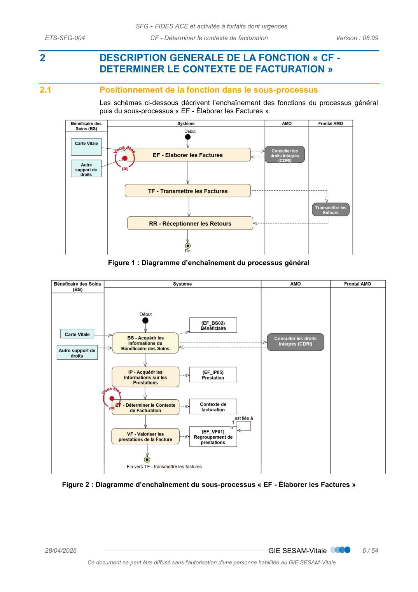
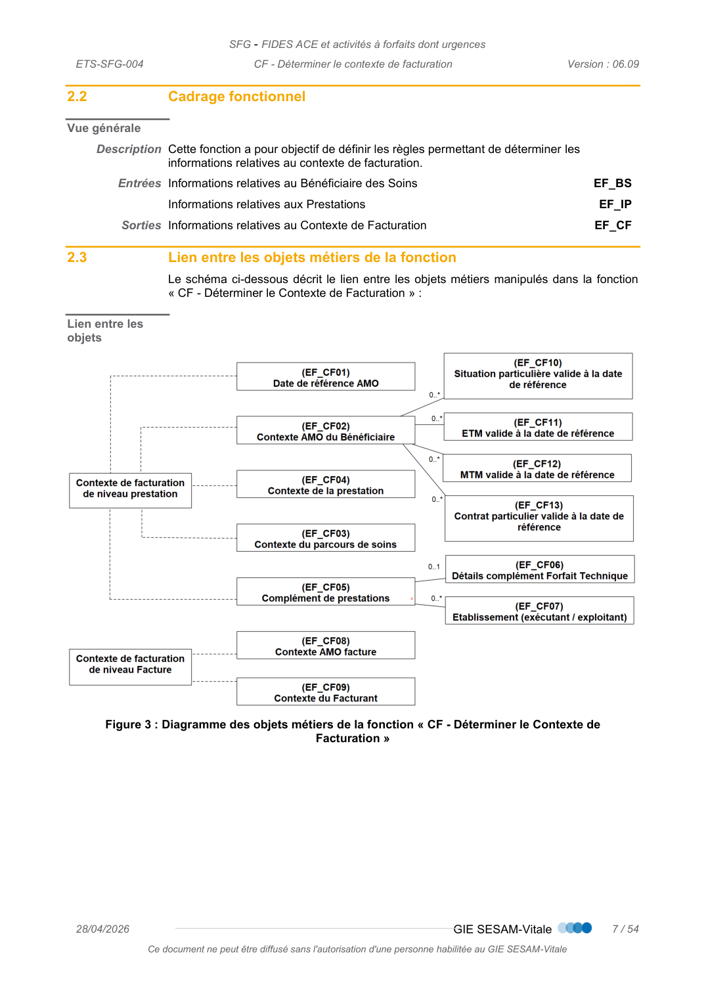
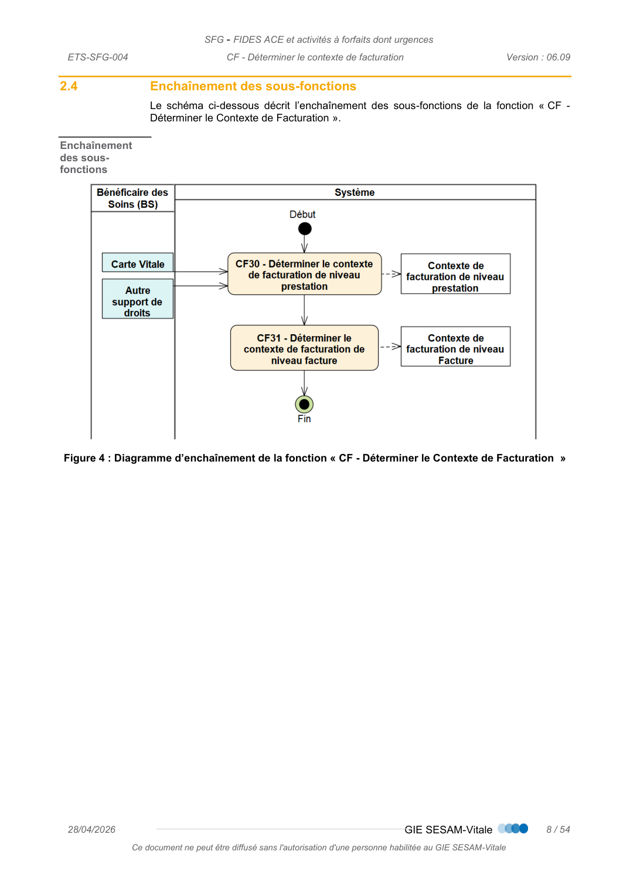
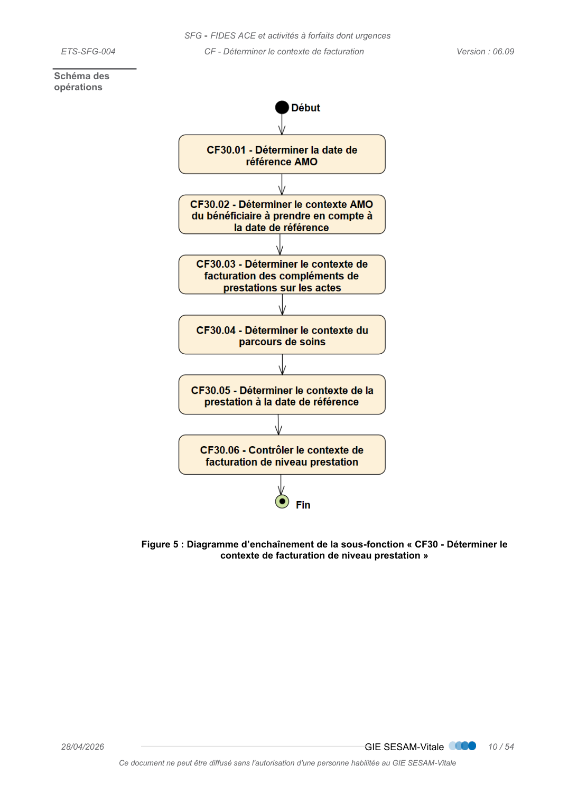
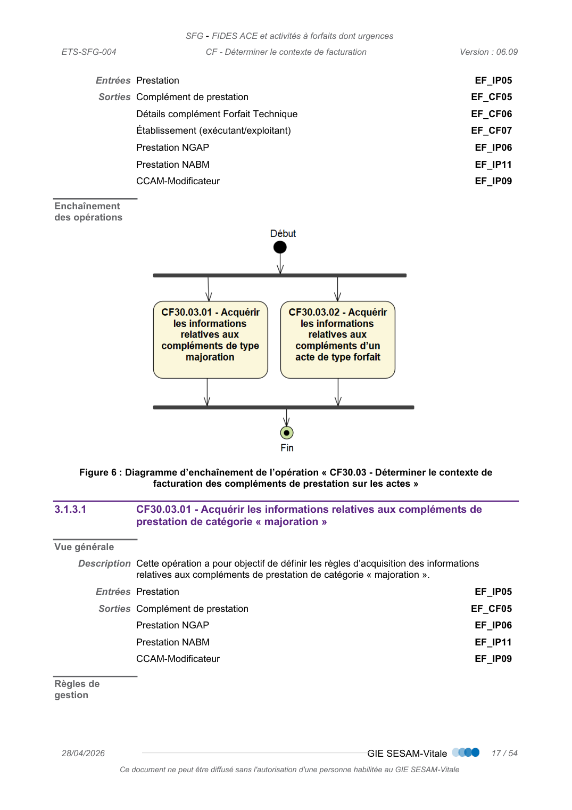
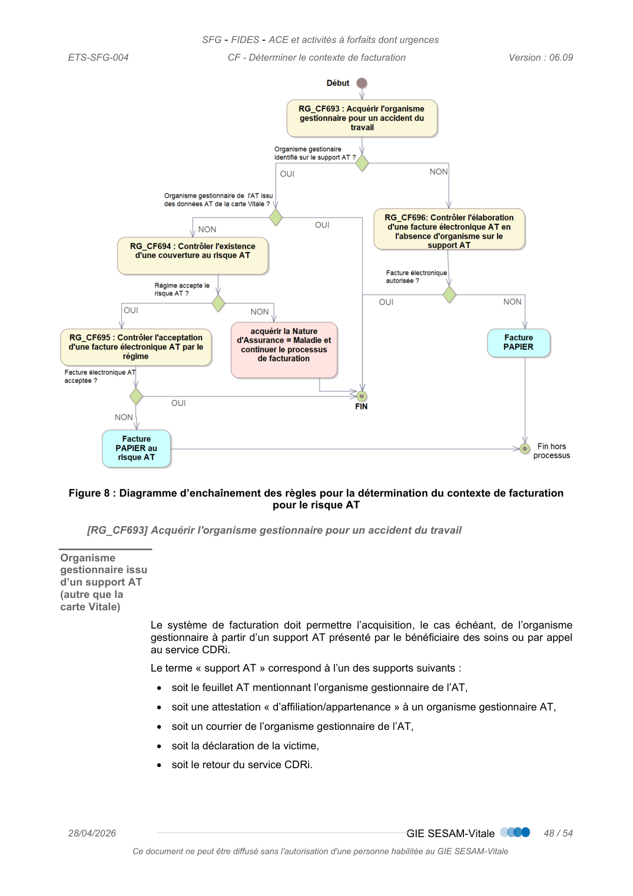

# CF — Déterminer le Contexte de Facturation

_Pages 147–200 du PDF source._

<!-- p.147 -->
CF - Déterminer le contexte de
facturation

<!-- p.148 -->
CF - Déterminer le contexte de facturation
arrangement, quel que soit le procédé utilisé.
des sanctions pour l’auteur du délit.
CONTACTS
Pour toute question technique ou fonctionnelle, contactez le Centre de services :
•
e-mail : centre-de-service@sesam-vitale.fr

<!-- p.149 -->
CF - Déterminer le contexte de facturation
1
1.1
1.2
1.3
1.4
1.5
1.6
2
DESCRIPTION GENERALE DE LA FONCTION « CF - DETERMINER LE CONTEXTE DE
2.1
2.2
2.3
2.4
3
DESCRIPTION DETAILLEE DE LA FONCTION « CF - DETERMINER LE CONTEXTE DE
3.1
3.1.1
3.1.2
CF30.02 - Déterminer le contexte AMO du bénéficiaire à prendre en compte à la date
3.1.3
CF30.03 - Déterminer le contexte de facturation des compléments de prestation sur les
3.1.3.1
3.1.3.2
3.1.4
3.1.5
3.1.6
3.1.6.1
3.1.6.2
3.1.6.3
3.1.6.4
3.2
4

<!-- p.150 -->
CF - Déterminer le contexte de facturation
TABLE DES ILLUSTRATIONS
FIGURE 3 : DIAGRAMME DES OBJETS METIERS DE LA FONCTION « CF - DETERMINER LE CONTEXTE DE
FIGURE 4 : DIAGRAMME D’ENCHAINEMENT DE LA FONCTION « CF - DETERMINER LE CONTEXTE DE FACTURATION  » . 8
FIGURE 5 : DIAGRAMME D’ENCHAINEMENT DE LA SOUS-FONCTION « CF30 - DETERMINER LE CONTEXTE DE
FIGURE 6 : DIAGRAMME D’ENCHAINEMENT DE L’OPERATION « CF30.03 - DETERMINER LE CONTEXTE DE FACTURATION
FIGURE 7 : DIAGRAMME D’ENCHAINEMENT DE L’OPERATION « CF30.06 - CONTROLER LE CONTEXTE DE FACTURATION
FIGURE 8 : DIAGRAMME D’ENCHAINEMENT DES REGLES POUR LA DETERMINATION DU CONTEXTE DE FACTURATION

<!-- p.151 -->
CF - Déterminer le contexte de facturation

## 1 INTRODUCTION

### 1.1 Objet du document

Ce document a pour objet de spécifier la fonction « CF : Déterminer le Contexte de
Facturation » appartenant au sous-processus « EF : Élaborer les Factures ».

### 1.2 Statut du document

De référence.

### 1.3 Positionnement du document dans le dossier de SFG

 Cf. [PG] – Présentation Générale

### 1.4 Documents de référence

 Cf. [PG] – Présentation Générale

### 1.5 Abréviations et définitions

 Cf. [DICO] - Dictionnaire de données

### 1.6 Guide de lecture

 Cf. [PG] – Présentation Générale

<!-- p.152 -->
CF - Déterminer le contexte de facturation

## 2 DESCRIPTION GENERALE DE LA FONCTION « CF - DETERMINER LE CONTEXTE DE FACTURATION »

### 2.1 Positionnement de la fonction dans le sous-processus

Les schémas ci-dessous décrivent l’enchaînement des fonctions du processus général
puis du sous-processus « EF - Élaborer les Factures ».
Figure 1 : Diagramme d’enchaînement du processus général
Figure 2 : Diagramme d’enchaînement du sous-processus « EF - Élaborer les Factures »

*Figure (p.152) : Figure 1 : Diagramme d’enchaînement du processus général*

<!-- p.153 -->
CF - Déterminer le contexte de facturation

### 2.2 Cadrage fonctionnel

Vue générale
Description Cette fonction a pour objectif de définir les règles permettant de déterminer les
informations relatives au contexte de facturation.
Entrées Informations relatives au Bénéficiaire des Soins
EF_BS
 Informations relatives aux Prestations
EF_IP
Sorties Informations relatives au Contexte de Facturation
EF_CF

### 2.3 Lien entre les objets métiers de la fonction

Le schéma ci-dessous décrit le lien entre les objets métiers manipulés dans la fonction
« CF - Déterminer le Contexte de Facturation » :
Lien entre les
objets
Figure 3 : Diagramme des objets métiers de la fonction « CF - Déterminer le Contexte de
Facturation »

*Figure (p.153) : Figure 3 : Diagramme des objets métiers de la fonction « CF - Déterminer le Contexte de*

<!-- p.154 -->
CF - Déterminer le contexte de facturation

### 2.4 Enchaînement des sous-fonctions

Le schéma ci-dessous décrit l’enchaînement des sous-fonctions de la fonction « CF -
Déterminer le Contexte de Facturation ».
Enchaînement
des sous-
fonctions
Figure 4 : Diagramme d’enchaînement de la fonction « CF - Déterminer le Contexte de Facturation  »

*Figure (p.154) : Figure 4 : Diagramme d’enchaînement de la fonction « CF - Déterminer le Contexte de Facturation  »*

<!-- p.155 -->
CF - Déterminer le contexte de facturation

## 3 DESCRIPTION DETAILLEE DE LA FONCTION « CF - DETERMINER LE CONTEXTE DE FACTURATION »

### 3.1 CF30 - Déterminer le contexte de facturation de niveau prestation

Vue générale
Description Cette sous-fonction a pour objectif d’établir les règles permettant de déterminer les
informations relatives au contexte de facturation AMO au niveau prestation
Entrées Bénéficiaire
EF_BS04
 Organisme AMO maladie
EF_BS04
 Prestation
EF_IP05
 Date de référence AMO
EF_CF01
 Période droits AMO
EF_BS05
 Situation Particulière
EF_BS19
 Période SP
EF_BS20
 Exonération du TM
EF_BS12
 Période ETM
EF_BS13
 Modulation du TM
EF_BS14
 Période MTM
EF_BS15
 Prescription
EF_IP01
 Professionnel de Santé (exécutant)
EF_IP03
 Situation particulière valide à la date de référence
EF_CF10
Sorties Contexte de Facturation de niveau prestation
EF_CF
 Prestation NGAP
EF_IP06
 Prestation NABM
EF_IP11
 CCAM-Modificateur
EF_IP09

<!-- p.156 -->
CF - Déterminer le contexte de facturation
Schéma des
opérations
Figure 5 : Diagramme d’enchaînement de la sous-fonction « CF30 - Déterminer le
contexte de facturation de niveau prestation »

*Figure (p.156) : Schéma des*

<!-- p.157 -->
CF - Déterminer le contexte de facturation
3.1.1
CF30.01 - Déterminer la date de référence
Vue générale
Description Cette sous-fonction a pour objectif d’établir les règles permettant de déterminer la date de
référence.
La date de référence AMO est la date à laquelle l’établissement doit déterminer la situation
médico administrative du bénéficiaire des soins pour appliquer à la prestation le taux de
remboursement représentatif de cette situation (situations d’exonération de ticket
modérateur etc. …).
Cette date dépend du type de la prestation et du régime gestionnaire du bénéficiaire des
soins.
Entrées Organisme AMO maladie
EF_BS04
 Prestation
EF_IP05
Sorties Date de référence AMO
EF_CF01
Règles de
gestion
[RG_CF600] Déterminer la date de référence AMO (EF_CF01_01)
La date de référence AMO est valorisée en fonction du type d’actes concernés, lesquels
sont de type « Actes en série » ou « Acte isolé » (cf. FACT-SFG-009 « DICO - Dictionnaire
de données »).
Les différents cas de figure sont présentés dans le tableau ci-après :

<!-- p.158 -->
CF - Déterminer le contexte de facturation
Nomenclature
(EF_IP05_08)
 ou type d’acte
Sous-catégorie
(EF_IP05_07)
Régime
(EF_BS04
_01)
Type
d’acte
Date de référence AMO
(EF_CF01_01)
NGAP
CCAM
Tous
Hors
dentaires/ODF
et
dentaires/prothétiques
Tous
Acte
isolé
date d'exécution
Actes en
série
date de prescription
dentaires/prothétiques
Tous
Tous
date d'achèvement des
travaux
dentaires/ODF
Tous
Tous
date de proposition du
traitement orthodontique
i.e. date de prescription
NABM
LPP
Tous
Tous
Tous
date de prescription (cf.
cas particulier)
Rétrocession
Pharmacie
Tous
Tous
Tous
date d'exécution
Activité à
forfait (FUx,
SIM, SIC, SAS,
SUB, SB2,
SB3)
Urgence
Tous
sans
objet
cf. RG_IP621
FPU, FPV, FPL,
FPM, CFU, FPX
Urgence
Tous
sans
objet
date de début de prise
en charge par le médecin
urgentiste
 Cas particulier
[SP03] : C2S
Pour la C2S, en ce qui concerne les prestations pharmaceutiques et les dispositifs de la
LPP, il convient de retenir la date d’exécution comme date de référence.

<!-- transcrit de p.160 (ex-figure) -->

**Détermination de la date de référence AMO (EF_CF01_01)**

| Cas | Date de référence AMO |
| --- | --- |
| Cas général | Date d'exécution de la prestation (EF_IP05_01) |
| Prestation rattachée à un séjour / une hospitalisation | Date d'entrée du séjour |

<!-- p.159 -->
CF - Déterminer le contexte de facturation
3.1.2
CF30.02 - Déterminer le contexte AMO du bénéficiaire à prendre en compte
à la date de référence
Vue générale
Description Cette sous-fonction a pour objectif d’établir les règles permettant de déterminer le
contexte AMO du bénéficiaire à prendre en compte à la date de référence.
Entrées Date de référence AMO
EF_CF01
 Bénéficiaire
EF_BS02
 Période droits AMO
EF_BS05
 Situation Particulière
EF_BS19
 Période SP
EF_BS20
 Exonération du TM
EF_BS12
 Période ETM
EF_BS13
 Modulation du TM
EF_BS14
 Période MTM
EF_BS15
 Prescription
EF_IP01
 Prestation
EF_IP05
 Médecin Traitant
EF_BS17
 Période MTT
EF_BS18
Sorties Contexte AMO du Bénéficiaire
EF_CF02
 Situation particulière valide à la date de référence
EF_CF10
 ETM valide à la date de référence
EF_CF11
 MTM valide à la date de référence
EF_CF12
 Contrat particulier valide à la date de référence
EF_CF13
Règles de
gestion
[RG_CF610] Déterminer l’âge du bénéficiaire (EF_CF02_01) à partir de la date de référence AMO
(EF_CF01_01)
L’âge du bénéficiaire (EF_CF02_01) est calculé à partir de la différence entre la Date de
référence AMO (EF_CF01_01) et la Date de naissance du bénéficiaire (EF_BS02_01).
[RG_CF611] Déterminer si les Droits de base AMO sont ouverts (EF_CF02_02)
Si la Date de référence AMO (EF_CF01_01) se situe dans la période de droits AMO
(EF_BS05), alors la donnée Droits de base AMO doit être valorisée à « Vrai ». Dans le cas
contraire la donnée Droits de base AMO doit être valorisée à « Faux ».
 Situation particulière
[SP10] : le bénéficiaire des soins demande le secret (facture anonyme) - EF_BS02_15
= « oui »
Il n’est pas nécessaire de déterminer les droits de base AMO.

<!-- p.160 -->
CF - Déterminer le contexte de facturation
[RG_CF612] Déterminer si une (ou plusieurs) situations particulières sont valides à la date de
référence (EF_CF10)
La donnée « Code situation particulière valide à la date de référence » (EF_CF10_01) est
valorisée avec le code situation particulière (EF_BS19_01) si la Date de référence AMO
(EF_CF01_01) se situe dans la période SP (EF_BS20). Plusieurs situations particulières
peuvent être valides à la date de référence (exemple : BS coordonné RSS et C2S).
 Situation particulière
[SP10] : le bénéficiaire des soins demande le secret (facture anonyme) - EF_BS02_15
= « oui »
Il n’est pas nécessaire de déterminer les autres situations particulières.
[RG_CF613] Déterminer les droits à exonération et modulation du Ticket Modérateur valides à la
date de référence
Afin de déterminer si le bénéficiaire dispose de droits d’exonération et/ou de modulation
du Ticket Modérateur, il faut que la Date de référence AMO (EF_CF01_01) se situe
respectivement dans la Période ETM (EF_BS13) et/ou la Période MTM (EF_BS15).
Dans le cas où cette condition est remplie, le Libellé ETM valide à la date de référence
(EF_CF11_01) et/ou le Libellé MTM valide à la date de référence (EF_CF12_01) doivent
être respectivement valorisés avec le Libellé exonération (EF_BS12_01) et le Libellé
modulation (EF_BS14_01).
À noter qu’il peut exister plusieurs situations d’exonération / modulation valides pour une
même Date de référence AMO (exemple : Maternité et ALD).
 Cas particuliers
[CP01] : Changement de situation d’exonération après la date de prescription
(EF_IP01_01)
Une modification de la situation d’exonération du Bénéficiaire des Soins peut intervenir
après la date de prescription (EF_IP01_01) :
 soit entre la Date de prescription (EF_IP01_01) et le début du traitement ;
 soit en cours de traitement.
Il convient alors d’examiner pour chaque prestation :
 la situation du Bénéficiaire des Soins à la Date de prescription (EF_IP01_01) ;
 la situation du Bénéficiaire des Soins à la Date d’exécution de la prestation
(EF_IP05_01).
Le principe admis par la réglementation est de retenir la situation la plus favorable pour le
Bénéficiaire des Soins (en termes de taux de prise en charge) :
 si le changement de situation au regard de l’exonération du ticket modérateur est
défavorable (taux de remboursement inférieur à celui correspondant à la situation du
Bénéficiaire des Soins à la Date de prescription (EF_IP01_01)) alors le taux de
remboursement à prendre en compte reste celui valable à la Date de prescription
(EF_IP01_01).
 si le changement est favorable (taux de remboursement supérieur à celui
correspondant à la situation du Bénéficiaire des Soins à la Date de prescription
(EF_IP01_01), le taux de remboursement à prendre en compte est celui valable à la
Date d’exécution de la prestation (EF_IP05_01).

<!-- p.161 -->
CF - Déterminer le contexte de facturation
 Situation particulière
[SP10] : le bénéficiaire des soins demande le secret (facture anonyme) - EF_BS02_15
= « oui »
Il n’est pas nécessaire de déterminer les droits à exonération et modulation du Ticket
Modérateur valides à la date de référence.
[RG_CF614] Déterminer l’existence de médecin traitant à la date de référence (EF_CF02_05)
Le tableau ci-dessous permet de valoriser la donnée EF_CF02_05 en fonction de différents
critères :
Existence de
médecin traitant à
la date de référence
(EF_CF02_05)
Et Code existence
d'une déclaration
de médecin traitant
(EF_BS17_01)
Et période
MTT
(EF_BS18)
Et date de référence
(EF_CF01_01)
Oui
Oui
absente
Oui
Oui
présente
est situé dans la Période
MTT (EF_BS18)
Non
Dans les autres cas
 Situation particulière
[SP10] : le bénéficiaire des soins demande le secret (facture anonyme) - EF_BS02_15
= « oui »
Il n’est pas nécessaire de déterminer l’existence d’un médecin traitant.
 Cas particuliers
[CP01] : La date de référence est strictement antérieure à la date de début de MTT
(EF_BS18_02)
Dans ce cas, le système de facturation ne peut pas déterminer l’existence de médecin
traitant. Cette détermination devra être effectuée par la personne en charge du dossier
administratif.
[RG_CF615] Déterminer le Code contrat particulier SNCF à la date de référence (EF_CF13_01)
La donnée « Code contrat particulier à la date de référence » (EF_CF13_01) est valorisée
avec le Code contrat particulier (EF_BS22_01) si la Date de référence AMO (EF_CF01_01)
se situe dans la Période contrat particulier (EF_BS23).
Il peut y avoir plusieurs « contrat particulier valide à la date de référence » (EF_CF13).
Lorsqu’un « Code contrat particulier à la date de référence » égal à 20 est identifié (cas
des bénéficiaires « subsistants »), seul celui-ci doit être retenu pour la détermination du
taux de prise en charge (les types de contrats « Caractéristiques de population » ne doivent
pas être considérés).

<!-- transcrit de p.161 (ex-figure) -->

**Existence de médecin traitant à la date de référence (EF_CF02_05)**

| Situation | Existence de médecin traitant à la date de référence |
| --- | --- |
| Le bénéficiaire a déclaré un médecin traitant valide à la date de référence | Oui |
| Le bénéficiaire n'a pas déclaré de médecin traitant valide à la date de référence | Non |

<!-- p.162 -->
CF - Déterminer le contexte de facturation
3.1.3
CF30.03 - Déterminer le contexte de facturation des compléments de
prestation sur les actes
Vue générale
Description
Cette sous-fonction a pour objectif de définir les règles d’acquisition des informations
relatives aux compléments de prestation.
Un complément de prestation est une rémunération qui vient s’ajouter à l’acte principal, et
ne peut être facturé seul. Il est donc nécessairement lié à un acte.
Les différents types de compléments de prestation sont :
 les majorations, qui rémunèrent l’emploi d’un contexte spécifique d’exécution d’une
prestation de santé (hors considération technique),
 les forfaits, qui rémunèrent le surcoût lié à l’utilisation d’un environnement spécifique
pour l’exécution d’une prestation de santé.
Remarque : ces définitions fonctionnelles sont données dans le seul cadre des présentes
SFG (classification sans caractère officiel reconnu par l’ATIH, DGOS).
Un complément de prestation est lié à une prestation « support », de ce fait, et sauf
exception (le complément de prestation « hérite » des informations de la prestation
« support » à laquelle il est rattaché : Date d’exécution (EF_IP05_01), Domaine d’activité
(EF_IP05_09), Motif médical d'exonération (EF_IP05_03), Contexte de Facturation de
niveau prestation, etc.
 Exemple d’exception du principe d’héritage :
 pour l’exécutant pour certaines prestations complémentaires,
L’« Arrêté du 27/04/2017 relatif aux majorations applicables aux tarifs des actes et
consultations externes des établissements de santé publics et des établissements de santé
privés » définit les majorations applicables.

<!-- p.163 -->
CF - Déterminer le contexte de facturation
Entrées Prestation
EF_IP05
Sorties Complément de prestation
EF_CF05
Détails complément Forfait Technique
EF_CF06
Établissement (exécutant/exploitant)
EF_CF07
Prestation NGAP
EF_IP06
Prestation NABM
EF_IP11
CCAM-Modificateur
EF_IP09
Enchaînement
des opérations
Figure 6 : Diagramme d’enchaînement de l’opération « CF30.03 - Déterminer le contexte de
facturation des compléments de prestation sur les actes »
3.1.3.1
CF30.03.01 - Acquérir les informations relatives aux compléments de type
majoration
Vue générale
Description Cette opération a pour objectif de définir les règles d’acquisition des informations
relatives aux compléments de prestation de type majoration.
Entrées Prestation
EF_IP05
Sorties Complément de prestation
EF_CF05
 Prestation NGAP
EF_IP06
 Prestation NABM
EF_IP11
 CCAM-Modificateur
EF_IP09
Règles de
gestion

*Figure (p.163) : Figure 6 : Diagramme d’enchaînement de l’opération « CF30.03 - Déterminer le contexte de*

<!-- p.164 -->
CF - Déterminer le contexte de facturation
[RG_CF630] Déterminer les compléments de prestation de type majoration
Le tableau suivant contient les majorations applicables aux nomenclatures NGAP et NABM
en fonction du contexte :
Un contexte
particulier
Donne doit à
une majoration
de type
(EF_CF05_06)
Qui se décline en fonction de la nomenclature par :
NGAP
NABM
Soins intervenant de
nuit
Nuit
Code majoration de la
prestation NGAP
(EF_CF05_07) = « N »
Facturation d’un acte affiné
NABM  « 9001 »
(SUPPLEMENT POUR ACTES
EN URGENCE NUIT) ou «
9004 » (SUPPLEMENT POUR
ACTES EN URGENCE (SAMEDI
APRES 12H, DIMANCHE,
FERIE))(EF_IP11)
Soins intervenant un
jour férié ou un
dimanche
Férié
Code majoration de la
prestation NGAP
(EF_CF05_07) = « F »
Le tableau suivant contient les majorations applicables à la nomenclature NGAP en
fonction du contexte :
Un contexte particulier
Donne droit à
une majoration
de type
(EF_CF05_06)
NGAP
Bénéficiaire entre 0 et 6 ans
chez un médecin généraliste
Majoration
enfants
généraliste
Facturation d’une prestation
«MEG »
Situation DANS le parcours de
soins en ACE
Coordination
Voir table 1, sous-catégorie =
« coordination »
 « MCG » pour PS
généralistes,
« MCS » pour PS spécialistes,
« MCC » pour  cardiologues.
Situation HORS parcours de
soins pour les bénéficiaires de la
C2S, en ACE
Enfant de moins de 16 ans
Situations cliniques ou modalités
de prise en charge complexes
Complexe ou très
complexe
Voir table 1, catégorie
« réservé PS »
Soins sur un patient particulier
(enfant, famille, asthmatiques,
personnes âgées ..) ou soins
particuliers (d’anatomo-cytho-
pathologiste, infirmiers, …)
Contexte médical
Voir table 1, sous-catégorie
= « Contexte médical »
 Cas particuliers
[CP01] : CCAM
Pour les actes codés en CCAM, l’application d’une majoration pour un contexte particulier
est réalisée via des modificateurs (EF_IP09).
L'ensemble des modificateurs prévus par la CCAM et définis dans le livre III des
dispositions générales, est applicable.
[CP02] : Honoraires de surveillance

<!-- transcrit de p.164 (ex-figure) -->

**Majorations soumises à conditions (NGAP / NABM)**

| Condition | Majoration | Conséquence |
| --- | --- | --- |
| ~~Bénéficiaire entre 0 et 6 ans chez un médecin généraliste~~ | ~~Majoration enfants généraliste~~ | ~~Facturation d'une prestation « MEG »~~ |

_(Ligne ci-dessus révoquée dans la version source.)_

<!-- p.164 -->
CF - Déterminer le contexte de facturation
La majoration de coordination du médecin correspondant (MCS) destinée à valoriser le
retour d’information vers le médecin traitant ne doit pas s’appliquer aux honoraires de
surveillance visés à l’article 20 de la NGAP.
[RG_CF631] Déterminer
les
informations
nécessaires
du
complément
de
prestation
« majoration »
Les prestations de type NGAP définies dans la RG_CF630, sont présentes dans la table :
 [TABLES] Table 1 : Codes prestation
Les données suivantes sont à renseigner :
Champ
Valeurs possibles dans ce contexte
EF_CF05_01
Code Prestation
Code Prestation (ou Regroupement)
EF_CF05_02
Niveau
 « Complément »
EF_CF05_03
Catégorie
  « Majoration »
EF_CF05_04
Sous-catégorie
 « contexte médical »,
 « coordination »
 non renseignée.
EF_CF05_05
Nomenclature
 « NGAP »
[CP01] : Majorations complexes et très complexes
 Pour les majorations complexes et très complexes, les données suivantes sont à
considérer :
Champ
Valeurs possibles dans ce contexte
EF_CF05_01
Code Prestation
Code Prestation (ou Regroupement)
EF_CF05_02
Niveau
 « Support »
EF_CF05_03
Catégorie
 « Réservé PS »
EF_CF05_04
Sous-catégorie
Pour les majorations complexes, la sous-catégorie
donne le code prestation devant figurer dans la facture
EF_CF05_05
Nomenclature
 « NGAP »

<!-- transcrit de p.165 (ex-figure) -->

**Table 1 : Codes prestation — Majoration**

| Entité | Champ | Valeurs possibles dans ce contexte |
| --- | --- | --- |
| EF_CF05_01 | Code Prestation | Code Prestation (ou Regroupement) |
| EF_CF05_02 | Niveau | « Complément » |
| EF_CF05_03 | Catégorie | « Majoration » |
| EF_CF05_04 | Sous-catégorie | « contexte médical », « coordination », non renseignée. |
| EF_CF05_05 | Nomenclature | « NGAP » |

**[CP01] : Majorations complexes et très complexes**

| Entité | Champ | Valeurs possibles dans ce contexte |
| --- | --- | --- |
| EF_CF05_01 | Code Prestation | Code Prestation (ou Regroupement) |
| EF_CF05_02 | Niveau | « Support » |
| EF_CF05_03 | Catégorie | « Réservé PS » |
| EF_CF05_04 | Sous-catégorie | Pour les majorations complexes, la sous-catégorie donne le code prestation devant figurer dans la facture |
| EF_CF05_05 | Nomenclature | « NGAP » |

<!-- p.166 -->
CF - Déterminer le contexte de facturation
3.1.3.2
CF30.03.02 - Acquérir les informations relatives aux compléments de type
« Forfait »
Vue générale
Description Cette opération a pour objectif de définir les règles d’acquisition des informations
relatives aux compléments de type forfait.
Entrées Aucune
EF_IP05
Sorties Complément de prestation
EF_CF05
 Détails complément Forfait Technique
EF_CF06
 Établissement (exécutant/exploitant)
EF_CF07
Situations
particulières
Aucune
Règles de
gestion
[RG_CF632] Déterminer les informations nécessaires du complément de type « Forfait »
Le système de facturation doit permettre l'acquisition des informations suivantes présentes
dans :
 [TABLES] Table 1 : Codes prestation
Champ
Valeurs possibles dans ce contexte
EF_CF05_01
Code Prestation
Code Prestation
EF_CF05_02
Niveau
 « Complément »
EF_CF05_03
Catégorie
 « Forfait »
EF_CF05_04
Sous-catégorie
Toutes les sous-catégories disponibles dans la table 1
sont possibles.
EF_CF05_05
Nomenclature
 « NGAP »
 « Activité à forfait »
cf. RG_CF633
[RG_CF636] Déterminer les compléments de type « Forfait » à facturer dans le cadre des
urgences non gynécologiques
Pour un passage par les urgences (établissements disposant d’une autorisation d’urgence)
non suivis d’hospitalisation ou d’une prise en charge en UHCD, à partir du 1er Septembre
2021, hors urgences gynécologiques, les forfaits suivants sont facturables à la date
d’exécution de la prestation associée en fonction du contexte :
Contexte particulier
Type de
forfait
Sous-
catégorie
Code
prestation
Nomen-
clature
Patient arrivé en ambulance (VSAV, transport
sanitaire urgent, SMUR ou hélicoptère)
Urgence
SUM
Activités à
forfait
Supplément correspondant à la lourdeur de la
prise en charge : état du patient CCMU 2+ et
liste limitative d’actes
Urgence
SU2
Activités à
forfait

<!-- transcrit de p.166 (ex-figure) -->

**Table 1 : Codes prestation — Forfait (RG_CF632)**

| Entité | Champ | Valeurs possibles dans ce contexte |
| --- | --- | --- |
| EF_CF05_01 | Code Prestation | Code Prestation |
| EF_CF05_02 | Niveau | « Complément » |
| EF_CF05_03 | Catégorie | « Forfait » |
| EF_CF05_04 | Sous-catégorie | Toutes les sous-catégories disponibles dans la table 1 sont possibles. |
| EF_CF05_05 | Nomenclature | « NGAP », « Activité à forfait » — cf. RG_CF633 |

**[RG_CF636] Forfaits facturables dans le cadre des urgences non gynécologiques**

| Contexte particulier | Sous-catégorie | Code prestation | Nomenclature |
| --- | --- | --- | --- |
| Patient arrivé en ambulance (VSAV, transport sanitaire urgent, SMUR ou hélicoptère) | Urgence | SUM | Activités à forfait |
| Supplément correspondant à la lourdeur de la prise en charge : état du patient CCMU 2+ et liste limitative d'actes | Urgence | SU2 | Activités à forfait |

<!-- p.167 -->
CF - Déterminer le contexte de facturation
Supplément correspondant à la lourdeur de la
prise en charge : état du patient CCMU 3-4-5
Urgence
SU3
Activités à
forfait
Supplément lié au contexte de réalisation :
supplément nuit profonde du forfait socle âge
FUx
Urgence
SUN
Activités à
forfait
Supplément lié au contexte de réalisation :
supplément
soirée,
samedi
après-midi,
dimanche et jour férié du forfait socle âge FUx
Urgence
SUF
Activités à
forfait
Supplément lié au contexte de réalisation :
supplément nuit pour le supplément imagerie,
avis spécialiste à la demande de l’urgentiste
Urgence
SSN
Activités à
forfait
Supplément lié au contexte de réalisation:
supplément
férié
pour
le
supplément
imagerie, avis spécialiste à la demande de
l’urgentiste
Urgence
SSF
Activités à
forfait
Utilisation d’appareils d’imagerie médicale
Imagerie
médicale
FR2, FR3,
FTG, FTN,
FTR
NGAP
« Supplément prise en charge pédiatrique »
correspondant à un des diagnostics inscrits
sur la liste 1 de l’annexe 8 de l’arrêté modifié
du 27 décembre 2021
Urgence
PE1
Activités à
forfait
« Supplément prise en charge pédiatrique + »
correspondant à un des diagnostics inscrits
sur la liste 2 de l’annexe 8 de l’arrêté précité
Urgence
PE2
Activités à
forfait
[CP01] : Utilisation d’appareils d’imagerie médicale
Seule la réalisation d’actes d’imagerie en coupe par un radiologue (valorisation d’un SIC)
peut donner lieu à la valorisation d’un ou plusieurs forfaits techniques d’« utilisation
d’appareils d’imagerie médicale » (FR2, FR3, FTN, FTR).
Autrement dit, un forfait technique ne peut pas être facturé avec un forfait SIM.
[RG_CF633] Déterminer les autres compléments de type « Forfait » à facturer (hors urgences non
gynécologiques)
Le tableau suivant donne les forfaits applicables suivant le contexte :
Contexte particulier
Type de
forfait
Sous-
catégorie
Code
Nomen-
clature
Passage
par
les
non
suivi
d’hospitalisation ou d’une prise en charge en
UHCD (structure d’urgence autorisée), pour
les urgences gynécologiques uniquement à
partir du 1er septembre 2021
Urgence
ATU
Activités à
forfait
Soins
non
programmés
non
suivis
d’hospitalisation ou d’une prise en charge en
UHCD
(établissement
n’étant
pas
une
structure d’urgence autorisée)
Petit
matériel
FFM
Activités à
forfait

<!-- transcrit de p.167 (ex-figure) -->

**[RG_CF636] (suite) Forfaits facturables dans le cadre des urgences non gynécologiques**

| Contexte particulier | Sous-catégorie | Code prestation | Nomenclature |
| --- | --- | --- | --- |
| Supplément correspondant à la lourdeur de la prise en charge : état du patient CCMU 3-4-5 | Urgence | SU3 | Activités à forfait |
| Supplément lié au contexte de réalisation : supplément nuit profonde du forfait socle âge FUx | Urgence | SUN | Activités à forfait |
| Supplément lié au contexte de réalisation : supplément soirée, samedi après-midi, dimanche et jour férié du forfait socle âge FUx | Urgence | SUF | Activités à forfait |
| Supplément lié au contexte de réalisation : supplément nuit pour le supplément imagerie, avis spécialiste à la demande de l'urgentiste | Urgence | SSN | Activités à forfait |
| Supplément lié au contexte de réalisation : supplément férié pour le supplément imagerie, avis spécialiste à la demande de l'urgentiste | Urgence | SSF | Activités à forfait |
| Utilisation d'appareils d'imagerie médicale | Imagerie médicale | FR2, FR3, FTG, FTN, FTR | NGAP |
| « Supplément prise en charge pédiatrique » correspondant à un des diagnostics inscrits sur la liste 1 de l'annexe 8 de l'arrêté modifié du 27 décembre 2021 | Urgence | PE1 | Activités à forfait |
| « Supplément prise en charge pédiatrique + » correspondant à un des diagnostics inscrits sur la liste 2 de l'annexe 8 de l'arrêté précité | Urgence | PE2 | Activités à forfait |

**[RG_CF633] Autres compléments de type « Forfait » à facturer (hors urgences non gynécologiques)**

| Contexte particulier | Sous-catégorie | Code | Nomenclature |
| --- | --- | --- | --- |
| Passage par les urgences non suivi d'hospitalisation ou d'une prise en charge en UHCD (structure d'urgence autorisée), pour les urgences gynécologiques uniquement à partir du 1er septembre 2021 | Urgence | ATU | Activités à forfait |
| Soins non programmés non suivis d'hospitalisation ou d'une prise en charge en UHCD (établissement n'étant pas une structure d'urgence autorisée) | Petit matériel | FFM | Activités à forfait |

<!-- p.168 -->
CF - Déterminer le contexte de facturation
Utilisation
d’un
secteur
opératoire
ou
observation
du
patient
dans
un
environnement particulier et réalisation d’au
moins un acte CCAM appartenant à l’une des
listes ouvrant droit à la facturation du forfait
SE1 à SE4
Sécurité
environne
ment
SE1,
SE2,
SE3, SE4
Activités à
forfait
Un ou plusieurs produits et prestations de la
LPP sont administrés ou
des médicaments de la liste en sus
(conformément à l’article L162-22-7) sont
administrés
APE
APE
Activités à
forfait
L’acte d'administration de toxine botulique
(produit de la RH hors liste en sus) donne lieu
à facturation au forfait SE5 ou SE6  et à l’acte
CCAM  éligible à cette facturation
Sécurité
environne
ment
SE5, SE6
Activités à
forfait
Implantation en environnement hospitalier de
dispositifs médicaux cardiologiques inscrits
sur la Liste LPP en sus et réalisation d’un acte
CCAM ouvrant droit à la facturation du SE7
Sécurité
environne
ment
SE7
Activités à
forfait
Utilisation d’appareils d’imagerie médicale
Imagerie
médicale
FR2,
FR3,
FTG,
FTN, FTR
NGAP
Recours à un environnement spécifique en
dermatologie
Sécurité
dermatolo
gie
FSD
NGAP
Fourniture d’un consommable ingéré par le
patient
Vidéocap
sule
VDE
NGAP
[RG_CF634] Acquérir les informations relatives au détail du complément Forfait Technique
(EF_CF06)
Lorsque la sous-catégorie (EF_CF05_04) d’un forfait est valorisée à « Imagerie
médicale », les informations suivantes doivent être renseignées :
 Numéro d'identification de l'appareillage
(EF_CF06_01) ;
 Numéro d'ordre de l'examen
(EF_CF06_02).
 Type d’appareillage
(EF_CF06_03).
○ Cette donnée est valorisée avec « IRM » ou « SCAN » ou « Tomographe » en
fonction de l’appareillage utilisé.
 Remarque concernant les actes de radiologie :
[RC9] Consigne concernant le code agrément radio de l’exécutant
Lorsque le code acte / activité est un acte radiologique (donné par le champ 12 « catégorie
médicale de codes » de la base CCAM), le Professionnel de Santé exécutant doit posséder
l’agrément adéquat.
 Les forfaits techniques d’imagerie peuvent être facturés seuls dans le cadre de la co-
utilisation de matériel (le PS libéral facture l’acte CCAM en SESAM-Vitale et l’établissement
facture le forfait technique seul).

<!-- transcrit de p.168 (ex-figure) -->

**[RG_CF633] (suite) Autres compléments de type « Forfait » à facturer (hors urgences non gynécologiques)**

| Contexte particulier | Sous-catégorie | Code | Nomenclature |
| --- | --- | --- | --- |
| Utilisation d'un secteur opératoire ou observation du patient dans un environnement particulier et réalisation d'au moins un acte CCAM appartenant à l'une des listes ouvrant droit à la facturation du forfait SE1 à SE4 | Sécurité environnement | SE1, SE2, SE3, SE4 | Activités à forfait |
| Un ou plusieurs produits et prestations de la LPP sont administrés ou des médicaments de la liste en sus (conformément à l'article L162-22-7) sont administrés | APE | APE | Activités à forfait |
| L'acte d'administration de toxine botulique (produit de la RH hors liste en sus) donne lieu à facturation au forfait SE5 ou SE6 et à l'acte CCAM éligible à cette facturation | Sécurité environnement | SE5, SE6 | Activités à forfait |
| Implantation en environnement hospitalier de dispositifs médicaux cardiologiques inscrits sur la Liste LPP en sus et réalisation d'un acte CCAM ouvrant droit à la facturation du SE7 | Sécurité environnement | SE7 | Activités à forfait |
| Utilisation d'appareils d'imagerie médicale | Imagerie médicale | FR2, FR3, FTG, FTN, FTR | NGAP |
| Recours à un environnement spécifique en dermatologie | Sécurité dermatologie | FSD | NGAP |
| Fourniture d'un consommable ingéré par le patient | Vidéocapsule | VDE | NGAP |

<!-- p.169 -->
CF - Déterminer le contexte de facturation
[RG_CF635] Acquérir le FINESS de l’établissement (EF_CF07_01)
Conditions :
 Activité à forfait
 Activité d’urgence
 Forfaits techniques d‘imagerie
Activité à forfait
Dans le cadre des compléments de prestation des activités à forfait (ATU/FFM/SE/APE)
l'exécutant (au sens de celui qui perçoit une rémunération pour un contexte particulier) est
l’établissement et le système de facturation doit alors permettre l’acquisition de son N°
FINESS géographique (EF_CF07_01).
Activité
d’urgence
Dans le cadre des compléments de prestation de l’activité d’urgence (SUM, SU2, SU3,
SSN, SSF, SUN, SUF, PE1, PE2), du forfait patient urgence (FPX, FPU, FPV, FPM, FPL,
CFU), l'exécutant (au sens de celui qui perçoit une rémunération pour un contexte
particulier) est l’établissement et le système de facturation doit alors permettre l’acquisition
de son N° FINESS géographique (EF_CF07_01).
Forfaits
techniques
d‘imagerie
Il convient d’acquérir le FINESS de l’exploitant de l’appareillage (titulaire de l’autorisation)
(EF_CF07_01), cet exploitant peut être soit l’établissement dans lequel ont été réalisés les
actes, soit un autre établissement.
Nota bene :
 les forfaits techniques d’imagerie doivent être facturés par l’exploitant de
l’appareillage (titulaire de l’autorisation),
 les prestations doivent être facturées par l’établissement où ont été réalisées les
prestations d’hospitalisation.
 Si l’exploitant est différent de l’établissement dans lequel ont été réalisés les actes, 2
factures doivent être produites.

<!-- p.170 -->
CF - Déterminer le contexte de facturation
3.1.4
CF30.04 - Déterminer le contexte du parcours de soins (pour les ACE)
 Vue générale
Description Cette sous-fonction a pour objectif d’établir les règles permettant de déterminer les
informations relatives au contexte du parcours de soins (en ACE).
Les principes du dispositif et la gestion du parcours coordonné de soins sont rappelés
dans la fiche d’information sur ce sujet et disponible sur le site ameli.fr.
Entrées Situation Particulière
EF_BS19
 Professionnel de Santé (exécutant)
EF_IP03
 Contexte AMO du bénéficiaire
EF_CF02
 Situation particulière valide à la date de référence
EF_CF10
Sorties Contexte du parcours de soins
EF_CF03
Préambule
Tous les bénéficiaires d'une couverture maladie sont invités, à partir de 16 ans, à choisir
un médecin traitant qui leur permet de s'inscrire dans un parcours de soins coordonnés.
Pour respecter le parcours coordonné de soins et ainsi conserver le même niveau de
remboursement par leur régime obligatoire, les bénéficiaires de 16 ans et plus sont tenus
de désigner un médecin traitant à leur caisse d’assurance maladie. Ils peuvent en changer
à n’importe quel moment et désigner ainsi un « nouveau médecin traitant ».
Le médecin traitant est choisi sans limitation de durée. Il assure le premier niveau de
recours aux soins, et si nécessaire oriente son bénéficiaire de soins vers un autre médecin,
dit « médecin correspondant ».
La déclaration d’un médecin traitant pour les enfants de moins de 16 ans n’est pas
obligatoire mais possible. Ils restent non concernés par le Parcours de Soins.
Le dispositif médecin traitant et la gestion du parcours coordonné de soins comprennent :
 la désignation par le bénéficiaire de soins de son médecin traitant,
 le respect par le bénéficiaire de soins du parcours de soins sous peine de pénalité de
remboursement,
 la possibilité pour le médecin de facturer de nouvelles majorations,
 la possibilité pour le médecin de facturer de nouveaux dépassements.
Pour chaque bénéficiaire de plus de 16 ans qui consulte un médecin, la position par rapport
au parcours de soins correspond à l’une des trois valeurs suivantes :
 Non concerné par le parcours de soins,
 DANS le parcours de soins
 HORS parcours de soins
Cette information résulte d’une combinaison entre la situation au regard du parcours de
soins et l’existence de la déclaration d’un médecin traitant.
Une majoration du ticket modérateur s’applique :
 si l’IPS de la facture est « Hors parcours de soins »,
 pour les actes soumis au parcours de soins uniquement.
 Le calcul de la majoration du ticket modérateur est décrit dans les règles de gestion
RG_VF670 et RG_VF671, document [VF].

<!-- p.171 -->
CF - Déterminer le contexte de facturation
 Dans une même facture ACE, peuvent coexister des actes soumis au parcours de soins et
des actes non soumis au parcours de soins. Les actes non soumis au parcours de soins
ne sont pas concernés par la majoration du ticket modérateur, même si l’IPS de la facture
est « Hors parcours de soins ».
Règles de
gestion
[RG_CF640] Identifier les cas d’exclusion du parcours de soins et déterminer l’IPS (EF_CF03_01)
et le Top MT (EF_CF03_02)
Cette règle a pour objet de déterminer les cas d’exclusion liés :
 soit à la situation du bénéficiaire
 soit à la spécialité du PS
 soit à la nature des soins
Dans tous les cas d’exclusion précisés ci-dessous, l’IPS (EF_CF03_01) et le Top MT
(EF_CF03_02) ne sont pas valorisés (valeur à blanc).
Contexte
d’exclusion
Cas d’exclusion
Situation du
bénéficiaire
 l’âge du bénéficiaire à la date de référence AMO (EF_CF01_01)
est inférieur à 16 ans ;
 le bénéficiaire bénéficie de l’AME (EF_CF10_01 est égal à
« SP06 ») ;
 le bénéficiaire est un BS de passage coordonné RSS
(EF_CF10_01 est égal à « SP08.1 ») ;
 le bénéficiaire est affilié à la caisse de Mayotte (N° de caisse
976).1
Spécialité du PS
 les familles de Professionnels de Soins :
○  « Auxiliaires-Médicaux »,
○ « Pharmaciens »,
○ « Laboratoires d'analyse de biologie médicale »,
 les sous-familles
○ « Chirurgien-dentiste »
○ « Sage-femme »
 Cf. [TABLES - Liste des tables] Table 100 : Code spécialité
des Professionnels de Santé
1 La loi n° 2019-774 du 24 juillet 2019 relative à l'organisation et à la transformation du système de santé
procède à l’extension à Mayotte, du dispositif de parcours de soins coordonnés. Le parcours de soins
coordonnés y est partiellement transposé, en effet, la majoration de la participation de l’assuré en cas
d’absence de déclaration de choix d’un médecin traitant ou en cas de consultation sans respect du parcours
de soins n’est pas appliquée.

<!-- transcrit de p.171 (ex-figure) -->

**[RG_CF640] Cas d'exclusion du parcours de soins**

| Contexte d'exclusion | Cas d'exclusion |
| --- | --- |
| Situation du bénéficiaire | • l'âge du bénéficiaire à la date de référence AMO (EF_CF01_01) est inférieur à 16 ans ; • le bénéficiaire bénéficie de l'AME (EF_CF10_01 est égal à « SP06 ») ; • le bénéficiaire est un BS de passage coordonné RSS (EF_CF10_01 est égal à « SP08.1 ») ; • le bénéficiaire est affilié à la caisse de Mayotte (N° de caisse 976).¹ |
| Spécialité du PS | • les familles de Professionnels de Soins : &nbsp;&nbsp;○ « Auxiliaires-Médicaux », &nbsp;&nbsp;○ « Pharmaciens », &nbsp;&nbsp;○ « Laboratoires d'analyse de biologie médicale », • les sous-familles &nbsp;&nbsp;○ « Chirurgien-dentiste » &nbsp;&nbsp;○ « Sage-femme » Cf. [TABLES - Liste des tables] Table 100 : Code spécialité des Professionnels de Santé |

<!-- p.172 -->
CF - Déterminer le contexte de facturation
 Seule la sous-famille « Médecin » est concernée par le
parcours de soins, à l’exception des Professionnels de Santé
de spécialité 38.
Nature des soins
 La rétrocession hospitalière
 Les actes présents dans la table suivante :
 Cf. [TABLES - Liste des tables], Table 15.3 : Cas d’exclusion
du parcours de soins en fonction de la nature des soins
 La catégorie médicale de l’acte pour un acte de nomenclature
CCAM
 Les catégories médicales (champ 12 de la base CCAM) exclues
du parcours de soins sont données dans la table 15.5.
 Cf. [TABLES - Liste des tables], Table 15.5 : Cas d’exclusion
du parcours de soins en fonction de la catégorie médicale
d’un acte CCAM
Téléconsultations
Les téléconsultations (prestations dont la sous-catégorie
EF_IP05_07 = « téléconsultation ») pour les patients n’ayant pas
de médecin traitant désigné ou si ce dernier n’est pas disponible
dans un délai compatible avec l’état de santé du patient sont
exclues du parcours de soins
[RG_CF641] Déterminer l’IPS (EF_CF03_01) et le Top MT (EF_CF03_02) au regard de la situation
du parcours de soins et de l’Existence de médecin traitant à la date de référence
(EF_CF02_05)
Condition : hors exclusion du parcours de soins déterminé en RG_CF640
Situation au regard
du parcours de soins
Existence de
médecin traitant
à la date de
référence
Position par
rapport au
parcours de
soins
IPS
Top MT
Acte en rapport avec l’article D.162-1-6 du
CSS
(sans objet)
Non concerné
A
Blanc
 Passage aux Urgences (forfaits ATU, FFM,
SEx, APE et actes associés)
 Actes réalisés dans un contexte d’Urgence
(sans objet)
U
Blanc
Médecin Traitant
(sans objet)
DANS
T
O
Nouveau Médecin Traitant
(sans objet)
N
O
Médecin traitant de substitution (remplacé)
Oui
R
O
Hors résidence habituelle du patient
Oui
H
O
Non
H
N ou
blanc
Accès direct spécifique (RG_CF670)
Oui
D
O
Non
HORS
S
N ou
blanc

<!-- transcrit de p.172 (ex-figure) -->

**[RG_CF640] (suite) Cas d'exclusion du parcours de soins**

| Contexte d'exclusion | Cas d'exclusion |
| --- | --- |
| Spécialité du PS (suite) | Seule la sous-famille « Médecin » est concernée par le parcours de soins, à l'exception des Professionnels de Santé de spécialité 38. |
| Nature des soins | • La rétrocession hospitalière • Les actes présents dans la table suivante : Cf. [TABLES - Liste des tables], Table 15.3 : Cas d'exclusion du parcours de soins en fonction de la nature des soins • La catégorie médicale de l'acte pour un acte de nomenclature CCAM • Les catégories médicales (champ 12 de la base CCAM) exclues du parcours de soins sont données dans la table 15.5. Cf. [TABLES - Liste des tables], Table 15.5 : Cas d'exclusion du parcours de soins en fonction de la catégorie médicale d'un acte CCAM |
| Téléconsultations | Les téléconsultations (prestations dont la sous-catégorie EF_IP05_07 = « téléconsultation ») pour les patients n'ayant pas de médecin traitant désigné ou si ce dernier n'est pas disponible dans un délai compatible avec l'état de santé du patient sont exclues du parcours de soins |

**[RG_CF641] Détermination de l'IPS (EF_CF03_01) et du Top MT (EF_CF03_02)** — Condition : hors exclusion du parcours de soins déterminé en RG_CF640

| Situation au regard du parcours de soins | Existence de médecin traitant à la date de référence | Position par rapport au parcours de soins | IPS | Top MT |
| --- | --- | --- | --- | --- |
| Acte en rapport avec l'article D.162-1-6 du CSS | (sans objet) | Non concerné | A | Blanc |
| Passage aux Urgences (forfaits ATU, FFM, SEx, APE et actes associés) / Actes réalisés dans un contexte d'Urgence | (sans objet) | Non concerné | U | Blanc |
| Médecin Traitant | (sans objet) | DANS | T | O |
| Nouveau Médecin Traitant | (sans objet) | DANS | N | O |
| Médecin traitant de substitution (remplacé) | Oui | DANS | R | O |
| Hors résidence habituelle du patient | Oui | DANS | H | O |
| Hors résidence habituelle du patient | Non | DANS | H | N ou blanc |
| Accès direct spécifique (RG_CF670) | Oui | DANS | D | O |
| Accès direct spécifique (RG_CF670) | Non | HORS | S | N ou blanc |

<!-- p.173 -->
CF - Déterminer le contexte de facturation
Médecin orienté par le MT
(sans objet)
DANS
O
O
Médecin orienté par un médecin autre que le
MT (médecin en accès direct spécifique,
généraliste récemment installé, médecin
installé en zone sous médicalisée…)
Oui
M
O
Non
HORS
S
N ou
blanc
Non-respect du parcours
(PS non Médecin Traitant, non orienté,…)
(sans objet)
S
O, N ou
Blanc
 Cas particulier
[CP01] : Forfaits ATU/FFM/SE/APE
Concernant ces forfaits, l’IPS doit être forcé à U ainsi que pour tous les actes associés (cf
[RG_MF632] : Constituer le Type 2S)
 Remarque : le positionnement de l’IPS à « U » pour les actes associés permet de
neutraliser le parcours de soins pour ces derniers ; et d’éviter le déclenchement des
règles parcours de soins.
[CP02] Forfaits socles FUx et forfait SIM, SIC, SAS, SUB, SB2, SB3
Ces forfaits font partie des cas d’exclusion du parcours de soins.
 [SP17] : Détenus
Pour les détenus :
 l’IPS doit être valorisé à blanc dans les cas d’exclusion du parcours de soins (y compris
les forfaits FUx, SIM, SIC, SAS, SUB, SB2, SB3),
 sinon, l’IPS doit être valorisé à « A » (y compris en présence de forfaits
ATU/FFM/SE/APE)
[RG_CF642] Acquérir le nom (EF_CF03_03) et le prénom (EF_CF03_04) du médecin ayant orienté
Le système de facturation doit permettre la saisie des informations suivantes dans le cas
où le Bénéficiaire des Soins est orienté par un médecin autre que le médecin traitant :
 Nom du médecin ayant orienté
(EF_CF03_03) ;
 Prénom du médecin ayant orienté
(EF_CF03_04).

<!-- transcrit de p.173 (ex-figure) -->

**[RG_CF641] (suite) Détermination de l'IPS (EF_CF03_01) et du Top MT (EF_CF03_02)**

| Situation au regard du parcours de soins | Existence de médecin traitant à la date de référence | Position par rapport au parcours de soins | IPS | Top MT |
| --- | --- | --- | --- | --- |
| Médecin orienté par le MT | (sans objet) | DANS | O | O |
| Médecin orienté par un médecin autre que le MT (médecin en accès direct spécifique, généraliste récemment installé, médecin installé en zone sous médicalisée…) | Oui | DANS | M | O |
| Médecin orienté par un médecin autre que le MT (médecin en accès direct spécifique, généraliste récemment installé, médecin installé en zone sous médicalisée…) | Non | HORS | S | N ou blanc |
| Non-respect du parcours (PS non Médecin Traitant, non orienté,…) | (sans objet) | HORS | S | O, N ou Blanc |

<!-- p.174 -->
CF - Déterminer le contexte de facturation
3.1.5
CF30.05 - Déterminer le contexte de la prestation à la date de référence
Vue générale
Description Cette sous-fonction a pour objectif de définir les règles de détermination du contexte de
la prestation.
Entrées Accidents de droit commun
EF_BS06
 Date de référence AMO
EF_CF01
 ETM valide à la date de référence
EF_CF11
 Accident du travail déclaré
EF_BS09
 Prestation
EF_IP05
 Contexte AMO du Bénéficiaire
EF_CF02
 Complément de prestation
EF_CF05
Sorties Contexte de la prestation
EF_CF04
Règles de
gestion
[RG_CF650] Acquérir le « Top exigence particulière » (EF_CF04_11)
En cas d’exigence particulière du Bénéficiaire des Soins (exigences qui sortent du contexte
ordinaire d'exercice du Professionnel de Santé : horaires, techniques particulières), le
« Top exigence particulière » est valorisé à « VRAI ».
ACCIDENTS DE DROIT COMMUN
[RG_CF651] Acquérir les informations en cas d’accident de droit commun (EF_CF04_08)
Si les soins sont en rapport avec un accident de droit commun (également appelé ‘accident
de la vie privée’), le Top accident de droit commun (EF_CF04_08) prend la valeur « O »,
sinon il prend la valeur « N ».
En cas d’accident de droit commun (EF_CF04_08 = « O »), le système de facturation doit
permettre l’acquisition de la Date accident droit commun (EF_CF04_09). À noter que cette
donnée relève de la déclaration du Bénéficiaire des Soins, seul responsable de la véracité
des éléments fournis.
[RG_CF652] Déterminer si la caisse accepte les factures électroniques en cas d‘accident de droit
commun
Lorsque la facture concerne un accident de droit commun, il convient de vérifier si le
bénéficiaire est assuré pour ce risque et si la caisse accepte les factures électroniques
pour ce risque (certaines caisses de la MSA n’acceptent que des factures papier pour les
accidents de droit commun).
Si Top accident de droit commun (EF_CF04_8) = « O »
Si « Factures électroniques acceptées par la caisse » (EF_BS06_02) = « O »
Facture électronique acceptée
Sinon
Facture papier

<!-- p.175 -->
CF - Déterminer le contexte de facturation
NATURE D’ASSURANCE
[RG_CF653] Déterminer la nature d‘assurance (EF_CF04_01) à partir de la nature des soins à la
date de référence (EF_CF01_01)
Déterminer la nature d’Assurance maternité :
Les soins sont en nature d’assurance Maternité dans les cas ci-dessous :
Les droits du BS ont les
caractéristiques suivantes
Soins concernés
Exonération
Maternité
Présence d’une ETM « Maternité » valide
à la date de référence (EF_CF11)
Tous
Contrat
Maternité
Présence d’un Organisme AMO maternité
(EF_BS24) valide à la date de référence
 c'est-à-dire la date de référence AMO
(EF_CF01_01) se situe dans la
période Maternité (EF_BS25)
en rapport avec une maternité
Absence
d’une
exonération
Maternité ou
d’un contrat
Maternité
Pour la mère, les supports de droits ne
sont pas à jour ou CDRi n’a pas été
appelé
en rapport avec une Maternité
Pour le père*
examens de biologie du père pratiqués
avant la fin du 4ème mois de grossesse
Pour l’enfant hors bénéficiaires de l’AME*
Consultations obligatoires de l’enfant
pratiqués dans les 12 jours suivant la
naissance sauf en cas d’hospitalisation en
unité de néonatalogie
 Les consultations obligatoires au-
delà de 12 jours relèvent de la
nature d’assurance « Maladie » et
bénéficient d’une exonération de
type « prestation exonérée par
nature » [RG_VF660]
(EF_VF04_03).
* Ces actes doivent être transmis avec la date de naissance du bénéficiaire des soins et
non celle de la mère ou de la femme.
 Les examens obligatoires de l’enfant, y compris le premier, sont pris en charge au titre de
l’assurance « maladie » dans les cas suivants :
 bénéficiaire de l’AME,
 l’enfant est hospitalisé en unité de néonatologie.
Déterminer les autres natures d’assurance :
Si les soins sont
en rapport avec
alors, nature
d’assurance
=
Conditions
Un accident du
travail ou une
maladie
professionnelle
AT/MP
Présence d’un AT déclaré correspondant aux soins à la date de
référence.

<!-- transcrit de p.175 (ex-figure) -->

**NATURE D'ASSURANCE — [RG_CF653] Déterminer la nature d'assurance (EF_CF04_01) à partir de la nature des soins à la date de référence (EF_CF01_01)**

Déterminer la nature d'assurance **Maternité** — Les soins sont en nature d'assurance Maternité dans les cas ci-dessous :

| Cas | Les droits du BS ont les caractéristiques suivantes | Soins concernés |
| --- | --- | --- |
| Exonération Maternité | Présence d'une ETM « Maternité » valide à la date de référence (EF_CF11) | Tous |
| Contrat Maternité | Présence d'un Organisme AMO maternité (EF_BS24) valide à la date de référence — c'est-à-dire la date de référence AMO (EF_CF01_01) se situe dans la période Maternité (EF_BS25) | en rapport avec une maternité |
| Absence d'une exonération Maternité ou d'un contrat Maternité | Pour la mère, les supports de droits ne sont pas à jour ou CDRi n'a pas été appelé | en rapport avec une Maternité |
| Absence d'une exonération Maternité ou d'un contrat Maternité | Pour le père* | examens de biologie du père pratiqués avant la fin du 4ème mois de grossesse |
| Absence d'une exonération Maternité ou d'un contrat Maternité | Pour l'enfant hors bénéficiaires de l'AME* | Consultations obligatoires de l'enfant pratiquées dans les 12 jours suivant la naissance sauf en cas d'hospitalisation en unité de néonatalogie. Les consultations obligatoires au-delà de 12 jours relèvent de la nature d'assurance « Maladie » et bénéficient d'une exonération de type « prestation exonérée par nature » [RG_VF660] (EF_VF04_03). |

\* Ces actes doivent être transmis avec la date de naissance du bénéficiaire des soins et non celle de la mère ou de la femme.

Les examens obligatoires de l'enfant, y compris le premier, sont pris en charge au titre de l'assurance « maladie » dans les cas suivants : bénéficiaire de l'AME ; l'enfant est hospitalisé en unité de néonatologie.

Déterminer les autres natures d'assurance :

| Si les soins sont en rapport avec | alors, nature d'assurance = | Conditions |
| --- | --- | --- |
| Un accident du travail ou une maladie professionnelle | AT/MP | Présence d'un AT déclaré correspondant aux soins à la date de référence. |

<!-- p.176 -->
CF - Déterminer le contexte de facturation
L’identifiant de l’AT correspondant aux soins (EF_CF04_10) est
renseigné avec l’AT déclaré (EF_BS09) valide à la date de
référence AMO (EF_CF01_01), c’est à dire que la date de
référence AMO est comprise dans la période de l’AT déclaré
(EF_BS11).
Un dispositif de
prévention
Prévention
Motif médical d’exonération (EF_IP05_03) = « Soins entrants
dans le cadre d’un dispositif de prévention »
Autre
Maladie
 Cas particuliers
[CP01] : Prise en charge au titre de l’AT-MP durant la période de maternité
Les actes dispensés au titre du risque AT-MP pendant la période considérée en maternité
sont imputés au risque AT-MP.
[CP02] : Actes de prévention durant la période de maternité
Les actes dispensés au titre de la Prévention pendant la maternité et :
 avant le 1er jour du 6ème mois (c'est-à-dire sans exonération Maternité) sont imputés
au risque Prévention,
 après le 1er jour du 6ème mois (c'est-à-dire avec exonération Maternité) sont imputés
au risque Maternité.
 [SP17] : Détenus
Pour les détenus, la Nature d’assurance (EF_CF04_01) doit toujours être valorisée avec
« Maladie ».
COEFFICENTS TARIFAIRES
[RG_CF654] Déterminer l’application des coefficients tarifaires
Les coefficients tarifaires en vigueur sont :
 CSEGUR : Coefficient de prise en compte des revalorisations salariales du
Segur de la santé
 (EF_CF04_03) ;
○ Coefficient tenant compte des effets générés par les dispositifs de revalorisation
salariale des personnels médicaux et non médicaux. Il est appliqué pour intégrer
les revalorisations salariales arrêtées par les mesures SEGUR de la santé.
 CG : Coefficient Géographique
(EF_CF04_05) ;
○ Appliqué pour compenser des surcoûts structurels liés à une implantation
géographique (ex. Île de France, Corse, DOM).
 CT : Coefficient de Transition MCO
 (EF_CF04_04) ;
○ Calculé pour chaque établissement de façon à maintenir le niveau de recette
(équilibrer les ressources avant / après réforme du financement à l’activité)
○ Une valeur pour toute l’activité MCO qui dépend de l’établissement géographique
de rattachement de l’exécutant.
 CP : Coefficient Prudentiel MCO
 (EF_CF04_06) ;
○ Appliqué pour minorer les prestations des établissements de santé, de manière à
concourir au respect de l’Objectif National de Dépenses d’Assurance Maladie
(ONDAM).
○ Une valeur unique pour toute l’activité MCO de tous les établissements.

<!-- transcrit de p.176 (ex-figure) -->

Déterminer les autres natures d'assurance (suite) :

| Si les soins sont en rapport avec | alors, nature d'assurance = | Conditions |
| --- | --- | --- |
| Un accident du travail ou une maladie professionnelle (suite) | AT/MP | L'identifiant de l'AT correspondant aux soins (EF_CF04_10) est renseigné avec l'AT déclaré (EF_BS09) valide à la date de référence AMO (EF_CF01_01), c'est-à-dire que la date de référence AMO est comprise dans la période de l'AT déclaré (EF_BS11). |
| Un dispositif de prévention | Prévention | Motif médical d'exonération (EF_IP05_03) = « Soins entrants dans le cadre d'un dispositif de prévention » |
| Autre | Maladie | |

<!-- p.177 -->
CF - Déterminer le contexte de facturation
 CFISC : Coefficient de reprise des effets des dispositifs d’allègement fiscaux et
sociaux
 (EF_CF04_13).
○ Ce coefficient vise à neutraliser l'impact financier des dispositifs d'allègements
fiscaux ou sociaux ayant pour objet de réduire le coût du travail et dont bénéficient
certaines catégories d'établissements
– Jusqu’au 28 février 2025 : Une valeur différente suivant le type d’établissement
(défini par arrêté)
– A partir du 1er mars 2025 : neutralisation du coefficient fixé à la valeur « 0 »
Le tableau ci-dessous définit le contexte d’application de chaque coefficient en fonction
des types de prestation.
Les coefficients peuvent s’appliquer aux parts AMO et/ou AMC :
CT
CG
CP
CFISC
CSEGUR
EPS
PNL b) c)
EPS et PNL
AMO
AMC
AMO
AMC
AMO
AMC
AMO
AMC
ACE (assurés sociaux)










Rétrocession,
médicaments et LPP










ATU, FFM, SEx
(assurés sociaux)










Actes associés aux
forfaits ATU, FFM, SEx










FU1, FU2, FU3, FU4,
SIM, SIC, SAS, SUB,
SB2, SB3










 Cas particuliers
[SP06] : Bénéficiaire de l’AME
Les coefficients tarifaires ne s’appliquent pas. En effet le PU intègre déjà les coefficients
CG et CFISC le cas échéant.
[SP08] : BS coordonné RSS
Les coefficients tarifaires ne s’appliquent pas. En effet le PU intègre déjà les coefficients
CG et CFISC le cas échéant.
 Cf. [ ANNEXE ] - COEFFICIENTS qui synthétise l’application et les calculs dans les
différents cas de figure.
[RG_CF656] Calculer le coefficient MCO (EF_CF04_19)
Le coefficient MCO est déterminé selon la formule suivante :
Coefficient MCO = Arrondi (  (100 + CG) / 100  x  ( 100 + CFISC ) / 100  x
    ( 100 - CP) / 100 ) x ( 100 + CSEGUR) / 100  )  ;  4 )
 L’application ou non des coefficients est définie dans la RG_CF654.
 Les coefficients à utiliser dans la formule ci-dessus doivent être exprimés en % (de 0 à
100%) et ils peuvent être positifs ou négatifs sauf le coefficient prudentiel qui est exprimé
en valeur positive mais qui est à retrancher.

<!-- transcrit de p.177 (ex-figure) -->

Contexte d'application de chaque coefficient en fonction des types de prestation (les coefficients peuvent s'appliquer aux parts AMO et/ou AMC) :

| Type de prestation | CT | CG AMO | CG AMC | CP AMO | CP AMC | CFISC EPS | CFISC PNL b) c) AMO | CFISC PNL b) c) AMC | CSEGUR EPS et PNL AMO | CSEGUR EPS et PNL AMC |
| --- | --- | --- | --- | --- | --- | --- | --- | --- | --- | --- |
| ACE (assurés sociaux) | ✓ | | | | | | | | | |
| Rétrocession, médicaments et LPP | | | | | | | | | | |
| ATU, FFM, SEx (assurés sociaux) | ✓ | ✓ | ✓ | ✓ | | | ✓ | ✓ | ✓ | ✓ |
| Actes associés aux forfaits ATU, FFM, SEx | | | | | | | | | | |
| FU1, FU2, FU3, FU4, SIM, SIC, SAS, SUB, SB2, SB3 | | | | | | | | | | |

<!-- p.179 -->
CF - Déterminer le contexte de facturation
 Dans la formule précédente, il est donc très important d’être vigilant avec les signes des
opérations utilisées ainsi qu’avec les signes des valeurs indiquées dans les arrêtés
ministériels.
 Le coefficient CT n’est pas mentionné car il a comme valeur « 0 » (neutre) à ce jour.
 Cas particuliers
[CP01] : Non application d’un des coefficients
Lorsque l’un des coefficients (CT, CG, CP, CFISC) n’est pas applicable, celui-ci doit être
valorisé à 0% dans la formule de calcul ci-dessus.
[SP06] : Bénéficiaire de l’AME
Le coefficient MCO n’est pas valorisé (valeur à zéro dans la norme B2).
[SP08] : BS coordonné RSS
Le coefficient MCO n’est pas valorisé (valeur à zéro dans la norme B2).
[CP03] : Rétrocession de médicaments
Le coefficient MCO n’est pas valorisé (valeur à zéro dans la norme B2).
[CP04] : Présence d’un forfait de type FUx dans la facture
Le coefficient MCO n’est pas valorisé (valeur à zéro dans la norme B2)
[CP05] : Activité à forfait
Le coefficient MCO du forfait est valorisé avec le coefficient du forfait (cf RG_CF654)
Le coefficient MCO des actes associés aux forfaits est valorisé à 1 (en type 4S dans la
facture)

<!-- p.179 -->
CF - Déterminer le contexte de facturation
CODE QUALIFICATIF DE LA DEPENSE
[RG_CF655] Acquérir le code qualificatif de la dépense (EF_CF04_07)
Dans le cas général, le qualificatif de la dépense est non renseigné.
Il peut prendre l’une des valeurs suivantes :
Valeur
 Acte non remboursable
Ce qualificatif de la dépense est utilisé pour les actes pris en charge
totalement par l’Etat dans le cadre de l’AME et pour les forfaits
complémentaires C2S.
N
 Acte gratuit
 Ce qualificatif de la dépense est utilisé pour les actes gratuits (le
Professionnel de Santé ne fait pas payer les honoraires au patient)
G
 Dépassement autorisé dans le cadre du parcours de soins
Le non-respect du parcours coordonné de soins par le bénéficiaire
de soins (IPS = « S ») autorise les médecins spécialistes de secteur
I à pratiquer le « Dépassement Autorisé » (DA), qui n’est pas
couvert par le régime obligatoire. Dans ce cas, le code qualificatif de
la dépense est valorisé à « A ».
 Le DA ne s’applique pas aux spécialités suivantes (EF_IP03_01) :
01, 22, 23.
A
 Cas particuliers
[SP03] : Bénéficiaire de la Complémentaire Santé Solidaire (C2S)
Les bénéficiaires de la C2S ne sont pas concernés par l’application du DA.
 [SP06] : Bénéficiaire de l’AME
Le code qualificatif de la dépense est à « N » pour tous les actes.

<!-- transcrit de p.179 (ex-figure) -->

**CODE QUALIFICATIF DE LA DÉPENSE — [RG_CF655] Acquérir le code qualificatif de la dépense (EF_CF04_07)**

Dans le cas général, le qualificatif de la dépense est non renseigné. Il peut prendre l'une des valeurs suivantes :

| Code qualificatif de la dépense | Valeur |
| --- | --- |
| Acte non remboursable — Ce qualificatif de la dépense est utilisé pour les actes pris en charge totalement par l'Etat dans le cadre de l'AME et pour les forfaits complémentaires C2S. | N |
| Acte gratuit — Ce qualificatif de la dépense est utilisé pour les actes gratuits (le Professionnel de Santé ne fait pas payer les honoraires au patient). | G |
| Dépassement autorisé dans le cadre du parcours de soins — Le non-respect du parcours coordonné de soins par le bénéficiaire de soins (IPS = « S ») autorise les médecins spécialistes de secteur I à pratiquer le « Dépassement Autorisé » (DA), qui n'est pas couvert par le régime obligatoire. Dans ce cas, le code qualificatif de la dépense est valorisé à « A ». Le DA ne s'applique pas aux spécialités suivantes (EF_IP03_01) : 01, 22, 23. | A |

<!-- p.181 -->
CF - Déterminer le contexte de facturation
3.1.6
CF30.06 - Contrôler le contexte de facturation de niveau prestation
Vue générale
Description Cette sous-fonction a pour objectif de contrôler le contexte de facturation au niveau
prestation.
Entrées Contexte de la prestation
EF_CF04
 Date de référence AMO
EF_CF01
 Période AT
EF_BS11
 Bénéficiaire
EF_BS02
 Prestation
EF_IP05
 Prestation CCAM
EF_IP08
 Contexte du parcours de soins
EF_CF03
 Professionnel de Santé (exécutant)
EF_IP03
 Date de référence AMO
EF_CF01
 Venue
EF_BS01
 Prestation NGAP
EF_IP06
Sorties Aucune
Enchaînement
des opérations
Figure 7 : Diagramme d’enchaînement de l’opération « CF30.06 - Contrôler le
contexte de facturation de niveau prestation »
Fin
CF30.06.01 -
Contrôler la nature
d’assurance
Début
CF30.06.02 -
Contrôler le
qualificatif de la
dépense
CF30.06.03 -
Contrôler le
parcours de soins
CF30.06.04 -
Contrôler les
compléments de
prestation

<!-- p.182 -->
CF - Déterminer le contexte de facturation
3.1.6.1
CF30.06.01 - Contrôler la nature d’assurance
Vue générale
Description Cette sous-fonction a pour objectif de contrôler la nature d’assurance
Entrées Contexte de la prestation
EF_CF04
 Date de référence AMO
EF_CF01
 Période AT
EF_BS11
 Bénéficiaire
EF_BS02
 Prestation
EF_IP05
 Prestation CCAM
EF_IP08
Sorties Aucune
Règles de
gestion
CONTROLE DE PRESENCE DES INFORMATIONS NECESSAIRES PAR NATURE D’ASSURANCE
[RG_CF660] Contrôler les informations en nature d’assurance maladie
Si la nature assurance (EF_CF04_01) est valorisée à « Maladie » et que le Bénéficiaire
des Soins a déclaré un accident de droit commun (EF_CF04_08 = « O »), alors le système
de facturation doit vérifier que la Date accident droit commun (EF_CF04_09) est antérieure
ou égale à la Date de référence AMO (EF_CF01_01).
[RG_CF661] Contrôler les informations en nature d’assurance accident du travail
Si la nature assurance (EF_CF04_01) est valorisée à « AT/MP » alors le système de
facturation doit vérifier que la date de référence AMO (EF_CF01_01) est comprise entre la
Date début AT (EF_BS11_01) et la Date fin AT (EF_BS11_02) pour l’identifiant de l’AT
relatif au soin en question (EF_CF04_10).
[RG_CF662] Contrôler les informations en nature d’assurance maternité
Si le code nature assurance (EF_CF04_01) est valorisé à « Maternité » alors le système
de facturation doit vérifier que la Date présumée de début de grossesse (EF_BS16_01) ou
la Date réelle d'accouchement ou date d'adoption (EF_BS16_02) est antérieure ou égale
à la Date d’exécution de la prestation (EF_IP05_01).
CONTROLE DE COMPATIBILITE DE LA NATURE D’ASSURANCE
AVEC LA PRESTATION ET LE BENEFICIAIRE
[RG_CF663] Contrôler la compatibilité entre la nature assurance (EF_CF04_01) et le Code qualité
du bénéficiaire (EF_BS02_08)
Nature
assurance
Code qualité du bénéficiaire
Remarque
AT/MP
Compatible
avec
la
qualité
du
bénéficiaire « assuré »  sauf pour les
non-salariés agricoles pour lesquels
la qualité de bénéficiaire peut être
différente
Les non-salariés agricoles (i.e. les exploitants) sont
caractérisés par un n° de code caisse gestionnaire
dont le dernier caractère est 1.

<!-- transcrit de p.182 (ex-figure) -->

**3.1.6.1 CF30.06.01 — Contrôler la nature d'assurance** — Vue générale

- **Description** : Cette sous-fonction a pour objectif de contrôler la nature d'assurance
- **Sorties** : Aucune

| Entrées | Entité fonctionnelle |
| --- | --- |
| Contexte de la prestation | EF_CF04 |
| Date de référence AMO | EF_CF01 |
| Période AT | EF_BS11 |
| Bénéficiaire | EF_BS02 |
| Prestation | EF_IP05 |
| Prestation CCAM | EF_IP08 |

[RG_CF663] Contrôler la compatibilité entre la nature assurance (EF_CF04_01) et le Code qualité du bénéficiaire (EF_BS02_08) :

| Nature assurance | Code qualité du bénéficiaire | Remarque |
| --- | --- | --- |
| AT/MP | Compatible avec la qualité du bénéficiaire « assuré » sauf pour les non-salariés agricoles pour lesquels la qualité de bénéficiaire peut être différente | Les non-salariés agricoles (i.e. les exploitants) sont caractérisés par un n° de code caisse gestionnaire dont le dernier caractère est 1. |

<!-- p.183 -->
CF - Déterminer le contexte de facturation
Les salariés agricoles sont caractérisés par un n°
de code caisse gestionnaire dont le dernier
caractère est 5.
Maternité
Compatible avec toutes les qualités
du
bénéficiaire
sauf
ascendant,
descendant, collatéraux ascendants
Pour la nature d’assurance “ Maternité ”, la facture
est toujours établie au nom de la mère, quel que
soit le bénéficiaire des soins (père, enfant).
Maladie
Compatible avec toutes les qualités
du bénéficiaire
[RG_CF664] Contrôler la compatibilité de l’acte avec la nature d’assurance
Conditions :  la nomenclature (EF_IP05_08) est différente de « CCAM »
La compatibilité des actes avec les natures d’assurance « Maladie » / « Maternité » /
« Accident du travail » / « Prévention » est donnée dans la table suivante :
 Cf. [TABLES - Liste des tables], Table 4 : Compatibilité de l’acte avec plusieurs concepts.
 Les compatibilités pour les actes CCAM sont contenues dans le champ n°30.1 de la base
CCAM.
 Cas particuliers
[RC8] : compatibilité entre le code acte CCAM et la nature d’assurance
Les natures d'assurance autorisées pour un acte donné
3.1.6.2
CF30.06.02 - Contrôler le qualificatif de la dépense
Vue générale
Description Cette sous-fonction a pour objectif de contrôler le qualificatif de la dépense
Entrées Qualificatif de la dépense
EF_CF04
 Code prestation
EF_CF05_01
Sorties Aucune
Règles de
gestion
[RG_CF_R17] Contrôler le code qualificatif de la dépense
La compatibilité entre les codes prestation et le qualificatif de la dépense est donnée dans
la table suivante :
 Cf. [TABLES], Table 7 : Table des compatibilités entre les codes prestation et le qualificatif
de la dépense

<!-- transcrit de p.183 (ex-figure) -->

[RG_CF663] (suite) — Compatibilité entre la nature assurance et le code qualité du bénéficiaire :

| Nature assurance | Code qualité du bénéficiaire | Remarque |
| --- | --- | --- |
| AT/MP (suite) | | Les salariés agricoles sont caractérisés par un n° de code caisse gestionnaire dont le dernier caractère est 5. |
| Maternité | Compatible avec toutes les qualités du bénéficiaire sauf ascendant, descendant, collatéraux ascendants | Pour la nature d'assurance « Maternité », la facture est toujours établie au nom de la mère, quel que soit le bénéficiaire des soins (père, enfant). |
| Maladie | Compatible avec toutes les qualités du bénéficiaire | |

**3.1.6.2 CF30.06.02 — Contrôler le qualificatif de la dépense** — Vue générale

- **Description** : Cette sous-fonction a pour objectif de contrôler le qualificatif de la dépense
- **Sorties** : Aucune

| Entrées | Entité fonctionnelle |
| --- | --- |
| Qualificatif de la dépense | EF_CF04 |
| Code prestation | EF_CF05_01 |

<!-- p.184 -->
CF - Déterminer le contexte de facturation
3.1.6.3
CF30.06.03 - Contrôler le parcours de soins
Vue générale
Description Cette sous-fonction a pour objectif de contrôler le parcours de soins
Entrées Contexte du parcours de soins
EF_CF03
 Professionnel de Santé (exécutant)
EF_IP03
 Date de référence AMO
EF_CF01
Sorties Aucune
Règles de
gestion
[RG_CF670] Contrôler la compatibilité de l’accès direct spécifique
Lorsque la situation de la facture au regard du parcours de soins est « Accès direct
spécifique », il convient de vérifier la compatibilité de cette valeur avec d’une part la
spécialité du professionnel de santé (EF_IP03_01) et d’autre part avec l’âge du bénéficiaire
à la date de référence AMO (EF_CF01_01).
Cette compatibilité est donnée dans la table suivante :
 Cf. [TABLES - Liste des tables], Table 16.1 : Spécialités de Professionnels de Santé
compatibles avec la situation d’ « Accès Direct Spécifique »
Si cette compatibilité n’est pas respectée, les valeurs de l’IPS (EF_CF03_01) et du Top
MT (EF_CF03_02) doivent être valorisées suivant la situation au regard du parcours de
soins « Non-respect du parcours ».
 Remarque : pour les spécialités concernées, l’accès direct spécifique n’est autorisé que
pour certains actes (cf. article L162-14-1 du CSS).
[RG_CF671] Contrôler la facturation d’une majoration de coordination
Un médecin consulté dans le respect du parcours coordonné de soins est autorisé sous
certaines conditions à facturer une majoration de coordination, prise en charge par le
régime obligatoire.
Le tableau ci-dessous liste ces majorations :
Situation par rapport au
parcours de soins
Facturation des majorations
Exclu du parcours de soins
(IPS = blanc)
Les majorations MCG, MCS et MCC ne sont pas
autorisées.
Respect du parcours de
soins
(IPS différent de ‘S’)
Les majorations MCG, MCS et MCC sont
autorisées dans les situations d’orientation (IPS=’O’
ou ‘M’), d’accès direct spécifique (IPS=’D’) ou de hors
résidence habituelle du patient (IPS=’H’).
Hors parcours de soins
(IPS = ‘S’)
Les majorations MCG, MCS et MCC ne sont pas
autorisées, sauf exceptions (cf. cas particuliers).
 Cas particuliers
[SP03] : Bénéficiaire de la Complémentaire Santé Solidaire
En hors parcours de soins, les majorations de coordination MCG, MCS et MCC sont
autorisées.

<!-- transcrit de p.184 (ex-figure) -->

**3.1.6.3 CF30.06.03 — Contrôler le parcours de soins** — Vue générale

- **Description** : Cette sous-fonction a pour objectif de contrôler le parcours de soins
- **Sorties** : Aucune

| Entrées | Entité fonctionnelle |
| --- | --- |
| Contexte du parcours de soins | EF_CF03 |
| Professionnel de Santé (exécutant) | EF_IP03 |
| Date de référence AMO | EF_CF01 |

[RG_CF671] Contrôler la facturation d'une majoration de coordination — liste des majorations :

| Situation par rapport au parcours de soins | Facturation des majorations |
| --- | --- |
| Exclu du parcours de soins (IPS = blanc) | Les majorations MCG, MCS et MCC ne sont pas autorisées. |
| Respect du parcours de soins (IPS différent de 'S') | Les majorations MCG, MCS et MCC sont autorisées dans les situations d'orientation (IPS='O' ou 'M'), d'accès direct spécifique (IPS='D') ou de hors résidence habituelle du patient (IPS='H'). |
| Hors parcours de soins (IPS = 'S') | Les majorations MCG, MCS et MCC ne sont pas autorisées, sauf exceptions (cf. cas particuliers). |

<!-- p.185 -->
CF - Déterminer le contexte de facturation
[CP1] : Enfant de moins de 16 ans
Pour les enfants de moins de 16, les majorations de coordination MCG, MCS et MCC sont
autorisées.
[CP2] : Facturation d’une CCP
La facturation d’une CCP n’est pas cumulable avec les majorations MCG, MCS et MCC.
[CP3] : Facturation d’une Consultation Complexe
La facturation d’une consultation complexe (Catégorie = « Réservé PS ») n’est pas
cumulable avec les majorations MCG, MCS et MCC.
[CP4] : Facturation d’un avis de consultant
La facturation d’un avis de consultant (APC, APY, APU) n’est pas cumulable avec les
majorations MCG, MCS et MCC.
3.1.6.4
CF30.06.04 - Contrôler les compléments de prestation des actes
Vue générale
Description Cette sous-fonction a pour objectif de contrôler les compléments de prestations.
Entrées Prestation NGAP
EF_IP06
 Venue
EF_BS01
 Professionnel de Santé (exécutant)
EF_IP03
 Prestation
EF_IP05
 Complément de prestation
EF_CF05
Sorties Aucune
Règles de
gestion
[RG_CF881] Contrôler la compatibilité de l’âge du bénéficiaire avec une majoration ou un
complément de type forfait
La compatibilité de l’acte avec l’âge du bénéficiaire est donnée dans la table suivante :
 Cf. [TABLES - Liste des tables], Table 3 : Compatibilité de l’acte avec l’âge du bénéficiaire
L’âge minimum indiqué dans la table s’entend à partir du jour anniversaire de l’âge indiqué
en table.
L’âge maximum indiqué dans la table s’entend jusqu’à la veille de la date anniversaire de
l’âge indiqué en table.

<!-- p.186 -->
CF - Déterminer le contexte de facturation
CONTROLE DES MAJORATIONS NUIT, DIMANCHE OU FERIE
 [RG_CF680] Contrôler la compatibilité entre un complément de prestation majoration nuit,
dimanche ou jour férié avec sa prestation de rattachement
Conditions :
 la nomenclature (EF_IP05_08) vaut « NGAP »
 le niveau de la prestation (EF_IP05_05) est : « support »
  un complément de type majoration nuit, dimanche ou jour férié est généré selon
RG_CF630
Les actes (NGAP) effectués la nuit, le dimanche ou un jour férié, peuvent donner lieu à une
majoration (EF_IP06_04) qui s’ajoute à la valeur de l’acte.
La liste des actes compatibles avec ces majorations sont donnés dans la table suivante :
 Cf. [TABLES - Liste des tables], Table 4 : Compatibilité de l’acte avec plusieurs concepts
Les codes prestations compatibles avec un complément de prestation majoration nuit sont
renseignés à « O » dans la colonne « Compatibilité Nuit ».
Les codes prestations compatibles avec un complément de prestation majoration
dimanche ou jour férié sont  renseignés à « O » dans la colonne « Compatibilité Férié ».
[RG_CF682] Contrôler la validité d’une majoration de nuit (EF_CF05_06)
La majoration de nuit n’est facturable que pour des actes effectués entre 20 heures et 8
heures.
[RG_CF685] Contrôler le cumul des majorations
Pour une même Venue (EF_BS01) et pour le même Professionnel de Santé exécutant (par
PS exécutant (EF_IP03), il ne doit pas y avoir plus d’une majoration de même type (Nuit,
Férié, Majoration nourrisson, Majoration de coordination, …).
[RG_CF688] Contrôler la validité d’une majoration Férié (EF_CF05_06)
La majoration Férié n’est facturable que pour des actes effectués le dimanche ou un jour
férié entre 8h heures et 20 heures.
CONTROLE EN CAS DE TELEEXPERTISE
[RG_CF885] Contrôler la non facturation d’une majoration ou d’un acte avec la téléexpertise
Condition : la sous-catégorie de la prestation EF_IP05_07 vaut « télé expertise »
Un acte de téléexpertise n’est cumulable avec aucun autre acte ni majoration.

<!-- p.186 -->
CF - Déterminer le contexte de facturation
CONTROLE DES ACTES DE BIOLOGIE
[RG_CF684] Contrôler la validité des suppléments pour les actes de biologie
La facturation du forfait sécurité 9107 (SUPPLEMENT POUR ACTES DE BIOLOGIE
EFFECTUES EN ETABLISSEMENTS DE SOINS PRIVES) peut être effectuée par les
établissements « PNL ».
 Cas particuliers
[SP13] : Forfait sécurité 9107
La facturation du forfait sécurité 9107 n’est pas ouverte en ACE, il ne doit donc pas être
présent dans la facture.
CONTROLES DES COMPLEMENTS DE PRESTATIONS DE TYPE FORFAIT
[RG_CF686] Contrôler la non facturation des forfaits ATU/FFM/SE/APE avec les soins infirmiers
et les actes d’accompagnement à la téléconsultation
Les AMI et les actes d’accompagnement à la téléconsultation (TLL, TLS la sous-catégorie
EF_IP05_07 vaut « Accompagnement ») ne sont pas facturables en sus des forfaits :
 d'accueil et de traitement des urgences (ATU)
 de petit matériel (FFM)
 sécurité et environnement (SE)
 administration de Produit en Externe (APE)
[RG_CF699] Contrôler la facturation du forfait SE7
Le forfait SE7 n’est pas compatible avec les médicaments inscrits sur la liste en sus.
[RG_CF687] Contrôler la facturation d’un seul forfait FSD par 24h
L’établissement ne peut facturer le forfait FSD, pour un même Bénéficiaire de Soins et pour
un même Professionnel de Santé exécutant, qu’une seule fois par 24 heures.
[RG_CF689] Contrôler la non facturation d’un forfait ATU seul
L’établissement ne peut pas facturer le forfait ATU seul, c'est-à-dire sans les actes
associés.
[RG_CF882] Contrôler la non facturation d’une majoration de coordination avec les forfaits
ATU/FFM
Les majorations de coordination MCC, MCS et MCG ne sont pas applicables aux
consultations réalisées dans le cadre de l’urgence.
[RG_CF886] Contrôler la non facturation des consultations COB/COD/COE avec les forfaits
ATU/FFM
Les consultations COB/COD/COE ne sont pas facturables dans le cadre d’un passage aux
urgences.
[RG_CF681] Contrôler la non facturation de l’acte PAI avec les forfaits ATU/SE
L’acte PAI n’est pas facturable en sus des forfaits :
 d'accueil et de traitement des urgences (ATU)
 sécurité et environnement (SE)

<!-- p.189 -->
CF - Déterminer le contexte de facturation
CONTROLES DES COMPLEMENTS DE PRESTATION DU FORFAIT FUX
[RG_CF683] Contrôler la validité des compléments de prestation SUN, SSN (EF_CF05_01)
Les forfaits SUN, SSN ne sont facturables que pour des actes effectués selon des périodes
horaires définies par arrêté ministériel.
[RG_CF672] Contrôler la facturation des compléments de type « Forfait urgence » dans une
facture
Les compléments de type « forfait urgence » présents dans la facture doivent respecter les
critères suivants :
Unicité du forfait dans la
facture
SU2 ou SU3
SUN ou SUF
SUM
PE1 ou PE2
un seul forfait facturé
obligatoirement associé à un
seul forfait
SSN
SIM ou SIC
SSF
SIM ou SIC
SSN
SAS
SSF
SAS
SU2 ou SU3
FUx
SUN ou SUF
FUx
SUM
FUx
PE1 ou PE2
FU0 ou FU1
un ou plusieurs forfaits
facturés
pour la facturation d’un forfait
Forfait technique d’imagerie
SIC
 La facturation d’un forfait technique d’imagerie n’est pas autorisée pour la facturation d’un
forfait SIM.
[RG_CF673] Contrôler la facturation des forfaits techniques d’imagerie dans le cadre des
urgences non gynécologiques
Dans le cadre des urgences non gynécologiques, la facturation des forfaits techniques
d’imagerie est autorisée uniquement pour la facturation d’un et d’un seul forfait SIC.
[RG_CF674]  Contrôler la facturation des compléments de type « Forfait » SSN et SSF dans une
facture
Les compléments de type « forfait » présents dans la facture doivent respecter les critères
suivants :

<!-- transcrit de p.189 (ex-figure) -->

[RG_CF672] Contrôler la facturation des compléments de type « Forfait urgence » dans une facture — critères :

| Unicité du forfait dans la facture |
| --- |
| SU2 ou SU3 |
| SUN ou SUF |
| SUM |
| PE1 ou PE2 |

| un seul forfait facturé | obligatoirement associé à un seul forfait |
| --- | --- |
| SSN | SIM ou SIC |
| SSF | SIM ou SIC |
| SSN | SAS |
| SSF | SAS |
| SU2 ou SU3 | FUx |
| SUN ou SUF | FUx |
| SUM | FUx |
| PE1 ou PE2 | FU0 ou FU1 |

| un ou plusieurs forfaits facturés | pour la facturation d'un forfait |
| --- | --- |
| Forfait technique d'imagerie | SIC |

<!-- p.190 -->
CF - Déterminer le contexte de facturation
Le nombre de suppléments nuit ou férié doit être inférieur ou égal au nombre de forfaits
SAS (ou au nombre de forfaits SAS +1 su présence d’un forfait SIM ou SIC) :
nSSF + mSSN ≤ xSAS + 1si SIM ou SIC
avec :
nSSF : le nombre de suppléments SSF dans la facture
mSSN : le nombre de suppléments SSN dans la facture
xSAS : le nombre de suppléments SAS dans la facture
 Il peut y avoir plusieurs forfaits SNN / SSF dans la facture. Par exemple, on peut avoir :
 1 forfait SSN associé au forfait SIM,
 N forfaits SSN associés aux N forfaits SAS.
[RG_CF675]  Contrôler la facturation des compléments de type « Forfait » SSN, SUN, SSF, SUF
dans une facture
Les compléments de type « forfait » présents dans la facture doivent respecter les critères
suivants :
 La date d’exécution des forfaits SUN et SUF doit correspondre à la date du forfait FUx
support
 La date d’exécution des forfaits SSN ou SSF doit correspondre à la date du forfait SIM,
SIC ou SAS support.
[RG_CF676]  Contrôler la facturation des compléments de type « Forfait » SUM, SU2, SU3, PE1,
PE2 dans une facture
Les compléments de type « forfait » présents dans la facture doivent respecter les critères
suivants :
 La date d’exécution des forfaits SUM, SU2, SU3, PE1, PE2 doit correspondre à la date
du forfait FUx support
[RG_CF698] Contrôler la validité du complément de prestation SSF (EF_CF05_01)
Le forfait SSF n’est facturable que pour des actes effectués selon des périodes horaires
définies par arrêté ministériel et un jour férié.
[RG_CF697] Contrôler la validité du complément de prestation SUF (EF_CF05_01)
Le complément de prestation SUF n’est facturable que pour des actes effectués ;
 en soirée,
 le samedi après-midi,
 le dimanche,
 et les jours fériés.
Les périodes horaires ouvrant droit au forfait SUF sont définies par arrêté ministériel

<!-- p.192 -->
CF - Déterminer le contexte de facturation

### 3.2 CF31 - Déterminer le contexte de facturation de niveau facture

Vue générale
Description Cette sous-fonction a pour objectif d’établir les règles permettant de déterminer les
informations relatives au contexte de facturation AMO de niveau facture.
Entrées Contexte de la prestation
EF_CF04
 Établissement de rattachement (PS exécutant)
EF_IP15
 Lieu d'exécution de la prestation
EF_IP16
 Établissement (exécutant/exploitant)
EF_CF07
Sorties Contexte AMO Facture
EF_CF08
 Contexte du Facturant
EF_CF09
Règles de
gestion
[RG_CF690] Déterminer le Code Tiers Payant AMO (EF_CF08_01)
Le principe de la dispense d’avance des frais pour la part obligatoire (limitée au montant
remboursable AMO) en établissement est prévu par l’article L.162-21-1 du CSS.
Le Tiers Payant AMO est obligatoire (EF_CF08_01 valorisé à « OUI ») dès lors que la
facture peut être effectuée pour une nature d’assurance valide (EF_CF04_01).
 Cas particulier
[CP1] : Le bénéficiaire refuse le Tiers-Payant
Si le Bénéficiaire des Soins refuse la dispense d’avance des frais proposée, le Tiers-payant
n’est pas appliqué (EF_CF08_01 valorisé à « NON »).
 Dans ce cas, la facture Électronique n’est pas possible, une facture PAPIER doit
être remise à l’assuré.
[SP08.2] : BS permanent coordonné RSS
Pour les BS permanents coordonnés RSS, le tiers payant est limité par la date de fin de
droits AMO (EF_BS05_02). Si cette date est dépassée, le Tiers-Payant ne doit pas être
proposé.
 Dans ce cas, la facture Électronique n’est pas possible, une facture PAPIER doit
être remise à l’assuré.
[RG_CF691] Acquérir les informations relatives au Contexte du Facturant (EF_CF09)
Le système de facturation doit permettre l’acquisition des informations suivantes :
 N° FINESS géographique (facturant)
(EF_CF09_01).
○ Correspond au FINESS géographique de l’établissement qui facture la prestation.
○ À noter que dans le cadre des ACE, cette donnée correspond au N°FINESS
géographique de l'établissement de rattachement (PS exécutant) (EF_IP15_01).
○ Lorsqu’il s’agit de l’exploitant (forfaits techniques d’imagerie) ou de l’établissement
(prestations d’hospitalisation (séjours)), le FINESS géographique du facturant est
renseigné avec N° le FINESS géographique de l’ES exécutant ou exploitant
(EF_CF07_01).
 Nom ou raison sociale
(EF_CF09_02) ;
○ Nom ou raison sociale de l’établissement facturant ou de la personne morale ou
physique (cas de la facturation des forfaits techniques d’imagerie)

<!-- p.193 -->
CF - Déterminer le contexte de facturation
 N° FINESS juridique
(EF_CF09_03) ;
○ FINESS juridique de l’établissement auquel est rattaché l’établissement
géographique facturant
 Statut juridique du facturant
(EF_CF09_04) ;
○ Statut juridique de l’établissement juridique (cf. nomenclature FINESS)
 Mode de fixation des tarifs (MFT)
(EF_CF09_05) ;
○ Le mode de tarification détermine l'autorité responsable de la fixation du tarif
principal de l'établissement et la procédure utilisée.
Le mode de tarification est unique pour un établissement FINESS géographique
donné (cf. nomenclature FINESS).
 Catégorie
(EF_CF09_06) ;
○ Catégorie de l’établissement Géographique (cf. nomenclature FINESS)
 Taux de financement
(EF_CF09_07) ;
○ Valorisé à 100 pour les prestations de la liste en sus.
[RG_CF692] Identifier l’Organisme gestionnaire de la facture (EF_CF08) en nature d’assurance
différente de « Accident du Travail »
En nature d’assurance Maternité, lorsqu’un Organisme AMO maternité (EF_BS24) est
défini et que la date de référence (EF_CF01_01) est comprise dans la période maternité
(EF_BS25), alors l’Organisme gestionnaire de la facture (EF_CF08) est égal à l’Organisme
AMO maternité :
 Code régime (facture)
(EF_CF08_02) ;
○ A renseigner avec le Code régime (EF_BS24_01)
 Code caisse gestionnaire
(EF_CF08_03) ;
○ A renseigner avec le Code caisse gestionnaire (EF_BS24_02)
 Code centre gestionnaire
(EF_CF08_04) ;
○ A renseigner avec le Code centre gestionnaire (EF_BS24_03)
En nature d’assurance Maladie ou Prévention, par défaut, l’Organisme gestionnaire de la
facture correspond à l’Organisme gestionnaire AMO Maladie (EF_BS04) :
 Code régime (facture)
(EF_CF08_02) ;
○ A renseigner avec le Code régime (EF_BS04_01)
 Code caisse gestionnaire
(EF_CF08_03) ;
○ A renseigner avec le Code caisse gestionnaire (EF_BS04_02)
 Code centre gestionnaire
(EF_CF08_04) ;
○ A renseigner avec le Code centre de gestion (EF_BS04_03)

<!-- p.194 -->
CF - Déterminer le contexte de facturation
RECHERCHE DE L’ORGANISME GESTIONNAIRE
POUR LE RISQUE AT
L’enchainement des règles spécifiques pour le contexte de facturation en nature
d’assurance AT/MP (EF_CF04_01) est donné dans le schéma ci-dessous :
Figure 8 : Diagramme d’enchaînement des règles pour la détermination du contexte de facturation
pour le risque AT
[RG_CF693] Acquérir l'organisme gestionnaire pour un accident du travail
Organisme gestionnaire issu d’un support AT (autre que la carte Vitale)
Le système de facturation doit permettre l’acquisition, le cas échéant, de l’organisme
gestionnaire à partir d’un support AT présenté par le bénéficiaire des soins ou par appel
au service CDRi.
Le terme « support AT » correspond à l’un des supports suivants :
 soit le feuillet AT mentionnant l’organisme gestionnaire de l’AT,
 soit une attestation « d’affiliation/appartenance » à un organisme gestionnaire AT,
 soit un courrier de l’organisme gestionnaire de l’AT,
 soit la déclaration de la victime,
 soit le retour du service CDRi.

*Figure (p.194) : Figure 8 : Diagramme d’enchaînement des règles pour la détermination du contexte de facturation*

<!-- p.195 -->
CF - Déterminer le contexte de facturation
Organisme gestionnaire issu de la carte Vitale
L’organisme gestionnaire issu de la carte Vitale correspond :
 en priorité à l’organisme gestionnaire associé à l’accident du travail identifié par la date
d’accident ou le n° d’accident si l’accident est présent en carte (EF_BS10),
 si l’accident n’est pas inscrit en carte :
○ à l’organisme gestionnaire du risque AT par défaut identifié par la donnée
« Organisme AT par défaut » (EF_BS08), si celle-ci est renseignée,
– si la Période AT par défaut (EF_BS07) est présente, la date de référence
(EF_CF01_01) doit être comprise dans cette période
○ ou sinon à l’organisme AMO de gestion de la maladie (EF_BS04) en l’absence de
« donnée accident de travail » en carte (EF_BS09).
Organisme gestionnaire de l’AT
L’organisme gestionnaire de l’AT est déterminé par comparaison entre celui issu de la carte
et celui issu du support AT fourni par la victime.
En priorité, il convient de prendre pour organisme gestionnaire de l’AT l’organisme
gestionnaire figurant sur le support AT.
Si l’organisme gestionnaire issu du support AT n’est pas identifié, il convient de prendre
pour organisme gestionnaire de l’AT celui issu de la carte Vitale.
 Cas d’erreur
[CE1] Organisme gestionnaire de l’AT non identifié
En l’absence de carte Vitale, et si l’organisme gestionnaire de l’AT n’a pu être identifié à
partir du support AT, le Professionnel de Santé ne peut pas effectuer de facture
électronique. Il établit une feuille de soins papier.
[RG_CF694] Contrôler l'existence d'une couverture au risque AT
Cette règle a pour objet de vérifier que l’assuré est couvert pour le risque Accident du
Travail par l’organisme gestionnaire de l’AT identifié.
Si l’assuré n’est pas couvert pour le risque Accident du Travail par l’organisme gestionnaire
de l’AT identifié, une facture électronique au risque Maladie doit être transmise.
Ce contrôle est sans objet dès lors que l’organisme gestionnaire de l’AT est issu des
données AT de la carte Vitale.
La liste des régimes dont les assurés sont couverts par le risque AT est donnée dans la
table suivante :
  [TABLES - Liste des tables], Table 11.1 : Régimes dont les assurés sont couverts pour le
risque AT.
[RG_CF695] Contrôler l'acceptation d'une facture électronique AT par le régime
Cette règle a pour objet de vérifier que l’organisme gestionnaire de l’AT identifié accepte
une facture électronique au risque Accident du Travail.
Si l’organisme gestionnaire de l’AT identifié n’accepte pas une Facture Electronique, une
feuille de soins papier doit être établie au risque Accident du Travail.
Ce contrôle est sans objet dès lors que l’organisme gestionnaire de l’AT est issu des
données AT de la carte Vitale.

<!-- p.196 -->
CF - Déterminer le contexte de facturation
La liste des régimes autorisant l’envoi d’une facture électronique AT est donnée dans la
table suivante :
 Cf. [TABLES - Liste des tables], Table 11.2 : Régimes autorisant l’envoi d’une Facture
Electronique AT
[RG_CF696] Contrôler l'élaboration d'une facture électronique AT en l'absence d'organisme sur
le support AT
Si l’organisme gestionnaire n’est pas identifié sur le support AT et qu’il est issu des
données AT de la carte Vitale alors une facture électronique au risque AT est acceptée.
Si l’organisme gestionnaire n’est pas identifié sur le support AT et qu’il est issu des
données « maladie » de la carte Vitale alors le Professionnel de Santé établit en fonction
du code régime de cet organisme (table 11.3) :
 soit une facture électronique au risque AT
 soit une feuille de soins papier au risque AT ou maladie selon que l’assuré est couvert
pour le risque AT (table 5)
 Cf. [TABLES - Liste des tables], Table 11.3 : Régimes acceptant l’envoi d’une Facture AT
à l’organisme maladie inscrit sur le support AT.
 Cf. [TABLES - Liste des tables], Table 11.1 : Régimes dont les assurés sont couverts pour
le risque AT.

## 4 SYNTHESE DES ENTITES FONCTIONNELLES

Les entités fonctionnelles sont décrites dans le document :
 Cf. [ DICO - Dictionnaire de données]

<!-- p.197 -->
CF - Déterminer le contexte de facturation
ANNEXE 1 SYNTHESE DES REGLES DE GESTION
1
1.1
1.2
1.3
1.4
1.5
1.6
2
DESCRIPTION GENERALE DE LA FONCTION « CF - DETERMINER LE CONTEXTE DE
2.1
2.2
2.3
2.4
3
DESCRIPTION DETAILLEE DE LA FONCTION « CF - DETERMINER LE CONTEXTE DE
3.1
[RG_CF610] Déterminer l’âge du bénéficiaire (EF_CF02_01) à partir de la date de référence AMO
[SP10] : le bénéficiaire des soins demande le secret (facture anonyme) - EF_BS02_15 = « oui » . 13
[RG_CF612] Déterminer si une (ou plusieurs) situations particulières sont valides à la date de référence
[SP10] : le bénéficiaire des soins demande le secret (facture anonyme) - EF_BS02_15 = « oui » . 14
[RG_CF613] Déterminer les droits à exonération et modulation du Ticket Modérateur valides à la date de
[SP10] : le bénéficiaire des soins demande le secret (facture anonyme) - EF_BS02_15 = « oui » . 15
[SP10] : le bénéficiaire des soins demande le secret (facture anonyme) - EF_BS02_15 = « oui » . 15
[CP01] : La date de référence est strictement antérieure à la date de début de MTT
[RG_CF636] Déterminer les compléments de type « Forfait » à facturer dans le cadre des urgences non

<!-- p.198 -->
CF - Déterminer le contexte de facturation
[RG_CF633] Déterminer les autres compléments de type « Forfait » à facturer (hors urgences non
[RG_CF640] Identifier les cas d’exclusion du parcours de soins et déterminer l’IPS (EF_CF03_01) et le Top
[RG_CF641] Déterminer l’IPS (EF_CF03_01) et le Top MT (EF_CF03_02) au regard de la situation du
[RG_CF652] Déterminer si la caisse accepte les factures électroniques en cas d‘accident de droit commun 28
[RG_CF653] Déterminer la nature d‘assurance (EF_CF04_01) à partir de la nature des soins à la date de
[RG_CF663] Contrôler la compatibilité entre la nature assurance (EF_CF04_01) et le Code qualité du

<!-- p.199 -->
CF - Déterminer le contexte de facturation
[RG_CF881] Contrôler la compatibilité de l’âge du bénéficiaire avec une majoration ou un complément de
[RG_CF680] Contrôler la compatibilité entre un complément de prestation majoration nuit, dimanche ou jour
[RG_CF686] Contrôler la non facturation des forfaits ATU/FFM/SE/APE avec les soins infirmiers et les actes
[RG_CF673] Contrôler la facturation des forfaits techniques d’imagerie dans le cadre des urgences non
[RG_CF674]  Contrôler la facturation des compléments de type « Forfait » SSN et SSF dans une facture ... 41
[RG_CF675]  Contrôler la facturation des compléments de type « Forfait » SSN, SUN, SSF, SUF dans une
[RG_CF676]  Contrôler la facturation des compléments de type « Forfait » SUM, SU2, SU3, PE1, PE2 dans
3.2
[RG_CF692] Identifier l’Organisme gestionnaire de la facture (EF_CF08) en nature d’assurance différente de
[RG_CF696] Contrôler l'élaboration d'une facture électronique AT en l'absence d'organisme sur le support
AT 47
4
