# VF — Valoriser les prestations de la Facture

_Pages 201–299 du PDF source._

<!-- p.201 -->
VF  -  Valoriser les prestations de la
facture

<!-- p.202 -->
VF - Valoriser les prestations de la facture
arrangement, quel que soit le procédé utilisé.
des sanctions pour l’auteur du délit.
CONTACTS
Pour toute question technique ou fonctionnelle, contactez le Centre de services :
•
e-mail : centre-de-service@sesam-vitale.fr

<!-- p.203 -->
VF - Valoriser les prestations de la facture
1
1.1
1.2
1.3
1.4
1.5
1.6
2
DESCRIPTION GENERALE DE LA FONCTION « VF - VALORISER LES PRESTATIONS DE LA
2.1
2.2
2.3
3
DESCRIPTION DETAILLEE DE LA FONCTION « VF - VALORISER LES PRESTATIONS DE LA
3.1
3.1.1
3.1.2
VF30.02 - Générer les écarts indemnisables pour les médicaments et la LPP en sus .. 18
3.1.3
3.1.4
3.2
3.3
3.3.1
3.3.2
VF34.02 - Identifier la présence d’une exonération de niveau prestation pour les
3.3.3
3.4
3.5
3.5.1
3.5.2
VF33.02 - Déterminer les bases de remboursement pour les prestations non CCAM ... 58
3.6
3.6.1
3.6.2
3.6.3
3.6.4
3.6.5
3.6.5.1
3.6.5.2
3.7
4

<!-- p.204 -->
VF - Valoriser les prestations de la facture
ANNEXE 1

<!-- p.205 -->
VF - Valoriser les prestations de la facture
TABLE DES ILLUSTRATIONS
FIGURE 3 DIAGRAMME DES OBJETS METIERS DE LA FONCTION « VF - VALORISER LES PRESTATIONS DE LA FACTURE
FIGURE 4 : DIAGRAMME D’ENCHAINEMENT DE LA FONCTION « VF - VALORISER LES PRESTATIONS DE LA FACTURE » 10
FIGURE 6 : DIAGRAMME D’ENCHAINEMENT DE LA SOUS-FONCTION « VF34 -  DETERMINER LE TAUX DE PRISE EN
FIGURE 7 : ENCHAINEMENT DES REGLES POUR « VF34.01 - IDENTIFIER LA PRESENCE D’UNE EXONERATION DE
FIGURE 8 : ENCHAINEMENT DES REGLES POUR « VF34.02 - IDENTIFIER LA PRESENCE D’UNE EXONERATION DE
FIGURE 9 : SYNTHESE DE LA REGLE DU SEUIL ET APPLICATION DU TMF POUR LES ACE ERREUR ! SIGNET NON DEFINI.
FIGURE 11 : DIAGRAMME D’ENCHAINEMENT DE LA SOUS-FONCTION « VF33 - VALORISER LES BASES DE
FIGURE 13 : DIAGRAMME D’ENCHAINEMENT DE LA SOUS-FONCTION « VF35 - DETERMINER LES PARTS AMO ET AMC
FIGURE 14 : DIAGRAMME D’ENCHAINEMENT DE LA SOUS-FONCTION « VF35.02 - DETERMINER L’APPLICATION DU TMF
FIGURE 16 : DIAGRAMME D’ENCHAINEMENT DE LA SOUS-FONCTION « VF35.05 – GENERER LE FORFAIT PATIENT
FIGURE 17 : DIAGRAMME D’ENCHAINEMENT DE LA SOUS-FONCTION « VF35.05.01 - DETERMINER LE FORFAIT PATIENT
FIGURE 18 : DIAGRAMME D’ENCHAINEMENT DE LA SOUS-FONCTION « VF35.05.02 - GENERER LE FORFAIT PATIENT

<!-- p.206 -->
VF - Valoriser les prestations de la facture

## 1 INTRODUCTION

### 1.1 Objet du document

Ce document a pour objet de spécifier la fonction « VF : Valoriser les prestations de la
Facture » appartenant au sous-processus « EF : Élaborer les Factures ».

### 1.2 Statut du document

De référence.

### 1.3 Positionnement du document dans le dossier de SFG

 Cf. [PG] – Présentation Générale

### 1.4 Documents de référence

 Cf. [PG] – Présentation Générale

### 1.5 Abréviations et définitions

 Cf. [DICO] - Dictionnaire de données

### 1.6 Guide de lecture

 Cf. [PG] – Présentation Générale

<!-- p.207 -->
VF - Valoriser les prestations de la facture

## 2 DESCRIPTION GENERALE DE LA FONCTION « VF - VALORISER LES PRESTATIONS DE LA FACTURE »

### 2.1 Positionnement de la fonction dans le sous-processus

Les schémas ci-dessous décrivent l’enchaînement des fonctions du processus général
puis du sous-processus « EF - Élaborer les Factures ».
Figure 1 : Diagramme d’enchaînement du processus général
Figure 2 : Diagramme d’enchaînement du sous-processus « EF - Élaborer les Factures »

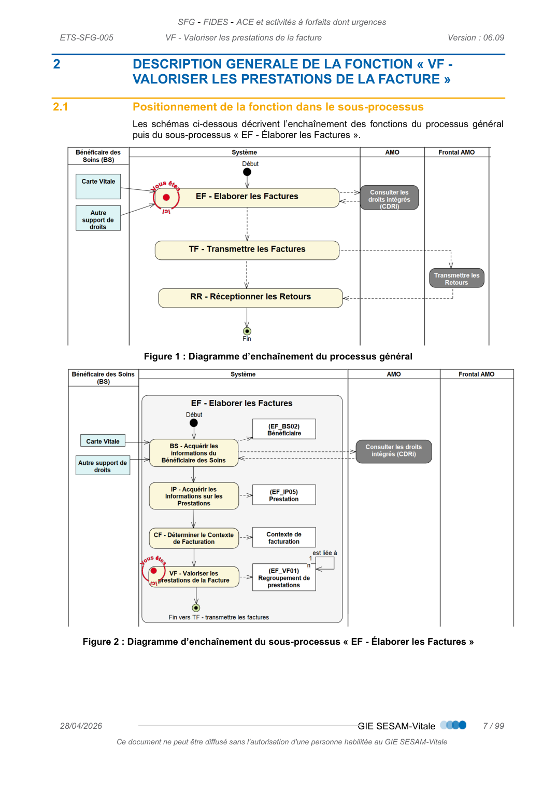
*Figure (p.207) : Figure 1 : Diagramme d’enchaînement du processus général*

<!-- p.208 -->
VF - Valoriser les prestations de la facture

### 2.2 Cadrage fonctionnel

Vue générale
Description Cette fonction a pour objectif de définir les règles permettant de valoriser les informations
relatives aux prestations de la facture.
Entrées Informations relatives aux Bénéficiaires des Soins
EF_BS
Informations relatives aux Contextes de Facturation
EF_CF
Informations relatives aux Prestations
EF_IP
Sorties Informations relatives à la valorisation du regroupement
EF_VF

<!-- p.209 -->
VF - Valoriser les prestations de la facture

### 2.3 Lien entre les objets métiers de la fonction

Le schéma ci-dessous décrit le lien entre les objets métiers manipulés dans la fonction
« VF - Valoriser les prestations de la Facture ».
Lien entre les
objets
Figure 3 Diagramme des objets métiers de la fonction « VF - Valoriser les
prestations de la Facture »

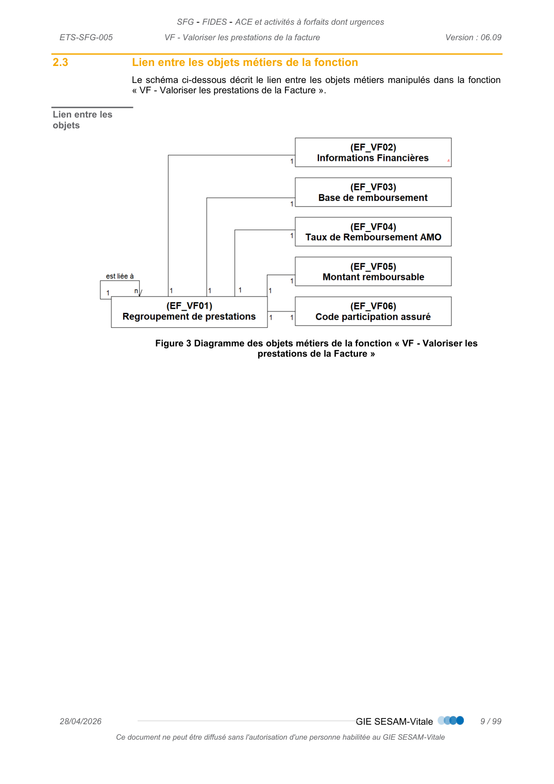
*Figure (p.209) : Figure 3 Diagramme des objets métiers de la fonction « VF - Valoriser les*

<!-- p.210 -->
VF - Valoriser les prestations de la facture

### 2.4 Enchaînement des sous-fonctions

Le schéma ci-dessous décrit l’enchaînement des sous-fonctions de la fonction « VF -
Valoriser les prestations de la Facture ».
Enchainement
des sous-
fonctions
Figure 4 : Diagramme d’enchaînement de la fonction « VF - Valoriser les prestations de la Facture »

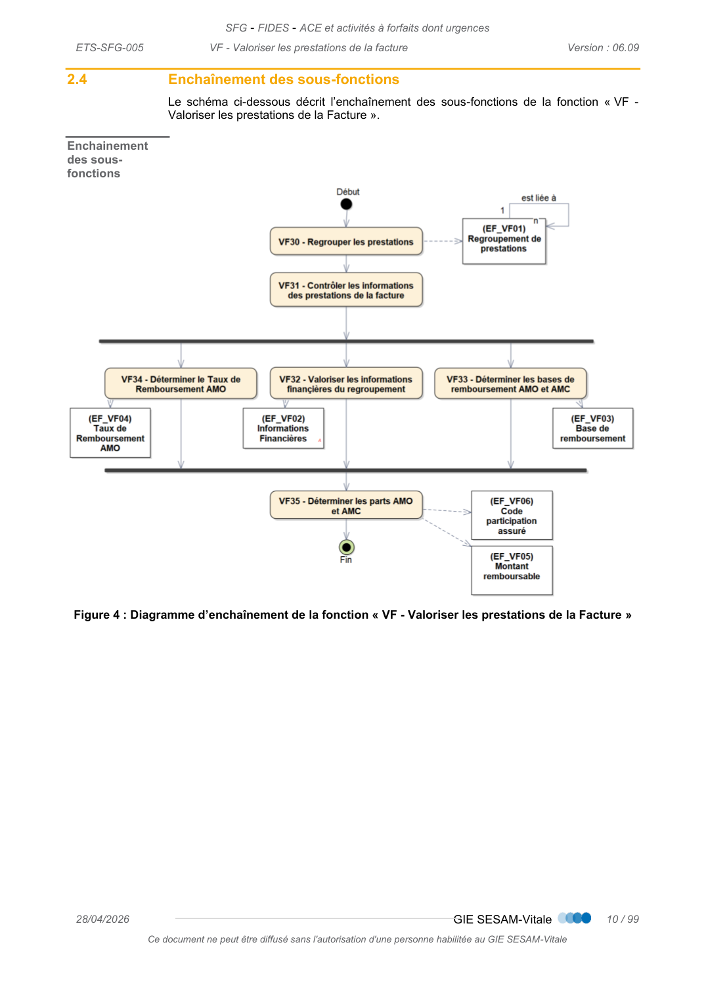
*Figure (p.210) : Figure 4 : Diagramme d’enchaînement de la fonction « VF - Valoriser les prestations de la Facture »*

<!-- p.211 -->
VF - Valoriser les prestations de la facture

## 3 DESCRIPTION DETAILLEE DE LA FONCTION « VF - VALORISER LES PRESTATIONS DE LA FACTURE »

### 3.1 VF30 - Regrouper les prestations

Vue générale
Description Cette sous-fonction a pour objectif de définir les règles de regroupement de prestations
relatives à la même facture.
Ce regroupement est directement en lien avec la norme de facturation B2 et avec les
principes de détermination de la base de remboursement, du montant remboursable
AMO et AMC.
Entrées Venue
EF_BS01
Professionnel de Santé (exécutant)
EF_IP03
Établissement (exécutant/exploitant)
EF_CF07
Prestation
EF_IP05
Prestation NGAP
EF_IP06
Prestation CCAM
EF_IP08
Prestation NABM
EF_IP11
Prestation Médicaments
EF_IP13
Complément de prestation
EF_CF05
 Prestation LPP
EF_IP12
 Prescription
EF_IP01
Sorties Regroupement de prestations
EF_VF01
Schéma des
opérations
Figure 5 : Diagramme d’enchaînement de la sous-fonction « VF30 – Regrouper les prestations »

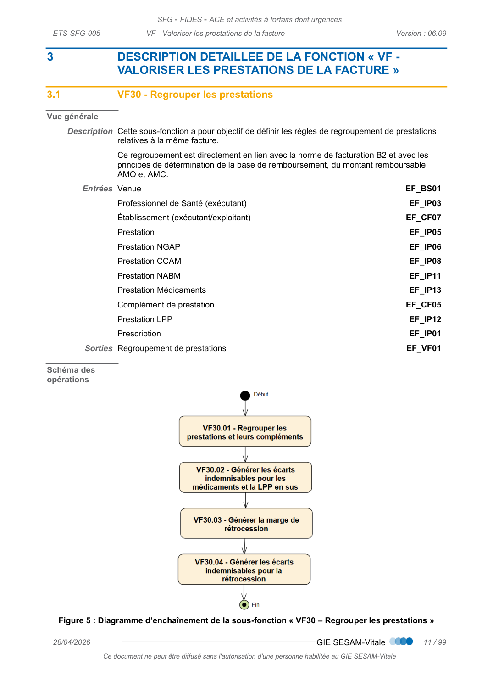
*Figure (p.211) : Schéma des*

<!-- p.212 -->
VF - Valoriser les prestations de la facture
3.1.1
VF30.01 - Regrouper les prestations et leurs compléments
Vue générale
Description Cette sous-fonction a pour objectif de définir les règles de regroupement de prestations
ainsi que les compléments de prestation relatifs à la même facture.
Ce regroupement est directement en lien avec la norme de facturation B2 et avec les
principes de détermination de la base de remboursement, du montant remboursable
AMO et, AMC ainsi que du Reste à Charge.
Entrées Venue
EF_BS01
Contexte du parcours de soins
EF_CF03
Contexte de la prestation
EF_CF04
Professionnel de Santé (exécutant)
EF_IP03
Établissement (exécutant/exploitant)
EF_CF07
Prestation
EF_IP05
Prestation NGAP
EF_IP06
Prestation CCAM
EF_IP08
Prestation NABM
EF_IP11
Prestation Médicament
EF_IP13
Compléments de prestation
EF_CF05
 PS prescripteur
EF_IP02
 Prestation LPP
EF_IP12
Sorties Regroupement de prestations
EF_VF01
Règles de
gestion
[RG_VF600] Sélectionner les prestations relatives à la facture
Les prestations à prendre en compte pour la facture sont les prestations en lien avec la
venue du Bénéficiaire des Soins.
 Une seule facture doit être réalisée par passage du patient (par « venue ») dans
un établissement géographique
Les dates d’exécution des prestations du regroupement (EF_IP05_01) doivent être au
moins supérieures (ou égales) à la date d’entrée (EF_BS01_02) et inférieures (ou égales)
à la date de sortie (EF_BS01_03).
 Du fait de cette règle la majorité des factures contiennent des prestations à la même date
d’exécution. Les factures pouvant contenir des actes à des dates d’exécution différentes
sont certaines activités à forfait et les actes réalisés en série.
La nature d’assurance (EF_CF04_01) et l’IPS - indicateur du parcours de soins
(EF_CF03_01) sont des critères de rupture de la facture, c’est à dire que les prestations
d’une même facture doivent avoir la même nature d’assurance et le même IPS.
Cette règle est liée à la structure de la norme B2.

<!-- p.213 -->
VF - Valoriser les prestations de la facture
 Cas particuliers
 [CP01] : Présence de Forfaits Urgence (ATU / FFM), Sécurité (SE), APE
En présence d’un forfait ATU/FFM/SE/APE seules les prestations liées au forfait doivent
figurer sur la facture. Les prestations non liées font l’objet d’une facture différente.
La notion de prestations liée est définie dans le document suivant :
 Cf. [DICO – Dictionnaire de données]
Une prestation liée doit porter la même date d’exécution que le forfait (le report est
autorisé).
Cas particulier de l’ATU/FFM sur 2 jours
Tous les actes doivent être positionnés sur une seule et même journée.
En cas de jour férié ou de dimanche sur l’un des 2 jours, la date à retenir est le dimanche
ou le jour férié pour permettre aux établissements de procéder à la facturation des
majorations idoines.
Il est possible, le cas échéant, de facturer des majorations nuit et férié dans la même
facture.
Par exemple, pour un passage aux urgence du samedi 22h au dimanche 10h, tous les
actes seront positionnés le dimanche avec :
 Une majoration nuit pour les actes réalisés le samedi à compter de 22h et le dimanche
à compter de 0h
 Une majoration férié pour les actes réalisés le dimanche matin
Exemples de factures :
Prestations
Date
Facture 1
ATU
01/05/2019 (ferié)
G_N
G_F
Facture 2
ATU
(dimanche)
G
MM
G_F
Facture 3
ATU
(dimanche)
ATM (modificateur nuit : S)
ATM (modificateur férié : F)
Facture 4
ATU
(dimanche)
G_N
ATM (modificateur férié : F)
 les modificateurs CCAM avec le top présence multiple à "N" en table CCAM TB10 (ex :
férié) ne peuvent pas être présents plus d'une fois dans la facture pour un même n°
exécutant et avec une même spécialité.
[CP02] : Actes CCAM réalisés en plusieurs séances

<!-- transcrit de p.213 (ex-figure) -->

**Exemples de factures :**

| Facture | Prestations | Date |
| --- | --- | --- |
| Facture 1 | ATU G_N G_F | 01/05/2019 (ferié) |
| Facture 2 | ATU G MM G_F | 05/05/2019 (dimanche) |
| Facture 3 | ATU ATM (modificateur nuit : S) ATM (modificateur férié : F) | 12/05/2019 (dimanche) |
| Facture 4 | ATU G_N ATM (modificateur férié : F) | 21/04/2019 (dimanche) |

<!-- p.214 -->
VF - Valoriser les prestations de la facture
Pour les actes CCAM nécessitant plusieurs séances étalées dans le temps il convient de
ne facturer une phase que lorsque sa période est terminée, en mentionnant toutes les
séances qu'elle a occasionnées.
[CP03] : Facture avec plusieurs PS exécutants et présences d’éléments non
cumulables
Pour les PS salariés en ACE et dans les cas suivants :
 Présence de majorations NGAP non cumulables par PS
 Présence de modificateurs CCAM non cumulables par PS
 Présence de plusieurs TMF de 24€ non cumulables par PS
Dans le contexte des ACE, c’est le numéro de l’établissement qui apparaît comme numéro
d’exécutant sur chaque acte réalisé, la règle de non cumul par PS s’applique donc à la
facture. Une solution consiste à émettre plusieurs factures (une par PS). Cependant il est
maintenant possible de ne faire qu’une seule facture.
Cependant, en présence de forfaits ATU/FFM/SE/APE : la solution consistant à émettre
plusieurs factures n’est pas applicable du fait de la propagation du taux du forfait sur les
actes (besoin d’avoir tous les actes associés au forfait sur la même facture).
[RG_VF601] Identifier les critères de regroupement de prestations
Le regroupement de prestations s’effectue selon les critères suivants :
 Le Code prestation
○ Correspond au Code Prestation (EF_IP05_04) pour les prestations de type
« Support »
○ Correspond au Code prestation (complément) (EF_CF05_01) pour les prestations
de type « Complément »
 La Date d’exécution de la prestation
(EF_IP05_01) ;
 L’exécutant
○ Professionnel de Santé (exécutant)
(EF_IP03) ;
ou
○ Établissement (Exécutant/exploitant)
(EF_CF07) ;
 Le PS prescripteur
(EF_IP02) ;
○ Lorsque la prise en charge de la prestation par l’AMO est soumise à prescription
 Le taux de financement
(EF_CF09_07).
[RG_VF606] Déterminer le regroupement de prestations (EF_VF01) des prestations médicaments
(EF_IP13)
Le regroupement de prestations médicaments se valorise avec les valeurs par défaut :
 Coefficient de la prestation regroupée
(EF_VF01_01) ;
○ Valorisé à « 1 ».
 Quantité de la prestation regroupée
(EF_VF01_02) ;
○ Valorisée à « 1 ».
 Dénombrement de la prestation regroupée
(EF_VF01_03).
○ Valorisé à « 1 ».

<!-- p.215 -->
VF - Valoriser les prestations de la facture
 Remarque : la norme B2 impose un nombre limité de prestations détaillées médicaments
codés (10 max) pour chaque regroupement. Si le nombre de prestations détaillées
médicaments est > 10, un second regroupement doit être effectué.
[RG_VF602] Déterminer le regroupement de prestations (EF_VF01) des prestations NGAP
(EF_IP06)
Les prestations NGAP peuvent être regroupées lorsque le Coefficient de la prestation
NGAP (EF_IP06_01) et le Code majoration de la prestation NGAP (EF_CF05_07) sont
identiques.
Le regroupement de prestations NGAP se valorise tel que :
 Coefficient de la prestation regroupée
(EF_VF01_01) ;
○ Valorisé avec le Coefficient de la prestation NGAP (EF_IP06_01).
 Quantité de la prestation regroupée
(EF_VF01_02) ;
○ Valorisée avec la somme des Quantité de la prestation NGAP (EF_IP06_02) de
chaque prestation NGAP.
 Dénombrement de la prestation regroupée
(EF_VF01_03).
○ Valorisé avec la somme des Dénombrement de la prestation NGAP (EF_IP06_03)
effectuées dans une même séance de soins.
 Exemple : regroupement par séance de soins infirmiers (AMI), avec 2 soins effectuées le
matin et 1 soin le soir.
Date
d’exécution
Code
prestation
Coefficient
Quantité
Dénombrement
Soins effectués
le matin
AMI
3,00
2
2
Soins effectués
le soir
AMI
3,00
1
1
 Remarque : le regroupement d’actes identiques effectués dans une même temporalité (ex.
les soins du matin sont dans une même temporalité, les soins du soir sont dans une autre
temporalité, d’où 2 séances) par un même Professionnel de Santé sur le même patient
correspond à une séance de soins.
[RG_VF603] Déterminer le regroupement de prestations (EF_VF01) des prestations CCAM
(EF_IP08)
Pour les prestations CCAM il n’existe qu’un seul code affiné pour un même code
regroupement, les données de regroupement sont renseignées avec des valeurs par
défaut :
 Coefficient de la prestation regroupée
(EF_VF01_01) ;
○ Valorisé à « 1 ».
 Quantité de la prestation regroupée
(EF_VF01_02) ;
○ Valorisée à « 1 ».
 Dénombrement de la prestation regroupée
(EF_VF01_03).
○ Valorisé à « 1 ».

<!-- transcrit de p.215 (ex-figure) -->

**Exemple : regroupement par séance de soins infirmiers (AMI), avec 2 soins effectués le matin et 1 soin le soir.**

| | Date d’exécution | Code prestation | Coefficient | Quantité | Dénombrement |
| --- | --- | --- | --- | --- | --- |
| Soins effectués le matin | 01/02/2015 | AMI | 3,00 | 2 | 2 |
| Soins effectués le soir | 01/02/2015 | AMI | 3,00 | 1 | 1 |

<!-- p.216 -->
VF - Valoriser les prestations de la facture
[RG_VF604] Déterminer le regroupement de prestations (EF_VF01) des prestations NABM
(EF_IP11)
Les prestations NABM sont regroupées (par ligne de prestation « B ») par séance (une
séance correspondant à l’ensemble des actes pour 1 prélèvement).
Plusieurs prélèvements (séances) peuvent être effectués dans la même journée, dans ce
cas autant de lignes de prestations « B » seront créées.
Le regroupement de prestations NABM se valorise tel que :
 Coefficient de la prestation regroupée
(EF_VF01_01) ;
○ En cas de regroupement de plusieurs Codes affinés d’actes de biologie
(EF_IP11_01) sous le même Code regroupement (EF_IP05_04), la valeur du
Coefficient de la prestation regroupée est égale à la somme des Coefficients de la
prestation NABM (EF_IP11_02) représentatifs des Codes affinés d’actes de
biologie (EF_IP11_01) de chaque prestation NABM.
 Quantité de la prestation regroupée
(EF_VF01_02) ;
○ Valorisée à « 1 ».
 Dénombrement de la prestation regroupée
(EF_VF01_03).
○ Pour les prestations NABM, la valeur du Dénombrement de la prestation regroupée
correspond au nombre de Codes affinés d’actes de biologie qui s’y rattachent.
 Remarque : la norme B2 impose un nombre limité de prestations détaillées NABM codés
(50 max) pour chaque regroupement (code prestation B). Si le nombre de prestations
détaillées NABM est > 50, un second regroupement doit être effectué.
 Cas particuliers
[CP01] : Plusieurs analyses identiques dans la même journée
Certaines analyses (pour un même prélèvement) peuvent être répétées plusieurs fois au
cours d’une même journée et font alors l’objet d’une même facture.
Dans ce cas, à l’inverse de la consigne de regroupement spécifiée ci-dessus, chaque
exécution d’analyse donne lieu à une prestation spécifique, comme présenté dans
l’exemple ci-dessous :
N° d'ordre d'analyse
dans la journée
(EF_IP11_03)
Code
prestation
Quantité
Coefficient
Dénombrement
Code affiné
1ère analyse de la
journée
B
1
n
2
XXXXXX
YYYYYY
2ème analyse de la
journée
B
1
n
2
XXXXXX
YYYYYY
[RG_VF605] Déterminer le regroupement de prestations (EF_VF01) des prestations LPP
(EF_IP12)
Le regroupement de prestations LPP se valorise tel que :
 Coefficient de la prestation regroupée
(EF_VF01_01) ;
○ Valorisé à « 1 ».
 Quantité de la prestation regroupée
(EF_VF01_02) ;
○ Valorisée à « 1 ».
 Dénombrement de la prestation regroupée
(EF_VF01_03) ;

<!-- transcrit de p.216 (ex-figure) -->

**[CP01] : Plusieurs analyses identiques dans la même journée** — exemple de prestations :

| N° d'ordre d'analyse dans la journée (EF_IP11_03) | Code prestation | Quantité | Coefficient | Dénombrement | Code affiné |
| --- | --- | --- | --- | --- | --- |
| 1ère analyse de la journée | B | 1 | n | 2 | XXXXXX YYYYYY |
| 2ème analyse de la journée | B | 1 | n | 2 | XXXXXX YYYYYY |

<!-- p.217 -->
VF - Valoriser les prestations de la facture
○ La valeur du Dénombrement de la prestation regroupée correspond au nombre de
prestations LPP (EF_IP12) qui s’y rattachent.
 Remarque : la norme B2 impose un nombre limité de prestations LPP (10 max) pour
chaque regroupement (code prestation PII ou PME). Si le nombre de prestations détaillées
LPP est > 10, un second regroupement doit être effectué.
[RG_VF607] Déterminer le regroupement de prestations (EF_VF01) des compléments de
prestation (EF_CF05)
Le regroupement des compléments de prestation de type majoration et forfait se valorise
avec les valeurs par défaut :
 Coefficient du complément regroupé
(EF_VF01_01) ;
○ Valorisé à « 1 ».
 Quantité du complément regroupé
(EF_VF01_02).
○ Valorisée avec le nombre de compléments de prestations concernées par le
regroupement.
 Dénombrement de la prestation regroupée
(EF_VF01_03).
○ Valorisé à « 1 ».
 Cas particuliers
[CP01] : Facturation de deux Forfaits techniques d’imagerie (scanographie)
Dans le cas d’une facturation de deux forfaits techniques de scanographie (association de
deux actes de scanographie ou pour une procédure contenant plusieurs examens de
scanographie), le deuxième Forfait technique est minoré de 85%.
 Les forfaits techniques de scanographie sont identifiés avec le type d’appareillage
(EF_CF06_03) = « SCAN ».
De ce fait, le coefficient (EF_VF01_01) pour le deuxième forfait est égal à 0.15 et il n’est
donc pas possible d’effectuer un regroupement.
 [CP02] : Facturation de deux Forfaits sécurité
Lorsque l'état de santé du patient conduit à la réalisation de deux ou plusieurs actes inscrits
sur des listes différentes de l'annexe 11 de l’arrêté1 prestations, il est possible de facturer
deux forfaits SE et dans ce cas, le forfait le moins élevé doit être minoré de 50%. De ce
fait, le coefficient (EF_VF01_01) pour le deuxième forfait (le forfait le moins élevé) est égal
à 0.50 et il n’est donc pas possible d’effectuer un regroupement.
1 Arrêté du 18 février 2013 modifiant l'arrêté du 19 février 2009

<!-- p.218 -->
VF - Valoriser les prestations de la facture
3.1.2
VF30.02 - Générer les écarts indemnisables pour les médicaments et la LPP
en sus
Vue générale
Description Cette sous-fonction a pour objectif de définir les règles de génération des écarts
d’indemnisables.
 En B2, les écarts indemnisables doivent obligatoirement suivre la prestation à
laquelle ils se rattachent.
Entrées Prestation
EF_IP05
Prestation Médicaments
EF_IP13
Sorties Regroupement de prestation
EF_VF01
 Compléments de prestation
EF_CF05
Les écarts indemnisables sont facturés dans la situation suivante : lorsque le prix d'achat
par l'établissement de santé est inférieur au tarif de responsabilité, l’écart indemnisable
associé au médicament à facturer par l’établissement est égal au taux d’intéressement
(actuellement 50%) multiplié par la différence entre le tarif de responsabilité du médicament
et son prix d’achat.
Règles de
gestion
GENERATION DES
« ECART MEDICAMENT INDEMNISABLE (EMI) »
[RG_VF616] Déterminer les regroupements de prestation faisant l’objet d’une facturation d’un
« Écart Médicament Indemnisable »
Le dispositif permettant de rémunérer un établissement qui délivre des médicaments à un
tarif inférieur à celui indiqué dans les bases de l’Assurance Maladie, ne s’applique qu’aux
médicaments codés en UCD.
Les médicaments de la liste en sus codés en UCD sont identifiés de la façon suivante :
 La catégorie de la Prestation (EF_IP05_07) est valorisée à « Médicaments »
 La sous-catégorie (EF_IP05_07) est valorisée à « liste en sus »
 Le Top codage affiné (EF_IP05_10) est valorisé à « Oui ».
La génération d’un écart indemnisable (EMI) n’est possible que
 si le médicament codé en UCD possède un tarif de responsabilité à la date de
délivrance,
 et pour au moins une des prestations regroupées (EF_IP13), le Prix d’achat négocié
TTC (EF_IP13_05) est inférieur au Tarif de responsabilité TTC (EF_IP13_11).
[RG_VF617] Générer l’écart indemnisable pour la prestation regroupée de Pharmacie
La génération de l’écart indemnisable EMI se matérialise par la création d’un complément
de prestation (EF_CF05) ainsi que son regroupement2 (EF_VF01) :
 Code prestation (complément)
(EF_CF05_01) ;
○ Valorisé à « EMI »
2 Le regroupement, dans le cas présent, ne contient qu’une seule prestation

<!-- p.219 -->
VF - Valoriser les prestations de la facture
 Niveau
(EF_CF05_02) ;
○ Valorisé à « Complément »
 Catégorie
(EF_CF05_03) ;
○ Valorisée à « Majoration »
 Sous-catégorie
 (EF_CF05_04) ;
○ Valorisée à « Écart Médicament Indemnisable »
 Nomenclature
(EF_CF05_05) ;
○ Non valorisée
 Coefficient du complément regroupé
(EF_VF01_01) ;
○ Valorisé à « 1 »
 Quantité du complément regroupé
(EF_VF01_02).
○ Valorisée à « 1 »
 Dénombrement du complément regroupé
(EF_VF01_03).
○ Valorisé à « 1 »
GENERATION DES
 « ECART TIPS INDEMNISABLE (ETI) »
[RG_VF612] Déterminer les regroupements de prestation faisant l’objet d’une facturation d’un «
Ecart TIPS Indemnisable »
Le dispositif permettant de rémunérer un établissement qui délivre des Produits et
prestations de la LPP à un tarif inférieur à celui indiqué dans les bases de l’Assurance
Maladie, ne s’applique qu’aux Produits et prestations de la LPP de la liste en sus.
Les Produits et prestations de la LPP sont identifiés de la façon suivante :
 La catégorie de la Prestation (EF_IP05_06) est valorisée à « Produits et Prestations
de la LPP »
 La sous-catégorie (EF_IP05_07) est valorisée à « LPP en sus »
 Le Top codage affiné (EF_IP05_10) est valorisé à « Oui ».
La génération d’un écart indemnisable (ETI) n’est possible que
 si le produit de la LPP possède un tarif de responsabilité à la date de délivrance,
 et pour au moins une des prestations regroupées (EF_IP12), le Prix d’achat négocié
TTC (EF_IP12_06) est inférieur au Tarif de responsabilité TTC (EF_IP12_03).

<!-- p.219 -->
VF - Valoriser les prestations de la facture
[RG_VF613] Générer la prestation pour l’écart indemnisable de la prestation regroupée de LPP
La génération de l’écart indemnisable ETI se matérialise par la création d’un complément
de prestation (EF_CF05) ainsi que son regroupement2 (EF_VF01) :
 Code prestation (complément)
(EF_CF05_01) ;
○ Valorisé à « ETI »
 Niveau
(EF_CF05_02) ;
○ Valorisé à « Complément »
 Catégorie
(EF_CF05_03) ;
○ Valorisée à « Majoration »
 Sous-catégorie
 (EF_CF05_04) ;
○ Valorisée à « Ecart indemnisable LPP »
 Nomenclature
(EF_CF05_05) ;
○ Non valorisée
 Coefficient du complément regroupé
(EF_VF01_01) ;
○ Valorisé à « 1 »
 Quantité du complément regroupé
(EF_VF01_02).
○ Valorisée à « 1 »
 Dénombrement du complément regroupé
(EF_VF01_03).
○ Valorisé à « 1 »

<!-- p.220 -->
VF - Valoriser les prestations de la facture
3.1.3
VF30.03 - Générer la marge de rétrocession
Vue générale
Description Cette sous-fonction a pour objectif de définir les règles de génération de la marge de
rétrocession. Cette prestation n’est générée que pour les médicaments rétrocédés non
codés UCD, hors nutriments.
Pour les autres cas (médicaments rétrocédés codés UCD et nutriments), la marge est
intégrée au montant total de la dépense du médicament.
 En B2, la Marge de rétrocession (MAR) doit obligatoirement suivre la ou les prestations
à laquelle elle se rattache.
Entrées Prestation
EF_IP05
Sorties Regroupement de prestation
EF_VF01
 Compléments de prestation
EF_CF05
Règles de
gestion
GENERATION DE LA
 « MARGE DE RETROCESSION (MAR) »
[RG_VF614] Déterminer les regroupements de prestations faisant l’objet de la facturation d’une
« Marge de rétrocession (MAR) »
Une marge de rétrocession est facturée via une prestation supplémentaire pour tous les
médicaments rétrocédés non codés, excepté les nutriments (code NUT).
Les médicaments rétrocédés non codés selon la nomenclature UCD sont identifiés de la
façon suivante :
 La sous-catégorie de la prestation (EF_IP05_07) est valorisée à « Rétrocession »,
 Le Top codage affiné (EF_IP05_10) est valorisé à « Non ».
[RG_VF615] Générer la prestation « marge de rétrocession (MAR) »
La génération de la prestation « marge de rétrocession » se matérialise par la création d’un
complément de prestation (EF_CF05) ainsi que son regroupement3 (EF_VF01) :
3 Le regroupement, dans le cas présent, ne contient qu’une seule prestation

<!-- p.222 -->
VF - Valoriser les prestations de la facture
<!-- transcrit de p.221 (ex-figure) -->

| Champ | | Valeurs possibles dans ce contexte |
| --- | --- | --- |
| EF_CF05_01 | Code Prestation | « MAR » |
| EF_CF05_02 | Niveau | « Complément » |
| EF_CF05_03 | Catégorie | « Majoration » |
| EF_CF05_04 | Sous-catégorie | « Marge Forfaitaire » |
| EF_CF05_05 | Nomenclature | Non renseignée |
| EF_IP13_01 | Code UCD | Non renseigné |
| EF_IP13_02 | Coefficient de fractionnement | Non renseigné |
| EF_IP13_03 | Coût TTC lié à la reconstitution du médicament (uniquement pour la rétrocession) | 0 |
| EF_IP13_04 | Montant de la marge TTC (uniquement pour la rétrocession) | 0 |
| EF_IP13_05 | Prix d’achat négocié TTC | Non renseigné |
| EF_IP13_06 | Quantité | 1 |
| EF_IP13_07 | Montant total facturé TTC | Montant forfaitaire de la marge A compter du 01/01/2018, certains médicaments peuvent avoir une marge différente de 22 € (0€ dans certains cas ou tout autre valeur). |
| EF_IP13_08 | Montant unitaire de l’écart indemnisable | 0 |
| EF_IP13_09 | Montant total de l’écart indemnisable | 0 |
| EF_IP13_10 | Mode délivrance | « Rétrocession » |
| EF_IP13_11 | Tarif de responsabilité TTC | Non renseigné |
| EF_VF01_01 | Coefficient du complément regroupé | « 1 » |
| EF_VF01_02 | Quantité du complément regroupé | « 1 » |
| EF_VF01_03 | Dénombrement du complément regroupé | « 1 » |
| EF_VF04_02 | Taux de remboursement | 100% |
| EF_VF03_02 | Base de remboursement AMO (BR AMO) | Montant forfaitaire de la marge |
| EF_VF05_03 | Montant remboursable AMO (MRO) | Montant forfaitaire de la marge |
| EF_VF02_03 | Montant des honoraires | Montant forfaitaire de la marge |

<!-- p.222 -->
VF - Valoriser les prestations de la facture
3.1.4
VF30.04 - Générer les écarts indemnisables pour la rétrocession
Vue générale
Description Cette sous-fonction a pour objectif de définir les règles de génération des écarts
d’indemnisables sur un regroupement de prestations « Rétrocession » (ERI)
Les écarts indemnisables sont facturés dans la situation suivante :
 lorsque le prix d'achat (du médicament ou du dispositif LPP) par l'Etablissement
de Santé est inférieur au tarif de responsabilité, le remboursement à
l'établissement s'effectue sur la base du montant de la facture (prix d’achat)
majoré d’un pourcentage (ou taux d’intéressement - 50% à ce jour) de la
différence entre le prix d'achat et le tarif de responsabilité.
 Pour RAPPEL : En B2, les écarts indemnisables (ERI) doivent obligatoirement suivre
la prestation à laquelle ils se rattachent.
Entrées Prestation
EF_IP05
Prestation Médicaments
EF_IP13
Sorties Regroupement de prestation
EF_VF01
 Compléments de prestation
EF_CF05
Règles de
gestion
GENERATION DES
« ECART RETROCESSION INDEMNISABLE (ERI) »
[RG_VF610] Déterminer les regroupements de prestations faisant l’objet d’une facturation d’un «
Ecart Rétrocession Indemnisable »
Le dispositif permettant de rémunérer un établissement qui délivre des médicaments à un
tarif inférieur à celui indiqué dans les bases de l’Assurance Maladie, ne s’applique qu’aux
médicaments codés en UCD.
Les médicaments rétrocédés codés en UCD sont identifiés de la façon suivante :
 La catégorie de la Prestation (EF_IP05_06) est valorisée à « Médicaments » et le
mode de délivrance (EF_IP13_10) est « rétrocession »
 Le Top codage affiné (EF_IP05_10) est valorisé à « Oui ».
La génération d’un écart indemnisable n’est possible que :
 si le médicament rétrocédé possède un Tarif de responsabilité (EF_IP13_11) à la date
de délivrance,
 et pour au moins une des prestations regroupées (EF_IP13), le Prix d’achat négocié
TTC (EF_IP13_05) est inférieur au Tarif de responsabilité TTC (EF_IP13_11).

<!-- p.223 -->
VF - Valoriser les prestations de la facture
[RG_VF611] Générer la prestation pour l’écart indemnisable de la prestation regroupée de
rétrocession
La génération de l’écart indemnisable ERI se matérialise par la création d’un complément
de prestation (EF_CF05) ainsi que son regroupement4 (EF_VF01) :
 Code prestation (complément)
(EF_CF05_01) ;
○ Valorisé à « ERI »
 Niveau
(EF_CF05_02) ;
○ Valorisé à « Complément »
 Catégorie
(EF_CF05_03) ;
○ Valorisée à « Majoration »
 Sous-catégorie
 (EF_CF05_04) ;
○ Valorisée à « Ecart indemnisable Rétrocession »
 Nomenclature
(EF_CF05_05) ;
○ Non valorisée
 Coefficient du complément regroupé
(EF_VF01_01) ;
○ Valorisé à « 1 »
 Quantité du complément regroupé
(EF_VF01_02).
○ Valorisée à « 1 »
 Dénombrement du complément regroupé
(EF_VF01_03).
○ Valorisé à « 1 »
4 Le regroupement, dans le cas présent, ne contient qu’une seule prestation

<!-- p.224 -->
VF - Valoriser les prestations de la facture

### 3.2 VF31 - Contrôler les informations des prestations de la facture

Vue générale
Description Cette sous-fonction a pour objectif de définir les règles permettant de contrôler les
informations relatives aux prestations de la facture.
Entrées Prestation
EF_IP05
Prestation CCAM
EF_IP08
CCAM-Modificateur
EF_IP09
Prestation NABM
EF_IP11
Complément de prestation
EF_CF05
Regroupement de prestations
EF_VF01
Sorties Aucune
Règles de
gestion
[RG_VF620] Contrôler la cohabitation des prestations sur une même facture
Pour une même Venue (EF_BS01), et sauf urgences non gynécologiques :
 Les forfaits sont cumulables entre eux suivant le tableau ci-après :
ATU
FFM
SE1
SE2
SE3
SE4
SE5
SE6
SE7
APE
FUx
ATU
FFM
SE1
SE2

SE3


SE4



SE5




SE6






SE7






APE






FUx
Pas de cumul possible

Cumul possible au cours d'une même séquence
 Une prestation de rétrocession hospitalière ne peut être facturée avec une autre
prestation ;
 Le forfait FSD ne peut pas se cumuler avec les forfaits ATU / FFM / SE (selon
Dispositions générales et diverses de la CCAM et article R 162-33 -1 du CSS).
 Les actes CCAM ne sont pas cumulables avec des actes NGAP (hors forfaits) sur la
même facture, pour le même Professionnel de Santé.

<!-- transcrit de p.225 (ex-figure) -->

**[RG_VF620] Cumulabilité des forfaits entre eux** (✗ = pas de cumul possible ; ✓ = cumul possible au cours d'une même séquence ; — = identité) :

| | ATU | FFM | SE1 | SE2 | SE3 | SE4 | SE5 | SE6 | SE7 | APE | FUx |
| --- | --- | --- | --- | --- | --- | --- | --- | --- | --- | --- | --- |
| ATU | — | | | | | | | | | | |
| FFM | ✗ | — | | | | | | | | | |
| SE1 | ✗ | ✗ | — | | | | | | | | |
| SE2 | ✗ | ✗ | ✓ | — | | | | | | | |
| SE3 | ✗ | ✗ | ✓ | ✓ | — | | | | | | |
| SE4 | ✗ | ✗ | ✓ | ✓ | ✓ | — | | | | | |
| SE5 | ✗ | ✗ | ✓ | ✓ | ✓ | ✓ | — | | | | |
| SE6 | ✗ | ✗ | ✓ | ✓ | ✓ | ✓ | ✓ | — | | | |
| SE7 | ✗ | ✗ | ✓ | ✓ | ✓ | ✓ | ✓ | ✓ | — | | |
| APE | ✗ | ✗ | ✗ | ✗ | ✗ | ✗ | ✗ | ✗ | ✗ | — | |
| FUx | ✗ | ✗ | ✗ | ✗ | ✗ | ✗ | ✗ | ✗ | ✗ | ✗ | — |

<!-- p.225 -->
VF - Valoriser les prestations de la facture
 Cas particuliers
 [CP01] : Présence d’un forfait et d’un acte CCAM
La règle de non-cumul CCAM/NGAP ne s’applique pas dans le cas :
 d’une prestation de Catégorie (EF_IP05_06) = « Forfait »
 d’une prestation de Sous-Catégorie (EF_IP05_07) = « Forfait C2S»
 Cf. [TABLES] Table 1 : Codes prestation
[CP02] : Cas de cumul d’un acte technique et d’une consultation pour le même
Professionnel de Santé
Les dérogations possibles au non cumul d’actes CCAM avec une consultation NGAP pour
le même PS sont citées dans le Livre III, article III-3-A, de la liste des actes et prestations.
Dans ces situations d’exception, la consultation est facturée à taux plein et l'acte technique
à 50% de sa valeur, sans indication de code association non prévue sur l’acte technique.
Exception
À compter du 1er juillet 2017, les médecins pourront cumuler le frottis à taux plein et une
consultation à la faveur d'une décision parue au « Journal Officiel ».
 les consultations complexes et très complexes suivent les mêmes règles que les
consultations classiques.
 [CP03] : Avis ponctuel de consultant dans le cadre du parcours de soins
Les honoraires des avis des consultants ne se cumulent pas avec ceux d’autres actes
effectués dans le même temps (par un autre Professionnel de Santé).
Les dérogations possibles sont citées dans le Livre III article III-41 (Article 18b) de la liste
des actes et prestations.
Dans ces situations d’exception, la consultation est facturée à taux plein et l'acte technique
à 50% de sa valeur, sans indication de code association non prévue sur l’acte technique.
 cette règle reste valable avec les nouveaux codes prestations pour les avis de consultant
(introduits avec la convention 2016) : APC, APY, APU
[CP04] : Non cumul des consultations complexes ou très complexes
Les consultations complexes ou très complexes (Catégorie = « Réservé PS ») ne sont pas
cumulables entre elles.
 [CP05] : Non cumul des avis de consultant et des forfaits ATU, FFM, SEx, APE
Les consultations pour avis de consultant (APC, APY, APU) ne sont pas cumulables avec
les forfaits ATU, FFM, SEx, APE.
[CP06] : Non cumul des consultations complexes ou très complexes et forfaits ATU,
FFM, SEx, APE
Les consultations complexes ou très complexes (Catégorie = « Réservé PS ») ne sont pas
cumulables avec les forfaits ATU, FFM, SEx, APE, le cas échéant.
[CP07] : Forfaits Fausse Couche Établissement
Aucune consultation, ou acte ne peut être facturé en sus des Forfaits fausse couche
établissements (FEF, FFE),
Sauf en cas de prise en charge lors d’un passage aux urgences
Le forfait ATU peut être facturé en sus des forfaits FEF ou FFE.

<!-- p.225 -->
VF - Valoriser les prestations de la facture
[CP08] : Facturation de l’Avastin
Il est possible de cumuler le forfait SE2 et APE dans le cas de l’administration de
Bevacizumab (Avastin) dans le traitement de la dégénérescence maculaire liée à l’âge néo
vasculaire (DMLA) au titre de sa recommandation temporaire d’utilisation (RTU).
 Facturation de l’AVASTIN :
○ BGLB001 (Acte CCAM d’injection dans le corps vitré)
○ SE2
○ APE
○ PH8 : UCD du produit (BEVACIZUMAB)
[RG_VF627] Contrôler la cohabitation des prestations sur une même facture en contexte
d’urgence non gynécologiques
Les forfaits activité urgence et compléments (FUx, SUM, SUx, SIM, SIC, SUB, SB2, SB3,
SAS, SSN, SSF, SUN, SUF, PE1, PE2) ne sont compatibles avec aucun autre type d’acte
ou forfait, hormis le forfait patient urgences (FPV, FPM, FPU, FPX, FPL, CFU).
Les actes ayant conduit à la facturation de ces forfaits ne doivent pas figurer dans la
facture.
CONTRÔLES DES ACTES CCAM
[RG_VF_RC15] Contrôler les Codes actes CCAM (EF_IP08_01) appartenant à une même procédure
Des actes appartenant à une même procédure ne peuvent pas être associés entre eux.
 Une procédure est un regroupement usuel d’actes isolés (ex: amygdalectomie, par
dissection avec adénoïdectomie)
 Cas particuliers
[CP01] : Organes multiples
Exception à la règle : les actes CCAM appartenant à la catégorie médicale « organes
multiples » peuvent appartenir à la même association d’actes. Dans ce cas, il s’agit d’une
association non prévue. Pour un acte/activité donné, la catégorie médicale à laquelle il
appartient constitue le champ n°12 de la base CCAM.
[RG_VF_CC2] Contrôler la cohérence des codes CCAM-Modificateur (EF_IP09) entre les
intervenants
Certains modificateurs doivent être utilisés de manière cohérente pour un acte CCAM dans
une même facture. Par exemple, en présence d’un acte CCAM réalisé par plusieurs
intervenants à une même Date d’exécution de la prestation (EF_IP05_01), lorsque le Code
acte CCAM (EF_IP08_01) est le même mais que le Code activité CCAM (EF_IP08_02) est
différent, alors certains codes modificateurs doivent être identiques sur toutes les lignes
d'actes.
Tout modificateur devant respecter cette règle est présent en table TB10 avec le "top
contrôle cohérence " valorisé à "O" à la date d’exécution (EF_IP05_01).
[RG_VF_RC17] Contrôler la compatibilité médicale entre Codes actes CCAM (EF_IP08_01)
Il ne doit pas exister dans une même facture, à une même Date d'exécution de la prestation
(EF_IP05_01), des Codes actes CCAM (EF_IP08_01) ayant des incompatibilités
médicales.
La liste des actes incompatibles avec un acte donné constitue le champ n° 14 de la base
CCAM.

<!-- p.226 -->
VF - Valoriser les prestations de la facture
[RG_VF_CC3] Contrôler la facturation des actes complémentaires CCAM
Les différents types d’actes CCAM sont valorisés à :
 « 0 » pour les actes isolés ;
 « 1 » pour les procédures ;
 « 2 » pour les actes complémentaires.
Un acte complémentaire CCAM ne peut être facturé isolément, il est obligatoirement
accompagné dans la même facture d'un acte isolé ou d'un acte de type procédure facturé
à la même Date d'exécution (EF_IP05_01).
À noter que le type d'un acte CCAM est contenu dans le champ n°9 de la base CCAM.
CONTRÔLES DES ACTES DE BIOLOGIE
[RG_VF621] Contrôler le nombre maximum d’actes pour un même Code affiné de prestation
biologie (EF_IP11_01)
La nomenclature NABM donne le nombre maximum d’actes autorisés pour un même code
affiné.
L’acte à traiter ne doit pas être limité en nombre ou le nombre d’actes doit être inférieur ou
égal au nombre maximum autorisé.
Cette règle est à contrôler à la date d’exécution de la prestation (EF_IP05_01).
[RG_VF622] Contrôler la présence d’actes incompatibles au regard des Codes affinés prestation
biologie (EF_IP11_01)
L’incompatibilité d’un code affiné avec un autre est donnée dans la nomenclature NABM.
Il ne doit pas y avoir d’incompatibilité entre les codes affinés présents sur la facture.
Cette règle est à contrôler à la date d’exécution de la prestation (EF_IP05_01).
[RG_VF623] Contrôler le Coefficient de la prestation regroupée (EF_VF01_01) en fonction des
Coefficients de la prestation NABM (EF_IP11_02)
Le coefficient de la prestation regroupée (EF_VF01_01) doit être égal à la somme des
Coefficients de chaque Prestation NABM (EF_IP11_02).
Les actes de biologie doivent être regroupés selon la règle [RG_VF604]. Si le cumul des
coefficients est < à la cotation minimale, alors le système de facturation doit ajouter une
prestation complémentaire permettant d’atteindre ce minimum, selon la règle [RG_VF624].
[RG_VF624] Contrôler la justification du complément à la cotation minimale liée aux actes
sanguins
Il existe une valeur minimale de coefficient au sein d’une séance en dessous de laquelle il
est possible de facturer un complément à la cotation.
La valeur, à la date d’exécution (EF_IP05_01), de la cotation minimale est donnée en table
20.
 Cf. [TABLES] - Table 103 : Valeur de la cotation minimale en analyse Biologique
Si aucun complément à la cotation minimale n’a été facturé, ce contrôle n’est pas effectué.
S’il existe au moins un complément à la cotation minimale sur la facture (codes affinés
9905 /…/ 9926), il faut contrôler si sa présence et son coefficient sont justifiés pour chacune
des Prestations NABM du Regroupement de prestations (EF_VF01) c’est à dire pour
chaque séance.
Pour réaliser ce contrôle, il faut vérifier dans un premier temps la présence d’au moins un
examen sanguin (la nomenclature NABM porte l’information « Sanguin ») et le cas
échéant :

<!-- p.227 -->
VF - Valoriser les prestations de la facture
1. Effectuer le cumul des Coefficients de la prestation NABM (EF_IP11_02) de
l’ensemble des Codes affinés prestations biologie (EF_IP11_01) présents sur la
facture. Ce cumul s’effectue sur les actes d’analyse médicale (c'est-à-dire sans les
suppléments codés affinés de la NABM),
2. Comparer ce cumul à la valeur de la cotation minimale,
3. Si ce cumul additionné au coefficient du complément à la cotation minimale est
supérieur ou égal à la cotation minimale, alors le complément est justifié.
Cette règle est à effet de la date d’exécution de la prestation (EF_IP05_01).
[RG_VF625] Contrôler le respect des règles spécifiques en matière de codes affinés de biologie
Si une “ règle spécifique ” est associée à cet acte, il faut vérifier si elle est respectée.
La règle spécifique est un numéro auquel correspond une quantité maximale de codes
régis par cette même règle, qui peuvent être simultanément présents sur une même
facture, pour la même séance.
Cette règle est précisée dans la nomenclature NABM pour les actes concernés.
Actuellement, les deux règles suivantes sont définies :
 La règle 3 de la NABM n’autorise que 3 actes maximum parmi une liste d’actes
possibles. Pour les marqueurs de l'hépatite B, la NABM n'autorise que 3 actes parmi
la liste suivante : 0322, 0323, 0353, 0354, 0351 et 0352.
 La règle 4 n'autorise que 2 actes maximum parmi une liste d'actes. Pour les actes
0321, 0324, 1805, 1806, 1807, 1808, 1809, 1810, 1811, 1812, 1813, 1814, 1815,
1816, 1817, 1818, 1819 deux cotations au maximum peuvent être appliquées.
CONTROLES DES COMPLEMENTS DE PRESTATION
[RG_VF626] Contrôler l’association obligatoire du Code prestation de niveau « complément »
(EF_CF05_01) avec le Code prestation de niveau « support » (EF_IP05_05)
 Les compléments de prestations ne peuvent être facturés seuls. Ils accompagnent
nécessairement un code prestation de niveau « support » facturé à la même date
d’exécution.
Condition : le niveau de la prestation (EF_CF05_02) a pour valeur « complément ».
La prestation est toujours liée à une prestation dont la date d’exécution est identique et
dont le niveau (EF_IP05_02) vaut « support » (EF_IP05)
Cette prestation complément doit être associée à une prestation support selon les
compatibilités autorisées à la date d’exécution par la table suivante :
La table suivante liste les associations obligatoires entre un complément de prestation et
l’acte support :
 Cf. [TABLES], Table 12 : Codes Prestation obligatoirement associés
 Cas particuliers
[CP01] : Vérification spécifique à certains forfaits
Certains forfaits doivent répondre à des associations plus précises que celle d’un code
prestation. Ces vérifications peuvent avoir lieu à la place ou en plus de combinatoires
présentes en table 12. Les vérifications demandées sont les suivantes :

<!-- p.228 -->
VF - Valoriser les prestations de la facture
Si le forfait
vaut
Alors le logiciel doit vérifier la présence de :
ATU
Au moins un acte quelle que soit la nomenclature
FDA
Au moins un acte CCAM de code regroupement dentaire
FDC
Au moins un acte CCAM de code regroupement dentaire
FDR
Au moins un acte CCAM de code regroupement dentaire
FFM
Actes inscrits sur l’annexe 10 de l’arrêté de prestations et actes
délivrés hors anesthésie.
FPC
Au moins un acte CCAM de code regroupement dentaire
FSD
Acte ouvrant droit au FSD listé dans le livre II de la liste des actes et
prestations adoptée par décision de l'UNCAM du 20 décembre 2011.
Les actes CCAM ouvrant droit au forfait FSD sont identifiés avec le
champ 34 = « 5 ».
SE1
Actes d’endoscopie sans anesthésie générale ou locorégional inscrits
sur la liste 1 de l’annexe 11 de l’arrêté de prestations, nécessitant le
recours à un secteur opératoire
SE2
Actes sans anesthésie générale ou locorégional inscrit sur la liste 2 de
l’annexe 11 de l’arrêté de prestations, nécessitant le recours à un
secteur opératoire.
SE3
Actes inscrits sur la liste 3 de l’annexe 11 de l’arrêté de prestations,
nécessitant une mise en observation du patient dans un
environnement hospitalier.
SE4
Actes inscrits sur la liste 4 de l’annexe 11 de l’arrêté de prestations,
nécessitant une mise en observation du patient dans un
environnement hospitalier.
SE5
Actes inscrits sur la liste 5 de l’annexe 11 de l’arrêté de prestations
SE6
Actes inscrits sur la liste 6 de l’annexe 11 de l’arrêté de prestations
SE7
Actes inscrits sur la liste 7 de l’annexe 11 de l’arrêté prestations
VDE
Actes inscrits dans l’annexe 4 des dispositions générales et diverses
de la CCAM
FR2
Au moins un acte CCAM de code regroupement imagerie
 Voir cas particulier CP03 ci-dessous
FR3
Au moins un acte CCAM de code regroupement imagerie
 Voir cas particulier CP03 ci-dessous
FTG
Au moins un acte CCAM de code regroupement imagerie
 Voir cas particulier CP03 ci-dessous
FTN
Au moins un acte CCAM de code regroupement imagerie
 Voir cas particulier CP03 ci-dessous
FTR
Au moins un acte CCAM de code regroupement imagerie

<!-- transcrit de p.228 (ex-figure) -->

| Si le forfait vaut | Alors le logiciel doit vérifier la présence de : |
| --- | --- |
| ATU | Au moins un acte quelle que soit la nomenclature |
| FDA | Au moins un acte CCAM de code regroupement dentaire |
| FDC | Au moins un acte CCAM de code regroupement dentaire |
| FDR | Au moins un acte CCAM de code regroupement dentaire |
| FFM | Actes inscrits sur l’annexe 10 de l’arrêté de prestations et actes délivrés hors anesthésie. |
| FPC | Au moins un acte CCAM de code regroupement dentaire |
| FSD | Acte ouvrant droit au FSD listé dans le livre II de la liste des actes et prestations adoptée par décision de l'UNCAM du 20 décembre 2011. Les actes CCAM ouvrant droit au forfait FSD sont identifiés avec le champ 34 = « 5 ». |
| SE1 | Actes d’endoscopie sans anesthésie générale ou locorégional inscrits sur la liste 1 de l’annexe 11 de l’arrêté de prestations, nécessitant le recours à un secteur opératoire |
| SE2 | Actes sans anesthésie générale ou locorégional inscrit sur la liste 2 de l’annexe 11 de l’arrêté de prestations, nécessitant le recours à un secteur opératoire. |
| SE3 | Actes inscrits sur la liste 3 de l’annexe 11 de l’arrêté de prestations, nécessitant une mise en observation du patient dans un environnement hospitalier. |
| SE4 | Actes inscrits sur la liste 4 de l’annexe 11 de l’arrêté de prestations, nécessitant une mise en observation du patient dans un environnement hospitalier. |
| SE5 | Actes inscrits sur la liste 5 de l’annexe 11 de l’arrêté de prestations |
| SE6 | Actes inscrits sur la liste 6 de l’annexe 11 de l’arrêté de prestations |
| SE7 | Actes inscrits sur la liste 7 de l’annexe 11 de l’arrêté prestations |
| VDE | Actes inscrits dans l’annexe 4 des dispositions générales et diverses de la CCAM |
| FR2 | Au moins un acte CCAM de code regroupement imagerie ⚠ Voir cas particulier CP03 ci-dessous |
| FR3 | Au moins un acte CCAM de code regroupement imagerie ⚠ Voir cas particulier CP03 ci-dessous |
| FTG | Au moins un acte CCAM de code regroupement imagerie ⚠ Voir cas particulier CP03 ci-dessous |
| FTN | Au moins un acte CCAM de code regroupement imagerie ⚠ Voir cas particulier CP03 ci-dessous |
| FTR | Au moins un acte CCAM de code regroupement imagerie ⚠ Voir cas particulier CP03 ci-dessous |

<!-- p.229 -->
VF - Valoriser les prestations de la facture
Si le forfait
vaut
Alors le logiciel doit vérifier la présence de :
 Voir cas particulier CP03 ci-dessous
 [CP02] : Facturation d’un forfait SE seul
La facturation du forfait SE seul est autorisée uniquement dans le cadre de l’activité libérale
des temps plein hospitalier.
Si le forfait SE porte l’exo C : « Soins exonérés en codage CCAM du fait de la nature de
l’acte, ou du dépassement du seuil », il convient de la modifier pour 3 : « Soins particuliers
exonérés », afin d’éviter des rejets de facture (présence obligatoire des actes CCAM sur
la facture en cas d’exo C).
 [CP03] : forfaits d’imagerie médicale facturé seuls
Conditions : Catégorie (EF_IP05_08) = Forfait et sous-catégorie EF_IP05_07 vaut
« Imagerie médicale »
Comme précisé en RG_VF634 : « Les forfaits techniques d’imagerie peuvent être facturés
seuls dans le cadre de la co-utilisation de matériel (le PS libéral facture l’acte CCAM en
SESAM-Vitale et l’établissement facture le forfait technique seul). »
Par conséquent, une facture transmise à l’assurance maladie peut ne pas contenir l’acte
déclencheur du forfait.

<!-- transcrit de p.234 (ex-figure : suite du tableau p.233, déjà transcrit) -->

<!-- p.230 -->
VF - Valoriser les prestations de la facture

### 3.3 VF34 - Déterminer le Taux de Remboursement AMO

Vue générale
Description Cette sous-fonction a pour objectif de définir les règles permettant de déterminer le taux
de remboursement AMO des prestations.
Entrées Organisme AMO maladie
EF_BS04
Contexte de facturation
EF_CF01
Contexte de la prestation
EF_CF04
Situation particulière valide à la date de référence
EF_CF10
ETM valide à la date de référence
EF_CF11
MTM valide à la date de référence
EF_CF12
Contrat particulier valide à la date de référence
EF_CF13
Prestation
EF_IP05
Prestation CCAM
EF_IP08
Prestation NGAP
EF_IP06
Sorties Taux de Remboursement AMO
EF_VF04
Enchaînement
des opérations
Figure 6 : Diagramme d’enchaînement de la sous-fonction « VF34 -  Déterminer le taux de prise en
charge AMO »

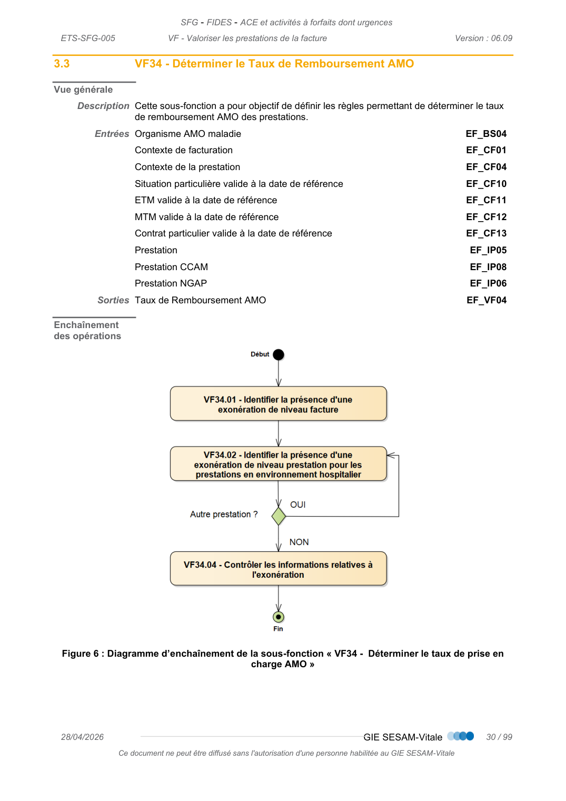
*Figure (p.230) : Figure 6 : Diagramme d’enchaînement de la sous-fonction « VF34 -  Déterminer le taux de prise en*

<!-- p.231 -->
VF - Valoriser les prestations de la facture
3.3.1
VF34.01 - Identifier la présence d’une exonération de niveau facture
Vue générale
Description Cette opération a pour objectif de définir :
 les règles permettant d’identifier la présence d’une exonération de niveau facture à la
date de référence pour l’application du TR (EF_VF04_01),
 le taux de remboursement des prestations.
Dans le cas où une exonération de niveau facture a été identifiée, l’examen au niveau
des prestations n’est pas nécessaire, sauf exception. L’exonération identifiée porte, sauf
exception, sur la totalité de la facture.
Le système de facturation doit hiérarchiser les exonérations de niveau facture afin de
renseigner la facture selon le contexte d’exonération.
Entrées Venue
EF_BS01
Organisme AMO maladie
EF_BS04
Situation particulière valide à la date de référence
EF_CF10
ETM valide à la date de référence
EF_CF11
Contrat particulier valide à la date de référence
EF_CF13
Date de référence AMO
EF_CF01
Contexte de la prestation
EF_CF04
Sorties Taux de Remboursement AMO
EF_VF04

<!-- p.232 -->
VF - Valoriser les prestations de la facture
Règles de
gestion
Le schéma ci-dessous- représente la priorisation d’usage des RG qui suivent :
Figure 7 : Enchainement des règles pour « VF34.01 - Identifier la présence d’une exonération de
niveau facture »
[RG_VF650] Identifier la présence d’une « AME »
Le taux est applicable à toutes les prestations de la facture.
La situation
d’exonération
Identifiée par
Conduit à
Taux de
remboursement
(EF_VF04_02)
Justificatif
d’exonération
(EF_VF04_03)
Nature assurance
(EF_CF04_01)
AME (SP06)
Code situation particulière
valide à la date de référence
(EF_CF10_01) = « SP06 »
0%
 « Pas
d’exonération »
Maladie
Ou Maternité
Si la situation d’AME a été identifiée, il n’est pas nécessaire de poursuivre la recherche
d’autres exonérations.
 Le qualificatif de la dépense pour chaque prestation de la facture sera valorisé à « N ».

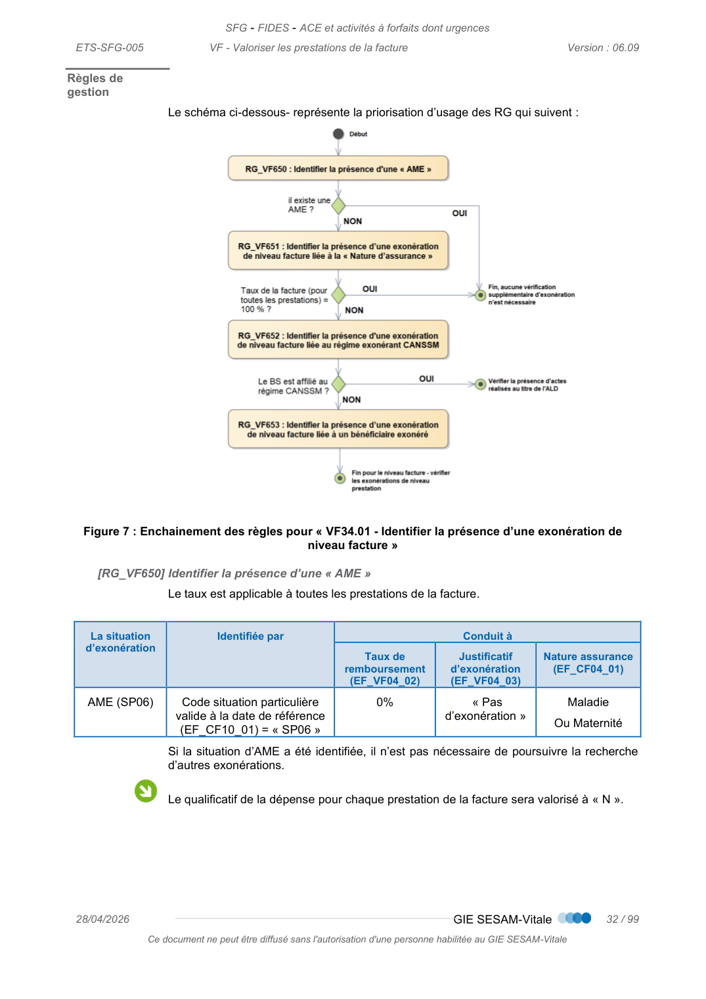
*Figure (p.232) : Figure 7 : Enchainement des règles pour « VF34.01 - Identifier la présence d’une exonération de*

<!-- p.233 -->
VF - Valoriser les prestations de la facture
[RG_VF651] Identifier la présence d’une exonération de niveau facture liée à la « Nature
d’assurance »
Si la situation d’exonération a été identifiée, il n’est pas nécessaire de poursuivre la
recherche d’autres exonérations.
[RG_VF652] Identifier la présence d’une exonération de niveau facture liée au régime exonérant
CANSSM
Condition : Code régime (EF_BS04_01) = « 07 »
Le taux est applicable à toutes les prestations de la facture.
Si cette situation d’exonération a été identifiée, des recherches d’exonérations de niveau
actes doivent être réalisées se référer au chapitre suivant. il n’est pas nécessaire de
poursuivre la recherche d’autres exonérations, c’est-à-dire :
[RG_VF653] Identifier la présence d’une exonération de niveau facture liée à un bénéficiaire
exonéré
Le taux est applicable à toutes les prestations de la facture.
En cas de la présence de prestations exonérées au titre de l’ALD, le justificatif
d’exonération de ces prestations doit porter l’exonération ALD conformément à la règle
[RG_VF999].
 Cf.chapitre 3.7 Fonctions transverses
 Cas particuliers
La situation d’exonération est
Est identifiée
par Nature
assurance
(EF_CF04_01)
Conduit à
Taux de
remboursement
(EF_VF04_02)
Justificatif d’exonération
(EF_VF04_03)
Soins dispensé au titre de la maternité
« Maternité »
100%
 « Pas d’exonération »
Soins dispensé au titre de l’AT/MP
« AT/MP »
100%
 « Pas d’exonération »
Soins dispensé au titre de la
prévention
« Prévention »
100%
 « Pas d’exonération »
La situation d’exonération est
Est identifiée par
Conduit à
Taux de
remboursement
(EF_VF04_02)
Justificatif d’exonération
(EF_VF04_03)
Régime exonérant (CANSSM)
Code régime
(EF_BS04_01) = « 07 »
100%
« Régimes spéciaux
SNCF et MINES »
La situation
d’exonération est
Est identifiée par un Libellé ETM
valide à la date de référence
(EF_CF11_01)
Conduit à
Taux de
remboursement
(EF_VF04_02)
Justificatif
d’exonération
(EF_VF04_03)
Bénéficiaire exonéré
« Pension militaire » ou
« Invalidité »
Ou « Bénéficiaire exonéré »
100%
« Assuré ou
Bénéficiaire exonéré
(régime exonérant) »
Sauf pour les
prestations ALD

<!-- transcrit de p.233 (ex-figure) -->

**[RG_VF651] Identifier la présence d'une exonération de niveau facture liée à la « Nature d'assurance »**

| La situation d'exonération est | Est identifiée par Nature assurance (EF_CF04_01) | Taux de remboursement (EF_VF04_02) | Justificatif d'exonération (EF_VF04_03) |
| --- | --- | --- | --- |
| Soins dispensé au titre de la maternité | « Maternité » | 100% | « Pas d'exonération » |
| Soins dispensé au titre de l'AT/MP | « AT/MP » | 100% | « Pas d'exonération » |
| Soins dispensé au titre de la prévention | « Prévention » | 100% | « Pas d'exonération » |

**[RG_VF652] Identifier la présence d'une exonération de niveau facture liée au régime exonérant CANSSM**

| La situation d'exonération est | Est identifiée par | Taux de remboursement (EF_VF04_02) | Justificatif d'exonération (EF_VF04_03) |
| --- | --- | --- | --- |
| Régime exonérant (CANSSM) | Code régime (EF_BS04_01) = « 07 » | 100% | « Régimes spéciaux SNCF et MINES » |

**[RG_VF653] Identifier la présence d'une exonération de niveau facture liée à un bénéficiaire exonéré**

| La situation d'exonération est | Est identifiée par un Libellé ETM valide à la date de référence (EF_CF11_01) | Taux de remboursement (EF_VF04_02) | Justificatif d'exonération (EF_VF04_03) |
| --- | --- | --- | --- |
| Bénéficiaire exonéré | « Pension militaire » ou « Invalidité » ou « Bénéficiaire exonéré » | 100% | « Assuré ou Bénéficiaire exonéré (régime exonérant) » Sauf pour les prestations ALD |

<!-- p.234 -->
VF - Valoriser les prestations de la facture
[SP17] : Détenus
Les détenus sont des bénéficiaires exonérés, de ce fait :
 le Taux de remboursement (EF_VF04_02) est égal à 100%
 le Justificatif d’exonération (EF_VF04_03) est égal à « Assuré ou Bénéficiaire exonéré
(régime exonérant) ».

<!-- p.234 -->
VF - Valoriser les prestations de la facture
3.3.2
VF34.02 - Identifier la présence d’une exonération de niveau prestation pour
les prestations en environnement hospitalier
 Rappel : les prestations en environnement hospitalier comprennent les ACE et les activités
à forfait
Vue générale
Description Cette opération a pour objectif de définir :
 les règles permettant d’identifier la présence d’une exonération de niveau prestation à
la date de référence pour l’application du TR, si aucune exonération de niveau facture
n’a été précédemment identifiée, sauf cas particuliers
 le taux de remboursement des prestations .
Entrées Contexte AMO du Bénéficiaire
EF_CF02
MTM valide à la date de référence
EF_CF12
Contrat particulier valide à la date de référence
EF_CF13
Contexte de la prestation
EF_CF04
Prestation
EF_IP05
Prestation CCAM
EF_IP08
Prestation NGAP
EF_IP06
 Prestation NABM
EF_IP11
Sorties Taux de Remboursement AMO
EF_VF04

<!-- p.235 -->
VF - Valoriser les prestations de la facture
Règles de
gestion
Le schéma ci-dessous- représente la priorisation d’usage des RG qui suivent :
Figure 8 : Enchainement des règles pour « VF34.02 - Identifier la présence d’une exonération de
niveau prestation »

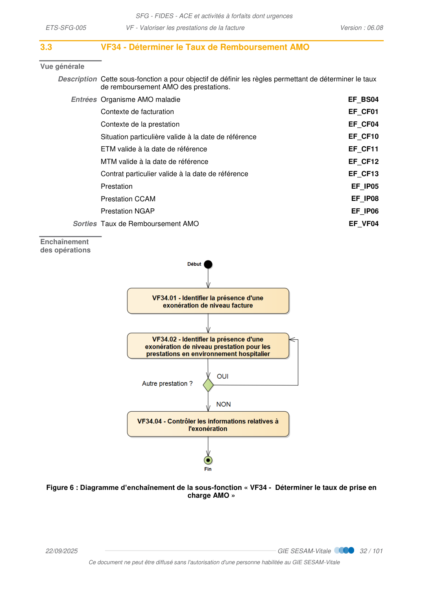
*Figure (p.235) : Figure 8 : Enchainement des règles pour « VF34.02 - Identifier la présence d’une exonération de*

<!-- p.236 -->
VF - Valoriser les prestations de la facture
[RG_VF660] Identifier la présence d’une prestation exonérée « par nature »
Conditions : la facture n’est pas exonérée
Prestation CCAM exonérée par nature
Identifiée par
Et un Motif médical
d’exonération
(EF_IP05_03)
Conduit à
Taux de
remboursement
(EF_VF04_02)
Justificatif d’exonération
(EF_VF04_03)
Prestation CCAM dont le
champ 25 est égal à « 3 »
Sans objet
100%
« Soins exonérés en codage CCAM
du fait de la nature de l’acte, ou du
dépassement du seuil »
Prestation CCAM dont le
champ 25 est égal à « 7 »
« Soins entrants
dans le cadre d’un
dispositif de
prévention »
100%
« Prévention maladie » (voir CP01)
Autres prestations exonérées par nature
Identifiée par
Conduit à
Taux de
remboursement
(EF_VF04_02)
Justificatif d’exonération
(EF_VF04_03)
Forfait technique d'imagerie (FT)
100%
« Pas d’exonération  »
Forfait Vidéocapsule (VDE)
Écarts indemnisables (ETI/ERI/EMI)
Consultation Contraception et Prévention (CCP)
Consultations obligatoires de l’enfant (COB, COD,
COE)
Majoration personnes âgées (MOP) jusqu’au
Forfait Fausse Couche Établissement avec
Échographie (FEF)
Forfait Fausse Couche Établissement sans
Échographie (FFE)
Prestations de téléexpertise dont la sous-catégorie
EF_IP05_07 vaut « téléexpertise » (TE2)
Forfait requérant téléexpertise (RQD)
Médicaments rétrocédés non codés sous -catégorie
(EF_IP05_07) = Rétrocession et top codage affiné
(EF_IP05_12) = « non » hors nutriments
Médicaments rétrocédés codés pris en charge à
100% : Le taux de prise en charge = 100% dans la
base UCD

<!-- transcrit de p.236 (ex-figure) -->

**[RG_VF660] Identifier la présence d'une prestation exonérée « par nature »**

Conditions : la facture n'est pas exonérée

*Prestation CCAM exonérée par nature*

| Identifiée par | Et un Motif médical d'exonération (EF_IP05_03) | Taux de remboursement (EF_VF04_02) | Justificatif d'exonération (EF_VF04_03) |
| --- | --- | --- | --- |
| Prestation CCAM dont le champ 25 est égal à « 3 » | Sans objet | 100% | « Soins exonérés en codage CCAM du fait de la nature de l'acte, ou du dépassement du seuil » |
| Prestation CCAM dont le champ 25 est égal à « 7 » | « Soins entrants dans le cadre d'un dispositif de prévention » | 100% | « Prévention maladie » (voir CP01) |

*Autres prestations exonérées par nature*

| Identifiée par | Taux de remboursement (EF_VF04_02) | Justificatif d'exonération (EF_VF04_03) |
| --- | --- | --- |
| Forfait technique d'imagerie (FT) | 100% | « Pas d'exonération » |
| Forfait Vidéocapsule (VDE) | 100% | « Pas d'exonération » |
| Écarts indemnisables (ETI/ERI/EMI) | 100% | « Pas d'exonération » |
| Consultation Contraception et Prévention (CCP) | 100% | « Pas d'exonération » |
| Consultations obligatoires de l'enfant (COB, COD, COE) | 100% | « Pas d'exonération » |
| Majoration personnes âgées (MOP) **jusqu'au 31/12/2023** | 100% | « Pas d'exonération » |
| Forfait Fausse Couche Établissement avec Échographie (FEF) | 100% | « Pas d'exonération » |
| Forfait Fausse Couche Établissement sans Échographie (FFE) | 100% | « Pas d'exonération » |
| Prestations de téléexpertise dont la sous-catégorie EF_IP05_07 vaut « téléexpertise » ~~(TE2)~~ | 100% | « Pas d'exonération » |
| ~~Forfait requérant téléexpertise (RQD)~~ | 100% | « Pas d'exonération » |
| Médicaments rétrocédés non codés sous-catégorie (EF_IP05_07) = Rétrocession et top codage affiné (EF_IP05_12) = « non » hors nutriments | 100% | « Pas d'exonération » |
| Médicaments rétrocédés codés pris en charge à 100% : Le taux de prise en charge = 100% dans la base UCD | 100% | « Pas d'exonération » |

<!-- p.237 -->
VF - Valoriser les prestations de la facture
Identifiée par
Conduit à
Taux de
remboursement
(EF_VF04_02)
Justificatif d’exonération
(EF_VF04_03)
Passage aux urgences non gynécologiques
Forfaits SAS, SUM, SUx, SIM, SIC, SUB, SBx, SUN,
SUF, SSN, SSF, FUx, PE1, PE2
En cohérence avec le justificatif
d’éxonération du forfait patient
associé cf. 3.7.5 « VF35.05 –
Générer le forfait patient
urgences »
Si la situation d’exonération a été identifiée, il n’est pas nécessaire de poursuivre la
recherche d’autres exonérations pour cette prestation.
 Cas particuliers
[CP01] : Actes CCAM pouvant être exonérés par nature dans le cadre d’un dispositif
de prévention
Certains actes CCAM sont obligatoirement en exonération 7 « Prévention maladie »
(lorsqu’une seule occurrence du champ 25 est renseignée).
[CP02] : Actes de biologie pouvant être exonérés par nature dans le cadre d’un
dispositif de prévention
Dans le cadre du dépistage organisé du cancer du col de l'utérus, les prestations NABM
0027 et 0028 (et uniquement celles-ci) doivent être transmises avec le code exo 7
« Prévention maladie ».
[RG_VF666] Identifier la présence d’une prestation exonérée au titre de « mon IST pour les moins
de 26 ans »
Conditions :
 La facture n’est pas exonérée et la prestation n’a pas été exonérée par RG_VF660
 le contexte métier d’anonymisation (EF_IP05_13) vaut « IST » selon la RG_IP663
 L’âge du BS (EF_IP05_02) est strictement inférieur à 26 ans
Dans ce cas les conditions suivantes s’appliquent :
Taux de remboursement
(EF_VF04_02)
Justificatif d’exonération (EF_VF04_03)
100%
« Soins Particuliers Exonérés »
[RG_VF661] Identifier la présence d’une prestation exonérée au titre de « l’ALD »
Conditions :
 la facture n’est pas exonérée et la prestation n’a pas été exonérée par RG_VF666
 OU le BS est affilié au régime CANSSM, il bénéficie de l’exonération de niveau facture
(RG_VF652)
Appeler la règle [RG_VF999] Identifier la présence d’une prestation exonérée au titre de
« l’ALD ».
 Cf.chapitre 3.7 Fonctions transverses
Si la situation d’exonération a été identifiée hors BS affilié au régime CANSSM, il n’est pas
nécessaire de poursuivre la recherche d’autres exonérations pour cette prestation.
Si le BS est affilié au régime CANSSM, il n’est pas nécessaire de poursuivre la recherche
d’autres exonérations pour cette prestation, que la situation d’exonération ait été identifiée
ou non.

<!-- transcrit de p.237 (ex-figure) -->

| Identifiée par | Taux de remboursement (EF_VF04_02) | Justificatif d'exonération (EF_VF04_03) |
| --- | --- | --- |
| Passage aux urgences non gynécologiques — Forfaits SAS, SUM, SUx, SIM, SIC, SUB, SBx, SUN, SUF, SSN, SSF, FUx, PE1, PE2 |  | En cohérence avec le justificatif d'éxonération du forfait patient associé cf. 3.7.5 « VF35.05 – Générer le forfait patient urgences » |

**[RG_VF666] Identifier la présence d'une prestation exonérée au titre de « mon IST pour les moins de 26 ans »**

| Taux de remboursement (EF_VF04_02) | Justificatif d'exonération (EF_VF04_03) |
| --- | --- |
| 100% | « Soins Particuliers Exonérés » |

<!-- p.238 -->
VF - Valoriser les prestations de la facture
 La recherche d’exonération au titre de l’ALD pour les bénéficiaires CANSSM est nécessaire
pour des raisons de traçabilité ce qui nécessite la présence du bon justificatif d’exonération.
[RG_VF662] Identifier la présence d’une prestation exonérée pour « soins particuliers exonérés »
Conditions : la facture n’est pas exonérée et la prestation n’a pas été exonérée par
RG_VF661
Appeler la règle [RG_VF998] : Identifier la présence d’une prestation exonérée pour
« soins particuliers exonérés ».
 Cf.chapitre 3.7 Fonctions transverses
Si la situation d’exonération a été identifiée, il n’est pas nécessaire de poursuivre la
recherche d’autres exonérations pour cette prestation.
[RG_VF663] Identifier la présence d’une prestation (ou cumul de prestations) exonérée pour
« dépassement de la règle du seuil »
Conditions :
 la facture n’est pas exonérée et la prestation n’a pas été exonérée par RG_VF662
 le contexte de la venue EF_BS01_05 = « prestations en environnement hospitalier »
 la nomenclature (EF_IP05_08) vaut :
○ NGAP ou
○ CCAM et le champ 25 de la base CCAM vaut 1 ou 2
Base de remboursement utilisée pour la comparaison au seuil
Pour déterminer le dépassement du seuil, on utilise la BR de l’acte :
 Actes NGAP : la somme des coefficients pour chaque prestation distincte (pas de prise
en compte des majorations nuits et fériés)
 Actes CCAM : la base de remboursement de l’acte en prenant en compte :
○ les codes modificateurs en % mais pas ceux en montant. (Par exemple, le code
modificateur U ne rentre pas en compte)
○ l’abattement pour association
 Depuis 2011, la valeur du seuil CCAM est 120€
Conséquence en cas de dépassement du seuil
Dans tous les cas de déclenchement de la règle du seuil :
  le Taux remboursement (EF_VF04_02) a pour valeur « 100% ».
 Un Ticket modérateur forfaitaire (TMF) peut s’appliquer. Les règles précisant les
cas d’applications et les conséquences sur la facture sont détaillées dans le chapitre
3.6.2 VF35.02 – Déterminer l’application du TMF 24€
Si la situation d’exonération a été identifiée, il n’est pas nécessaire de poursuivre la
recherche d’autres exonérations pour cette prestation.
Détail de la RG
Les tableaux ci-dessous recensent pour chaque type d’actes :
 les situations d’exonération en cas de dépassement du seuil
 Le périmètre d’exonération : actes seul, exonération d’une partie des actes de la
facture, exonération de tous les actes de la facture

<!-- p.239 -->
VF - Valoriser les prestations de la facture
 le justificatif d’exonération à renseigner au niveau acte
ACE : ACTES ET CONSULTATIONS EXTERNES
Les règles suivantes sont applicables en cas d’acte et consultations externes seuls
(absence dans la facture d’un forfait ATU, FFM, SEx).
Si la
nomenclature
de la prestation
est :
Alors la règle du seuil est
déclenchée si :
Dans ce cas,
l’exonération sera
appliquée sur :
 Et conduit au
Justificatif
d’exonération de
niveau acte
(EF_VF04_03)
suivant :
NGAP
la somme du Coefficient  de la
prestation ou du cumul de
prestation (EF_IP06_01) est
supérieur ou égal à 60 à la
même date d’exécution
L’acte déclencheur
1 « soins en rapport
avec un K ou un KC =
ou > 60 »
CCAM - actes
non invasifs
(champ 25 égal
« 2 »)
L’acte est supérieur ou égal au
seuil
L’acte déclencheur
 C « Soins exonérés en
codage CCAM du fait de
la nature de l’acte, ou
du dépassement du
seuil»
CCAM - actes
invasifs (champ
25 égal « 1 »)
L’acte est supérieur ou égal au
seuil
Ou le cumul des actes de
champs 25 à 1 à la même date
d’exécution tout exécutant
ou spécialité confondu.es est
supérieur ou égal au seuil
Tous les actes CCAM
invasifs (champ 25 = 1)
de la facture à la même
date d’exécution
C « Soins exonérés en
codage CCAM du fait de
la nature de l’acte, ou
du dépassement du
seuil»
pour chaque acte
exonéré
 Cas particuliers
[CP01] : Exonération du Forfait FSD accompagnant une prestation CCAM
Condition :
 Le forfait FSD est présent dans la facture :
 un acte CCAM invasif ou non invasif (champ 25 est égal à « 1 » ou « 2 ») a déclenché
la règle du seuil
Le système de facturation doit permettre l'acquisition des informations suivantes pour le
forfait FSD :
Taux de remboursement
(EV_VF04_02)
Justificatif d’exonération (EF_VF04_03)
100%
 3 « Soins particuliers exonérés »
 Le forfait FSD ne déclenchant pas la règle du seuil, il ne portera jamais l’éventuel TMF et
sa participation assuré sera renseignée « à blanc » (Cf. VF35.08).

<!-- transcrit de p.240 (ex-figure) -->

**ACE : ACTES ET CONSULTATIONS EXTERNES**

| Si la nomenclature de la prestation est : | Alors la règle du seuil est déclenchée si : | Dans ce cas, l'exonération sera appliquée sur : | Et conduit au Justificatif d'exonération de niveau acte (EF_VF04_03) suivant : |
| --- | --- | --- | --- |
| NGAP | la somme du Coefficient de la prestation ou du cumul de prestation (EF_IP06_01) est supérieur ou égal à 60 à la même date d'exécution | L'acte déclencheur | 1 « soins en rapport avec un K ou un KC = ou > 60 » |
| CCAM - actes non invasifs (champ 25 égal « 2 ») | L'acte est supérieur ou égal au seuil | L'acte déclencheur | C « Soins exonérés en codage CCAM du fait de la nature de l'acte, ou du dépassement du seuil » |
| CCAM - actes invasifs (champ 25 égal « 1 ») | L'acte est supérieur ou égal au seuil Ou le cumul des actes de champs 25 à 1 à la même date d'exécution tout exécutant ou spécialité confondu.es est supérieur ou égal au seuil | Tous les actes CCAM invasifs (champ 25 = 1) de la facture à la même date d'exécution | C « Soins exonérés en codage CCAM du fait de la nature de l'acte, ou du dépassement du seuil » pour chaque acte exonéré |

**[CP01] Exonération du Forfait FSD accompagnant une prestation CCAM**

| Taux de remboursement (EV_VF04_02) | Justificatif d'exonération (EF_VF04_03) |
| --- | --- |
| 100% | 3 « Soins particuliers exonérés » |

<!-- p.243 -->
VF - Valoriser les prestations de la facture
Illustration de la règle du seuil en ACE
Le schéma ci-dessous illustre les règles du tableau précédent et précise les cas
d’application du TMF pour un assuré de droit commun sans droit particuliers.
Figure 9 : synthèse de la règle du seuil et application du TMF pour les ACE
ACTIVITES A FORFAIT
 Pour rappel : Facturation de l’activité d’urgence non gynécologiques (présence d’un forfait
FUx dans la facture). Les actes ayant conduit à la facturation du forfait FUx ne doivent pas
figurer dans la facture. Par conséquent, les règles d’exonération pour dépassement de la
règle du seuil ne s’appliquent pas.
En cas de présence dans la facture d’au moins un forfait ATU, FFM ou SEx, les règles
applicables sont les suivantes par ordre de priorité :
Si la
nomenclature
de la prestation
est :
Alors la règle du seuil est
déclenchée si :
Dans ce cas,
l’exonération sera
appliquée sur :
 Et conduit au
Justificatif
d’exonération
(EF_VF04_03)
suivant :
CCAM - actes
invasifs (champ
25 égal « 1 »)
L’acte est supérieur ou égal au
seuil
Ou le cumul des actes de
champs 25 à 1 à la même date
d’exécution tout exécutant ou
spécialité confondu.es est
supérieur ou égal au seuil
Toute la facture
Il
n’est
pas
nécessaire
de
continuer la recherche
d’autres exonération.
C « Soins exonérés en
codage CCAM du fait de
la nature de l’acte, ou
du dépassement du
seuil »
Pour tous les actes
non déjà exonérés

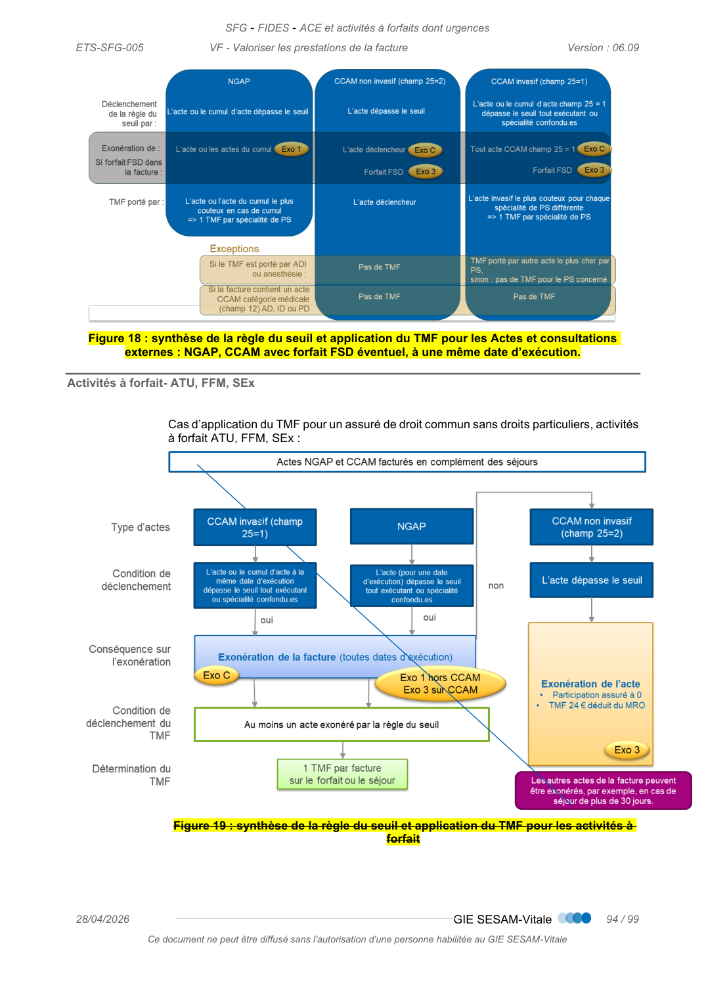
*Figure (p.294) : Figure 9 : synthèse de la règle du seuil et application du TMF pour les ACE*

<!-- p.241 -->
VF - Valoriser les prestations de la facture
NGAP
la somme du Coefficient  de la
prestation ou du cumul de
prestation (EF_IP06_01) est
supérieur ou égal à 60 à la
même date d’exécution
Toute la facture
Il
n’est
pas
nécessaire
de
continuer la recherche
d’autres exonération.
Pour les actes hors
CCAM (non déjà
exonérés forfait
compris) : 1 « soins en
rapport avec un K ou un
KC = ou > 60 »
Pour les actes CCAM
(non déjà exonérés) : 3
« Soins particuliers
exonérés»
CCAM - actes
non invasifs
(champ 25 égal
« 2 »)
L’acte est supérieur ou égal au
seuil
L’acte déclencheur
3 « Soins particuliers
exonérés »
 Cf.CP03
ci-
dessous
 Cas particuliers
[CP02] : Exonération du (des) Forfait(s) SE accompagnant une prestation CCAM
Lorsqu’un acte CCAM (invasif ou non invasif) a déclenché la règle du seuil, le système de
facturation doit permettre l'acquisition des informations suivantes en cas de présence d’un
forfait SEx :
Forfait
Taux de
remboursement
(EV_VF04_02)
Justificatif d’exonération (EF_VF04_03)
1er forfait SE
100%
 C « Soins exonérés en codage CCAM du fait
de la nature de l’acte, ou du dépassement du
seuil  »
2ème forfait SE
100%
3  « Soins particuliers exonérés»
 Le justificatif d’exonération 3 « Soins particuliers exonérés » est à positionner sur le second
forfait SE pour tous les bénéficiaires de soins, AME compris.
[CP03] : la facture ne contient que des actes CCAM non invasifs n’exonérant pas
toute la facture.
Conditions :
 la facture contient un ou plusieurs actes CCAM non invasifs
 la facture ne contient aucun acte CCAM invasif ou NGAP exonérant la facture
alors le justificatif d’exonération de niveau acte (EF_VF04_03) de la prestation
rémunérant le forfait doit être renseigné avec « Soins particuliers exonérés »
 Dans cette situation le TMF devra être déduit de l’acte et la participation assuré sera
renseignée à  « 0 ».
Illustration de la règle du seuil en activités à forfait
Le schéma ci-dessous illustre les règles du tableau précédent et précise les cas
d’application du TMF pour un assuré de droit commun sans droit particuliers.

<!-- transcrit de p.247 (ex-figure : ACTIVITES A FORFAIT, suite du tableau p.246) -->

**ACTIVITES A FORFAIT** — règle du seuil en présence d'au moins un forfait ATU, FFM ou SEx (par ordre de priorité)

| Si la nomenclature de la prestation est : | Alors la règle du seuil est déclenchée si : | Dans ce cas, l'exonération sera appliquée sur : | Et conduit au Justificatif d'exonération (EF_VF04_03) suivant : |
| --- | --- | --- | --- |
| CCAM - actes invasifs (champ 25 égal « 1 ») | L'acte est supérieur ou égal au seuil Ou le cumul des actes de champs 25 à 1 à la même date d'exécution tout exécutant ou spécialité confondu.es est supérieur ou égal au seuil | Toute la facture. Il n'est pas nécessaire de continuer la recherche d'autres exonération. | C « Soins exonérés en codage CCAM du fait de la nature de l'acte, ou du dépassement du seuil » — Pour tous les actes non déjà exonérés |
| NGAP | la somme du Coefficient de la prestation ou du cumul de prestation (EF_IP06_01) est supérieur ou égal à 60 à la même date d'exécution | Toute la facture. Il n'est pas nécessaire de continuer la recherche d'autres exonération. | Pour les actes hors CCAM (non déjà exonérés forfait compris) : 1 « soins en rapport avec un K ou un KC = ou > 60 ». Pour les actes CCAM (non déjà exonérés) : 3 « Soins particuliers exonérés » |
| CCAM - actes non invasifs (champ 25 égal « 2 ») | L'acte est supérieur ou égal au seuil | L'acte déclencheur | 3 « Soins particuliers exonérés » — Cf. CP03 ci-dessous |

**[CP02] : Exonération du (des) Forfait(s) SE accompagnant une prestation CCAM** — informations à acquérir en présence d'un forfait SEx lorsqu'un acte CCAM (invasif ou non invasif) a déclenché la règle du seuil :

| Forfait | Taux de remboursement (EV_VF04_02) | Justificatif d'exonération (EF_VF04_03) |
| --- | --- | --- |
| 1er forfait SE | 100% | C « Soins exonérés en codage CCAM du fait de la nature de l'acte, ou du dépassement du seuil » |
| 2ème forfait SE | 100% | 3 « Soins particuliers exonérés » |

<!-- p.243 -->
VF - Valoriser les prestations de la facture
Figure 10 : synthèse de la règle du seuil et application du TMF pour les activités à
forfait
Appeler la règle [RG_VF997] : Identifier la présence d’une prestation (ou cumul de
prestations) exonérée pour « dépassement de la règle du seuil »
 Cf.chapitre 3.7 Fonctions transverses
[RG_VF665] Identifier la présence d’une exonération en cas de présence de rente AT
Conditions :
 la facture n’est pas exonérée et la prestation n’a pas été exonérée par RG_VF663
 Libellé MTM valide à la date de référence (EF_CF12_01) = « Rente AT »
Cette situation conduit aux valeurs suivantes :
Taux de remboursement
(EV_VF04_02)
Justificatif d’exonération (EF_VF04_03)
100 %
 « Assuré ou Bénéficiaire exonéré (régime
exonérant) »
Si la situation d’exonération a été identifiée, il n’est pas nécessaire de poursuivre la
recherche d’autres exonérations pour cette prestation.
 Cas particuliers
[CP01] : rétrocession Pharmacie hospitalière 30% pour les BS
En rente AT, la prestation PHQ est prise en charge comme suit :
 100% pour les BS du régime spécial CPRPF (Code régime (EF_BS04_01) = « 04 »)
hors subsistants (Code contrat particulier à la date de référence (EF_CF13_01) = 18,
19, 21.)

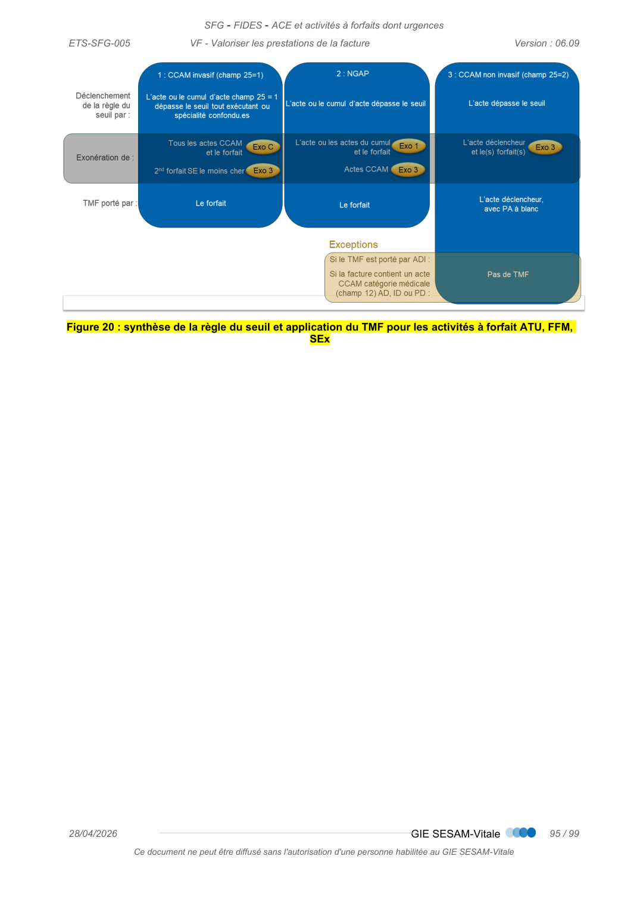
*Figure (p.295) : Figure 10 : synthèse de la règle du seuil et application du TMF pour les activités à*

<!-- p.243 -->
VF - Valoriser les prestations de la facture
 30% pour les autres BS
 [RG_VF664] Déterminer le taux de prise en charge pour un Bénéficiaire du régime spécial CPRPF
Conditions :
 la facture n’est pas exonérée et la prestation n’a pas été exonérée par RG_VF665
(Libellé MTM valide à la date de référence (EF_CF12_01) est différent de « Rente
AT »)
 Code régime du BS (EF_BS04_01) = « 04 »
Afin de déterminer le taux de prise en charge et le justificatif d’exonération d’un BS du
régime spécial CPRPF, il est nécessaire de vérifier les conditions ci-dessous dans l’ordre
de priorité précisé :
priorité
Pour les BS dont
Et pour les prestations
suivantes
Taux de
remboursement
(EF_VF04_02)
Justificatif
d’exonération
(EF_VF04_03)
1
Libellé MTM valide à la date de
référence (EF_CF12_01) =
« ASPA »
Toutes
100%
ASPA
2
Code contrat particulier à la date de
référence (EF_CF13_01) = 21 -
Régime SNCF CMAL
Toutes
100 %
« Assuré ou
Bénéficiaire
exonéré (régime
exonérant) »
2
Code contrat particulier à la date de
référence (EF_CF13_01) = 24 -
Régime SNCF Hors Zone Médicale
Toutes
100 %
« Pas
d’exonération »
2
Code contrat particulier à la date de
référence (EF_CF13_01) = 25
Régime SNCF Pupille
Toutes
100 %
« Pas
d’exonération »
2
Code contrat particulier à la date de
référence (EF_CF13_01) = « 20 »
Régime SNCF Subsistants
Toutes
taux de base du
Régime Général
(cf. [RG_VF669]).
« Pas
d’exonération »
3
Situations différentes des situations
précédentes
Activités à forfaits (ATU,
FFM, SEx, APE)
100%
Le taux de prise en
charge du forfait
s’applique sur
toutes les
prestations liées de
la facture (à la
même date
d’exécution).
« Pas
d’exonération »
4
Code contrat particulier à la date de
référence (EF_CF13_01) = 23
Régime SNCF Non Actifs
Hors activités à forfaits
précédentes
75%
« Pas
d’exonération »
4
Code contrat particulier à la date de
référence (EF_CF13_01) = 22
Régime SNCF Actifs
prestations prescrites par
un médecin SNCF (Top
Prescription par médecin
SNCF EF_IP01_03 =
Vrai)
100%
« Régimes
spéciaux
SNCF et
MINES».

<!-- transcrit de p.244 (ex-figure) -->

[RG_VF664] — Taux de prise en charge pour un Bénéficiaire du régime spécial CPRPF :

| priorité | Pour les BS dont | Et pour les prestations suivantes | Taux de remboursement (EF_VF04_02) | Justificatif d’exonération (EF_VF04_03) |
| --- | --- | --- | --- | --- |
| 1 | Libellé MTM valide à la date de référence (EF_CF12_01) = « ASPA » | Toutes | 100% | ASPA |
| 2 | Code contrat particulier à la date de référence (EF_CF13_01) = 21 - Régime SNCF CMAL | Toutes | 100 % | « Assuré ou Bénéficiaire exonéré (régime exonérant) » |
| 2 | Code contrat particulier à la date de référence (EF_CF13_01) = 24 - Régime SNCF Hors Zone Médicale | Toutes | 100 % | « Pas d’exonération » |
| 2 | Code contrat particulier à la date de référence (EF_CF13_01) = 25 Régime SNCF Pupille | Toutes | 100 % | « Pas d’exonération » |
| 2 | Code contrat particulier à la date de référence (EF_CF13_01) = « 20 » Régime SNCF Subsistants | Toutes | taux de base du Régime Général (cf. [RG_VF669]) | « Pas d’exonération » |
| 3 | Situations différentes des situations précédentes | Activités à forfaits (ATU, FFM, SEx, APE) | 100% — Le taux de prise en charge du forfait s’applique sur toutes les prestations liées de la facture (à la même date d’exécution) | « Pas d’exonération » |
| 4 | Code contrat particulier à la date de référence (EF_CF13_01) = 23 Régime SNCF Non Actifs | Hors activités à forfaits précédentes | 75% | « Pas d’exonération » |
| 4 | Code contrat particulier à la date de référence (EF_CF13_01) = 22 Régime SNCF Actifs | prestations prescrites par un médecin SNCF (Top Prescription par médecin SNCF EF_IP01_03 = Vrai) | 100% | « Régimes spéciaux SNCF et MINES » |

<!-- p.244 -->
VF - Valoriser les prestations de la facture
priorité
Pour les BS dont
Et pour les prestations
suivantes
Taux de
remboursement
(EF_VF04_02)
Justificatif
d’exonération
(EF_VF04_03)
Prestations non prescrites
par un médecin SNCF
(Top Prescription par
médecin SNCF
EF_IP01_03 = Faux)
ET présentes en table :
 Cf. [TABLES] Table
104 :
Prestations
bénéficiant
d’un
taux à 100% (cas
particulier
CPRPSNCF)
100%
« Assuré ou
Bénéficiaire
exonéré (régime
exonérant) ».
Autres prestations
taux de base du
Régime Général
(cf. [RG_VF669]).
« Pas
d’exonération »
[RG_VF674] Identifier la présence d’une modulation d’exonération RLF/ RLAM
Conditions :
 la facture n’est pas exonérée et la prestation n’a pas été exonérée par RG_VF665
 Libellé MTM valide à la date de référence (EF_CF12_01) = « Régime Local frontalier »
ou « Régime Local Alsace-Moselle »
Cette situation conduit aux valeurs suivantes :
Taux de remboursement
(EV_VF04_02)
Justificatif d’exonération (EF_VF04_03)
90 %
 « Pas d’exonération »
Si la situation d’exonération a été identifiée, il n’est pas nécessaire de poursuivre la
recherche d’autres exonérations pour cette prestation.
 Cas particuliers
[CP01] : médicaments rétrocédés non exonérés par nature
Pour les médicaments rétrocédés dont le taux de prise en charge est différent de 100%
dans la base UCD, la prise en charge est calculé selon le type de prestation et le régime
de base du BS comme suit :
[CP02] : Présence de Forfaits Urgence (ATU / FFM), Sécurité (SE), APE
En cas de présence dans la facture d’un forfait ATU, FFM, SEx ou APE, le taux de prise
en charge du forfait est de 100% et s’applique sur toutes les prestations liées de la facture
(à la même date d’exécution).
Code Prestation
Si le Code régime
(EF_BS04_01) du BS
est 01 - CNAMTS
Si le Code régime
(EF_BS04_01) du BS
est 02 - MSA
PHQ
80%
90%
PHS
90%
90%

<!-- transcrit de p.244 (ex-figure) -->

[RG_VF664] (suite) :

| priorité | Pour les BS dont | Et pour les prestations suivantes | Taux de remboursement (EF_VF04_02) | Justificatif d’exonération (EF_VF04_03) |
| --- | --- | --- | --- | --- |
|  |  | Prestations non prescrites par un médecin SNCF (Top Prescription par médecin SNCF EF_IP01_03 = Faux) ET présentes en table : Cf. [TABLES] Table 104 : Prestations bénéficiant d’un taux à 100% (cas particulier CPRPSNCF) | 100% | « Assuré ou Bénéficiaire exonéré (régime exonérant) ». |
|  |  | Autres prestations | taux de base du Régime Général (cf. [RG_VF669]) | « Pas d’exonération » |

[RG_VF674] — modulation d’exonération RLF/RLAM :

| Taux de remboursement (EV_VF04_02) | Justificatif d’exonération (EF_VF04_03) |
| --- | --- |
| 90 % | « Pas d’exonération » |

[CP01] — médicaments rétrocédés non exonérés par nature :

| Code Prestation | Si le Code régime (EF_BS04_01) du BS est 01 - CNAMTS | Si le Code régime (EF_BS04_01) du BS est 02 - MSA |
| --- | --- | --- |
| PHQ | 80% | 90% |
| PHS | 90% | 90% |

<!-- p.245 -->
VF - Valoriser les prestations de la facture
[RG_VF675] Identifier la présence d’une modulation d’exonération ASPA hors BS Bénéficiaire du
régime spécial CPRPF
Conditions :
 la facture n’est pas exonérée et la prestation n’a pas été exonérée par RG_VF674
 Libellé MTM valide à la date de référence (EF_CF12_01) = « Allocation de Solidarité
aux Personnes Agées (ASPA) »
 Code régime (EF_BS04_01) est différent de « 04 »
Cette situation conduit aux valeurs suivantes :
Taux de remboursement
(EV_VF04_02)
Justificatif d’exonération (EF_VF04_03)
80 %
 « ASPA »
Si la situation d’exonération a été identifiée, il n’est pas nécessaire de poursuivre la
recherche d’autres exonérations pour cette prestation.
 Cas particuliers
[CP01] : médicaments rétrocédés non exonérés par nature
Pour les médicaments rétrocédés dont le taux de prise en charge est différent de 100%
dans la base UCD, la prise en charge est calculé selon le type de prestation comme suit :
Code Prestation
Taux de remboursement (EV_VF04_02)
PHQ
30%
PHS
65%
[RG_VF669] Déterminer le taux de base de la prestation
Condition : aucun taux de remboursement n’a été défini avec les RG précédentes
Le taux de prise en charge dépend :
 du régime du bénéficiaire
 de la prestation,
 de la date d’effet du taux
 de la spécialité du PS exécutant.
Ces taux sont précisés dans :
 Cf. [TABLES] - Table 4ter : Taux de remboursement de base et CRPCEN
En fonction du régime du BS, la valeur du taux est précisée dans un colonne différente du
fichier
Valeur du Code régime
(EF_BS04_01)
Conduit à
Taux de remboursement
(EV_VF04_02)
Justificatif d’exonération
(EF_VF04_03)
10 - CPRPCEN
colonne « ACE - TR
CRPCEN » de la table 4ter:
« Pas d’exonération »
Autres cas
colonne « ACE - Taux de base
(régime général) » de la table
4ter:
 « Pas d’exonération »
 Cas particuliers
[CP01] : Présence de Forfaits Urgence (ATU / FFM), Sécurité (SE), APE

<!-- transcrit de p.246 (ex-figure) -->

[RG_VF675] — modulation d’exonération ASPA hors BS du régime spécial CPRPF :

| Taux de remboursement (EV_VF04_02) | Justificatif d’exonération (EF_VF04_03) |
| --- | --- |
| 80 % | « ASPA » |

[CP01] — médicaments rétrocédés non exonérés par nature :

| Code Prestation | Taux de remboursement (EV_VF04_02) |
| --- | --- |
| PHQ | 30% |
| PHS | 65% |

[RG_VF669] — Déterminer le taux de base de la prestation (Table 4ter) :

| Valeur du Code régime (EF_BS04_01) | Taux de remboursement (EV_VF04_02) | Justificatif d’exonération (EF_VF04_03) |
| --- | --- | --- |
| 10 - CPRPCEN | colonne « ACE - TR CRPCEN » de la table 4ter | « Pas d’exonération » |
| Autres cas | colonne « ACE - Taux de base (régime général) » de la table 4ter | « Pas d’exonération » |

<!-- p.247 -->
VF - Valoriser les prestations de la facture
Forfaits ATU/FFM/SE/APE : Le taux de prise en charge du forfait (présent en table 4ter)
s’applique sur toutes les prestations liées de la facture (à la même date d’exécution).
[RG_VF673] Déterminer le taux pour les prestations non remboursables ou les actes gratuits
Pour les prestations non remboursables ou les actes gratuits (lorsque le Code qualificatif
de la dépense (EF_CF04_07) est égal à « N » ou « G »), le système de facturation doit
permettre l'acquisition des informations suivantes :
Taux de remboursement
(EF_VF04_02)
Code justificatif d’exonération
(EF_VF04_03)
0%
0 : « Pas d’exonération»

<!-- p.248 -->
VF - Valoriser les prestations de la facture
3.3.3
VF34.04 - Contrôler les informations relatives à l’exonération
Vue générale
Description Cette opération a pour objectif de définir les règles permettant de contrôler les
informations relatives à l’exonération.
Entrées Taux de Remboursement AMO
EF_VF04
Sorties Aucune
Règles de
gestion
[RG_VF_CC15] Contrôler la compatibilité entre le Taux de remboursement de la prestation
(EF_VF04_02) et le Justificatif d’exonération de la prestation (EF_V04_03)
Lorsque le Justificatif d’exonération (EF_VF04_03) est différent de « Pas d’exonération »
ou « ASPA » alors le taux de prise en charge est nécessairement de 100%.
À contrario, lorsque le Justificatif d’exonération (EF_VF04_03) est égal à « Pas
d’exonération » ou « ASPA » alors le taux de prise en charge peut tout de même être de
100%.
Cette cohérence concerne toutes les prestations de la facture, qu’il s’agisse d’actes CCAM
ou d’autres natures de prestation (NGAP…).
[RG_VF_CC4] Contrôler la cohérence des « Justificatif d’exonération » de l’acte CCAM
Les justificatifs d’exonération (EF_VF04_03) d’un même acte CCAM sont nécessairement
identiques.
Pour tous les acte/activité/phase (type 4A/4M) d’un même code acte CCAM, réalisés à la
même date d’exécution de la prestation (EF_IP05_01) quelles que soient l’activité et la
phase, le justificatif d’exonération est identique.
[RG_VF_CC5] Contrôler la présence d’une exonération ALD lors de la facturation de Nutriment
(NUT)
La facturation des nutriments (NUT) n’est possible que si le bénéficiaire a une ALD.

<!-- p.249 -->
VF - Valoriser les prestations de la facture

### 3.4 VF32 - Valoriser les informations financières du regroupement

Vue générale
Description Cette sous-fonction a pour objectif de définir une partie des règles permettant de valoriser
les informations financières relatives au regroupement de prestations.
La notion de prix unitaire telle qu’elle est définie correspond au tarif conventionnel des
prestations ou des lettres clé selon le type de prestation.
À noter que le tarif conventionnel est issu de bases de données ou de tables externes
aux SFG.
Entrées Prestation NGAP
EF_IP06
Contexte tarifaire CCAM
EF_IP07
Prestation CCAM
EF_IP08
Prestation NABM
EF_IP11
Prestation médicaments
EF_IP13
Complément de prestation
EF_CF05
Regroupement de prestations
EF_VF01
Code qualificatif de la dépense
EF_CF04_07
 Taux de financement
EF_CF09_07
 Prestation LPP
EF_IP12
Sorties Informations Financières
EF_VF02
Règles de
gestion
[RG_VF630] Déterminer la Date de référence pour le calcul du Prix Unitaire (EF_VF02_01)
La date de référence pour le calcul du prix unitaire est la Date d’exécution de chacune des
prestations (EF_IP05_01), c’est-à-dire la date des soins ou de délivrance.
 Cas particuliers
[CP01] : Soins dentaires
Pour les soins dentaires, la date de référence pour le calcul du prix unitaire est :
 La date d’achèvement des travaux c’est à dire la Date d’exécution de la dernière
prestation (EF_IP05_01) si le Code prestation (EF_IP05_04) est égal à “ SPR ”, “ SC ”,
“ PRO ” ou “ SCM ” ;
 La date de fin de chaque fraction de traitement, si le Code prestation (EF_IP05_04)
est égal à “ TO ” ou “ ORT ” ;
 La Date d’exécution de la prestation (EF_IP05_01) s’il s’agit d’un autre Code
prestation (EF_IP05_04) ;
 À noter que pour les actes CCAM et quelle que soit la spécialité du professionnel de
santé la date à retenir est la date d’achèvement des soins.
[RG_VF631] Déterminer le Prix Unitaire (EF_VF02_02) d’un Regroupement de prestations
(EF_VF01) pour les Prestations NGAP (EF_IP06) ou les Compléments de prestation
(EF_CF05)
Le prix unitaire d’un regroupement de prestations de type NGAP ou Compléments de
prestation correspond à la somme des tarifs conventionnels ou des lettres-clé des
prestations regroupées.

<!-- p.250 -->
VF - Valoriser les prestations de la facture
 Cas particuliers
[CP01] : Écart indemnisable LPP (ETI)
Le prix unitaire d’un regroupement de prestations Écart indemnisable lié aux Prestations
LPP correspond à la somme des Montants totaux des écarts indemnisables (EF_IP12_08)
des Prestations LPP concernées (EF_IP12).
[CP02] : Écart indemnisable Rétrocession (ERI)
Le prix unitaire d’un regroupement de prestations Écart indemnisable lié aux Prestations
rétrocession de médicaments correspond à la somme des Montants totaux des écarts
indemnisables (EF_IP13_09) des Prestations médicaments concernées (EF_IP13).
 [CP03] : Écart Médicament Indemnisable (EMI)
Le prix unitaire d’un regroupement de prestations Écarts indemnisable lié aux
médicaments en sus correspond à la somme des Montants totaux des écarts
indemnisables (EF_IP13_09) des Prestations médicaments concernées (EF_IP13).
 Consigne : le prix unitaire d’une majoration NGAP peut être différent selon la spécialité du
PS. Par exemple le prix unitaire d’une majoration pour un pédiatre ou un médecin
généraliste est différent du prix unitaire de cette même majoration pour une autre spécialité.
[RG_VF632] Déterminer la grille tarifaire CCAM (EF_VF02_04)
La grille tarifaire des prestations est recherchée dans la base CCAM en fonction du
Contexte tarifaire PS de la prestation (EF_IP07_01) et du Contexte tarifaire BS de la
prestation (EF_IP07_02), à la date de référence pour le calcul du prix unitaire
(EF_VF02_02).
L’affectation de la grille tarifaire en fonction des contextes est donnée dans la TB22 de la
base CCAM.
[RG_VF633] Déterminer le Prix Unitaire (EF_VF02_02) d’un Regroupement de prestations
(EF_VF01) pour les Prestations CCAM (EF_IP08)
Le prix unitaire de base est recherché dans la base CCAM en fonction de l'acte, de l'activité
et de la phase de traitement saisis par le PS et de la grille tarifaire de la prestation
(EF_VF02_04).
Ce prix unitaire de base est ensuite majoré si l'exécutant relève d'une caisse DOM.
Prix Unitaire (EF_VF02_02) = Prix unitaire de base x Coefficient DOM
Le coefficient DOM est donné dans le champ 47 de la base CCAM.
[RG_VF634] Déterminer le Prix Unitaire (EF_VF02_02) d’un Regroupement de prestations
(EF_VF01) pour les Prestations NABM (EF_IP11)
Le prix unitaire d’un regroupement de prestations de type NABM correspond au PU de la
lettre-clé NABM (B ou PB).
[RG_VF635] Déterminer le Prix Unitaire (EF_VF02_02) d’un Regroupement de prestations
(EF_VF01) pour les Prestations LPP (EF_IP12)
Le prix unitaire d’un regroupement de prestations de type LPP correspond à la somme des
[Tarifs de référence ou prix unitaires sur devis TTC (EF_IP12_03) x Quantité
(EF_IP12_04)] de chaque prestation LPP (EF_IP12).
[RG_VF636] Déterminer le Prix Unitaire (EF_VF02_02) d’un Regroupement de prestations
(EF_VF01) pour les Prestations Médicaments (EF_IP13)
Le prix unitaire d’un regroupement de prestations de type médicaments correspond à la
somme des montant totaux facturés TTC (EF_IP13_07) des médicaments (EF_IP13).

<!-- p.251 -->
VF - Valoriser les prestations de la facture
[RG_VF637] Acquérir le Montant des honoraires (EF_VF02_03) du Regroupement de prestations
(EF_VF01)
Le système de facturation doit permettre l'acquisition du Montant des honoraires, ou
Montant de la dépense (EF_VF02_03). Ce montant correspond :
 aux honoraires demandés par le Professionnel de Santé, incluant le dépassement, ou
 à la dépense facturée par l’établissement de Santé.
Lorsqu’il y a dépassement, le montant des honoraires ou le montant de la dépense incluent
les dépassements. Les dépassements ne sont possibles que pour les actes de niveau
« support ».
Le tableau suivant précise la méthode de calcul du Montant des honoraires (EF_VF02_03)
par type de prestation :
Prestations
Méthode de calcul
Médicaments
= somme des Montants totaux facturés TTC
(EF_IP13_07)
LPP
= somme des Montants totaux facturés TTC
(EF_IP12_05) des Prestations LPP (EF_IP12
Forfaits urgences
 Cf. VF35.05.01 – Déterminer le forfait patient
urgence
Actes gratuits
= 0
 En cas de Code qualificatif de la dépense
(EF_CF04_07) = « G »)
Autres cas
= montant de la dépense réelle incluant les dépassements
éventuels
 Remarque : les seuls dépassements possibles sont :
 Le dépassement autorisé (DA) en cas de non-respect du parcours de soins.
○ Le montant du dépassement autorisé est plafonné à hauteur de 17,5% de la base
de remboursement par acte effectué, arrondi à l’euro supérieur
 Le dépassement sur les actes dentaires hors panier de bien.

<!-- transcrit de p.252 (ex-figure) -->

Méthode de calcul du Montant des honoraires (EF_VF02_03) par type de prestation :

| Prestations | Méthode de calcul |
| --- | --- |
| Médicaments | = somme des Montants totaux facturés TTC (EF_IP13_07) |
| LPP | = somme des Montants totaux facturés TTC (EF_IP12_05) des Prestations LPP (EF_IP12) |
| Forfaits urgences | Cf. VF35.05.01 – Déterminer le forfait patient urgence |
| Actes gratuits | = 0 (En cas de Code qualificatif de la dépense (EF_CF04_07) = « G ») |
| Autres cas | = montant de la dépense réelle incluant les dépassements éventuels |

<!-- p.253 -->
VF - Valoriser les prestations de la facture

### 3.5 VF33 - Déterminer les bases de remboursement AMO et AMC

Vue générale
Description Cette sous-fonction a pour objectif de définir les règles permettant de valoriser les bases
de remboursement AMO et AMC.
 Les prestations écarts indemnisables ne sont pas concernées par cette
fonctionnalité car ce sont des prestations prises en charge à 100% par l’AMO.
Entrées Prestation
EF_IP05
Prestation NGAP
EF_IP06
Prestation CCAM
EF_IP08
Prestation médicaments
EF_IP13
Contexte de facturation prestation
EF_IP17
Contexte de la prestation
EF_CF04
Regroupement de prestations
EF_VF01
Informations Financières
EF_VF02
 Prestation LPP
EF_IP12
Sorties Base de remboursement
EF_VF03
 Enchaînement
des opérations
Figure 11 : Diagramme d’enchaînement de la sous-fonction « VF33 - Valoriser les bases de
remboursement AMO et AMC »

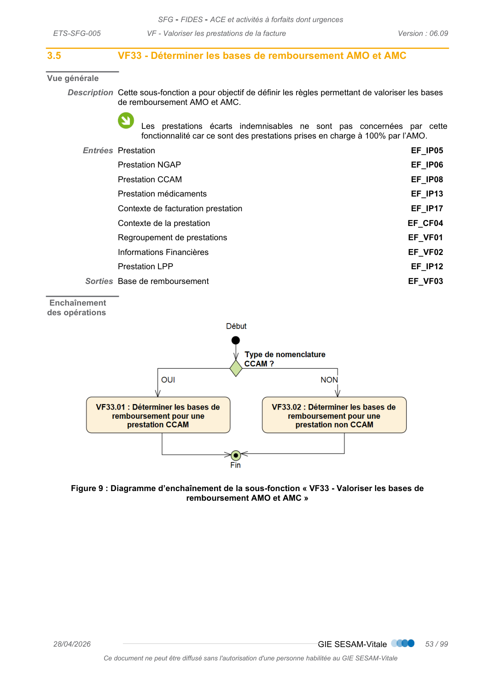
*Figure (p.253) : Figure 11 : Diagramme d’enchaînement de la sous-fonction « VF33 - Valoriser les bases de*

<!-- p.254 -->
VF - Valoriser les prestations de la facture
3.5.1
VF33.01 - Déterminer les bases de remboursement pour les prestations
CCAM
Vue générale
Description Cette opération a pour objectif de définir les règles permettant de valoriser les bases de
remboursement AMO et AMC du regroupement de prestations pour les prestations
CCAM.
Entrées Prestation CCAM
EF_IP08
Contexte de la facturation prestation
EF_CF04
Regroupement de prestations
EF_VF01
Sorties Base de remboursement
EF_VF03
Règles de
gestion
[RG_VF640] Calculer la Base de remboursement AMO (EF_VF03_02) du Regroupement de
prestations (EF_VF01) pour les prestations CCAM (EF_IP08)
La base de remboursement AMO est calculée à partir de la formule suivante :
BR_AMO (EF_VF03_02) =
Arrondi [ ( Montant 1 + Montant 2 + Montant 3 ) * CT ; 2 ]
Avec pour chaque champ :
Champ
Valeur du champ
CT – Coefficient de
transition
EF_CF04_04
Montant 1
= Arrondi [PU de l’acte x cumul des coefficients modificateurs
tarifants de type coefficient* x coefficient d’association** ; 2],
Montant 2
= Arrondi [somme des montants pour les modificateurs
tarifants de type forfait; 2]
Montant 3
= Supplément de charge en cabinet
 La grille tarifaire (EF_VF02_04) est utilisée pour la recherche des montants/coefficients
concernant les modificateurs et les associations.
* Recherche des types de modificateurs tarifants de types coefficient ou forfait
L'acte réalisé par le Professionnel de Santé peut être associé à plusieurs codes
modificateurs (4 au maximum).
En fonction de la date d'exécution (EF_IP05_01), seuls les n5 premiers modificateurs sont
pris en compte pour le calcul de la base de remboursement.
Chaque modificateur est associé, à la date d'exécution, et en fonction de la grille tarifaire
de la prestation :
 à un pourcentage6
 ou à montant forfaitaire à appliquer dans le calcul de la base de remboursement.
5 n=nombre de modificateurs tarifants
6 le pourcentage est exprimé sous la forme d'un coefficient

<!-- transcrit de p.254 (ex-figure) -->

[RG_VF640] — Base de remboursement AMO (EF_VF03_02) pour les prestations CCAM :

> BR_AMO (EF_VF03_02) = Arrondi [ ( Montant 1 + Montant 2 + Montant 3 ) * CT ; 2 ]

| Champ | Valeur du champ |
| --- | --- |
| CT – Coefficient de transition | EF_CF04_04 |
| Montant 1 | = Arrondi [PU de l’acte x cumul des coefficients modificateurs tarifants de type coefficient* x coefficient d’association** ; 2] |
| Montant 2 | = Arrondi [somme des montants pour les modificateurs tarifants de type forfait ; 2] |
| Montant 3 | = Supplément de charge en cabinet |

<!-- p.255 -->
VF - Valoriser les prestations de la facture
Attention : les modificateurs pris en compte pour la tarification sont ceux présentés en
premier parmi les 4 modificateurs transmis.
Il convient de cumuler les pourcentages de majoration représentés par les modificateurs
coefficients. Exemple avec 2 modificateurs coefficient : coeff 1,3 + coeff 1,5 donne un coeff
de 1,8 (et non un coeff de 2,8).
** Recherche du coefficient d’association
 Pour une association prévue :
Le coefficient est déterminé en fonction de la règle tarifaire de l’association.
À la règle tarifaire sélectionnée et en fonction de la grille tarifaire de la prestation
correspond le coefficient à appliquer (cf. TB03 de la base CCAM).
 Pour une association non prévue :
Le coefficient est déterminé en fonction du code association (EF_IP08_05) pour l'acte en
question, et de la grille tarifaire de la prestation (EF_VF02_04) dans la TB22 de la base
CCAM.
Exemple de calcul des Montant 1 et Montant 2 pour un acte CCAM effectué
dans les conditions suivantes :
 PU = 100,30 €
 un modificateur forfait de 20,50 €
 un modificateur coefficient de 1,255
 un coefficient d'association de 0,955
Montant 1
= [(PU=100,30) x (modificateur coeff. = 1,255)] x (coeff. association = 0,955)
= 120,2120575
= 120,21 après arrondi à 2 décimales
Montant 2 = 20,50 €
 Cas particuliers
[CP01] : Prestation non remboursable
Pour les prestations non remboursables, c’est-à-dire lorsque le Code qualificatif de la
dépense (EF_CF04_07) est égal à « N » alors la Base de Remboursement AMO
(EF_VF03_02) doit être valorisée à zéro.
[CP02] : Cas de cumul d’un acte technique et d’une consultation pour le même
Professionnel de Santé
Conditions : dans le cas de prestations correspondant au CP02 de la RG_VF620
Pour les actes concernés par la diminution, la base de remboursement doit être valorisée
à 50% du montant précédemment déterminé.
[SP06] : Bénéficiaire de l’AME
Pour les bénéficiaires de l’AME, la base de remboursement AMO (EF_VF03_02) est
valorisée à zéro. C’est la donnée « montant des honoraires » (EF_VF02_03) qui est
valorisé avec les montants décrits ci-dessus pour la BR AMO :

<!-- p.256 -->
VF - Valoriser les prestations de la facture
Donnée
Valorisée pour les bénéficiaires de l’AME
BR AMO (EF_VF03_02)
= 0
Montant des honoraires
(EF_VF03_02)
= Montants de la BR AMO décrits ci-dessus dans la
règle de gestion
[RG_VF641] Calculer la Base de remboursement AMC (EF_VF03_03) du Regroupement de
prestations (EF_VF01) pour les prestations CCAM (EF_IP08)
La base de remboursement AMC est calculée à partir de la formule suivante :
BR_AMC (EF_VF03_03) =
Arrondi [ Montant 1 + Montant 2 + Montant 3 ; 2 ]
Avec pour chaque champ, les valeurs définies en RG_VF640.

<!-- transcrit de p.256 (ex-figure) -->

[SP06] — Bénéficiaire de l’AME :

| Donnée | Valorisée pour les bénéficiaires de l’AME |
| --- | --- |
| BR AMO (EF_VF03_02) | = 0 |
| Montant des honoraires (EF_VF03_02) | = Montants de la BR AMO décrits ci-dessus dans la règle de gestion |

[RG_VF641] — Base de remboursement AMC (EF_VF03_03) pour les prestations CCAM :

> BR_AMC (EF_VF03_03) = Arrondi [ Montant 1 + Montant 2 + Montant 3 ; 2 ]
>
> Avec pour chaque champ, les valeurs définies en RG_VF640.

<!-- p.257 -->
VF - Valoriser les prestations de la facture
3.5.2
VF33.02 - Déterminer les bases de remboursement pour les prestations non
CCAM
Vue générale
Description Cette opération a pour objectif de définir les règles permettant de valoriser les bases de
remboursement AMO et AMC du regroupement de prestations pour les prestations non
CCAM.
Entrées Prestation
EF_IP05
Prestation NGAP
EF_IP06
Prestation médicament
EF_IP13
Contexte de facturation prestation
EF_IP17
Contexte de la prestation
EF_CF04
Regroupement de prestations
EF_VF01
Informations Financières
EF_VF02
 Prestation LPP
EF_IP12
Sorties Base de remboursement
EF_VF03
Règles de
gestion

<!-- p.258 -->
VF - Valoriser les prestations de la facture
[RG_VF642] Déterminer le Montant de la majoration du Regroupement de prestations (EF_VF01)
pour les prestations NGAP
Les étapes de calcul sont les suivantes :
Figure 12 : Étapes de calcul du montant de la majoration de la BR pour les prestations NGAP
La recherche du montant de la majoration pour une prestation NGAP n’est possible que si
le contexte particulier de soins nécessite une majoration (cf. RG_ CF630). Cela se traduit,
pour une prestation NGAP par la valorisation du « Code majoration de la prestation
NGAP » (EF_CF05_07) à « N », « F » ou « U ».
1. Détermination du type de majoration de la prestation
 Auxiliaires médicaux : Le montant de la majoration est toujours forfaitaire.
 Prescripteurs : Le code majoration de la prestation NGAP (EF_CF05_07) induit une
majoration de la BR soit de type forfaitaire, soit de type pourcentage. Ce type dépend
du code prestation (EF_IP05_04) et du coefficient de la prestation (EF_IP06_01),
comme spécifié dans la table 19.
 Cf. [TABLES] Table 23 : Type de majoration en fonction du code prestation.

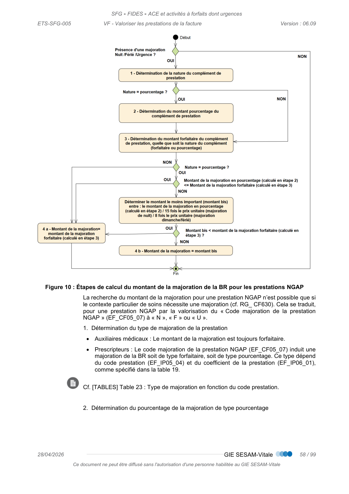
*Figure (p.258) : Figure 12 : Étapes de calcul du montant de la majoration de la BR pour les prestations NGAP*

<!-- p.259 -->
VF - Valoriser les prestations de la facture
2. Détermination du pourcentage de la majoration de type pourcentage
Type de
majoration
Identifié par  Le code
majoration de la
prestation NGAP
(EF_IP06_04)
% de majoration à appliquer
Nuit
« N »
10 %
Férié
« F »
5 %
Montant de la majoration au pourcentage = Coefficient x % de la majoration x
prix unitaire
3. Détermination du montant forfaitaire de la majoration, quel que soit le type de majoration
(forfaitaire ou au pourcentage)
Le montant de la majoration forfaitaire est fonction de la spécialité du professionnel de
santé et, pour les sages-femmes, de la nature des soins dispensés.
4. Détermination du montant final du complément de prestation par comparaison
éventuelle entre le montant forfaitaire et le montant de la majoration au pourcentage
5. La nature de la majoration est une majoration forfaitaire
Le montant de la majoration correspondra au montant de la majoration forfaitaire (calculé
en étape 3).
6. La nature de la majoration est une majoration au pourcentage
Si le montant de la majoration au pourcentage (calculé en étape 2) est inférieur ou égal au
montant de la majoration forfaitaire (calculé en étape 3), le montant de la majoration
correspond au montant de la majoration forfaitaire.
Si le montant de la majoration au pourcentage (calculé en étape 2) est supérieur au
montant de la majoration forfaitaire (calculé en étape 3), il est nécessaire d’effectuer une
comparaison afin de retenir comme montant de la majoration le montant le moins important
entre :
 le montant de la majoration au pourcentage (calculé en étape 2),
 15 fois le prix unitaire (majoration de nuit) ou
 8 fois le prix unitaire (majoration dimanche/férié)
Si le montant de la majoration calculée issue de la comparaison est strictement
inférieur au montant de la majoration forfaitaire alors il convient de retenir le montant
de la majoration forfaitaire
[RG_VF643] Calculer la Base de remboursement AMO (EF_VF03_02) du Regroupement de
prestations (EF_VF01) pour les prestations non CCAM
Elle est calculée à partir de formules différentes selon les prestations.
Les données utilisées sont :
Donnée
Valeur
Prix unitaire
EF_VF02_02
Quantité
EF_VF01_02
Coefficient
EF_VF01_01
Montant de la majoration de la BR
EF_VF03_01
Coefficient MCO
EF_CF04_19

<!-- transcrit de p.259 (ex-figure) -->

Détermination du pourcentage de la majoration de type pourcentage :

| Type de majoration | Identifié par Le code majoration de la prestation NGAP (EF_IP06_04) | % de majoration à appliquer |
| --- | --- | --- |
| Nuit | « N » | 10 % |
| Férié | « F » | 5 % |

> Montant de la majoration au pourcentage = Coefficient x % de la majoration x prix unitaire

[RG_VF643] — données utilisées pour la BR AMO (prestations non CCAM) :

| Donnée | Valeur |
| --- | --- |
| Prix unitaire | EF_VF02_02 |
| Quantité | EF_VF01_02 |
| Coefficient | EF_VF01_01 |
| Montant de la majoration de la BR | EF_VF03_01 |
| Coefficient MCO | EF_CF04_19 |

<!-- p.260 -->
VF - Valoriser les prestations de la facture
BR_AMO (EF_VF03_02) =
Actes, forfaits
et majorations
de NGAP
Arrondi ( Arrondi [ Prix unitaire x Quantité x coefficient + Montant de la majoration de la
BR ; 2 ] x Coefficient MCO (=CT) ; 2 )
Actes LPP,
NABM
Arrondi ( Arrondi [ (Prix unitaire x Quantité x coefficient) ; 2 ] x Coefficient MCO (=CT) ;
2 )
Forfaits FSD,
VDE,
rétrocession,
forfaits
techniques
Arrondi ( [Prix unitaire x Quantité x coefficient] ; 2 )
Médicaments
de la liste en
sus
Arrondi [ Prix unitaire x Quantité x coefficient ] ; 2 )
 Les médicaments de la liste en sus sont identifiés par la sous-catégorie = « Liste
en sus »)
Médicaments
sous AAP/AAC
Arrondi [ Prix unitaire x Quantité x coefficient ] ; 2 )
Les médicaments sous AAP/AAC sont identifiés par la sous-catégorie = «  En
AAP/AAC»)

<!-- transcrit de p.260 (ex-figure) -->

[RG_VF643] — Formule BR_AMO (EF_VF03_02) par type de prestation :

| Type de prestation | BR_AMO (EF_VF03_02) = |
| --- | --- |
| Actes, forfaits et majorations de NGAP | Arrondi ( Arrondi [ Prix unitaire x Quantité x coefficient + Montant de la majoration de la BR ; 2 ] x Coefficient MCO (=CT) ; 2 ) |
| Actes LPP, NABM | Arrondi ( Arrondi [ (Prix unitaire x Quantité x coefficient) ; 2 ] x Coefficient MCO (=CT) ; 2 ) |
| Forfaits FSD, VDE, rétrocession, forfaits techniques | Arrondi ( [Prix unitaire x Quantité x coefficient] ; 2 ) |
| Médicaments de la liste en sus | Arrondi [ Prix unitaire x Quantité x coefficient ] ; 2 ) — Les médicaments de la liste en sus sont identifiés par la sous-catégorie = « Liste en sus » |
| Médicaments sous AAP/AAC | Arrondi [ Prix unitaire x Quantité x coefficient ] ; 2 ) — Les médicaments sous AAP/AAC sont identifiés par la sous-catégorie = « En AAP/AAC » |

<!-- p.260 -->
VF - Valoriser les prestations de la facture
Activités à forfait
Pour les forfaits SU2, SU3, SIM, SIC, SUB, SB2, SB3, SUN, SUF, SSN, SSF, FUx, SAS,
PE1, PE2 :
BR_AMO (EF_VF03_02) =
Arrondi ( [Prix unitaire x Quantité x coefficient] ; 2 )
Pour les forfaits ATU / FFM / SEx / APE :
BR_AMO (EF_VF03_02) =
Arrondi ( Arrondi ( Prix unitaire x Quantité x coefficient ; 2 ) x Coefficient MCO ; 2 )
 Cas particuliers
[SP06] : Bénéficiaire de l’AME
Pour les bénéficiaires de l’AME, la base de remboursement AMO (EF_VF03_02) doit être
valorisée à zéro, c’est la donnée « montant des honoraires » (EF_VF02_03) qui est
valorisé avec les montants calculés pour la BR AMO ci-dessus :
Pour les AME
Valeur du champ
BR AMO
(EF_VF03_02)
= 0
Montant des
honoraires
(EF_VF02_03)
= Montant de la BR AMO décrit ci-dessus dans la règle de
gestion
[CP01] : Prestation non remboursable AMO
Pour les prestations non remboursables AMO c’est-à-dire lorsque le Code qualificatif de la
dépense (EF_CF04_07) est égal à « N » alors la Base de Remboursement AMO
(EF_VF03_02) doit être valorisée à zéro.
 Remarque : le document [COEFFICIENT] synthétise l’application et les calculs dans les
différents cas de figure.
 Cf. [ANNEXE – COEFFICIENTS]

<!-- transcrit de p.260 (ex-figure) -->

**Calcul de la BR AMO (EF_VF03_02) — Activités à forfait**

| Forfaits | BR_AMO (EF_VF03_02) = |
| --- | --- |
| SU2, SU3, SIM, SIC, SUB, SB2, SB3, SUN, SUF, SSN, SSF, FUx, SAS, PE1, PE2 | Arrondi ( [Prix unitaire x Quantité x coefficient] ; 2 ) |
| ATU / FFM / SEx / APE | Arrondi ( Arrondi ( Prix unitaire x Quantité x coefficient ; 2 ) x Coefficient MCO ; 2 ) |

**[SP06] Bénéficiaire de l'AME**

| Pour les AME | Valeur du champ |
| --- | --- |
| BR AMO (EF_VF03_02) | = 0 |
| Montant des honoraires (EF_VF02_03) | = Montant de la BR AMO décrit ci-dessus dans la règle de gestion |

<!-- p.261 -->
VF - Valoriser les prestations de la facture
[RG_VF644] Calculer la Base de remboursement AMC (EF_VF03_03) du Regroupement de
prestations (EF_VF01) pour les prestations non CCAM
La base de remboursement AMC est calculée à partir de la formule suivante :
BR_AMC (EF_VF03_03) =
Arrondi ( (Prix unitaire x Quantité x Coefficient)+ montant de la majoration de la BR ; 2 )
Avec pour chaque champ, les entités fonctionnelles correspondantes définies ci-après :
La base de remboursement AMC est calculée à partir des données suivantes :
Donnée
Valeur
Prix unitaire
EF_VF02_02
Quantité
EF_VF01_02
Coefficient
EF_VF01_01
Montant de la majoration de la BR
EF_VF03_01
 Uniquement pour prestations NGAP
CG : Coefficient Géographique
EF_CF04_05
CFISC : Coefficient de reprise des effets
des dispositifs d’allègement fiscaux et
sociaux
EF_CF04_13
CSEGUR : Coefficient de revalorisation
des tarifs SEGUR
EF_CF04_03
 Cas particulier
[CP01] : Activités à forfait
Pour les forfaits ATU / FFM / SEx / APE, le coefficient géographique (CG) et le coefficient
de reprise (CFISC) s’appliquent sur la Base de Remboursement AMC :
BR_AMC (EF_VF03_03) =
Arrondi ( Arrondi (Prix unitaire x Quantité x Coefficient ; 2 ) x Arrondi ( (100 + CG) / 100
x  ( 100 + CFISC) / 100  x (100 + CSEGUR) / 100) ; 4) ; 2)
Le document suivant synthétise l’application des coefficients dans les différents cas de
figure :
 Cf. ETS-SFG-032 ANNEXE – COEFFICIENT

<!-- transcrit de p.261 (ex-figure) -->

**[RG_VF644] BR_AMC (EF_VF03_03) — Regroupement de prestations (EF_VF01) pour les prestations non CCAM**

BR_AMC (EF_VF03_03) = Arrondi ( (Prix unitaire x Quantité x Coefficient) + montant de la majoration de la BR ; 2 )

| Donnée | Valeur |
| --- | --- |
| Prix unitaire | EF_VF02_02 |
| Quantité | EF_VF01_02 |
| Coefficient | EF_VF01_01 |
| Montant de la majoration de la BR (uniquement pour prestations NGAP) | EF_VF03_01 |
| CG : Coefficient Géographique | EF_CF04_05 |
| CFISC : Coefficient de reprise des effets des dispositifs d'allègement fiscaux et sociaux | EF_CF04_13 |
| CSEGUR : Coefficient de revalorisation des tarifs SEGUR | EF_CF04_03 |

**[CP01] Activités à forfait** — Pour les forfaits ATU / FFM / SEx / APE, le coefficient géographique (CG) et le coefficient de reprise (CFISC) s'appliquent sur la BR AMC :

BR_AMC (EF_VF03_03) = Arrondi ( Arrondi (Prix unitaire x Quantité x Coefficient ; 2 ) x Arrondi ( (100 + CG) / 100 x ( 100 + CFISC) / 100 x (100 + CSEGUR) / 100) ; 4) ; 2)

<!-- p.262 -->
VF - Valoriser les prestations de la facture

### 3.6 VF35 - Déterminer les parts AMO et AMC

Vue générale
Description Cette sous-fonction a pour objectif de définir les règles permettant de valoriser les
informations relatives aux parts AMO et AMC.
Entrées Contexte de la prestation
EF_CF04
Complément de prestations
EF_CF05
Situation particulière valide à la date de référence
EF_CF10
ETM valide à la date de référence
EF_CF11
 MTM valide à la date de référence
EF_CF12
 Prestation
EF_IP05
 Prestation NGAP
EF_IP06
 Prestation CCAM
EF_IP08
 Informations Financières
EF_VF02
 Base de remboursement
EF_VF03
 Taux de Remboursement AMO
EF_VF04
 Taux de financement
EF_CF09_07
 Contexte du parcours de soins
EF_CF03
 Organisme AMO maladie
EF_BS04
Sorties Contexte de la prestation
EF_CF04
 Complément de prestation
EF_CF05
 Prestation
EF_IP05
 Regroupement de prestations
EF_VF01
 Informations Financières
EF_VF02
 Base de remboursement
EF_VF03
 Taux de Remboursement AMO
EF_VF04
 Montant remboursable
EF_VF05
 Code participation assuré
EF_VF06
 Code prise en charge forfait journalier
EF_VF07
Enchaînement
des opérations

<!-- p.263 -->
VF - Valoriser les prestations de la facture
Figure 13 : Diagramme d’enchaînement de la sous-fonction « VF35 - Déterminer les parts AMO et
AMC »

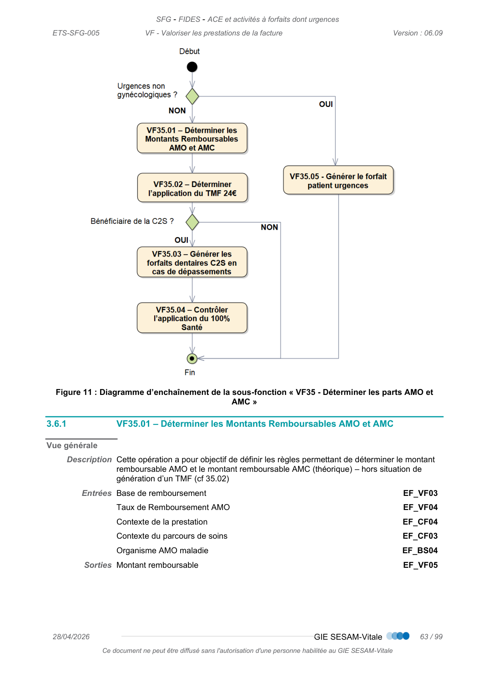
*Figure (p.263) : Figure 13 : Diagramme d’enchaînement de la sous-fonction « VF35 - Déterminer les parts AMO et*

<!-- p.263 -->
VF - Valoriser les prestations de la facture
3.6.1
VF35.01 – Déterminer les Montants Remboursables AMO et AMC
Vue générale
Description Cette opération a pour objectif de définir les règles permettant de déterminer le montant
remboursable AMO et le montant remboursable AMC (théorique) – hors situation de
génération d’un TMF (cf 35.02)
Entrées Base de remboursement
EF_VF03
Taux de Remboursement AMO
EF_VF04
Contexte de la prestation
EF_CF04
 Contexte du parcours de soins
EF_CF03
 Taux de financement
EF_CF09_07
 Organisme AMO maladie
EF_BS04
Sorties Montant remboursable
EF_VF05
Règles de
gestion
[RG_VF670] Déterminer le MRO (Montant remboursable AMO - EF_VF05_03) et le MRC théorique
(Montant Remboursable AMC - EF_VF05_04),
si le BS est dans le parcours de soins, ou non concerné par le parcours de soins
 Les établissements de santé étant soumis à l’obligation de facturer en tiers payant, ce sont
les organismes AMO qui vont prélever la MTM sur les remboursements effectués à
l’assuré.
L’indicateur de parcours de soins ne doit donc pas influer le calcul des montants
remboursables calculé par l’établissements de santé sauf pour les bénéficiaires de la C2S
pour lesquels la répartition des montants remboursables AMO et AMC est spécifique en
cas de hors parcours de soins.
Condition :
 Bénéficiaires de la C2S dont :
○ l’indicateur de Parcours de Soins (EF_CF03_01) est différent de « S » (dans le
parcours ou non concerné),
○ l’indicateur de Parcours de Soins (EF_CF03_01) vaut « S » et le Taux de
remboursement (EF_VF04_02) est 100% (car l’acte est exonéré pour d’autres
motifs plus prioritaire que la couverture C2S)
 Bénéficiaires non couvert par la C2S quel que soit l’indicateur de parcours de soins
qui signifie :
○ « dans le parcours de soins », ou
○ « non concerné par le parcours de soins ».
Le montant remboursable AMO et le montant remboursable AMC sont calculés à partir des
formules suivantes :
Montant
remboursable
Formule
MRO
(EF_VF05_03)
= Arrondi (BR_AMO x Taux de remboursement ; 2)

<!-- transcrit de p.263 (ex-figure) -->

**VF35.01 — Déterminer les Montants Remboursables AMO et AMC — Vue générale**

| Sens | Entité fonctionnelle | Code |
| --- | --- | --- |
| Entrées | Base de remboursement | EF_VF03 |
| Entrées | Taux de Remboursement AMO | EF_VF04 |
| Entrées | Contexte de la prestation | EF_CF04 |
| Entrées | Contexte du parcours de soins | EF_CF03 |
| Entrées | Taux de financement | EF_CF09_07 |
| Entrées | Organisme AMO maladie | EF_BS04 |
| Sorties | Montant remboursable | EF_VF05 |

**[RG_VF670] MRO (EF_VF05_03) et MRC théorique (EF_VF05_04) — BS dans le parcours de soins ou non concerné**

| Montant remboursable | Formule |
| --- | --- |
| MRO (EF_VF05_03) | = Arrondi (BR_AMO x Taux de remboursement ; 2) |

<!-- p.264 -->
VF - Valoriser les prestations de la facture
MRC
(EF_VF05_04)
= BR_AMC - Arrondi ( BR_AMC x Taux de remboursement ; 2)
 Le calcul du montant remboursable AMC n’est valable que pour les actes facturés à tarif
opposable car il ne tient pas compte de l’éventuel dépassement autorisé en cas de hors
parcours de soins (IPS à S) (Cf. RG_VF637).
En valorisant les données avec les valeurs suivantes :
Donnée
Valeur
BR_AMO
EF_VF03_02
BR_AMC
EF_VF03_03
Taux de remboursement
EF_VF04_02
 Cas particuliers
Seules les formules de calcul différentes du cas ci-dessus sont précisées.
[CP01] : Actes gratuits
Pour les actes gratuits (Code qualificatif de la dépense (EF_CF04_07) = « G »), le Montant
remboursable AMO (EF_VF05_02) est valorisé à 0 et le Montant remboursable AMC
(EF_VF05_03) est valorisé à 0.
Montant
remboursable
Valeur
MRO
(EF_VF05_03)
= 0
MRC
(EF_VF05_04)
= 0
[RG_VF671] Déterminer le Montant remboursable AMO (EF_VF05_03) et le Montant remboursable
AMC (EF_VF05_04) HORS parcours de soins pour les bénéficiaires C2S et hors
exonération
 Les exonérations conduisant à appliquer un taux à 100% selon les priorités de la fonction
VF34 conduisent à l’absence de ticket modérateur et par conséquent à l’absence de
pénalité de type majoration du ticket modérateur (MTM). Ces cas sont traités dans la
RG_VF670.
Condition :
 Bénéficiaire de la C2S
 ET l’indicateur de parcours de soins (EF_CF03_01) est égal à « S »
 le Taux de remboursement (EF_VF04_02) est différent de 100%
Pour les bénéficiaires de la C2S, le montant remboursable AMO doit être diminué d’une
pénalité financière et la complémentaire prend en charge cette pénalité.
Calcul de la
pénalité MTM
Cette pénalité, appelée MTM (Majoration du Ticket Modérateur) est calculée à partir de la
formule suivante :

<!-- transcrit de p.265 (ex-figure) -->

| Montant remboursable | Formule |
| --- | --- |
| MRC (EF_VF05_04) | = BR_AMC - Arrondi ( BR_AMC x Taux de remboursement ; 2) |

| Donnée | Valeur |
| --- | --- |
| BR_AMO | EF_VF03_02 |
| BR_AMC | EF_VF03_03 |
| Taux de remboursement | EF_VF04_02 |

**[CP01] Actes gratuits** (Code qualificatif de la dépense EF_CF04_07 = « G »)

| Montant remboursable | Valeur |
| --- | --- |
| MRO (EF_VF05_03) | = 0 |
| MRC (EF_VF05_04) | = 0 |

<!-- p.265 -->
VF - Valoriser les prestations de la facture
Montant
Formule
MTM
(EF_VF05_01)
= Minimum ( Arrondi ( Taux UNCAM x BR_AMO ) ; 2 ) ; plafond )
En valorisant les données avec les valeurs suivantes :
Donnée
Valeur
Taux UNCAM
(40% actuellement)
Taux de majoration du ticket modérateur en
situation de hors parcours de soins
BR_AMO
EF_VF03_02
Plafond
(Au 01/01/2023 : 10,60€7)
Tarif conventionnel de la consultation de
spécialiste * Taux UNCAM
Calcul des
montants
remboursables
En conséquence, les montants remboursables AMO et AMC sont calculés à partir des
formules suivantes :
Montant
Formule
MRO
(EF_VF05_03)
= Arrondi ( BR_AMO x Taux de remboursement ; 2 ) – MTM
(EF_VF05_01 )
MRC
(EF_VF05_04)
= BR_AMC - Arrondi ( BR_AMC x Taux de remboursement ; 2) +
MTM (EF_VF05_01)
En conséquence, les montants remboursables AMO et AMC sont calculés à partir de la
formule suivante :
Montant
Formule
MRO
(EF_VF05_03)
= Arrondi ( BR_AMO x Taux de remboursement ; 2 ) – MTM
(EF_VF05_01 )
MRC
(EF_VF05_04)
= BR_AMC - Arrondi ( BR_AMC x Taux de remboursement ; 2 )
En valorisant les données avec les valeurs suivantes :
Donnée
Valeur
BR_AMO
EF_VF03_02
BR_AMC
EF_VF03_03
Taux de remboursement
EF_VF04_02
MTM
EF_VF05_01
 Aucun dépassement n’est applicable pour les bénéficiaires de la C2S
 Cas particuliers
[CP01] : Cas de non application de la MTM
7 La convention médicale mise en œuvre le 22/12/2024, ne modifie pas ce montant.

<!-- transcrit de p.265 (ex-figure) -->

**Calcul de la pénalité MTM**

| Montant | Formule |
| --- | --- |
| MTM (EF_VF05_01) | = Minimum ( Arrondi ( Taux UNCAM x BR_AMO ) ; 2 ) ; plafond ) |

| Donnée | Valeur |
| --- | --- |
| Taux UNCAM (40% actuellement) | Taux de majoration du ticket modérateur en situation de hors parcours de soins |
| BR_AMO | EF_VF03_02 |
| Plafond (Au 01/01/2023 : 10,60€) | Tarif conventionnel de la consultation de spécialiste × Taux UNCAM |

**Calcul des montants remboursables**

| Montant | Formule |
| --- | --- |
| MRO (EF_VF05_03) | = Arrondi ( BR_AMO x Taux de remboursement ; 2 ) – MTM (EF_VF05_01) |
| MRC (EF_VF05_04) | = BR_AMC - Arrondi ( BR_AMC x Taux de remboursement ; 2) + MTM (EF_VF05_01) |

| Donnée | Valeur |
| --- | --- |
| BR_AMO | EF_VF03_02 |
| BR_AMC | EF_VF03_03 |
| Taux de remboursement | EF_VF04_02 |
| MTM | EF_VF05_01 |

<!-- p.267 -->
VF - Valoriser les prestations de la facture
Cas de non application de la MTM
Identifié par
 Les soins exécutés au titre de
l’assurance AT-MP
Nature assurance (EF_CF04_01) = « AT/MP »
 Les soins exécutés au titre de
l’assurance Maternité
Nature assurance (EF_CF04_01) =
« Maternité »
 Les soins en rapport avec une ALD
Justif d’exonération (EF_VF04_03) = « Soins
conformes au protocole ALD »
 Régime exonérant (CANSSM)
Code régime (EF_BS04_01) = « 07 »
 [CP02] : Forfaits FSD ou VDE
Lorsque l’acte est réalisé hors parcours de soins, la majoration du ticket modérateur
s’applique à l’acte CCAM ainsi qu’au forfait FSD ou VDE.
[SP03] : Bénéficiaire de la Couverture Santé Solidaire (C2S)
Pour les bénéficiaires de la C2S, la complémentaire prend en charge la MTM, le montant
remboursable AMC est donc calculé comme suit :
Montant
Formule
MRC
(EF_VF05_04)
= BR_AMC - Arrondi ( BR_AMC x Taux de remboursement ; 2) +
MTM (EF_VF05_01)

<!-- transcrit de p.272 (ex-figure) -->

**[CP01] Cas de non application de la MTM**

| Cas de non application de la MTM | Identifié par |
| --- | --- |
| Les soins exécutés au titre de l'assurance AT-MP | Nature assurance (EF_CF04_01) = « AT/MP » |
| Les soins exécutés au titre de l'assurance Maternité | Nature assurance (EF_CF04_01) = « Maternité » |
| Les soins en rapport avec une ALD | Justif d'exonération (EF_VF04_03) = « Soins conformes au protocole ALD » |
| Régime exonérant (CANSSM) | Code régime (EF_BS04_01) = « 07 » |

**[SP03] Bénéficiaire de la Couverture Santé Solidaire (C2S)**

| Montant | Formule |
| --- | --- |
| MRC (EF_VF05_04) | = BR_AMC - Arrondi ( BR_AMC x Taux de remboursement ; 2) + MTM (EF_VF05_01) |

<!-- p.267 -->
VF - Valoriser les prestations de la facture
3.6.2
VF35.02 – Déterminer l’application du TMF 24€
Vue générale
Description Pour les actes dépassant un certain tarif, le ticket modérateur qui reste à la charge de
l’assuré est remplacé par une participation forfaitaire de 24 euros.
https://www.ameli.fr/sarthe/assure/remboursements/reste-charge/forfait-24-euros
Cette opération a pour objectif de définir les règles permettant de déterminer l’application
du Ticket Modérateur Forfaitaire de 24€ (TMF).
Ce TMF ne va pas générer de prestation spécifique mais son montant va être retenu
dans la part AMO des actes concernés.
Certains régimes AMO prennent en charge le TMF
Dans le cas de la C2S, la complémentaire prend en charge le TMF.
Entrées Informations Financières
EF_VF02
Prestation
EF_IP05
 Prestation NGAP
EF_IP06
 Prestation CCAM
EF_IP08
 Prestation d'hospitalisation
EF_IP18
 Contexte de la prestation
EF_CF04
Sorties Montant remboursable
EF_VF05
Code participation assuré
EF_VF06
Rappel
Comme le stipule la RG_VF680, un TMF est généré uniquement en cas de déclenchement
de la règle du seuil. Cela signifie que les cas d’exonération de niveau facture et les cas
d’exonération de niveau actes plus prioritaire que la règle « Identifier la présence d’une
prestation (ou cumul de prestations) exonérée pour « dépassement de la règle du seuil »
ne sont pas concernées par le TMF.
 Rappel : La priorité des règles d’exonération est précisée dans les sous-fonctions de
« VF34 - Déterminer le Taux de Remboursement AMO »
Cela signifie que les situations suivantes sont de fait exclues du calcul du TMF (liste non
exhaustive se référer à VF34) : nature d’assurance maternité et AT/MP, bénéficiaires
exonérés, soins exonérés, soins en rapport avec une ALD, Soins relevant d’un programme
de prévention, bénéficiaire de l’AME.

<!-- p.268 -->
VF - Valoriser les prestations de la facture
Enchaînement
des opérations
Figure 14 : Diagramme d’enchaînement de la sous-fonction « VF35.02 - Déterminer l’application du
TMF 24€ »
Règles de
gestion
[RG_VF680] Déterminer les situations de génération du TMF 24€ pour des actes et consultations
externes
 Le déclenchement de « l’exonération de la règle du seuil » est un prérequis à la génération
d’un TMF.
Conditions :
 Il n’y a pas de MTM valide à la date de référence (EF_CF12_01) de type « ASPA »,
 Le bénéficiaire des soins n’est pas un détenu (SP 17)
 le contexte de la venue EF_BS01_05 = « prestations en environnement hospitalier » :
○  la facture ne contient pas de forfait ATU, FFM ou SE
○ la RG_VF663 Identifier la présence d’une prestation (ou cumul de prestations)
exonérée pour « dépassement de la règle du seuil » a été déclenchée par au moins
un acte CCAM de la facture
 la facture ne contient aucun acte CCAM dont la catégorie médicale (champ 12) a pour
valeur : AD, ID ou PD
En effet, la présence d’un acte dentaire exonère toute la facture d’un TMF.

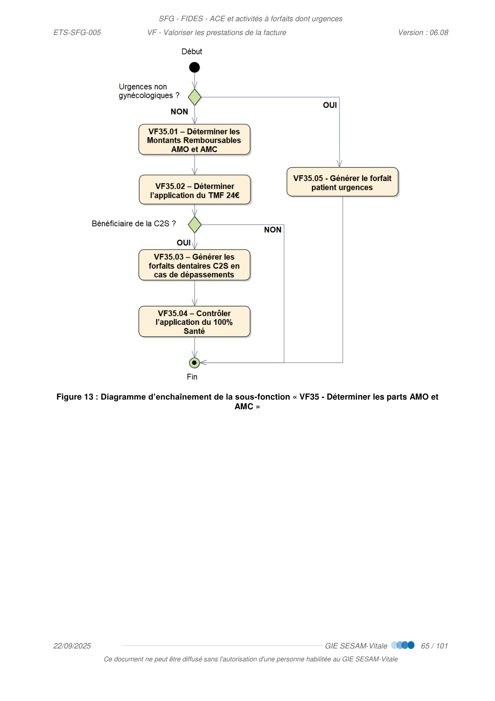
*Figure (p.268) : Figure 14 : Diagramme d’enchaînement de la sous-fonction « VF35.02 - Déterminer l’application du*

<!-- p.269 -->
VF - Valoriser les prestations de la facture
Quand les conditions précédentes sont réunies alors pour chaque date d’exécution, un
TMF peut être généré.
Ce TMF sera porté par une seule prestation parmi toutes celles qui ont été exonérées par
la règle du seuil.
 Rappel : un acte peut être exonéré même s’il n’a pas déclenché le dépassement du seuil.
La prestation qui portera le TMF sera impactée de la manière suivante :
 le montant du TMF sera retiré de la part AMO de cette prestation (Cf. RG_VF682),
sauf si le régime le prend en charge (Cf. RG_VF681).
 on renseignera la participation assuré (voir RG_VF683)
La présence ou non d’un TMF dépend des conditions ci-dessous :
Type d’actes dans la facture
Impact sur le TMF
Actes d’anesthésie
Pas de TMF pour ces actes
Actes d’imagerie (code prestation ADI)
Pas de TMF pour ces actes
Autres actes (sans présence d’actes
dentaires)
Génération d’un TMF pour chaque
spécialité de PS salariés.
Le TMF sera porté par l’acte exonéré le
plus couteux de chaque spécialité de PS
[RG_VF685] Déterminer les situations de génération du TMF 24€ en cas de forfait ATU, FFM ou
SEx
 Le déclenchement de « l’exonération de la règle du seuil » est un prérequis à la génération
d’un TMF.
Conditions :
 Il n’y a pas de MTM valide à la date de référence (EF_CF12_01) de type « ASPA »,
 Le bénéficiaire des soins n’est pas un détenu (SP 17)
 le contexte de la venue EF_BS01_05 = « prestations en environnement hospitalier »
○ et la facture contient un forfait de type ATU, FFM ou SE
○ et la RG_VF663 Identifier la présence d’une prestation (ou cumul de prestations)
exonérée pour « dépassement de la règle du seuil » a été déclenchée par au moins
un acte CCAM de la facture
Déclenchement de la RG du seuil exonérant la facture
Si la règle du seuil a été déclenchée par un acte NGAP ou un acte CCAM de type invasif
(champ 25 de la base CCAM = 1) alors un TMF unique sera généré systématiquement
pour la facture.
Ce TMF sera porté une seule prestation pour laquelle :
 on renseignera la participation assuré (voir RG_VF683)
 le montant du TMF sera retiré de la part AMO de cette prestation (Cf. RG_VF682) sauf
si le régime le prend en charge (Cf. RG_VF681).
Activités à forfait
En cas de forfait, c’est la prestation du forfait qui porte ce TMF.
En présence de plusieurs forfaits SE, c’est le plus cher (celui exonéré « C ») qui le portera.

<!-- transcrit de p.270 (ex-figure) -->

**Présence ou non d'un TMF selon le type d'actes dans la facture**

| Type d'actes dans la facture | Impact sur le TMF |
| --- | --- |
| Actes d'anesthésie | Pas de TMF pour ces actes |
| Actes d'imagerie (code prestation ADI) | Pas de TMF pour ces actes |
| Autres actes (sans présence d'actes dentaires) | Génération d'un TMF pour chaque spécialité de PS salariés. Le TMF sera porté par l'acte exonéré le plus couteux de chaque spécialité de PS |

<!-- p.270 -->
VF - Valoriser les prestations de la facture
Déclenchement de la RG du seuil n’exonérant pas la facture
Si la règle du seuil a été déclenchée par un acte CCAM non invasif (champ 25 de la base
CCAM = 2) comme détaillé dans la CP03 de la règle du seuil, alors un TMF peut être
généré.
Ce TMF sera porté par une seule prestation pour laquelle :
 le montant du TMF sera retiré de la part AMO de cette prestation (Cf. RG_VF682),
sauf si le régime le prend en charge (Cf. RG_VF681).
 la participation assuré ne devra pas être renseignée (voir CP03 de la RG_VF683)
La présence ou non d’un TMF dépend des conditions ci-dessous :
Type d’actes dans la facture
Impact sur le TMF
Acte dentaire : dont le champ 12 de la
base CCAM a pour valeur AD (acte
dentaire), ID (imagerie dentaire) ou PD
(prothèse dentaire)
Pas de TMF pour ces actes
Actes d’imagerie (code prestation ADI)
Pas de TMF pour ces actes
Autres actes (sans présence d’acte
dentaires)
Génération d’un TMF pour chaque
spécialité de PS salariés.
Le TMF sera porté par l’acte exonéré le
plus couteux de chaque spécialité de PS
[RG_VF680] Déterminer les situations de génération du TMF 24€
La RG_VF997 liste les conditions d’exonération de la « règle du seuil ».
Le TMF doit être généré selon les règles ci-dessous.
 En ACE, le numéro de l’établissement apparaît comme numéro d’exécutant sur chaque
acte réalisé, la règle s’applique aux actes réalisés avec des spécialités de PS identiques,
à la même date d’exécution (cf. consigne dans RG_VF600).
Situation identifiée par
Pour chaque praticien
de la facture à la
même date
d’exécution
          1 seul acte CCAM exonéré par la règle du seuil sur la facture
OU    1 seul acte NGAP > 60
           plusieurs actes CCAM exonérés par la règle du seuil sur la facture
OU     plusieurs actes NGAP avec le cumul des coefficients > 60
 Cas particuliers
[CP01] : Actes dentaires
Les actes dentaires ne sont pas soumis au TMF, la règle ne s’applique pas.
Les actes dentaires en CCAM sont identifiés :
 avec une catégorie médicale = « AD - acte dentaire » cf. champ 12 de la CCAM,
 ou avec une spécialité d’exécutant = 19 ou 36
[SP06] : AME
En cas de présence d’actes couteux dans la facture, l’exonération pour actes couteux doit
être portée au niveau des actes concernés.
Néanmoins le TMF n’est pas généré car les bénéficiaires de l’AME ne sont pas soumis au
TMF.
 [SP17] : Détenus
Les détenus ne sont pas soumis au TMF, la règle ne s’applique pas.

<!-- transcrit de p.270 (ex-figure) -->

**Présence ou non d'un TMF selon le type d'actes dans la facture (RG du seuil n'exonérant pas la facture)**

| Type d'actes dans la facture | Impact sur le TMF |
| --- | --- |
| Acte dentaire : dont le champ 12 de la base CCAM a pour valeur AD (acte dentaire), ID (imagerie dentaire) ou PD (prothèse dentaire) | Pas de TMF pour ces actes |
| Actes d'imagerie (code prestation ADI) | Pas de TMF pour ces actes |
| Autres actes (sans présence d'acte dentaires) | Génération d'un TMF pour chaque spécialité de PS salariés. Le TMF sera porté par l'acte exonéré le plus couteux de chaque spécialité de PS |

**[RG_VF680] Situation identifiée par (pour chaque praticien de la facture à la même date d'exécution)**

| Situation identifiée par |
| --- |
| 1 seul acte CCAM exonéré par la règle du seuil sur la facture OU 1 seul acte NGAP > 60 |
| plusieurs actes CCAM exonérés par la règle du seuil sur la facture OU plusieurs actes NGAP avec le cumul des coefficients > 60 |

<!-- p.271 -->
VF - Valoriser les prestations de la facture
 [RG_VF681] Déterminer les situations où le régime (AMO) prend en charge le TMF
Certains régimes prennent en charge le TMF.
Quand le régime prend en charge le TMF :
 le calcul des montants des prestations se fait comme lors d’une exonération (taux à
100%) en utilisant les formules habituelles de calcul du MRO.
 de plus il faut déterminer le code participation assuré (Cf. RG_VF683).
La table suivante précise les régimes qui prennent en charge le TMF
 Cf. [TABLES] - Table 101.1 : Modalités de prise en charge du TMF
 Cas particuliers
[CP01] : présence d’une modulation d’exonération RLF/ RLAM
Condition : Libellé MTM valide à la date de référence (EF_CF12_01) = « Régime Local
frontalier » ou « Régime Local Alsace-Moselle ».
Dans ces situations, le régime Local prend en charge le TMF, le calcul des montants des
prestations se fait comme lors d’une exonération (taux à 100%). Ce cas particulier est donc
assimilé à une prise en charge du régime AMO.

<!-- p.267 -->
VF - Valoriser les prestations de la facture
[RG_VF684] Déterminer les situations d’exonération du TMF
Dans les situations suivantes, le TMF est exonéré :
Situation d’exonération du TMF
 Nature d’assurance Maternité
 Bénéficiaire exonéré (pension militaire, invalidité, etc.)
 Soins en rapport avec une ALD
 Soins particuliers exonérés
 Soins relevant d’un programme de prévention
 Allocation de Solidarité aux Personnes Agées (ASPA)
 Quand le BS est exonéré du TMF, le calcul des montants des prestations se fait comme
lors d’une exonération (taux à 100%), le code participation assuré sera à blanc.
[RG_VF682] Déterminer les montants remboursables AMO et AMC en cas de TMF non pris en
charge par le régime AMO
Conditions :
 Un TMF est à appliquer sur un acte exonéré par la règle du seuil selon la RG_VF680
ou la RG_VF685
 le régime AMO ne prend pas en charge le TMF (le résultat de RG_VF681 est non).
TMF sur l’acte ayant déclenché la règle du seuil ou sur le forfait ATU/FFM/SEx
Lorsque le TMF est porté par un acte ayant déclenché la règle du seuil ou un forfait de type
ATU/FFM/ SEx alors le montant remboursable AMO est calculé à partir de la formule
suivante :
Donnée
Valeur
MRO (EF_VF05_03)
= Arrondi ( BR_AMO x 100% ; 2 ) – TMF
Le Montant remboursable AMC sera renseigné tel que :
Donnée
Valeur
MRC (EF_VF05_04)
= 0
 La complémentaire santé peut prendre en charge le TMF en le transmettant dans les
factures à destination des AMC.
 Cas particuliers
[SP03] : Bénéficiaire de la Couverture Santé Solidaire (C2S)
Dans le cas de la C2S, la complémentaire prend en charge le TMF. Le Montant
remboursable AMC sera renseigné tel que :
Donnée
Valeur
MRC (EF_VF05_04)
= TMF

<!-- transcrit de p.272 (ex-figure) -->

**[RG_VF684] Situations d'exonération du TMF**

| Situation d'exonération du TMF |
| --- |
| Nature d'assurance Maternité |
| Bénéficiaire exonéré (pension militaire, invalidité, etc.) |
| Soins en rapport avec une ALD |
| Soins particuliers exonérés |
| Soins relevant d'un programme de prévention |
| Allocation de Solidarité aux Personnes Agées (ASPA) |

**[RG_VF682] Montants remboursables AMO et AMC en cas de TMF non pris en charge par le régime AMO — TMF sur l'acte ayant déclenché la règle du seuil ou sur le forfait ATU/FFM/SEx**

| Donnée | Valeur |
| --- | --- |
| MRO (EF_VF05_03) | = Arrondi ( BR_AMO x 100% ; 2 ) – TMF |
| MRC (EF_VF05_04) | = 0 |

**[SP03] Bénéficiaire de la C2S** — la complémentaire prend en charge le TMF :

| Donnée | Valeur |
| --- | --- |
| MRC (EF_VF05_04) | = TMF |

<!-- p.272 -->
VF - Valoriser les prestations de la facture
[RG_VF683] Déterminer le code participation assuré (EF_VF06_01)
Le Code participation assuré est renseigné si présence d’une situation de génération du
TMF.
Ce code détermine qui va prendre en charge le TMF. Il est à renseigner à chaque ligne
d’acte où le TMF a été déduit (ou aurait dû en cas de prise en charge par le régime AMO),
et prend les valeurs suivantes :
 « R » pour signifier à charge du régime ; (cf. RG_VF681),
 « A » pour signifier Autres cas (assuré ou AMC ou C2S)
 « L » pour signifier régime Alsace-Moselle et Régime Local Frontalier
 Cas particuliers
[CP03] : Facture comportant un ou plusieurs actes exonérés par la règle du seuil
mais n’exonérant pas toute la facture.
Conditions
 Cas des activités à forfaits :
○ la facture contient un forfait de type ATU, FFM ou SE
○ et le cas particulier CP03 de la RG_VF663 Identifier la présence d’une prestation
(ou cumul de prestations) exonérée pour « dépassement de la règle du seuil » a
été déclenché
Si la facture comporte un ou plusieurs actes exonérés par la règle du seuil mais
n’exonérant pas toute la facture, alors le code participation assuré ne doit pas être
renseigné (à blanc).
Illustration
Figure 15 : illustration du remplissage du champ « participation assuré »

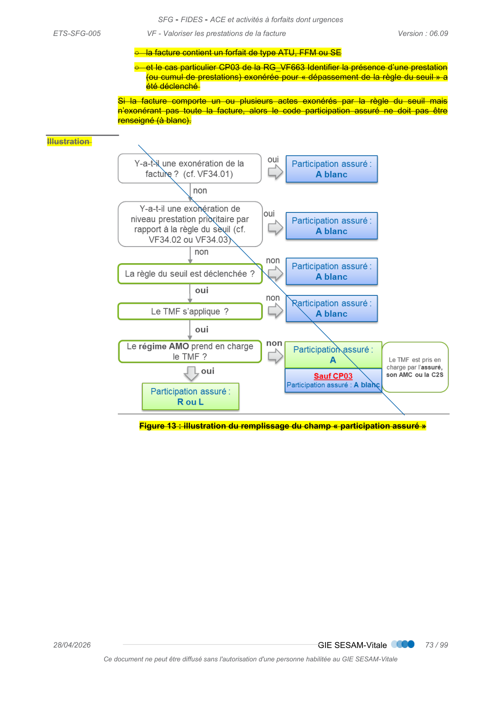
*Figure (p.273) : Figure 15 : illustration du remplissage du champ « participation assuré »*

<!-- p.274 -->
VF - Valoriser les prestations de la facture
3.6.3
VF35.03 – Générer les forfaits dentaires C2S en cas de dépassement
Vue générale
Description À chaque acte dentaire support (CCAM ou NGAP) correspond un code forfait dentaire
CMU-C facturable pour un bénéficiaire des soins qui bénéficie de la C2S (FDA, FDC, …).
A chaque code est associé un montant maximum pris en charge pour ce forfait.
Les montants maximaux pris en charge des forfaits dentaires CMU-C font l’objet d’un
arrêté publié au Journal Officiel.
Ces forfaits dentaires, facturables dans le cas où le bénéficiaire des soins bénéficie de la
C2S sont appelés « forfaits dentaires CMU-C » dans les bases NGAP et CCAM.
 Forfait dentaire C2S dans le panier de biens
○ L’acte dentaire support (CCAM ou NGAP) est facturé au tarif conventionnel sans
dépassement ;
○ L’acte « forfait dentaire CMU-C » correspond au dépassement.
 Forfait dentaire C2S hors panier de biens
○ Pour certains actes CCAM dentaires, un dépassement au-delà du montant maximal
de dépassement autorisé est possible. Dans ce cas, une part reste à la charge de
l’assuré.
○ Le montant facturé sur l’acte CCAM est supérieur au tarif conventionnel
○ L’acte « forfait dentaire CMU-C » utilisé est nécessairement le code prestation FPC
Entrées Base de remboursement
EF_VF03
 Situation particulière valide à la date de référence
EF_CF10
 Prestation
EF_IP05
 Prestation NGAP
EF_IP06
 Prestation CCAM
EF_IP08
Sorties Complément de prestation
EF_CF05
Regroupement de prestations
EF_VF01
Informations Financières
EF_VF02
Base de remboursement
EF_VF03
Taux de Remboursement AMO
EF_VF04
Montant remboursable
EF_VF05
Contexte de la prestation
EF_CF04
Règles de
gestion

<!-- p.275 -->
VF - Valoriser les prestations de la facture
[RG_VF690] Déterminer les situations de génération d’un forfait dentaire C2S
Les conditions permettant la génération d’un forfait dentaire C2S sont les suivantes :
Conditions
identifiée par
Le bénéficiaire est C2S
Code situation particulière valide à la date de
référence (EF_CF10_01) = « SP03 »
et La prestation rentre dans
le panier de soins de la
C2S
La prestation (dentaire) doit permettre la facturation
d’un forfait dentaire.
 La liste des forfaits dentaires C2S facturables
pour un acte CCAM dentaire est consultable dans
la base CCAM. Elle correspond au champ 52 de
la base.
 La liste des forfaits dentaires C2S facturables
pour un acte NGAP dentaire est consultable dans
la table suivante :
 Cf. [TABLES] , Table 1: Codes prestation.
Et il existe la présence d’un
dépassement pris en
charge au titre de la C2S
Minimum entre :
 Le Montant honoraire (EF_VF02_03) et
 Le Prix maximum autorisé pour un bénéficiaire de
la C2S 8 – BR_AMO (EF_VF03_02)
[RG_VF691] Générer le forfait dentaire C2S
La génération du forfait dentaire se matérialise par la création d’un complément de
prestation (EF_CF05) ainsi que son regroupement9 (EF_VF01) :
 Code prestation (complément)
(EF_CF05_01) ;
○ Valorisé avec le code prestation du forfait dentaire
 Niveau
(EF_CF05_02) ;
○ Valorisé à « Complément »
 Catégorie
(EF_CF05_03) ;
○ Valorisé à « Majoration »
 Sous-catégorie
 (EF_CF05_04) ;
○ Valorisé à « Forfait C2S »
 Nomenclature
(EF_CF05_05) ;
○ Valorisé avec « NGAP »
 Coefficient du complément regroupé
(EF_VF01_01) ;
○ Valorisé à « 1 »
 Quantité du complément regroupé
(EF_VF01_02).
○ Valorisé à « 1 »
 Dénombrement du complément regroupé
(EF_VF01_03).
○ Valorisé à « 1 »
8 Les montants maximum de prise en charge des forfaits dentaires C2S font l’objet d’un arrêté CMU-C publié
au Journal Officiel
9 Le regroupement, dans le cas présent, ne contient qu’une seule prestation

<!-- transcrit de p.275 (ex-figure) -->

**[RG_VF690] Déterminer les situations de génération d'un forfait dentaire C2S — conditions**

| Conditions | identifiée par |
| --- | --- |
| Le bénéficiaire est C2S | Code situation particulière valide à la date de référence (EF_CF10_01) = « SP03 » |
| **et** La prestation rentre dans le panier de soins de la C2S | La prestation (dentaire) doit permettre la facturation d'un forfait dentaire. • La liste des forfaits dentaires C2S facturables pour un acte CCAM dentaire est consultable dans la base CCAM. Elle correspond au champ 52 de la base. • La liste des forfaits dentaires C2S facturables pour un acte NGAP dentaire est consultable dans la table suivante : Cf. [TABLES], Table 1: Codes prestation. |
| **Et** il existe la présence d'un dépassement pris en charge au titre de la C2S | Minimum entre : • Le Montant honoraire (EF_VF02_03) et • Le Prix maximum autorisé pour un bénéficiaire de la C2S – BR_AMO (EF_VF03_02) |

<!-- p.276 -->
VF - Valoriser les prestations de la facture
 Cas particulier
[CP01] – Présence d’une exigence particulière
Dans le cas d’une exigence particulière – « Top exigence particulière » (EF_CF04_11 =
VRAI) – si le dépassement dépasse le montant maximum autorisé, le forfait dentaire FPC
doit être renseigné dans le Code prestation (complément).
[RG_VF692] Déterminer les informations financières, le taux, le montant remboursable AMO et la
Base de Remboursement du forfait dentaire C2S
 Prix unitaire
(EF_VF02_02) ;
○ Valorisé avec le Tarif conventionnel du Forfait publié au JO
 Montant des honoraires
(EF_VF02_03) ;
○ Valorisé aves le Prix Unitaire
 Base de remboursement AMO
(EF_VF03_02) ;
○ Valorisé à « 0 »
 Taux de remboursement
(EF_VF04_02) ;
○ Valorisé à « 0 »
 Montant remboursable AMO
(EF_VF05_03) ;
○ Valorisé à « 0 »
[RG_VF693] Déterminer le code qualificatif de la dépense du forfait dentaire C2S
 Code qualificatif de la dépense
(EF_CF04_07) ;
○ Valorisé à « N »
[RG_VF694] Défalquer le montant du forfait de la prestation de soins
Cas 1 : Forfait dentaire C2S dans le panier de biens (pas de dépassement du Prix
maximum autorisé pour un bénéficiaire de la C2S).
L’acte dentaire support (CCAM ou NGAP) est facturé au tarif conventionnel sans
dépassement, càd, le montant des honoraires (EF_VF02_03) = Base de remboursement
AMO (EF_VF03_02)
 L’acte forfait dentaire CMU-C correspond donc au dépassement.
Cas 2 : Forfait dentaire C2S hors panier de biens (dépassement pour exigence
particulière du Prix maximum autorisé pour un bénéficiaire de la C2S)
Le montant facturé sur l’acte CCAM est supérieur au tarif conventionnel càd, le montant
des honoraires (EF_ »VF02_03) = Base de remboursement AMO (EF_VF03_02) +
dépassement au-delà du montant maximum autorisé
 L’acte forfait dentaire CMU-C (FPC) correspond au dépassement autorisé

<!-- transcrit de p.276 (ex-figure) -->

**[RG_VF692] Déterminer les informations financières, le taux, le montant remboursable AMO et la Base de Remboursement du forfait dentaire C2S**

| Donnée | Valorisation | Entité fonctionnelle |
| --- | --- | --- |
| Prix unitaire | Tarif conventionnel du Forfait publié au JO | EF_VF02_02 |
| Montant des honoraires | Prix Unitaire | EF_VF02_03 |
| Base de remboursement AMO | 0 | EF_VF03_02 |
| Taux de remboursement | 0 | EF_VF04_02 |
| Montant remboursable AMO | 0 | EF_VF05_03 |

**[RG_VF693] Déterminer le code qualificatif de la dépense du forfait dentaire C2S**

| Donnée | Valorisation | Entité fonctionnelle |
| --- | --- | --- |
| Code qualificatif de la dépense | N | EF_CF04_07 |

<!-- p.277 -->
VF - Valoriser les prestations de la facture
[RG_VF_RC19] Contrôler la Compatibilité du forfait dentaire (au titre de la C2S) avec le Code acte
CCAM (EF_IP08_01) de l'acte support
Cette règle a pour objet d'assurer la compatibilité entre une prestation de type forfait C2S
et le code de l'acte CCAM de la prestation support à laquelle le forfait C2S se rapporte.
Pour tout code prestation de type forfait C2S10, il convient de vérifier que ce forfait C2S est
bien compatible, à la date d’exécution, avec l’acte CCAM support auquel le forfait est
rattaché.
Pour un acte CCAM donné, la liste des codes forfaits C2S compatibles est contenue dans
le champ n°52 de la base CCAM.
[RG_VF695] Contrôler le Montant restant à charge de l'assuré en C2S
Dans le cas de la C2S, le TM est pris en charge par la complémentaire C2S, le reste à
charge est calculé comme suit :
Montant restant à charge de l’assuré =
Montant des honoraires – MRO – MRC Théorique
En valorisant les données avec les valeurs suivantes :
Donnée
Valeur
Montant des honoraires
EF_VF02_03
MRO
EF_VF05_03
MRC
EF_VF05_04
 Le montant restant à charge de l’assuré de chaque prestation doit être nul (aucun
dépassement) sauf si un forfait hors panier de bien (FPC) a été facturé.
Exemples de facturation en présence de forfaits dentaires C2S :
 Exemple 1 : Forfait C2S dans le panier de biens
Code
Prestation /
Code
regroupement
Code CCAM
Qté Coeff
Dén
om
bre
men
t
Justif
d’Exo
PU
Base
remb.
Taux
remb.
Mnt
Remb.
AMO
Mt des
honorair
es
Qualif.
de la
dépense
Mnt.
Remb.
AMC
Reste
à
charge
à 70 %
PAR
HBLD138
1
1
1
0
139,75
139,75
70
97,83
139,75
41,92
0
FDA
1
1
1
0
294,25
0
0
0
294,25
N
294,25
0
Total
434,00
bénéf.
exonéré
PAR
HBLD138
1
1
1
4
139,75
139,75
100
139,75
139,75
0
0
FDA
1
1
1
0
294,25
0
0
0
294,25
N
294,25
0
Total
434,00
 Exemple 2 : Forfait C2S hors panier de biens
Code
Prestation /
Code
regroupement
Code CCAM
Qté Coeff
Dén
om
bre
men
t
Justif
d’Exo
PU
Base
remb.
Taux
remb.
Mnt
Remb.
AMO
Mt des
honorair
es
Qualif.
de la
dépense
Mnt.
Remb.
AMC
Reste à
charge
à 70 %
PFC
HBLD036
1
1
1
0
107,50
107,50
70
75,25
277,50
32,25
170,00
10 Le code prestation est identifié par le système comme un code forfait CMU-C s’il est présent dans la TB21 : table des forfaits CMU-C gérés dans la
base CCAM

<!-- transcrit de p.277 (ex-figure) -->

**[RG_VF695] Contrôler le Montant restant à charge de l'assuré en C2S**

Montant restant à charge de l'assuré = Montant des honoraires – MRO – MRC Théorique

| Donnée | Valeur |
| --- | --- |
| Montant des honoraires | EF_VF02_03 |
| MRO | EF_VF05_03 |
| MRC | EF_VF05_04 |

**Exemple 1 : Forfait C2S dans le panier de biens**

| | Code Prestation / Code regroupement | Code CCAM | Qté | Coeff | Dénombrement | Justif d'Exo | PU | Base remb. | Taux remb. | Mnt Remb. AMO | Mt des honoraires | Qualif. de la dépense | Mnt. Remb. AMC | Reste à charge |
| --- | --- | --- | --- | --- | --- | --- | --- | --- | --- | --- | --- | --- | --- | --- |
| à 70 % | PAR | HBLD138 | 1 | 1 | 1 | 0 | 139,75 | 139,75 | 70 | 97,83 | 139,75 | | 41,92 | 0 |
| | FDA | | 1 | 1 | 1 | 0 | 294,25 | 0 | 0 | 0 | 294,25 | N | 294,25 | 0 |
| | **Total** | | | | | | | | | | 434,00 | | | |
| bénéf. exonéré | PAR | HBLD138 | 1 | 1 | 1 | 4 | 139,75 | 139,75 | 100 | 139,75 | 139,75 | | 0 | 0 |
| | FDA | | 1 | 1 | 1 | 0 | 294,25 | 0 | 0 | 0 | 294,25 | N | 294,25 | 0 |
| | **Total** | | | | | | | | | | 434,00 | | | |

**Exemple 2 : Forfait C2S hors panier de biens** (suite p.284)

| | Code Prestation / Code regroupement | Code CCAM | Qté | Coeff | Dénombrement | Justif d'Exo | PU | Base remb. | Taux remb. | Mnt Remb. AMO | Mt des honoraires | Qualif. de la dépense | Mnt. Remb. AMC | Reste à charge |
| --- | --- | --- | --- | --- | --- | --- | --- | --- | --- | --- | --- | --- | --- | --- |
| à 70 % | PFC | HBLD036 | 1 | 1 | 1 | 0 | 107,50 | 107,50 | 70 | 75,25 | 277,50 | | 32,25 | 170,00 |

<!-- p.277 -->
VF - Valoriser les prestations de la facture
FPC
1
1
1
0
122,50
0
0
0
122,50
N
122,50
0
Total
400,00
bénéf.
exonéré
PFC
HBLD036
1
1
1
4
107,50
107,50
100
107,50
277,50
0
170,00
FPC
1
1
1
0
122,50
0
0
0
122,50
N
122,50
0
Total
400,00
 Les montants utilisés dans l’exemple ci-dessus sont mentionnés à titre d'exemple, et
peuvent évoluer en fonction des tarifs conventionnels.

<!-- transcrit de p.277 (ex-figure) -->

**Exemple 2 : Forfait C2S hors panier de biens (suite)**

| | Code Prestation / Code regroupement | Code CCAM | Qté | Coeff | Dénombrement | Justif d'Exo | PU | Base remb. | Taux remb. | Mnt Remb. AMO | Mt des honoraires | Qualif. de la dépense | Mnt. Remb. AMC | Reste à charge |
| --- | --- | --- | --- | --- | --- | --- | --- | --- | --- | --- | --- | --- | --- | --- |
| à 70 % (suite) | FPC | | 1 | 1 | 1 | 0 | 122,50 | 0 | 0 | 0 | 122,50 | N | 122,50 | 0 |
| | **Total** | | | | | | | | | | 400,00 | | | |
| bénéf. exonéré | PFC | HBLD036 | 1 | 1 | 1 | 4 | 107,50 | 107,50 | 100 | 107,50 | 277,50 | | 0 | 170,00 |
| | FPC | | 1 | 1 | 1 | 0 | 122,50 | 0 | 0 | 0 | 122,50 | N | 122,50 | 0 |
| | **Total** | | | | | | | | | | 400,00 | | | |

> Les montants utilisés dans l'exemple ci-dessus sont mentionnés à titre d'exemple, et peuvent évoluer en fonction des tarifs conventionnels.

<!-- p.278 -->
VF - Valoriser les prestations de la facture
3.6.4
VF35.04 – Contrôler l’application du 100% Santé
Vue générale
Description Cette opération a pour objectif de définir les contrôles à mettre en place dans le cadre du
100% pour les actes dentaires.
Entrées Base de remboursement
EF_VF03_02
 Montant des honoraires
EF_VF02_03
Sorties Aucune
Règles de
gestion
[RG_VF_P5] Contrôler le respect des plafonds des actes prothétiques
Cette règle a pour objet de vérifier, pour tout code acte CCAM facturé, s’il est présent à la
date des soins dans la table des plafonds dentaires (cf. table PFD) que le montant du
plafond autorisé, n’est pas dépassé :
 Le montant des honoraires (EF_VF02_03) doit être inférieur ou égal au montant du
plafond autorisé.
Dans le cas contraire, le système de facturation doit alerter le PS du non-respect des
plafonds.
 Cas particuliers
[SP03] : Bénéficiaire de la C2S
Dans le cas particulier de facturation d’un acte CCAM suivi d’un forfait dentaire C2S :
 Acte CCAM : le montant des honoraires (EF_VF02_03) doit être égal à la base de
remboursement (EF_VF03_02).
 Forfait C2S : le montant des honoraires du forfait (EF_VF02_03) ne doit pas dépasser
le montant du plafond autorisé diminué du montant des honoraires (EF_VF02_03) de
l’acte CCAM qui le précède.
○ Le montant du plafond autorisé est lu par le système de facturation dans la table
des plafonds pour le couple code acte CCAM, forfait C2S facturé.
Dans ce cas particulier de C2S, le logiciel doit également alerter le PS en cas de non-
respect des plafonds C2S.
 Cas d’erreur en cas de facturation de forfait C2S :
Si le couple code acte CCAM, code forfait C2S n’est pas présent dans la table des
plafonds dentaires, le LPS informe le Professionnel de Santé que le code forfait C2S
n’est pas présent dans la table des plafonds pour le code acte CCAM avec lequel il
est facturé.
 Cf. [TABLES] Table PFD : Table des plafonds dentaires
 [RG_VF_P6] Contrôler le respect des tarifs opposables des soins dentaires (hors prothèses)
Conditions : concerne uniquement les chirurgiens-dentistes, ainsi que les stomatologues
depuis le.1er Avril 2019.
Cette règle a pour objet de vérifier, pour toute prestation soumise au respect des tarifs
opposables (cf. Table 2ter) que le montant du dépassement est nul.
Dans le cas contraire, le Professionnel de Santé est alerté du non-respect des tarifs
opposables.
La mesure est effective au 01/01/20.

<!-- p.279 -->
VF - Valoriser les prestations de la facture
PS concernés
Pour le contrôle des prestations dentaires :
18 stomatologues
19 Chirurgien-dentiste,
44 : chirurgie maxillo-faciale
45 : chirurgie maxillo-faciale et stomatologie
53 Chirurgien-Dentiste spécialité C.O
54 Chirurgien-Dentiste spécialité M.B.D
69 : chirurgie orale
 Cf. [TABLES] Table 2ter : Codes Prestations soumis au respect du tarif opposable

<!-- p.280 -->
VF - Valoriser les prestations de la facture
3.6.5
VF35.05 – Générer le forfait patient urgences
Vue générale
Description Le forfait patient urgences est une participation forfaitaire à la charge des patients par
passage aux urgences non gynécologiques. Elle est générée dans le cadre de soins non
programmés non suivis d’hospitalisation, hors urgences gynécologiques (ATU
gynécologiques). Le forfait patient urgences peut être pris en charge par le régime dans
certaines situations. Il peut être nominal ou minoré. Dans les situations où il est minoré, il
s’accompagne d’un complément de forfait patient urgences à la charge de l’AMO (CFU).
 Cf. I de l’article L. 160-13 du code de la sécurité sociale
Entrées Situation particulière valide à la date de référence
EF_CF10
 Contexte de la prestation
EF_CF04
 ETM valide à la date de référence
EF_CF11
 MTM valide à la date de référence
EF_CF12
 Justificatif d’exonération de la prestation
EF_VF04_03
Sorties Complément de prestation
EF_CF05
 Regroupement de prestations
EF_VF01
 Informations Financières
EF_VF02
 Base de remboursement
EF_VF03
 Taux de Remboursement AMO
EF_VF04
 Montant remboursable
EF_VF05
Enchainement de
fonctions
Figure 16 : Diagramme d’enchaînement de la sous-fonction « VF35.05 – Générer le forfait patient
urgences»

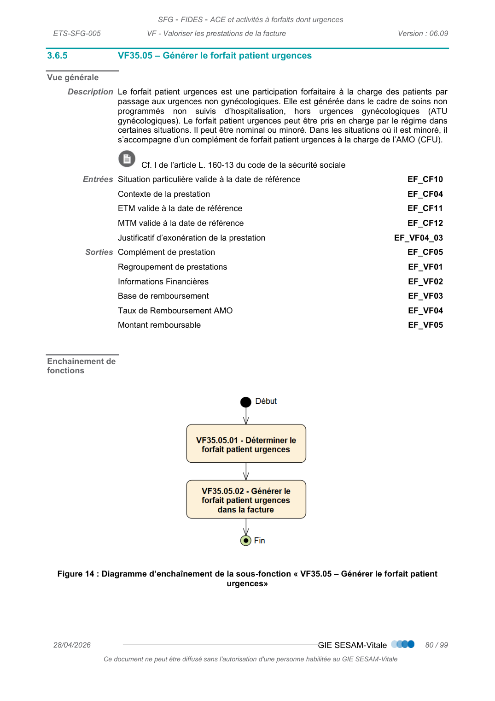
*Figure (p.280) : Figure 16 : Diagramme d’enchaînement de la sous-fonction « VF35.05 – Générer le forfait patient*

<!-- p.281 -->
VF - Valoriser les prestations de la facture
3.6.5.1
VF35.05.01 – Déterminer le forfait patient urgences
Vue générale
Description Cette fonctionnalité peut être réalisée dès lors que les informations liées au bénéficiaire
des soins sont connues, et que le patient a bénéficié d’une prise en charge complète au
sein de la structure des urgences, c’est-à-dire à l’exclusion des expérimentations de
réorientation ou des cas patients partis sans attendre le début de leur prise en charge.
L’acquisition des forfaits urgences n’est pas nécessaire comme condition de
déclenchement de ce sous-processus.
Entrées Contexte de Facturation de niveau prestation
EF_CF
Sorties Forfait patient urgences
EF_VF
Enchainement de
fonctions
Le schéma ci-dessous- représente la priorisation d’usage des RG qui suivent :

<!-- p.282 -->
VF - Valoriser les prestations de la facture
Figure 17 : Diagramme d’enchaînement de la sous-fonction « VF35.05.01 - Déterminer le forfait
patient urgences»
Le forfait patient urgences peut être pris en charge par le régime dans certaines situations
(RG_VF501). Il peut être nominal ou minoré (RG_VF502). Dans les situations où il est
minoré, il s’accompagne d’un complément de forfait patient urgences à la charge de l’AMO
(CFU).

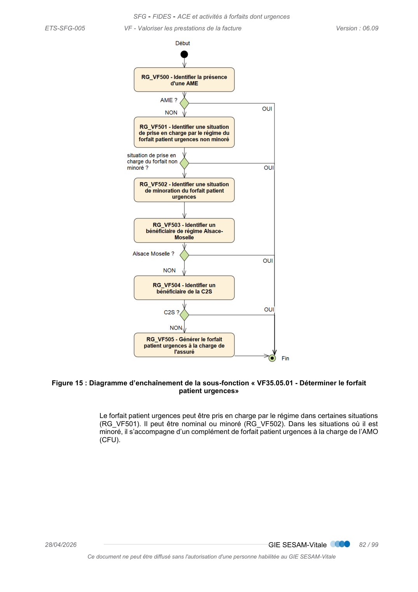
*Figure (p.282) : Figure 17 : Diagramme d’enchaînement de la sous-fonction « VF35.05.01 - Déterminer le forfait*

<!-- p.283 -->
VF - Valoriser les prestations de la facture
Règles de
gestion
[RG_VF500] Identifier la présence d’une AME
Pour les bénéficiaires de l’AME (SP06), un forfait FPU (participation assuré nominale) est
généré sous la forme d’un complément de prestation (EF_CF05_01).
Il est pris en charge par l’AME.
Situation d’exonération du
forfait patient urgences
Identifiée par
Motif d’exonération pour le
forfait patient urgences FPU
Bénéficiaires de l’AME
SP06
aucun
Les données suivantes sont valorisées :
 Montant des honoraires
(EF_VF02_03) ;
○ Valorisé avec le Prix Unitaire
 Base de remboursement AMO
(EF_VF03_02) ;
○ Valorisée à 0
 Taux de remboursement
(EF_VF04_02) ;
○ Valorisé à «0% »
 Montant remboursable AMO
(EF_VF05_03) ;
○ Valorisé à 0
 Montant remboursable AMC
(EF_VF05_04) ;
○ Valorisé à Prix Unitaire

<!-- transcrit de p.283 (ex-figure) -->

**[RG_VF500] Identifier la présence d'une AME**

Pour les bénéficiaires de l'AME (SP06), un forfait **FPU** (participation assuré nominale) est généré sous la forme d'un complément de prestation (EF_CF05_01). Il est pris en charge par l'AME.

| Situation d'exonération du forfait patient urgences | Identifiée par | Motif d'exonération pour le forfait patient urgences FPU |
| --- | --- | --- |
| Bénéficiaires de l'AME | SP06 | aucun |

| Donnée | Valorisation | Entité fonctionnelle |
| --- | --- | --- |
| Montant des honoraires | Prix Unitaire | EF_VF02_03 |
| Base de remboursement AMO | 0 | EF_VF03_02 |
| Taux de remboursement | 0% | EF_VF04_02 |
| Montant remboursable AMO | 0 | EF_VF05_03 |
| Montant remboursable AMC | Prix Unitaire | EF_VF05_04 |

<!-- p.283 -->
VF - Valoriser les prestations de la facture
[RG_VF501] Identifier une situation médico-administrative permettant la prise en charge par le
régime du forfait patient urgences non minoré
Dans les situations du tableau ci-dessous, un forfait patient urgences FPX est généré sous
la forme d’un complément de prestation (EF_CF05_01).
Dans tous ces cas, le forfait est pris en charge par le régime.
Situation d’exonération du
forfait patient urgences
Identifiée par
Justificatif
d’exonération de la
prestation
(EF_VF04_03)
Bénéficiaires de
l'assurance maternité
Conditions listées dans la
RG_CF653, et donnant
lieu à la détermination de
la Nature assurance
(EF_CF04_01) =
Maternité
Pas d’exonération
Soins des enfants
nouveau-nés dans les
trente jours suivant leur
naissance.
Soins pour un nouveau-
né au cours des 30 jours
suivant la naissance
 « Traitement exonérant »
(Exo 3)
Victimes d’attentats, article
L169-1 du CSS
« Assuré ou Bénéficiaire
exonéré (régime
exonérant) »
 (Exo 5)
Situations de risque
sanitaire grave et
exceptionnel
article L16-10-1
Règle de valorisation
communiquée au cas par
cas par l’assurance
maladie
Soins consécutifs à des
sévices sexuels subis par
des mineurs (15° de
l’article L 160-14)
Soins consécutifs à des
sévices sexuels subis par
des mineurs
« Traitement exonérant »
(Exo 3)
Détenus
SP17
« Assuré ou
Bénéficiaire exonéré
(régime exonérant) »
(Exo 5)
Rente AT
Libellé MTM valide à la
date de référence
(EF_CF12_01) : Rente
AT
 « Assuré ou
Bénéficiaire exonéré
(régime exonérant) »
(Exo 5)
« Pension militaire » ou
« Invalidité »
Libellé ETM valide à la
date de référence
(EF_CF11_01) =
« Pension militaire » ou
« Invalidité »
 « Assuré ou
Bénéficiaire exonéré
(régime exonérant) »
(Exo 5)
Régime exonérant
(CANSSM)
Code régime
(EF_BS04_01) = « 07 »
« Régimes spéciaux
SNCF et MINES »
(Exo 6)

<!-- transcrit de p.284 (ex-figure) -->

**[RG_VF501] Identifier une situation médico-administrative permettant la prise en charge par le régime du forfait patient urgences non minoré** — forfait **FPX** (complément de prestation EF_CF05_01), pris en charge par le régime

| Situation d'exonération du forfait patient urgences | Identifiée par | Justificatif d'exonération de la prestation (EF_VF04_03) |
| --- | --- | --- |
| Bénéficiaires de l'assurance maternité | Conditions listées dans la RG_CF653, et donnant lieu à la détermination de la Nature assurance (EF_CF04_01) = Maternité | Pas d'exonération |
| Soins des enfants nouveau-nés dans les trente jours suivant leur naissance. | Soins pour un nouveau-né au cours des 30 jours suivant la naissance | « Traitement exonérant » (Exo 3) |
| Victimes d'attentats, article L169-1 du CSS | | « Assuré ou Bénéficiaire exonéré (régime exonérant) » (Exo 5) |
| Situations de risque sanitaire grave et exceptionnel article L16-10-1 | | Règle de valorisation communiquée au cas par cas par l'assurance maladie |
| Soins consécutifs à des sévices sexuels subis par des mineurs (15° de l'article L 160-14) | Soins consécutifs à des sévices sexuels subis par des mineurs | « Traitement exonérant » (Exo 3) |
| Détenus | SP17 | « Assuré ou Bénéficiaire exonéré (régime exonérant) » (Exo 5) |
| Rente AT | Libellé MTM valide à la date de référence (EF_CF12_01) : Rente AT | « Assuré ou Bénéficiaire exonéré (régime exonérant) » (Exo 5) |
| « Pension militaire » ou « Invalidité » | Libellé ETM valide à la date de référence (EF_CF11_01) = « Pension militaire » ou « Invalidité » | « Assuré ou Bénéficiaire exonéré (régime exonérant) » (Exo 5) |
| Régime exonérant (CANSSM) | Code régime (EF_BS04_01) = « 07 » | « Régimes spéciaux SNCF et MINES » (Exo 6) |

<!-- p.285 -->
VF - Valoriser les prestations de la facture
Les données suivantes sont valorisées :
 Montant des honoraires
(EF_VF02_03) ;
○ Valorisé avec la Base de remboursement AMO
 Base de remboursement AMO
(EF_VF03_02) ;
○ Valorisée avec le Prix Unitaire
 Taux de remboursement
(EF_VF04_02) ;
○ Valorisé à « 100% »
 Montant remboursable AMO
(EF_VF05_03) ;
○ Valorisé avec la Base de remboursement AMO
 Montant remboursable AMC
(EF_VF05_04) ;
○ Valorisé à 0
 Période de maternité et soins en lien avec un AT/MP
Si la bénéficiaire des soins est en période de maternité, elle bénéficie d’une prise en charge
du forfait patient urgence par l’AMO selon l’article 51 de la LFSS pour 2021
En revanche, durant la période de maternité, si les soins dispensés sont en lien avec un
AT/MP, la facture est établie en nature d’assurance AT / MP.
 Si une exonération est valorisée (EF_VF04_03) pour le forfait FPX, l’exonération devra
être portée par le type 2 de la facture, et les justificatifs d’exonération du forfait socle (FUx)
et des éventuels suppléments en type 3 doivent être vides.
[RG_VF502] Identifier une situation de minoration du forfait patient urgences
Les situations de minoration du forfait patient urgences sont définies ci-après.
Dans les situations de minoration du forfait patient urgences, un complément de
participation forfaitaire est généré : forfait CFU sous la forme d’un complément de
prestation (EF_CF05_01).
Le forfait CFU est pris en charge par le régime.
Situation de minoration du forfait
patient urgences
Conduit à
Complément de
prestation
(EF_CF05_01)
Justificatif d’exonération
(EF_VF04_03) pour le CFU
Libellé ETM valide à la date de
référence (EF_CF11_01) = ALD
CFU
 «  soins conformes au
protocole ALD » (Exo 4)
Nature assurance (EF_CF04_01)
est valorisée à « AT/MP »
CFU
Aucun
Les données suivantes sont valorisées pour le forfait CFU :
 Montant des honoraires
(EF_VF02_03) ;
○ Valorisé avec la Base de remboursement AMO
 Base de remboursement AMO
(EF_VF03_02) ;
○ Valorisée avec le Prix Unitaire
 Taux de remboursement
(EF_VF04_02) ;
○ Valorisé à « 100 %»

<!-- transcrit de p.285 (ex-figure) -->

**[RG_VF502] Identifier une situation de minoration du forfait patient urgences** — génère un complément de participation forfaitaire : forfait **CFU** (complément de prestation EF_CF05_01), pris en charge par le régime

| Situation de minoration du forfait patient urgences | Complément de prestation (EF_CF05_01) | Justificatif d'exonération (EF_VF04_03) pour le CFU |
| --- | --- | --- |
| Libellé ETM valide à la date de référence (EF_CF11_01) = ALD | CFU | « soins conformes au protocole ALD » (Exo 4) |
| Nature assurance (EF_CF04_01) est valorisée à « AT/MP » | CFU | Aucun |

<!-- p.286 -->
VF - Valoriser les prestations de la facture
 Montant remboursable AMO
(EF_VF05_03) ;
○ Valorisé avec la Base de remboursement AMO
 Montant remboursable AMC
(EF_VF05_04) ;
○ Valorisé à 0
 En cas de libellé ETM valide à la date de référence (EF_CF11_01) = ALD, le forfait patient
est minoré, que les soins soient conformes ou pas au protocole ALD.
 Si une exonération est valorisée (EF_VF04_03) pour le forfait CFU, l’exonération devra
être portée par le type 2 de la facture, et les justificatifs d’exonération du forfait socle (FUx)
et des éventuels suppléments en type 3 doivent être vides.
[RG_VF503] Identifier un bénéficiaire du régime local Alsace - Moselle
Condition : Pour les bénéficiaires du régime Alsace-Moselle (Libelle MTM valide à la date
de référence (EF_CF12_01) = « Régime Local Alsace-Moselle », ou « Régime Local
frontalier »).
L’un des forfaits ci-dessous est généré sous la forme d’un complément de prestation
(EF_CF05_01) :
 forfait patient nominal FPL,
 ou forfait patient minoré FPM, dans les situations de minorations identifiées dans la
RG_VF502.
Le régime prend en charge le forfait généré.
Condition de la RG_VF503 + Situation
ci-dessous
Conduit à
Compléments de
prestation
(EF_CF05_01) au
forfait FUx
Justificatif
d’exonération
(EF_VF04_03)
aucune
FPL
aucun
Situations de minoration identifiées
dans la RG_VF502
FPM
aucun
Les données suivantes sont valorisées pour le complément de prestation (EF_CF05_01)
généré :
 Montant des honoraires
(EF_VF02_03) ;
○ Valorisé avec la base de remboursement AMO
 Base de remboursement AMO
(EF_VF03_02) ;
○ Valorisée avec le Prix Unitaire
 Taux de remboursement
(EF_VF04_02) ;
○ Valorisé à « 100 % »
 Montant remboursable AMO
(EF_VF05_03) ;
○ Valorisée avec la base de remboursement AMO
 Montant remboursable AMC
(EF_VF05_04) ;
○ Valorisé à 0.

<!-- transcrit de p.286 (ex-figure) -->

**[RG_VF503] Identifier un bénéficiaire du régime local Alsace - Moselle** — Libellé MTM valide à la date de référence (EF_CF12_01) = « Régime Local Alsace-Moselle » ou « Régime Local frontalier ». Le forfait (complément de prestation EF_CF05_01) est pris en charge par le régime.

| Condition de la RG_VF503 + Situation ci-dessous | Compléments de prestation (EF_CF05_01) au forfait FUx | Justificatif d'exonération (EF_VF04_03) |
| --- | --- | --- |
| aucune | FPL | aucun |
| Situations de minoration identifiées dans la RG_VF502 | FPM | aucun |

<!-- p.286 -->
VF - Valoriser les prestations de la facture
[RG_VF504] Identifier un bénéficiaire de la C2S
Pour les bénéficiaires de la C2S (SP03), l’un des forfaits ci-dessous est généré :
 forfait patient nominal FPU,
 ou forfait patient minoré FPV, dans les situations de minorations identifiées dans la
RG_VF502.
La complémentaire C2S prend en charge le forfait généré.
Le forfait est généré sous la forme d’un complément de prestation (EF_CF05_01).
Bénéficiaires de la C2S (SP03) et
situation ci-dessous :
Conduit à
Compléments de
prestation
(EF_CF05_01)
Justificatif d’exonération
(EF_VF04_03)
aucune
FPU
aucun
Situations de minoration
identifiées dans la RG_VF502
FPV
aucun
Les données suivantes sont valorisées pour le complément de prestation (EF_CF05_01)
généré :
 Montant des honoraires
(EF_VF02_03) ;
○ Valorisé avec la Base de remboursement AMO
 Base de remboursement AMO
(EF_VF03_02) ;
○ Valorisée avec le Prix Unitaire
 Taux de remboursement
(EF_VF04_02) ;
○ Valorisé à « 0% »
 Montant remboursable AMO
(EF_VF05_03) ;
○ Valorisé à 0
 Montant remboursable AMC
(EF_VF05_04) ;
○ Valorisée avec la Base de remboursement AMO

<!-- transcrit de p.286 (ex-figure) -->

**[RG_VF504] Identifier un bénéficiaire de la C2S** — Pour les bénéficiaires de la C2S (SP03). La complémentaire C2S prend en charge le forfait généré (complément de prestation EF_CF05_01).

| Bénéficiaires de la C2S (SP03) et situation ci-dessous : | Compléments de prestation (EF_CF05_01) | Justificatif d'exonération (EF_VF04_03) |
| --- | --- | --- |
| aucune | FPU | aucun |
| Situations de minoration identifiées dans la RG_VF502 | FPV | aucun |

<!-- p.287 -->
VF - Valoriser les prestations de la facture
[RG_VF505] Générer le forfait patient urgences à la charge de l‘assuré
L’un des forfaits ci-dessous est généré :
 forfait patient nominal FPU,
 ou forfait patient minoré FPV, dans les situations de minorations identifiées dans la
RG_VF502.
Ce forfait est à la charge de l’assuré ou de sa complémentaire.
Le forfait est généré sous la forme d’un complément de prestation (EF_CF05_01).
Aucune situation particulière, ou
BS coordonné RSS (SP08), et
situation ci-dessous :
Conduit à
Compléments de
prestation
(EF_CF05_01)
Justificatif d’exonération
(EF_VF04_03)
aucune
FPU
aucun
Situations de minoration
identifiées dans la RG_VF502
FPV
aucun
Les données suivantes sont valorisées pour le complément de prestation (EF_CF05_01)
généré :
 Montant des honoraires
(EF_VF02_03) ;
○ Valorisé avec la Base de remboursement AMO
 Base de remboursement AMO
(EF_VF03_02) ;
○ Valorisée avec le Prix Unitaire
 Taux de remboursement
(EF_VF04_02) ;
○ Valorisé à « 0% »
 Montant remboursable AMO
(EF_VF05_03) ;
○ Valorisé à 0
 Montant remboursable AMC
(EF_VF05_04) ;
○ Valorisé à 0

<!-- transcrit de p.287 (ex-figure) -->

**[RG_VF505] Générer le forfait patient urgences à la charge de l'assuré** — forfait nominal FPU ou minoré FPV (situations RG_VF502), à la charge de l'assuré ou de sa complémentaire (complément de prestation EF_CF05_01)

| Aucune situation particulière, ou BS coordonné RSS (SP08), et situation ci-dessous : | Compléments de prestation (EF_CF05_01) | Justificatif d'exonération (EF_VF04_03) |
| --- | --- | --- |
| aucune | FPU | aucun |
| Situations de minoration identifiées dans la RG_VF502 | FPV | aucun |

<!-- p.289 -->
VF - Valoriser les prestations de la facture
3.6.5.2
VF35.05.02 – Générer le forfait patient urgences dans la facture
Vue générale
Description Ce sous processus permet la génération du forfait patient urgences pour la facture.
Le forfait patient urgence peut être temporellement généré indépendamment des forfaits
activité et des suppléments urgence. Il doit en revanche être systématiquement porté dans
la facture adressée à l’AMO même pour « information » sans prise en charge par cette
dernière. Le forfait patient urgence, nominal ou minoré qui a déjà été facturé à l’assuré ou
à sa complémentaire est  ainsi reporté dans la facture adressée à l’AMO.
Entrées Contexte de Facturation de niveau prestation
EF_CF
Sorties Forfait patient urgences
EF_CF, EF_VF
Enchainement de
fonctions
Figure 18 : Diagramme d’enchaînement de la sous-fonction « VF35.05.02 - Générer le forfait patient
urgences dans la facture»
Règles de
gestion
[RG_VF506] Générer le forfait patient urgences dans la facture
Les informations concernant le forfait patient urgences doivent toujours être portées dans
la facture (à titre d’information et de contrôle).

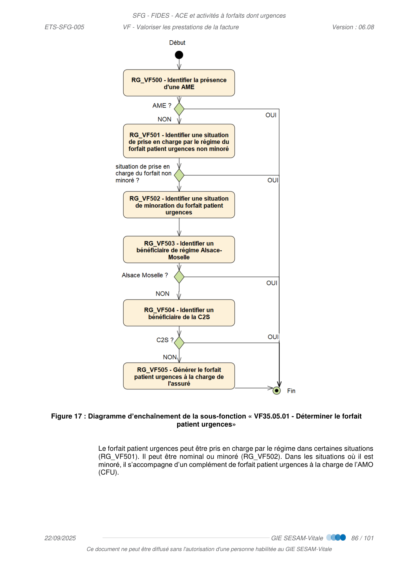
*Figure (p.289) : Figure 18 : Diagramme d’enchaînement de la sous-fonction « VF35.05.02 - Générer le forfait patient*

<!-- p.290 -->
VF - Valoriser les prestations de la facture
La génération du forfait patient urgence se matérialise par un complément de prestation
« Forfait patient urgences » (EF_CF05) associé à la prestation support FUx (EF_IP05)
ainsi que son regroupement11 (EF_VF01) :
 Code prestation
 (EF_CF05_01) ;
 Niveau
(EF_CF05_02) ;
○ Valorisé à « Complément »
 Catégorie
(EF_CF05_03) ;
○ Valorisée à « Forfait »
 Sous-catégorie
 (EF_CF05_04) ;
○ Valorisée à « Urgence »
 Nomenclature
(EF_CF05_05) ;
○ Valorisée à « Activité à forfait »
 Coefficient du complément regroupé
(EF_VF01_01) ;
○ Valorisé à « 1 »
 Quantité du complément regroupé
(EF_VF01_02).
○ Valorisée à « 1 »
 Dénombrement du complément regroupé
(EF_VF01_03).
o
Valorisé à « 1 »
 Prix unitaire
(EF_VF02_02) ;
○ Valorisé avec le Tarif réglementaire du forfait publié au JO
 Date de début de complément
(EF_CF05_09) ;
○ Valorisée avec la date du FUx
 Date de fin de complément
(EF_CF05_10) ;
○ Valorisée avec la date du début de complément
 FINESS de l’établissement
(EF_CF07_01) ;
○ Valorisé avec le FINESS géographique de l’établissement, cf RG_CF635
[RG_VF507] Contrôler la facturation du forfait patient urgence dans la facture
Les compléments de type « forfait » présents dans la facture doivent respecter les critères
suivants :
Unicité du forfait dans la facture
FPU ou FPL ou FPX ou FPV ou FPM
CFU
11 Le regroupement, dans le cas présent, ne contient qu’une seule prestation

<!-- p.291 -->
VF - Valoriser les prestations de la facture
[RG_VF508] Contrôler la cohabitation des prestations sur une même facture
Les forfaits socles de base urgence et les forfaits patient urgence sont cumulables entre
eux selon le tableau ci-après :
FPU
FPL
FPX
FPV
FPM
CFU
FUx
FPU
FPL
FPX
FPV
FPM
CFU


FUx





Pas de cumul possible

Cumul possible au cours d'une même venue

### 3.7 Fonctions transverses

Vue générale
Description Cette fonction recense les règles de gestion qui peuvent être appelées à plusieurs
endroits du processus VF.
Règles de
gestion
[RG_VF999] Identifier la présence d’une prestation exonérée au titre de « l’ALD »
La situation
d’exonération
Identifiée par le Motif
médical d’exonération
(EF_IP05_03)
Et avec un  Libellé ETM
valide à la date de
référence (EF_CF11_01)
Conduit à
Taux de
remboursemen
t (EF_VF04_02)
Justificatif
d’exonération
(EF_VF04_03)
ALD
Soins conformes au
protocole ALD
ALD
100 %
« Soins
conformes au
protocole ALD »
 La prestation « NUT » est facturable uniquement au titre de l’ALD. Cette prestation n’est
pas transmise sinon.
[RG_VF998] Identifier la présence d’une prestation exonérée pour « soins particuliers exonérés »
Lorsque le Motif médical d'exonération (EF_IP05_03) est égal à « Traitement exonérant »,
« Soins pour les nouveau-nés » alors le système de facturation doit permettre l'acquisition
des informations suivantes :

<!-- transcrit de p.291 (ex-figure) -->

**[RG_VF508] Tableau de cohabitation (cumul) des forfaits socles de base urgence et des forfaits patient urgence**

|         | FPU | FPL | FPX | FPV | FPM | CFU | FUx |
| ------- | --- | --- | --- | --- | --- | --- | --- |
| **FPU** | ✗   |     |     |     |     |     |     |
| **FPL** | ✗   | ✗   |     |     |     |     |     |
| **FPX** | ✗   | ✗   | ✗   |     |     |     |     |
| **FPV** | ✗   | ✗   | ✗   | ✗   |     |     |     |
| **FPM** | ✗   | ✗   | ✗   | ✗   | ✗   |     |     |
| **CFU** | ✗   | ✗   | ✗   | ✓   | ✓   | ✗   |     |
| **FUx** | ✓   | ✓   | ✓   | ✓   | ✓   | ✗   | ✗   |

Légende : ✗ = Pas de cumul possible ; ✓ = Cumul possible au cours d'une même venue.

<!-- p.291 -->
VF - Valoriser les prestations de la facture
La situation
d’exonération
Identifiée par le Motif
médical d’exonération
(EF_IP05_03)
Conduit à
Taux de
remboursement
(EF_VF04_02)
Justificatif
d’exonération
(EF_VF04_03)
Soins
particuliers
exonérés
Traitement exonérant
ou
Soins pour les nouveau-
nés
100 %
« Soins particuliers
exonérés »
[RG_VF997] Identifier la présence d’une prestation (ou cumul de prestations) exonérée pour
« dépassement de la règle du seuil »
Pour déterminer le dépassement du seuil, on utilise la BR des actes, hors forfaits (sauf
pour les actes CCAM, cf CP10).
Le tableau ci-dessous recense les situations d’exonération en cas de dépassement du
seuil et le justificatif d’exonération à renseigner.
Dans tous ces cas, le Taux remboursement (EF_VF04_02) a pour valeur « 100% ».
La situation
d’exonération
Identifiée par
Et par la règle du seuil
Conduit à un Justificatif
d’exonération
(EF_VF04_03)
Prestation CCAM
exonérée par règle
du seuil mais
n’exonérant pas la
facture
Prestation CCAM
dont le champ 25 est
égal à « 2 »
Si acte >= seuil
-> exonération de l’acte
 « Soins exonérés en codage
CCAM du fait de la nature de
l’acte, ou du dépassement
du seuil»
Prestation NGAP
exonérée par la règle
du seuil 12
Sans objet
Une prestation NGAP (ou
cumul) dont la somme
des Coefficient
(EF_IP06_01) est
supérieur ou égal à 60 est
exonérée, sauf CP09
« soins en rapport avec un K
ou un KC = ou > 60 »
Prestation CCAM
exonérée par règle
du seuil et exonérant
la facture
Prestation CCAM
dont le champ 25 est
égal à « 1 »
(prestation exonérée
par la règle du seuil)
Si acte >= seuil
-> exonération de la
facture (actes de champs
25 = 1 et 2) à la même
date d’exécution
Sauf CP03 (voir ci-
dessous)
 « Soins exonérés en codage
CCAM du fait de la nature de
l’acte, ou du dépassement
du seuil»
Si acte < seuil et cumul
actes de champs 25 à 1
>= seuil
-> exonération de la
facture (actes de champs
25 = 1 et 2) à la même
date d’exécution
Sauf CP03 (voir ci-
dessous)
12 Une prestation NGAP (ou cumul) dont la somme des Coefficients (EF_IP25_01) est supérieure ou égal à 60 est exonérée.

<!-- transcrit de p.291 (ex-figure) -->

**[RG_VF998] Identifier la présence d'une prestation exonérée pour « soins particuliers exonérés »**

| La situation d'exonération   | Identifiée par le Motif médical d'exonération (EF_IP05_03) | Taux de remboursement (EF_VF04_02) | Justificatif d'exonération (EF_VF04_03) |
| --------------------------- | --------------------------------------------------------- | ---------------------------------- | --------------------------------------- |
| Soins particuliers exonérés | Traitement exonérant ou Soins pour les nouveau-nés        | 100 %                              | « Soins particuliers exonérés »         |

**[RG_VF997] Identifier la présence d'une prestation (ou cumul de prestations) exonérée pour « dépassement de la règle du seuil »** *(règle barrée dans le document source)*

| La situation d'exonération                                                | Identifiée par                                                                       | Et par la règle du seuil                                                                                                                                                                                                                                                                            | Conduit à un Justificatif d'exonération (EF_VF04_03)                                            |
| ------------------------------------------------------------------------ | ------------------------------------------------------------------------------------ | --------------------------------------------------------------------------------------------------------------------------------------------------------------------------------------------------------------------------------------------------------------------------------------------------- | ---------------------------------------------------------------------------------------------- |
| Prestation CCAM exonérée par règle du seuil mais n'exonérant pas la facture | Prestation CCAM dont le champ 25 est égal à « 2 »                                    | Si acte >= seuil -> exonération de l'acte                                                                                                                                                                                                                                                            | « Soins exonérés en codage CCAM du fait de la nature de l'acte, ou du dépassement du seuil »    |
| Prestation NGAP exonérée par la règle du seuil                            | Sans objet                                                                           | Une prestation NGAP (ou cumul) dont la somme des Coefficient (EF_IP06_01) est supérieur ou égal à 60 est exonérée, sauf CP09                                                                                                                                                                         | « soins en rapport avec un K ou un KC = ou > 60 »                                              |
| Prestation CCAM exonérée par règle du seuil et exonérant la facture       | Prestation CCAM dont le champ 25 est égal à « 1 » (prestation exonérée par la règle du seuil) | Si acte >= seuil -> exonération de la facture (actes de champs 25 = 1 et 2) à la même date d'exécution. Sauf CP03 (voir ci-dessous). Si acte < seuil et cumul actes de champs 25 à 1 >= seuil -> exonération de la facture (actes de champs 25 = 1 et 2) à la même date d'exécution. Sauf CP03 (voir ci-dessous) | « Soins exonérés en codage CCAM du fait de la nature de l'acte, ou du dépassement du seuil »    |

<!-- p.297 -->
VF - Valoriser les prestations de la facture
 Pour rappel : Facturation de l’activité d’urgence non gynécologiques (présence d’un forfait
FUx dans la facture). Les actes ayant conduit à la facturation du forfait FUx ne doivent pas
figurer dans la facture. Par conséquent, les règles d’exonération pour dépassement de la
règle du seuil ne s’appliquent pas.
 Cas particuliers
 [CP01] : Exonération du Forfait FSD accompagnant une prestation CCAM dont le
champ 25 est égal à « 1 » ou « 2 » (règle du seuil)
Le système de facturation doit permettre l'acquisition des informations suivantes :
Taux de remboursement
(EV_VF04_02)
Justificatif d’exonération (EF_VF04_03)
100%
 « Soins particuliers exonérés »
[CP02] : Exonération du (des) Forfait(s) SE accompagnant une prestation CCAM dont
le champ 25 est égal à « 1 » ou « 2 » (règle du seuil)
Le système de facturation doit permettre de l'acquisition des informations suivantes :
Forfait
Taux de
remboursement
(EV_VF04_02)
Justificatif d’exonération (EF_VF04_03)
1er forfait SE
100%
 « Soins exonérés en codage CCAM du fait de
la nature de l’acte, ou du dépassement du
seuil  »
2ème forfait SE
100%
 « Soins particuliers exonérés»
Le justificatif d’exonération « Soins particuliers exonérés » est à positionner sur le second
forfait SE pour tous les bénéficiaires de soins, AME compris.
 [CP03] : Exonération de la facture en présence d’activité à forfait
En présence des forfaits ATU/FFM/SE/APE, l’exonération porte sur tous les actes de la
facture quelle que soit leur nature (NGAP, CCAM) et quelle que soit leur date d’exécution.
 [CP09] : Tous les actes de la facture ont pour code regroupement ADI
Lorsque tous les actes de la facture sont des actes de code regroupement ADI, alors ils
sont exclus du champ d’application de la règle du seuil.
 [CP10] : Déterminer la BR à utiliser pour exécuter la règle du seuil d’un acte CCAM
La BR à utiliser pour règle du seuil d’un acte CCAM doit tenir compte les codes
modificateurs en % mais pas de ceux en montant.
 Par exemple, le code modificateur U ne rentre pas en compte dans la BR des actes pour
la règle du seuil

## 4 SYNTHESE DES ENTITES FONCTIONNELLES

Les entités fonctionnelles sont décrites dans le document :
 Cf. [DICO] - Dictionnaire de données »

<!-- transcrit de p.297 (ex-figure) -->

**[CP01] Exonération du Forfait FSD accompagnant une prestation CCAM dont le champ 25 est égal à « 1 » ou « 2 » (règle du seuil)** *(cas particulier barré dans le document source)*

| Taux de remboursement (EV_VF04_02) | Justificatif d'exonération (EF_VF04_03) |
| ---------------------------------- | --------------------------------------- |
| 100%                               | « Soins particuliers exonérés »         |

**[CP02] Exonération du (des) Forfait(s) SE accompagnant une prestation CCAM dont le champ 25 est égal à « 1 » ou « 2 » (règle du seuil)** *(cas particulier barré dans le document source)*

| Forfait        | Taux de remboursement (EV_VF04_02) | Justificatif d'exonération (EF_VF04_03)                                                      |
| -------------- | ---------------------------------- | ------------------------------------------------------------------------------------------- |
| 1er forfait SE | 100%                               | « Soins exonérés en codage CCAM du fait de la nature de l'acte, ou du dépassement du seuil » |
| 2ème forfait SE | 100%                              | « Soins particuliers exonérés »                                                             |

<!-- p.296 -->
VF - Valoriser les prestations de la facture
ANNEXE 1 SYNTHESE DES REGLES DE GESTION
1
1.1
1.2
1.3
1.4
1.5
1.6
2
DESCRIPTION GENERALE DE LA FONCTION « VF - VALORISER LES PRESTATIONS DE LA
2.1
2.2
2.3
3
DESCRIPTION DETAILLEE DE LA FONCTION « VF - VALORISER LES PRESTATIONS DE LA
3.1
3.1.1
[RG_VF606] Déterminer le regroupement de prestations (EF_VF01) des prestations médicaments
[RG_VF603] Déterminer le regroupement de prestations (EF_VF01) des prestations CCAM (EF_IP08) ... 15
[RG_VF607] Déterminer le regroupement de prestations (EF_VF01) des compléments de prestation
3.1.2
VF30.02 - Générer les écarts indemnisables pour les médicaments et la LPP en sus .. 18
[RG_VF616] Déterminer les regroupements de prestation faisant l’objet d’une facturation d’un « Écart
[RG_VF612] Déterminer les regroupements de prestation faisant l’objet d’une facturation d’un « Ecart TIPS
3.1.3
[RG_VF614] Déterminer les regroupements de prestations faisant l’objet de la facturation d’une « Marge de
3.1.4
[RG_VF610] Déterminer les regroupements de prestations faisant l’objet d’une facturation d’un « Ecart
[RG_VF611] Générer la prestation pour l’écart indemnisable de la prestation regroupée de rétrocession . 24
3.2

<!-- p.297 -->
VF - Valoriser les prestations de la facture
[RG_VF627] Contrôler la cohabitation des prestations sur une même facture en contexte d’urgence non
[RG_VF_CC2] Contrôler la cohérence des codes CCAM-Modificateur (EF_IP09) entre les intervenants ... 27
[RG_VF621] Contrôler le nombre maximum d’actes pour un même Code affiné de prestation biologie
[RG_VF622] Contrôler la présence d’actes incompatibles au regard des Codes affinés prestation biologie
[RG_VF623] Contrôler le Coefficient de la prestation regroupée (EF_VF01_01) en fonction des Coefficients
[RG_VF626] Contrôler l’association obligatoire du Code prestation de niveau « complément »
3.3
3.3.1
[RG_VF651] Identifier la présence d’une exonération de niveau facture liée à la « Nature d’assurance » .. 35
[RG_VF652] Identifier la présence d’une exonération de niveau facture liée au régime exonérant
3.3.2
VF34.02 - Identifier la présence d’une exonération de niveau prestation pour les
[RG_VF666] Identifier la présence d’une prestation exonérée au titre de « mon IST pour les moins de 26
[RG_VF663] Identifier la présence d’une prestation (ou cumul de prestations) exonérée pour
[RG_VF675] Identifier la présence d’une modulation d’exonération ASPA hors BS Bénéficiaire du régime
3.3.3
[RG_VF_CC15] Contrôler la compatibilité entre le Taux de remboursement de la prestation (EF_VF04_02)
3.4

<!-- p.298 -->
VF - Valoriser les prestations de la facture
[RG_VF631] Déterminer le Prix Unitaire (EF_VF02_02) d’un Regroupement de prestations (EF_VF01) pour
[RG_VF633] Déterminer le Prix Unitaire (EF_VF02_02) d’un Regroupement de prestations (EF_VF01) pour
[RG_VF634] Déterminer le Prix Unitaire (EF_VF02_02) d’un Regroupement de prestations (EF_VF01) pour
[RG_VF635] Déterminer le Prix Unitaire (EF_VF02_02) d’un Regroupement de prestations (EF_VF01) pour
[RG_VF636] Déterminer le Prix Unitaire (EF_VF02_02) d’un Regroupement de prestations (EF_VF01) pour
[RG_VF637] Acquérir le Montant des honoraires (EF_VF02_03) du Regroupement de prestations
3.5
3.5.1
[RG_VF640] Calculer la Base de remboursement AMO (EF_VF03_02) du Regroupement de prestations
[RG_VF641] Calculer la Base de remboursement AMC (EF_VF03_03) du Regroupement de prestations
3.5.2
VF33.02 - Déterminer les bases de remboursement pour les prestations non CCAM ... 58
[RG_VF642] Déterminer le Montant de la majoration du Regroupement de prestations (EF_VF01) pour les
[RG_VF643] Calculer la Base de remboursement AMO (EF_VF03_02) du Regroupement de prestations
[RG_VF644] Calculer la Base de remboursement AMC (EF_VF03_03) du Regroupement de prestations
3.6
3.6.1
[RG_VF670] Déterminer le MRO (Montant remboursable AMO - EF_VF05_03) et le MRC théorique
[RG_VF671] Déterminer le Montant remboursable AMO (EF_VF05_03) et le Montant remboursable AMC
3.6.2
[RG_VF680] Déterminer les situations de génération du TMF 24€ pour des actes et consultations
[RG_VF682] Déterminer les montants remboursables AMO et AMC en cas de TMF non pris en charge par
3.6.3
[RG_VF692] Déterminer les informations financières, le taux, le montant remboursable AMO et la Base de

<!-- p.299 -->
VF - Valoriser les prestations de la facture
[RG_VF_RC19] Contrôler la Compatibilité du forfait dentaire (au titre de la C2S) avec le Code acte CCAM
3.6.4
3.6.5
[RG_VF501] Identifier une situation médico-administrative permettant la prise en charge par le régime du
3.7
[RG_VF997] Identifier la présence d’une prestation (ou cumul de prestations) exonérée pour
4
ANNEXE 1
