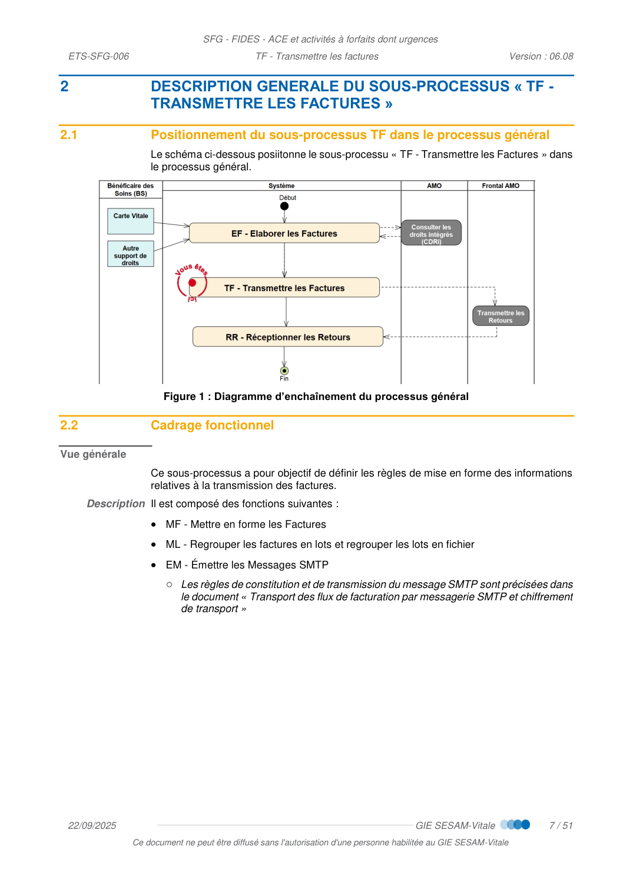
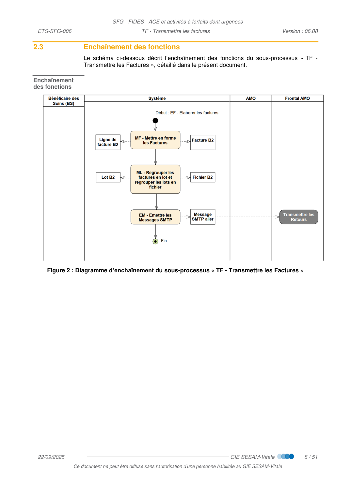
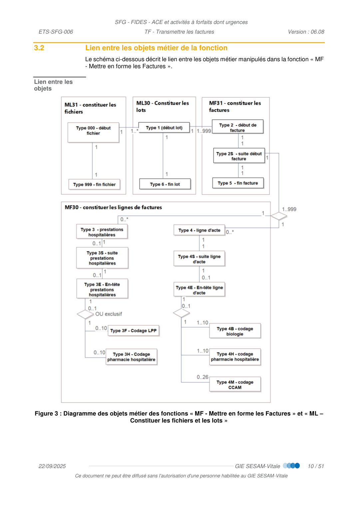
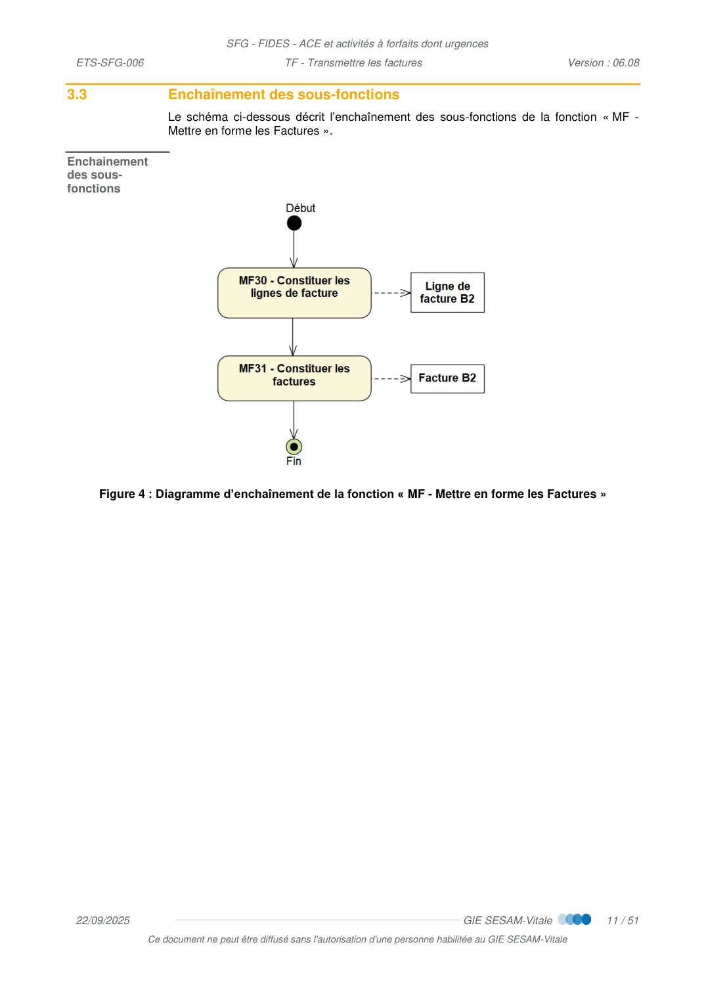
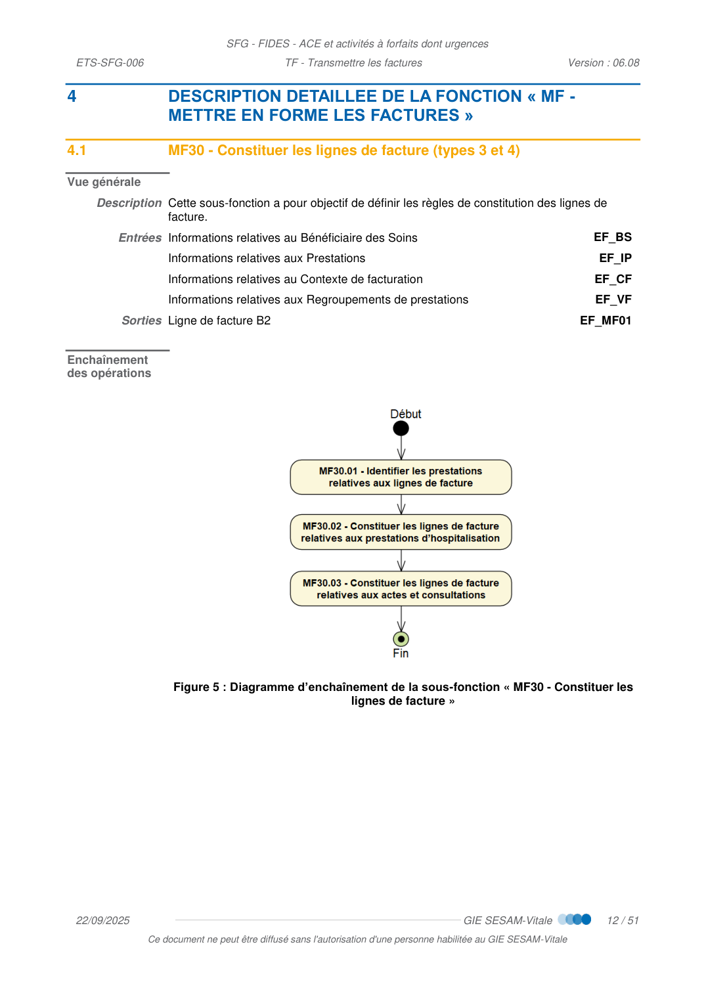
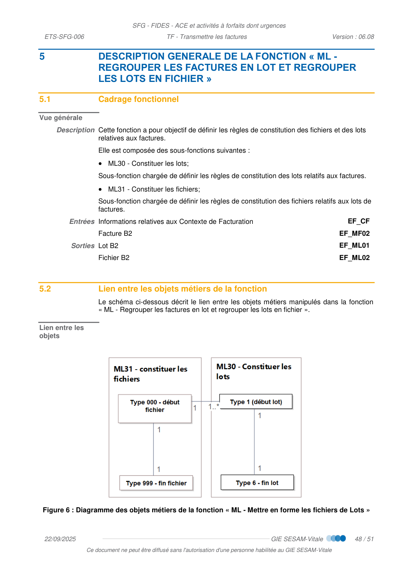
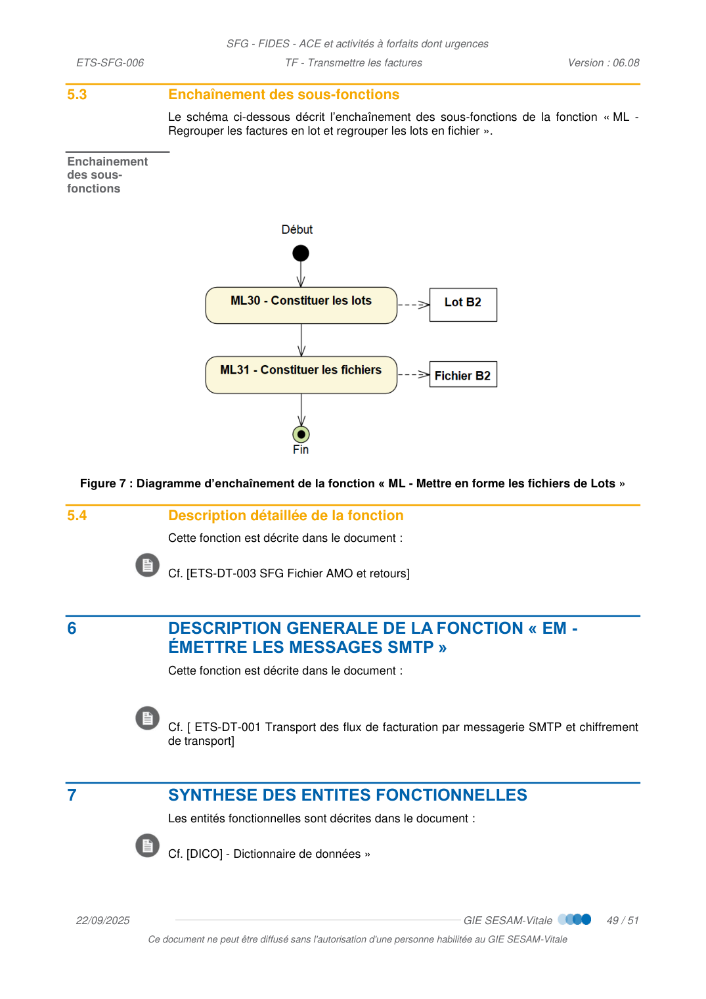

# TF — Transmettre les Factures

_Pages 305–355 du PDF source._

<!-- p.305 -->
TF  -  Transmettre les factures

<!-- p.306 -->
TF - Transmettre les factures
arrangement, quel que soit le procédé utilisé.
des sanctions pour l’auteur du délit.
CONTACTS
Pour toute question technique ou fonctionnelle, contactez le Centre de services :
•
e-mail : centre-de-service@sesam-vitale.fr

<!-- p.307 -->
TF - Transmettre les factures
1
2
3
4
[RG_MF600]
IDENTIFIER LES PRESTATIONS (EF_IP05) RELATIVES AUX LIGNES DE
FACTURE
13
[RG_MF601]
IDENTIFIER LES COMPLEMENTS DE PRESTATIONS (EF_CF05) RELATIFS AUX
[RG_MF604]
[RG_MF602]
[RG_MF603]
[RG_MF606]
[RG_MF608]
CONTROLER LA POSITION DE L’ACTE PORTANT L’EXONERATION POUR
[RG_MF609]
TRANSFORMER LE FORMAT DE L’IDENTIFIANT DES ETABLISSEMENTS
[RG_MF610]
[RG_MF611]
[RG_MF612]
[RG_MF613]
[RG_MF614]
[RG_MF620]
[RG_MF621]
[RG_MF622]
[RG_MF623]
[RG_MF625]
[RG_MF626]
[RG_MF639]
[RG_MF630]
[RG_MF636]
TRANSFORMER LE FORMAT DE L’IDENTIFIANT DES ETABLISSEMENTS
[RG_MF631]
[RG_MF632]
[RG_MF633]
[RG_MF634]
[RG_MF635]
5
DESCRIPTION GENERALE DE LA FONCTION « ML - REGROUPER LES FACTURES EN LOT ET
6

<!-- p.308 -->
TF - Transmettre les factures
7
RENSEIGNER LES JUSTIFICATIFS D’EXONERATION SELON LES CAS
METIERS
50

<!-- p.309 -->
TF - Transmettre les factures
TABLE DES ILLUSTRATIONS
FIGURE 3 : DIAGRAMME DES OBJETS METIER DES FONCTIONS « MF - METTRE EN FORME LES FACTURES » ET « ML –
FIGURE 5 : DIAGRAMME D’ENCHAINEMENT DE LA SOUS-FONCTION « MF30 - CONSTITUER LES LIGNES DE FACTURE
FIGURE 6 : DIAGRAMME DES OBJETS METIERS DE LA FONCTION « ML - METTRE EN FORME LES FICHIERS DE LOTS » 48

<!-- p.310 -->
TF - Transmettre les factures

## 1 INTRODUCTION

### 1.1 Objet du document

Ce document a pour objet de spécifier le sous-processus « TF - Transmettre les
Factures ».

### 1.2 Statut du document

De référence.

### 1.3 Positionnement du document dans le dossier de SFG

 Cf. [PG] – Présentation Générale

### 1.4 Documents de référence

 Cf. [PG] – Présentation Générale

### 1.5 Abréviations et définitions

 Cf. [DICO] - Dictionnaire de données

### 1.6 Guide de lecture

 Cf. [PG] – Présentation Générale

<!-- p.311 -->
TF - Transmettre les factures

## 2 DESCRIPTION GENERALE DU SOUS-PROCESSUS « TF - TRANSMETTRE LES FACTURES »

### 2.1 Positionnement du sous-processus TF dans le processus général

Le schéma ci-dessous posiitonne le sous-processu « TF - Transmettre les Factures » dans
le processus général.
Figure 1 : Diagramme d’enchaînement du processus général

### 2.2 Cadrage fonctionnel

Vue générale
Ce sous-processus a pour objectif de définir les règles de mise en forme des informations
relatives à la transmission des factures.
Description Il est composé des fonctions suivantes :
 MF - Mettre en forme les Factures
 ML - Regrouper les factures en lots et regrouper les lots en fichier
 EM - Émettre les Messages SMTP
○ Les règles de constitution et de transmission du message SMTP sont précisées dans
le document « Transport des flux de facturation par messagerie SMTP et chiffrement
de transport »

*Figure (p.311) : Figure 1 : Diagramme d’enchaînement du processus général*

<!-- p.312 -->
TF - Transmettre les factures

### 2.3 Enchaînement des fonctions

Le schéma ci-dessous décrit l’enchaînement des fonctions du sous-processus « TF -
Transmettre les Factures », détaillé dans le présent document.
Enchaînement
des fonctions
Figure 2 : Diagramme d’enchaînement du sous-processus « TF - Transmettre les Factures »

*Figure (p.312) : Figure 2 : Diagramme d’enchaînement du sous-processus « TF - Transmettre les Factures »*

<!-- p.313 -->
TF - Transmettre les factures

## 3 DESCRIPTION GENERALE DE LA FONCTION « MF - METTRE EN FORME LES FACTURES »

### 3.1 Cadrage fonctionnel

Vue générale
Description Cette fonction a pour objectif de définir les règles de constitution des factures et des
lignes de facture.
Elle est composée des sous-fonctions suivantes :
 MF30 - Constituer les lignes de facture,
 MF31 - Constituer les factures.
Entrées Informations relatives au Bénéficiaire des Soins
EF_BS
 Informations relatives au Contexte de Facturation
EF_CF
 Informations relatives aux Prestations
EF_IP
 Informations relatives aux Regroupements de prestations
EF_VF
Sorties Ligne de facture B2
EF_MF01
 Facture B2
EF_MF02
Rappel sur
l’alimentation de
la norme B2
Les spécifications sont rédigées sur la base de la norme B2 2005-E.
Les données constitutives des fichiers, lots, factures et lignes de factures sont définies
(hors règles de gestion spécifiques) :
 soit en caractères alphanumériques majuscules et non accentués, sans caractères
spéciaux (apostrophes, virgules, tirets, guillemets, etc…) et cadrés à gauche :
○ les dates doivent être exprimées sous la forme « AAMMJJ ».
 soit en caractères numériques, cadrés à droite et complétés par des zéros (0) à
gauche :
○ les montants doivent être exprimés en centimes et non signés.
À noter que les données facultatives sont valorisées :
 soit avec des zéros (0) pour des données de type numérique ;
 soit avec des espaces pour des données de type alphanumérique.

<!-- p.314 -->
TF - Transmettre les factures

### 3.2 Lien entre les objets métier de la fonction

Le schéma ci-dessous décrit le lien entre les objets métier manipulés dans la fonction « MF
- Mettre en forme les Factures ».
Lien entre les
objets
Figure 3 : Diagramme des objets métier des fonctions « MF - Mettre en forme les Factures » et « ML –
Constituer les fichiers et les lots »

*Figure (p.314) : Figure 3 : Diagramme des objets métier des fonctions « MF - Mettre en forme les Factures » et « ML –*

<!-- p.315 -->
TF - Transmettre les factures

### 3.3 Enchaînement des sous-fonctions

Le schéma ci-dessous décrit l’enchaînement des sous-fonctions de la fonction « MF -
Mettre en forme les Factures ».
Enchainement
des sous-
fonctions
Figure 4 : Diagramme d’enchaînement de la fonction « MF - Mettre en forme les Factures »

*Figure (p.315) : Figure 4 : Diagramme d’enchaînement de la fonction « MF - Mettre en forme les Factures »*

<!-- p.316 -->
TF - Transmettre les factures

## 4 DESCRIPTION DETAILLEE DE LA FONCTION « MF - METTRE EN FORME LES FACTURES »

### 4.1 MF30 - Constituer les lignes de facture (types 3 et 4)

Vue générale
Description Cette sous-fonction a pour objectif de définir les règles de constitution des lignes de
facture.
Entrées Informations relatives au Bénéficiaire des Soins
EF_BS
 Informations relatives aux Prestations
EF_IP
 Informations relatives au Contexte de facturation
EF_CF
 Informations relatives aux Regroupements de prestations
EF_VF
Sorties Ligne de facture B2
EF_MF01
Enchaînement
des opérations
Figure 5 : Diagramme d’enchaînement de la sous-fonction « MF30 - Constituer les
lignes de facture »

*Figure (p.316) : Figure 5 : Diagramme d’enchaînement de la sous-fonction « MF30 - Constituer les*

<!-- p.317 -->
<!-- transcrit de p.317 (ex-figure) -->
### 4.1.1 MF30.01 - Identifier les prestations relatives aux lignes de facture

**Vue générale**

- **Description** : Cette opération a pour objectif d'identifier les prestations relatives aux lignes de facture
- **Entrées** : Prestation (EF_IP05), Complément de prestation (EF_CF05)
- **Sorties** : Ligne de facture B2 (TYPE B2)

**Règles de gestion**

**[RG_MF600] Identifier les Prestations (EF_IP05) relatives aux lignes de facture**

Les prestations relatives aux lignes de facture sont identifiables selon les critères suivants :

| Niveau (EF_IP05_05) | Catégorie (EF_IP05_06) | Sous-catégorie (EF_IP05_07) | Nomenclature (EF_IP05_08) | Top Codage affiné (EF_IP05_10) | Enchaînement Type B2 |
| --- | --- | --- | --- | --- | --- |
| Support | Forfait | Urgence | Activités à forfait | Non | 4, 4S : FUx, SIM, SIC, SAS, SUB, SBx |
| Support | Professionnel | Forfait fausse-couche | NGAP | Non | 3, 3S, 3E |
| ~~Support~~ | ~~Médicaments~~ | ~~Rétrocession~~ | ~~Sans objet~~ | ~~Oui~~ | ~~4, 4S, 4E, 4H~~ |
| Support | Médicaments | Rétrocession | Sans objet | Non ~~(PHD, PHI, PHM, PHP)~~ | 4, 4S, 4E |
| Support | Médicaments | Rétrocession | UCD | Oui | 4, 4S, 4E, 4H |
| Support | Produits et Prestations de la LPP | LPP en sus (PME/PII) | LPP | Oui | 3, 3S, 3E, 3F |
| Support | Professionnel | Dentaire ou Dentaire/ODF | NGAP | Non | 4, 4S, 4E |
| Support | Biologie | Sans objet | NABM | Oui (B) ~~/ Non (PB)~~ | 4, 4S, 4E, 4B |
| Support | Biologie | Sans objet | NABM | Non (KB, TB) | 4, 4S, 4E, 4B |
| ~~Support~~ | ~~Biologie~~ | ~~Sans objet~~ | ~~NABM~~ | ~~Non (PB)~~ | ~~4, 4S, 4E~~ |
| Support | Professionnel | Sans objet | NGAP | Non | 4, 4S, 4E |
| Support | Professionnel | Toutes | CCAM | Oui | 4, 4S, 4E, 4M |
| Support | ~~Professionnel~~ Télémédecine | ~~Télémédecine~~ Toutes | NGAP | Non | 4, 4S, 4E |
| Support | Médicaments | Liste en sus | UCD | Oui | 3, 3S, 3E, 3H |
| Support | Réservé PS | Toutes | NGAP | Non | 4, 4S, 4E |

> Note : le texte ~~barré~~ correspond aux suppressions marquées en révision dans le document source.

**Cas particulier — [SP06] : AME**

<!-- p.318 -->
<!-- transcrit de p.318 (ex-figure) -->
Il convient d'alimenter le type 4M et 4B pour les bénéficiaires de l'AME.

**[SP03] : C2S en facturation unique (EF_BS21_03)**

Il convient d'alimenter le type 4M et 4B pour les bénéficiaires de la C2S en facturation unique.

**[RG_MF601] Identifier les Compléments de prestations (EF_CF05) relatifs aux lignes de facture**

Les compléments de prestations appartenant aux lignes de factures sont identifiables selon les critères suivants :

| Niveau (EF_CF05_02) | Catégorie (EF_CF05_03) | Sous-catégorie (EF_CF05_04) | Nomenclature (EF_CF05_05) | Enchaînement Type B2 |
| --- | --- | --- | --- | --- |
| Complément | Forfait | Urgence (ATU) | Activités à forfait | 3, 3S |
| Complément | Forfait | Urgence | Activités à forfait | 3 : CFU, FPU, FPV, FPL, FPM, FPX |
| Complément | Forfait | Urgence | Activités à forfait | 4, 4S : SUM, SUx, SUN, SUF, SSN, SSF, PE1, PE2 |
| Complément | Forfait | Petit matériel (FFM) | Activités à forfait | 3, 3S |
| Complément | Forfait | Sécurité environnement (SE) | Activités à forfait | 3, 3S |
| Complément | Forfait | APE | Activités à forfait | 3, 3S |
| Complément | Forfait | Vidéocapsule (VDE) | NGAP | 4, 4S, 4E |
| Complément | Forfait | Forfait sécurité dermatologie (FSD) | NGAP | 4, 4S, 4E |
| Complément | Majoration | Ecart indemnisable LPP (ETI) | Sans objet | 3, 3S, 3E |
| Complément | Majoration | Ecart indemnisable Rétrocession (ERI) | Sans objet | 4, 4S, 4E |
| Complément | Majoration | Marge Forfaitaire (MAR) | Sans objet | 4, 4S, 4E |
| Complément | Forfait | Imagerie médicale | NGAP | 3, 3S, 3E ou 4, 4S, 4E |
| Complément | Majoration | Ecart Médicament Indemnisable (EMI) | Sans objet | 3, 3S, 3E |
| Complément | Majoration | Forfait C2S | NGAP | 4, 4S, 4E |
| Complément | Majoration | Coordination | NGAP | 4, 4S, 4E |
| Complément | Majoration | Contexte médical | NGAP | 4, 4S, 4E |

<!-- p.319 -->
TF - Transmettre les factures
[RG_MF604] Remplacer les codes actes par les codes actes agrégés
Condition : actes dont la catégorie (EF_IP05_06) est égale à « Réservé PS »
La liste des actes dont la catégorie est égale à « Réservé PS » est donnée dans la table
suivante :
 Cf. [TABLES] - Table 1 : Codes prestation.
Chacun des codes actes dont la catégorie (EF_IP05_06) est égale à « Réservé PS » doit
impérativement être remplacé dans la facture par le code acte agrégé qui lui est associé.
Le code agrégé à transmettre dans la facture se trouve dans la colonne « Sous-catégorie ».
et très complexes doivent être inscrits dans le dossier médical du patient avec leur code
affiné (CSM, CSO, etc…).
[RG_MF602] Déterminer l’ordre des prestations de type 3 et 4
Les règles pour trier les prestations entre elles sont les suivantes :
Compléments de
prestation
L’ordre de facturation des compléments de prestation dès lors qu’ils sont véhiculés dans
les mêmes types que leur prestation support est le suivant :
 Les « majorations » doivent être situées APRES la prestation à laquelle elles se
rattachent.
 Les « Forfaits » doivent être situés AVANT la prestation à laquelle ils se rattachent.
 Les écarts indemnisables (ERI / ETI / EMI) ainsi que la Marge de rétrocession (MAR)
doivent obligatoirement suivre la prestation à laquelle ils se rattachent.
Activité
d’urgence non
gynécologique
En présence d’un forfait FUx, l’ordre pour les forfaits dans la facture au sein du type 4 est
le suivant :
1. FUx
2. suivi de SUN ou SUF sur FUx
3. SU2 ou SU3
4. PE1 ou PE2
5. SUM et/ou SUB / SB2 / SB3
6. SAS éventuellement suivi de SSN ou SSF
7. SIM ou SIC : éventuellement suivi de SSN ou SSF
8. FTx
 Les suppléments nuit et férié doivent suivre obligatoirement les forfaits auxquels ils se
rapportent.
 L’ordre de la liste numérotée ci-dessus est prioritaire par rapport à la chronologie des actes.

<!-- p.320 -->
TF - Transmettre les factures
L’ordre des forfaits au sein du type 3 est le suivant :
1. FPU / FPV / FPL / FPM / FPX
2. CFU
3. FTx
[RG_MF603] Contrôler l’absence des types B2 « 2B » et « 2C »
Les factures provenant d’établissements publics ou de PNL ne doivent pas contenir les
types 2B et 2C dans la B2.
[RG_MF606] Contrôler le délai de facturation
Le délai de facturation doit être strictement inférieur à 1 an.
Ce délai est contrôlé :
 en ACE : entre la date d’éxécution des actes (EF_IP05_01) et la date de transmission
de la facture.
 Cas particulier
[CP01] : La caisse demande un envoi au-delà du délai réglementaire
Dans certains cas exceptionels, la caisse peut demander un envoi des factures au-delà du
délai de 1 an. Pour cette raison, il doit être possible de forcer l’émission de factures au délà
de ce délai.
[RG_MF608] Contrôler la position de l’acte portant l’exonération pour dépassement de la règle du
seuil
Si une facture contient une prestation exonérée pour « dépassement de la règle du seuil »
(RG_VF663), celle-ci doit se situer en premier dans l’ordre des prestations de la facture
pouvant donner lieu à une telle exonération.
[RG_MF609] Transformer le format de l’identifiant des établissements corses dans les lignes de
facture
Conditions : l’identifiant de facturation (de type FINESS) est alphanumérique et comporte
les caractères « 2A » ou « 2B »
Pour alimenter la facture, le système convertit au format numérique les identiifnats
concernés selon la règle suivante :

2AyyxxxxL par 2001xxxxL

2ByyxxxxL par 2002xxxxL
Exemple :

N° Alpha = 2A0002689     N° Numérique = 200102689

N° Alpha = 2A0002168     N° Numérique = 200102168

<!-- p.321 -->
<!-- transcrit de p.321 (ex-figure) -->
### 4.1.2 MF30.02 - Constituer les lignes de facture relatives aux prestations d'hospitalisation – Type 3

**Vue générale**

- **Description** : Cette opération a pour objectif de définir les règles de constitution des lignes de facture relatives aux prestations d'hospitalisation
- **Entrées** : Informations relatives au Bénéficiaire des Soins (EF_BS), Informations relatives aux Prestations (EF_IP), Informations relatives au Contexte de facturation (EF_CF), Informations relatives aux Regroupements de prestations (EF_VF)
- **Sorties** : Ligne de facture B2 (Type 3 / 3S / 3E / 3F)

**Règles de gestion**

**[RG_MF610] Constituer le « Type 3 »**
Libellé
Position
Taille
Format
Présence
Source
Libellé
Type d'enregistrement
[0301]
1
N
O

3
N° du partenaire de
santé + Clé
[0302]
9
N
O

[0202]
FILLER
[0311]
1
A
F

Blanc
Numéro immatriculation
assuré
[0312]
13
A
O

[0212]
Clé du Numéro
immatriculation
[0325]
2
N
O

[0225]
Rang du bénéficiaire
[0327]
3
N
O

[0227]
Numéro facture ou
Numéro titre
[0330]
9
N
O

[0230]
Mode de traitement
(MT)
[0339]
2
N
F

[0339]
Discipline de prestation
(DMT)
[0341]
3
N
F

[0341]
Date début de séjour
[0344]
6
N
O
 EF_BS01_02
Date d'entrée
Date fin de séjour
[0350]
6
N
O
 EF_BS01_03  Date de sortie
Code acte
[0356]
4+1
A
O

[0356]
Quantité d'actes
[0361]
3
N
O
 EF_VF01_02
Quantité de la prestation
regroupée
Justification
d'exonération du Ticket
modérateur niveau acte
[0364]
1
A
F

[0364]
Coefficient
[0365]
3+2
N
F
 EF_VF01_01
Coefficient de la prestation
regroupée.
Si celui-ci n’est pas
renseigné, le système de
facturation doit le valoriser à
1.

| Libellé | Position | Taille | Format | Présence | Source | Libellé (donnée) |
| --- | --- | --- | --- | --- | --- | --- |
| Type d'enregistrement | [0301] | 1 | N | O | | 3 |
| N° du partenaire de santé + Clé | [0302] | 9 | N | O | | [0202] |
| FILLER | [0311] | 1 | A | F | | Blanc |
| Numéro immatriculation assuré | [0312] | 13 | A | O | | [0212] |
| Clé du Numéro immatriculation | [0325] | 2 | N | O | | [0225] |
| Rang du bénéficiaire | [0327] | 3 | N | O | | [0227] |
| Numéro facture ou Numéro titre | [0330] | 9 | N | O | | [0230] |
| Mode de traitement (MT) | [0339] | 2 | N | F | | [0339] |
| Discipline de prestation (DMT) | [0341] | 3 | N | F | | [0341] |
| Date début de séjour | [0344] | 6 | N | O | EF_BS01_02 | Date d'entrée |
| Date fin de séjour | [0350] | 6 | N | O | EF_BS01_03 | Date de sortie |
| Code acte | [0356] | 4+1 | A | O | | [0356] |
| Quantité d'actes | [0361] | 3 | N | O | EF_VF01_02 | Quantité de la prestation regroupée |
| Justification d'exonération du Ticket modérateur niveau acte | [0364] | 1 | A | F | | [0364] |
| Coefficient | [0365] | 3+2 | N | F | EF_VF01_01 | Coefficient de la prestation regroupée. Si celui-ci n'est pas renseigné, le système de facturation doit le valoriser à 1. |

<!-- p.322 -->
TF - Transmettre les factures
Donnée Type 3
Données
Libellé
Position
Taille
Format
Présence
Source
Libellé
Code prise en charge
du forfait journalier
[0370]
1
A
F

Blanc
Coefficient MCO ou
HAD ou SMR
(établissements privés
ou établissements
publics / privés ex-DG)
[0371]
1+4
N
F
 EF_CF04_19
Le coefficient MCO est
exprimé en dix-millièmes et
ne doit pas comporter de
virgule
Prix unitaire
[0376]
5+2
N
O
 EF_VF02_02
Prix unitaire
Base de
remboursement
[0383]
6+2
N
O
 EF_VF03_02
Base de remboursement
AMO
Taux applicable à la
prestation
[0391]
3
N
O
 EF_VF04_02
Taux de remboursement
Montant remboursable
par la caisse
[0394]
6+2
N
O
 EF_VF05_03
Montant remboursable AMO
Montant total de la
dépense
[03102]
6+2
N
O

[03102]
Numéro de GHS ou
numéro de GHT ou
numéro de GMT
[03110]
4
N
F

0000
Taux de financement
[03114]
3
N
F

EF_CF09_07 Taux de financement
Taux de financement
[03114]
3
N
F

000
Code participation
assuré
[03117]
1
A
F

EF_VF06_0
1
Code participation assuré
FILLER
[03118]
2
A
F

Blanc
Qualificatif de la
dépense
[03120]
1
A
F

[03120]
Domaine d'activité
[03121]
1
A
F

[03121]
Montant remboursable
par l'organisme
complémentaire
[03122]
5+2
N
F

[03122]
 [0339]
Et [0341]
Mode de traitement (MT)
Discipline de prestation (DMT)
Les MT et DMT sont renseignées comme suit :
Situation
MT (EF_VF01_04)
DMT
(EF_VF01_05)
Forfaits techniques
d’imagerie
Type d’appareillage = IRM
(EF_CF06_03)
19
753
Type d’appareillage = SCAN
(EF_CF06_03)
19
035
Type d’appareillage = Tomographie
(EF_CF06_03)
19
750
Autres cas
Tout acte (hors forfait technique)
00
000

<!-- transcrit de p.322 (ex-figure) -->

**Donnée « Type 3 » (suite) → Données**

| Libellé | Position | Taille | Format | Présence | Source | Libellé (donnée) |
| --- | --- | --- | --- | --- | --- | --- |
| Code prise en charge du forfait journalier | [0370] | 1 | A | F | | Blanc |
| Coefficient MCO ou HAD ou SMR (établissements privés ou établissements publics / privés ex-DG) | [0371] | 1+4 | N | F | EF_CF04_19 | Le coefficient MCO est exprimé en dix-millièmes et ne doit pas comporter de virgule |
| Prix unitaire | [0376] | 5+2 | N | O | EF_VF02_02 | Prix unitaire |
| Base de remboursement | [0383] | 6+2 | N | O | EF_VF03_02 | Base de remboursement AMO |
| Taux applicable à la prestation | [0391] | 3 | N | O | EF_VF04_02 | Taux de remboursement |
| Montant remboursable par la caisse | [0394] | 6+2 | N | O | EF_VF05_03 | Montant remboursable AMO |
| Montant total de la dépense | [03102] | 6+2 | N | O | | [03102] |
| Numéro de GHS ou numéro de GHT ou numéro de GMT | [03110] | 4 | N | F | | 0000 |
| ~~Taux de financement~~ | ~~[03114]~~ | ~~3~~ | ~~N~~ | ~~F~~ | ~~EF_CF09_07~~ | ~~Taux de financement~~ |
| Taux de financement | [03114] | 3 | N | F | | 000 |
| Code participation assuré | [03117] | 1 | A | F | EF_VF06_01 | Code participation assuré |
| FILLER | [03118] | 2 | A | F | | Blanc |
| Qualificatif de la dépense | [03120] | 1 | A | F | | [03120] |
| Domaine d'activité | [03121] | 1 | A | F | | [03121] |
| Montant remboursable par l'organisme complémentaire | [03122] | 5+2 | N | F | | [03122] |

> La ligne barrée [03114] (source EF_CF09_07, libellé « Taux de financement ») est marquée comme supprimée dans le document source ; la valeur retenue est « 000 » sans source.

**Mode de traitement (MT) [0339] et Discipline de prestation (DMT) [0341]**

| Catégorie | Situation | MT (EF_VF01_04) | DMT (EF_VF01_05) |
| --- | --- | --- | --- |
| Forfaits techniques d'imagerie | Type d'appareillage = IRM (EF_CF06_03) | 19 | 753 |
| Forfaits techniques d'imagerie | Type d'appareillage = SCAN (EF_CF06_03) | 19 | 035 |
| Forfaits techniques d'imagerie | Type d'appareillage = Tomographie (EF_CF06_03) | 19 | 750 |
| Autres cas | Tout acte (hors forfait technique) | 00 | 000 |

<!-- p.323 -->
TF - Transmettre les factures
 Situations particulières
[SP06] : AME ou [SP08] : BS coordonnés RSS et activités à forfait ou forfait activité
urgences ou forfait fausse couche
Situation
MT (EF_VF01_04)
DMT
(EF_VF01_05)
Activités à forfait
ATU et actes associés
10
406
FFM et actes associés
19
137
SE1, SE2, SE3, SE4, SE5, SE6, SE7,
APE
et actes associés
19
958
Forfait activité
CFU, FPU, FPV, FPL, FPM, FPX
00
000
Forfait fausse
couche
FEF, FFE
07
000
[0356] Code acte
Le Code acte doit être valorisé avec le Code prestation ou Code regroupement
(EF_IP05_04) ou avec le Code prestation (complément) (EF_CF05_01) en cas de
complément de prestation.
[0361] Quantité d’actes
La quantité d’actes doit être valorisée avec : EF_VF01_02.
 Cas particulier
[CP01] : Prestation GMT ou prestation de séjour tarifée sur la base du nouveau tarif
journalier de prestation (TNJP)
La quantité d’actes doit être valorisée avec NBJP : EF_IP21_01.
[0364] Justification d'exonération du Ticket modérateur au niveau de l'acte
Détermination du code justification d'exonération du Ticket modérateur à positionner dans
la B2 :
Justificatif d’exonération de la prestation
(EF_VF04_03)
Justification d'exonération
du Ticket modérateur au
niveau de l'acte
« Pas d’exonération »
0
« soins en rapport avec un K ou un KC = ou > 60 »
1
« Traitement exonérant » (ou « Soins particuliers
exonérés »)
3
« Soins conformes au protocole ALD »
4
 « Assuré ou Bénéficiaire exonéré (régime
exonérant) »
5
« Régimes spéciaux SNCF et MINES»
6
« Prévention maladie »
7

<!-- transcrit de p.323 (ex-figure) -->

**Situations particulières — [SP06] : AME ou [SP08] : BS coordonnés RSS et activités à forfait ou forfait activité urgences ou forfait fausse couche**

| Catégorie | Situation | MT (EF_VF01_04) | DMT (EF_VF01_05) |
| --- | --- | --- | --- |
| Activités à forfait | ATU et actes associés | 10 | 406 |
| Activités à forfait | FFM et actes associés | 19 | 137 |
| Activités à forfait | SE1, SE2, SE3, SE4, SE5, SE6, SE7, APE et actes associés | 19 | 958 |
| Forfait activité urgences | CFU, FPU, FPV, FPL, FPM, FPX | 00 | 000 |
| Forfait fausse couche | FEF, FFE | 07 | 000 |

**[0364] Justification d'exonération du Ticket modérateur au niveau de l'acte**

| Justificatif d'exonération de la prestation (EF_VF04_03) | Justification d'exonération du Ticket modérateur au niveau de l'acte |
| --- | --- |
| « Pas d'exonération » | 0 |
| « soins en rapport avec un K ou un KC = ou > 60 » | 1 |
| « Traitement exonérant » (ou « Soins particuliers exonérés ») | 3 |
| « Soins conformes au protocole ALD » | 4 |
| « Assuré ou Bénéficiaire exonéré (régime exonérant) » | 5 |
| « Régimes spéciaux SNCF et MINES » | 6 |
| « Prévention maladie » | 7 |

<!-- p.324 -->
TF - Transmettre les factures
« ASPA »
9
« Soins exonérés en codage CCAM du fait de la
nature de l’acte, ou du dépassement du seuil»
C
 Cas particulier
[CP02] : Bénéficiaire de l’ASPA
Pour les bénéficiaires de l’ASPA et lorques des actes sont éxonérés par l’exonération C
alors se référer à TF_0279CP02
[03102] Montant total de la dépense
Montant total de la dépense = MRO (EF_VF05_03) + MRC (EF_VF05_04)
 Cas particulier
[CP01] - présence de FPU ou FPV, hors C2S, hors AME, ou présence de Forfait
journalier.
En cas de présence d’un forfait FPU ou FPV dans la facture , ou en présence d’un forfait
journalier :
Montant total de la dépense = Montant des honoraires (EF_VF02_03)
[03120] Code qualificatif de la dépense
Code qualificatif de la dépense = EF_CF04_07
Cas particulier : présence de FPU, FPV
Le code qualificatif de la dépense est valorisé à « N »
[03121] Domaine d’activité
Domaine d’activité = EF_IP05_09
Rappel : le domaine d’activité déterminé en RG_IP624 est applicable aux prestations dites
« support » et à toutes les prestations « complément » associées.
Cas particulier : prestations FPU, FPV, FPL ou FPM
Le domaine d’activité est valorisé à blanc
[03122] Montant remboursable par l’organisme complémentaire
Si le top éclatement ([0295])
vaut
Alors le montant remboursable par l’organisme
complémentaire vaut
« F »
0
blanc
MRC (Montant remboursable AMC) (EF_VF05_04)*
*ce montant peut être égal à 0 dans certains cas

<!-- transcrit de p.324 (ex-figure) -->

**[0364] Justification d'exonération du Ticket modérateur au niveau de l'acte (suite)**

| Justificatif d'exonération de la prestation (EF_VF04_03) | Justification d'exonération du Ticket modérateur au niveau de l'acte |
| --- | --- |
| « ASPA » | 9 |
| « Soins exonérés en codage CCAM du fait de la nature de l'acte, ou du dépassement du seuil » | C |

**[03122] Montant remboursable par l'organisme complémentaire**

| Si le top éclatement ([0295]) vaut | Alors le montant remboursable par l'organisme complémentaire vaut |
| --- | --- |
| « F » | 0 |
| blanc | MRC (Montant remboursable AMC) (EF_VF05_04)* |

> *ce montant peut être égal à 0 dans certains cas

<!-- p.325 -->
TF - Transmettre les factures
[RG_MF611] Constituer le « Type 3S »
À noter que le « Type 3S » doit obligatoirement succéder au « Type 3 ».
Donnée Type 3S
Donnée
Libellé
Position
Taille
Format
Présence
Source
Libellé
Type d'enregistrement
[3S01]
1
N
O

3
Numéro du partenaire
de santé
[3S02]
9
N
O

[0202]
FILLER
[3S11]
1
A
F

Blanc
Numéro
immatriculation assuré
[3S12]
13
A
O

[0212]
Clé du Numéro
immatriculation
[3S25]
2
N
O

[0225]
Rang du bénéficiaire
[3S27]
3
N
O

[0227]
Numéro facture ou
Numéro titre
[3S30]
9
N
O

[0230]
Complément de type
[3S39]
1
A
O

S
Séquence
[3S40]
2
N
O

01
Numéro prescripteur
[3S42]
9
N
O

[3S42]
Condition d'exercice du
prescripteur
[3S51]
1
A
F

EF_IP02_02
Condition d'exercice
(PS prescripteur)
Spécialité du
prescripteur salarié
[3S52]
2
N
O

[3S52]
Date de prescription
[3S54]
6
N
O

EF_IP01_01
Date de prescription
Date de demande
d'accord préalable
[3S60]
6
N
F

[3S60]
Code accord préalable
[3S66]
1
N
O
 EF_IP14_02
Code accord de l'entente
préalable
Établissement de
transfert ou de retour
ou lieu d'exécution de
l'acte
[3S67]
14
N
F

EF_IP16_01
N° FINESS
géographique (lieu
d'exécution)
Nature d'interruption
ou de fin de séjour
[3S81]
1
A
F

Blanc
Identification de la
filière ou du réseau
[3S82]
14
N
F

Blanc
Numéro d'ordre du
forfait technique
[3S96]
5
N
F
 EF_CF06_02
Numéro d'ordre de
l'examen
Numéro de l'appareil
[3S101]
14
N
F
 EF_CF06_01
Numéro d'identification de
l'appareillage
Origine de la
prescription
[3S115]
1
A
F
 EF_IP01_02
Code origine de la
prescription
FILLER
[3S116]
16
A
F

Blanc
[3S42] Numéro prescripteur
Si la Condition d'exercice du prescripteur (EF_IP02_02) = « L » alors le numéro de
prescripteur est renseigné avec le N° Identification du PS prescripteur (EF_IP02_03).
Sinon, il est valorisé avec l’Etablissement de rattachement du prescripteur (EF_IP17_01).

<!-- transcrit de p.325 (ex-figure) -->

**[RG_MF611] Constituer le « Type 3S » — Donnée Type 3S → Donnée**

| Libellé | Position | Taille | Format | Présence | Source | Libellé (donnée) |
| --- | --- | --- | --- | --- | --- | --- |
| Type d'enregistrement | [3S01] | 1 | N | O | | 3 |
| Numéro du partenaire de santé | [3S02] | 9 | N | O | | [0202] |
| FILLER | [3S11] | 1 | A | F | | Blanc |
| Numéro immatriculation assuré | [3S12] | 13 | A | O | | [0212] |
| Clé du Numéro immatriculation | [3S25] | 2 | N | O | | [0225] |
| Rang du bénéficiaire | [3S27] | 3 | N | O | | [0227] |
| Numéro facture ou Numéro titre | [3S30] | 9 | N | O | | [0230] |
| Complément de type | [3S39] | 1 | A | O | | S |
| Séquence | [3S40] | 2 | N | O | | 01 |
| Numéro prescripteur | [3S42] | 9 | N | O | | [3S42] |
| Condition d'exercice du prescripteur | [3S51] | 1 | A | F | EF_IP02_02 | Condition d'exercice (PS prescripteur) |
| Spécialité du prescripteur salarié | [3S52] | 2 | N | O | | [3S52] |
| Date de prescription | [3S54] | 6 | N | O | EF_IP01_01 | Date de prescription |
| Date de demande d'accord préalable | [3S60] | 6 | N | F | | [3S60] |
| Code accord préalable | [3S66] | 1 | N | O | EF_IP14_02 | Code accord de l'entente préalable |
| Établissement de transfert ou de retour ou lieu d'exécution de l'acte | [3S67] | 14 | N | F | EF_IP16_01 | N° FINESS géographique (lieu d'exécution) |
| Nature d'interruption ou de fin de séjour | [3S81] | 1 | A | F | | Blanc |
| Identification de la filière ou du réseau | [3S82] | 14 | N | F | | Blanc |
| Numéro d'ordre du forfait technique | [3S96] | 5 | N | F | EF_CF06_02 | Numéro d'ordre de l'examen |
| Numéro de l'appareil | [3S101] | 14 | N | F | EF_CF06_01 | Numéro d'identification de l'appareillage |
| Origine de la prescription | [3S115] | 1 | A | F | EF_IP01_02 | Code origine de la prescription |
| FILLER | [3S116] | 16 | A | F | | Blanc |

<!-- p.326 -->
TF - Transmettre les factures
[3S52] Spécialité du prescripteur
Cette information est valorisée avec le Code spécialité (PS prescripteur) (EF_IP02_01)
dans le cas où la Situation d'exercice (PS prescripteur) (EF_IP02_02) est égale à « S »,
sinon cette information est valorisée à blanc.
[3S60] Date de demande d’accord préalable
Cette information est valorisée avec la date d'envoi de la demande d'entente préalable
(EF_IP14_03) sous la forme « AAMMJJ ».
 Cas particuliers
[CP01] : Code accord préalable
Dans le cas où le Code accord de l'entente préalable (EF_IP14_02) est égal à « 9 », la
Date de demande d’accord préalable est facultative.

<!-- p.327 -->
TF - Transmettre les factures
[RG_MF612] Constituer le « Type 3E »
Le type 3 E doit être créé uniquement si le N° RPPS du PS prescripteur (EF_IP02_04) est
renseigné.
À noter que le « Type 3E » doit obligatoirement succéder au « Type 3S » ou au « Type 3 »
si le « Type 3S » est absent.
Donnée Type 3E
Donnée
Libellé
Position
Taille
Format
Présence
Source
Libellé
Type d'enregistrement
[3E01]
1
N
O

3
Numéro du partenaire
de santé
[3E02]
9
N
O

[0202]
FILLER
[3E11]
1
A
F

Blanc
Numéro
immatriculation assuré
[3E12]
13
A
O

[0212]
Clé du Numéro
immatriculation
[3E25]
2
N
O

[0225]
Rang du bénéficiaire
[3E27]
3
N
O

[0227]
Numéro facture ou
Numéro titre
[3E30]
9
N
O

[0230]
Complément de type
[3E39]
1
A
O

E
Séquence
[3E40]
2
N
O

01
Identifiant RPPS du
prescripteur
[3E42]
11
A
F
 EF_IP02_04
N° RPPS + clé (PS
prescripteur)
N° de structure dans
laquelle le PS a
prescrit
[3E53]
14
A
F
 EF_IP17_01
Etablissement de
rattachement
(prescripteur)
FILLER
[3E67]
62
A
F

Blanc

<!-- transcrit de p.327 (ex-figure) -->

**[RG_MF612] Constituer le « Type 3E » — Donnée Type 3E → Donnée**

| Libellé | Position | Taille | Format | Présence | Source | Libellé (donnée) |
| --- | --- | --- | --- | --- | --- | --- |
| Type d'enregistrement | [3E01] | 1 | N | O | | 3 |
| Numéro du partenaire de santé | [3E02] | 9 | N | O | | [0202] |
| FILLER | [3E11] | 1 | A | F | | Blanc |
| Numéro immatriculation assuré | [3E12] | 13 | A | O | | [0212] |
| Clé du Numéro immatriculation | [3E25] | 2 | N | O | | [0225] |
| Rang du bénéficiaire | [3E27] | 3 | N | O | | [0227] |
| Numéro facture ou Numéro titre | [3E30] | 9 | N | O | | [0230] |
| Complément de type | [3E39] | 1 | A | O | | E |
| Séquence | [3E40] | 2 | N | O | | 01 |
| Identifiant RPPS du prescripteur | [3E42] | 11 | A | F | EF_IP02_04 | N° RPPS + clé (PS prescripteur) |
| N° de structure dans laquelle le PS a prescrit | [3E53] | 14 | A | F | EF_IP17_01 | Etablissement de rattachement (prescripteur) |
| FILLER | [3E67] | 62 | A | F | | Blanc |

<!-- p.328 -->
TF - Transmettre les factures
[RG_MF613] Constituer le « Type 3F »
À noter que le « Type 3F » doit obligatoirement succéder au « Type 3S » ou « Type 3E ».
Donnée Type 3F
Données
Libellé
Position
Taille
Format
Présence
Source
Libellé
Type d'enregistrement
[3F01]
1
N
O

3
Numéro du partenaire de
santé
[3F02]
9
N
O

[0202]
FILLER
[3F11]
1
A
F

Blanc
Numéro immatriculation
assuré
[3F12]
13
A
O

[0212]
Clé du Numéro
immatriculation
[3F25]
2
N
O

[0225]
Numéro facture ou
Numéro titre
[3F27]
9
N
O

[0230]
Complément de type
[3F36]
1
A
O

F
Séquence
[3F37]
2
N
O

[3F37]
Réservé SESAM
[3F39]
4
N
O

Blanc
Code référence LPP
[3F43]
13
A
O

[3F43]
Numéro SIRET du
fabricant ou de
l'importateur
[3F56]
14
A
F
 EF_IP12_02
N°SIRET du fabricant ou
de l'importateur
Quantité
[3F70]
2
N
O
 EF_IP12_04
Quantité de la prestation
LPP
Tarif référence LPP ou
prix unitaire sur devis
[3F72]
5+2
N
O
 EF_IP12_03
Tarif de référence ou prix
unitaire sur devis TTC
Montant total facturé
[3F79]
5+2
N
O
 EF_IP12_05
Montant total facturé TTC
de la prestation LPP
Prix d'achat unitaire
[3F86]
5+2
N
F
 EF_IP12_06
Prix unitaire d’achat TTC
de la prestation LPP
Montant unitaire de
l'écart indemnisable
[3F93]
5+2
N
F
 EF_IP12_07
Montant unitaire de l'écart
indemnisable
Montant total de l'écart
indemnisable
[3F100]
5+2
N
F
 EF_IP12_08
Montant total de l'écart
indemnisable
FILLER
[3F107]
22
A
F

Blanc
[3F37] Séquence
Le nombre d’enregistrements de « Type 3F » étant limité à 10 par « Type 3 », la séquence
peut être numérotée de 01 à 10.
[3F43] Code référence LPP
Cette information est valorisée avec le code référence LPP (EF_IP12_01) sur 7 caractères
cadrés à gauche et complétés par des blancs.

<!-- transcrit de p.328 (ex-figure) -->

**[RG_MF613] Constituer le « Type 3F » — Donnée Type 3F → Données**

| Libellé | Position | Taille | Format | Présence | Source | Libellé (donnée) |
| --- | --- | --- | --- | --- | --- | --- |
| Type d'enregistrement | [3F01] | 1 | N | O | | 3 |
| Numéro du partenaire de santé | [3F02] | 9 | N | O | | [0202] |
| FILLER | [3F11] | 1 | A | F | | Blanc |
| Numéro immatriculation assuré | [3F12] | 13 | A | O | | [0212] |
| Clé du Numéro immatriculation | [3F25] | 2 | N | O | | [0225] |
| Numéro facture ou Numéro titre | [3F27] | 9 | N | O | | [0230] |
| Complément de type | [3F36] | 1 | A | O | | F |
| Séquence | [3F37] | 2 | N | O | | [3F37] |
| Réservé SESAM | [3F39] | 4 | N | O | | Blanc |
| Code référence LPP | [3F43] | 13 | A | O | | [3F43] |
| Numéro SIRET du fabricant ou de l'importateur | [3F56] | 14 | A | F | EF_IP12_02 | N°SIRET du fabricant ou de l'importateur |
| Quantité | [3F70] | 2 | N | O | EF_IP12_04 | Quantité de la prestation LPP |
| Tarif référence LPP ou prix unitaire sur devis | [3F72] | 5+2 | N | O | EF_IP12_03 | Tarif de référence ou prix unitaire sur devis TTC |
| Montant total facturé | [3F79] | 5+2 | N | O | EF_IP12_05 | Montant total facturé TTC de la prestation LPP |
| Prix d'achat unitaire | [3F86] | 5+2 | N | F | EF_IP12_06 | Prix unitaire d'achat TTC de la prestation LPP |
| Montant unitaire de l'écart indemnisable | [3F93] | 5+2 | N | F | EF_IP12_07 | Montant unitaire de l'écart indemnisable |
| Montant total de l'écart indemnisable | [3F100] | 5+2 | N | F | EF_IP12_08 | Montant total de l'écart indemnisable |
| FILLER | [3F107] | 22 | A | F | | Blanc |

<!-- p.329 -->
TF - Transmettre les factures
[RG_MF614] Constituer le « Type 3H »
À noter que le « Type 3H » doit obligatoirement succéder au « Type 3S » ou « Type 3E ».
Donnée Type 3H
Données
Libellé
Position
Taille
Format
Présence
Source
Libellé
Type d'enregistrement
[3H01]
1
N
O

3
Numéro du partenaire de
santé
[3H02]
9
N
O

[0202]
FILLER
[3H11]
1
A
F

Blanc
Numéro immatriculation
assuré
[3H12]
13
A
O

[0212]
Clé du Numéro
immatriculation
[3H25]
2
N
O

[0225]
Numéro facture ou
Numéro titre
[3H27]
9
N
O

[0230]
Complément de type
[3H36]
1
A
O

H
Séquence
[3H37]
2
N
O

[3H37]
Réservé SESAM
[3H39]
4
N
F

0000
Filler
[3H43]
6
A
F

Blanc
Code UCD
[3H49]
7
N
O
EF_IP13_01
Code UCD associé à une
nature de prestation PH8
FILLER
[3H56]
1
A
F
Blanc
Coefficient de
fractionnement
[3H57]
1+4
N
O
EF_IP13_02
Coefficient de
fractionnement
FILLER
[3H62]
5
A
F
Blanc
Prix d’achat unitaire TTC
[3H67]
5+2
N
O
[3H67]
Montant unitaire de
l’écart indemnisable
[3H74]
5+2
N
F
EF_IP13_08
Montant unitaire de l’écart
indemnisable
Montant total de l’écart
indemnisable
[3H81]
5+2
N
F
EF_IP13_09
Montant total de l’écart
indemnisable
Quantité
[3H88]
3
N
O
EF_IP13_06
Quantité
Montant total facturé TTC
[3H91]
5+2
N
O
EF_IP13_07
Montant total facturé TTC
FILLER
[3H98]
31
A
F

Blanc
[3H37] Séquence
Le nombre d’enregistrements de « Type 3H » étant limité à 10 par « Type 3 », la séquence
peut être numérotée de 01 à 10.
[3H67] Prix d’achat unitaire TTC
Cette information est valorisée avec soit :
 le prix d’achat négocié TTC (EF_IP13_05) par l’établissement en cas de facturation
d’un écart indemnisable, ou soit
 Le tarif de responsabilité TTC (EF_IP13_11), c'est-à-dire le tarif de responsabilité
publié au JO

<!-- transcrit de p.329 (ex-figure) -->

**[RG_MF614] Constituer le « Type 3H » — Donnée Type 3H → Données**

| Libellé | Position | Taille | Format | Présence | Source | Libellé (donnée) |
| --- | --- | --- | --- | --- | --- | --- |
| Type d'enregistrement | [3H01] | 1 | N | O | | 3 |
| Numéro du partenaire de santé | [3H02] | 9 | N | O | | [0202] |
| FILLER | [3H11] | 1 | A | F | | Blanc |
| Numéro immatriculation assuré | [3H12] | 13 | A | O | | [0212] |
| Clé du Numéro immatriculation | [3H25] | 2 | N | O | | [0225] |
| Numéro facture ou Numéro titre | [3H27] | 9 | N | O | | [0230] |
| Complément de type | [3H36] | 1 | A | O | | H |
| Séquence | [3H37] | 2 | N | O | | [3H37] |
| Réservé SESAM | [3H39] | 4 | N | F | | 0000 |
| Filler | [3H43] | 6 | A | F | | Blanc |
| Code UCD | [3H49] | 7 | N | O | EF_IP13_01 | Code UCD associé à une nature de prestation PH8 |
| FILLER | [3H56] | 1 | A | F | | Blanc |
| Coefficient de fractionnement | [3H57] | 1+4 | N | O | EF_IP13_02 | Coefficient de fractionnement |
| FILLER | [3H62] | 5 | A | F | | Blanc |
| Prix d'achat unitaire TTC | [3H67] | 5+2 | N | O | | [3H67] |
| Montant unitaire de l'écart indemnisable | [3H74] | 5+2 | N | F | EF_IP13_08 | Montant unitaire de l'écart indemnisable |
| Montant total de l'écart indemnisable | [3H81] | 5+2 | N | F | EF_IP13_09 | Montant total de l'écart indemnisable |
| Quantité | [3H88] | 3 | N | O | EF_IP13_06 | Quantité |
| Montant total facturé TTC | [3H91] | 5+2 | N | O | EF_IP13_07 | Montant total facturé TTC |
| FILLER | [3H98] | 31 | A | F | | Blanc |

<!-- p.330 -->
TF - Transmettre les factures
4.1.3
MF30.03 - Constituer les lignes de facture relatives aux actes et
consultations - Type 4
Vue générale
Description Cette opération a pour objectif de définir les règles de constitution des lignes de facture
relatives aux actes
Entrées Informations relatives au Bénéficiaire des Soins
EF_BS
 Informations relatives aux Prestations
EF_IP
 Informations relatives au Contexte de facturation
EF_CF
 Informations relatives aux Regroupements de prestations
EF_VF
Sorties Ligne de facture B2
TYPE 4 / 4S / 4B
/ 4H / 4M
Règles de
gestion
[RG_MF620] Constituer le « Type 4 »
Donnée Type 4
Données
Libellé
Position
Taille
Format
Présence
Source
Libellé
Type d'enregistrement
[0401]
1
N
O

4
Numéro du partenaire de
santé + clé
[0402]
9
N
O

[0202]
FILLER
[0411]
1
A
F

Blanc
Numéro immatriculation
assuré
[0412]
13
A
O

[0212]
Clé du Numéro
immatriculation
[0425]
2
N
O

[0225]
Rang du bénéficiaire
[0427]
3
N
O

[0227]
Numéro facture ou
Numéro titre
[0430]
9
N
O

[0230]
Mode de traitement (MT)
[0439]
2
N
F

[0439]
Discipline de prestation
(DMT)
[0441]
3
N
F

[0441]
Numéro du prescripteur
+ clé
[0444]
9
N
O

[0444]
Origine de la prescription
[0453]
1
A
F

EF_IP01_02
Code origine de la
prescription
Justification
d'exonération du Ticket
modérateur au niveau de
l'acte
[0454]
1
A
F

[0364]
Spécialité du
prescripteur
[0455]
2
N
F

[0455]
Numéro exécutant + clé
[0457]
9
N
O

[0202]
Zone tarif exécutant
[0466]
2
N
F

[0466]
Spécialité exécutant
[0468]
2
N
F
 EF_IP03_01
Code spécialité (PS
exécutant)

<!-- transcrit de p.330 (ex-figure) -->

**[RG_MF620] Constituer le « Type 4 » — Donnée « Type 4 » → Données (1/2)**

| Libellé | Position | Taille | Format | Présence | Donnée (source / libellé) |
| --- | --- | --- | --- | --- | --- |
| Type d'enregistrement | [0401] | 1 | N | O | 4 |
| Numéro du partenaire de santé + clé | [0402] | 9 | N | O | [0202] |
| FILLER | [0411] | 1 | A | F | Blanc |
| Numéro immatriculation assuré | [0412] | 13 | A | O | [0212] |
| Clé du Numéro immatriculation | [0425] | 2 | N | O | [0225] |
| Rang du bénéficiaire | [0427] | 3 | N | O | [0227] |
| Numéro facture ou Numéro titre | [0430] | 9 | N | O | [0230] |
| Mode de traitement (MT) | [0439] | 2 | N | F | [0439] |
| Discipline de prestation (DMT) | [0441] | 3 | N | F | [0441] |
| Numéro du prescripteur + clé | [0444] | 9 | N | O | [0444] |
| Origine de la prescription | [0453] | 1 | A | F | EF_IP01_02 — Code origine de la prescription |
| Justification d'exonération du Ticket modérateur au niveau de l'acte | [0454] | 1 | A | F | [0364] |
| Spécialité du prescripteur | [0455] | 2 | N | F | [0455] |
| Numéro exécutant + clé | [0457] | 9 | N | O | [0202] |
| Zone tarif exécutant | [0466] | 2 | N | F | [0466] |
| Spécialité exécutant | [0468] | 2 | N | F | EF_IP03_01 — Code spécialité (PS exécutant) |

<!-- p.331 -->
TF - Transmettre les factures
Donnée Type 4
Données
Libellé
Position
Taille
Format
Présence
Source
Libellé
Date des soins
[0470]
6
N
O
 EF_IP05_01
Date d’exécution de la
prestation
Code acte
[0476]
4+1
A
O

[0476]
Quantité
[0481]
2
N
O
 EF_VF01_02
Quantité de la prestation
regroupée
Coefficient
[0483]
4+2
N
O
 EF_VF01_01
Coefficient de la
prestation regroupée
Si celui-ci n’est pas
renseigné, le système
de facturation doit le
valoriser à 1.
Dénombrement
[0489]
2
N
O
 EF_VF01_03
Dénombrement de la
prestation regroupée
Prix unitaire
[0491]
5+2
N
O
 EF_VF02_02
Prix unitaire
Base de remboursement
[0498]
5+2
N
O
 EF_VF03_02
Base de remboursement
AMO
Taux applicable à la
prestation
[04105]
3
N
O
 EF_VF04_02
Taux de remboursement
Montant remboursable
par l’AMO
[04108]
5+2
N
O
 EF_VF05_03
Montant remboursable
AMO
Montant des honoraires
(dépassement compris)
[04115]
5+2
N
O

[03102]
Qualificatif de la
dépense
[04122]
1
A
F
 EF_CF04_07
Code qualificatif de la
dépense
Montant remboursable
par l’organisme
complémentaire
[04123]
4+2
N
F

[04123]
[0439] et [0441] Mode de traitement (MT) et Discipline de prestation (DMT)
Prestation
MT
(EF_VF01_04)
DMT
(EF_VF01_05)
 Médicaments rétrocédés
07
000
 FUx, SIM, SIC, SAS, SUB, SBx, SUM, SUx,
SUN, SUF, SSN, SSF, PE1, PE2
00
000
 Forfaits techniques d’imagerie
MT/DMT identiques aux
consignes de remplissage
[0339]
Et [0341]
 Autres prestations
00
000
 Situations particulières
[SP06] : AME et [SP08] BS coordonnés RSS

<!-- transcrit de p.331 (ex-figure) -->

**[RG_MF620] Constituer le « Type 4 » — Donnée « Type 4 » → Données (2/2)**

| Libellé | Position | Taille | Format | Présence | Donnée (source / libellé) |
| --- | --- | --- | --- | --- | --- |
| Date des soins | [0470] | 6 | N | O | EF_IP05_01 — Date d'exécution de la prestation |
| Code acte | [0476] | 4+1 | A | O | [0476] |
| Quantité | [0481] | 2 | N | O | EF_VF01_02 — Quantité de la prestation regroupée |
| Coefficient | [0483] | 4+2 | N | O | EF_VF01_01 — Coefficient de la prestation regroupée. Si celui-ci n'est pas renseigné, le système de facturation doit le valoriser à 1. |
| Dénombrement | [0489] | 2 | N | O | EF_VF01_03 — Dénombrement de la prestation regroupée |
| Prix unitaire | [0491] | 5+2 | N | O | EF_VF02_02 — Prix unitaire |
| Base de remboursement | [0498] | 5+2 | N | O | EF_VF03_02 — Base de remboursement AMO |
| Taux applicable à la prestation | [04105] | 3 | N | O | EF_VF04_02 — Taux de remboursement |
| Montant remboursable par l'AMO | [04108] | 5+2 | N | O | EF_VF05_03 — Montant remboursable AMO |
| Montant des honoraires (dépassement compris) | [04115] | 5+2 | N | O | [03102] |
| Qualificatif de la dépense | [04122] | 1 | A | F | EF_CF04_07 — Code qualificatif de la dépense |
| Montant remboursable par l'organisme complémentaire | [04123] | 4+2 | N | F | [04123] |

**[0439] et [0441] — Mode de traitement (MT) et Discipline de prestation (DMT)**

| Prestation | MT (EF_VF01_04) | DMT (EF_VF01_05) |
| --- | --- | --- |
| Médicaments rétrocédés | 07 | 000 |
| FUx, SIM, SIC, SAS, SUB, SBx, SUM, SUx, SUN, SUF, SSN, SSF, PE1, PE2 | 00 | 000 |
| Forfaits techniques d'imagerie | MT/DMT identiques aux consignes de remplissage [0339] et [0341] | MT/DMT identiques aux consignes de remplissage [0339] et [0341] |
| Autres prestations | 00 | 000 |

<!-- p.332 -->
TF - Transmettre les factures
Prestation
MT
(EF_VF01_04)
DMT
(EF_VF01_05)
 Médicaments rétrocédés
07
000
 FUx, SIM, SIC, SAS, SUB, SBx, SUM, SUx,
SUN, SUF, SSN, SSF, PE1, PE2
00
000
 Actes associés aux forfaits ATU, FFM, SEx ou
APE
Valeurs de MT / DMT du forfait
 Autres prestations
07
000
[0444] Numéro du prescripteur + clé
Cette information est valorisée avec N° Identification (PS prescripteur) (EF_IP02_03).
[0455] Spécialité du prescripteur
Cette information est valorisée avec le Code spécialité (PS prescripteur) (EF_IP02_01)
dans le cas où la Situation d'exercice (PS prescripteur) (EF_IP02_02) est égale à « S »,
sinon cette information est valorisée à blanc.
[0466] Zone tarif exécutant
Le tableau de codification des zones tarifaires est disponible dans l’annexe 21 de la norme
B2.
[0476] Code acte
Le Code acte doit être valorisé avec le Code prestation / Code regroupement
(EF_IP05_04) ; ou avec le Code prestation du complément (EF_CF05_01) en cas de
complément de prestation.
Dans le cas d'une combinaison d'actes / compléments, le code acte du complément doit
suivre le code de l’acte support.
 Cas particuliers
[CP01] : Acte NGAP
En cas de facturation d’une majoration NGAP (EF_CF05_07), celle-ci doit être renseignée
à la suite du code acte NGAP.
[04123] Montant remboursable par l’organisme complémentaire
Si le top éclatement ([0295])
vaut
Alors le montant remboursable par l’organisme
complémentaire vaut
« F »
0
blanc
MRC (Montant remboursable AMC) (EF_VF05_04)*
*ce montant peut être égal à 0 dans certains cas
 Préconisation
Le champ « Montant remboursable par l’organisme complémentaire» (Type 4 pos 123-
128) ne permet pas de contenir un Prix Unitaire (PU) supérieur à 9999,99 €.
 Pour les médicaments non codés :
Lorsque cela est possible, il est recommandé de codifier deux actes dans la facture de telle
sorte que la somme de leurs PU soit égale au PU du médicament.
 Pour les médicaments codés :

<!-- transcrit de p.332 (ex-figure) -->

**[0439] et [0441] — Mode de traitement (MT) et Discipline de prestation (DMT) (suite)**

| Prestation | MT (EF_VF01_04) | DMT (EF_VF01_05) |
| --- | --- | --- |
| Médicaments rétrocédés | 07 | 000 |
| FUx, SIM, SIC, SAS, SUB, SBx, SUM, SUx, SUN, SUF, SSN, SSF, PE1, PE2 | 00 | 000 |
| Actes associés aux forfaits ATU, FFM, SEx ou APE | Valeurs de MT / DMT du forfait | Valeurs de MT / DMT du forfait |
| Autres prestations | 07 | 000 |

**[04123] Montant remboursable par l'organisme complémentaire**

| Si le top éclatement ([0295]) vaut | Alors le montant remboursable par l'organisme complémentaire vaut |
| --- | --- |
| « F » | 0 |
| blanc | MRC (Montant remboursable AMC) (EF_VF05_04)* |

*ce montant peut être égal à 0 dans certains cas*

<!-- p.333 -->
TF - Transmettre les factures
○ Si la somme des PU d’un même médicament est supérieure à 9999,99 € du fait de
sa quantité : il est recommandé de codifier deux actes dans la facture de telle sorte
que la somme de leurs quantités soit égale à la quantité du médicament.
○ Si le PU d’un médicament unitaire est supérieur à 9999,99 € : il est recommandé
de codifier deux actes dans la facture en ajustant leurs coefficients de
fractionnement de telle sorte que la somme des coefficients de fractionnement soit
égale au coefficient de fractionnement total du médicament.
 Pour l’ensemble de ces cas, la marge (MAR) ne doit être demandée qu’une seule fois.

<!-- p.334 -->
TF - Transmettre les factures
[RG_MF621] Constituer le « Type 4S »
À noter que le « Type 4S » doit obligatoirement succéder au « Type 4 ».
Donnée Type 4S
Données
Libellé
Position
Taille
Format
Présence
Source
Libellé
Type d'enregistrement
[4S01]
1
N
O

4
Numéro du partenaire
de santé + clé
[4S02]
9
N
O

[0202]
FILLER
[4S11]
1
A
F

Blanc
Numéro immatriculation
assuré
[4S12]
13
A
O

[0212]
Clé du Numéro
immatriculation
[4S25]
2
N
O

[0225]
Numéro facture ou
Numéro titre
[4S27]
9
N
O

[0230]
Complément de type
[4S36]
1
A
O

S
Séquence
[4S37]
2
N
O

01
Condition d'exercice
de l'exécutant
[4S39]
1
A
F
EF_IP03_04
Condition d'exercice de
l'exécutant
Option de
coordination
[4S40]
1
A
F

Blanc
Base de
remboursement
théorique
[4S41]
5+2
N
F

0000000
Condition d'exercice
du prescripteur
[4S48]
1
A
F

[4S48]
Date de demande
d'accord préalable
[4S49]
6
N
F

[4S49]
Code accord préalable
[4S55]
1
N
O
 EF_IP14_02
Code accord de l'entente
préalable
FILLER
[4S56]
10
A
F

Blanc
Indicateur de forçage
de la tarification de la
part AMO
[4S71]
1
A
F

Blanc
Lieu d'exécution de
l'acte
[4S72]
14
N
F
EF_IP16_01
N° FINESS
géographique (lieu
d'exécution)
Identification de la
filière ou du réseau
[4S86]
14
N
F

00000000000000
Indicateur de forçage
de la tarification de la
part AMC
[4S100]
1
A
F

Blanc
Numéro d'ordre du
forfait technique
[4S101]
5
N
F
 EF_CF06_02
Numéro d'ordre de
l'examen
Numéro de l'appareil
[4S106]
14
N
F

EF_CF06_01
ou
EF_IP05_12
Numéro d'identification de
l'appareillage
ou
Identifiant de la connexion
vidéo sécurisée

<!-- transcrit de p.334 (ex-figure) -->

**[RG_MF621] Constituer le « Type 4S » — Donnée « Type 4S » → Données (1/2)**

| Libellé | Position | Taille | Format | Présence | Donnée (source / libellé) |
| --- | --- | --- | --- | --- | --- |
| Type d'enregistrement | [4S01] | 1 | N | O | 4 |
| Numéro du partenaire de santé + clé | [4S02] | 9 | N | O | [0202] |
| FILLER | [4S11] | 1 | A | F | Blanc |
| Numéro immatriculation assuré | [4S12] | 13 | A | O | [0212] |
| Clé du Numéro immatriculation | [4S25] | 2 | N | O | [0225] |
| Numéro facture ou Numéro titre | [4S27] | 9 | N | O | [0230] |
| Complément de type | [4S36] | 1 | A | O | S |
| Séquence | [4S37] | 2 | N | O | 01 |
| Condition d'exercice de l'exécutant | [4S39] | 1 | A | F | EF_IP03_04 — Condition d'exercice de l'exécutant |
| Option de coordination | [4S40] | 1 | A | F | Blanc |
| Base de remboursement théorique | [4S41] | 5+2 | N | F | 0000000- |
| Condition d'exercice du prescripteur | [4S48] | 1 | A | F | [4S48] |
| Date de demande d'accord préalable | [4S49] | 6 | N | F | [4S49] |
| Code accord préalable | [4S55] | 1 | N | O | EF_IP14_02 — Code accord de l'entente préalable |
| FILLER | [4S56] | 10 | A | F | Blanc |
| Indicateur de forçage de la tarification de la part AMO | [4S71] | 1 | A | F | Blanc |
| Lieu d'exécution de l'acte | [4S72] | 14 | N | F | EF_IP16_01 — N° FINESS géographique (lieu d'exécution) |
| Identification de la filière ou du réseau | [4S86] | 14 | N | F | 00000000000000 |
| Indicateur de forçage de la tarification de la part AMC | [4S100] | 1 | A | F | Blanc |
| Numéro d'ordre du forfait technique | [4S101] | 5 | N | F | EF_CF06_02 — Numéro d'ordre de l'examen |
| Numéro de l'appareil | [4S106] | 14 | N | F | EF_CF06_01 ou EF_IP05_12 — Numéro d'identification de l'appareillage ou Identifiant de la connexion vidéo sécurisée |

<!-- p.335 -->
TF - Transmettre les factures
Donnée Type 4S
Données
Libellé
Position
Taille
Format
Présence
Source
Libellé
Numéro de GHS ou
numéro de GHT ou
numéro de GMT
[4S120]
4
N
F

0000
Domaine d'activité
[4S124]
1
A
O

EF_IP05_09
Top prévention action
commune AMO/AMC
[4S125]
1
A
F

Blanc
Qualifiant du dispositif
de prévention
[4S126]
2
A
F

Blanc
Code participation
assuré
[4S128]
1
A
F
 EF_VF06_01
Code participation assuré
[4S48] Condition d'exercice du prescripteur
Cette information est renseignée avec la Situation d'exercice (PS prescripteur)
(EF_IP02_02)
[4S49] Date de demande d’accord préalable
Cette information est valorisée avec la date d'envoi de la demande d'entente préalable
(EF_IP14_03) sous la forme « AAMMJJ ».
 Cas particuliers
[CP01] : Code accord préalable
Dans le cas où le Code accord de l'entente préalable (EF_IP14_02) est égal à « 9 », la
Date de demande d’accord préalable est facultative.

<!-- transcrit de p.335 (ex-figure) -->

**[RG_MF621] Constituer le « Type 4S » — Donnée « Type 4S » → Données (2/2)**

| Libellé | Position | Taille | Format | Présence | Donnée (source / libellé) |
| --- | --- | --- | --- | --- | --- |
| Numéro de GHS ou numéro de GHT ou numéro de GMT | [4S120] | 4 | N | F | 0000 |
| Domaine d'activité | [4S124] | 1 | A | O | EF_IP05_09 |
| Top prévention action commune AMO/AMC | [4S125] | 1 | A | F | Blanc |
| Qualifiant du dispositif de prévention | [4S126] | 2 | A | F | Blanc |
| Code participation assuré | [4S128] | 1 | A | F | EF_VF06_01 — Code participation assuré |

<!-- p.336 -->
TF - Transmettre les factures
[RG_MF622] Constituer le « Type 4E »
Le type 4E doit être créé uniquement si le N° RPPS du PS prescripteur (EF_IP02_04) ou
le RPPS de l’exécutant (EF_IP03_02) est renseigné.
 A ce jour, le renseignement du RPPS de l’exécutant est facultatif.
À noter que le « Type 4E » doit obligatoirement succéder au « Type 4S ».
Donnée Type 4E
Donnée
Libellé
Position
Taille
Format
Présence
Source
Libellé
Type d'enregistrement
[4E01]
1
N
O

4
Numéro du partenaire
de santé
[4E02]
9
N
O

[0202]
FILLER
[4E11]
1
A
F

Blanc
Numéro
immatriculation assuré
[4E12]
13
A
O

[0212]
Clé du Numéro
immatriculation
[4E25]
2
N
O

[0225]
Numéro facture ou
Numéro titre
[4E27]
9
N
O

[0230]
Complément de type
[4E36]
1
A
O

E
Séquence
[4E37]
2
N
O

01
Identifiant RPPS du
prescripteur
[4E39]
11
N
F

[4E39]
N° de structure dans
laquelle le PS a
prescrit
[4E50]
14
A
F

[4E50]
Identifiant RPPS de
l’exécutant
[4E64]
11
N
F
EF_IP03_02
N°RPPS + clé (PS
exécutant)
N° de la structure dans
laquelle le PS a
exécuté l’acte
[4E75]
14
A
F
EF_IP16_01
N° FINESS géographique
(lieu d'exécution)
FILLER
[4E89]
40
A
F

Blanc
[4E39] Identifiant RPPS du prescripteur
Cette information est renseignée avec le N° RPPS + clé (PS prescripteur) (EF_IP02_04).
[4E50] N° de structure dans laquelle le PS a prescrit
Cette information est renseignée avec l’établissement de rattachement (prescripteur)
(EF_IP17_01).

<!-- transcrit de p.336 (ex-figure) -->

**[RG_MF622] Constituer le « Type 4E » — Donnée « Type 4E » → Donnée**

| Libellé | Position | Taille | Format | Présence | Donnée (source / libellé) |
| --- | --- | --- | --- | --- | --- |
| Type d'enregistrement | [4E01] | 1 | N | O | 4 |
| Numéro du partenaire de santé | [4E02] | 9 | N | O | [0202] |
| FILLER | [4E11] | 1 | A | F | Blanc |
| Numéro immatriculation assuré | [4E12] | 13 | A | O | [0212] |
| Clé du Numéro immatriculation | [4E25] | 2 | N | O | [0225] |
| Numéro facture ou Numéro titre | [4E27] | 9 | N | O | [0230] |
| Complément de type | [4E36] | 1 | A | O | E |
| Séquence | [4E37] | 2 | N | O | 01 |
| Identifiant RPPS du prescripteur | [4E39] | 11 | N | F | [4E39] |
| N° de structure dans laquelle le PS a prescrit | [4E50] | 14 | A | F | [4E50] |
| Identifiant RPPS de l'exécutant | [4E64] | 11 | N | F | EF_IP03_02 — N°RPPS + clé (PS exécutant) |
| N° de la structure dans laquelle le PS a exécuté l'acte | [4E75] | 14 | A | F | EF_IP16_01 — N° FINESS géographique (lieu d'exécution) |
| FILLER | [4E89] | 40 | A | F | Blanc |

<!-- p.337 -->
TF - Transmettre les factures
[RG_MF623] Constituer le « Type 4B »
À noter que le « Type 4S » ou « Type 4E »  doit obligatoirement précéder le « Type 4B ».
Donnée Type 4B
Données
Libellé
Position
Taille
Format
Présence
Source
Libellé
Type d'enregistrement
[4B01]
1
N
O

4
Numéro du partenaire
de santé
[4B02]
9
N
O

[0202]
FILLER
[4B11]
1
A
F

Blanc
Numéro
immatriculation assuré
[4B12]
13
A
O

[0212]
Clé du Numéro
immatriculation
[4B25]
2
N
O

[0225]
Numéro facture ou
Numéro titre
[4B27]
9
N
O

[0230]
Complément de type
[4B36]
1
A
O

B
Séquence
[4B37]
2
N
O

[4B37]
Réservé SESAM
[4B39]
4
A
F

Blanc
FILLER
[4B43]
6
A
F

Blanc
Date de l'acte
[4B49]
6
N
O
 EF_IP05_01
Date d'exécution de la
prestation
Quantité
[4B55]
2
N
O

1
Code acte 1
[4B57]
8
N
O
 EF_IP11_01
Code affiné NABM
Date de l'acte
[4B65]
6
N
F
 EF_IP05_01
Date d'exécution de la
prestation
Quantité
[4B71]
2
N
F

1
Code acte 2
[4B73]
8
N
F
 EF_IP11_01
Code affiné NABM
Date de l'acte
[4B81]
6
N
F
 EF_IP05_01
Date d'exécution de la
prestation
Quantité
[4B87]
2
N
F

1
Code acte 3
[4B89]
8
N
F
 EF_IP11_01
Code affiné NABM
Date de l'acte
[4B97]
6
N
F
 EF_IP05_01
Date d'exécution de la
prestation
Quantité
[4B103]
2
N
F

1
Code acte 4
[4B105]
8
N
F
 EF_IP11_01
Code affiné NABM
Date de l'acte
[4B113]
6
N
F
 EF_IP05_01
Date d'exécution de la
prestation
Quantité
[4B119]
2
N
F

1
Code acte 5
[4B121]
8
N
F
 EF_IP11_01
Code affiné NABM
[4B37] Séquence
Le nombre d’enregistrements de « Type 4B » étant limité à 10 par « Type 4 », la séquence
peut être numérotée de 01 à 10.

<!-- transcrit de p.337 (ex-figure) -->

**[RG_MF623] Constituer le « Type 4B » — Donnée « Type 4B » → Données**

| Libellé | Position | Taille | Format | Présence | Donnée (source / libellé) |
| --- | --- | --- | --- | --- | --- |
| Type d'enregistrement | [4B01] | 1 | N | O | 4 |
| Numéro du partenaire de santé | [4B02] | 9 | N | O | [0202] |
| FILLER | [4B11] | 1 | A | F | Blanc |
| Numéro immatriculation assuré | [4B12] | 13 | A | O | [0212] |
| Clé du Numéro immatriculation | [4B25] | 2 | N | O | [0225] |
| Numéro facture ou Numéro titre | [4B27] | 9 | N | O | [0230] |
| Complément de type | [4B36] | 1 | A | O | B |
| Séquence | [4B37] | 2 | N | O | [4B37] |
| Réservé SESAM | [4B39] | 4 | A | F | Blanc |
| FILLER | [4B43] | 6 | A | F | Blanc |
| Date de l'acte | [4B49] | 6 | N | O | EF_IP05_01 — Date d'exécution de la prestation |
| Quantité | [4B55] | 2 | N | O | 1 |
| Code acte 1 | [4B57] | 8 | N | O | EF_IP11_01 — Code affiné NABM |
| Date de l'acte | [4B65] | 6 | N | F | EF_IP05_01 — Date d'exécution de la prestation |
| Quantité | [4B71] | 2 | N | F | 1 |
| Code acte 2 | [4B73] | 8 | N | F | EF_IP11_01 — Code affiné NABM |
| Date de l'acte | [4B81] | 6 | N | F | EF_IP05_01 — Date d'exécution de la prestation |
| Quantité | [4B87] | 2 | N | F | 1 |
| Code acte 3 | [4B89] | 8 | N | F | EF_IP11_01 — Code affiné NABM |
| Date de l'acte | [4B97] | 6 | N | F | EF_IP05_01 — Date d'exécution de la prestation |
| Quantité | [4B103] | 2 | N | F | 1 |
| Code acte 4 | [4B105] | 8 | N | F | EF_IP11_01 — Code affiné NABM |
| Date de l'acte | [4B113] | 6 | N | F | EF_IP05_01 — Date d'exécution de la prestation |
| Quantité | [4B119] | 2 | N | F | 1 |
| Code acte 5 | [4B121] | 8 | N | F | EF_IP11_01 — Code affiné NABM |

<!-- p.338 -->
TF - Transmettre les factures
[RG_MF625] Constituer le « Type 4H »
À noter qu’un « Type 4S » ou « Type 4E »  doit obligatoirement précéder un « Type 4H ».
Donnée Type 4H
Donnée
Libellé
Position
Taille
Format
Présence
Source
Libellé
Type d'enregistrement
[4H01]
1
N
O

4
Numéro du partenaire de
santé
[4H02]
9
N
O

[0202]
FILLER
[4H11]
1
A
F

Blanc
Numéro immatriculation
assuré
[4H12]
13
A
O

[0212]
Clé du Numéro
immatriculation
[4H25]
2
N
O

[0225]
Numéro facture ou
Numéro titre
[4H27]
9
N
O

[0230]
Complément de type
[4H36]
1
A
O

H
Séquence
[4H37]
2
N
O

[4H37]
Réservé SESAM
[4H39]
4
A
F

Blanc
FILLER
[4H43]
6
A
F

Blanc
Code UCD
[4H49]
7
N
O

EF_IP13_01
Code UCD
FILLER
[4H56]
1
A
F

Blanc
Coefficient de
fractionnement
[4H57]
1+4
N
O

[4H57]
FILLER
[4H62]
5
A
F

Blanc
Coût TTC lié à la
reconstitution du
médicament
[4H67]
5+2
N
F

EF_IP13_03
Coût TTC lié à la
reconstitution du
médicament
Montant de la marge
TTC
[4H74]
5+2
N
F

EF_IP13_04
Montant de la marge TTC
Prix unitaire facturé TTC
[4H81]
5+2
N
O

EF_IP13_05
Prix d’achat négocié TTC
Quantité
[4H88]
3
N
O

EF_IP13_06
Quantité
Montant total facturé
TTC
[4H91]
5+2
N
O

EF_IP13_07
Montant total facturé TTC
FILLER
[4H98]
31
A
F

Blanc
[4H37] Séquence
Le nombre d’enregistrements de « Type 4H » étant limité à 10 par « Type 4 », la séquence
peut être numérotée de 01 à 10.
[4H57] Coefficient de fractionnement
Cette information est valorisée avec le coefficient de fractionnement (EF_IP13_02). Le
coefficient de fractionnement est exprimé en dix-millièmes et ne doit pas comporter de
virgule.

<!-- transcrit de p.338 (ex-figure) -->

**[RG_MF625] Constituer le « Type 4H » — Donnée « Type 4H » → Donnée**

| Libellé | Position | Taille | Format | Présence | Donnée (source / libellé) |
| --- | --- | --- | --- | --- | --- |
| Type d'enregistrement | [4H01] | 1 | N | O | 4 |
| Numéro du partenaire de santé | [4H02] | 9 | N | O | [0202] |
| FILLER | [4H11] | 1 | A | F | Blanc |
| Numéro immatriculation assuré | [4H12] | 13 | A | O | [0212] |
| Clé du Numéro immatriculation | [4H25] | 2 | N | O | [0225] |
| Numéro facture ou Numéro titre | [4H27] | 9 | N | O | [0230] |
| Complément de type | [4H36] | 1 | A | O | H |
| Séquence | [4H37] | 2 | N | O | [4H37] |
| Réservé SESAM | [4H39] | 4 | A | F | Blanc |
| FILLER | [4H43] | 6 | A | F | Blanc |
| Code UCD | [4H49] | 7 | N | O | EF_IP13_01 — Code UCD |
| FILLER | [4H56] | 1 | A | F | Blanc |
| Coefficient de fractionnement | [4H57] | 1+4 | N | O | [4H57] |
| FILLER | [4H62] | 5 | A | F | Blanc |
| Coût TTC lié à la reconstitution du médicament | [4H67] | 5+2 | N | F | EF_IP13_03 — Coût TTC lié à la reconstitution du médicament |
| Montant de la marge TTC | [4H74] | 5+2 | N | F | EF_IP13_04 — Montant de la marge TTC |
| Prix unitaire facturé TTC | [4H81] | 5+2 | N | O | EF_IP13_05 — Prix d'achat négocié TTC |
| Quantité | [4H88] | 3 | N | O | EF_IP13_06 — Quantité |
| Montant total facturé TTC | [4H91] | 5+2 | N | O | EF_IP13_07 — Montant total facturé TTC |
| FILLER | [4H98] | 31 | A | F | Blanc |

<!-- p.339 -->
TF - Transmettre les factures
[RG_MF626] Constituer le « Type 4M »
À noter qu’un « Type 4S » ou « Type 4E »  doit obligatoirement précéder un « Type 4M ».
 Remarque : Le remplissage des 4 zones "code modificateur" doit commencer par la
première zone, sans rupture de remplissage de zone.
Donnée Type 4M
Données
Libellé
Position Taille
Format
Présence
Source
Libellé
Type d'enregistrement
[4M01]
1
N
O

4
Numéro du partenaire de
santé
[4M02]
9
N
O

[0202]
FILLER
[4M11]
1
A
F

Blanc
Numéro immatriculation
assuré
[4M12]
13
A
O

[0212]
Clé du Numéro
immatriculation
[4M25]
2
N
O

[0225]
Numéro facture ou
Numéro titre
[4M27]
9
N
O

[0230]
Complément de type
[4M36]
1
A
O

M
Séquence
[4M37]
2
N
O

[4M37]
Réservé SESAM
[4M39]
4
A
F

Blanc
Code acte
[4M43]
13
A
O

[4M43]
Code extension
documentaire
[4M56]
1
A
F

EF_IP08_04
Code extension
documentaire CCAM
Code activité
[4M57]
1
A
O

EF_IP08_02
Code activité CCAM
Code phase de
traitement
[4M58]
1
N
F

EF_IP08_03
Code phase de
traitement CCAM
Code modificateur 1
[4M59]
1
A
F

EF_IP09_01
Code modificateur
CCAM AMO
Code modificateur 2
[4M60]
1
A
F

EF_IP09_01
Code modificateur
CCAM AMO
Code modificateur 3
[4M61]
1
A
F

EF_IP09_01
Code modificateur
CCAM AMO
Code modificateur 4
[4M62]
1
A
F

EF_IP09_01
Code modificateur
CCAM AMO
Code association d'actes
non prévue
[4M63]
1
A
F

EF_IP08_05
Code association CCAM
Code remboursement
sous condition
[4M64]
1
A
F

EF_IP08_06
Code remboursement
sous condition CCAM
Date de chaque séance
de la phase
[4M65]
6
N
F

EF_IP08_07
Date de la séance de la
phase
Numéro de la dent 1
[4M71]
2
A
F

EF_IP10_01
Numéro de dent  traitée
en CCAM
Numéro de la dent 2
[4M73]
2
A
F

EF_IP10_01
Numéro de dent  traitée
en CCAM
Numéro de la dent 3
[4M75]
2
A
F

EF_IP10_01
Numéro de dent  traitée
en CCAM
Numéro de la dent 4
[4M77]
2
A
F

EF_IP10_01
Numéro de dent  traitée
en CCAM

<!-- transcrit de p.339 (ex-figure) -->

**[RG_MF626] Constituer le « Type 4M » — Donnée « Type 4M » → Données (1/2)**

| Libellé | Position | Taille | Format | Présence | Donnée (source / libellé) |
| --- | --- | --- | --- | --- | --- |
| Type d'enregistrement | [4M01] | 1 | N | O | 4 |
| Numéro du partenaire de santé | [4M02] | 9 | N | O | [0202] |
| FILLER | [4M11] | 1 | A | F | Blanc |
| Numéro immatriculation assuré | [4M12] | 13 | A | O | [0212] |
| Clé du Numéro immatriculation | [4M25] | 2 | N | O | [0225] |
| Numéro facture ou Numéro titre | [4M27] | 9 | N | O | [0230] |
| Complément de type | [4M36] | 1 | A | O | M |
| Séquence | [4M37] | 2 | N | O | [4M37] |
| Réservé SESAM | [4M39] | 4 | A | F | Blanc |
| Code acte | [4M43] | 13 | A | O | [4M43] |
| Code extension documentaire | [4M56] | 1 | A | F | EF_IP08_04 — Code extension documentaire CCAM |
| Code activité | [4M57] | 1 | A | O | EF_IP08_02 — Code activité CCAM |
| Code phase de traitement | [4M58] | 1 | N | F | EF_IP08_03 — Code phase de traitement CCAM |
| Code modificateur 1 | [4M59] | 1 | A | F | EF_IP09_01 — Code modificateur CCAM AMO |
| Code modificateur 2 | [4M60] | 1 | A | F | EF_IP09_01 — Code modificateur CCAM AMO |
| Code modificateur 3 | [4M61] | 1 | A | F | EF_IP09_01 — Code modificateur CCAM AMO |
| Code modificateur 4 | [4M62] | 1 | A | F | EF_IP09_01 — Code modificateur CCAM AMO |
| Code association d'actes non prévue | [4M63] | 1 | A | F | EF_IP08_05 — Code association CCAM |
| Code remboursement sous condition | [4M64] | 1 | A | F | EF_IP08_06 — Code remboursement sous condition CCAM |
| Date de chaque séance de la phase | [4M65] | 6 | N | F | EF_IP08_07 — Date de la séance de la phase |
| Numéro de la dent 1 | [4M71] | 2 | A | F | EF_IP10_01 — Numéro de dent traitée en CCAM |
| Numéro de la dent 2 | [4M73] | 2 | A | F | EF_IP10_01 — Numéro de dent traitée en CCAM |
| Numéro de la dent 3 | [4M75] | 2 | A | F | EF_IP10_01 — Numéro de dent traitée en CCAM |
| Numéro de la dent 4 | [4M77] | 2 | A | F | EF_IP10_01 — Numéro de dent traitée en CCAM |

<!-- p.340 -->
TF - Transmettre les factures
Donnée Type 4M
Données
Libellé
Position Taille
Format
Présence
Source
Libellé
Numéro de la dent 5
[4M79]
2
A
F

EF_IP10_01
Numéro de dent  traitée
en CCAM
Numéro de la dent 6
[4M81]
2
A
F

EF_IP10_01
Numéro de dent  traitée
en CCAM
Numéro de la dent 7
[4M83]
2
A
F

EF_IP10_01
Numéro de dent  traitée
en CCAM
Numéro de la dent 8
[4M85]
2
A
F

EF_IP10_01
Numéro de dent  traitée
en CCAM
Numéro de la dent 9
[4M87]
2
A
F

EF_IP10_01
Numéro de dent  traitée
en CCAM
Numéro de la dent 10
[4M89]
2
A
F

EF_IP10_01
Numéro de dent  traitée
en CCAM
Numéro de la dent 11
[4M91]
2
A
F

EF_IP10_01
Numéro de dent  traitée
en CCAM
Numéro de la dent 12
[4M93]
2
A
F

EF_IP10_01
Numéro de dent  traitée
en CCAM
Numéro de la dent 13
[4M95]
2
A
F

EF_IP10_01
Numéro de dent  traitée
en CCAM
Numéro de la dent 14
[4M97]
2
A
F

EF_IP10_01
Numéro de dent  traitée
en CCAM
Numéro de la dent 15
[4M99]
2
A
F

EF_IP10_01
Numéro de dent  traitée
en CCAM
Numéro de la dent 16
[4M101]
2
A
F

EF_IP10_01
Numéro de dent  traitée
en CCAM
Supplément de charge
[4M103]
1
A
F

Blanc
Code modificateur OC1
[4M104]
1
A
F

Blanc
Code modificateur OC2
[4M105]
1
A
F

Blanc
Code modificateur OC3
[4M106]
1
A
F

Blanc
Code modificateur OC4
[4M107]
1
A
F

Blanc
FILLER
[4M108]
21
A
F

Blanc
[4M37] Séquence
Le nombre d’enregistrements de type 4M étant limité à 26 par type 4, la séquence peut
être numérotée de 01 à 26.
[4M43] Code acte
Cette information est valorisée avec le Code acte CCAM (EF_IP08_01) sur 7 caractères
cadrés à gauche et complétés par des blancs.
[4M65] Date de chaque séance de la phase
Renseignée avec la Date de la séance de la phase (EF_IP08_07).
Les enregistrements de type 4M doivent être triés par dates de séance croissantes.
La date d'exécution de la phase de l'acte (type 4A pos 68-73) doit être valorisée à la date
de la dernière séance.

<!-- transcrit de p.340 (ex-figure) -->

**[RG_MF626] Constituer le « Type 4M » — Donnée « Type 4M » → Données (2/2)**

| Libellé | Position | Taille | Format | Présence | Donnée (source / libellé) |
| --- | --- | --- | --- | --- | --- |
| Numéro de la dent 5 | [4M79] | 2 | A | F | EF_IP10_01 — Numéro de dent traitée en CCAM |
| Numéro de la dent 6 | [4M81] | 2 | A | F | EF_IP10_01 — Numéro de dent traitée en CCAM |
| Numéro de la dent 7 | [4M83] | 2 | A | F | EF_IP10_01 — Numéro de dent traitée en CCAM |
| Numéro de la dent 8 | [4M85] | 2 | A | F | EF_IP10_01 — Numéro de dent traitée en CCAM |
| Numéro de la dent 9 | [4M87] | 2 | A | F | EF_IP10_01 — Numéro de dent traitée en CCAM |
| Numéro de la dent 10 | [4M89] | 2 | A | F | EF_IP10_01 — Numéro de dent traitée en CCAM |
| Numéro de la dent 11 | [4M91] | 2 | A | F | EF_IP10_01 — Numéro de dent traitée en CCAM |
| Numéro de la dent 12 | [4M93] | 2 | A | F | EF_IP10_01 — Numéro de dent traitée en CCAM |
| Numéro de la dent 13 | [4M95] | 2 | A | F | EF_IP10_01 — Numéro de dent traitée en CCAM |
| Numéro de la dent 14 | [4M97] | 2 | A | F | EF_IP10_01 — Numéro de dent traitée en CCAM |
| Numéro de la dent 15 | [4M99] | 2 | A | F | EF_IP10_01 — Numéro de dent traitée en CCAM |
| Numéro de la dent 16 | [4M101] | 2 | A | F | EF_IP10_01 — Numéro de dent traitée en CCAM |
| Supplément de charge | [4M103] | 1 | A | F | Blanc |
| Code modificateur OC1 | [4M104] | 1 | A | F | Blanc |
| Code modificateur OC2 | [4M105] | 1 | A | F | Blanc |
| Code modificateur OC3 | [4M106] | 1 | A | F | Blanc |
| Code modificateur OC4 | [4M107] | 1 | A | F | Blanc |
| FILLER | [4M108] | 21 | A | F | Blanc |

<!-- p.341 -->
TF - Transmettre les factures

### 4.2 MF31 - Constituer les factures (types 2 et 5)

Vue générale
Description Cette sous-fonction a pour objectif de définir les règles de constitution des factures
relatives aux lignes de facture.
Entrées Informations relatives aux Bénéficiaire des Soins
EF_BS
 Informations relatives au Contexte de facturation
EF_CF
 Informations relatives aux Regroupement de prestations
EF_VF
 Ligne de facture B2
EF_MF01
Sorties Facture B2
EF_MF02
Règles de
gestion
[RG_MF639] Déterminer si la facture doit être anonyme
Une facture sera transmise de manière anonyme si et seulement si elle répond aux critères
suivants :
 le bénéficiaire des soins a demandé le secret c’est-à-dire EF_BS01_08 = « oui »
 les prestations sont identifiées comme pouvant être anonymisées selon le tableau ci-
dessous :
Situations métier autorisant
la création d’une facture
anonyme
Conditions à respecter
Dépistage IST pour les moins
de 18 ans
 le contexte métier d’anonymisation (EF_IP05_13)
vaut « IST » selon la RG_IP663
 L’âge du BS (EF_IP05_02)  est strictement
inférieur à 18 ans
[RG_MF630] Identifier les lignes de facture relatives aux factures
Chaque facture est bornée par des enregistrements de « Type 2 » (début) et « Type 5 »
(fin), et comprend entre 1 et n lignes de facture (avec n = 999).
Les lignes de facture sont regroupées selon les critères suivants :
 Numéro du partenaire de santé + clé
EF_CF09_01 ;
○ Cette donnée correspond au N° FINESS géographique (facturant).
 Numéro immatriculation assuré
EF_BS03_01 ;
○ Cette donnée correspond aux 13 premiers caractères du NIR de l’assuré + clé.
 Clé du Numéro immatriculation
EF_BS03_01 ;
○ Cette donnée correspond au 2 derniers caractères du NIR de l’assuré + clé.
 Nature d’assurance
EF_CF04_01 ;
○ Dans la norme B2, des prestations de nature d’assurance différentes ne peuvent
pas appartenir à la même facture
 IPS (Indicateur de Parcours de Soins)
EF_CF03_01 ;

<!-- transcrit de p.341 (ex-figure) -->

**[RG_MF639] Déterminer si la facture doit être anonyme — situations métier autorisant une facture anonyme**

| Situations métier autorisant la création d'une facture anonyme | Conditions à respecter |
| --- | --- |
| Dépistage IST pour les moins de 18 ans | • le contexte métier ~~d'anonymisation~~ (EF_IP05_13) vaut « IST » selon la RG_IP663 • L'âge du BS (EF_IP05_02) est strictement inférieur à 18 ans |

<!-- p.342 -->
TF - Transmettre les factures
○ Dans la norme B2, les prestations d’IPS différents ne peuvent pas appartenir à la
même facture
A noter, il est possible d’associer des actes avec un IPS à blanc à des actes avec
un IPS DANS ou HORS parcours.
 Date d’exécution de la prestation
(EF_IP05_01) ;
○ Uniquement pour les prestations d’actes et de consultation externes hors actes en
série,
 Une facture regroupe des lignes de facture relatives :
 à un même assuré
 à un même facturant (N° FINESS géographique),
 par nature d’assurance
 par parcours de soins
 et éventuellement à une même date d’exécution.
 À noter qu’en cas de codification affinée des actes, ils doivent être triés par ordre croissant
de numéro de séquence (cf. [3F37], [4B37], [4D37], [4H37] et [4M37]).
[RG_MF636] Transformer le format de l’identifiant des établissements corses dans les factures
Voir RG_MF609

<!-- p.343 -->
TF - Transmettre les factures
[RG_MF631] Constituer le « Type 2 »
Donnée Type 2
Données
Libellé
Position
Taille
Format
Présence
Source
Libellé
Type d'enregistrement
[0201]
1
N
O

2
Numéro du partenaire de
santé + clé
[0202]
9
N
O

[0202]
FILLER
[0211]
1
A
F

Blanc
Numéro immatriculation
assuré
[0212]
13
A
O

[0212]
Clé du Numéro
immatriculation
[0225]
2
N
O

[0225]
Rang du bénéficiaire
[0227]
3
N
F

Information récupérée sur le
support de droits. Valeur à 000 pour
le régime 01.
N° facture ou n° de titre
pour les établissements
publics
[0230]
9
N
O

[0230]
Nature d'opération
[0239]
1
N
O

1
Numéro d'entrée
[0240]
9
N
O

EF_BS01_01
N° d’entrée
Code grand régime
[0249]
2
N
O

 [0249]
Numéro caisse
gestionnaire
[0251]
3
N
O

[0251]
Numéro centre
gestionnaire
[0254]
4
N
O

[0254]
Nature pièce justificative
des droits
[0258]
1
N
O

 EF_BS03_02 Nature de la pièce
justificative AMO
Prise en charge établie
le
[0259]
6
N
F

000000
Support de droits, carte
Vitale ou prise en charge
valable à compter du
[0265]
6
N
F

000000
Délivrée par
[0271]
3
N
F

000
Régime de prestation de
l'assuré
[0274]
3
N
F

000
Code Nature
d'assurance
[0277]
2
N
O

[0277]
Justification
d'exonération ou de
modulation du Ticket
modérateur
[0279]
1
A
O

[0279]
Date de l'hospitalisation
[0280]
6
N
O

EF_BS01_02
Date d’entrée
Numéro accident du
travail ou date accident
de droit commun
[0286]
9
N
F

[0286]
Top éclatement des flux
établissement
[0295]
1
A
F

[0295]
Date de naissance du
bénéficiaire
[0296]
6
N
O

EF_BS02_01
Date de naissance
Rang de naissance
[02102]
1
N
F

EF_BS02_02
Rang de naissance

<!-- transcrit de p.343 (ex-figure) -->

**[RG_MF631] Constituer le « Type 2 » — Donnée « Type 2 » → Données**

| Libellé | Position | Taille | Format | Présence | Donnée (source / libellé) |
| --- | --- | --- | --- | --- | --- |
| Type d'enregistrement | [0201] | 1 | N | O | 2 |
| Numéro du partenaire de santé + clé | [0202] | 9 | N | O | [0202] |
| FILLER | [0211] | 1 | A | F | Blanc |
| Numéro immatriculation assuré | [0212] | 13 | A | O | [0212] |
| Clé du Numéro immatriculation | [0225] | 2 | N | O | [0225] |
| Rang du bénéficiaire | [0227] | 3 | N | F | Information récupérée sur le support de droits. Valeur à 000 pour le régime 01. |
| N° facture ou n° de titre pour les établissements publics | [0230] | 9 | N | O | [0230] |
| Nature d'opération | [0239] | 1 | N | O | 1 |
| Numéro d'entrée | [0240] | 9 | N | O | EF_BS01_01 — N° d'entrée |
| Code grand régime | [0249] | 2 | N | O | [0249] |
| Numéro caisse gestionnaire | [0251] | 3 | N | O | [0251] |
| Numéro centre gestionnaire | [0254] | 4 | N | O | [0254] |
| Nature pièce justificative des droits | [0258] | 1 | N | O | EF_BS03_02 — Nature de la pièce justificative AMO |
| Prise en charge établie le | [0259] | 6 | N | F | 000000 |
| Support de droits, carte Vitale ou prise en charge valable à compter du | [0265] | 6 | N | F | 000000 |
| Délivrée par | [0271] | 3 | N | F | 000 |
| Régime de prestation de l'assuré | [0274] | 3 | N | F | 000 |
| Code Nature d'assurance | [0277] | 2 | N | O | [0277] |
| Justification d'exonération ou de modulation du Ticket modérateur | [0279] | 1 | A | O | [0279] |
| Date de l'hospitalisation | [0280] | 6 | N | O | EF_BS01_02 — Date d'entrée |
| Numéro accident du travail ou date accident de droit commun | [0286] | 9 | N | F | [0286] |
| Top éclatement des flux établissement | [0295] | 1 | A | F | [0295] |
| Date de naissance du bénéficiaire | [0296] | 6 | N | O | EF_BS02_01 — Date de naissance |
| Rang de naissance | [02102] | 1 | N | F | EF_BS02_02 — Rang de naissance |

<!-- p.344 -->
TF - Transmettre les factures
Donnée Type 2
Données
Libellé
Position
Taille
Format
Présence
Source
Libellé
Date d'entrée
[02103]
6
N
O

EF_BS01_02
Date d’entrée
Date de sortie
[02109]
6
N
O

EF_BS01_03
Date de sortie
Heure de sortie
[02115]
2
N
O

EF_BS01_04
Heure de sortie
Type de contrat
[02117]
2
N
F

[02117]
N° d’organisme
complémentaire
[02119]
10
A
F

[02119]
[0202] N° du partenaire de santé + clé
Cette information est valorisée avec le N° FINESS géographique (facturant)
(EF_CF09_01).
 [0212] Numéro immatriculation assuré
Cette information est valorisée avec le NIR de l’assuré + clé (13 premiers car.)
(EF_BS03_01)
 Situation particulière
[SP10] : la facture doit être anonyme (selon RG_MF639)
Le Numéro immatriculation assuré est renseigné avec une valeur fictive construite selon le
principe suivant : « A 55 55 55 CCC zzz »
  A ayant pour valeur :
○ 2 s’il s’agit d’une femme ou d’une mineure
○ 1 s’il s’agit d’un homme ou d’un mineur
 CCC ayant pour valeur le code de la caisse interlocutrice du N° FINESS géographique
facturant
 zzz : représentant le cas métier selon le tableau suivant :
Valeur de zzz
Conditions à respecter
333
 le contexte métier d’anonymisation (EF_IP05_13)
vaut « IST »
[0225] Clé du Numéro immatriculation
Cette information est valorisée avec le NIR de l’assuré + clé (2 derniers car.)
(EF_BS03_01)
 Situation particulière
[SP10] : la facture doit être anonyme (selon RG_MF639)
La clé est calculée en fonction du NIR fictif selon la formule suivante :
97 - ((Valeur numérique du NIR) modulo 97
[0230] N° facture ou n° de titre pour les établissements publics
Le n° facture ou n° de titre est la concaténation des données suivantes :
 l’exercice du titre :
○ cette donnée doit être valorisée avec l’année d’exercice sous la forme de deux
caractères numériques (ex : 14 correspond à l’année 2014)
 le N° de titre :

<!-- transcrit de p.344 (ex-figure) -->

**Donnée « Type 2 » (suite) — correspondance Donnée / Source**

| Libellé | Position | Taille | Format | Présence | Source | Libellé (donnée) |
| --- | --- | --- | --- | --- | --- | --- |
| Date d'entrée | [02103] | 6 | N | O | EF_BS01_02 | Date d'entrée |
| Date de sortie | [02109] | 6 | N | O | EF_BS01_03 | Date de sortie |
| Heure de sortie | [02115] | 2 | N | O | EF_BS01_04 | Heure de sortie |
| Type de contrat | [02117] | 2 | N | F | | [02117] |
| N° d'organisme complémentaire | [02119] | 10 | A | F | | [02119] |

**[0212] — Numéro immatriculation assuré : valeur de `zzz` (anonymisation, SP10 / RG_MF639)**

| Valeur de zzz | Conditions à respecter |
| --- | --- |
| 333 | le contexte métier ~~d'anonymisation~~ (EF_IP05_13) vaut « IST » |

<!-- p.345 -->
TF - Transmettre les factures
○ cette donnée doit être valorisée sous la forme de 7 caractères numériques.
À noter que ce n° de facture ou n° de titre constitue une partie de la clé comptable qui
permet au Trésor de retrouver le titre de recette à solder.
Le n° de facture/titre doit être unique.
 Consigne pour le titre de recette :
Le montant du titre de recette doit être égal au montant de la facture.
 [0249] Code grand régime
Cette information est valorisée avec la Code régime (EF_CF08_02)
 Situation particulière
[SP10] : la facture doit être anonyme (selon RG_MF639)
Le code régime est renseigné à « 01 ».
[0251] Numéro caisse gestionnaire
Cette information est valorisée avec la Code caisse gestionnaire (EF_CF08_03)
 Situation particulière
[SP10] : la facture doit être anonyme (selon RG_MF639)
Le code caisse gestionnaire est renseigné avec le code de la caisse interlocutrice du N°
FINESS géographique facturant
[0254] Numéro centre gestionnaire
Cette information est valorisée avec le Code centre gestionnaire (EF_CF08_04).
 Cas particuliers
 [CP02] : Le Code régime est égal à « 96 »
Si le Code régime (EF_CF08_02) est égal à « 96 » et si le numéro de caisse gestionnaire
(EF_CF08_03) est égal à « 196 » alors le Numéro centre gestionnaire est valorisé avec le
Code centre gestionnaire (EF_CF08_04) sur 3 caractères cadrés à gauche et complétés à
droite par un zéro.
 Situation particulière
[SP10] : la facture doit être anonyme (selon RG_MF639)
Le centre gestionnaire n’est pas renseigné
[0277] Code Nature d'assurance
Le code nature d’assurance prend les valeurs suivantes :
Si la nature
assurance
(EF_CF04_01) vaut
Et
Alors le Code
Nature d'assurance
[0277] vaut
Maternité
Sans objet
30
AT/MP
Sans objet
41
Prévention
Sans objet
90
Maladie
La  MTM « Régime Local frontalier » ou
« Régime Local Alsace-Moselle » a été
utilisée pour déterminer le taux de prise
en charge (cf. [RG_VF665])
13

<!-- transcrit de p.345 (ex-figure) -->

**[0277] — Code Nature d'assurance**

| Si la nature assurance (EF_CF04_01) vaut | Et | Alors le Code Nature d'assurance [0277] vaut |
| --- | --- | --- |
| Maternité | Sans objet | 30 |
| AT/MP | Sans objet | 41 |
| Prévention | Sans objet | 90 |
| Maladie | La MTM « Régime Local frontalier » ou « Régime Local Alsace-Moselle » a été utilisée pour déterminer le taux de prise en charge (cf. [RG_VF665]) | 13 |
| Autre cas | | 10 |

<!-- p.346 -->
TF - Transmettre les factures
Autre cas
10
[0279] Justification d'exonération ou de modulation du Ticket modérateur
Lorsque les codes de justification d’exonération des lignes de prestations (type 3 et 4) sont
identiques, celui-ci peut être remonté au niveau facture (type 2) : [0279].
Dans ce cas, les codes justification d’exonération au niveau ligne de prestation [0364]
[0454] ne doivent plus être renseignés.
 Un bénéficiaire de la CANSSM (régime 07) dont tous les actes sont en rapport avec une
ALD va bien avoir le motif « soins en rapport avec une ALD » au niveau facture et non
l’exonération pour « Régimes spéciaux SNCF et MINES ».
 Cas particulier
 [CP01] : Cas de factures comportant un forfait CFU ou FPX
Lorsqu’une facture comporte un forfait CFU ou FPX et un justificatif d’exonération,
 Le justificatif d’exonération doit être porté par le type 2 de la facture,
 et les justificatifs d’exonération du forfait socle (FUx) et des éventuels suppléments en
type 3 doivent être vides.
 [CP02] : Bénéficiaire de l’ASPA
Lorsque les codes justification d’exonération au niveau ligne de prestation [0364] sont tous
renseignés avec « C » et qu’il existe une MTM valide à la date de référence (EF_CF12_01)
« ASPA », alors :
 Dans le type 3 : Remplacer les codes justificatifs d’exonération à « C » par la valeur
« 3 »
 Dans le type 2, renseigner le code justification d’exonération à « 9 » (ASPA).
 Rappel : dans cette situation, le code participation assuré est à blanc (car exonération du
TMF 24€ pour les ASPA) et le taux de prise en charge est 100%.
[0286] Numéro accident du travail ou date accident de droit commun
Lorsque le Code nature assurance (EF_CF04_01) est égal à « 41 » (Accident du Travail -
Maladie Professionnelle), l’information est valorisée avec l’Identifiant de l’AT correspondant
aux soins (EF_CF04_10) si celui-ci est connu sinon avec la Date début AT (EF_BS11_01)
correspondante à l’AT sous la forme « AAMMJJ » cadrée à droite et complétée par 3 zéros.
Lorsque le Code nature assurance (EF_CF04_01) est égal à « 10 » (Maladie) ou « 13 »
(Maladie pour le régime local Alsace-Moselle), l’information doit être valorisée avec la Date
accident de droit commun (EF_CF04_09) sous la forme « AAMMJJ » cadrée à droite et
complétée par 3 zéros, s’il s’agit d’un accident de droit commun (Top accident de droit
commun EF_CF04_08 = Oui).
Par exemple : 000180831 pour la valorisation d’une date.
[0295] Top éclatement des flux par établissement
Si la situation correspond à
Alors le
top
éclatement
vaut
C2S en facturation unique (EF_BS21_03)
Blanc

<!-- transcrit de p.346 (ex-figure) -->

**[0295] — Top éclatement des flux par établissement**

| Si la situation correspond à | Alors le top éclatement vaut | Effet sur le flux |
| --- | --- | --- |
| C2S en facturation unique (EF_BS21_03) | Blanc | Pas d'éclatement du flux à la source par l'établissement |
| AME | Blanc | Pas d'éclatement du flux à la source par l'établissement |
| Aucune part complémentaire n'est facturée en tiers payant aux AMC. (y compris BS coordonnés RSS) | Blanc | Pas d'éclatement du flux à la source par l'établissement |
| Une part complémentaire est facturée en tiers payant aux AMC. (y compris BS coordonnés RSS) | « F » | Eclatement du flux à la source par l'établissement (La part AMC est transmise sur une facture distincte) |

<!-- p.347 -->
TF - Transmettre les factures
AME
Blanc
Pas d’éclatement du flux à la source
par l’établissement
Aucune part complémentaire n’est facturée en tiers
payant aux AMC.
(y compris BS coordonnés RSS)
Blanc
Une part complémentaire est facturée en tiers
payant aux AMC.
(y compris BS coordonnés RSS)
« F »
Eclatement du flux à la source par
l’établissement (La part AMC est
transmise sur une facture distincte)
[02117]
Type de contrat
Cette information est valorisée à « 00 » par défaut.
 Cas particuliers
[SP03] : Bénéficiaire de la C2S en facturation unique (EF_BS21_03)
Cette information est valorisée à « 89 » dans les cas suivants :
 au moins un des « Montant remboursable par l'organisme complémentaire » ([03122]
ou [04123]) de la facture est différent de Zéro,
 présence d’un forfait C2S.
[02119] N° d’organisme complémentaire
Le n° d’organisme complémentaire est renseigné avec le n° Organisme Complémentaire
(EF_BS21_01) correspondant au Code situation particulière valide à la date de référence
(EF_CF10_01), lorsque celui-ci est renseigné avec l’une des valeurs suivantes :
 « SP06 : AME»
 « SP03 : C2S »
Pour les bénéficiaires de la C2S, le n° d’organisme complémentaire est renseigné
dans la facture uniquement si le mode de facturation (EF_BS21_03) est égal à
« Facturation unique » et dans les cas suivants :
○ au moins un des « Montant remboursable par l'organisme complémentaire »
([03122] ou [04123]) de la facture est différent de Zéro,
○ présence d’un forfait C2S.

<!-- transcrit de p.347 (ex-figure) : suite du tableau « Top éclatement des flux par établissement » transcrit en p.346 -->

<!-- p.348 -->
TF - Transmettre les factures
[RG_MF632] Constituer le « Type 2S »
À noter que le « Type 2S » doit obligatoirement succéder au « Type 2 ».
Donnée Type 2S
Donnée
Libellé
Position
Taille
Format
Présence
Source
Libellé
Type d'enregistrement
[2S01]
1
N
O

2
Numéro du partenaire de
santé
[2S02]
9
N
O

[0202]
FILLER
[2S11]
1
A
F

Blanc
Numéro immatriculation
assuré
[2S12]
13
A
O

[0212]
Clé du Numéro
immatriculation
[2S25]
2
N
O

[0225]
Rang du bénéficiaire
[2S27]
3
N
O

[0227]
Numéro facture ou
Numéro titre
[2S30]
9
N
O

[0230]
Complément du type
[2S39]
1
A
O

S
Séquence
[2S40]
2
N
O

01
Complément au numéro
de titre de recette
[2S42]
6
N
F

[2S42]
Destinataire du
règlement
[2S48]
2
N
F

00
Numéro immatriculation
individuel
[2S50]
13
A
F

EF_BS02_03
NIR certifié + clé (13
premiers car.)
Clé du Numéro
immatriculation
[2S63]
2
N
F

EF_BS02_03
NIR certifié + clé (2
derniers car.)
FILLER
[2S65]
6
A
F

Blanc
Top déclaration médecin
traitant
[2S71]
1
A
F

EF_CF03_02
Top MT
Nom du médecin traitant
ou du praticien qui a
orienté le patient
[2S72]
25
A
F

[2S72]
Prénom du médecin
traitant ou du praticien
qui a orienté le patient
[2S97]
15
A
F

[2S97]
Numéro Assurance
maladie du médecin
traitant
[2S112]
9
N
F

EF_BS17_04
N° Assurance Maladie
du médecin traitant
Indicateur du parcours
de soins
[2S121]
1
A
F

[2S121]
FILLER
[2S122]
7
A
F

Blanc
 [2S42] Complément au numéro de titre de recette
 Cas particuliers
[SP13] : Établissement Public de Santé (EPS)
Le complément au numéro de titre de recette, nécessaire au Trésor, est la concaténation
des données suivantes :
 le code établissement
○ cette donnée doit être valorisée à « 000 » par défaut.

<!-- transcrit de p.348 (ex-figure) -->

**[RG_MF632] Constituer le « Type 2S »** — À noter que le « Type 2S » doit obligatoirement succéder au « Type 2 ».

| Libellé | Position | Taille | Format | Présence | Source | Libellé (donnée) |
| --- | --- | --- | --- | --- | --- | --- |
| Type d'enregistrement | [2S01] | 1 | N | O | | 2 |
| Numéro du partenaire de santé | [2S02] | 9 | N | O | | [0202] |
| FILLER | [2S11] | 1 | A | F | | Blanc |
| Numéro immatriculation assuré | [2S12] | 13 | A | O | | [0212] |
| Clé du Numéro immatriculation | [2S25] | 2 | N | O | | [0225] |
| Rang du bénéficiaire | [2S27] | 3 | N | O | | [0227] |
| Numéro facture ou Numéro titre | [2S30] | 9 | N | O | | [0230] |
| Complément du type | [2S39] | 1 | A | O | | S |
| Séquence | [2S40] | 2 | N | O | | 01 |
| Complément au numéro de titre de recette | [2S42] | 6 | N | F | | [2S42] |
| Destinataire du règlement | [2S48] | 2 | N | F | | 00 |
| Numéro immatriculation individuel | [2S50] | 13 | A | F | EF_BS02_03 | NIR certifié + clé (13 premiers car.) |
| Clé du Numéro immatriculation | [2S63] | 2 | N | F | EF_BS02_03 | NIR certifié + clé (2 derniers car.) |
| FILLER | [2S65] | 6 | A | F | | Blanc |
| Top déclaration médecin traitant | [2S71] | 1 | A | F | EF_CF03_02 | Top MT |
| Nom du médecin traitant ou du praticien qui a orienté le patient | [2S72] | 25 | A | F | | [2S72] |
| Prénom du médecin traitant ou du praticien qui a orienté le patient | [2S97] | 15 | A | F | | [2S97] |
| Numéro Assurance maladie du médecin traitant | [2S112] | 9 | N | F | EF_BS17_04 | N° Assurance Maladie du médecin traitant |
| Indicateur du parcours de soins | [2S121] | 1 | A | F | | [2S121] |
| FILLER | [2S122] | 7 | A | F | | Blanc |

<!-- p.349 -->
TF - Transmettre les factures
 le code produit
○ cette donnée doit être valorisée sous la forme d’un caractère numérique.
 la constante
○ cette donnée doit être valorisée à « 00 » par défaut excepté pour l’AP-HP.
À noter qu’une erreur relative à la série composée du n° de facture ou n° de titre (cf. [0230])
et du complément au numéro de titre de recette entraine une anomalie bloquante pour le
Trésor.
 [2S72] Nom du médecin traitant ou du praticien ayant orienté le patient
Cette information est valorisée avec le Nom du médecin traitant (EF_BS17_02) ou avec le
Nom du médecin ayant orienté (EF_CF03_03). À noter que cette information est obligatoire
si le patient est orienté.
[2S97] Prénom du médecin traitant ou du praticien ayant orienté le patient
Cette information est valorisée avec le Prénom du médecin traitant (EF_BS17_03) ou avec
le Prénom du médecin ayant orienté (EF_CF03_04). À noter que cette information est
obligatoire si le patient est orienté.
[2S121] Indicateur du parcours de soins
L’IPS (Indicateur de Parcours de Soins) est renseigné avec la donnée EF_CF03_01.
Lorsque le parcours de soins n’est pas applicable (séjour, rétrocession par exemple), l’IPS
est renseigné à blanc.
 Cas particuliers
[CP01] : Forfaits ATU / FFM / SEx / APE
La situation au regard du parcours de soins pour les forfaits ATU / FFM / SEx / APE et les
actes associés est considérée comme « Passage aux Urgences ou actes réalisés dans un
contexte d’Urgence » ; l’IPS doit donc être valorisé à « U ». cf RG_CF641.
 [CP02] Factures contenant des actes soumis au parcours et des actes exclus du
parcours (IPS à blanc).
Pour les factures contenant :
 Au moins un acte exclus du parcours de soins,
 et un acte soumis au parcours de soins
Si la situation du bénéficiaire vis-à-
vis du parcours de soins est
Alors l’IPS transmis dans la facture doit
être valorisé à
 « HORS parcours de soins »
« S »
 « DANS parcours de soins »
La valeur de l’IPS par rapport à la situation
du BS dans le parcours c’est-à-dire au choix
parmi T, N, R, H, D, O, M
 Factures avec des actes non concernés par le parcours
En cas d’actes non concernés par le parcours (actes en rapport avec l’article D.162-1-6 du
CSS, IPS à A ou actes en urgence, IPS à U), tous les actes doivent être concernés par
l’IPS. Il ne peut pas y avoir des actes exclus du parcours (IPS à blanc)

<!-- transcrit de p.349 (ex-figure) -->

**[2S121] — Indicateur du parcours de soins : factures contenant des actes soumis et des actes exclus du parcours (CP02)**

| Si la situation du bénéficiaire vis-à-vis du parcours de soins est | Alors l'IPS transmis dans la facture doit être valorisé à |
| --- | --- |
| « HORS parcours de soins » | « S » |
| « DANS parcours de soins » | La valeur de l'IPS par rapport à la situation du BS dans le parcours c'est-à-dire au choix parmi T, N, R, H, D, O, M |

<!-- p.350 -->
TF - Transmettre les factures
[RG_MF633] Constituer le « Type 5 »
Donnée Type 5
Données
Libellé
Position
Taille
Format
Présence
Source
Libellé
Type d'enregistrement
[0501]
1
N
O

5
Numéro du partenaire de
santé + clé
[0502]
9
N
O

 [0202]
FILLER
[0511]
1
A
F

Blanc
Numéro immatriculation
assuré
[0512]
13
A
O

 [0212]
Clé du Numéro
immatriculation
[0525]
2
N
O

[0225]
Rang du bénéficiaire
[0527]
3
N
F

[0227]
Numéro facture ou
Numéro titre
[0530]
9
N
O

[0230]
Nombre d'enregistrements
Type 3 et 4
[0539]
3
N
O

[0539]
Total base de
remboursement des
prestations hospitalières
[0542]
6+2
N
O

[0542]
Total remboursable par la
caisse des prestations
hospitalières
[0550]
6+2
N
O

[0550]
Total des honoraires
facturés
[0558]
6+2
N
O

[0558]
Total remboursable par la
caisse pour les honoraires
[0566]
6+2
N
O

[0566]
Total participation de
l'assuré avant participation
de l'OC
[0574]
6+2
N
O

[0574]
Total remboursable par les
OC (prestations
hospitalières)
[0582]
6+2
N
F

[0582]
Total remboursable par les
OC (honoraires)
[0590]
6+2
N
F

[0590]
FILLER
[0598]
17
A
F

Blanc
Montant total facturé pour
les prestations
hospitalières
[05115]
6+2
N
O

[05115]
Zone réservée éditeurs
[05123]
4
A
F

Blanc
FILLER
[05127]
2
A
F

Blanc
[0539] Nombre d'enregistrements Type 3 et 4
Cette information est valorisée avec le nombre total de prestations de « Type 3x » et de
« Type 4x » de la facture. C’est-à-dire avec l’ensemble des types 3 et 4, quel que soit le
complément de type (3x, 4x).
[0542] Total base de remboursement des prestations hospitalières
Cette information correspond au total des bases de remboursement des enregistrements
de « Type 3 » (cf. [0383]).

<!-- transcrit de p.350 (ex-figure) -->

**[RG_MF633] Constituer le « Type 5 »**

| Libellé | Position | Taille | Format | Présence | Source | Libellé (donnée) |
| --- | --- | --- | --- | --- | --- | --- |
| Type d'enregistrement | [0501] | 1 | N | O | | 5 |
| Numéro du partenaire de santé + clé | [0502] | 9 | N | O | | [0202] |
| FILLER | [0511] | 1 | A | F | | Blanc |
| Numéro immatriculation assuré | [0512] | 13 | A | O | | [0212] |
| Clé du Numéro immatriculation | [0525] | 2 | N | O | | [0225] |
| Rang du bénéficiaire | [0527] | 3 | N | F | | [0227] |
| Numéro facture ou Numéro titre | [0530] | 9 | N | O | | [0230] |
| Nombre d'enregistrements Type 3 et 4 | [0539] | 3 | N | O | | [0539] |
| Total base de remboursement des prestations hospitalières | [0542] | 6+2 | N | O | | [0542] |
| Total remboursable par la caisse des prestations hospitalières | [0550] | 6+2 | N | O | | [0550] |
| Total des honoraires facturés | [0558] | 6+2 | N | O | | [0558] |
| Total remboursable par la caisse pour les honoraires | [0566] | 6+2 | N | O | | [0566] |
| Total participation de l'assuré avant participation de l'OC | [0574] | 6+2 | N | O | | [0574] |
| Total remboursable par les OC (prestations hospitalières) | [0582] | 6+2 | N | F | | [0582] |
| Total remboursable par les OC (honoraires) | [0590] | 6+2 | N | F | | [0590] |
| FILLER | [0598] | 17 | A | F | | Blanc |
| Montant total facturé pour les prestations hospitalières | [05115] | 6+2 | N | O | | [05115] |
| Zone réservée éditeurs | [05123] | 4 | A | F | | Blanc |
| FILLER | [05127] | 2 | A | F | | Blanc |

<!-- p.351 -->
TF - Transmettre les factures
[0550] Total remboursable par la caisse des prestations hospitalières
Cette information correspond au total des montants remboursables par la caisse pour les
prestations hospitalières, des enregistrements de « Type 3 » (cf. [0394]).
[0558] Total des honoraires facturés
Cette information correspond au total des honoraires facturés dépassements compris, des
enregistrements de « Type 4 » (cf. [04115]).
[0566] Total remboursable par la caisse pour les honoraires
Cette information correspond au total des montants remboursables par la caisse pour les
honoraires, des enregistrements de « Type 4 » (cf. [04108]).
[0574] Total participation de l'assuré avant participation de l'OC
Cette information correspond au total participation de l’assuré avant participation de l’OC
c’est-à-dire :
Somme des types 3 [ Montant total de la dépense [03102] - Total remboursable par la
caisse des prestations hospitalières (cf. [0550]) +
Total des honoraires facturés (cf. [0558]) - Total remboursable par la caisse pour les
honoraires (cf. [0566]).
[0582] Total remboursable par les OC (prestations hospitalières)
Cette information correspond au total remboursable par les organismes complémentaires
pour les prestations hospitalières, des enregistrements de « Type 3 » (cf. [03122]).
[0590] Total remboursable par les OC (honoraires)
Cette information correspond au total remboursable par les organismes complémentaires
pour les honoraires, des enregistrements de « Type 4 » (cf. [04123]).
[05115] Montant total facturé pour les prestations hospitalières
Cette information correspond au montant total facturé pour les prestations hospitalières
des enregistrements de « Type 3 » (cf. [03102]).
[RG_MF634] Déterminer le Statut de la facture (EF_MF02_01)
Le statut de la facture permet de suivre l’évolution du traitement de la facture, lors de la
création de celle-ci, le statut de la facture (EF_MF02_01) doit être initialisé  avec la valeur
« À émettre ».
Si l’ES reçoit un RSP de rejet / signalement, cela signifie qu’une anomalie a été détectée
sur la facture.
[RG_MF635] Sauvegarder la facture
Dans ce cas, l’émetteur a la responsabilité de transmettre une nouvelle facture après
correction. La nouvelle facture doit porter un nouveau numéro.
C’est pourquoi les factures doivent être conservées au moins tant que les RSP de paiement
correspondant n’ont pas été reçus.
Les consignes relatives à l’interprétation des anomalies sont décrites dans le document
suivant :
Cf. [RR] - Réceptionner les retours.

<!-- p.352 -->
TF - Transmettre les factures

## 5 DESCRIPTION GENERALE DE LA FONCTION « ML - REGROUPER LES FACTURES EN LOT ET REGROUPER LES LOTS EN FICHIER »

### 5.1 Cadrage fonctionnel

Vue générale
Description Cette fonction a pour objectif de définir les règles de constitution des fichiers et des lots
relatives aux factures.
Elle est composée des sous-fonctions suivantes :
 ML30 - Constituer les lots;
Sous-fonction chargée de définir les règles de constitution des lots relatifs aux factures.
 ML31 - Constituer les fichiers;
Sous-fonction chargée de définir les règles de constitution des fichiers relatifs aux lots de
factures.
Entrées Informations relatives aux Contexte de Facturation
EF_CF
Facture B2
EF_MF02
Sorties Lot B2
EF_ML01
Fichier B2
EF_ML02

### 5.2 Lien entre les objets métiers de la fonction

Le schéma ci-dessous décrit le lien entre les objets métiers manipulés dans la fonction
« ML - Regrouper les factures en lot et regrouper les lots en fichier ».
Lien entre les
objets
Figure 6 : Diagramme des objets métiers de la fonction « ML - Mettre en forme les fichiers de Lots »

*Figure (p.352) : Figure 6 : Diagramme des objets métiers de la fonction « ML - Mettre en forme les fichiers de Lots »*

<!-- p.353 -->
TF - Transmettre les factures

### 5.3 Enchaînement des sous-fonctions

Le schéma ci-dessous décrit l’enchaînement des sous-fonctions de la fonction « ML -
Regrouper les factures en lot et regrouper les lots en fichier ».
Enchainement
des sous-
fonctions
Figure 7 : Diagramme d’enchaînement de la fonction « ML - Mettre en forme les fichiers de Lots »

### 5.4 Description détaillée de la fonction

Cette fonction est décrite dans le document :
 Cf. [ETS-DT-003 SFG Fichier AMO et retours]

## 6 DESCRIPTION GENERALE DE LA FONCTION « EM - ÉMETTRE LES MESSAGES SMTP »

Cette fonction est décrite dans le document :
 Cf. [ ETS-DT-001 Transport des flux de facturation par messagerie SMTP et chiffrement
de transport]

## 7 SYNTHESE DES ENTITES FONCTIONNELLES

Les entités fonctionnelles sont décrites dans le document :
 Cf. [DICO] - Dictionnaire de données »

*Figure (p.353) : Figure 7 : Diagramme d’enchaînement de la fonction « ML - Mettre en forme les fichiers de Lots »*

<!-- p.354 -->
TF - Transmettre les factures
RENSEIGNER LES JUSTIFICATIFS D’EXONERATION
SELON LES CAS METIERS
Cette annexe a pour objectif de synthétiser les justificatifs d’exonération à renseigner au
niveau prestation et au niveau facture dans les cas métiers les plus complexes.
Les règle de gestion qui précisent l’ensemble de ces justificatifs vous pouvez vous référer
au chapitre
A1-1
Bénéficiaires du régime CANSSM
Pour les bénéficiaires du régime CANSSSM toutes les situations d’exonération sont listées
ci-dessous :
Prestations concernées
Justificatif d’exonération de
niveau acte
Justificatif d’exonération
de niveau facture
Au moins une prestation en
rapport avec une ALD (mais
pas toutes celles de la facture)
4 - « Soins conformes au
protocole ALD »
6 - Régimes spéciaux
SNCF et MINES
Toutes les prestations de la
facture en rapport avec une
ALD
0 - pas d’exonération
4 - « Soins conformes au
protocole ALD »
Aucune prestation avec une
ALD
0 - pas d’exonération
6 - Régimes spéciaux
SNCF et MINES
A1-2
Cas d’application de la règle du seuil
En cas d’application de la règle du seuil, un certain nombre de cas particuliers sont à traiter
concernant le remplissage des justificatifs d’exonération. Cette annexe a pour objectif de
faire le point sur ces différentes situations.
A1-2.1
Bénéficiaires de l’ASPA
Même en cas de facture entièrement exonérée par la RG du seuil, le justificatif
d’exonération reste renseigné sur tous les actes.

<!-- transcrit de p.354 (ex-figure) -->

**Annexe 1 — A1-1 : Bénéficiaires du régime CANSSM** — Pour les bénéficiaires du régime CANSSM, toutes les situations d'exonération sont listées ci-dessous :

| Prestations concernées | Justificatif d'exonération de niveau acte | Justificatif d'exonération de niveau facture |
| --- | --- | --- |
| Au moins une prestation en rapport avec une ALD (mais pas toutes celles de la facture) | 4 - « Soins conformes au protocole ALD » | 6 - Régimes spéciaux SNCF et MINES |
| Toutes les prestations de la facture en rapport avec une ALD | 0 - pas d'exonération | 4 - « Soins conformes au protocole ALD » |
| Aucune prestation avec une ALD | 0 - pas d'exonération | 6 - Régimes spéciaux SNCF et MINES |

<!-- p.355 -->
TF - Transmettre les factures
Prestations concernées
Justificatif d’exonération de
niveau acte
Justificatif d’exonération
de niveau facture
Tous les actes sont exonérés
par la règle du seuil
1 - « soins en rapport avec un K
ou un KC = ou > 60 »
ou
C - « Soins exonérés en codage
CCAM du fait de la nature de
l’acte, ou du dépassement du
seuil»
9 - ASPA
Une partie des actes de la
facture est exonérée
1 - « soins en rapport avec un K
ou un KC = ou > 60 »
ou
C - « Soins exonérés en codage
CCAM du fait de la nature de
l’acte, ou du dépassement du
seuil»
Ou « 0 - pas d’exonération »
pour les actes non exonérés
9 - ASPA

<!-- transcrit de p.355 (ex-figure) -->

**Annexe 1 — A1-2.1 : Bénéficiaires de l'ASPA (application de la règle du seuil)**

| Prestations concernées | Justificatif d'exonération de niveau acte | Justificatif d'exonération de niveau facture |
| --- | --- | --- |
| Tous les actes sont exonérés par la règle du seuil | 1 - « soins en rapport avec un K ou un KC = ou > 60 » ou C - « Soins exonérés en codage CCAM du fait de la nature de l'acte, ou du dépassement du seuil» | 9 - ASPA |
| Une partie des actes de la facture est exonérée | 1 - « soins en rapport avec un K ou un KC = ou > 60 » ou C - « Soins exonérés en codage CCAM du fait de la nature de l'acte, ou du dépassement du seuil» Ou « 0 - pas d'exonération » pour les actes non exonérés | 9 - ASPA |
