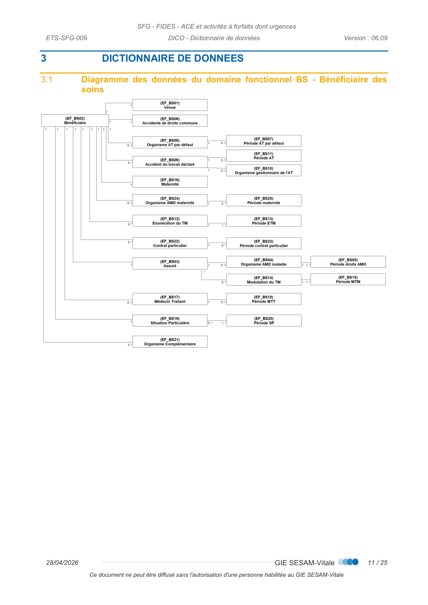
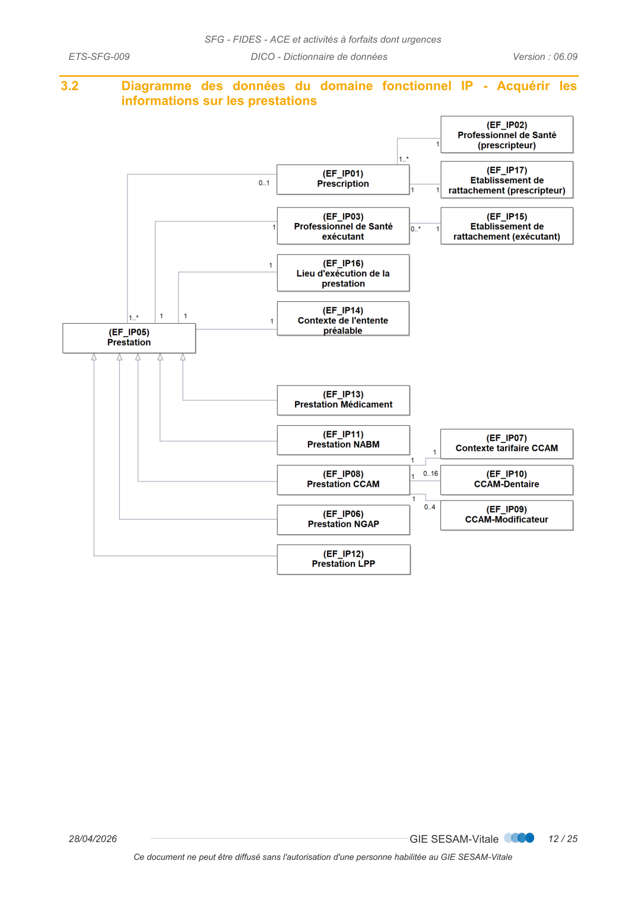
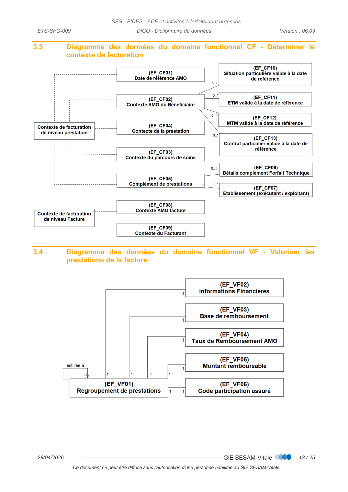
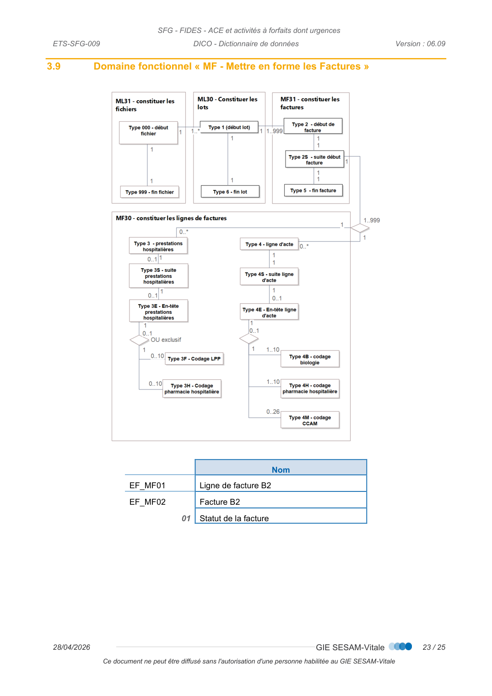
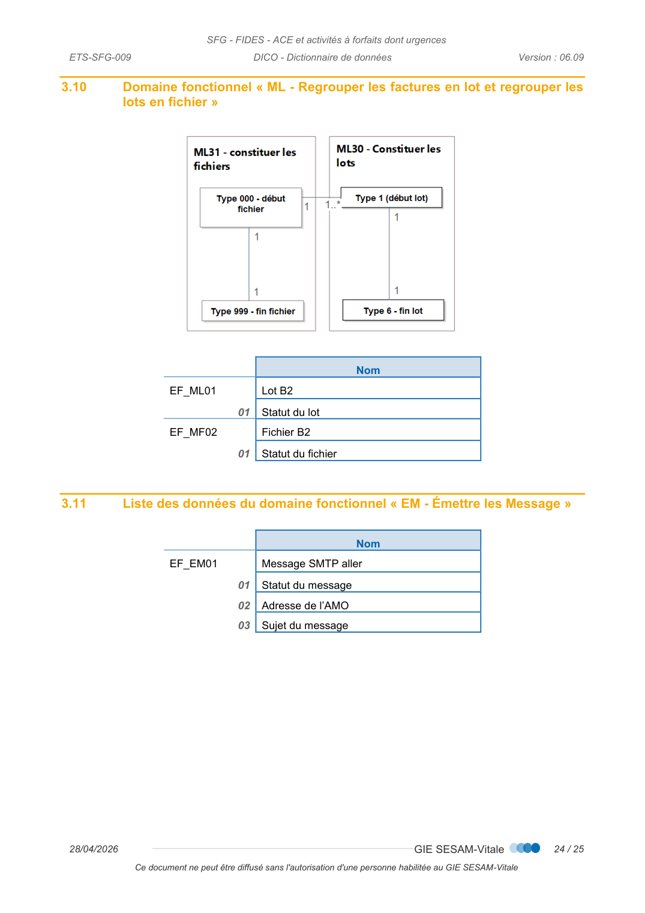

# DICO — Dictionnaire de données

_Pages 350–374 du PDF source._


<!-- p.350 -->
DICO  -  Dictionnaire de données


<!-- p.351 -->
DICO - Dictionnaire de données
arrangement, quel que soit le procédé utilisé.
des sanctions pour l’auteur du délit.
CONTACTS
Pour toute question technique ou fonctionnelle, contactez le Centre de services :
•
e-mail : centre-de-service@sesam-vitale.fr

<!-- p.352 -->
DICO - Dictionnaire de données
1
1.1
1.2
1.3
1.4
1.5
1.6
2
3
3.1
3.2
Diagramme des données du domaine fonctionnel IP - Acquérir les informations sur les
3.3
3.4
3.5
3.6
3.7
3.8
3.9

<!-- p.353 -->
DICO - Dictionnaire de données

## 1 Introduction


### 1.1 Objectif du document

Ce document a pour but d’externaliser et de centraliser dans un même document : le
glossaire (définitions et abréviations) ainsi que les modèles de données, utilisés dans les
processus de la présente SFG.

### 1.2 Statut du document

De référence

### 1.3 Positionnement du document dans le dossier de SFG

 [PG] – Présentation Générale

### 1.4 Documents de référence

 [PG] – Présentation Générale

### 1.5 Définitions

Définitions
Accident de Droit Commun
La notion d’accident de droit commun est utilisée pour :
 les accidents de circulation, mais aussi les accidents dans lesquels la
responsabilité d'un tiers, quel qu'il soit, peut être mise en cause,
 les accidents de la vie courante survenus soit à la maison, à  l'école, ou
sur les aires de sport ou de loisirs où la victime se blesse seule (accident
domestique, accident de sport, accident scolaire, accident de loisir,
jardinage, etc..).
pour les bénéficiaires de tous les régimes hormis les bénéficiaires non
salariés du régime agricole.
Accident de la vie privée
Le terme « accident de la vie privée » est utilisé pour tous les bénéficiaires
non salariés du régime agricole et est équivalent à la notion « d’accident
de droit commun » pour les autres régimes.
Acte global (CCAM)
Un acte global comprend l’ensemble des gestes nécessaires à sa
réalisation dans le même temps d’intervention ou d’examen,
conformément aux données acquises de la science et au descriptif de
l’acte dans la liste.
L’acte global est soit un acte isolé, qui peut être réalisé de manière
indépendante, soit une procédure, qui est un regroupement usuel et
pertinent d’actes isolés.
Actes en série
Synonyme de traitements en série

<!-- transcrit de p.353 (ex-figure) -->

| Terme | Définition |
| --- | --- |
| Accident de Droit Commun | La notion d'accident de droit commun est utilisée pour : les accidents de circulation, mais aussi les accidents dans lesquels la responsabilité d'un tiers, quel qu'il soit, peut être mise en cause ; les accidents de la vie courante survenus soit à la maison, à l'école, ou sur les aires de sport ou de loisirs où la victime se blesse seule (accident domestique, accident de sport, accident scolaire, accident de loisir, jardinage, etc.). Pour les bénéficiaires de tous les régimes hormis les bénéficiaires non salariés du régime agricole. |
| Accident de la vie privée | Le terme « accident de la vie privée » est utilisé pour tous les bénéficiaires non salariés du régime agricole et est équivalent à la notion « d'accident de droit commun » pour les autres régimes. |
| Acte global (CCAM) | Un acte global comprend l'ensemble des gestes nécessaires à sa réalisation dans le même temps d'intervention ou d'examen, conformément aux données acquises de la science et au descriptif de l'acte dans la liste. L'acte global est soit un acte isolé, qui peut être réalisé de manière indépendante, soit une procédure, qui est un regroupement usuel et pertinent d'actes isolés. |
| Actes en série | Synonyme de traitements en série. |


<!-- p.354 -->
DICO - Dictionnaire de données
Définitions
Acte isolé
En CCAM :
Un acte isolé est un acte qui peut être réalisé de manière indépendante. Il
peut s’agir d’un acte simple comme « biopsie de paupière » ; il peut s’agir
d’un acte plus complexe comme « amygdalectomie par dissection ».
En NGAP :
1. Les coefficients inférieurs à 15 ne sont pas fixés à l'acte global et
correspondent à des actes isolés. De ce fait, les actes (pansements, par
exemple) consécutifs à des interventions d'un coefficient inférieur à 15
sont cotés à part. Le médecin ne doit noter une consultation ou une visite
que lorsque les séances de soins consécutives à l'intervention
s'accompagnent d'un examen du malade.
2. Lorsqu'il s'agit d'actes multiples effectués au cours de la même séance,
les soins consécutifs sont honorés à part, même si le coefficient total
correspondant à l'ensemble des actes dépasse 15, à la condition que le
coefficient isolé de chacun des actes soit au plus égal à 14.
Cas d’erreur
Arrêt du fonctionnement du système.
Éclatement à la source
Quel que soit le mode de gestion de la part complémentaire (conjointe ou
séparée), lorsque l’établissement produit une facture porteuse de la part
complémentaire (papier ou électronique) et qu’il l’adresse à l’organisme
gestionnaire de la part complémentaire, il doit mentionner cet envoi dans
la facture B2 adressée à l’AMO, via une valorisation à « F » du top
éclatement (type 2 pos.95). Dans ce cas l’AMO n’adressera pas d’image
décompte à l’organisme complémentaire, conformément à la position de
l’UNOCAM (cf. lettre UNOCAM du 29 mai 2008).
Facturation unique
Mode de facturation lorsque la part complémentaire et la part obligatoire
sont transmises sur une facture unique.
Gestion conjointe
Mode de gestion lorsque la part complémentaire est traitée par le même
organisme que la part obligatoire.
Exemple : Pour les bénéficiaires qui ont une complémentaire en gestion
pour compte à la MSA, la MSA assure le traitement des 2 parts obligatoire
et complémentaire (gestion conjointe). Néanmoins, cette situation de
gestion conjointe ne donne pas lieu (à ce jour) à la production par
l’établissement d’une facture unique porteuse des 2 parts mais à deux
factures distinctes adressées à la MSA :
Une facture de la part obligatoire,
Une facture de la part complémentaire (hors périmètre des présentes
SFG).
Gestion séparée
Mode de gestion pour lequel la part obligatoire et la part complémentaire
ne sont pas traitées par le même organisme.
La transmission de la part complémentaire, dans ce cas, ne fait pas partie
du périmètre des présentes SFG.

<!-- transcrit de p.354 (ex-figure) -->

| Terme | Définition |
| --- | --- |
| Acte isolé | En CCAM : un acte isolé est un acte qui peut être réalisé de manière indépendante. Il peut s'agir d'un acte simple comme « biopsie de paupière » ; il peut s'agir d'un acte plus complexe comme « amygdalectomie par dissection ». En NGAP : 1. Les coefficients inférieurs à 15 ne sont pas fixés à l'acte global et correspondent à des actes isolés. De ce fait, les actes (pansements, par exemple) consécutifs à des interventions d'un coefficient inférieur à 15 sont cotés à part. Le médecin ne doit noter une consultation ou une visite que lorsque les séances de soins consécutives à l'intervention s'accompagnent d'un examen du malade. 2. Lorsqu'il s'agit d'actes multiples effectués au cours de la même séance, les soins consécutifs sont honorés à part, même si le coefficient total correspondant à l'ensemble des actes dépasse 15, à la condition que le coefficient isolé de chacun des actes soit au plus égal à 14. |
| Cas d'erreur | Arrêt du fonctionnement du système. |
| Éclatement à la source | Quel que soit le mode de gestion de la part complémentaire (conjointe ou séparée), lorsque l'établissement produit une facture porteuse de la part complémentaire (papier ou électronique) et qu'il l'adresse à l'organisme gestionnaire de la part complémentaire, il doit mentionner cet envoi dans la facture B2 adressée à l'AMO, via une valorisation à « F » du top éclatement (type 2 pos.95). Dans ce cas l'AMO n'adressera pas d'image décompte à l'organisme complémentaire, conformément à la position de l'UNOCAM (cf. lettre UNOCAM du 29 mai 2008). |
| Facturation unique | Mode de facturation lorsque la part complémentaire et la part obligatoire sont transmises sur une facture unique. |
| Gestion conjointe | Mode de gestion lorsque la part complémentaire est traitée par le même organisme que la part obligatoire. Exemple : pour les bénéficiaires qui ont une complémentaire en gestion pour compte à la MSA, la MSA assure le traitement des 2 parts obligatoire et complémentaire (gestion conjointe). Néanmoins, cette situation de gestion conjointe ne donne pas lieu (à ce jour) à la production par l'établissement d'une facture unique porteuse des 2 parts mais à deux factures distinctes adressées à la MSA : une facture de la part obligatoire, une facture de la part complémentaire (hors périmètre des présentes SFG). |
| Gestion séparée | Mode de gestion pour lequel la part obligatoire et la part complémentaire ne sont pas traitées par le même organisme. La transmission de la part complémentaire, dans ce cas, ne fait pas partie du périmètre des présentes SFG. |


<!-- p.355 -->
DICO - Dictionnaire de données
Définitions
Phase CCAM
La phase est utilisée pour identifier un traitement qui se déroule dans le
temps (par exemple : interventions réalisées en plusieurs phases). Le
code phase (champ 4 de la CCAM) permet de distinguer les différentes
phases du traitement.
Ce code permet de déclencher un paiement partiel par phase pour la
tarification.
Une phase est un ensemble de séances (maximum 26 séances en B2).
En terme de structure B2, les différentes séances, facturées dans la même
facture, donneront lieu chacune à un type B2-4M (un par séance) suivant
le même type B2-4. Tous les enregistrements 4M seront identiques, à la
date de séance et n° de séquence près. Chaque type 4M associé à un
même type 4 est numéroté par son n° de séquence, compris entre 1 et 26.
Une même phase peut être découpée au maximum en 26 séances (soit 1
visite de contrôle tous les 15 jours pendant un an, ce qui représente le cas
de figure le plus important envisagé).
Prestation
Dans le système de facturation spécifié dans les présentes SFG, le terme
« prestation » est un terme générique désignant les actes de soins et les
« compléments de rémunération » en lien avec les soins.
Prestations liées
Une prestation liée est une prestation ayant un lien médical avec un forfait
: acte générateur et / ou acte complémentaire en lien avec la venue du
patient. Les actes réalisés le même jour mais sans aucun rapport médical
avec le forfait doivent être transmises sur une autre facture.
Par exemple, on peut avoir sur la même facture un acte CCAM (gastro-entérologie)
générant un forfait SE + le forfait SE + une séquence de cardiologie (ECG + CS), à
condition que l'ECG et la CS aient un rapport médical avec l'acte CCAM de gastro-gastro-
entérologie réalisé. Si la CS et l'ECG sont sans rapport avec l’acte CCAM, ces prestations
doivent faire l'objet d'une autre facture, même si la date d’exécution est identique.
Procédure (CCAM)
Regroupement usuel et pertinent d’actes isolés (CCAM).
Professionnel de santé
(PS)
Dans les présentes SFG, le terme « professionnel de santé » (PS) désigne
soit l’individu prescripteur des actes soit l’exécutant des actes. Un
Professionnel de santé exerce une activité dans un établissement
géographique (lieu d’exercice).
Régime Local frontalier
Le cas général pour bénéficier du régime local frontalier est d’exercer une
activité salariée dans un état membre et de résider en Alsace et Moselle.
Ex. : un Alsacien travaillant en Allemagne bénéficie du régime local
frontalier (s’il remplit les conditions)
Régime Local Alsace-
Moselle
Le cas général pour bénéficier du régime local est d’exercer une activité
salariée en Alsace Moselle.
Ex. : un Alsacien travaillant en Alsace bénéficie du régime local Alsace-
Moselle (s’il remplit les conditions)

<!-- transcrit de p.355 (ex-figure) -->

| Terme | Définition |
| --- | --- |
| Phase CCAM | La phase est utilisée pour identifier un traitement qui se déroule dans le temps (par exemple : interventions réalisées en plusieurs phases). Le code phase (champ 4 de la CCAM) permet de distinguer les différentes phases du traitement. Ce code permet de déclencher un paiement partiel par phase pour la tarification. Une phase est un ensemble de séances (maximum 26 séances en B2). En terme de structure B2, les différentes séances, facturées dans la même facture, donneront lieu chacune à un type B2-4M (un par séance) suivant le même type B2-4. Tous les enregistrements 4M seront identiques, à la date de séance et n° de séquence près. Chaque type 4M associé à un même type 4 est numéroté par son n° de séquence, compris entre 1 et 26. Une même phase peut être découpée au maximum en 26 séances (soit 1 visite de contrôle tous les 15 jours pendant un an, ce qui représente le cas de figure le plus important envisagé). |
| Prestation | Dans le système de facturation spécifié dans les présentes SFG, le terme « prestation » est un terme générique désignant les actes de soins et les « compléments de rémunération » en lien avec les soins. |
| Prestations liées | Une prestation liée est une prestation ayant un lien médical avec un forfait : acte générateur et / ou acte complémentaire en lien avec la venue du patient. Les actes réalisés le même jour mais sans aucun rapport médical avec le forfait doivent être transmises sur une autre facture. Par exemple, on peut avoir sur la même facture un acte CCAM (gastro-entérologie) générant un forfait SE + le forfait SE + une séquence de cardiologie (ECG + CS), à condition que l'ECG et la CS aient un rapport médical avec l'acte CCAM de gastro-entérologie réalisé. Si la CS et l'ECG sont sans rapport avec l'acte CCAM, ces prestations doivent faire l'objet d'une autre facture, même si la date d'exécution est identique. |
| Procédure (CCAM) | Regroupement usuel et pertinent d'actes isolés (CCAM). |
| Professionnel de santé (PS) | Dans les présentes SFG, le terme « professionnel de santé » (PS) désigne soit l'individu prescripteur des actes soit l'exécutant des actes. Un Professionnel de santé exerce une activité dans un établissement géographique (lieu d'exercice). |
| Régime Local frontalier | Le cas général pour bénéficier du régime local frontalier est d'exercer une activité salariée dans un état membre et de résider en Alsace et Moselle. Ex. : un Alsacien travaillant en Allemagne bénéficie du régime local frontalier (s'il remplit les conditions). |
| Régime Local Alsace-Moselle | Le cas général pour bénéficier du régime local est d'exercer une activité salariée en Alsace Moselle. Ex. : un Alsacien travaillant en Alsace bénéficie du régime local Alsace-Moselle (s'il remplit les conditions). |


<!-- p.356 -->
DICO - Dictionnaire de données
Séance de soins
Actes d’infirmiers ou de kinésithérapeutes :
Une séance de soins correspond à un ensemble d’actes pratiqués par un
même professionnel de santé sur le même patient dans une même
temporalité (exemple : un pansement le matin et un pansement l’après-
midi donnent lieu à 2 séances de soins).
Acte de Biologie :
Une séance est l’ensemble des actes de biologie associés à un
prélèvement.
CCAM :
Dans la CCAM, le terme "séance" concerne un acte dont le résultat final
nécessite habituellement la répétition.
Acte réalisé en plusieurs séances dans une même phase
Un acte CCAM réalisé pour une même activité et une même phase, peut
être découpé en plusieurs séances étalées sur une période de temps au
sein d’une seule facturation.
Pour toute phase d'une même activité d'un même acte CCAM, le champ
n°33 de la base CCAM indique la période de temps au cours de laquelle
cette phase peut être étalée. Cette notion de découpage en séances
pourra par la suite correspondre à la pratique de certains actes. Le
paiement est effectué à la phase et non à la séance. Les différentes
séances doivent cependant être renseignées.
Situation Particulière
Contexte métier impactant tout ou partie d’un processus d’utilisation du
système (exemple : C2S).
Traitements en série
On parle de traitements en série dès qu’il s’agit d’actes facturés dans le
cadre d’une prescription et exécutés par un Professionnel de Santé de la
famille des Auxiliaires médicaux ou par une sage-femme (famille
Prescripteurs).
Téléconsultation
La téléconsultation est une consultation médicale réalisée via une
technologie d’information et de communication (TIC) qui met en rapport un
professionnel médical et un patient en mode synchrone. Un professionnel
de santé peut être présent auprès du patient pour assister le professionnel
médical téléconsultant.
Téléexpertise
La téléexpertise permet à un médecin dit « médecin requérant » (médecin
traitant ou autre médecin), de solliciter un confrère, dit « médecin requis »
en raison de sa formation ou de sa compétence particulière, sur la base
d’informations ou d’éléments médicaux liés à la prise en charge d’un
patient, et ce, hors de la présence de ce dernier.
Accompagnement à la
téléconsultation
L’accompagnement à la téléconsultation est l’accompagnement du patient
à la téléconsultation par les infirmiers.

### 1.6 Guide de lecture

 Cf. [PG] - Présentation Générale

<!-- transcrit de p.356 (ex-figure) -->

| Terme | Définition |
| --- | --- |
| Séance de soins | Actes d'infirmiers ou de kinésithérapeutes : une séance de soins correspond à un ensemble d'actes pratiqués par un même professionnel de santé sur le même patient dans une même temporalité (exemple : un pansement le matin et un pansement l'après-midi donnent lieu à 2 séances de soins). Acte de Biologie : une séance est l'ensemble des actes de biologie associés à un prélèvement. CCAM : dans la CCAM, le terme "séance" concerne un acte dont le résultat final nécessite habituellement la répétition. Acte réalisé en plusieurs séances dans une même phase : un acte CCAM réalisé pour une même activité et une même phase, peut être découpé en plusieurs séances étalées sur une période de temps au sein d'une seule facturation. Pour toute phase d'une même activité d'un même acte CCAM, le champ n°33 de la base CCAM indique la période de temps au cours de laquelle cette phase peut être étalée. Cette notion de découpage en séances pourra par la suite correspondre à la pratique de certains actes. Le paiement est effectué à la phase et non à la séance. Les différentes séances doivent cependant être renseignées. |
| Situation Particulière | Contexte métier impactant tout ou partie d'un processus d'utilisation du système (exemple : C2S). |
| Traitements en série | On parle de traitements en série dès qu'il s'agit d'actes facturés dans le cadre d'une prescription et exécutés par un Professionnel de Santé de la famille des Auxiliaires médicaux ou par une sage-femme (famille Prescripteurs). |
| Téléconsultation | La téléconsultation est une consultation médicale réalisée via une technologie d'information et de communication (TIC) qui met en rapport un professionnel médical et un patient en mode synchrone. Un professionnel de santé peut être présent auprès du patient pour assister le professionnel médical téléconsultant. |
| Téléexpertise | La téléexpertise permet à un médecin dit « médecin requérant » (médecin traitant ou autre médecin), de solliciter un confrère, dit « médecin requis » en raison de sa formation ou de sa compétence particulière, sur la base d'informations ou d'éléments médicaux liés à la prise en charge d'un patient, et ce, hors de la présence de ce dernier. |
| Accompagnement à la téléconsultation | L'accompagnement à la téléconsultation est l'accompagnement du patient à la téléconsultation par les infirmiers. |


<!-- p.357 -->
DICO - Dictionnaire de données

## 2 ABREVIATIONS

Terme
Définition
ACE
Actes et Consultations Externes
APE
Administration de Produits en Externes
ATU
Accueil et Traitement des Urgences
Autorisation Temporaire d'Utilisation
C2S
Complémentaire santé solidaire
AMC
Assurance Maladie Complémentaire
AME
Aide Médicale d’Etat
AMM
Autorisation de Mise sur le Marché
AMO
Assurance Maladie Obligatoire
ARL
Accusé de Réception Logique
ARS
Agence Régionale de Santé
ASPA
Allocation de Solidarité aux Personnes Agées (anciennement FSV)
AT-MP
Accident du Travail – Maladie Professionnelle
ATIH
Agence Technique de l’Information sur l’Hospitalisation
BDD
Bilan Bucco-Dentaire
BR
Base de Remboursement
BS
Bénéficiaire des Soins
CAS
Contrat d’Accès aux Soins
CCAM
Classification Commune des Actes Médicaux
CEAM
Carte Européenne d’Assurance Maladie
CEPS
Comité économique des produits de santé
CFISC
Coefficient Fiscal de reprise des effets des dispositifs d’allègements fiscaux et sociaux
CSEGUR
Coefficient de revalorisation SEGUR
CTOM
Coefficient des Territoires outre-mer
CG
Caisse Gestionnaire
CLCC
Centres de Lutte Contre le Cancer
Coefficient de
transition
Coefficient calculé pour chaque établissement de façon à maintenir le niveau de
recette (équilibrer les ressources avant / après bascule en facturation individuelle)
Coefficient
géographique
Coefficient appliqué pour compenser des surcoûts structurels  liés à une implantation
géographique (ex. Île de France, Corse, DOM).
Coefficient
prudentiel
Coefficient appliqué pour minorer les prestations des établissements de santé, de
manière à concourir au respect de l’objectif national de dépenses d’assurance maladie.
CSS
Code de la Sécurité Sociale
CSP
Code de la Santé Publique
Coefficient MCO /
HAD
Ce coefficient s’obtient en multipliant le coefficient de transition, le coefficient
géographique et le coefficient prudentiel.

<!-- transcrit de p.357 (ex-figure) -->

| Terme | Définition |
| --- | --- |
| ACE | Actes et Consultations Externes |
| APE | Administration de Produits en Externes |
| ATU | Accueil et Traitement des Urgences / Autorisation Temporaire d'Utilisation |
| C2S | Complémentaire santé solidaire |
| AMC | Assurance Maladie Complémentaire |
| AME | Aide Médicale d'Etat |
| AMM | Autorisation de Mise sur le Marché |
| AMO | Assurance Maladie Obligatoire |
| ARL | Accusé de Réception Logique |
| ARS | Agence Régionale de Santé |
| ASPA | Allocation de Solidarité aux Personnes Agées (anciennement FSV) |
| AT-MP | Accident du Travail – Maladie Professionnelle |
| ATIH | Agence Technique de l'Information sur l'Hospitalisation |
| BDD | Bilan Bucco-Dentaire |
| BR | Base de Remboursement |
| BS | Bénéficiaire des Soins |
| CAS | Contrat d'Accès aux Soins |
| CCAM | Classification Commune des Actes Médicaux |
| CEAM | Carte Européenne d'Assurance Maladie |
| CEPS | Comité économique des produits de santé |
| CFISC | Coefficient Fiscal de reprise des effets des dispositifs d'allègements fiscaux et sociaux |
| CSEGUR | Coefficient de revalorisation SEGUR |
| CTOM | Coefficient des Territoires outre-mer |
| CG | Caisse Gestionnaire |
| CLCC | Centres de Lutte Contre le Cancer |
| Coefficient de transition | Coefficient calculé pour chaque établissement de façon à maintenir le niveau de recette (équilibrer les ressources avant / après bascule en facturation individuelle) |
| Coefficient géographique | Coefficient appliqué pour compenser des surcoûts structurels liés à une implantation géographique (ex. Île de France, Corse, DOM). |
| Coefficient prudentiel | Coefficient appliqué pour minorer les prestations des établissements de santé, de manière à concourir au respect de l'objectif national de dépenses d'assurance maladie. |
| CSS | Code de la Sécurité Sociale |
| CSP | Code de la Santé Publique |
| Coefficient MCO / HAD | Ce coefficient s'obtient en multipliant le coefficient de transition, le coefficient géographique et le coefficient prudentiel. |


<!-- p.358 -->
DICO - Dictionnaire de données
CPU
Caisse de Paiement Unique (également appelée CIE : Caisse Interlocutrice de
l’Etablissement)
DA
Dépassement Autorisé
DGFiP
Direction Générale des Finances Publiques
DMT
Discipline Médico-Tarifaire
EF
Entité Fonctionnelle
EPS
Établissement Publics de Santé
Etablissements de santé mentionnés aux a de l’article L. 162-22-6 du code de la sécurité
sociale
Facturation Individuelle Des Établissements de Santé
Activités à forfait
Forfait  « Arrêté de Prestation » (ATU/FFM/SEx/APE)
Forfait FFM
Forfait petit Matériel
Forfait FSD
Forfait Sécurité Dermatologie
FT
Forfait Technique
GCS
Groupement de Coopération Sanitaire
IPS
Indicateur Parcours de Soins
LAP
Liste des Actes et Prestations
LPP
Liste des Produits et Prestations
MCO(O)
Médecine Chirurgie Obstétrique Odontologie
Forfait SE
Forfait Sécurité et Environnement
Forfait VDE
Forfait Vidéo Capsule
MT
Mode de Traitement
MTT
Médecin Traitant
MTM
Majoration du Ticket Modérateur
NABM
Nomenclature des Actes de Biologie Médicale
NGAP
Nomenclature Générale des Actes Professionnels
NOEMIE
Norme Ouverte d’Échange entre la Maladie et les Intervenants Extérieurs
Norme utilisée pour les flux retours (RSP et ARL)
ONDAM
Objectif National de Dépenses d’Assurance Maladie
PE
Professionnels de l’Établissements
PIE
Prestation Inter-Établissements
PIA
Prestation Inter-Activités
PSC
Parcours de Soins Coordonné
PSY
Psychiatrie
PS
Professionnels de Santé
PNL
Etablissements Privés Non Lucratifs (PNL)
Etablissements de santé mentionnés aux b et c de l’article L. 162-22-6 du code de la
sécurité sociale
PU
Prix Unitaire

<!-- transcrit de p.358 (ex-figure) -->

| Terme | Définition |
| --- | --- |
| CPU | Caisse de Paiement Unique (également appelée CIE : Caisse Interlocutrice de l'Etablissement) |
| DA | Dépassement Autorisé |
| DGFiP | Direction Générale des Finances Publiques |
| DMT | Discipline Médico-Tarifaire |
| EF | Entité Fonctionnelle |
| EPS | Établissement Publics de Santé. Établissements de santé mentionnés aux a de l'article L. 162-22-6 du code de la sécurité sociale |
| FIDES | Facturation Individuelle Des Établissements de Santé |
| Activités à forfait | Forfait « Arrêté de Prestation » (ATU/FFM/SEx/APE) |
| Forfait FFM | Forfait petit Matériel |
| Forfait FSD | Forfait Sécurité Dermatologie |
| FT | Forfait Technique |
| GCS | Groupement de Coopération Sanitaire |
| IPS | Indicateur Parcours de Soins |
| LAP | Liste des Actes et Prestations |
| LPP | Liste des Produits et Prestations |
| MCO(O) | Médecine Chirurgie Obstétrique Odontologie |
| Forfait SE | Forfait Sécurité et Environnement |
| Forfait VDE | Forfait Vidéo Capsule |
| MT | Mode de Traitement |
| MTT | Médecin Traitant |
| MTM | Majoration du Ticket Modérateur |
| NABM | Nomenclature des Actes de Biologie Médicale |
| NGAP | Nomenclature Générale des Actes Professionnels |
| NOEMIE | Norme Ouverte d'Échange entre la Maladie et les Intervenants Extérieurs. Norme utilisée pour les flux retours (RSP et ARL) |
| ONDAM | Objectif National de Dépenses d'Assurance Maladie |
| PE | Professionnels de l'Établissements |
| PIE | Prestation Inter-Établissements |
| PIA | Prestation Inter-Activités |
| PSC | Parcours de Soins Coordonné |
| PSY | Psychiatrie |
| PS | Professionnels de Santé |
| PNL | Etablissements Privés Non Lucratifs (PNL). Etablissements de santé mentionnés aux b et c de l'article L. 162-22-6 du code de la sécurité sociale |
| PU | Prix Unitaire |


<!-- p.359 -->
DICO - Dictionnaire de données
RG
Règle de Gestion
RH
Réserve Hospitalière
RSP
Rejet Signalement Paiement
RPPS
Répertoire Partagé des Professionnels de Santé
SMR
Soins Médicaux et de Réadaptation
SIH
Système d’Information Hospitalier
SFG
Spécifications Fonctionnelles Générales
SNN
Site National Noémie
SP
Situation Particulière
TM
Ticket Modérateur
TMF
Ticket Modérateur Forfaitaire
TPG
Trésorier-Payeur Général
UCD
Unité Commune de Dispensation

<!-- transcrit de p.359 (ex-figure) -->

| Terme | Définition |
| --- | --- |
| RG | Règle de Gestion |
| RH | Réserve Hospitalière |
| RSP | Rejet Signalement Paiement |
| RPPS | Répertoire Partagé des Professionnels de Santé |
| SMR | Soins Médicaux et de Réadaptation |
| SIH | Système d'Information Hospitalier |
| SFG | Spécifications Fonctionnelles Générales |
| SNN | Site National Noémie |
| SP | Situation Particulière |
| TM | Ticket Modérateur |
| TMF | Ticket Modérateur Forfaitaire |
| TPG | Trésorier-Payeur Général |
| UCD | Unité Commune de Dispensation |


<!-- p.363 -->
DICO - Dictionnaire de données

## 3 DICTIONNAIRE DE DONNEES

3.1
Diagramme des données du domaine fonctionnel BS - Bénéficiaire des
soins


*Figure (p.360) : Diagramme des données du domaine fonctionnel BS - Bénéficiaire des*

> Transcription Mermaid (depuis la figure ci-dessus) :

```mermaid
erDiagram
    EF_BS02["EF_BS02 Bénéficiaire"] ||--|| EF_BS01["EF_BS01 Venue"] : a
    EF_BS02 ||--o| EF_BS06["EF_BS06 Accidents de droits communs"] : a
    EF_BS02 ||--o| EF_BS08["EF_BS08 Organisme AT par défaut"] : a
    EF_BS08 ||--o| EF_BS07["EF_BS07 Période AT par défaut"] : a
    EF_BS02 ||--o{ EF_BS09["EF_BS09 Accident du travail déclaré"] : a
    EF_BS09 ||--o| EF_BS11["EF_BS11 Période AT"] : a
    EF_BS09 ||--o| EF_BS10["EF_BS10 Organisme gestionnaire de l AT"] : a
    EF_BS02 ||--|| EF_BS16["EF_BS16 Maternité"] : a
    EF_BS02 ||--o| EF_BS24["EF_BS24 Organisme AMO maternité"] : a
    EF_BS24 ||--o{ EF_BS25["EF_BS25 Période maternité"] : a
    EF_BS02 ||--o{ EF_BS12["EF_BS12 Exonération du TM"] : a
    EF_BS12 ||--|{ EF_BS13["EF_BS13 Période ETM"] : a
    EF_BS02 ||--o{ EF_BS22["EF_BS22 Contrat particulier"] : a
    EF_BS22 ||--o{ EF_BS23["EF_BS23 Période contrat particulier"] : a
    EF_BS02 ||--|| EF_BS03["EF_BS03 Assuré"] : a
    EF_BS03 ||--o| EF_BS04["EF_BS04 Organisme AMO maladie"] : a
    EF_BS04 ||--|{ EF_BS05["EF_BS05 Période droits AMO"] : a
    EF_BS03 ||--o{ EF_BS14["EF_BS14 Modulation du TM"] : a
    EF_BS14 ||--|{ EF_BS15["EF_BS15 Période MTM"] : a
    EF_BS02 ||--o| EF_BS17["EF_BS17 Médecin Traitant"] : a
    EF_BS17 ||--o| EF_BS18["EF_BS18 Période MTT"] : a
    EF_BS02 ||--o{ EF_BS19["EF_BS19 Situation Particulière"] : a
    EF_BS19 ||--|{ EF_BS20["EF_BS20 Période SP"] : a
    EF_BS02 ||--o{ EF_BS21["EF_BS21 Organisme Complémentaire"] : a
```


<!-- p.366 -->
DICO - Dictionnaire de données

### 3.2 Diagramme des données du domaine fonctionnel IP - Acquérir les informations sur les prestations



*Figure (p.361) : Diagramme des données du domaine fonctionnel IP - Acquérir les*

> Transcription Mermaid (depuis la figure ci-dessus) :

```mermaid
erDiagram
    EF_IP05["EF_IP05 Prestation"] ||--o| EF_IP01["EF_IP01 Prescription"] : a
    EF_IP01 ||--|{ EF_IP02["EF_IP02 Professionnel de Santé (prescripteur)"] : a
    EF_IP01 ||--|| EF_IP17["EF_IP17 Etablissement de rattachement (prescripteur)"] : a
    EF_IP05 ||--|| EF_IP03["EF_IP03 Professionnel de Santé exécutant"] : a
    EF_IP03 ||--o{ EF_IP15["EF_IP15 Etablissement de rattachement (exécutant)"] : a
    EF_IP05 ||--|| EF_IP16["EF_IP16 Lieu d exécution de la prestation"] : a
    EF_IP05 ||--|| EF_IP14["EF_IP14 Contexte de l entente préalable"] : a
    EF_IP05 ||--o{ EF_IP13["EF_IP13 Prestation Médicament"] : "est une"
    EF_IP05 ||--o{ EF_IP11["EF_IP11 Prestation NABM"] : "est une"
    EF_IP05 ||--o{ EF_IP08["EF_IP08 Prestation CCAM"] : "est une"
    EF_IP05 ||--o{ EF_IP06["EF_IP06 Prestation NGAP"] : "est une"
    EF_IP05 ||--o{ EF_IP12["EF_IP12 Prestation LPP"] : "est une"
    EF_IP08 ||--|| EF_IP07["EF_IP07 Contexte tarifaire CCAM"] : a
    EF_IP08 ||--o{ EF_IP10["EF_IP10 CCAM-Dentaire (0..16)"] : a
    EF_IP08 ||--o{ EF_IP09["EF_IP09 CCAM-Modificateur (0..4)"] : a
```


<!-- p.352 -->
DICO - Dictionnaire de données

### 3.3 Diagramme des données du domaine fonctionnel CF - Déterminer le contexte de facturation


### 3.4 Diagramme des données du domaine fonctionnel VF - Valoriser les prestations de la facture



*Figure (p.362) : Diagramme des données du domaine fonctionnel CF - Déterminer le*

> Transcription Mermaid (depuis la figure ci-dessus) :

```mermaid
erDiagram
    %% CF - Contexte de facturation de niveau prestation (regroupement)
    NIV_PRESTATION["Contexte de facturation de niveau prestation"] ||--|| EF_CF01["EF_CF01 Date de référence AMO"] : a
    NIV_PRESTATION ||--|| EF_CF02["EF_CF02 Contexte AMO du Bénéficiaire"] : a
    NIV_PRESTATION ||--|| EF_CF04["EF_CF04 Contexte de la prestation"] : a
    NIV_PRESTATION ||--|| EF_CF03["EF_CF03 Contexte du parcours de soins"] : a
    NIV_PRESTATION ||--|| EF_CF05["EF_CF05 Complément de prestations"] : a
    EF_CF02 ||--o{ EF_CF10["EF_CF10 Situation particulière valide à la date de référence"] : a
    EF_CF02 ||--o{ EF_CF11["EF_CF11 ETM valide à la date de référence"] : a
    EF_CF02 ||--o{ EF_CF12["EF_CF12 MTM valide à la date de référence"] : a
    EF_CF02 ||--o{ EF_CF13["EF_CF13 Contrat particulier valide à la date de référence"] : a
    EF_CF05 ||--o| EF_CF06["EF_CF06 Détails complément Forfait Technique"] : a
    EF_CF05 ||--o{ EF_CF07["EF_CF07 Etablissement (exécutant / exploitant)"] : a
    %% CF - Contexte de facturation de niveau Facture (regroupement)
    NIV_FACTURE["Contexte de facturation de niveau Facture"] ||--|| EF_CF08["EF_CF08 Contexte AMO facture"] : a
    NIV_FACTURE ||--|| EF_CF09["EF_CF09 Contexte du Facturant"] : a
```

```mermaid
erDiagram
    %% VF - Valoriser les prestations de la facture
    EF_VF01["EF_VF01 Regroupement de prestations"] ||--|{ EF_VF01 : "est liée à"
    EF_VF01 ||--|| EF_VF02["EF_VF02 Informations Financières"] : a
    EF_VF01 ||--|| EF_VF03["EF_VF03 Base de remboursement"] : a
    EF_VF01 ||--|| EF_VF04["EF_VF04 Taux de Remboursement AMO"] : a
    EF_VF01 ||--|| EF_VF05["EF_VF05 Montant remboursable"] : a
    EF_VF01 ||--|| EF_VF06["EF_VF06 Code participation assuré"] : a
```


<!-- p.363 -->
DICO - Dictionnaire de données

### 3.5 Liste des données du domaine fonctionnel BS - Bénéficiaire des soins

Nom
EF_BS01
Venue
01
N° d'entrée
02
Date d'entrée
03
Date de sortie
04
Heure de sortie
05
Contexte de la venue
08
A demandé l’anonymat
EF_BS02
Bénéficiaire
01
Date de naissance
02
Rang de naissance
03
NIR certifié + clé
04
Nom de famille (ou nom de naissance)
05
Nom d'usage
06
Prénom
07
Date de certification du NIR
08
Code qualité du bénéficiaire
09
Adresse ligne 1
10
Adresse ligne 2
11
Adresse ligne 3
12
Adresse ligne 4
13
Adresse ligne 5
14
Adresse ligne 6
EF_BS03
Assuré
01
NIR de l'assuré + clé
02
Nature de la PJ AMO
03
Code gestion BGDH
EF_BS04
Organisme AMO maladie
01
Code régime
02
Code caisse gestionnaire
03
Code centre de gestion
EF_BS05
Période droits AMO
01
Date de début de droits AMO
02
Date fin de droits AMO
EF_BS06
Accidents de droits communs

<!-- transcrit de p.363 (ex-figure) -->

| Code EF | N° | Nom |
| --- | --- | --- |
| EF_BS01 |  | Venue |
|  | 01 | N° d'entrée |
|  | 02 | Date d'entrée |
|  | 03 | Date de sortie |
|  | 04 | Heure de sortie |
|  | 05 | Contexte de la venue |
|  | 08 | A demandé l'anonymat |
| EF_BS02 |  | Bénéficiaire |
|  | 01 | Date de naissance |
|  | 02 | Rang de naissance |
|  | 03 | NIR certifié + clé |
|  | 04 | Nom de famille (ou nom de naissance) |
|  | 05 | Nom d'usage |
|  | 06 | Prénom |
|  | 07 | Date de certification du NIR |
|  | 08 | Code qualité du bénéficiaire |
|  | 09 | Adresse ligne 1 |
|  | 10 | Adresse ligne 2 |
|  | 11 | Adresse ligne 3 |
|  | 12 | Adresse ligne 4 |
|  | 13 | Adresse ligne 5 |
|  | 14 | Adresse ligne 6 |
| EF_BS03 |  | Assuré |
|  | 01 | NIR de l'assuré + clé |
|  | 02 | Nature de la PJ AMO |
|  | 03 | Code gestion BGDH |
| EF_BS04 |  | Organisme AMO maladie |
|  | 01 | Code régime |
|  | 02 | Code caisse gestionnaire |
|  | 03 | Code centre de gestion |
| EF_BS05 |  | Période droits AMO |
|  | 01 | Date de début de droits AMO |
|  | 02 | Date fin de droits AMO |
| EF_BS06 |  | Accidents de droits communs |


<!-- p.364 -->
DICO - Dictionnaire de données
02
Factures électroniques acceptées par la caisse
EF_BS07
Période AT par défaut
01
Date début AT par défaut
02
Date fin AT par défaut
EF_BS08
Organisme AT par défaut
01
Code régime
02
Code caisse gestionnaire
03
Code centre gestionnaire
EF_BS09
Accident du travail déclaré
01
Identifiant accident du travail
02
Clé accident du travail
EF_BS10
Organisme gestionnaire de l'AT
01
Code régime
02
Code caisse gestionnaire
03
Code centre gestionnaire
EF_BS11
Période AT
01
Date début AT
02
Date fin AT
EF_BS12
Exonération du TM
01
Libellé ETM
EF_BS13
Période ETM
01
Date début ETM
02
Date fin ETM
EF_BS14
Modulation du TM
01
Libellé MTM
EF_BS15
Période MTM
01
Date début MTM
02
Date fin MTM
EF_BS16
Maternité
01
Date présumée du début de grossesse
02
Date réelle d'accouchement ou date d'adoption
EF_BS17
Médecin Traitant
01
Code existence d'une déclaration de médecin traitant
02
Nom de médecin traitant
03
Prénom du médecin traitant
04
N° d'assurance maladie du médecin traitant

<!-- transcrit de p.364 (ex-figure) -->

| Code EF | N° | Nom |
| --- | --- | --- |
|  | 02 | Factures électroniques acceptées par la caisse |
| EF_BS07 |  | Période AT par défaut |
|  | 01 | Date début AT par défaut |
|  | 02 | Date fin AT par défaut |
| EF_BS08 |  | Organisme AT par défaut |
|  | 01 | Code régime |
|  | 02 | Code caisse gestionnaire |
|  | 03 | Code centre gestionnaire |
| EF_BS09 |  | Accident du travail déclaré |
|  | 01 | Identifiant accident du travail |
|  | 02 | Clé accident du travail |
| EF_BS10 |  | Organisme gestionnaire de l'AT |
|  | 01 | Code régime |
|  | 02 | Code caisse gestionnaire |
|  | 03 | Code centre gestionnaire |
| EF_BS11 |  | Période AT |
|  | 01 | Date début AT |
|  | 02 | Date fin AT |
| EF_BS12 |  | Exonération du TM |
|  | 01 | Libellé ETM |
| EF_BS13 |  | Période ETM |
|  | 01 | Date début ETM |
|  | 02 | Date fin ETM |
| EF_BS14 |  | Modulation du TM |
|  | 01 | Libellé MTM |
| EF_BS15 |  | Période MTM |
|  | 01 | Date début MTM |
|  | 02 | Date fin MTM |
| EF_BS16 |  | Maternité |
|  | 01 | Date présumée du début de grossesse |
|  | 02 | Date réelle d'accouchement ou date d'adoption |
| EF_BS17 |  | Médecin Traitant |
|  | 01 | Code existence d'une déclaration de médecin traitant |
|  | 02 | Nom de médecin traitant |
|  | 03 | Prénom du médecin traitant |
|  | 04 | N° d'assurance maladie du médecin traitant |


<!-- p.365 -->
DICO - Dictionnaire de données
05
N° RPPS
EF_BS18
Période MTT
01
Date début MTT
02
Date fin MTT
EF_BS19
Situation Particulière
01
Code situation particulière
EF_BS20
Période SP
01
Date début SP
02
Date fin SP
EF_BS21
Organisme Complémentaire
01
Identifiant organisme complémentaire
02
Mode de gestion
03
Mode de facturation
EF_BS22
Contrat particulier
01
Code contrat particulier
EF_BS23
Période contrat particulier
01
Date début contrat particulier
02
Date fin contrat particulier
EF_BS24
Organisme AMO maternité
01
Code régime
02
Code caisse gestionnaire
03
Code centre gestionnaire
EF_BS25
Période maternité
01
Date début maternité
02
Date fin maternité

<!-- transcrit de p.365 (ex-figure) -->

| Code EF | N° | Nom |
| --- | --- | --- |
|  | 05 | N° RPPS |
| EF_BS18 |  | Période MTT |
|  | 01 | Date début MTT |
|  | 02 | Date fin MTT |
| EF_BS19 |  | Situation Particulière |
|  | 01 | Code situation particulière |
| EF_BS20 |  | Période SP |
|  | 01 | Date début SP |
|  | 02 | Date fin SP |
| EF_BS21 |  | Organisme Complémentaire |
|  | 01 | Identifiant organisme complémentaire |
|  | 02 | Mode de gestion |
|  | 03 | Mode de facturation |
| EF_BS22 |  | Contrat particulier |
|  | 01 | Code contrat particulier |
| EF_BS23 |  | Période contrat particulier |
|  | 01 | Date début contrat particulier |
|  | 02 | Date fin contrat particulier |
| EF_BS24 |  | Organisme AMO maternité |
|  | 01 | Code régime |
|  | 02 | Code caisse gestionnaire |
|  | 03 | Code centre gestionnaire |
| EF_BS25 |  | Période maternité |
|  | 01 | Date début maternité |
|  | 02 | Date fin maternité |


<!-- p.366 -->
DICO - Dictionnaire de données

### 3.6 Liste des données du domaine fonctionnel IP - Acquérir les informations sur les prestations

Nom
EF_IP05
Prestation
01
Date d'exécution de la prestation
02
Age du bénéficiaire des soins à la date d'exécution de la prestation
03
Motif médical d'exonération
04
Code prestation ou code regroupement
05
Niveau
06
Catégorie
07
Sous-catégorie
08
Nomenclature
09
Domaine d'activité
10
Top codage affiné
12
Identifiant de la connexion vidéo sécurisée
13
Contexte métier
EF_IP14
Contexte de l'entente préalable
01
Top nécessité entente préalable
02
Code accord de l'entente préalable
03
Date d'envoi de la demande d'entente préalable
EF_IP15
Établissement de rattachement (PS exécutant)
01
N° FINESS Géographique de l'établissement de rattachement (PS exécutant)
EF_IP17
Établissement de rattachement (prescripteur)
01
N° FINESS géographique de l'établissement de rattachement (prescripteur)
EF_IP13
Prestation Médicament
01
Code UCD
02
Coefficient de fractionnement
03
Coût TTC lié à la reconstitution du médicament
04
Montant de la marge TTC
05
Prix d'achat négocié TTC
11
Tarif de responsabilité TTC
06
Quantité
07
Montant total facturé TTC
08
Montant unitaire de l'écart indemnisable
09
Montant total de l'écart indemnisable
10
Mode délivrance

<!-- transcrit de p.366 (ex-figure) -->

| Code EF | N° | Nom |
| --- | --- | --- |
| EF_IP05 |  | Prestation |
|  | 01 | Date d'exécution de la prestation |
|  | 02 | Age du bénéficiaire des soins à la date d'exécution de la prestation |
|  | 03 | Motif médical d'exonération |
|  | 04 | Code prestation ou code regroupement |
|  | 05 | Niveau |
|  | 06 | Catégorie |
|  | 07 | Sous-catégorie |
|  | 08 | Nomenclature |
|  | 09 | Domaine d'activité |
|  | 10 | Top codage affiné |
|  | 12 | Identifiant de la connexion vidéo sécurisée |
|  | 13 | Contexte métier |
| EF_IP14 |  | Contexte de l'entente préalable |
|  | 01 | Top nécessité entente préalable |
|  | 02 | Code accord de l'entente préalable |
|  | 03 | Date d'envoi de la demande d'entente préalable |
| EF_IP15 |  | Établissement de rattachement (PS exécutant) |
|  | 01 | N° FINESS Géographique de l'établissement de rattachement (PS exécutant) |
| EF_IP17 |  | Établissement de rattachement (prescripteur) |
|  | 01 | N° FINESS géographique de l'établissement de rattachement (prescripteur) |
| EF_IP13 |  | Prestation Médicament |
|  | 01 | Code UCD |
|  | 02 | Coefficient de fractionnement |
|  | 03 | Coût TTC lié à la reconstitution du médicament |
|  | 04 | Montant de la marge TTC |
|  | 05 | Prix d'achat négocié TTC |
|  | 11 | Tarif de responsabilité TTC |
|  | 06 | Quantité |
|  | 07 | Montant total facturé TTC |
|  | 08 | Montant unitaire de l'écart indemnisable |
|  | 09 | Montant total de l'écart indemnisable |
|  | 10 | Mode délivrance |


<!-- p.367 -->
DICO - Dictionnaire de données
EF_IP12
Prestation LPP
01
Code référence LPP
02
N° SIRET du fabricant ou de l'importateur
03
Tarif de référence ou prix unitaire sur devis TTC
04
Quantité de la prestation LPP
05
Montant total facturé TTC de la prestation LPP
06
Prix unitaire d'achat TTC de la prestation LPP
07
Montant unitaire de l'écart indemnisable
08
Montant total de l'écart indemnisable
09
Mode de délivrance
EF_IP11
Prestation NABM
01
Code affiné NABM
02
Coefficient de la prestation NABM
03
N° d'ordre d'analyse dans la journée
EF_IP10
CCAM-Dentaire
01
Numéro de dent traitée en CCAM
EF_IP09
CCAM-Modificateur
01
Code modificateur CCAM_AMO
EF_IP07
Contexte tarifaire CCAM
01
Contexte tarifaire PS de la prestation
02
Contexte tarifaire BS de la prestation
EF_IP08
Prestation CCAM
01
Code acte CCAM
02
Code activité CCAM
03
Code phase de traitement CCAM
04
Code extension documentaire CCAM
05
Code association CCAM
06
Code remboursement sous condition CCAM
07
Date de la séance de la phase
EF_IP06
Prestation NGAP
01
Coefficient de la prestation NGAP
02
Quantité de la prestation NGAP
03
Dénombrement de la prestation NGAP
05
Numéro de dent traitée en NGAP
EF_IP03
Professionnel de Santé (exécutant)
01
Code spécialité (PS Exécutant)
02
N° RPPS + clé (PS exécutant)

<!-- transcrit de p.367 (ex-figure) -->

| Code EF | N° | Nom |
| --- | --- | --- |
| EF_IP12 |  | Prestation LPP |
|  | 01 | Code référence LPP |
|  | 02 | N° SIRET du fabricant ou de l'importateur |
|  | 03 | Tarif de référence ou prix unitaire sur devis TTC |
|  | 04 | Quantité de la prestation LPP |
|  | 05 | Montant total facturé TTC de la prestation LPP |
|  | 06 | Prix unitaire d'achat TTC de la prestation LPP |
|  | 07 | Montant unitaire de l'écart indemnisable |
|  | 08 | Montant total de l'écart indemnisable |
|  | 09 | Mode de délivrance |
| EF_IP11 |  | Prestation NABM |
|  | 01 | Code affiné NABM |
|  | 02 | Coefficient de la prestation NABM |
|  | 03 | N° d'ordre d'analyse dans la journée |
| EF_IP10 |  | CCAM-Dentaire |
|  | 01 | Numéro de dent traitée en CCAM |
| EF_IP09 |  | CCAM-Modificateur |
|  | 01 | Code modificateur CCAM_AMO |
| EF_IP07 |  | Contexte tarifaire CCAM |
|  | 01 | Contexte tarifaire PS de la prestation |
|  | 02 | Contexte tarifaire BS de la prestation |
| EF_IP08 |  | Prestation CCAM |
|  | 01 | Code acte CCAM |
|  | 02 | Code activité CCAM |
|  | 03 | Code phase de traitement CCAM |
|  | 04 | Code extension documentaire CCAM |
|  | 05 | Code association CCAM |
|  | 06 | Code remboursement sous condition CCAM |
|  | 07 | Date de la séance de la phase |
| EF_IP06 |  | Prestation NGAP |
|  | 01 | Coefficient de la prestation NGAP |
|  | 02 | Quantité de la prestation NGAP |
|  | 03 | Dénombrement de la prestation NGAP |
|  | 05 | Numéro de dent traitée en NGAP |
| EF_IP03 |  | Professionnel de Santé (exécutant) |
|  | 01 | Code spécialité (PS Exécutant) |
|  | 02 | N° RPPS + clé (PS exécutant) |


<!-- p.368 -->
DICO - Dictionnaire de données
03
Secteur + Contrat tarifaire (PS Exécutant)
EF_IP02
Professionnel de Santé (prescripteur)
01
Code spécialité (PS Prescripteur)
02
Situation d'exercice (PS Prescripteur)
03
N° Identification (PS Prescripteur)
04
N° RPPS + clé (PS Prescripteur)
EF_IP01
Prescription
01
Date de prescription
02
Code origine de la prescription
03
Top prescription par médecin SNCF
EF_IP16
Lieu d'exécution de la prestation
01
N° FINESS Géographique (lieu d'exécution)

<!-- transcrit de p.368 (ex-figure) -->

| Code EF | N° | Nom |
| --- | --- | --- |
|  | 03 | Secteur + Contrat tarifaire (PS Exécutant) |
| EF_IP02 |  | Professionnel de Santé (prescripteur) |
|  | 01 | Code spécialité (PS Prescripteur) |
|  | 02 | Situation d'exercice (PS Prescripteur) |
|  | 03 | N° Identification (PS Prescripteur) |
|  | 04 | N° RPPS + clé (PS Prescripteur) |
| EF_IP01 |  | Prescription |
|  | 01 | Date de prescription |
|  | 02 | Code origine de la prescription |
|  | 03 | Top prescription par médecin SNCF |
| EF_IP16 |  | Lieu d'exécution de la prestation |
|  | 01 | N° FINESS Géographique (lieu d'exécution) |


<!-- p.369 -->
DICO - Dictionnaire de données

### 3.7 Liste des données du domaine fonctionnel CF - Déterminer le contexte de facturation

Nom
EF_CF03
Contexte du parcours de soins
01
IPS (Indicateur de Parcours de Soins)
02
Top MT
03
Nom du médecin ayant orienté
04
Prénom du médecin ayant orienté
EF_CF08
Contexte AMO facture
01
Code tiers payant
02
Code régime (facture)
03
Code caisse gestionnaire (facture)
04
Code centre gestionnaire (facture)
EF_CF12
MTM valide à la date de référence
01
Libellé MTM valide à la date de référence
EF_CF11
ETM valide à la date de référence
01
Libellé ETM valide à la date de référence
EF_CF13
Contrat particulier valide à la date de référence
01
Code contrat particulier à la date de référence
EF_CF10
Situation particulière valide à la date de référence
01
Code situation particulière valide à la date de référence
EF_CF04
Contexte de la prestation
01
Nature d'assurance
03
Coefficient de revalorisation SEGUR (CSEGUR)
04
Coefficient de Transition (CT)
05
Coefficient Géographique (CG)
06
Coefficient prudentiel (CP)
07
Code qualificatif de la dépense
08
Top accident de droit commun
09
Date accident de droit commun
10
Identifiant de l'AT correspondant aux soins
11
Top exigence particulière
13
Coefficient de reprise des effets des dispositifs d'allégement fiscaux et sociaux
(CFISC)
19
Coefficient MCO
EF_CF07
Établissement ( Exécutant / exploitant)

<!-- transcrit de p.369 (ex-figure) -->

| Code EF | N° | Nom |
| --- | --- | --- |
| EF_CF03 |  | Contexte du parcours de soins |
|  | 01 | IPS (Indicateur de Parcours de Soins) |
|  | 02 | Top MT |
|  | 03 | Nom du médecin ayant orienté |
|  | 04 | Prénom du médecin ayant orienté |
| EF_CF08 |  | Contexte AMO facture |
|  | 01 | Code tiers payant |
|  | 02 | Code régime (facture) |
|  | 03 | Code caisse gestionnaire (facture) |
|  | 04 | Code centre gestionnaire (facture) |
| EF_CF12 |  | MTM valide à la date de référence |
|  | 01 | Libellé MTM valide à la date de référence |
| EF_CF11 |  | ETM valide à la date de référence |
|  | 01 | Libellé ETM valide à la date de référence |
| EF_CF13 |  | Contrat particulier valide à la date de référence |
|  | 01 | Code contrat particulier à la date de référence |
| EF_CF10 |  | Situation particulière valide à la date de référence |
|  | 01 | Code situation particulière valide à la date de référence |
| EF_CF04 |  | Contexte de la prestation |
|  | 01 | Nature d'assurance |
|  | 03 | Coefficient de revalorisation SEGUR (CSEGUR) |
|  | 04 | Coefficient de Transition (CT) |
|  | 05 | Coefficient Géographique (CG) |
|  | 06 | Coefficient prudentiel (CP) |
|  | 07 | Code qualificatif de la dépense |
|  | 08 | Top accident de droit commun |
|  | 09 | Date accident de droit commun |
|  | 10 | Identifiant de l'AT correspondant aux soins |
|  | 11 | Top exigence particulière |
|  | 13 | Coefficient de reprise des effets des dispositifs d'allégement fiscaux et sociaux (CFISC) |
|  | 19 | Coefficient MCO |
| EF_CF07 |  | Établissement ( Exécutant / exploitant) |


<!-- p.370 -->
DICO - Dictionnaire de données
01
N° FINESS géographique (ES Exécutant/exploitant)
EF_CF06
Détails complément Forfait Technique
01
Numéro d'identification de l'appareillage
02
Numéro d'ordre de l'examen
03
Type d'appareillage
EF_CF01
Date de référence AMO
01
Date de référence AMO
EF_CF09
Contexte du Facturant
01
N° FINESS géographique (facturant)
02
Nom ou raison sociale
03
N° FINESS juridique
04
Statut juridique
05
Mode de fixation des tarifs
06
Catégorie
07
Taux de financement
EF_CF05
Complément de prestations
01
Code prestation (complément)
02
Niveau
03
Catégorie
04
Sous-catégorie
05
Nomenclature
06
Type de majoration
07
Code majoration de la prestation NGAP
EF_CF02
Contexte AMO du Bénéficiaire
01
Age du bénéficiaire à la date de référence AMO
02
Droits de base AMO ouverts
05
Existence du médecin traitant à la date de référence
Contexte de facturation de niveau prestation ou Séjour

<!-- transcrit de p.370 (ex-figure) -->

| Code EF | N° | Nom |
| --- | --- | --- |
|  | 01 | N° FINESS géographique (ES Exécutant/exploitant) |
| EF_CF06 |  | Détails complément Forfait Technique |
|  | 01 | Numéro d'identification de l'appareillage |
|  | 02 | Numéro d'ordre de l'examen |
|  | 03 | Type d'appareillage |
| EF_CF01 |  | Date de référence AMO |
|  | 01 | Date de référence AMO |
| EF_CF09 |  | Contexte du Facturant |
|  | 01 | N° FINESS géographique (facturant) |
|  | 02 | Nom ou raison sociale |
|  | 03 | N° FINESS juridique |
|  | 04 | Statut juridique |
|  | 05 | Mode de fixation des tarifs |
|  | 06 | Catégorie |
|  | 07 | Taux de financement |
| EF_CF05 |  | Complément de prestations |
|  | 01 | Code prestation (complément) |
|  | 02 | Niveau |
|  | 03 | Catégorie |
|  | 04 | Sous-catégorie |
|  | 05 | Nomenclature |
|  | 06 | Type de majoration |
|  | 07 | Code majoration de la prestation NGAP |
| EF_CF02 |  | Contexte AMO du Bénéficiaire |
|  | 01 | Age du bénéficiaire à la date de référence AMO |
|  | 02 | Droits de base AMO ouverts |
|  | 05 | Existence du médecin traitant à la date de référence |
|  |  | Contexte de facturation de niveau prestation ou Séjour |


<!-- p.371 -->
DICO - Dictionnaire de données

### 3.8 Liste des données du domaine fonctionnel VF - Valoriser les prestations de la facture

Nom
EF_VF01
Regroupement de prestations
01
Coefficient de la prestation regroupée
02
Quantité de la prestation regroupée
03
Dénombrement de la prestation regroupée
EF_VF06
Code participation assuré
01
Code participation assuré
EF_VF05
Montant remboursable
01
MTM AMO (Majoration du ticket modérateur AMO)
02
MTM AMC (Majoration du ticket modérateur AMC)
03
MRO (Montant remboursable AMO)
04
MRC Théorique ( Montant remboursable AMC)
EF_VF04
Taux de Remboursement AMO
01
Date de référence pour l'application du TR
02
Taux de remboursement
03
Justificatif d'exonération
EF_VF03
Base de remboursement
01
Montant de majoration de la BR
02
BR_AMO (Base de remboursement AMO)
03
BR_AMC (Base de remboursement de l'AMC)
EF_VF02
Informations Financières
01
Date de référence pour le calcul du PU
02
Prix unitaire
03
Montant des honoraires
04
Grille tarifaire CCAM

<!-- transcrit de p.371 (ex-figure) -->

| Code EF | N° | Nom |
| --- | --- | --- |
| EF_VF01 |  | Regroupement de prestations |
|  | 01 | Coefficient de la prestation regroupée |
|  | 02 | Quantité de la prestation regroupée |
|  | 03 | Dénombrement de la prestation regroupée |
| EF_VF06 |  | Code participation assuré |
|  | 01 | Code participation assuré |
| EF_VF05 |  | Montant remboursable |
|  | 01 | MTM AMO (Majoration du ticket modérateur AMO) |
|  | 02 | MTM AMC (Majoration du ticket modérateur AMC) |
|  | 03 | MRO (Montant remboursable AMO) |
|  | 04 | MRC Théorique ( Montant remboursable AMC) |
| EF_VF04 |  | Taux de Remboursement AMO |
|  | 01 | Date de référence pour l'application du TR |
|  | 02 | Taux de remboursement |
|  | 03 | Justificatif d'exonération |
| EF_VF03 |  | Base de remboursement |
|  | 01 | Montant de majoration de la BR |
|  | 02 | BR_AMO (Base de remboursement AMO) |
|  | 03 | BR_AMC (Base de remboursement de l'AMC) |
| EF_VF02 |  | Informations Financières |
|  | 01 | Date de référence pour le calcul du PU |
|  | 02 | Prix unitaire |
|  | 03 | Montant des honoraires |
|  | 04 | Grille tarifaire CCAM |


<!-- p.372 -->
DICO - Dictionnaire de données

### 3.9 Domaine fonctionnel « MF - Mettre en forme les Factures »

Nom
EF_MF01
Ligne de facture B2
EF_MF02
Facture B2
01
Statut de la facture


*Figure (p.372) : Schéma / diagramme page 372*


<!-- p.373 -->
DICO - Dictionnaire de données

### 3.10 Domaine fonctionnel « ML - Regrouper les factures en lot et regrouper les lots en fichier »

Nom
EF_ML01
Lot B2
01
Statut du lot
EF_MF02
Fichier B2
01
Statut du fichier

### 3.11 Liste des données du domaine fonctionnel « EM - Émettre les Message »

Nom
EF_EM01
Message SMTP aller
01
Statut du message
02
Adresse de l’AMO
03
Sujet du message


*Figure (p.373) : Schéma / diagramme page 373*


<!-- p.374 -->
DICO - Dictionnaire de données

### 3.12 Liste des données du domaine fonctionnel « RR - Réceptionner les Retours»

Nom
EF_AM01
Message SMTP Retour
01
Type de message
EF_PM01
Message de service
01
Type de message de service
EF_PM02
Fichier ARL
EF_PM03
ARL
01
Type d’ARL
EF_PM04
Fichier RSP
EF_PM05
RSP
01
Type de RSP

<!-- transcrit de p.374 (ex-figure) -->

| Code EF | N° | Nom |
| --- | --- | --- |
| EF_AM01 |  | Message SMTP Retour |
|  | 01 | Type de message |
| EF_PM01 |  | Message de service |
|  | 01 | Type de message de service |
| EF_PM02 |  | Fichier ARL |
| EF_PM03 |  | ARL |
|  | 01 | Type d'ARL |
| EF_PM04 |  | Fichier RSP |
| EF_PM05 |  | RSP |
|  | 01 | Type de RSP |
